# Cycling Southeast Europe
**1 August – 15 September 2005**

A bicycle journey from Venice through the western Balkans to Hungary.

---

## Day 1 — 1 Aug — 54 km

*Venice Airport – Jesolo – Cortellazzo – Caorle*

We only landed in Venice late in the afternoon (HLX, €25) and, without
so much as a glance at that gorgeous city, pointed our bikes straight
east through dead-flat, fairly uninspiring lowlands. The only “climbs”
were the endless little bridges over assorted canals.

Up to Jesolo the traffic was unpleasantly heavy; after that, though, we
had cosy little back roads all the way into darkness. We didn’t roll
into Campsite Lagomare (€13.50 p.p.), just before Caorle, until about 10
p.m., and to our great surprise we were almost the only guests. The
pitches were excellent and the toilet and shower facilities were the
best and most modern I’ve ever seen in Italy: everything looked brand
new.

<figure>
  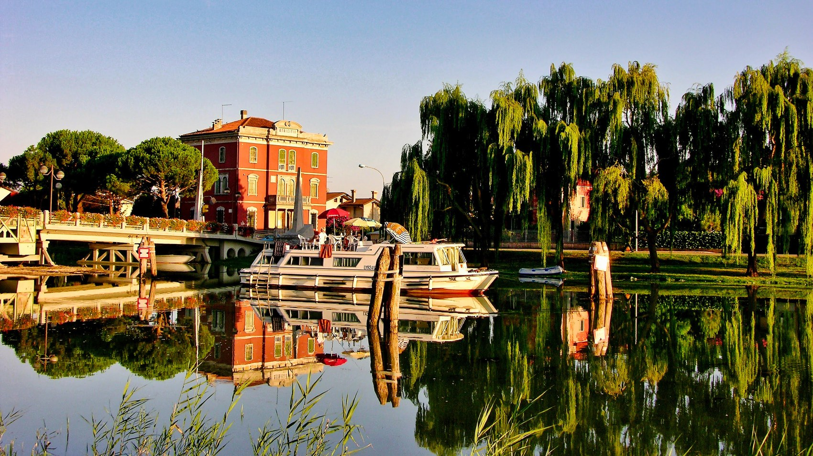
  <em>Around Jesolo</em>
</figure>

## Day 2 — 2 Aug — 94 km

*Caorle – Latisana – Ronchi – Monfalcone*

Another dead-flat day, this time with a headwind, and neither the
scenery nor the culture offered much to get excited about; mostly we
ground along the busy SS14. Still, as everywhere in Italy, you can get a
superb cappuccino in virtually any bar along the way, and that counts
for something.

We spent the night in the very basic Hotel alla Carlina on the SS14 at
the entrance to Monfalcone. The room (€48) was old-fashioned but
functional, and came with a large balcony.

## Day 3 — 3 Aug — 75 km

*Monfalcone – Trieste – Basovizza – Kozina – Obrov*

The flat part was over today: just outside Monfalcone the Trieste
Riviera begins, a very pretty, green, steep coastline where the SS14
runs high above the sea. Under normal circumstances it would have meant
glorious views. Unfortunately, the weather was miserable: rain, cold,
and leaden skies, easily one of the worst August days in years on this
stretch of the Mediterranean.

<figure>
  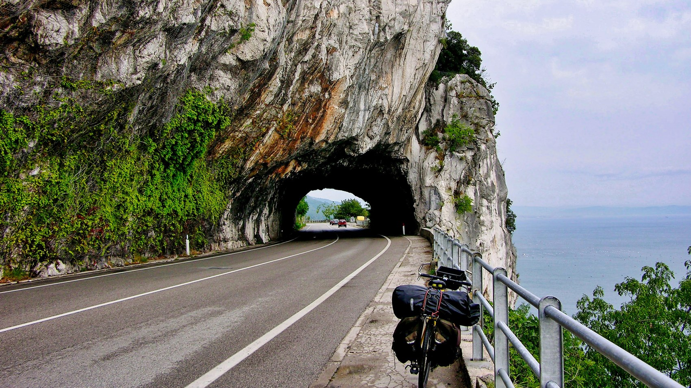
  <em>Riviera di Trieste</em>
</figure>

We did manage to use a longer dry spell in the morning to sit outside in
one of Trieste’s wonderful cafés and have a quick look around. Despite
being on the Mediterranean, Trieste feels more Central European, hardly
surprising given its history. Either way, it’s an attractive city:
beautifully set, with plenty of splendid 19th-century buildings and that
famous café culture. Trieste is always worth a visit.

<figure>
  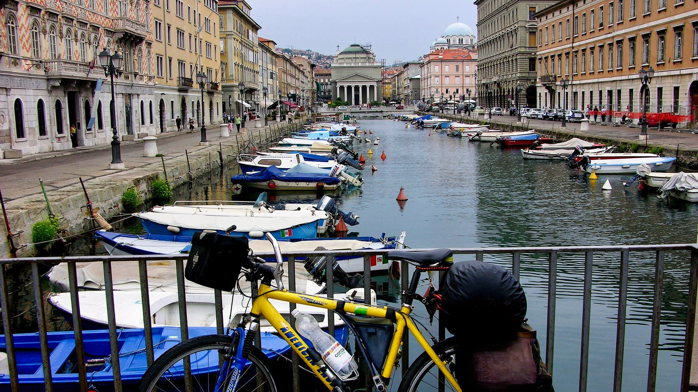
  <em>Trieste</em>
</figure>

After the city, it was kilometres of steep climbing up to the Slovenian
border at 500 metres. A thoroughly nasty stretch: narrow road, lots of
lorries. In the last sizeable place before the border, the already very
Slovenian-feeling Basovizza, we ended up taking an unexpectedly long
lunch break as heavy rain returned. At least the village had Trattoria
alla Pesa, which produced a huge portion of delicious calamari with
chard and a potato-and-rocket salad (€13). And Ice Café served some of
the best ice cream I’ve ever eaten.

<figure>
  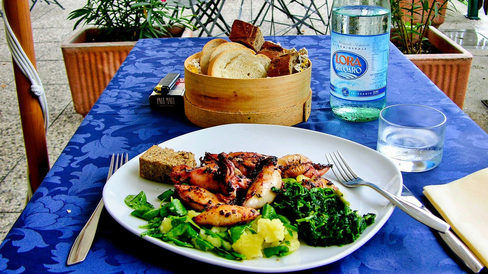
  <em>Bassovizza - Trattoria alla Pesa</em>
</figure>

Across the border the road ran through green, rolling hills, mostly
short climbs and descents, and despite rough tarmac and plenty of
lorries it was still rideable. Luckily the rain eventually gave up. We
stayed at Motel Finida right by the road, but in lovely countryside. For
a motel, both the rooms (€40) and the restaurant and bar were rather
smart and tastefully done. The food was cheap and very good: spit-roast
suckling pig (1100 SIT) and grilled calamari (1300 SIT).

<figure>
  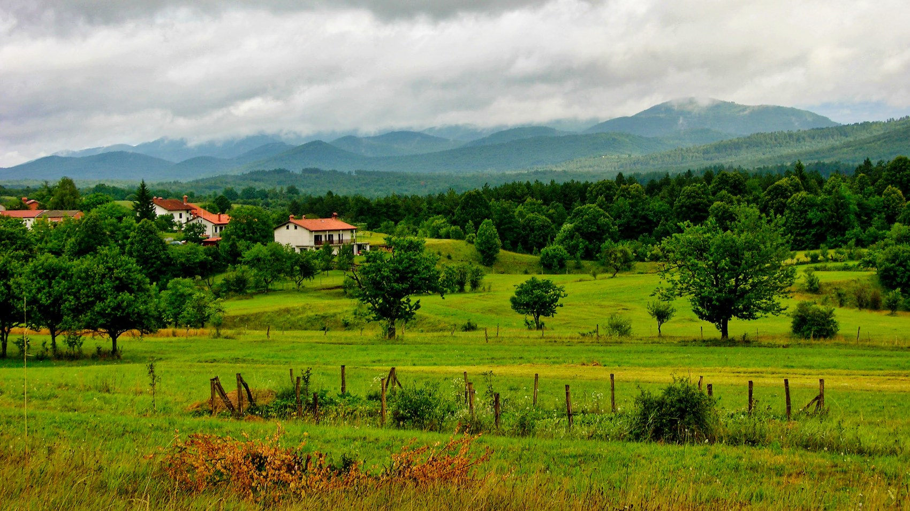
  <em>Slovenian Countryside</em>
</figure>

## Day 4 — 4 Aug — 98 km

*Obrov – Rijeka – Crikvenica*

It rained all night. At 10 a.m. it still hadn’t stopped, so we set off
anyway, riding in driving rain and cold for the first 40-odd kilometres
to Rijeka, hilly and generally uphill to the Croatian border, followed
by a long descent down to the coast.

Once we reached Rijeka, the rain stopped for the first time and it was
just about warm enough to sit in a street café. The big, hectic port
city isn’t much to look at overall, except for Korzo: a long, wide
pedestrian zone with a few handsome façades and cosy street cafés that
were packed even in this miserable weather.

<figure>
  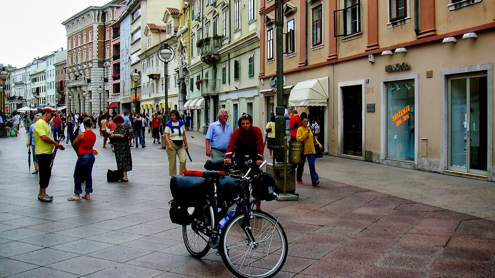
  <em>Rijeka</em>
</figure>

After Rijeka we joined the Adriatic Highway, with some long but not
particularly steep climbs and descents. Traffic on the sometimes quite
narrow road was a disaster, lorries and holiday traffic, but the views
of Krk and the coastline below were lovely. In the afternoon we had our
usual lunch in a tavern on the highway above the Bay of Bakar: tasty
seafood risotto (40 K), grilled squid (40 K) and meat skewers (27 K).
Overnight in a private room (sobe) just above the road shortly before
Crikvenica: 200 Kuna for a simple room with kitchen and bathroom.

<figure>
  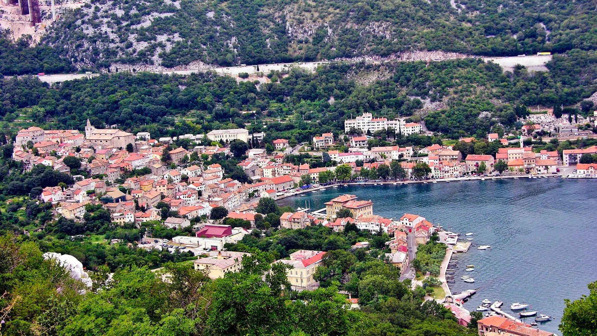
  <em>Bakar</em>
</figure>

<figure>
  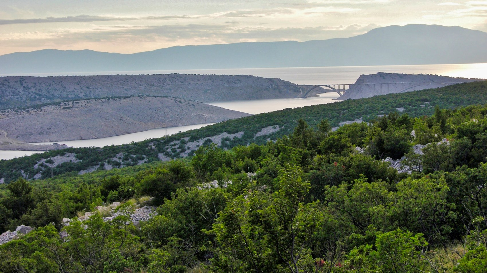
  <em>Kvarner Gulf - Adria Magistrale</em>
</figure>

## Day 5 — 5 Aug — 105 km

*Crikvenica – Senj – Jablanac – Rab*

The first 40 kilometres to Senj were easy riding. The road stayed mostly
right along the coast, very hilly but without truly long climbs, and
with less traffic than yesterday. The views were fabulous all along the
Adriatic Highway: a nearly bare island world in deep-blue sea.

  <figure>
      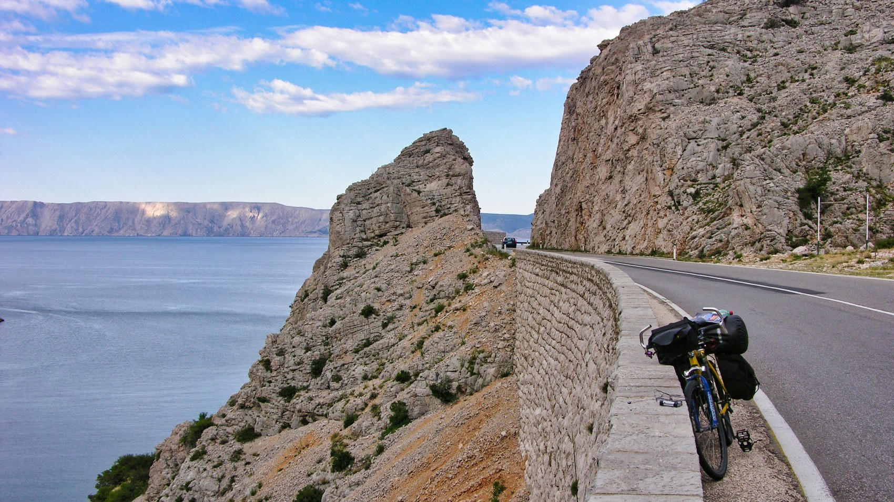
      <em>Kvarner Gulf - Adria Magistrale</em>
    </figure>

  <figure>
      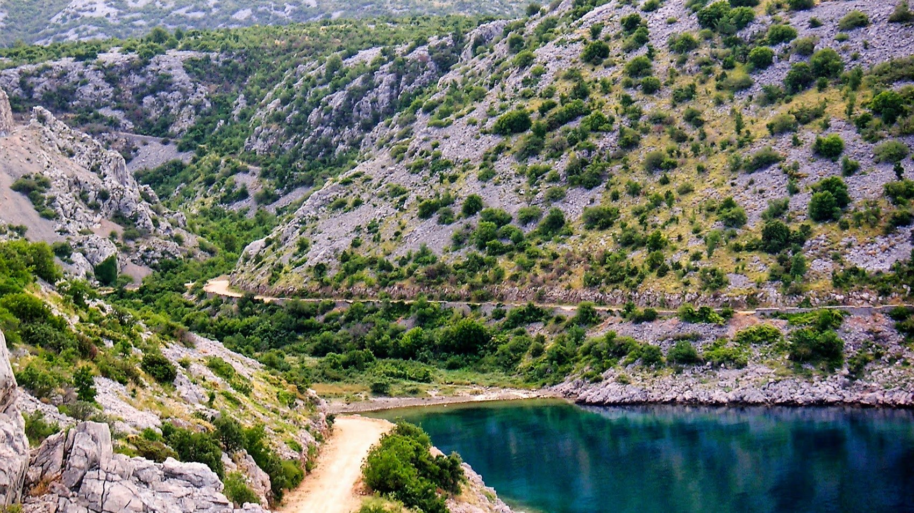
      <em>Kvarner Gulf - Adria Magistrale</em>
    </figure>

<figure>
  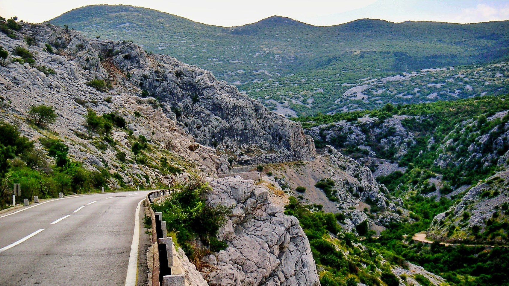
  <em>Kvarner Gulf - Adria Magistrale</em>
</figure>

We spent the morning in Senj, maybe not Croatia’s most visually
impressive harbour town, but certainly one of the most dramatically
located, right under the massive coastal mountains, opposite the island
of Krk. In the old town there were a few cafés and konobas, but far
fewer than in more touristy places. Down at the harbour it was less
pleasant, thanks to the busy main road running right along the water.

<figure>
  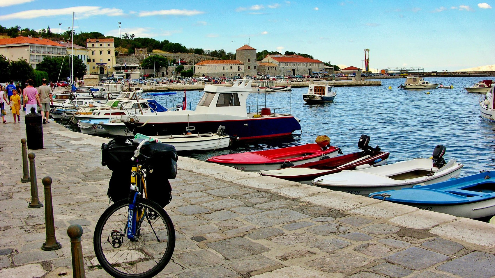
  <em>Senj</em>
</figure>

We ate tasty mussels (50 K) and a very average risotto nero (50 K) in
friendly Konoba Stari Grad. The next 40 kilometres to Jablanac were much
more demanding than the earlier stretch, and just as spectacular. It
was kilometres of climbing, with dream views of Rab, Krk, Pag and almost
the whole Kvarner island world.

  <figure>
      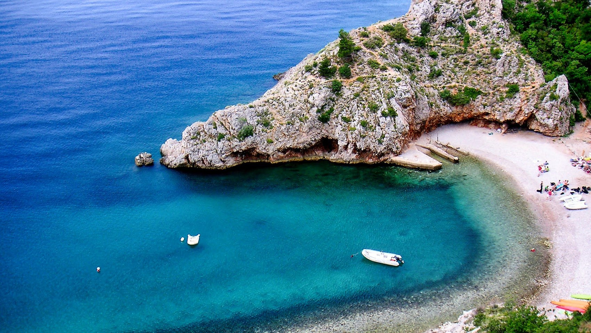
      <em>Kvarner Gulf - Adria Magistrale</em>
    </figure>

  <figure>
      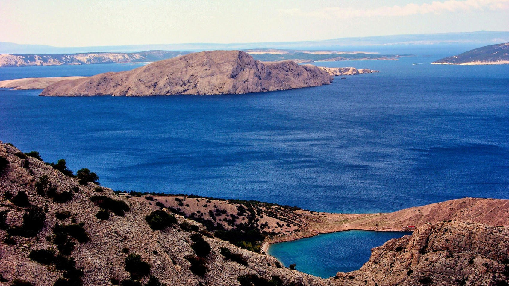
      <em>Kvarner Gulf - Adria Magistrale</em>
    </figure>

Up on the ridge the wind today was sometimes so extreme (Bora in
summer?) that it nearly blew me off the bike several times and down the
slope, luckily mostly from behind or the side. When gusts hit head-on,
riding was simply impossible. A long descent finally brought us into the
picturesque little village of Jablanac, where we took the ferry to the
island of Rab. The crossing (10 K) took only about 20 minutes.

  <figure>
      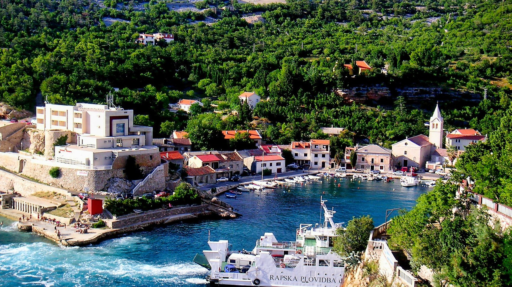
      <em>Jablanac</em>
    </figure>

  <figure>
      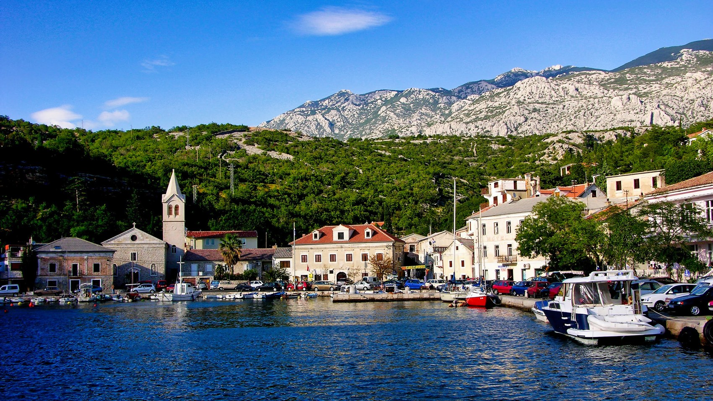
      <em>Jablanac</em>
    </figure>

The remaining 10-plus kilometres on Rab to Rab Town were scenic but very
hilly, with lots of short, steep climbs and drops. Rab is, at first
glance quite rightly, one of the prettiest little towns on the Adriatic,
with its picturesque old town and palm-lined harbour promenade, but
right now it’s terribly hectic and overcrowded. We also arrived quite
late, so there wasn’t much time to explore before dark.

  <figure>
      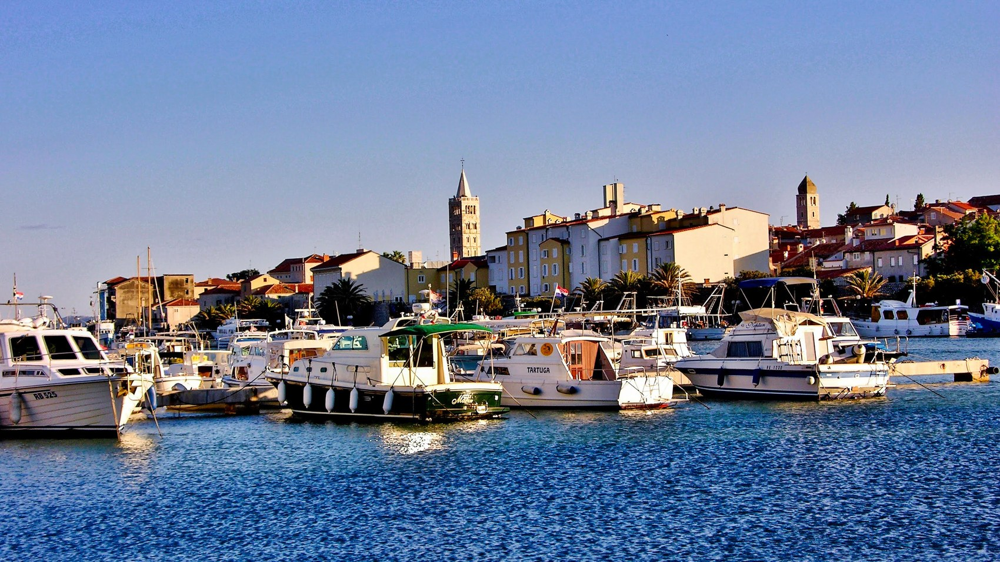
      <em>Rab Town</em>
    </figure>

  <figure>
      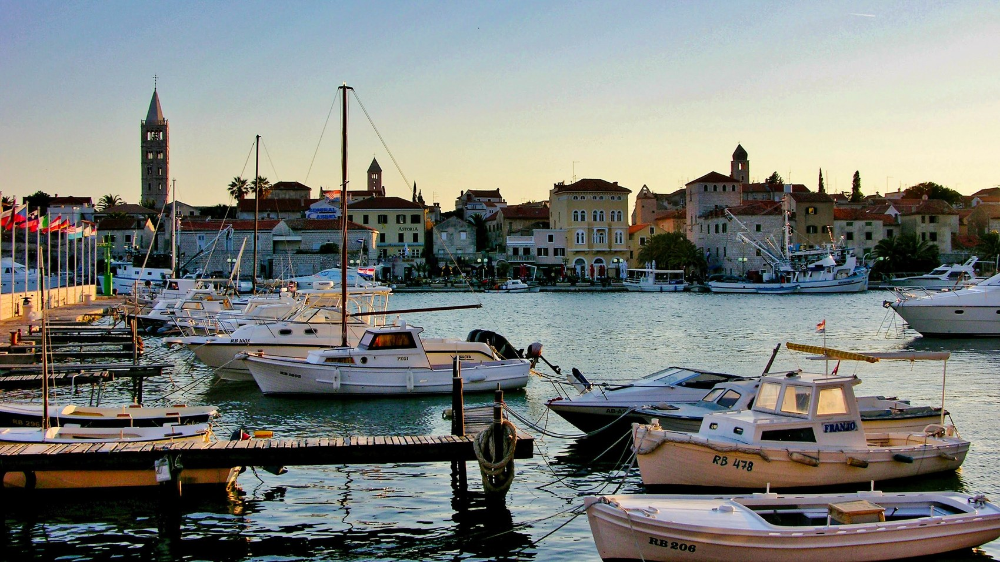
      <em>Rab Town</em>
    </figure>

Dinner, however, was an excellent choice: on the lovely terrace of
Konoba Labirint in a narrow old-town alley. A fish platter with two
grilled fish, calamari, mussels, scampi and risotto (220 K for two).
Finding a room was a bit of a challenge: many places were full, and most
wouldn’t rent for just one night. After some asking around we did manage
to find something decent and close to the old town for 120 K p.p.

## Day 6 — 6 Aug — 69 km

*Rab – Lun – Pag – Dinjista*

Because the only ferry to Pag didn’t leave until noon, we had plenty of
time in the morning for a proper look around. Rab really is beautiful, 
architecturally and in terms of setting, and in the morning it wasn’t
yet so frantic and crowded.

<figure>
  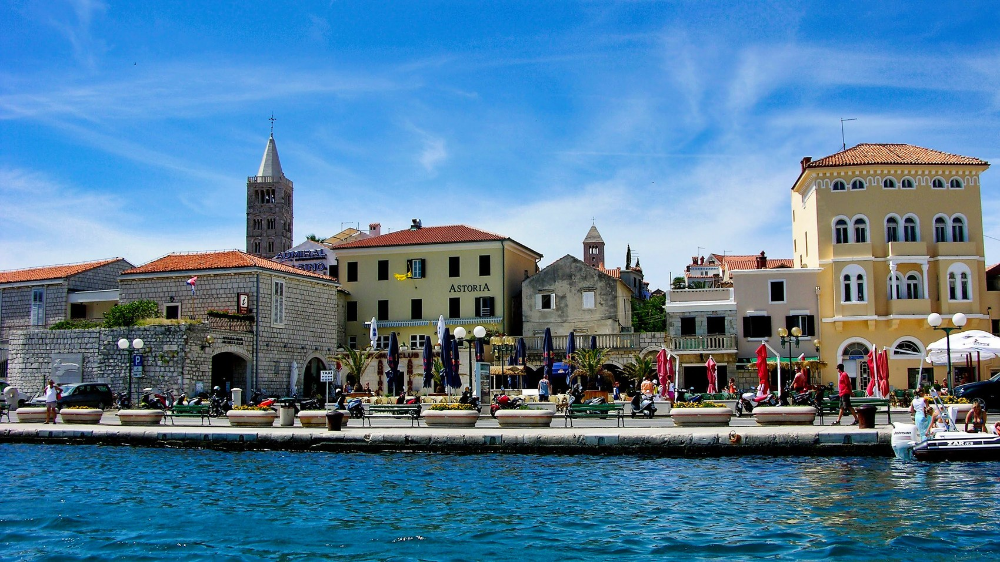
  <em>Rab Town</em>
</figure>

The best café in town is Astoria, wonderfully placed right on the main
square, with extremely comfortable armchairs and excellent cappuccino (7
K). Before leaving Rab we had a bite to eat at Vinoteka Paradiso, the
chicest, most stylish place in town in terms of ambience and interior,
with a lovely patio. Unfortunately the food was a bit uninspired and
overpriced (octopus salad 70 K; grilled squid 80 K).

The “ferry” to Pag turned out to be an overcrowded old motorboat, while
our bikes were transported separately in a little cargo barge to Lun,
the northern tip of Pag. Everything felt highly improvised, I almost
felt like I was back in Southeast Asia. The crossing (60 K) took about
an hour and was very pleasant; from the bow, where we sat, we had
terrific views.

<figure>
  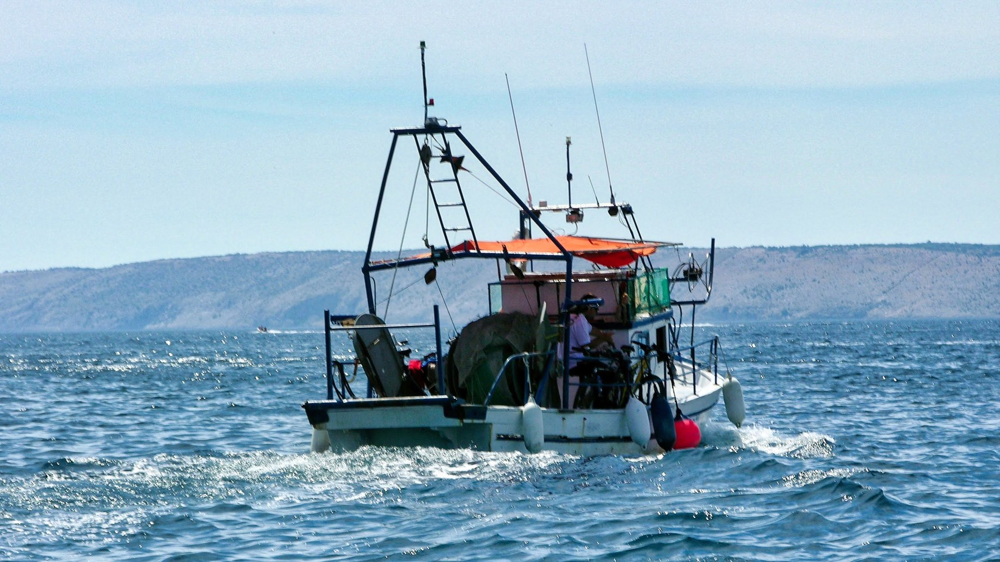
  <em>Rab - Lun Ferry</em>
</figure>

The first 20 kilometres on Pag were a rollercoaster on a quiet, partly
poor road through bleak, dry-stone-wall scenery, with sea views on both
sides. Near Novalja we reached the busier main road, which twice crossed
the island’s central ridge in long climbs and descents, with wonderful
views of the mainland mountains on one side and a multitude of little
islands on the other, before finally dropping in steep hairpins down to
Pag Town.

  <figure>
      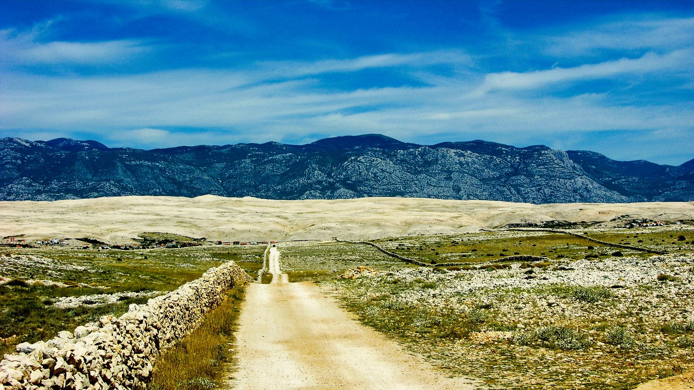
      <em>Pag Island</em>
    </figure>

  <figure>
      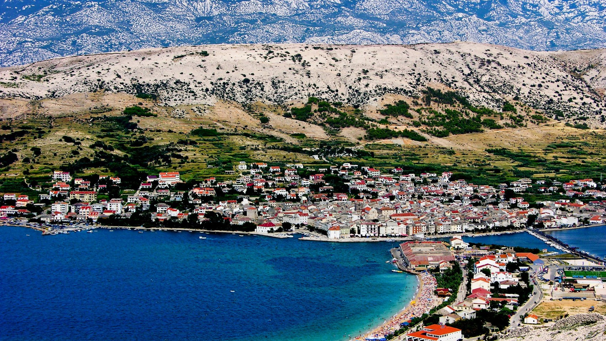
      <em>Pag Island</em>
    </figure>

The island’s main town, bright and Renaissance in style, may not have
the grandeur and beauty of some other Croatian island capitals, but it’s
still very pretty. In a few winding lanes it even feels quite unspoilt, 
a place that turns into a tourist hub in the short summer season, yet
where locals still live normal lives.

We had dinner in prime position on the harbour promenade at Restaurant
Dubrava: Paški sir (35 K), of course, the island’s famous sheep’s
cheese; Dalmatian air-dried ham (40 K); and two large grilled sardines
with chard and potatoes (40 K), which even I liked. A very good choice.

Afterwards we cycled another 15 kilometres south, an easy ride with a
tailwind and hardly any climbing. In Dinjista we pitched our tent at
Kamp Milka: more the garden of a private house than a campsite, tiny,
with grassy pitches right by the sea and good toilet and shower
facilities (100 K). Beautiful.

## Day 7 — 7 Aug — 74 km

*Dinjista – Zadar – Preko – Tkon – Biograd*

The first 20 kilometres weren’t technically demanding, but with the
gusty wind blasting down from the mainland they were barely rideable.
Over the next 20 kilometres inland to Zadar we at least had the wind at
our backs, though the road was very hilly.

Zadar is a large city (by Croatian standards) with two faces. The modern
part is unattractive, with many surprisingly run-down prefab blocks. The
old town, enclosed and largely ringed by fortifications, is one of
Dalmatia’s tourist highlights, and on this August Sunday it was
accordingly packed and busy. The whole area is car-free, with paths
partly paved in polished marble. The prettiest piazzas and lanes are
blessed with countless street cafés: ideal for people-watching.

<figure>
  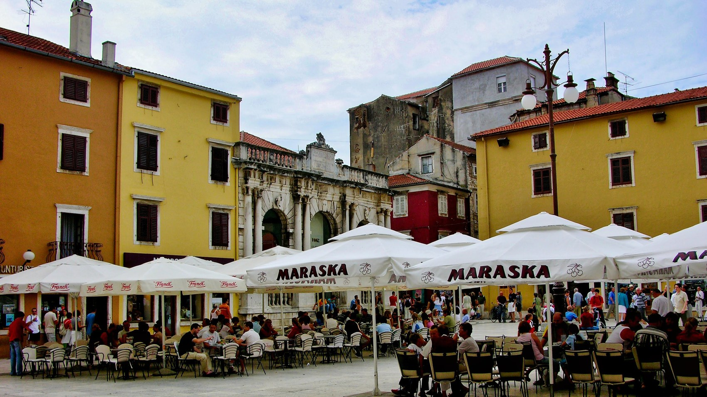
  <em>Zadar</em>
</figure>

We ate a small lunch in one of the few restaurants in the old town and
missed the ferry to Preko by less than a minute, which earned us another
75 minutes of killing time in Zadar. Meanwhile the already rather dull
weather deteriorated further, and shortly after the 20-minute crossing
(29 K) to the island of Ugljan it started pouring and didn’t stop.

The 30 kilometres across Ugljan and Pašman would undoubtedly have been a
pleasant ride (nice scenery, no dramatic climbs, the sea always in
view, little traffic), but I couldn’t enjoy any of it. It was bucketing
down, everything grey on grey, and by the time I reached Tkon I was
soaked through and shivering with cold (August in Croatia!).

<figure>
  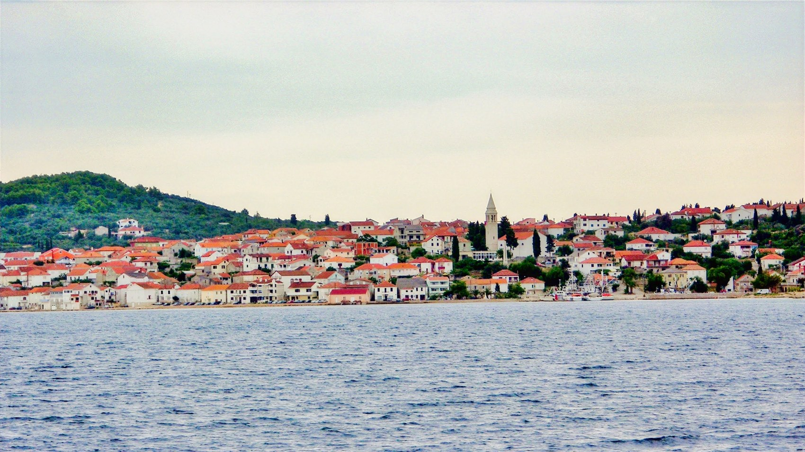
  <em>Ugljan Island</em>
</figure>

We took the ferry back to the mainland to Biograd (15 min, 20 K), a
pretty town in a beautiful setting… in theory… because today it didn’t
matter in the slightest. I just wanted to get out of the rain: a decent
room and a hot shower. An agency sorted us out quickly; we moved into a
room in the old town, quite pleasant, with a nice (though shared)
bathroom, for €38.

Dinner at friendly and very popular Restaurant Guste around the corner
was excellent: both the mussels (60 K/kg) and the very generous seafood
platter (90 K).

## Day 8 — 8 Aug — 120 km

*Biograd – Šibenik – Primošten – Marina – Seget Donji*

With bright sunshine in the morning I naturally treated myself to a
cappuccino on Biograd’s lovely harbour promenade before setting off,
south on the highway towards Split. Gentle hills, easy riding and fine
views of the Kornati islands marked the first 50 kilometres to Šibenik,
where we took a long lunch break.

  <figure>
      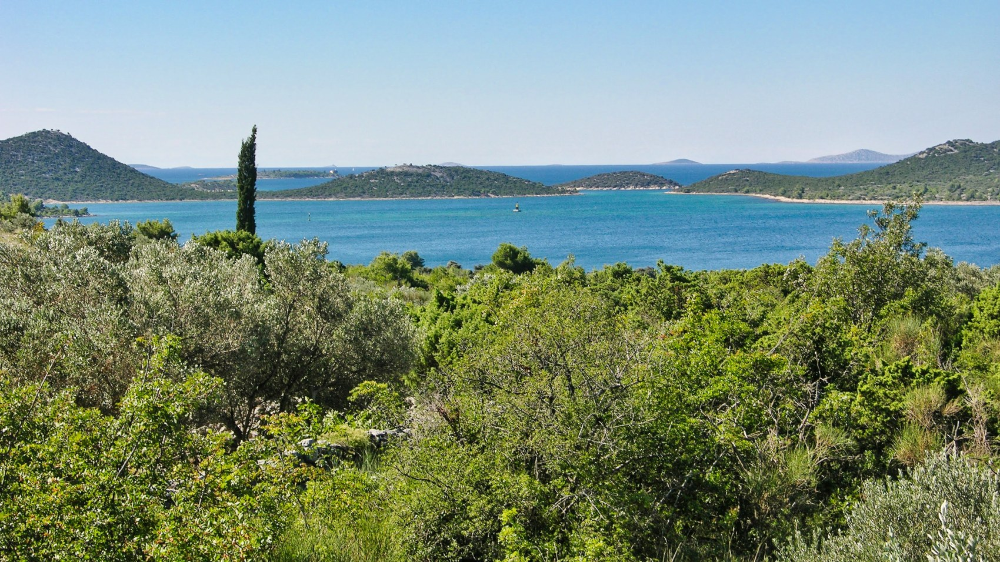
      <em>Dalmatia - Adria Magistrale</em>
    </figure>

  <figure>
      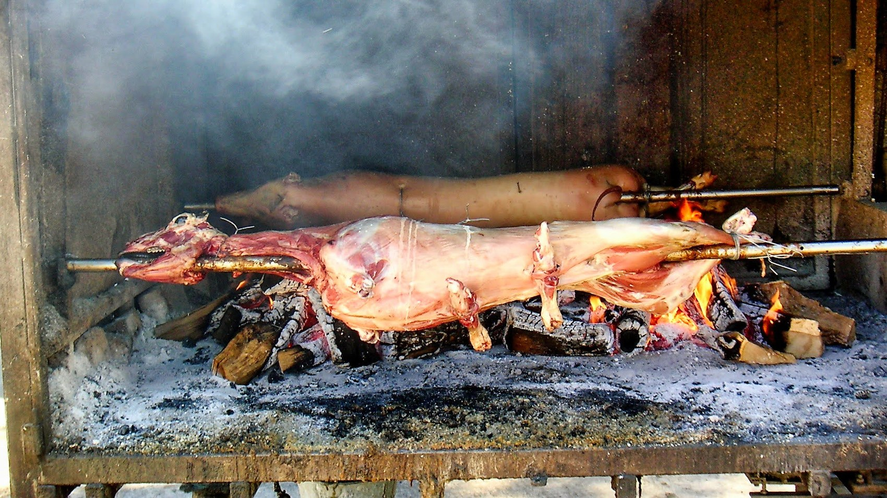
      <em>Dalmatia - Adria Magistrale</em>
    </figure>

From the bypass road, which we luckily avoided, Šibenik looks like one
of the ugliest cities in Europe, with industrial plants and prefab
blocks beyond description. The historic centre by the sea, however, is
perhaps Croatia’s finest old town (fairy-tale Dubrovnik excepted):
clinging to the hillside above the harbour, a labyrinth of winding
alleys and steps, a fortress, café-lined piazzas and unspoilt stone
houses. Naturally it was heaving today, too.

<figure>
  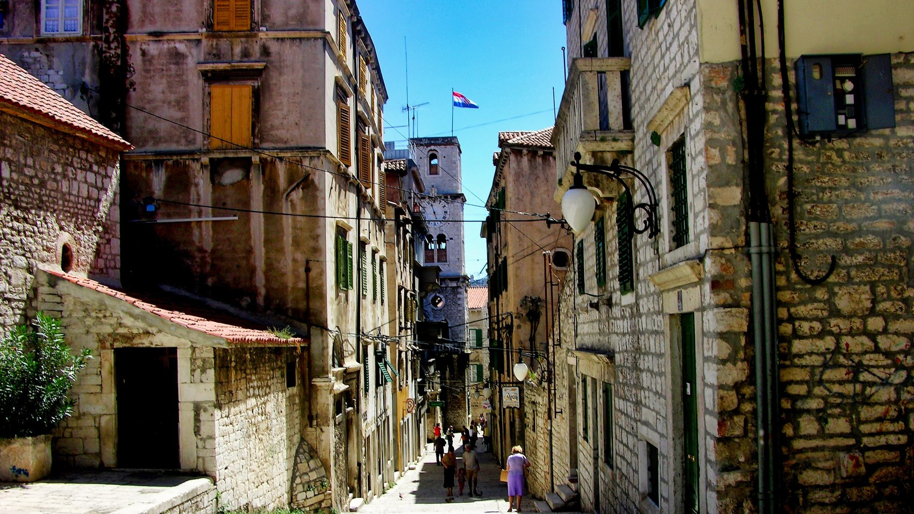
  <em>Sibenik</em>
</figure>

We had an excellent Dalmatian lunch at Highland Pub, despite the name:
mussels in tomato-onion sauce (60 K) and a large portion of delicious
grilled calamari (88 K). Highly recommended.

The next stage to Primošten was pure enjoyment: always right along the
coast, blazing sunshine, turquoise sea, the offshore islands, a feast
for the eyes. Primošten itself lies slightly off the road on a
peninsula: a charming little town, partly enclosed by walls, with a
palm-lined harbour promenade and cosy cafés. From above, from the
viewpoints along the road, Primošten looks utterly stunning, mainly
thanks to its setting in gorgeous scenery.

  <figure>
      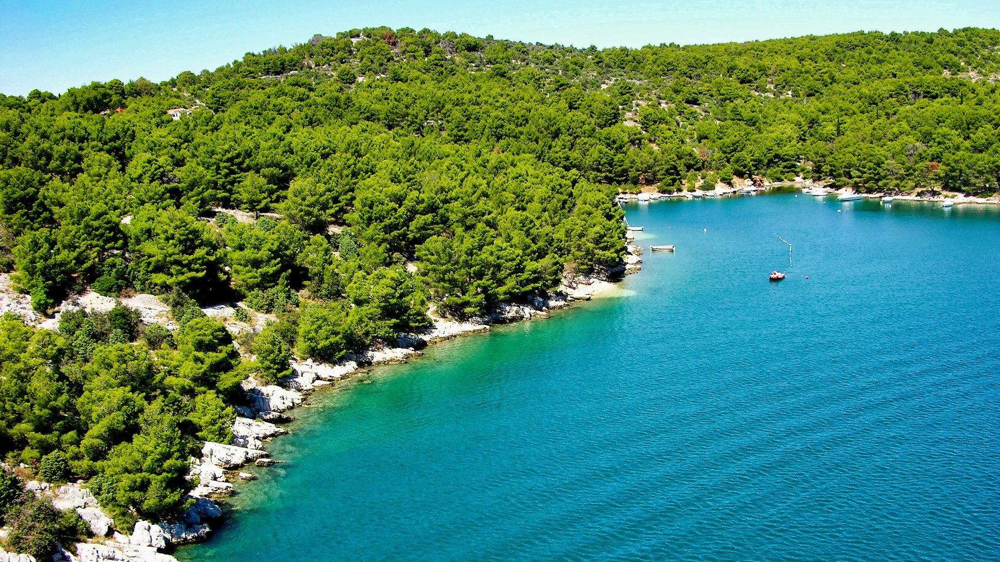
      <em>Dalmatia - Adria Magistrale</em>
    </figure>

  <figure>
      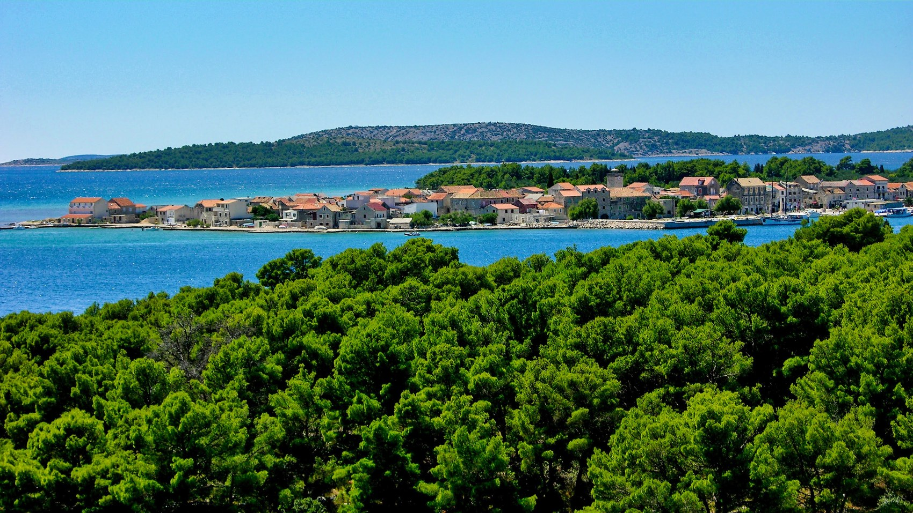
      <em>Dalmatia - Adria Magistrale</em>
    </figure>

<figure>
  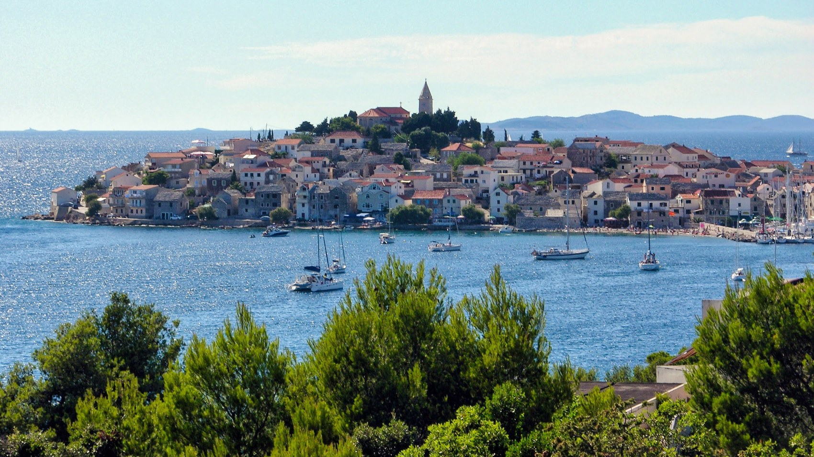
  <em>Primosten</em>
</figure>

The hilliest part of the day was between Primošten and Marina, where the
road left the coast for about 20 kilometres before returning to the
water near the pretty little town of Marina. In terms of both scenery
and weather, today was the high point of the tour so far.

We stayed in a lovely private room with an enormous sea-view terrace
(200 K) in Seget Donji, just before Trogir. From the road it doesn’t
look like much, but it’s a real insider tip. Down by the sea Seget has a
small old town with a wonderfully unforced atmosphere, few tourists, and
very cheap cafés and konobas. So close to the tourist bustle of Trogir
and Marina, you could still watch unfiltered Dalmatian life.

We also ate very well at the friendly Konoba Rico with a large grill:
delicious ćevapčići (32 K) and a whole grilled fish (70 K). Cheap and
good, and in a great atmosphere.

## Day 9 — 9 Aug — 98 km

*Seget Donji – Kaštela – Omiš – Makarska*

The first 20-odd kilometres to Split’s multi-lane bypass were flat and
uneventful on a rather bumpy road. We left Split to one side and
continued south along the Adriatic Highway.

<figure>
  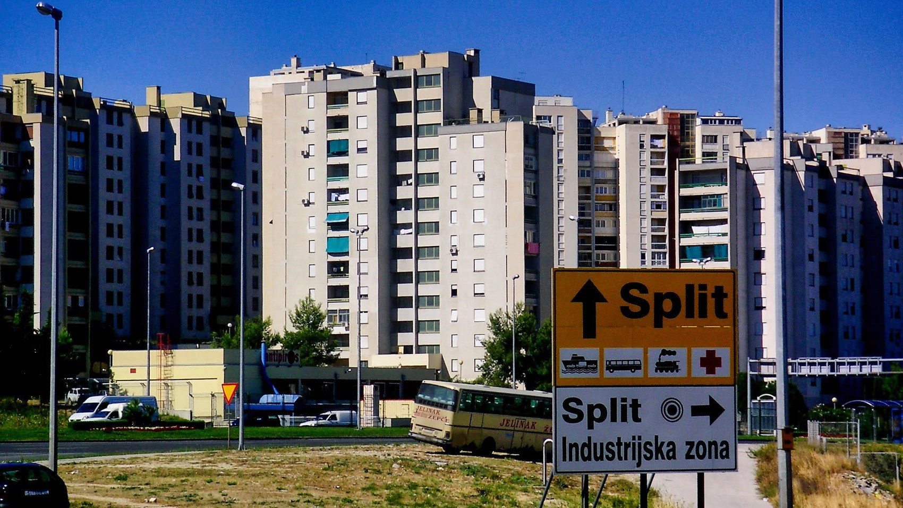
  <em>Split</em>
</figure>

The roughly 30 kilometres to Omiš would have been a relaxed ride, 
mostly right by the sea, only gently hilly. Unfortunately the traffic
was so heavy that it often backed up; on a narrow road it isn’t always
easy to find a gap on a bicycle. It’s about time work started on a
motorway to Dubrovnik; in summer the highway is hopelessly overloaded.

<figure>
  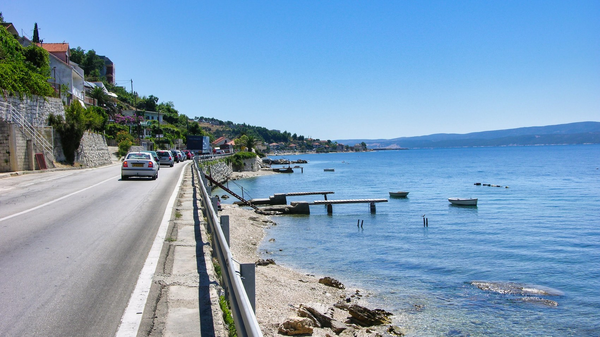
  <em>Dalmatia - Adria Magistrale</em>
</figure>

The coast here is pretty, but heavily built up. Omiš, despite some ugly
holiday complexes and prefab blocks, is a very attractive place, with an
old-town core at the dramatic mouth of the Cetina where the gorge
begins.

  <figure>
      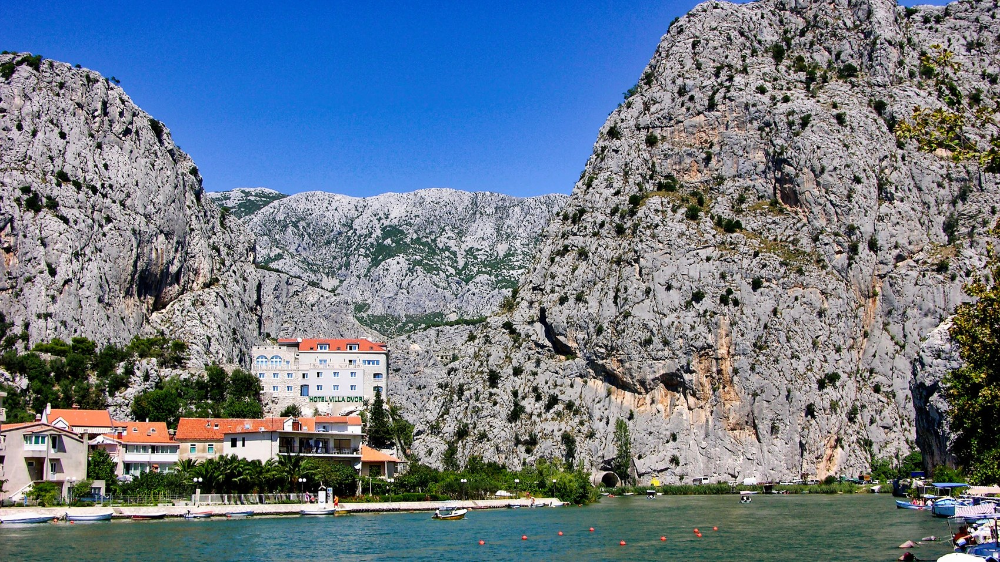
      <em>Omis</em>
    </figure>

  <figure>
      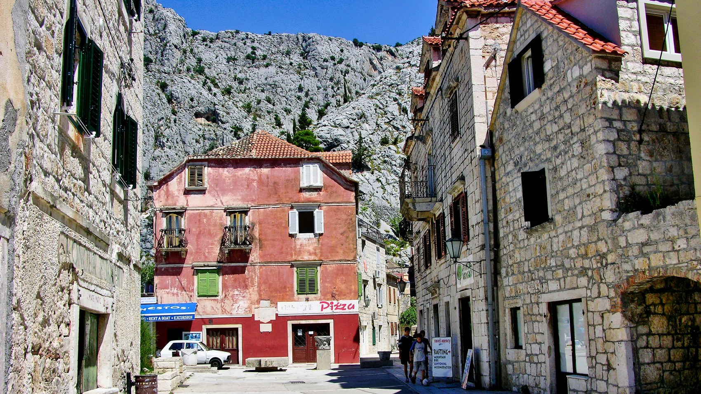
      <em>Omis</em>
    </figure>

After Omiš the remaining stretch to Makarska was wonderfully scenic, but
also quite hilly, with some long climbs. The views were fantastic almost
the whole way: dramatic mountains, fine bays with countless beaches,
deep-blue sea and the island of Brač. The road usually ran high above
the water, with small settlements scattered below along the coast.

  <figure>
      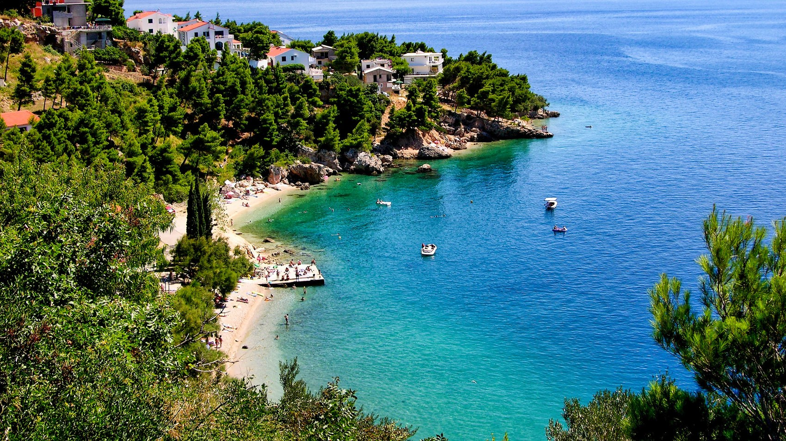
      <em>Dalmatia - Adria Magistrale - Makarska Riviera</em>
    </figure>

  <figure>
      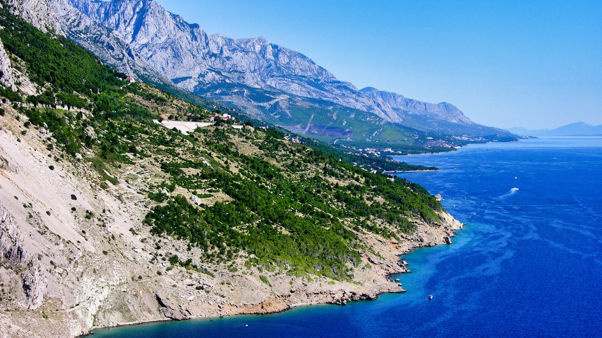
      <em>Dalmatia - Adria Magistrale - Makarska Riviera</em>
    </figure>

The Makarska Riviera is, for good reason, one of Croatia’s main tourist
areas, and Makarska itself is a single big funfair, but a uniquely
beautiful one: set on an almost circular bay right beneath an imposing
rock massif. A few unattractive hotel and apartment blocks spoil the
overall picture, but the old town is gorgeous.

  <figure>
      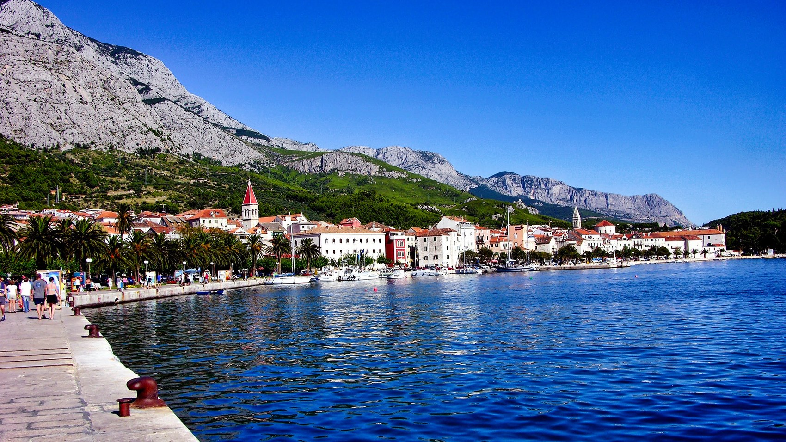
      <em>Makarska</em>
    </figure>

  <figure>
      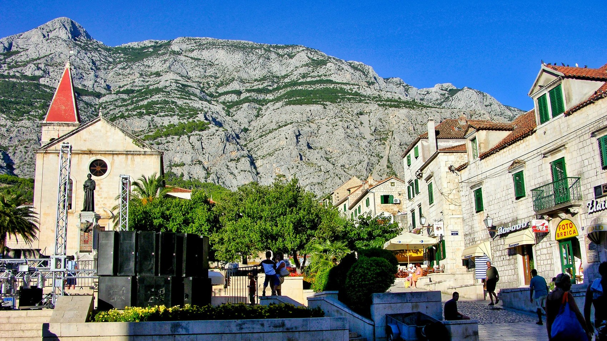
      <em>Makarska</em>
    </figure>

<figure>
  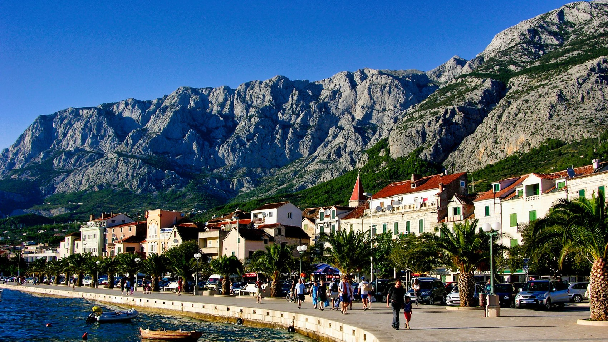
  <em>Makarska</em>
</figure>

Given the fierce competition (there must be hundreds of cafés and
restaurants, often very tastefully done), Makarska’s prices are
surprisingly low. Even on the harbour promenade you pay only 6 Kuna for
a macchiato, including at stylish, comfortable Pink Panther Café on the
main square.

Finding a room was, unsurprisingly, difficult, but via an agency we did
secure accommodation, high up on the slope, but only ten minutes from
the harbour: 200 Kuna for a decent room with a small bathroom.

We had another excellent dinner at Gostionica Mondo, a friendly grill
place near the beach: calf’s liver (45 K) and grilled calamari (60 K),
plus Šopska salad (20 K) and mussels (50 K).

## Day 10 — 10 Aug — 39 km

*Makarska – Sumartin – Bol – Jelsa*

A broken spoke stopped us from riding further down the highway to
Drvenik as planned and crossing to Hvar from there. Since we couldn’t
get the bike fixed in Makarska, we decided to minimise wear and tear and
just get to Split. At 10:30 we took the ferry to Sumartin on Brač (25 K
p.p., 29 K for the bike).

<figure>
  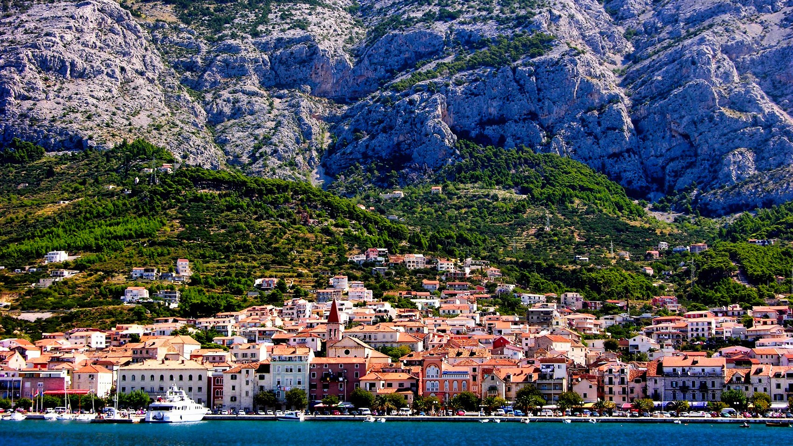
  <em>Makarska</em>
</figure>

<figure>
  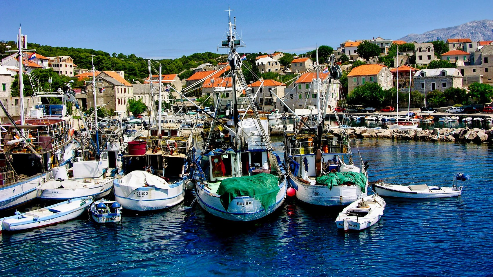
  <em>Brac Island - Sumartin</em>
</figure>

The 25 kilometres to Bol on the island’s south side were very demanding:
kilometres of climbing up to almost 500 metres, followed by a glorious
eight-kilometre serpentine descent down to the sea, with fantastic views
of Hvar opposite, the town of Bol and the famous “Golden Horn”.

  <figure>
      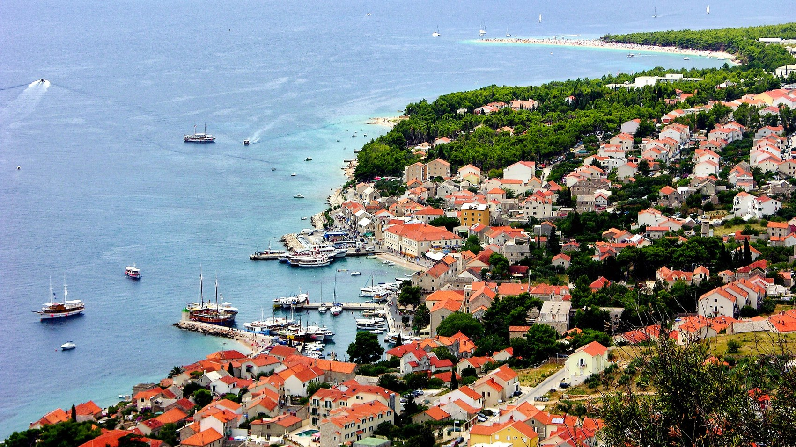
      <em>Brac Island - Bol</em>
    </figure>

  <figure>
      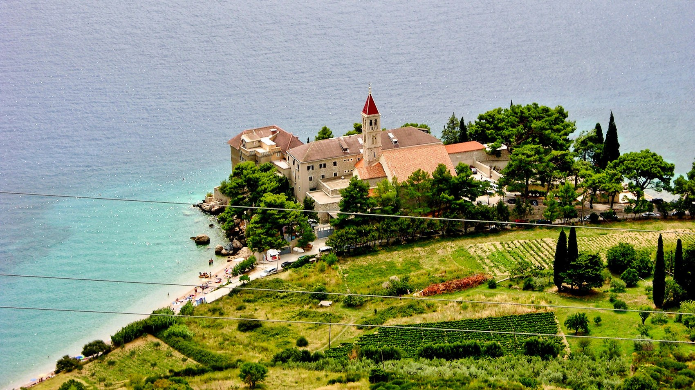
      <em>Brac Island - Bol</em>
    </figure>

<figure>
  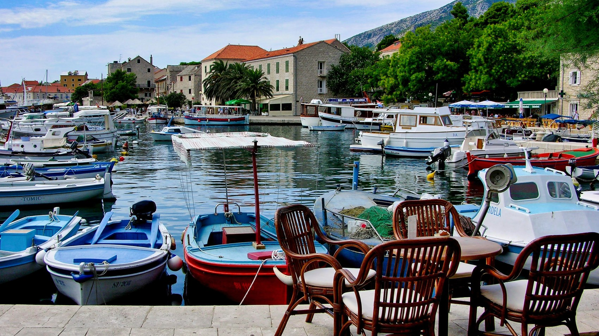
  <em>Brac Island - Bol</em>
</figure>

This beach, one of Croatia’s most-postcarded motifs, was a slight
disappointment, though less because of the beach itself than because it
was so overcrowded you could hardly make it out, let alone see anything
“golden”. In the off-season, as the postcards suggest, the Golden Horn
must be rather picturesque.

Bol itself is picturesque even in high season: one of those typically
secluded coastal towns that give Croatia its particular charm. Naturally
it also has plenty of street cafés along the waterfront. In the nicest
of them, the chic, extremely comfortable cocktail bar Varadero, I spent
almost the whole afternoon nursing a good but expensive cappuccino.

We had planned to take the daily Jadrolinija ferry to Jelsa on Hvar at
17:10, but discovered it didn’t take bicycles, despite our best efforts
to talk our way on. No chance. So we chartered a taxi boat to Jelsa
instead. Not cheap (600 K), but the hour-long private ride was one of
the highlights of the holiday, and worth the money.

Jelsa, too, is an incredibly picturesque little harbour town in a small
bay on the south of Hvar. With little hope of finding a free private
room, we went straight to the nearby campsite, also overflowing.
Luckily we still found a tiny spot for our tent behind the sanitary
block, right above the coast. Anything that qualified as somewhere to
sleep.

<figure>
  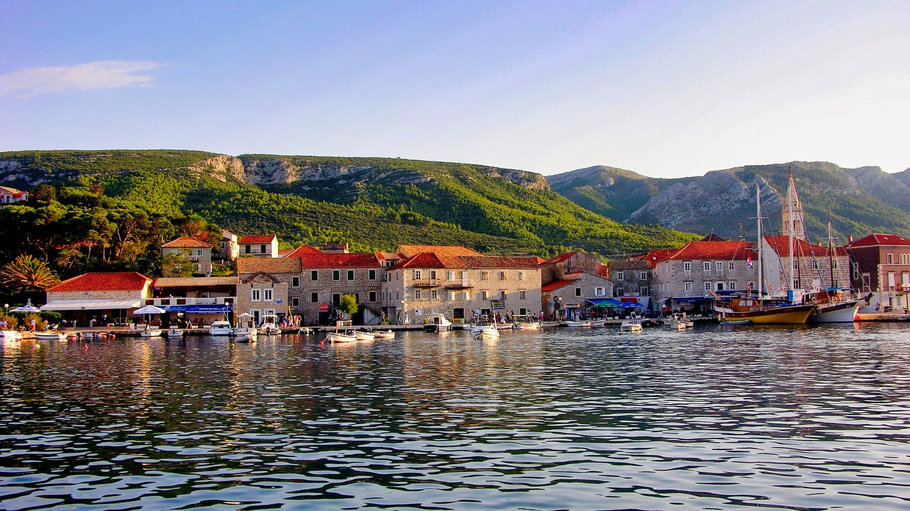
  <em>Hvar Island - Jelsa</em>
</figure>

For dinner we cycled back into town and, for once, didn’t eat the usual
grilled fare: at Taverna Arsenal we had French cuisine with an Asian
twist. Fine frog’s legs Thai-style (48 K), a mixed fish platter (140 K),
and leg of lamb in rosemary sauce (110 K). Not cheap, but a welcome
change from Dalmatian standard cooking.

## Day 11 — 11 Aug — 50 km

*Jelsa – Stari Grad – Hvar – Split – Kaštela*

A fairly easy ride from Jelsa to pretty Stari Grad, Hvar’s main ferry
port, with a nice waterfront promenade and a labyrinthine old town of
stone houses and narrow lanes.

<figure>
  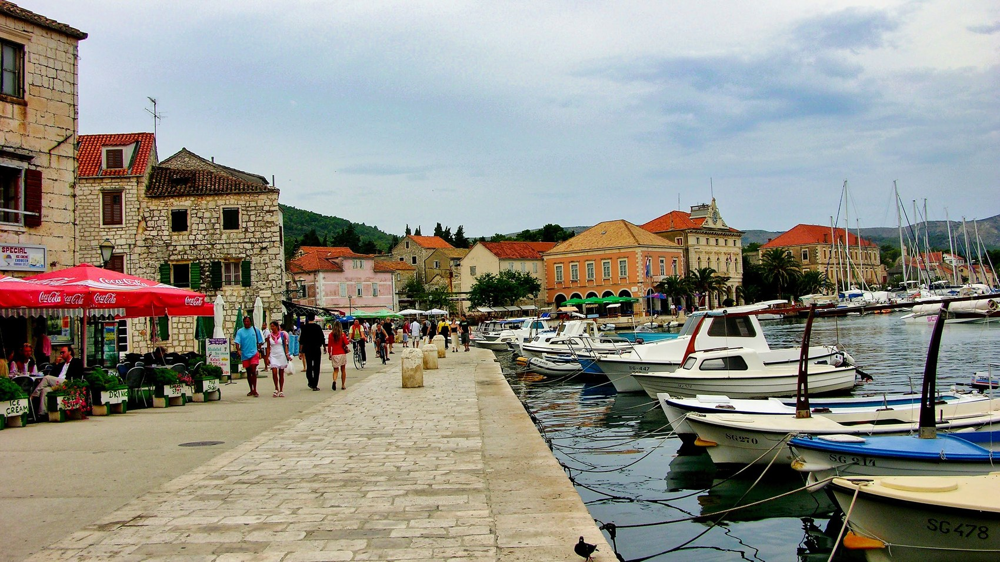
  <em>Hvar Island - Stari Grad</em>
</figure>

From Stari Grad we climbed for a few kilometres to a 1,500-metre tunnel
that leads to the island’s south side. From there it was another 10
kilometres over a very hilly road to Hvar Town, with fine coastal views.

<figure>
  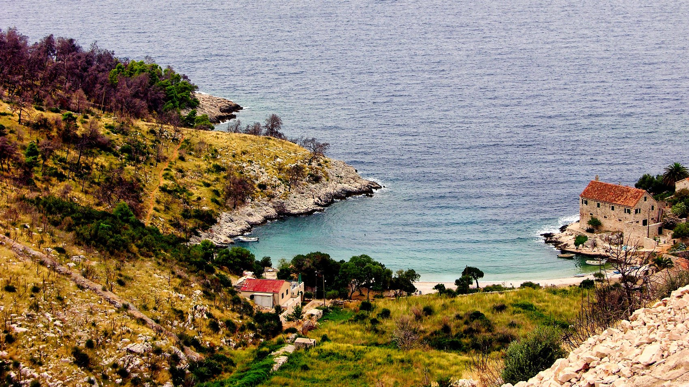
  <em>Hvar Island</em>
</figure>

We had originally planned to stay the night, but found out the
Jadrolinija morning ferry didn’t take bicycles, so we were forced to
rely on today’s afternoon sailing. Not a great tragedy, chances are we
wouldn’t have found a room anyway.

Hvar may be Croatia’s prettiest island town: the fortress above the old
town, the marble-paved piazza, the palm-lined waterfront with chic cafés
and millionaire yachts, the views of the little islands offshore… but in
August it’s also a magnet for every type of tourist, from young
backpackers to the jet set. The place was bursting at the seams, and the
crowds were at times almost stressful. A shame, because I’ve seen Hvar
far less overrun, and it really is a fantastic town.

  <figure>
      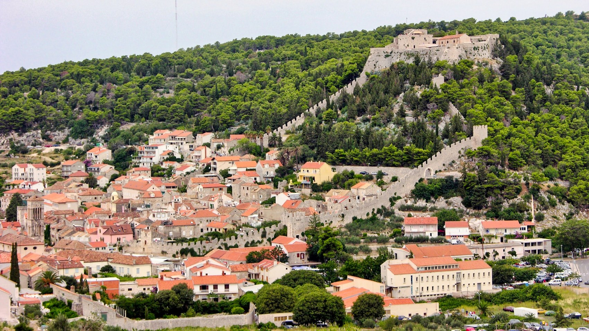
      <em>Hvar Town</em>
    </figure>

  <figure>
      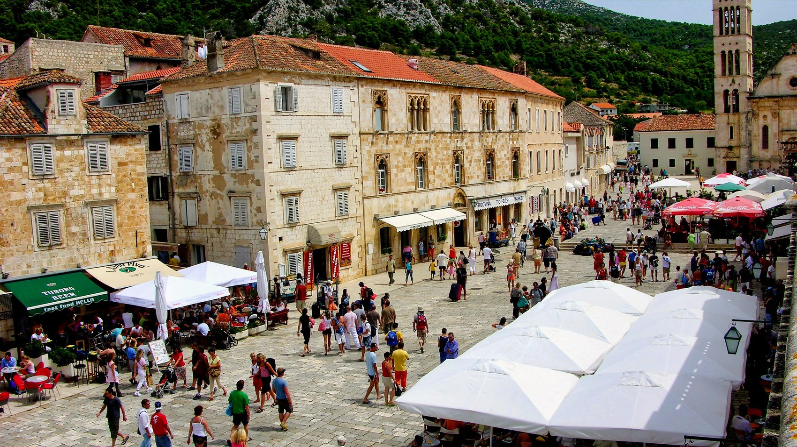
      <em>Hvar Town</em>
    </figure>

Since we had time, we ate lunch at Restaurant Gariful at the end of the
harbour promenade. Good grilled food, including delicious grilled
vegetables (18 K) and octopus (70 K). Also fine: fresh seafood salad (45
K). Slightly weaker but okay: green tagliatelle with scampi (70 K). Fair
prices given the prime spot.

We took the huge ferry to Split at 16:30 (35 K p.p. + 25 K for the bike,
90 minutes) and arrived straight into a thunderstorm, and found no
room. So we rode on through the rain towards Kaštela, along partly
six-lane arterial roads through housing estates and industrial zones, 
so picturesque! Somewhere in one of the Kaštela we finally found a
simple private room for €10 per person.

<figure>
  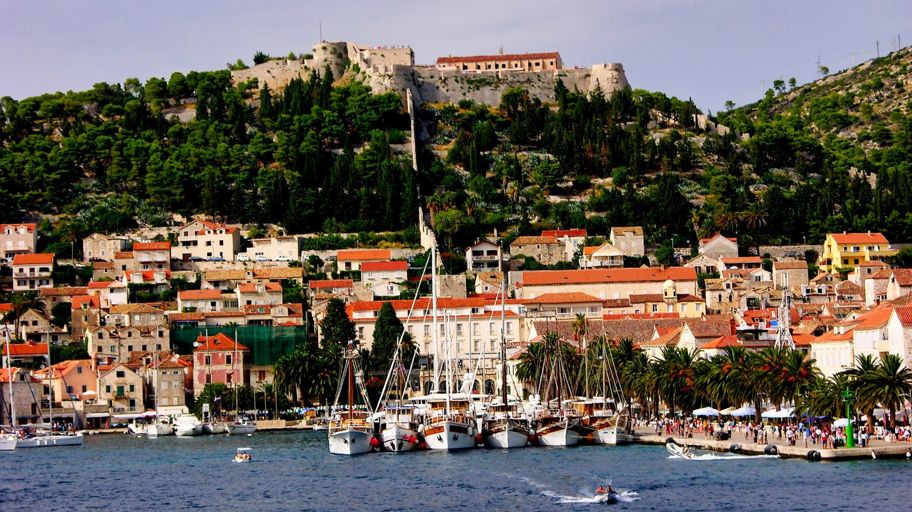
  <em>Hvar - Split Ferry</em>
</figure>

<figure>
  
  <em>Split</em>
</figure>

## Day 12 — 12 Aug — 37 km

*Kaštela – Trogir – Marina*

In charming touristy Trogir (UNESCO World Heritage, after all) we
drank our breakfast coffee on the beautiful palm-lined waterfront
promenade, then rode back to Marina in very changeable weather.

There we took a room already at lunchtime, or rather, Tourist
Information found one for us, because in August it’s almost impossible
to get a free room for just one night. We were lucky and managed to
secure a cosy apartment just outside town with wonderful sea views for
€40.

In the afternoon we cycled back into town and managed to finish dinner
before the big thunderstorm broke. Dinner was, once again, very good, 
in the wonderfully pretty garden of grill restaurant Konoba Hila: a
tasty octopus salad (50 K) to start, then fresh mussels (55 K) and a
delicious whole grilled fish (135 K).

<figure>
  
  <em>Marina</em>
</figure>

## Day 13 — 26 Aug — 50 km

*Split – Vela Luka – Korčula*

Today was the hardest day of the tour so far. Whether that was due to
the two-week holiday break in Sevid, the blazing sunshine at just under
30°C, or the route itself, I’m not entirely sure.

After an excellent cappuccino at cosy F2 on Split’s harbour promenade,
we took the 10 o’clock ferry to Vela Luka on the island of Korčula. The
crossing (29 Kuna p.p. + 31 Kuna for the bike) took 3.5 hours, with a
short stop in Hvar.

Vela Luka is a pleasant, unspectacular place on Korčula’s beautiful west
coast. The first 20 kilometres through the island’s interior were more
rolling than mountainous, but after the little village of Blato things
got serious: kilometres of often steep climbing with little shade, up to
almost 600 metres above sea level.

<figure>
  
  <em>Korcula Island</em>
</figure>

The descent down to Korčula Town was, despite the poor road, pure joy, 
and well earned. Korčula is one of the most famous and prettiest
Dalmatian towns, with its medieval core dramatically set on a rocky
promontory: watchtowers, palazzi and narrow lanes packed with charming
little konobas and cafés.

<figure>
  
  <em>Korcula Town</em>
</figure>

Tonight’s sunset was a dream. Croatian sunsets over the Adriatic islands
are among the most beautiful in Europe, and since the summer has been a
near disaster weather-wise, today was the first completely cloudless
day, which also meant the first unspoilt sunset.

Overnight in a very central private room, too expensive at 300 Kuna,
but with a splendid view of the old-town core and the Pelješac peninsula
opposite.

## Day 14 — 27 Aug — 62 km

*Korčula – Orebić – Trstenik – Polače – Babino Polje*

From the harbour about three kilometres west of town we took the ferry
to Orebić (11 Kuna p.p. + 11 Kuna for the bike) on the Pelješac
peninsula. The crossing took only 20 minutes.

  <figure>
      
      <em>Korcula - Peljesac Ferry</em>
    </figure>

  <figure>
      
      <em>Korcula - Peljesac Ferry</em>
    </figure>

Orebić is a pleasant, unspectacular little town with a few beautiful
fine-pebble beaches. Shortly after town it was kilometres of climbing
into Pelješac’s mountainous interior, a very scenic route past
vineyards, with terrific views back to the coast and the many small
islands between Korčula and Pelješac. Riding-wise it was demanding: back
up to 500 metres, in full sun with little shade, tough.

  <figure>
      
      <em>Peljesac Island</em>
    </figure>

  <figure>
      
      <em>Peljesac Island</em>
    </figure>

<figure>
  
  <em>Peljesac Island</em>
</figure>

A wonderful descent into dreamily situated Trstenik compensated a little
for the effort. From the small town a car ferry left at 14:30 for Polače
on Mljet. I used the waiting time for a swim in the crystal-clear sea,
followed by a small lunch snack, a wonderful risotto nero (60 Kuna) at
Konoba Marin.

<figure>
  
  <em>Peljesac Island - Trstenik</em>
</figure>

Because Achim couldn’t handle the climb and preferred to ride back to
Orebić, I took the ferry to Mljet alone. The crossing (40 Kuna p.p. + 55
Kuna for the bike) took 75 minutes, and I only woke up as we sailed into
the fantastically beautiful bay of Polače.

Mljet is considered the natural paradise among Croatia’s islands, and
it’s easy to see why: lush green, brilliant blue sea, nothing built up.
Even the ferry village of Polače is just a sleepy little place with a
few konobas and cafés on the promenade. Holiday complexes, historic
towns and bustle are nowhere to be found; Mljet is pure, idyllic
nature.

  <figure>
      
      <em>Mljet Island</em>
    </figure>

  <figure>
      
      <em>Mljet Island</em>
    </figure>

<figure>
  
  <em>Mljet Island</em>
</figure>

From Polače I made a short detour into the heart of the island’s
national park: two beautiful inland lakes surrounded by lush vegetation,
perfect for swimming, and also ideal to explore by bike because the
lakeside road is flat and car-free.

Back in Polače, on the narrow main road that crosses the island from
east to west, the route soon climbed into the utterly deserted interior.
Very strenuous, with sometimes very poor road surface, which,
admittedly, adds to the island’s unspoilt feel. The road doesn’t go as
high into the mountains as on Korčula or Pelješac, but the gradients are
often very steep.

Aside from the topography it was pleasant enough: hardly any traffic and
plenty of shade. I camped at a cosy little campsite in Babino Polje high
up on the mountain (45 Kuna).

## Day 15 — 28 Aug — 70 km

*Babino Polje – Sobra – Dubrovnik – Cavtat – Dubrovnik*

Since I’d slept up in the mountains, I assumed it would be all downhill
to the ferry port, but this wouldn’t be Mljet if there wasn’t one more
climb before the final descent. The ferry port is about two kilometres
outside Sobra, and at 9 a.m. the ferry arrived on time with Achim from
Korčula.

The crossing to Dubrovnik took just under two hours and was very scenic,
right through the Elaphiti islands. Less enjoyable was the outrageously
overpriced fare: the bicycle alone cost 155 Kuna and the person 57 Kuna.
International prices, since the ferry continued to Bari.

At the harbour you were almost attacked by sobe touts, it seems the
season was already winding down. We took a room a little above the port
and then cycled into the old town to drink an expensive macchiato (12
Kuna) at Café Hemingway in a prime spot.

  <figure>
      
      <em>Dubrovnik</em>
    </figure>

  <figure>
      
      <em>Dubrovnik</em>
    </figure>

Round the corner at Konoba Karmen we were served the worst food of the
whole trip: the sauce with the mussels (45 Kuna) was almost inedible,
and the grilled squid (60 Kuna) was neither fresh nor grilled. At least
the setting was lovely.

To work off the bad meal, I then cycled to Cavtat, 20 kilometres south.
Leaving Dubrovnik in this direction, and coming back, is a joy: the
old bumpy coastal road is closed to cars and offers glorious panoramic
views of the fairy-tale old town with its massive walls and red roofs.

The Dubrovnik Riviera down to Cavtat is scenic, but heavily built up.
Cavtat is a pretty, very Mediterranean historic resort town, with a
café- and palm-lined harbour promenade and wonderfully scented pine
forest. It seems to attract mostly English and Americans, and prices
reflect that.

<figure>
  
  <em>Cavtat</em>
</figure>

Back in Dubrovnik we walked around looking for a better restaurant and
found one outside the city walls. Orhan is a beautiful place,
idyllically set in a small rocky bay between fortress and old town, and
the food was flawless. A cheap salad buffet (15 Kuna), tasty seafood
risotto (55 Kuna), and equally good calamari: grilled (70 Kuna) and as a
salad (65 Kuna).

Dubrovnik in the evening has a special atmosphere, and I can imagine
that outside high season, without the tourist masses, an evening on
the Placa must be magical.

  <figure>
      
      <em>Dubrovnik</em>
    </figure>

  <figure>
      
      <em>Dubrovnik</em>
    </figure>

## Day 16 — 29 Aug — 73 km

*Dubrovnik – Neum*

A full day on the Adriatic Highway, which luckily wasn’t quite as busy
as a few weeks ago. The entire stretch between Dubrovnik and the Bosnian
corridor ran through very deserted country, without a single larger town
along the way.

Scenically the coast is gorgeous here as well: lonely pebble bays, views
of the Elaphiti and Pelješac. The road, as expected, was hilly
throughout, though without huge height differences.

  <figure>
      
      <em>Dalmatia - Adria Magistrale</em>
    </figure>

  <figure>
      
      <em>Dalmatia - Adria Magistrale</em>
    </figure>

It was very hot again, and for the first time provisioning really became
a problem: on the 45-plus kilometres between Trsteno and Neum there was
just one petrol station, a basic campsite bar and, thankfully, a
friendly shady konoba in the hamlet of Doli with tasty sandwiches and
ćevapčići.

Neum is not exactly the Adriatic coast’s most attractive town. Space is
scarce on the narrow corridor belonging to Herzegovina, so the place is
densely built up, including some truly ugly prefab estates. On the other
hand, prices are noticeably lower than in Croatia. We stayed in a decent
private room high above the coast with a sea-view terrace for 15 KM per
person.

<figure>
  
  <em>Hercegovina - Neum</em>
</figure>

## Day 17 — 30 Aug — 80 km

*Neum – Opuzen – Metković – Počitelj – Mostar*

A few kilometres after Neum we finally left the coast behind for good
and crossed a small pass into the Neretva Delta. That was the last hilly
section of the day.

From Opuzen it was flat all the way to the Bosnian border, with heavy
traffic, following the Neretva. In Herzegovina the road stayed
relatively flat along the river too, but with much less traffic.

  <figure>
      
      <em>Neretva Valley</em>
    </figure>

  <figure>
      
      <em>Neretva Valley</em>
    </figure>

We took our first longer break in Počitelj, a picturesque medieval
village with a very old-school charm, its ruined fortress high above the
Neretva. There were a few very nice cafés and even some souvenir stalls.
Achim arrived in time for lunch.

  <figure>
      
      <em>Pocitelj</em>
    </figure>

  <figure>
      
      <em>Pocitelj</em>
    </figure>

At the very pleasant excursion restaurant Kuk outside the village we ate
excellent grilled eel (16 KM) and trout (10 KM). The next 20 kilometres
were beautiful, right along the green-shimmering Neretva through a
valley enclosed by high mountains.

<figure>
  
  <em>Pocitelj - Kuk</em>
</figure>

<figure>
  
  <em>Neretva Valley</em>
</figure>

I reached Mostar in the early afternoon and first checked in with
“Oscar”: very nice, modern private rooms just a stone’s throw from the
old bridge (€15 p.p.), and right next to Café Oscar, arguably one of
the prettiest in Europe, a huge open-air place with comfy cushions,
shishas and excellent caipirinhas (6 KM).

<figure>
  
  <em>Mostar</em>
</figure>

<figure>
  
  <em>Mostar - Oscar's</em>
</figure>

Mostar has barely changed since my last visit three years ago: many
buildings, in the old town and the new, are still war-ruined shells.
That doesn’t change the fact that Mostar is one of Europe’s most
beautiful cities. The setting alone, in the little Neretva gorge with
its turquoise water, is unique. The famous Old Bridge is rebuilt now,
too.

  <figure>
      
      <em>Mostar</em>
    </figure>

  <figure>
      
      <em>Mostar</em>
    </figure>

Even just in the picturesque old town there are so many lovely konobas,
bars and cafés that you could spend weeks here and still not try them
all. For a tourist attraction of this calibre, though, the city was
surprisingly quiet, it’s still August, yet many restaurants and bars
were half empty, and even on the Old Bridge there was no jostling. After
the Croatian coastal towns, that was an unusual experience.

  <figure>
      
      <em>Mostar</em>
    </figure>

  <figure>
      
      <em>Mostar</em>
    </figure>

We had dinner on the dream terrace of Restaurant Mlinica above the
river: grilled mushrooms (6 KM) and Bosnian gurmanak, an extremely
hearty dish of mixed meats and mushrooms baked in a huge pita (13 KM).
Very tasty, but far too much.

  <figure>
      
      <em>Mostar</em>
    </figure>

  <figure>
      
      <em>Mostar</em>
    </figure>

## Day 18 — 31 Aug — 80 km

*Mostar – Jablanica – Konjic – Sarajevo*

For the first 20 kilometres after Mostar the road was flat through a
wide valley. Before Jablanica the valley narrowed, the route became
hillier and very scenic: always along the Neretva, framed by high
mountains.

  <figure>
      
      <em>Neretva Valley</em>
    </figure>

  <figure>
      
      <em>Neretva Valley</em>
    </figure>

  <figure>
      
      <em>Neretva Valley</em>
    </figure>

  <figure>
      
      <em>Neretva Valley</em>
    </figure>

We ate lunch at one of the many roadside excursion restaurants before
Jablanica: lamb from the spit (25 KM per kilo), the regional speciality,
plus grilled trout (8 KM) and a very tasty plate of cheese (2 KM) and
ham (4 KM).

From Jablanica to Konjic riding was sometimes a bit unpleasant. As
before, the road was only gently rolling (though trending uphill), but
there were numerous partly unlit tunnels with poor surface.

  <figure>
      
      <em>Neretva Valley</em>
    </figure>

  <figure>
      
      <em>Neretva Valley</em>
    </figure>

From Konjic, not a particularly attractive provincial town, we wanted
to take the train for the remaining 50-odd kilometres to Sarajevo,
because the road from there crosses a pass of almost 1,000 metres and
the weather was turning threatening.

But in Bosnia, even ten years after the war, some things still don’t
really function, including one of the main rail links to the capital.
At the utterly dilapidated, run-down station nobody seemed to know if or
when a train would run.

In the end we worked out that the line to Sarajevo was under repair and
the railway was running buses instead, which happily took bikes. So we
bought two tickets (4.70 KM p.p. + 1 KM for the bike) and went by bus.

By the time we arrived it was already dark, but at the station people
from Hostel Ljubica, who also rented out private rooms, were waiting
for potential customers. For €15 p.p. we found a central room in a
private flat, two minutes’ walk from Baščaršija, a good deal given
Sarajevo’s high hotel prices.

We then enjoyed an excellent dinner at Bosanska Kuća in Baščaršija, a
classic tourist trap, but with food so good and cheap you don’t really
mind. A solid Šopska salad (5 KM), a huge platter of grilled vegetables
(9 KM), and some equally generous portions of Kapten Kuk: calamari
skewers with chard and black risotto (15 KM).

## Day 19 — 1 Sep — Rest day

*Sarajevo*

We spent the day in Sarajevo, meaning Achim spent most of it ill in the
room, and I spent it wandering the streets, drinking coffee and
marvelling at how many traces of the war had been cleared since my last
visit three years ago.

No more burnt-out high-rise shells on the way into the centre; and even
in the old town itself, apart from the pockmarked façades, there’s
little visible destruction left. Sarajevo is almost a normal, very
attractive big city again, architecturally and culturally shaped by the
Ottomans, the Habsburgs and Yugoslav socialism.

  <figure>
      
      <em>Sarajevo</em>
    </figure>

  <figure>
      
      <em>Sarajevo</em>
    </figure>

Food-wise, Sarajevo still has some catching up to do compared with other
metropolises. Yes, it has the best börek and ćevapčići in the Balkans, 
the simple little places where you can devour these specialities are
institutions, everywhere), but in terms of international and fusion
cooking the city still lags a bit. Still, things are moving: at Mash Eat
Club, outwardly inconspicuous on the first floor of a shabby socialist
building but styled inside in a chic big-city look, I got a generous
plate of “Tai Mušule” (9 KM): large green mussels in a
mango-curry-chilli sauce, spot on in flavour.

Other tempting dishes were listed on the menu, but sadly the kitchen
didn’t have most of them in stock (Njema! seems to be the most common
word in Bosnian restaurants), still, fair enough.

Sarajevo’s summer evenings are always atmospheric. It feels like
everything with two legs dresses up to stroll along Ferhadija and
Baščaršija; the cafés and bars are made for people-watching par
excellence.

  <figure>
      
      <em>Sarajevo</em>
    </figure>

  <figure>
      
      <em>Sarajevo</em>
    </figure>

The best cappuccino cost a steep 3 KM at Caffè Vatra in prime location
on Ferhadija. Lovely interior; good macchiato and very cheap cakes and
tortes at Wiener Café (Baščaršija).

## Day 20 — 2 Sep — 115 km

*Sarajevo – Visoko – Zenica – Topčić Polje*

We left Sarajevo westwards on a six-lane exit road and then headed
north, following the Bosna river. A very easy day: mostly flat, gently
downhill through the Bosna valley, on back roads where possible,
otherwise on the busy M17.

<figure>
  
  <em>Bosna Valley</em>
</figure>

The scenery only really became attractive from Zenica onwards, where the
valley narrows and only a few settlements interrupt the green landscape.
Between Sarajevo and Zenica the valley is heavily built up with industry
and faceless towns, of which Visoko was the least bleak.

  <figure>
      
      <em>Visoko</em>
    </figure>

  <figure>
      
      <em>Visoko</em>
    </figure>

In the afternoon we spent some time in Zenica, one of Bosnia’s larger
cities. A typical post-communist provincial town with ugly housing
estates reaching right into the centre, but also with a large
pedestrian zone, and a small restored old-town core with pretty
colourful houses. In front of them there are lots of very popular cafés,
ice-cream parlours and a recommendable ćevapčić shop, which gives the
city a certain charm and a good atmosphere.

<figure>
  
  <em>Zenica</em>
</figure>

We stayed about 25 kilometres after Zenica at Motel Mala Postojna on the
M17. The rooms were very basic and the bathroom was in the corridor, but
for 30 KM it was fine. The food here was also quite decent and cheap.

<figure>
  
  <em>Bosna Valley</em>
</figure>

## Day 21 — 3 Sep — 130 km

*Topčić Polje – Zepče – Zavidoviči – Moglaj – Doboj – Jakeš*

Another day following the Bosna: up to Žepče on the M17, then through
very rural country on a quiet side road with poor surface along the
right bank to Doboj.

<figure>
  
  <em>Bosna Valley</em>
</figure>

After Maglaj (a rather pretty small town with a 400-year-old mosque and
castle ruins, where we took a lunch break) the road to Doboj became a
bit hillier but also quite scenic. The rest of the day was mostly dead
flat.

We took a second longer break in Doboj, the region’s biggest town. Apart
from a fairly decent fortress towering over the centre, it doesn’t
really have much to offer.

<figure>
  
  <em>Doboj</em>
</figure>

Doboj already lies in Republika Srpska, the Serb-dominated part of
Bosnia. For an outsider, that is mostly noticeable in the Orthodox
churches and the Cyrillic signage.

We stayed on the M17 shortly before Modriča at Motel Bellevue. Perhaps a
bit expensive at 60 KM, but the food was good and cheap: two Šopska
salads, a huge pljeskavica stuffed with sheep’s cheese, grilled
mushrooms, delicious homemade chips, noodle soup, water, and a small
bottle of Montenegrin Chardonnay, all together for 28 marks.

## Day 22 — 4 Sep — 94 km

*Jakeš – Modriča – Bosanska Šamac – Vinkovci – Vukovar*

After about 20 kilometres along the Bosna, Bosanska Šamac, the border
town to Croatia, appeared. It at least has a pleasant little pedestrian
zone with lots of street cafés.

<figure>
  
  <em>Bosanska Samac</em>
</figure>

On the Croatian side we followed a flat, easy back road through farmland
to Vinkovci, a rather pretty Baroque town where we stopped for lunch.
After Bosnia everything suddenly felt very Central European and tidy.

<figure>
  
  <em>Vincovci</em>
</figure>

After a good lunch (grilled chicken, mushrooms and Šopska salad for 62
Kuna) at Pizzeria Lamut, we continued to the Danube and our destination
for the day: Vukovar.

Once a pretty Baroque town on the mighty Danube, Vukovar today is a
war-destroyed city where, even 14 years after independence, hardly a
house stands unscathed. Between the ruins of once-very-beautiful
buildings, the odd new building has popped up, and the ground floors of
some ruins are often used as cafés.

  <figure>
      
      <em>Vukovar</em>
    </figure>

  <figure>
      
      <em>Vukovar</em>
    </figure>

<figure>
  
  <em>Vukovar</em>
</figure>

Yet despite being a ruined city, life goes on here as normal: the usual
supermarkets, boutiques and street cafés, and even a nice riverside
excursion restaurant.

We stayed in the brand-new 4-star Hotel Luv right next to a burnt-out
socialist bunker in the centre. Very nice, spacious rooms with every
comfort: 350 Kuna per person including breakfast.

We didn’t go out to eat, but café-wise Vukovar is arguably the cheapest
city in Croatia. El Maritimo on the pedestrian street not only played
the best music mix I’ve heard in a bar in years, it also served Lavazza
cappuccino for 5 Kuna and a Long Island Iced Tea for 22 Kuna. If we
hadn’t had such a lovely room, I could have spent the whole evening
there.

## Day 23 — 5 Sep — 92 km

*Vukovar – Ilok – Bačka Palanka – Novi Sad*

The first 40 kilometres to the Serbian border roughly followed the
Danube, but a bit inland and quite hilly, an unspectacular, lightly
trafficked stretch. The border crossing into Serbia was completely
hassle-free. Not long ago we’d have needed visas; now it’s all easy.

<figure>
  
  <em>Along the Danube</em>
</figure>

The tourist infrastructure in this region is surprisingly good: we got
our Bosnian marks exchanged, and in and around Bačka Palanka there were
plenty of Sobe/rooms signs. In a motel on the road to Novi Sad we could
immediately familiarise ourselves with Serbian prices, and, above all,
portions. For 950 dinars we were served a ludicrously large “house
specialities for two” platter: meat plain, breaded, stuffed, spicy
paprika sausage, and potatoes. Tasty, but appalling.

<figure>
  
  <em>Bačka Palanka</em>
</figure>

The remaining ride to Novi Sad was flat but unpleasant: poor surface,
headwind, and lots of traffic. A heavily used cycle path led into the
city.

We took a simple, decent room at Hotel Vojvodina right in the centre
(3,800 dinars with breakfast). Novi Sad is surprisingly big, but it’s a
very pleasant, attractive city on the Danube, with a nice city park, the
massive Petrovaradin fortress on the opposite bank, and a freshly
renovated old town completely closed to cars.

  <figure>
      
      <em>Novi Sad</em>
    </figure>

  <figure>
      
      <em>Novi Sad</em>
    </figure>

<figure>
  
  <em>Novi Sad</em>
</figure>

Prices are very low: in a street café you pay just 60 dinars for a large
beer. There are also some good bars tucked into side streets off the
pedestrian zone, like Martha’s Pub, very bohemian, where in the
evening I had a cheap piña colada for 200 dinars.

## Day 24 — 6 Sep — 84 km

*Novi Sad – Petrovaradin – Sremski Karlovci – Inđija – Belgrade*

The first 30 kilometres to Inđija ran over the foothills of Fruška Gora
and were very hilly, including a kilometre-long climb after the pretty
town of Karlovci, once one of Serbia’s most important places. The road
surface was mostly catastrophic, it’s a wonder no spoke broke.

Today, for the first time since the Croatian coast, we met other cycle
tourists: two Austrians on their way to India. Otherwise Serbia seems to
see hardly any tourists.

After Inđija it flattened out again, but the narrow, poor road and heavy
traffic made progress laborious. We first reached the pretty Danube
suburb of Zemun, once an independent town, now swallowed by Belgrade.
The main attraction is the many nice fish restaurants on the Danube
bank, but Zemun’s centre is also quite appealing.

  <figure>
      
      <em>Belgrade - Zemun</em>
    </figure>

  <figure>
      
      <em>Belgrade - Zemun</em>
    </figure>

<figure>
  
  <em>Belgrade - Zemun</em>
</figure>

Naturally we enjoyed a good lunch by the river, at Restaurant
Aleksandar: peppers stuffed with sheep’s cheese, mushrooms stuffed with
salmon and gorgonzola, and a superb Danube fish for 1,500 dinars.

The ride into the city centre was, after all the previous
unpleasantness, a genuine pleasure. A cycle path ran along the Danube
from Zemun to the Sava, past countless cafés, restaurants and clubs,
many of them on barges or stilt houses on the river.

  <figure>
      
      <em>Belgrade</em>
    </figure>

  <figure>
      
      <em>Belgrade</em>
    </figure>

<figure>
  
  <em>Belgrade</em>
</figure>

We took a hotel right in the old town: Hotel Royal, less than two
minutes’ walk from Belgrade’s main promenade and shopping street, Knez
Mihailova. Simple but good rooms with bathroom and satellite TV, 
excellent value for money at €33.

## Day 25 — 7 Sep — 37 km

*Belgrade (city day)*

After a well-earned “people’s breakfast” (a drink and a small
“sandwich”) at the hotel, we explored Belgrade. We cycled some of the
nice paths along the Danube and Sava, especially on the Danube side,
further south, there are many more attractive boat cafés and
restaurants, such as the comfortable Wooloomooloo, where we had our
morning cappuccino.

Afterwards we circled Belgrade’s city beaches at Ada Ciganlija, the
large artificial lake on the Sava. This is Belgrade’s leisure paradise:
kilometres of pebble beaches, lots of beach bars, and cycle paths
through the adjoining park.

<figure>
  
  <em>Belgrade - Ada Ciganlija</em>
</figure>

And it’s precisely this location (where Danube and Sava meet, with all
those excursion cafés on the rivers, parks and swimming options) that
gives Belgrade its appeal. The city itself is hectic and chaotic, and
has been damaged in so many wars that you can’t really call it beautiful
as a whole. That doesn’t mean there aren’t pretty corners in the centre.

Knez Mihailova really is lovely, with handsome façades and dozens of
street cafés. Also very nice is the large city park with the medieval
citadel on the hill above the rivers, offering fine views. The old
bohemian quarter Skadarlija is pleasant too, with cobbled lanes and many
restaurants and cafés.

  <figure>
      
      <em>Belgrade</em>
    </figure>

  <figure>
      
      <em>Belgrade</em>
    </figure>

<figure>
  
  <em>Belgrade</em>
</figure>

In terms of bars and cafés, Belgrade lives up to its status as a
metropolis: you’re spoilt for choice among hundreds of options, from
cosy and rustic to big-city chic, everything exists. Culinarily,
though, there’s still a lot of catching up to do. Apart from a few
Italians and the usual suspects (a handful of relatively expensive
Chinese places, French bistros, tapas bars), there are few options for
creative or exotic meals.

We did, however, eat Serbian food very well at Tri Šešira in Skadarlija:
slightly more upmarket cooking: mućkalica (450 dinars), tasty Šopska
salad (170 dinars), grilled mushrooms (330 dinars) and stuffed peppers
(240 dinars), at fair prices.

In the evening we shared a very fine Andalusian salad with marinated
veal at Tribeca. This extremely chic, not exactly cheap bar-café came
closest, menu-wise, to modern fusion cuisine. The portion was
Serbian-generous and thus at 450 dinars absolutely reasonable.

Then the evening got properly fun. I popped into Central Bar, a fairly
smart cocktail bar opposite our hotel, where apparently everyone knew
everyone and it felt almost like a private party. I was soon chatting
away and even got a few cocktails on the house, but even the paid
cocktails were very cheap (195 dinars) and competently mixed. Very nice
people, these Serbs.

## Day 26 — 8 Sep — 140 km

*Belgrade – Zrenjanin – Srpska Crnja*

We left Belgrade over the Danube bridge and spent the entire day riding
across flat land, a dull, agricultural region with a few out-of-the-way
villages along the way. The road surface was mostly okay by Serbian
standards, so we made good progress.

<figure>
  
  <em>Around Belgrade</em>
</figure>

The only real attraction was the pleasant provincial town of Zrenjanin,
where we stopped for lunch. A tidy, agreeable place with a long
pedestrian zone and a respectable number of cosy street cafés.

  <figure>
      
      <em>Zrenjanin</em>
    </figure>

  <figure>
      
      <em>Zrenjanin</em>
    </figure>

Finding a restaurant in the centre was oddly difficult, there didn’t
seem to be a single one. We were told you could eat well at a place near
the stadium, and that turned out to be true. The friendly family-run
place only had a Cyrillic menu, but we still managed to order a Šopska
salad, a huge pljeskavica and a venison goulash, all for under 1,000
dinars.

  <figure>
      
      <em>Zrenjanin - Banatska Kuca</em>
    </figure>

  <figure>
      
      <em>Zrenjanin - Banatska Kuca</em>
    </figure>

We then found excellent accommodation right at the border, still on the
Serbian side. Motel “Kastel” is in an old manor house and offered very
spacious, atmospheric rooms for a good-value 2,200 dinars with
breakfast. Dinner and drinks were also very cheap, though of course it
was only the usual stuff: grilled meat, naturally.

## Day 27 — 9 Sep — 57 km

*Srpska Crnja – Jimbolia – Timişoara*

The border town on the Romanian side, the rather nice Jimbolia, seemed
to be the only larger settlement in the region. It even had a chic club
café called La Dolce Vita with good cappuccino for 3 lei.

<figure>
  
  <em>Romanian Border</em>
</figure>

From there to Timişoara we rode across flat land on a brand-new road
with little traffic. Romania has just introduced the new leu, long
overdue, and cut three zeros from the currency. But since the old notes
are still in circulation, everything is currently a bit confusing. Never
mind.

<figure>
  
  <em>Around Timisoara</em>
</figure>

Timişoara is a very attractive city, with an extremely charming Baroque
centre where the plaster peels picturesquely from pretty façades. On the
main old-town square, Piaţa Unirii, there are lots of lovely cafés, all
with cocktail lists and Italian espresso. A city with a high feel-good
factor, at least if you have money; the many beggars and street
children here may see it differently.

  <figure>
      
      <em>Timisoara</em>
    </figure>

  <figure>
      
      <em>Timisoara</em>
    </figure>

Despite greater poverty, prices in Romania are slightly higher than in
Serbia, but still at the lower end of European levels. A large part of
Timişoara’s centre consists of parks and green spaces, especially along
the canal. On the other side are the university buildings with some
cheap student bars and clubs, overall a really pleasant city.

  <figure>
      
      <em>Timisoara</em>
    </figure>

  <figure>
      
      <em>Timisoara</em>
    </figure>

Since I hadn’t eaten anything Asian for weeks, I was delighted to find a
Pakistani restaurant right on the old-town square, and a decent,
inexpensive one at that: samosas (7 lei), pakoras (12 lei) and tender,
juicy chicken kebabs (15 lei). Very tasty.

It was a lovely warm late-summer day, and drinking a caipirinha (10 lei)
in the evening on the Piaţa at Déjà Vu felt properly like being on
holiday.

  <figure>
      
      <em>Timisoara</em>
    </figure>

  <figure>
      
      <em>Timisoara</em>
    </figure>

I also liked Komodo Lounge a lot: stylish and cosy, with comfortable
sofas and Buddha décor. Perfect both for coffee in the afternoon and a
cocktail at night. The mojito (10 lei) was excellent and the place,
though upmarket, wasn’t the least bit pretentious.

We stayed at Hotel Central (true to its name, perfectly located fifty
metres from the pedestrian zone) with good, newly renovated rooms for
€47 including breakfast.

## Day 28 — 10 Sep — 120 km

*Timişoara – Sânnicolau Mare – Szeged*

Another flat stage through lonely agricultural country, with a tailwind
and very good roads, at least up to the border. On the Hungarian side
it was less pleasant.

<figure>
  
  <em>Around Timisoara</em>
</figure>

<figure>
  
  <em>Hungarian Border</em>
</figure>

The road into Szeged was, like so many roads in Hungary, officially
closed to bicycles: busy and in poor condition. About ten kilometres
before Szeged a mediocre cycle path finally began, and led over the
Tisza into the centre.

Szeged is a splendid little town with many architecturally impressive
buildings from the Austro-Hungarian era. It feels very well kept and
tranquil, it lacks, perhaps, the slightly shabby charm of Eastern
Europe. The street cafés along the beautiful pedestrian zone are more in
a Central European café tradition, in a kind of Viennese coffeehouse
style.

  <figure>
      
      <em>Szeged</em>
    </figure>

  <figure>
      
      <em>Szeged</em>
    </figure>

We took a room at Hotel Royal, the best-located hotel in town, right
next to the pedestrian zone. The very comfortable, spacious room cost
16,500 forints including breakfast.

Although there are plenty of nice restaurants in Szeged, we gave our
hotel restaurant a chance, not a bad decision. The dining room had a
very old-fashioned ambience, as if in the past the top comrades enjoyed
their well-earned “people’s wine” here. But the food, refined Szeged
cuisine, was very good and inexpensive.

The cold starter platter (1,900 forints) included smoked salmon with
caviar, among other things. We had a genuine feast: Szeged goulash (500
forints) and fish soup (700 forints), grilled goose liver (2,500
forints), veal fillet with goose liver (1,900 forints), and a divine
Szeged crêpe for dessert, plus excellent Hungarian Chardonnay.

## Day 29 — 11 Sep — 108 km

*Szeged – Baja*

After properly fortifying ourselves at our hotel’s generous breakfast
buffet, we left Szeged westwards on Route 55. Once again the surface
wasn’t great, with frequent ruts, but at least the road wasn’t banned
for bicycles, which in Hungary counts as a small miracle.

<figure>
  
  <em>Szeged</em>
</figure>

We didn’t set off particularly early today, because it rained in the
morning for the first time in almost three weeks. Still, we managed the
100-odd kilometres to Baja without trouble, since the route was mostly
flat, becoming only gently rolling towards the end.

Once again we rode through thinly populated, not very interesting
agricultural country. In Melykút, one of the few villages en route, we
ate a quick lunch in simple Taverne Magellan: good and cheap.

Our destination, Baja, is a pleasant little provincial town on the
Danube, with a small pedestrian zone, a fairly grand old-town square
that is unfortunately still partly used as a car park, and a few nice
cafés and bars down by the river, with slightly lower prices than
Szeged.

At Daniels Caffè an excellent cappuccino cost 255 Ft; at Serrano Saloon
a half-litre of beer was 250 Ft, plus a generous portion of tasty,
viciously hot tacos for 1,290 Ft. We had a nice modern room at Pension
Kaiser for 9,000 Ft.

## Day 30 — 12 Sep — 93 km

*Baja – Mohács – Pécs*

In the morning we first rode a little way towards the Serbian border,
then turned onto a quiet side road to the Danube. After Mohács a ferry
crossed the river.

<figure>
  
  <em>Mohacs Ferry</em>
</figure>

<figure>
  
  <em>Mohacs</em>
</figure>

In the village of Szajk we found an inn with a German-language menu and
had a small lunch. Proper pike-perch and catfish fillets at 1,500 Ft
each, plus the obligatory fried mushroom caps (540 Ft), which are always
delicious in Hungary.

From there the terrain became hillier and traffic heavier. The road was,
however, only closed to bicycles during rush hour (Hungarians are mad!),
so we could ride legally.

Riding into Pécs was a real pain: headwind, lots of traffic and long
detours because there seemed to be no direct road into the centre, 
which you could see from afar, at all.

The city itself made up for a lot. Set on the slopes of the region’s
only real mountain, Pécs is without doubt one of Hungary’s finest
cities. Splendid Austro-Hungarian buildings line the lively pedestrian
zone, and a few mosques still testify to the period of Ottoman rule.

  <figure>
      
      <em>Pecs</em>
    </figure>

  <figure>
      
      <em>Pecs</em>
    </figure>

For a city slightly off the classic routes, Pécs is surprisingly
touristy, for good reason. There are excellent cafés too: Az
Elefánthoz, for instance, or Caffeine, where you can get your cappuccino
without squirted cream, still not a given in Hungary. Elefánthoz also
made a great piña colada (895 Ft).

  <figure>
      
      <em>Pecs</em>
    </figure>

  <figure>
      
      <em>Pecs</em>
    </figure>

For dinner we ate at slightly more upmarket Dom Étterem on the
pedestrian zone. Outstanding were the venison medallions with goose
liver and mushrooms (2,100 Ft); also good: pan-fried goose liver with
baked apples (2,900 Ft). Fair prices given the central location and
quality.

We stayed at the charming little Kishotel Ábrahám in a quiet corner of
the old town. The pretty room with every comfort cost 9,800 Ft, a good
deal.

## Day 31 — 13 Sep — 83 km

*Pécs – Barcs – Koprivnica*

Pressed for time (and because the road to the Croatian border was, yet
again, closed to bicycles) we took the train from Pécs to Barcs. Taking
the bikes was straightforward, and the roughly 90-minute ride cost only
140 forints.

We crossed the border and first rode on quiet back roads; from Stari
Gradec onwards we continued on the busier N2, through many roadworks, to
Koprivnica, a quiet but quite pretty provincial town with a car-free
centre, lots of cafés and a large city park.

<figure>
  
  <em>Koprivnica</em>
</figure>

There was really nothing to do here, but the town has a good rail
connection to Zagreb. We took a room at Hotel Bijela Kuca by the
station. There isn’t much choice in Koprivnica when it comes to
accommodation. The room was perfectly fine, but at almost 500 kuna it
was definitely too expensive. At least we won’t have far to go for the
train tomorrow.

## Days 31–32 — 14–15 Sep — 25 km

*Koprivnica – Zagreb – Stuttgart*

The train ride (44 Kuna) from Koprivnica to Zagreb took about 90
minutes. Taking the bikes was no problem and cost only a small tip for
the conductor.

In Zagreb there was a trade fair and most hotels were fully booked, bad
timing. But Zagreb is a catastrophe for accommodation anyway: too few
hotels, and the ones that exist are either luxurious and exorbitantly
expensive, or bad and still overpriced.

We were lucky nonetheless. The receptionist at fully booked Hotel Jadra
organised a private room for us. It was a bit outside the centre, up on
a hill, and at €50 too expensive, but that’s Zagreb for you.

Otherwise the city really is beautiful. And one of Europe’s most
underrated cities, without the tourist crowds that descend on the
Croatian coast or other Central European capitals like Budapest or
Prague. Zagreb offers everything that makes a city break worthwhile.

  <figure>
      
      <em>Zagreb</em>
    </figure>

  <figure>
      
      <em>Zagreb</em>
    </figure>

With Tkalčićeva, the old-town street, Zagreb even has one of Europe’s
finest promenading and café streets. In fact, both the quantity and, 
especially, the quality of Zagreb’s cafés are unique and worth a visit
in their own right. The many parks, green spaces and grand Habsburg-era
buildings also make the city attractive.

  <figure>
      
      <em>Zagreb</em>
    </figure>

  <figure>
      
      <em>Zagreb</em>
    </figure>

Culinarily you’re well looked after too, even if there’s still room for
improvement, particularly with ethnic food. We ate twice, however,
absolutely superbly.

At lunchtime we went to Vinodol, a large and very popular Croatian grill
restaurant with a lovely, quiet courtyard right in the most hectic part
of the city centre: fine grilled veal with fried potatoes (60 Kuna), and
fantastically good grilled forest mushrooms (28 Kuna) and champignons
(25 Kuna). Prices were very reasonable by local standards, because
Zagreb is not a cheap place; the general price level is almost Western
European.

  <figure>
      
      <em>Zagreb</em>
    </figure>

  <figure>
      
      <em>Zagreb</em>
    </figure>

We treated ourselves to two apéritifs: first at Giardini, a very cosy
café lounge with a stylish divan (!) on Tkalčićeva; and the second at
the even better, equally cosy Khala, a lounge bar with a Far Eastern
touch in Kaptol Centre. They even served Rosemount Shiraz by the glass
(35 Kuna).

<figure>
  
  <em>Zagreb - Giardini</em>
</figure>

Right next door, at Takenoko, we had dinner: a true big-city scene
restaurant with sushi and fusion, what a delight after weeks of solid
home cooking. The food was of course very expensive, but worth every
cent: flawless nigiri, creative futomaki and hosomaki, delicious foie
gras, wok beef, seafood salad… a genuine feast without a single misstep,
for a good €100 with a bottle of Rosemount.

<figure>
  
  <em>Zagreb - Takenoko</em>
</figure>

Today we still had 20 kilometres to the airport, dead flat and easy to
ride.

<figure>
  
  <em>Zagreb</em>
</figure>

Exchange rates: 1 euro = 7.5 Kuna = 2 KM = 85 dinars = 3.4 lei = 245
forints.
