# Cycling Cambodia & Vietnam
**March–April 2006**

A 35-day bicycle journey from Bangkok through Cambodia and the length of Vietnam, from the Mekong Delta to Hanoi.

---

## Day 1 – March 3

We arrived in Bangkok in the afternoon and took a taxi to Prince Hotel on New Petchburi Road, which we'd booked from home through a travel agent. Exactly the right kind of place for a single night in Bangkok: close to Sukhumvit, perfectly decent rooms — not new or luxurious, but spacious, with balconies and all the basic comforts — and, at a very modest €12, excellent value. In the evening we went for a walk around Sukhumvit, plunged straight into Bangkok's wonderfully intoxicating atmosphere, and had dinner at Saw Sam Sai in Soi 20. It's one of the area's typical mid-range restaurants, serving straightforward but very tasty Thai food at reasonable prices. We shared a mixed starter platter for two (180 baht), which included shrimp cakes, duck laab and a classic seafood salad. Main dishes at around 100 baht were about five times the price of street food — but the setting was pleasant and the service good.

## Day 2 – March 4

In the morning we took an AirAsia flight to Phnom Penh (€20). It was a short flight; the bicycles were transported at no extra charge and arrived without any issues. Visa formalities at the airport were surprisingly quick, and before nine o'clock we were already back on our bikes, cycling the ten kilometres into the city. Traffic in Phnom Penh has increased noticeably in recent years, but the roads have also become wider and better. Official traffic rules do not really exist in Cambodia, of course — yet beneath the apparent chaos there are unwritten rules. If you keep to them and ride in a relaxed but alert way, cycling in Phnom Penh isn't a problem at all. We took a room at River Star Hotel on Sisowath Quay — roughly comparable in standard to the night before, but in a prime spot: spacious, with air-conditioning and TV. The building is already a little past its prime and our room had no window, but at US$20 it was the best room we could find along the riverfront. Since it was Achim's first time in Phnom Penh, we did the classics: cappuccino at La Croisette; a walk along the riverfront with a light lunch at the small and charming Frizz, where they serve a delicious fish amok (US$4) and an excellent mixed Cambodian barbecue of chicken, beef and fish (US$4 per person); then fresh mango juice (US$2) at Sugar Leaf on Street 240, followed by an hour-long cyclo ride through the city centre. I love Phnom Penh. Ever since my last multi-day stay, I have felt almost at home here. It is at once relaxed and chaotic, endearing and anarchic, run-down and pretty.

The day continued with two-for-one cocktails (US$4.50) on the terrace of the atmospheric colonial FCC building, overlooking the river — expensive but good, and somewhere you really ought to go at least once as a visitor. We carried on at Tamarind, one of my long-standing favourite restaurants. This time the service was a bit off — the tapas, however, are still excellent. And then, as a deliberate contrast — Phnom Penh is, after all, a city of contrasts — we had dinner at a local open-air place without an English sign on Sothearos Boulevard, diagonally opposite the Silver Pagoda. Here we drank cheap Angkor beer by the pitcher (6,500 riel) and sampled rustic fare such as bull's testicles, duck's feet and tripe soup, priced between 3,000 and 10,000 riel. I wish I could say it was all surprisingly delicious — but that would be a lie. It was fine for the laugh, but I much prefer the tapas at Tamarind. We had our nightcap at Riverside, my favourite café on Sisowath Quay.

  <figure>
    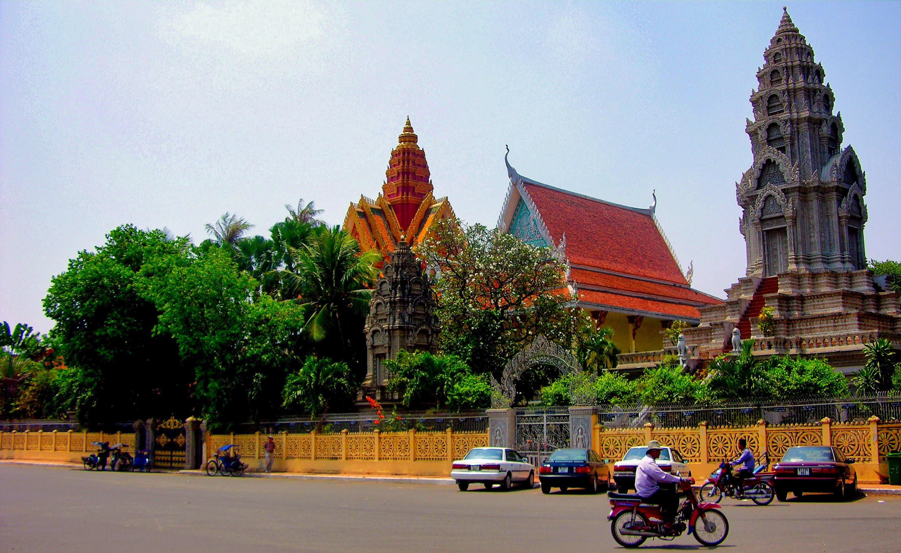
    <em>Phnom Penh</em>
  </figure>

  <figure>
    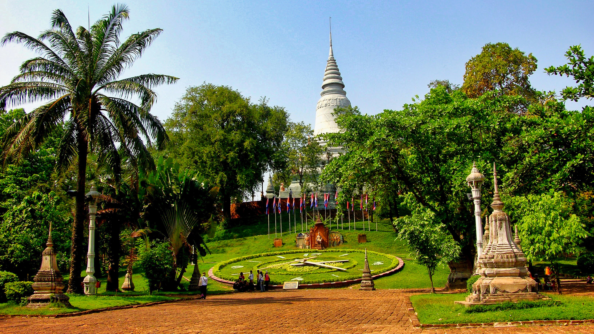
    <em>Phnom Penh</em>
  </figure>

  <figure>
    
    <em>Phnom Penh</em>
  </figure>

  <figure>
    
    <em>Phnom Penh</em>
  </figure>

  <figure>
    
    <em>Phnom Penh</em>
  </figure>

  <figure>
    
    <em>Phnom Penh</em>
  </figure>

## Day 3 – March 5 (48 km)

Today we were properly riding for the first time and headed out to the Killing Fields of Choeung Ek, well out in the countryside beyond the city. Phnom Penh's main roads are now in very good shape, but the final stretch to the memorial is a rough, dusty back road. Since I'd already visited the far less touristy Killing Field near Battambang six years ago, the sight of the Khmer Rouge's bones and rags was nothing new to me — and yet you still can't really grasp what must have happened here, not so very long ago. What was shocking too, unfortunately, was the number of package tourists and the thoughtless idiocy with which they handed out money and sweets to the begging children. On the way back into town we took a slightly different route and approached from the south along the river, then recovered with a refreshing pomelo-and-mint juice in the wonderfully shady garden of Boddhi Tree opposite S-21. After yesterday's Dolce Vita, today was more sobering — because that, too, is Cambodia. The former Khmer Rouge prison and interrogation centre is a disturbing place, full of images that stay with you, both on the walls and in your head as you walk through the cells. As a counterbalance we then cycled quietly through Phnom Penh's pretty, calm villa district south of Independence Monument and went for lunch at Malis, which, although new, already seems to be one of the most talked-about restaurants in the city. It's easy to see why. Even though it's not on the promenade but on the unremarkable Norodom Boulevard, Malis is the most stylish place in town: a blend of Asian tradition and big-city chic, with superbly comfortable sofa lounges, individual air-con at the tables, and excellent service, all set in a garden that is beautifully designed both architecturally and aesthetically. And the food? Outstanding — refined Khmer cooking with a few fresh touches, perfectly prepared, beautifully presented, generous portions, and all at surprisingly fair, genuinely reasonable prices. The scallops (US$4.90) and prawn cakes (US$4.90) were excellent; the aubergine-and-crab salad (US$6.60) was a revelation, as was the steamed goby in ginger sauce (US$4.10). Only the duck curry fell slightly short — very good, but ultimately a traditional Khmer-style curry and rather light on the meat (US$5.10). Malis is certainly one of Phnom Penh's culinary highlights — if not the highlight. We spent the hottest hours of the day napping in the air-conditioned hotel room, and only went back out in the evening. Dinner was excellent. Kabab Shop is a tiny hole-in-the-wall place with an oven out front producing authentically Pakistani food: chicken tikka masala and lamb koftas for us, plus fresh garlic naan and mango lassi. With prices between US$3 and US$4 it isn't exactly dirt-cheap, but it was a fine change for the palate.

  <figure>
    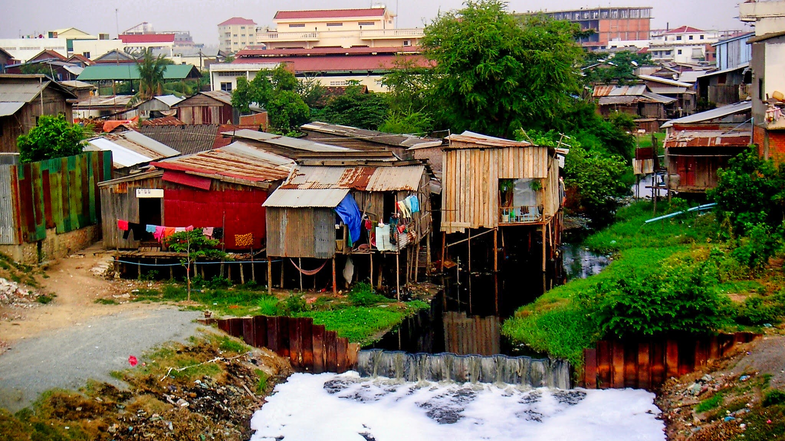
    <em>Phnom Penh</em>
  </figure>

  <figure>
    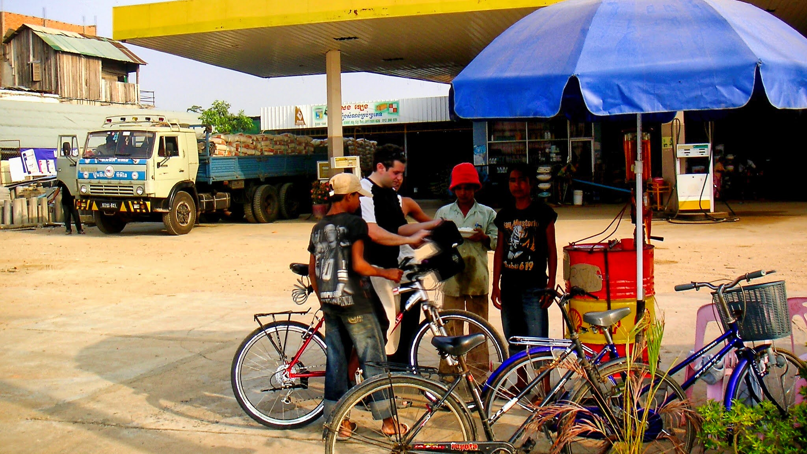
    <em>Phnom Penh</em>
  </figure>

  <figure>
    
    <em>Phnom Penh</em>
  </figure>

  <figure>
    
    <em>Phnom Penh</em>
  </figure>

  <figure>
    
    <em>Phnom Penh</em>
  </figure>

  <figure>
    
    <em>Phnom Penh</em>
  </figure>

## Day 4 – March 6 (130 km)
### Phnom Penh – Kampong Cham

Today the tour finally began in earnest — and immediately with a long ride of over 130 kilometres. We left Phnom Penh via Friendship Bridge, and after only ten kilometres the traffic thinned noticeably. The "highway" — even Cambodia's main routes are little more than country roads — ran through classic countryside: green rice fields and coconut palms; and the further we got from Phnom Penh, the fewer solid houses we saw, with wooden huts lining the road instead. Supplies are never a problem: every few hundred metres you can stock up on water, fruit, or delicious sugarcane juice. The tropical heat didn't bother me either. We stopped for lunch in the small market town of Skuon and, since the place is famous for its fried spiders, that was of course what I ate. It was perfectly fine — nice and crisp — but not exactly filling. After Skuon the riding became a little more tiring because of roadworks and a few small climbs, but overall cycling in Cambodia seems straightforward and unproblematic. As a foreigner on a bicycle, though, you are a major attraction and instantly the centre of attention wherever you happen to be. Our stage finish, Kampong Cham, is a friendly, relaxed provincial town on the Mekong, with a few crumbling French colonial buildings and Chinese shophouses. People here still seem genuinely nice and curious — a clear sign that not many tourists pass through. There was a good hotel too: Mekong on the riverside road, a relatively new building in a striking bright-yellow faux-colonial style. The US$10 rooms were simply furnished but new and clean, with air-con and a fine river view. Kampong Cham isn't blessed on the culinary front — there are very few restaurants — but the meal at Hoa An, apparently popular with the few tourists who do make it here, was perfectly fine. The shrimp beignets (8,500 riel) were good, as was the beef (8,500 riel). The steamed fish tasted slightly of river (15,000 riel), but it came with a delicious ginger sauce.

  <figure>
    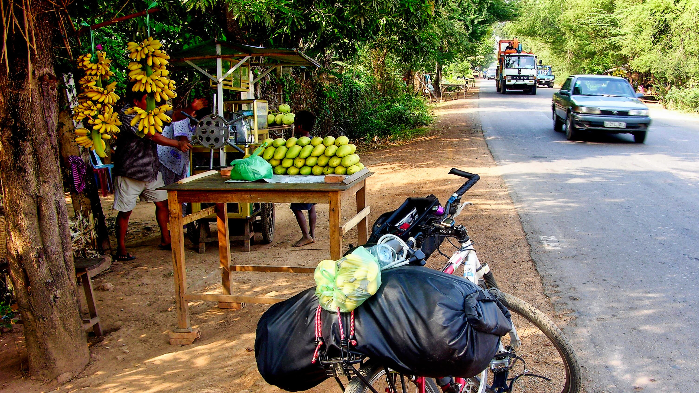
    <em>Along Hwy 6</em>
  </figure>

  <figure>
    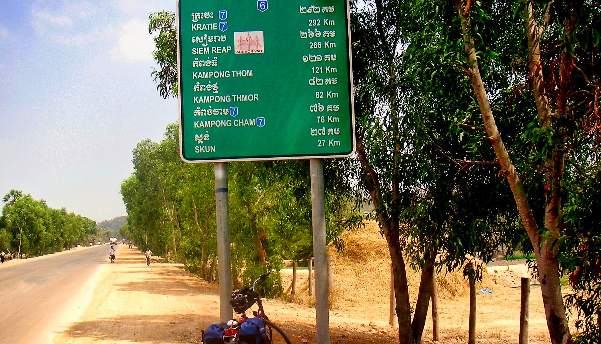
    <em>Along Hwy 6</em>
  </figure>

  <figure>
    
    <em>Along Hwy 6</em>
  </figure>

  <figure>
    
    <em>Along Hwy 6</em>
  </figure>

  <figure>
    
    <em>Along Hwy 6</em>
  </figure>

  <figure>
    
    <em>Along Hwy 6</em>
  </figure>

## Day 5 – March 7 (124 km)
### Kampong Cham – Tay Ninh

We left Kampong Cham via the huge new Mekong bridge and followed Highway 7 for another sixty kilometres or so in the direction of Kratie — an enjoyable ride on decent tarmac with only a few small hills. In the village of Krek we turned right towards the Vietnamese border. This crossing had only been opened to tourists in January, and the Cambodians clearly hadn't had time to build a proper road: first gravel, later dust and potholes. After only fifteen kilometres we reached the Vietnamese border — and the road from there to our destination, Tay Ninh, was excellent. Where Cambodia and Vietnam were still fairly similar in terms of development only a few years ago, the difference today is enormous — and not just in road quality. On the Cambodian side, border officials work in small tin huts; in Vietnam there is a solid building. Roadside cafés have electricity, sometimes even refrigerators, whereas in Cambodia you mostly see generators and cool boxes stuffed with blocks of ice. Even the chairs are far more comfortable. Vietnam has a proper café culture, even deep in the provinces where tourists almost never stray. Prices still seemed very low, and every drink comes with a complimentary pot of iced tea. The remaining stretch to Tay Ninh was pancake-flat and, apart from a few short sections with roadworks, fast and easy. Tay Ninh felt fairly prosperous: a modern provincial city with broad boulevards and many new shopfronts — a pleasant enough place with nice street cafés, though not much charm otherwise. We took a room at Anh Dao Hotel. It was a bit worn, but spacious, reasonably clean and good value at 140,000 dong — more than enough for a night. Our first meal in Vietnam, a genuine gourmet paradise, immediately made us want more. Even though Than Thuy was a simple, standard place, "standard" in Vietnam is a pleasure. There was no English menu; we ordered more or less at random and ended up with, among other things, a very fine beef hotpot with good-quality meat — for very little money.

  <figure>
    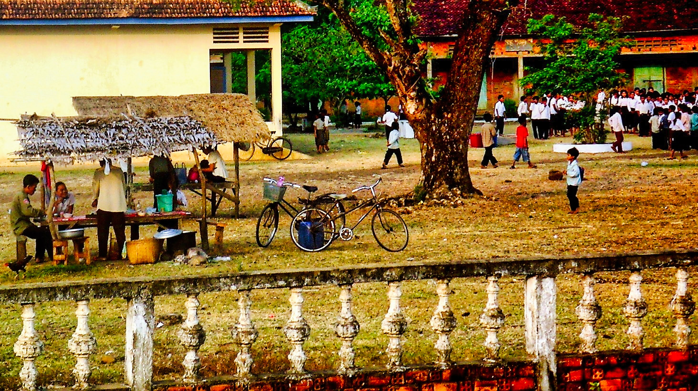
    <em>Kompong Cham Province</em>
  </figure>

  <figure>
    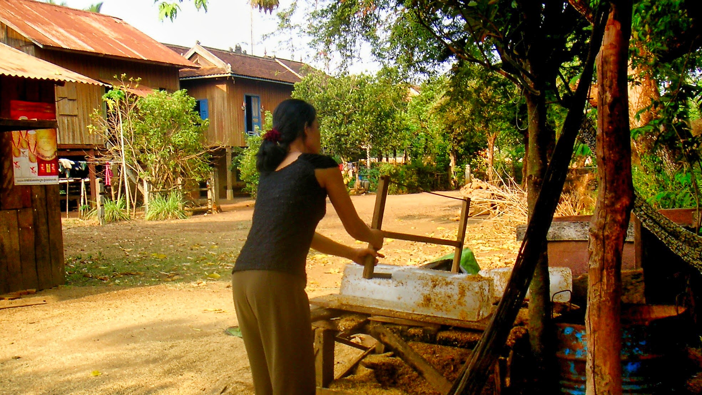
    <em>Kompong Cham Province</em>
  </figure>

  <figure>
    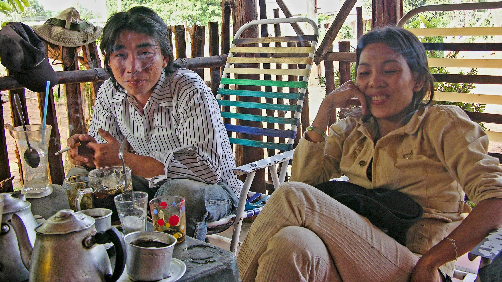
    <em>Tay Ninh Province</em>
  </figure>

  <figure>
    
    <em>Kompong Cham Province</em>
  </figure>

  <figure>
    
    <em>Kompong Cham Province</em>
  </figure>

  <figure>
    
    <em>Tay Ninh Province</em>
  </figure>

  <figure>
    
    <em>Kompong Cham Province</em>
  </figure>

  <figure>
    
    <em>Kompong Cham Province</em>
  </figure>

  <figure>
    
    <em>Tay Ninh Province</em>
  </figure>

## Day 6 – March 8 (102 km)
### Tay Ninh – Cu Chi – Saigon

Today we followed Highway 22 a hundred kilometres into Saigon. A virtually flat stage and very easy riding. For the first forty kilometres the road was quite narrow and there were some roadworks with gravel. From Go Dau onwards, though, it became a multi-lane superhighway with a broad shoulder and, until about ten kilometres before Saigon, little traffic — we made rapid progress. Scenically, the route offered little, but shortly before Go Dau there was a beautiful garden café with Asian pavilions surrounded by lotus ponds. Riding into central Saigon was an adventure: an adrenaline-charged rollercoaster in the middle of hundreds of thousands of two-wheelers apparently streaming in all directions without any plan. I've rarely had that much fun. Cycling here is an experience; even crossing the street as a pedestrian is always a small adventure.

We checked into the same hotel as six years ago, Giant Dragon in the Phạm Ngũ Lão tourist quarter. As so often with cheap hotels in Asia, rooms age quickly, and Giant Dragon could really do with a fresh coat of paint — especially since the price is still US$25. But the rooms are very comfortable for a budget hotel: spacious, tasteful, and worth the money. In the afternoon we had lunch at Bao around the corner from the hotel, on recommendation. A typical, simple street place with a first-floor veranda from which you could watch — and hear — the chaos down on the street. The food was excellent, and despite the tourist-area location the clientele was exclusively Vietnamese. We only had a few small things: spring rolls (30,000 d), snails (25,000 d), and two excellent chicken dishes — steamed (40,000 d) and wings (25,000 d). The food alone is worth a trip to Vietnam. We had dinner at the small, pleasant Restaurant 13 right in the business and first-class hotel quarter. Most of the guests were Westerners, but prices were still moderate and the food was standard Vietnamese — and very tasty. We only had a few small things: shrimp spring rolls (26,000 dong), gỏi cuốn, the fresh version (8,000 dong), and sizzling garlic squid (40,000 dong). All good, all cheap.

<figure>
  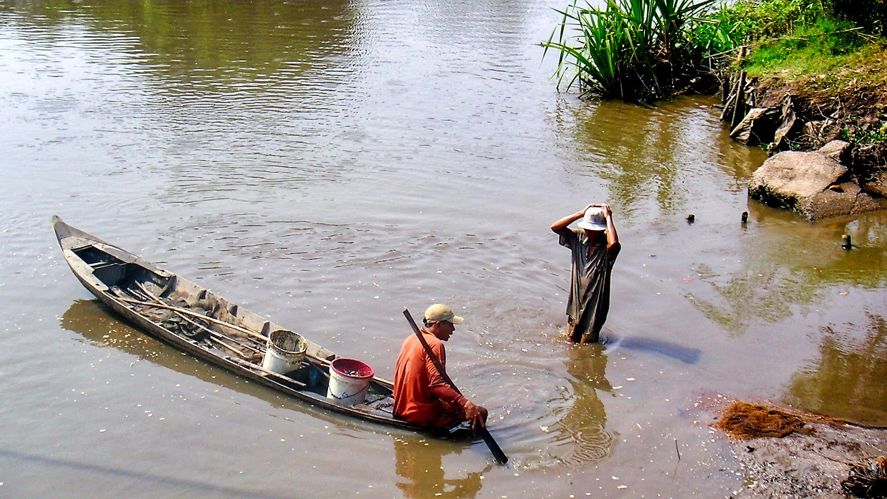
  <em>Hwy 22 to Saigon</em>
</figure>

<figure>
  
  <em>Hwy 22 to Saigon</em>
</figure>

<figure>
  
  <em>Hwy 22 to Saigon</em>
</figure>

## Day 7 – March 9

Today we left the bikes at the hotel and let others do the pedalling. We started with breakfast — phở at Bến Thành Market, which offered plenty of worthwhile photo opportunities. Afterwards we took a long walk through District 3 — quiet and relaxed by Saigon standards — to Jade Emperor Pagoda, probably one of the most picturesque among the city's many fine pagodas. From there we hired cyclos (25,000 dong per hour) and let ourselves be ferried gently through the traffic to the former Chinese quarter of Chợ Lớn, walked through the interesting market there, and rode back again. We got dropped off at Quán Ăn Ngon for lunch. It's not only one of the best-known and most popular places in the city, but also one of the prettiest: spread over two floors in a beautifully renovated colonial villa, with open kitchens on the ground floor turning out street-food classics. Again we only ordered small dishes so we could try as many places and flavours as possible: tôm hấp nước dừa (60,000 d), gỏi bò (40,000 d), and gỏi sò huyết (40,000 d). And yes — it tasted as good as it sounds.

Saigon is a special city: not beautiful, but far from unpleasant; not a place you'd instantly fall in love with — and yet so full of life and pleasures that you can't help being drawn to it, even though it has nothing cosy about it, unlike Bangkok or Hà Nội. We found a street stall with delicious, cheap fruit juices on Nguyễn Thái Bình. The fresh strawberry juice (7,000 d) was a revelation; the durian juice (9,000 d) too. For dinner we headed into District 3. I'd picked Huong Dong because it's known for unusual meat dishes; at the entrance we were greeted by an iguana on the grill. Still, the real highlights were the "standard" dishes, prepared to exceptionally high standards. The roasted pigeon (45,000 dong) and the grilled field mouse (50,000 d) were good — but the absolute stars were the homemade sesame-coated spring rolls (60,000 d) and the raw fish in rice-paper wraps (90,000 d). Prices are high for Saigon, but even here, with drinks, we paid only €15 between the two of us for four dishes — our most expensive meal so far.

<figure>
  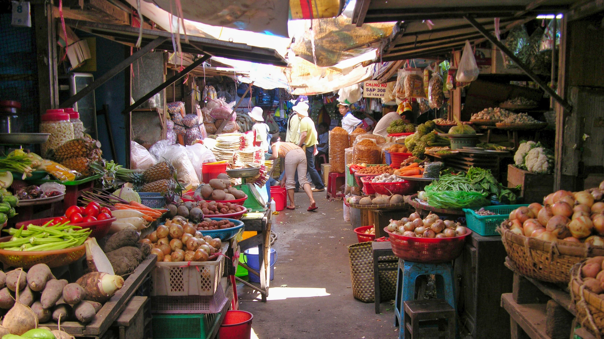
  <em>Saigon</em>
</figure>

<figure>
  
  <em>Saigon</em>
</figure>

<figure>
  
  <em>Saigon</em>
</figure>

## Day 8 — 10 March (104 km)
### Saigon – Mỹ Tho – Bến Tre – Mỹ Tho

Getting out of Saigon was far less frantic than yesterday's ride in. Highway 1 itself isn't particularly pretty, but it's fast: a broad shoulder, excellent surface, and steady progress, so we rolled into Mỹ Tho — gateway to the Delta — by lunchtime. We took a room at the Rang Dong Hotel, a typical, slightly timeworn mini-hotel. The room showed its age, but it was spacious, clean, and had the usual comforts (air-con, fridge, TV) for a bargain 130,000 dong. With plenty of day left, we grabbed a quick bite at Chi Tanh, a simple little hole-in-the-wall place by the park. Delta staples at Delta prices: crab cooked two ways — grilled and in a lovely tamarind sauce (60,000 dong each) — and, unexpectedly, very tender beef in black-bean sauce (20,000 dong). Afterwards we took the ferry across into Bến Tre Province and did a short loop into the town of Bến Tre itself. Back in Mỹ Tho we explored the town itself. Guidebooks often dismiss it as dull — a place to stop briefly before jumping straight on a boat — but I didn't find it unattractive at all. The locals were friendly, a few crumbling colonial buildings still stand here and there, the river promenade is looked after, and the ramshackle huts on the bank and the boats on the river make for wonderfully photogenic scenes. It seems day-trippers really don't spend time in town, because I didn't see another Westerner all evening. Dinner was at Song Tien, a big open-air place with pavilion seating and a slightly 'hotel' feel, but the food was very good and cheap. We had spring rolls (20,000 dong), grilled squid (25,000 dong), and a Mekong speciality: elephant-ear fish served whole, with the sweet flesh wrapped in rice paper with herbs and vegetables (50,000 dong). Only the beef with mushrooms (20,000 dong) was a touch chewy — hardly a tragedy in a feast that, drinks included, came in at under €8.

  <figure>
    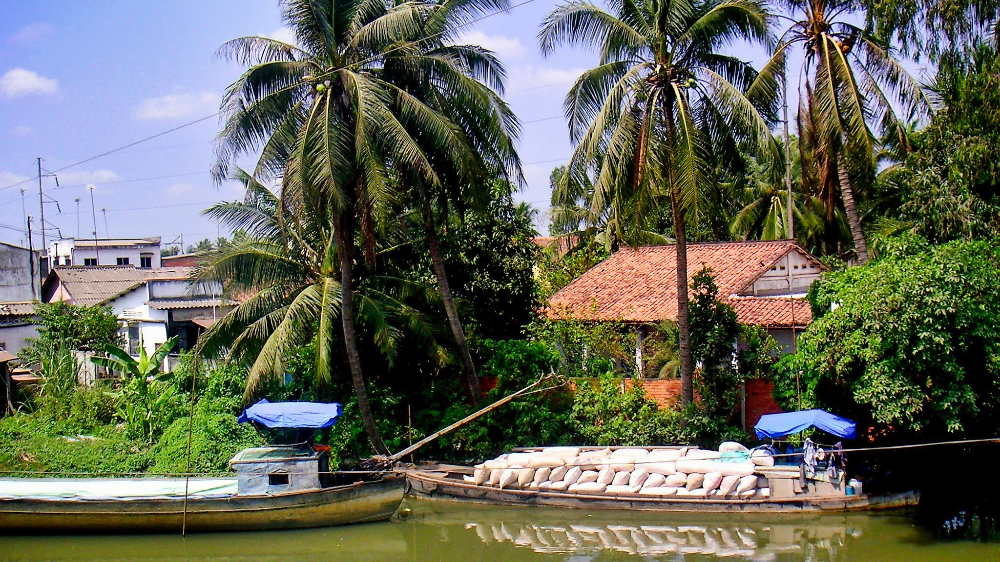
    <em>Mekong Delta</em>
  </figure>

  <figure>
    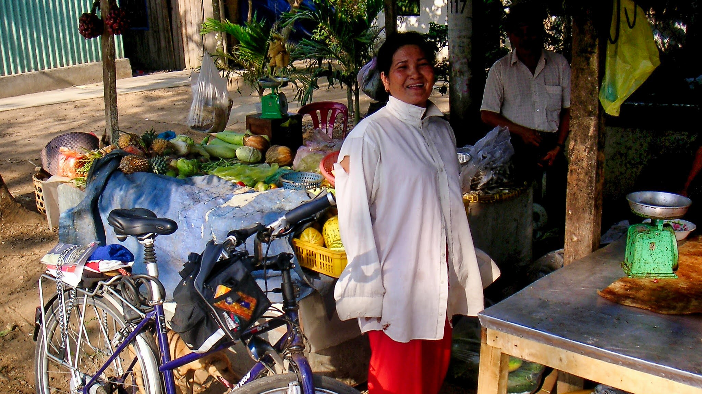
    <em>Mekong Delta - Ben Tre</em>
  </figure>

  <figure>
    
    <em>Mekong Delta</em>
  </figure>

  <figure>
    
    <em>Mekong Delta - Ben Tre</em>
  </figure>

  <figure>
    
    <em>Mekong Delta</em>
  </figure>

  <figure>
    
    <em>Mekong Delta - Ben Tre</em>
  </figure>

## Day 9 — 11 March (90 km)
### Mỹ Tho – Sa Đéc

Yesterday's worries turned out to be unfounded. Even if modernisation is in full swing, it will clearly take a long time before progress has completely trumped traditional charm in the Delta's back corners. We left Mỹ Tho westwards on a lovely little lane along a branch of the Tieu River. The farther we rode from town, the more 'old Delta' it felt. After 30 kilometres the tarmac ended, but we stayed on the narrow, sometimes bumpy track heading towards Cái Bè. The bridges along the way were genuinely adventurous — narrow, rickety, with no side rails — and we even had a crossing on an almost prehistoric ferry. This really is still an untouched patch of Delta, and I doubt many tourists ever come here. Cái Bè, reached after another fifteen-odd kilometres, is a different story. It's a well-known stop thanks to its floating market, and coachloads of visitors are shipped in and put straight onto boats. We stopped for lunch at Restaurant Number One just past Cái Bè: a classic open-air local place with pavilion seating and standard Delta cooking. Again, everything was excellent apart from the inevitable slightly tough beef. In the Delta it really pays to stick to fish, poultry, and seafood — the cooking is almost always clever, refined, and delicious. Here that meant grilled prawns (50,000 dong), mussels (20,000 dong), and a hotpot (30,000 dong).

In Sa Đéc we checked into the Hong Bong Hotel — probably the best address in town — with spacious modern rooms, a lift, a big balcony, and the usual kit (air-con, TV, fridge). Still, 16 dollars for the standard was fair. Sa Đéc is one of those Delta towns that foreign tourists rarely overnight in — I didn't see a single one on an evening walk — yet it's a friendly, attractive place. There's a lively riverside market, and across the water you can see splendid old colonial villas, some used by Jean-Jacques Annaud as locations for L'Amant. Sa Đéc has real charm. We ended up eating twice because our first choice, a Lonely Planet recommendation, was disappointing. So we trusted our own noses and found Restaurant 125 by the canal: friendly, no English menu, and the thickest, juiciest frog legs I've ever eaten (20,000 dong), plus eel in satay sauce (20,000 dong). The beef luc lac was merely average, but the prices were rock-bottom.

  <figure>
    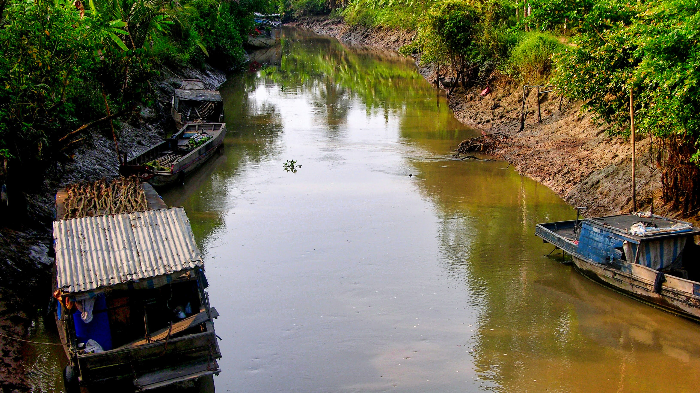
    <em>Mekong Delta</em>
  </figure>

  <figure>
    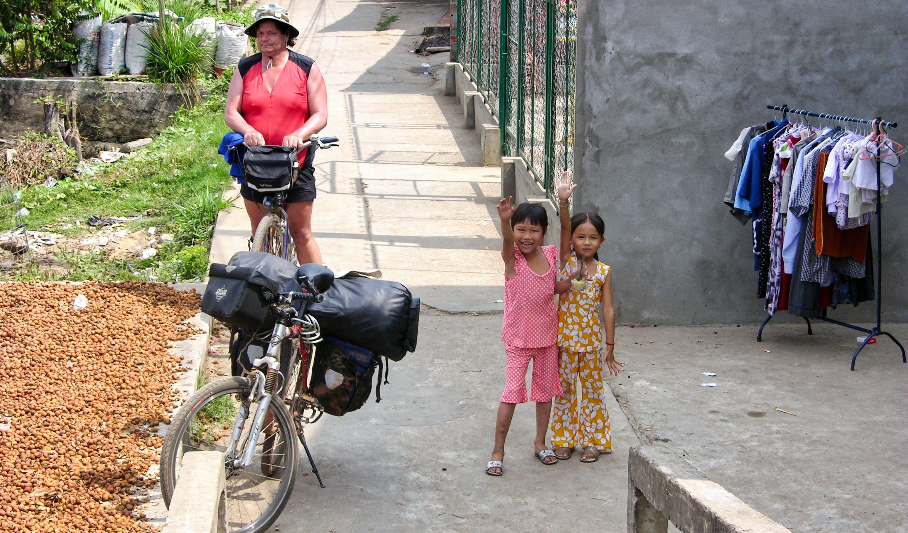
    <em>Mekong Delta</em>
  </figure>

  <figure>
    
    <em>Mekong Delta</em>
  </figure>

  <figure>
    
    <em>Mekong Delta</em>
  </figure>

  <figure>
    
    <em>Mekong Delta</em>
  </figure>

  <figure>
    
    <em>Mekong Delta</em>
  </figure>

## Day 10 — 12 March (105 km)
### Sa Đéc – Chợ Mới – Châu Đốc

The first 50 kilometres, out past Chợ Mới, were a scenic run along the quiet, narrow Route 848 beside the Tieu River, through an area that — by Delta standards — felt almost sparsely populated. We stopped for lunch in the small market town of Chợ Mới at the friendly roadside Restaurant 999. They pulled eel straight from a tank and served it along with prawns (with rice paper and herbs for wrapping) and squid. Eating outside the tourist towns always comes with an element of surprise: menus are rarely translated, so we tend to order by educated guesswork. Here the 'standard range' was 20,000–50,000 dong. Beyond Chợ Mới we ferried over to Phu My and followed the left bank towards Châu Đốc. This little tarmac lane was the most picturesque stretch of the whole trip so far: cliché-perfect tropical scenery — rice fields, wooden huts, waving locals — and almost no traffic.

In Châu Đốc we took a room in what must be the most central hotel in town, the nearly new Trung Nguyen. Our room had a small balcony overlooking the market and was modern and comfortable, if a little compact — still perfectly good value at 15 dollars. Châu Đốc is one of the Delta's main tourist hubs and, despite sitting right on the Cambodian border, feels surprisingly prosperous. It's an attractive place, with a smart new river promenade looking out over floating houses on the Bassac. A particular joy here is the fruit-shake stalls: I have no idea what their secret is, but they were among the best I've ever had — mango, pineapple, jackfruit — delicious and cheap (6,000 dong). Dinner was a hit too. In a courtyard surrounded by splendid colonial ambience opposite the upmarket Victoria Resort, we found the Restaurant Mekong — essentially a big, simple street kitchen with basic seating and almost entirely local customers. We had spring rolls (25,000 dong), prawns with rice paper (40,000 dong), eel salad (35,000 dong) and an astonishingly generous fish hotpot for a laughably low 45,000 dong.

  <figure>
    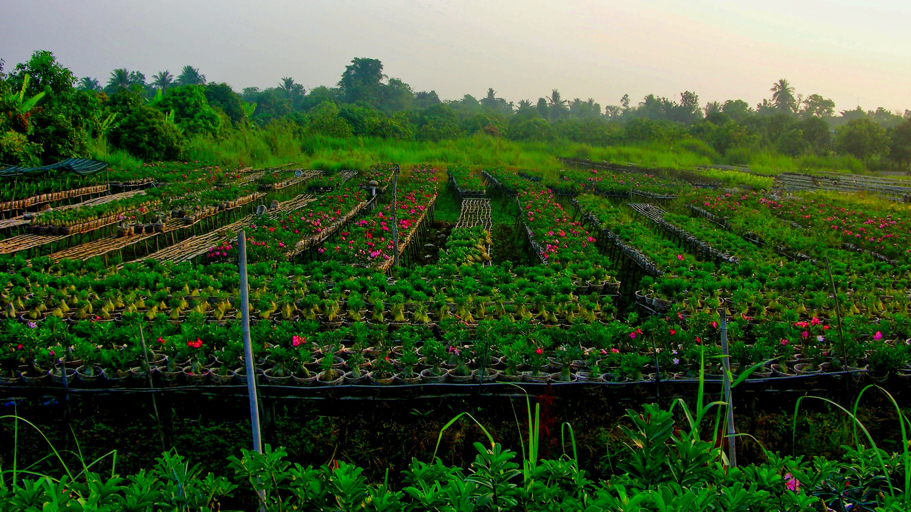
    <em>Mekong Delta</em>
  </figure>

  <figure>
    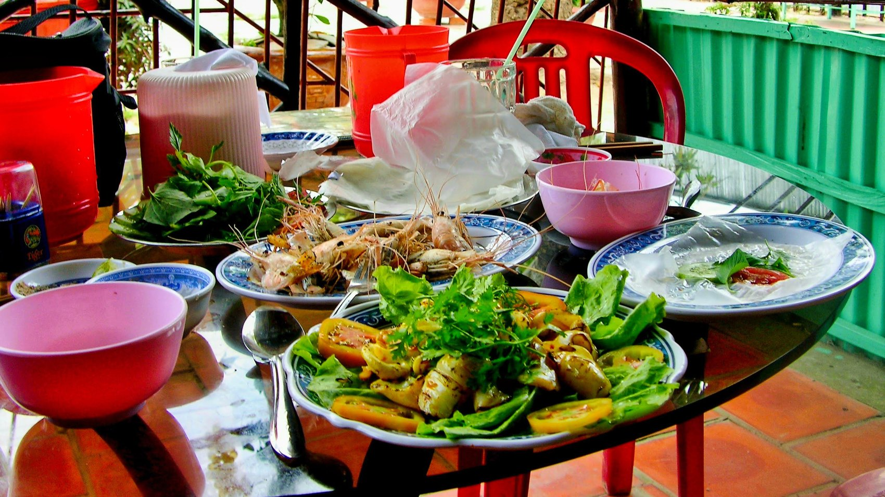
    <em>Mekong Delta - Cho Moi - Quan 999</em>
  </figure>

  <figure>
    
    <em>Mekong Delta</em>
  </figure>

  <figure>
    
    <em>Mekong Delta - Cho Moi - Quan 999</em>
  </figure>

  <figure>
    
    <em>Mekong Delta</em>
  </figure>

  <figure>
    
    <em>Mekong Delta - Cho Moi - Quan 999</em>
  </figure>

## Day 11 — 13 March (123 km)
### Châu Đốc – Tri Tôn – Núi Sập – Rạch Giá

We left Châu Đốc heading south, skirting Pagoda-covered Mount Sam, a major pilgrimage spot, especially for Vietnamese visitors. Beyond Mount Sam, Highway 91 narrowed and grew rougher, running along a sort of embankment between canals, past simple stilt houses and close to the Cambodian border. This feels like one of the least developed — and poorest — regions of southern Vietnam. Without the power lines, you could almost believe you'd slipped back into Cambodia.

The most atmospheric, and perhaps the most enjoyable, stretch of the whole trip came between Núi Sập and the coastal city of Rạch Giá. A track made of laterite slabs — just wide enough for two-wheelers — followed a canal, sometimes on one bank, sometimes on the other, with tiny ferries shuttling you across for 1,000 dong. It was the sort of scene tourists imagine the Mekong Delta to be: pretty wooden houses, friendly locals, busy river life, cafés along the way — except this was the real thing, and we were the only tourists. Rạch Giá looks like a comparatively well-off port city, with many new buildings and broad streets. Most visitors are here for one reason: the ferry to Phú Quốc. We took a room at the very new-looking Wild Rose Hotel, right in the centre by the canal. For 150,000 dong our room was a bit small and only had one bed, but it was modern, immaculate, and well-equipped.

  <figure>
    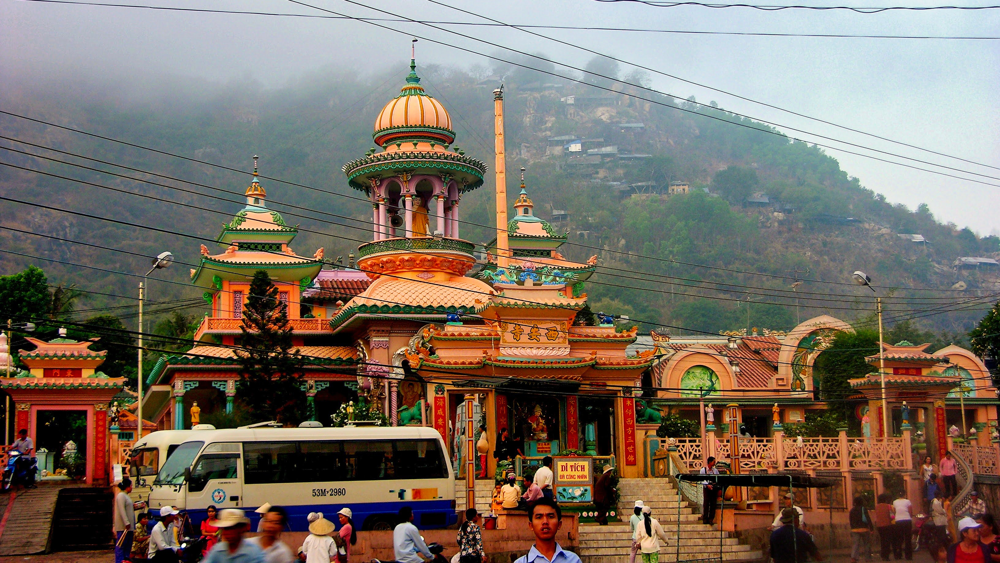
    <em>Mekong Delta - Sam Mountain</em>
  </figure>

  <figure>
    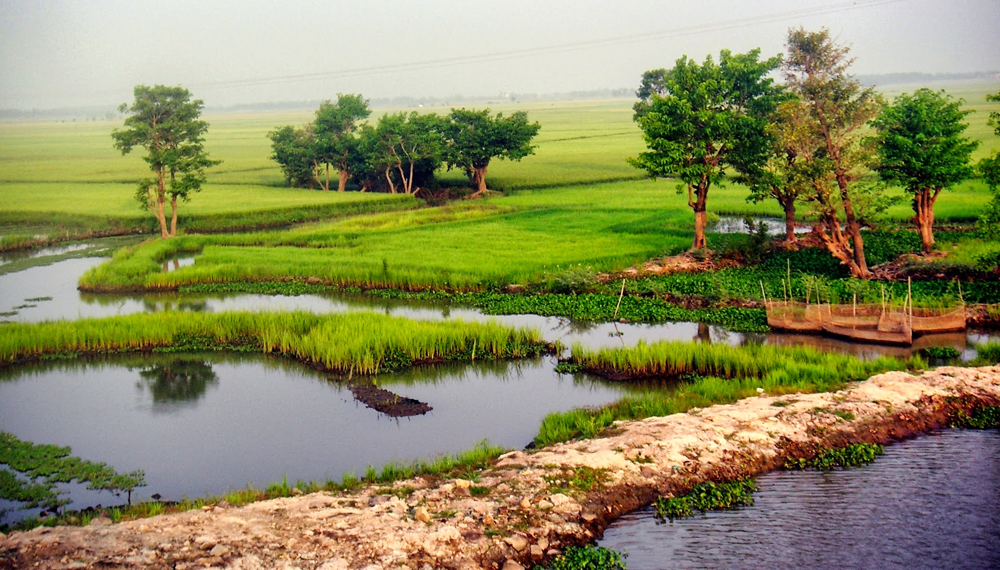
    <em>Mekong Delta</em>
  </figure>

  <figure>
    
    <em>Mekong Delta - Sam Mountain</em>
  </figure>

  <figure>
    
    <em>Mekong Delta</em>
  </figure>

  <figure>
    
    <em>Mekong Delta - Sam Mountain</em>
  </figure>

  <figure>
    
    <em>Mekong Delta</em>
  </figure>

## Day 12 — 14 March (34 km)
### Phú Quốc

At eight we took the Sea Bird to Phú Quốc, after an iced coffee at the beautiful Café Garden on the road to the pier. About two and a half hours later we arrived in An Thới, at Phú Quốc's southern tip, and cycled straight towards Dương Đông, the island's main town and tourist centre. The first six kilometres were tarmacked but hilly. Then we turned onto a gorgeous dirt track that runs right along a kilometre-long sandy beach lined with coconut palms. There was virtually no traffic; this part of the island is still completely undeveloped — no resorts, just a few fishermen's huts and boats on the sand, and more cows on the road than cars.

At the only beach restaurant around, the wonderful and very simple Cam Loan, 12 kilometres south of Dương Đông, we ate an excellent seafood hotpot with a view of the beach and fishing boats rocking offshore. A generous pot with prawns, octopus, and fish in a tasty broth cost 100,000 dong. Around three kilometres south of Dương Đông, where the road leaves the coast and runs a little inland through low hills, we took a bungalow at Lam Ha Resort. At 12 dollars it was a steal: new, spacious, with a big bathroom, a veranda, air-con, and a small garden outside. The beach really is superb. The southern stretches are quiet and unspoilt. Whatever the island's future, Phú Quốc is absolutely worth the detour now, not least for the dreamy sunset we watched through the palms from the Seastar Resort veranda. For dinner, the best restaurant on the island sits, inconveniently, on the road south of Dương Đông. The French owner of Carole has made the most of the location: candlelight on sand under bamboo umbrellas, and a level of Franco-Vietnamese cooking that's genuinely refined — at very fair prices. The Vietnamese seafood salad (40,000 dong) was delicious, as were the oyster brochettes (50,000 dong) and a whole grilled 'Sapa' fish (100,000 dong). Highly recommended.

  <figure>
    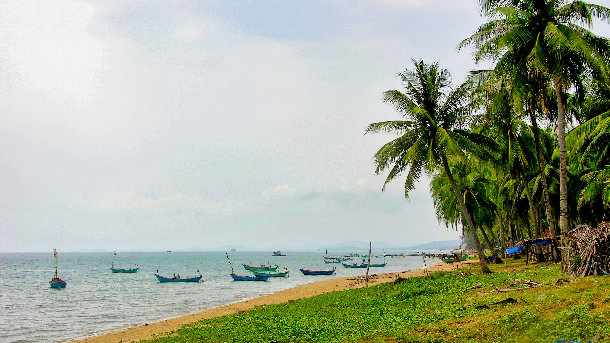
    <em>Phu Quoc</em>
  </figure>

  <figure>
    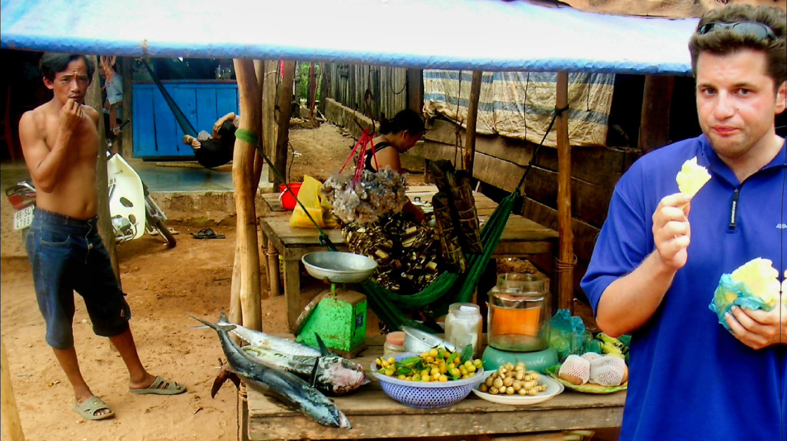
    <em>Phu Quoc</em>
  </figure>

  <figure>
    
    <em>Phu Quoc</em>
  </figure>

  <figure>
    
    <em>Phu Quoc</em>
  </figure>

  <figure>
    
    <em>Phu Quoc</em>
  </figure>

  <figure>
    
    <em>Phu Quoc</em>
  </figure>

## Day 13 — 15 March (79 km)
### Phú Quốc – Rạch Giá – Tan Hiep

To get back to An Thới we took the island's main road through the lush green interior. It's a narrow, single-lane strip — and, remarkably, still the only paved road on Phú Quốc. A lovely ride through lightly populated countryside, with some fairly hilly stretches. Much more rewarding was the turn-off to Bãi Sao, a beautiful bay with genuinely white sand and palms that give the right tropical mood. The three-kilometre spur road is steep and rough, but there's a beach restaurant at the end where you can refuel. Still, the fat 'lobster crabs' (90,000 dong) and fish grilled in foil (90,000 dong) were excellent — and eating seafood with a view of sand, palms, and sea always tastes better.

I slept through almost the entire ferry ride back to Rạch Giá. When we arrived in the afternoon it was the first time we'd had proper rain all trip. Once it eased, we cycled down to the bus terminal seven kilometres south of town to arrange transport to Cần Thơ. The only bus at that time refused to take our bicycles at the normal fare, so we changed plans on the spot and simply carried on by bike along the canal on Highway 80. It was already dark when we reached Tan Hiep, the first larger place with somewhere to sleep. Western tourists clearly don't end up stranded here often: our arrival was an event. The family at our guesthouse, Tung, treated us like honoured guests — fried noodles with seafood (30,000 dong), spring rolls (30,000 dong), and fried prawns (40,000 dong). The room was perfectly fine too: simple, with one bed and a squat toilet, but brand new and spotless (120,000 dong). It was lovely to spend a night in a provincial town far from any well-worn tourist trail.

  <figure>
    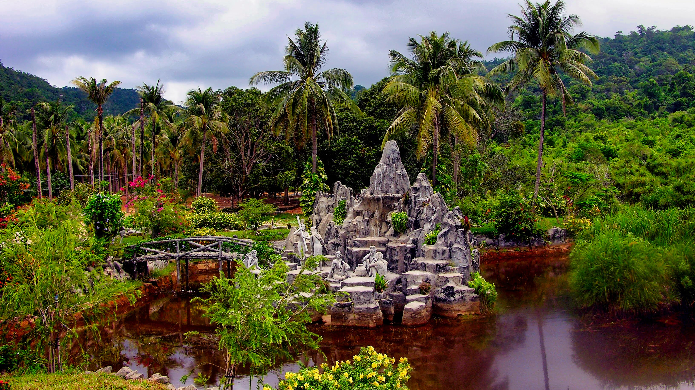
    <em>Phu Quoc</em>
  </figure>

  <figure>
    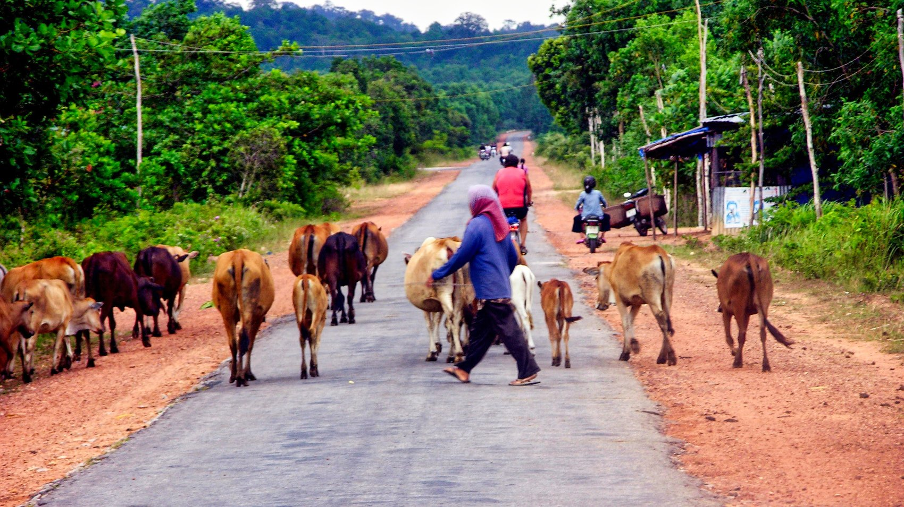
    <em>Phu Quoc</em>
  </figure>

  <figure>
    
    <em>Phu Quoc</em>
  </figure>

  <figure>
    
    <em>Phu Quoc</em>
  </figure>

  <figure>
    
    <em>Phu Quoc</em>
  </figure>

  <figure>
    
    <em>Phu Quoc</em>
  </figure>

## Day 14 — 16 March (87 km)
### Tan Hiep – Cần Thơ

Today's ride — thirty-odd kilometres north on Highway 80 followed by fifty kilometres into the wind on Highway 91 to Cần Thơ — was uneventful. Despite heavy traffic, the road is decent and perfectly rideable. I reached Cần Thơ by midday and found us a simple but clean room with the usual comforts for 180,000 dong at the little Hotel So 10, tucked down a side lane off the riverfront road. For lunch we went to Nam Bo, the most popular tourist place in town, set in a restored colonial building with a first-floor balcony overlooking the river and promenade. The menu mixes Vietnamese and Western dishes; we stayed Vietnamese: a snake set menu with spring rolls and snake curry (69,000 dong), plus fish baked in a clay pot (40,000 dong). For dinner we ate on the enormous floating restaurant Du Thuyen moored in front of the promenade. Apart from us, everyone was Vietnamese (always a good sign), though the service was terrible. The food, however, was excellent — especially the thick grilled lobsters (four for 175,000 dong). Also very good was a salad of green mango with dried snakehead fish (55,000 dong).

  <figure>
    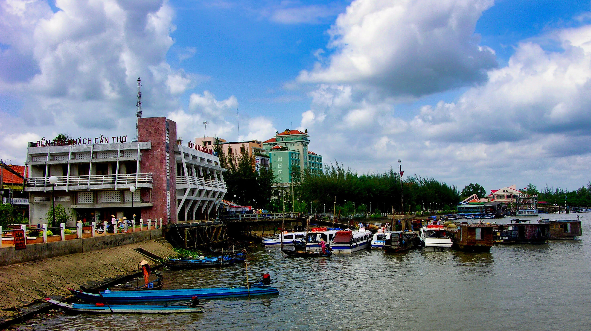
    <em>Mekong Delta - Cantho</em>
  </figure>

  <figure>
    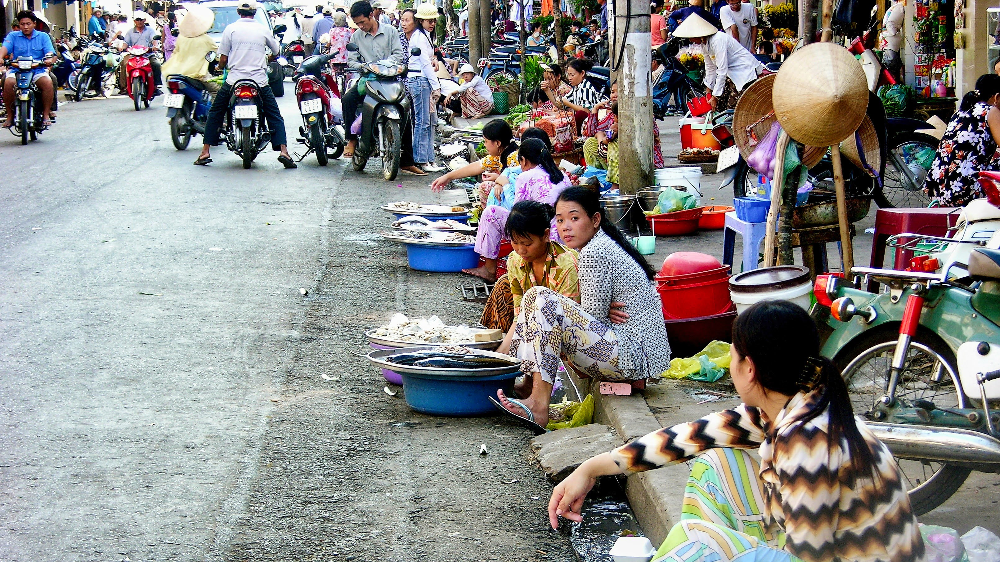
    <em>Mekong Delta - Cantho</em>
  </figure>

  <figure>
    
    <em>Mekong Delta - Cantho</em>
  </figure>

  <figure>
    
    <em>Mekong Delta - Cantho</em>
  </figure>

  <figure>
    
    <em>Mekong Delta - Cantho</em>
  </figure>

  <figure>
    
    <em>Mekong Delta - Cantho</em>
  </figure>

## Day 15 — 17 March (13 km)

To round off our Mekong Delta loop, we went out this morning on a long-tail boat to see the Cái Răng floating market and the quiet canals around Cần Thơ from the water. Cycling is the perfect way to explore the Delta in depth, but the real highlight of any Delta trip is time in these little long-tails: suddenly you're in it rather than watching it, right in the bustle of the floating markets and on the tropical green waterways. In Cần Thơ a boat costs only 3 dollars an hour — money well spent, even for cyclists. After breakfast at the pretty So Tom restaurant on the promenade, it was time to say goodbye to the Mekong and take the minibus back to Saigon. We had to pay for five seats (two for us, three for the bikes), but the trip in a modern, air-conditioned van was quick — four hours, 60,000 dong — and comfortable.

Back in Hồ Chí Minh City we stayed again in Phạm Ngũ Lão, but for this one night chose a cheaper room: 15 dollars at Huynh Anh, a fairly large modern hotel with a lift and well-equipped rooms. We bought our tickets for tomorrow's hydrofoil to Vũng Tàu at the pier and paid another visit to Bo Tung Xeo — still wildly popular, packed with locals, and the place where we ate our very first meal in Vietnam six years ago. Its reputation is still deserved: the food remains superb and the prices are as moderate as ever. The house speciality, Bo Tung Xeo (marinated beef BBQ, 75,000 dong), is heavenly; the fresh oysters (10,000 dong each) are huge; and even the salmon sashimi (40,000 dong) tasted just as good as back then.

  <figure>
    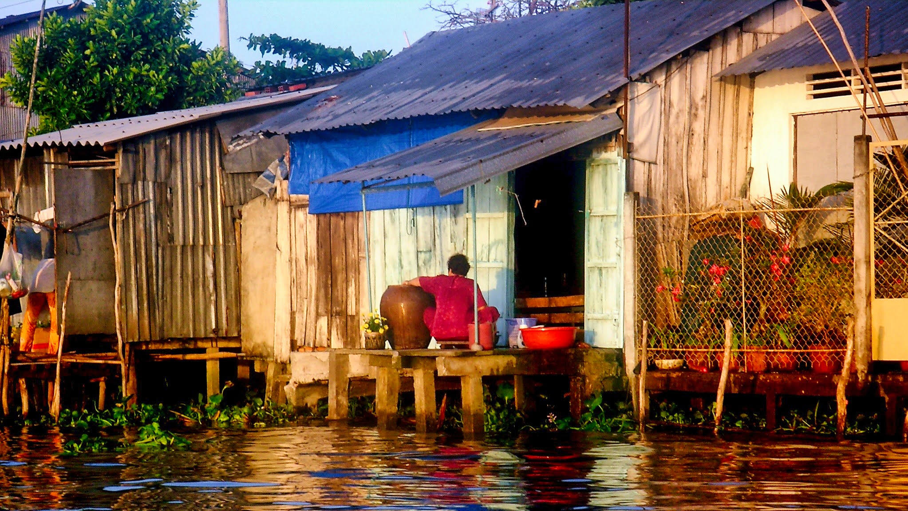
    <em>Mekong Delta - Cantho</em>
  </figure>

  <figure>
    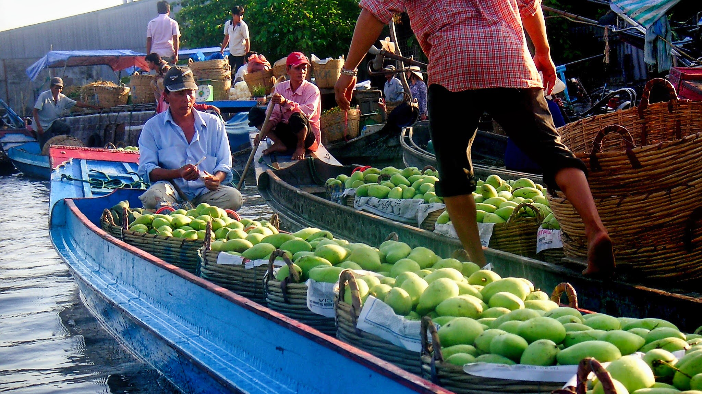
    <em>Mekong Delta - Cai Rong Floating Market</em>
  </figure>

  <figure>
    
    <em>Mekong Delta - Cantho</em>
  </figure>

  <figure>
    
    <em>Mekong Delta - Cai Rong Floating Market</em>
  </figure>

  <figure>
    
    <em>Mekong Delta - Cantho</em>
  </figure>

  <figure>
    
    <em>Mekong Delta - Cai Rong Floating Market</em>
  </figure>

## Day 16 — 18 March (85 km)
### Saigon – Vũng Tàu – Bình Châu

The plan sounded perfect: an early-morning hydrofoil to Vũng Tàu, then a relaxed 80-kilometre ride to the hot springs at Bình Châu, arriving by early afternoon to be pampered in the resort. Unfortunately, on the boat I realised our hotel had forgotten to return our passports at checkout. So after arriving in Vũng Tàu, grabbing a coffee, and getting a puncture fixed (patching an inner tube for 5,000 dong), I had to take the ferry back to Saigon, ride to the hotel, collect the passports, and then take the hydrofoil to Vũng Tàu all over again. Luckily the boats run hourly, take only about 90 minutes, and are cheap (120,000 dong per person plus 50,000 dong for the bike). Still, it's not a trip you'd choose to do three times in one day.

By the time I could finally continue cycling it was half past one. A lightly trafficked four-lane road took me across the Vũng Tàu peninsula to Ba Ria, where I also took the wrong exit and added another ten kilometres. When I finally reached Highway 55 it was already half three, with Bình Châu still 40 kilometres away. We arrived at the resort at dusk, so the 'wellness programme' had to wait until morning. The resort is a real oasis in the middle of nowhere. Our suite was spacious — almost luxurious — with a great bathroom and a big tub. The package price of 49 dollars for two people included breakfast buffet, a private pool for thermal and mud baths, tennis, fishing, and — best of all — four eggs to cook yourself in an 82°C hot spring pool. Compared with what European spa resorts charge, this is basically free; you could even get a massage for about €2 an hour.

<figure>
  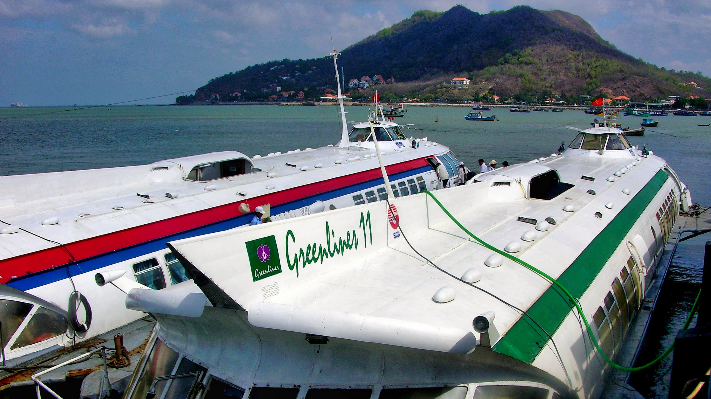
  <em>Vung Tau</em>
</figure>

<figure>
  
  <em>Vung Tau</em>
</figure>

<figure>
  
  <em>Vung Tau</em>
</figure>

## Day 17 — 19 March (110 km)
### Bình Châu – La Gi – Phan Thiết

We made full use of our wellness vouchers from six to nine. The eggs cooked in the hot spring were genuinely fun — and oddly 'reverse-cooked': the yolk sets before the white. In any case, fully relaxed, we rode back to Route 55, which was quiet, gently hilly, and — thanks to the wind — harder than it should have been. This is another region where you see almost no Western tourists, which makes café stops 'interesting': half the village's teenagers gather around you as if you've landed from space. Route 55 eventually fed into Highway 1, which we followed for almost 50 kilometres to Phan Thiết. According to Lonely Planet, Phan Thiết isn't necessarily worth a visit. I liked it a lot. The evening atmosphere is terrific: a photogenic fishing fleet on the river, improvised street kitchens, a surprising number of stylish cafés and seafood restaurants by the pleasant town beach. European tourists rarely overnight here, and the locals are extremely friendly. There was no English menu, so I simply chose our meat from the fridge. We ended up with a whole grilled squid (50,000 dong) and a goat stew (40,000 dong) that was delicious — very like a Thai tom yum soup.

<figure>
  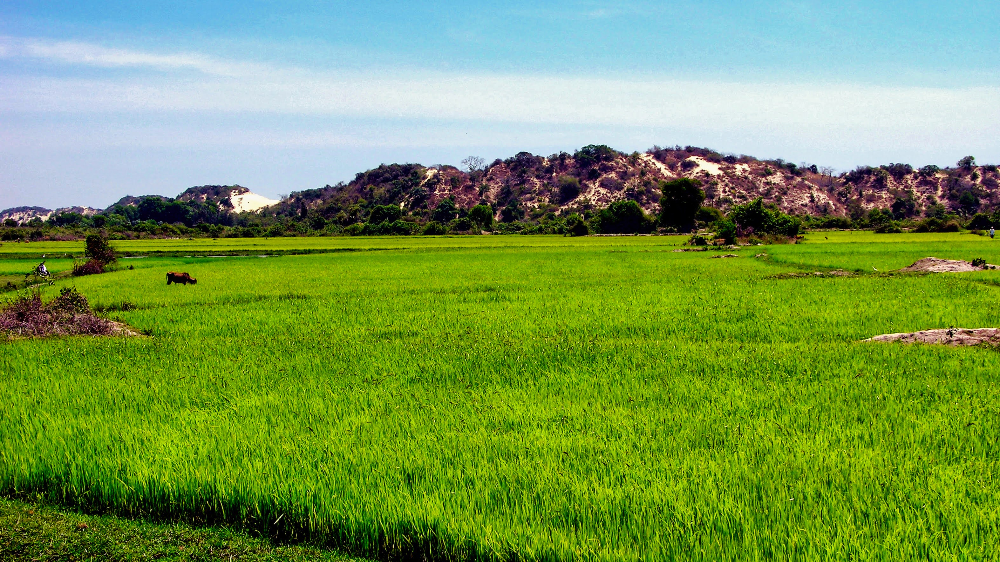
  <em>Around La Gi</em>
</figure>

<figure>
  
  <em>Around La Gi</em>
</figure>

<figure>
  
  <em>Around La Gi</em>
</figure>

## Day 18 — 20 March (43 km)
### Phan Thiết – Mũi Né

When I woke up this morning it was obvious the cold that had been threatening finally had me. Luckily today's plan was only a short hop to Mũi Né — about all I could face. After coffee on Phan Thiết's beach we rode over a headland on a hilly road; from kilometre 10 of the coastal road it flattened out along the sea. This is where Mũi Né's beach begins: endless sand lined with palms, and almost as many resorts and restaurants — some right on the beach, others on the road behind. Even so, Mũi Né feels calm and laid-back: no high-rises, and tourists — Vietnamese and Western alike — spread out along the long beach. In the end we found a very decent bungalow at the Vietnam-Austria House: a bit old-school, but superbly located right on the beach, spacious, with air-con, veranda, and a large bathroom. The resort itself isn't the prettiest and feels a bit cramped between bungalows, pool, and main building, but it sits on one of the best parts of the beach, and 25 dollars was fair for Mũi Né. The main 'problem' here is the wind. It's perfect for surfers, but for sunbathing and long walks it can be relentless. Still, the beach is genuinely attractive — wide and seemingly endless.

In the afternoon we cycled to Mũi Né's main attraction, the large orange sand dunes about ten kilometres south along the coast road. Great photo opportunities — slightly spoiled by children who pounce on every visitor trying to sell bits of plastic for sand-sledding. We took a break at the stylish Moonfish Café & Restaurant around kilometre 16. Sometimes the creative cooking worked — beef carpaccio with coriander and chilli fish sauce was excellent (40,000 dong) — but the grilled barracuda disappointed. As I wasn't feeling great in the evening, we ate opposite our resort at the Smoke House, a clear tourist trap. Authentic Vietnamese cooking isn't the goal there, but with fresh grilled seafood you can't go too wrong. We had a beautifully grilled large red snapper (120,000 dong) and thick clams for 30,000.

  <figure>
    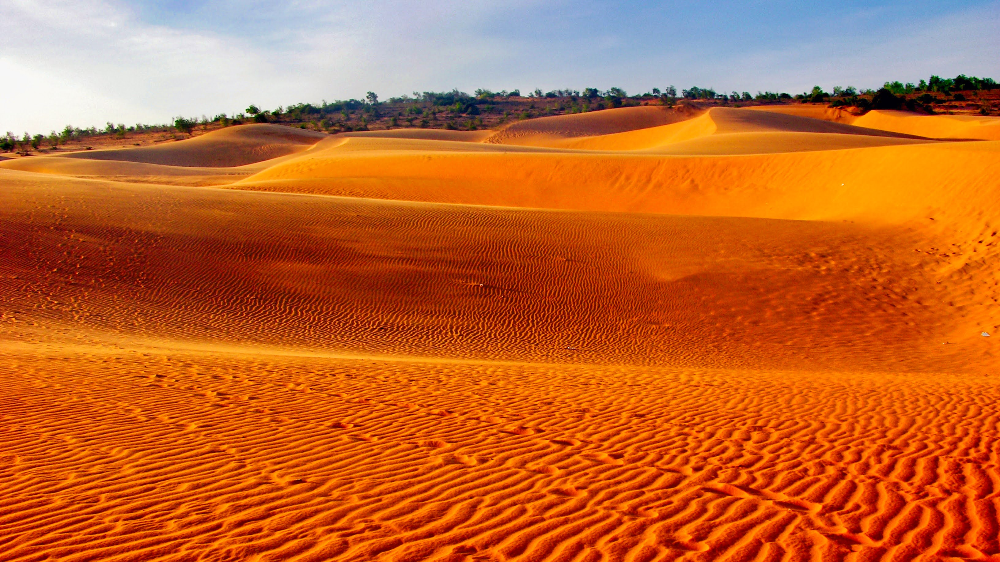
    <em>Mui Ne</em>
  </figure>

  <figure>
    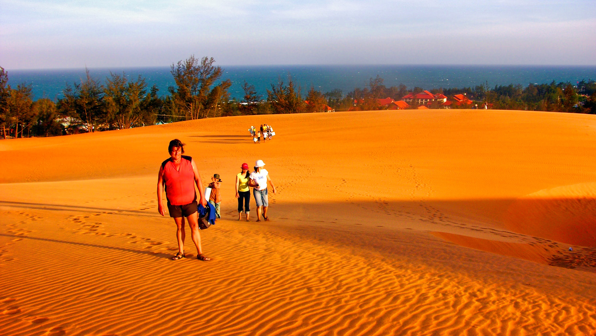
    <em>Mui Ne</em>
  </figure>

  <figure>
    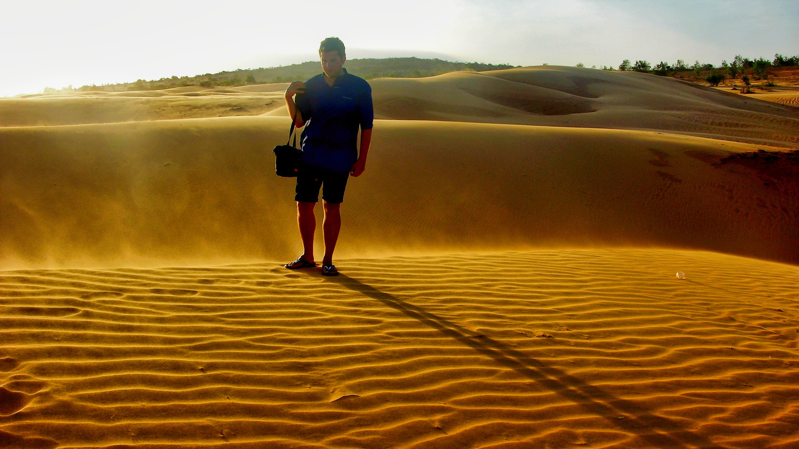
    <em>Mui Ne</em>
  </figure>

  <figure>
    
    <em>Mui Ne</em>
  </figure>

  <figure>
    
    <em>Mui Ne</em>
  </figure>

  <figure>
    
    <em>Mui Ne</em>
  </figure>

  <figure>
    
    <em>Mui Ne</em>
  </figure>

  <figure>
    
    <em>Mui Ne</em>
  </figure>

  <figure>
    
    <em>Mui Ne</em>
  </figure>

## Day 19 — 21 March (130 km)
### Mũi Né – Phan Thiết – Cà Ná – Phan Rang

I still felt a bit weak, and today was the toughest day of the trip so far — not because of distance or terrain, but because of the stormy wind that blew straight into our faces from the north-east for most of the day. After 130 kilometres of grinding along at about 10 km/h into the gale, I'd had enough and didn't want to risk ending up riding in the dark. So I flagged down a minibus for the final stretch to Phan Rang, which worked just fine. The old van already had about ten bicycles strapped to the roof and a record-breaking 26 passengers inside. I thought this kind of thing only still existed in Cambodia. It was a memorable experience: even the poorest of the poor — people who still have to travel like this in Vietnam — offered me cigarettes.

Achim had arrived long before me and had already found us accommodation — this time in a proper 'noble' establishment, the three-star Ho Phong Hotel just behind the bridge. The value for money was unbeatable: a spacious room with two large beds, a seating area, all the comforts, and a great bathroom with walk-in shower for 14 dollars. And that's exactly where you have the best unexpected experiences — like tonight's dinner at Phuong Nam, a big garden restaurant. No English menu, so we ordered by meat type and hope. Soon a live venomous snake was brought to our table, its head cut off in front of us, and the blood mixed with rice liquor. The still-beating heart was stirred in as well. This potent cocktail is said to boost virility; either way, it didn't taste bad — sweetish — and so strong that a few sips made you drunk. The snake meat itself was served two ways: delicious minced 'meatballs', and cigar-shaped rolls wrapped in seaweed. It was expensive (700,000 dong for the whole snake), but unforgettable. Everything else we'd ordered was excellent and very cheap: grilled squid (40,000 dong), a whole grilled saba fish (50,000), and grouper in a delicate Vietnamese fish soup (40,000).

<figure>
  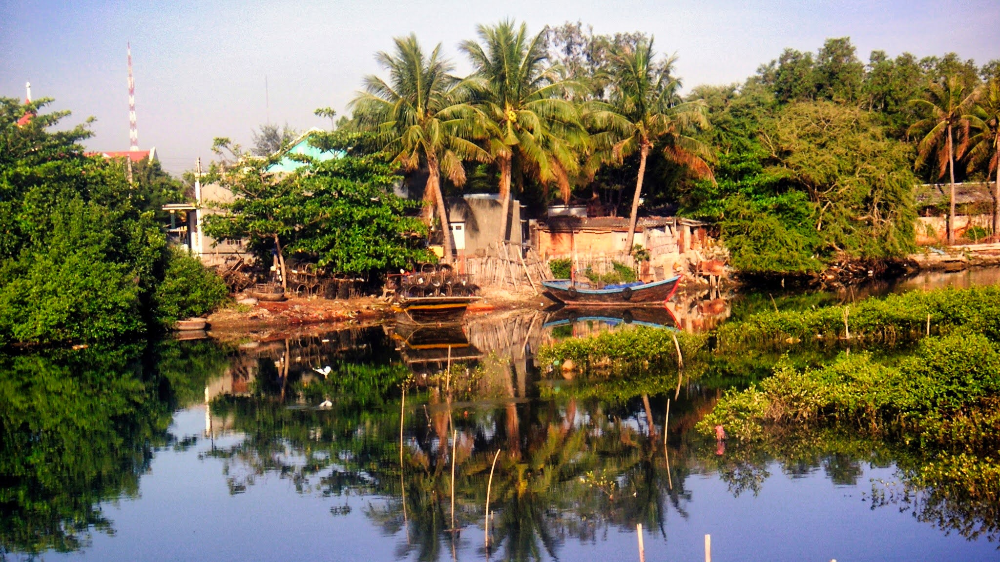
  <em>Along Hwy 1 - Around Phan Thiet</em>
</figure>

<figure>
  
  <em>Along Hwy 1 - Around Phan Thiet</em>
</figure>

<figure>
  
  <em>Along Hwy 1 - Around Phan Thiet</em>
</figure>

## Day 20 — 22 March (113 km)
### Phan Rang – Nha Trang

Today on Highway 1 was much more comfortable than yesterday. The wind had eased and no longer blew straight at us; the scenery was also far more appealing — tropical green, shimmering rice fields and coconut palms between the coastal mountains and the central highlands. Traffic wasn't intimidating, and the wide shoulder makes for easy cycling. A quiet four-lane spur road led the last ten kilometres into Nha Trang. Six years ago I wrote about Vietnam's most popular beach resort: 'you can probably write the beach off for the future', expecting a building boom plus the Vietnamese fondness for kitsch and grandiosity. Luckily, I was wrong. There are many more hotels now, many more tourists, and more than just a couple of ugly high-rise blocks along the promenade — but the beach is still beautiful, even improved by the redesigned waterfront. We stayed at the Thien Tan Hotel in the second row, right in the heart of the tourist quarter. Bright modern rooms with a view, all the usual comforts, and a bathtub cost 200,000 dong. We headed straight for the Sailing Club, whose Sandals restaurant served us the best meal of our entire trip six years ago. The setting is still superb: comfortable chairs under coconut palms right on the sand, lounge atmosphere with discreet Buddha Bar music, competent friendly service — and the food remains fantastic. Everything we tried was perfectly cooked with excellent ingredients: a Mediterranean-Asian mango salad with warm goat's cheese (80,000), Vietnamese mackerel in a clay pot (65,000), Indian lobster-crab curry (84,000), and Japanese tenzoru soba — prawn tempura with chilled noodles (115,000). High-end for Vietnam, but more than justified by the setting and the cooking.

  <figure>
    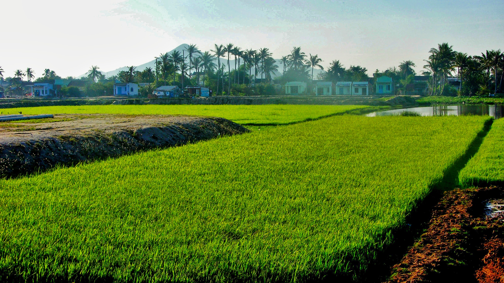
    <em>Along Hwy 1 - Around Phan Rang</em>
  </figure>

  <figure>
    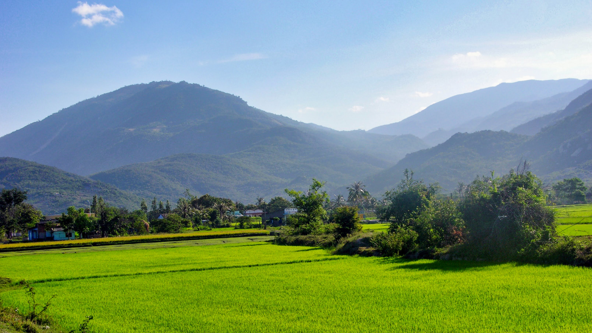
    <em>Along Hwy 1 - Around Phan Rang</em>
  </figure>

  <figure>
    
    <em>Along Hwy 1 - Around Phan Rang</em>
  </figure>

  <figure>
    
    <em>Along Hwy 1 - Around Phan Rang</em>
  </figure>

  <figure>
    
    <em>Along Hwy 1 - Around Phan Rang</em>
  </figure>

  <figure>
    
    <em>Along Hwy 1 - Around Phan Rang</em>
  </figure>

## Day 21 — 23 March (31 km)

We used today's rest day for practicalities: buying train tickets for Huế–Hà Nội, getting the bikes cleaned and scrubbed (10,000 dong per bicycle), and doing laundry. Of course we also explored a bit of the area around Nha Trang by bike. The beautiful lagoon with Cham ruins in the background is ridiculously photogenic. To the north, a new four-lane corniche runs about ten kilometres along the sea — almost empty of traffic — past more attractive, still uncommercialised beaches and with fine views back over the city and bay.

Just before the dead end is a lovely excursion spot, Bien Ngoc, where we had breakfast. Our 'breakfast' was really more of a snack: tuna sashimi (50,000 dong) and grilled abalone (40,000) — both very good. Back in town it was time for something more substantial, so we went for a barbecue lunch at Lac Canh, a very simple place famous for grilled dishes and one we'd already visited six years ago. Prices are still rock-bottom and the marinated beef and squid you grill yourself at the table are excellent: 28,000 and 32,000 dong. In the evening, lured by the street aromas, we started at a street grill for four thick grilled lobsters (120,000 dong) and various grilled shellfish. And to be fair, this stall — on the corner of Tran Phu and Biet Thu — served sauces with the seafood that would satisfy serious gourmet standards. No problem: the Sailing Club turns out wood-fired pizza of near-Neapolitan quality (80,000 dong for a marinara), and we added ayam percik, Malaysian chicken in coconut milk with sambal (85,000), which was also excellent.

  <figure>
    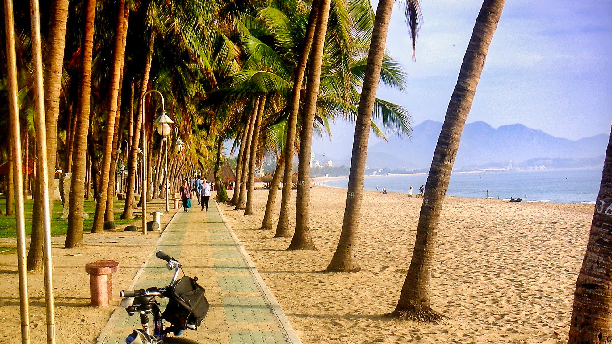
    <em>Nha Trang</em>
  </figure>

  <figure>
    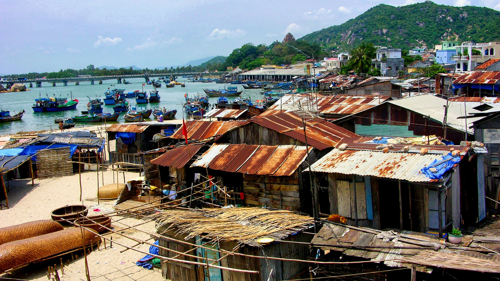
    <em>Nha Trang</em>
  </figure>

  <figure>
    
    <em>Nha Trang</em>
  </figure>

  <figure>
    
    <em>Nha Trang</em>
  </figure>

  <figure>
    
    <em>Nha Trang</em>
  </figure>

  <figure>
    
    <em>Nha Trang</em>
  </figure>

## Day 22 — 24 March (133 km)
### Nha Trang – Tuy Hòa

Another full day on Highway 1. The scenery was beautifully varied: rice fields shimmering in different greens on both sides of the road, ending either at the coastal dunes or at the highland mountains. The most striking section was around Dai Lanh, where the highway runs right along a rugged coastline. A white sand beach in a glorious bay invited a swim, and the fishing village at the northern end — with its fleet — was poor and dirty, but wonderfully photogenic. Most of the route was flat, though for the first time we had two passes: a small one just beyond Nha Trang to reach Highway 1, and the longer, higher Dai Lanh Pass. It offered spectacular coastal views and, in terms of gradient, wasn't a major challenge. The final 25 kilometres after the pass turn-off to our destination Tuy Hòa were dead flat, and with the wind at my back I practically flew into town.

Tuy Hòa is a small, unremarkable provincial city, but it feels relatively prosperous. There's an old Cham temple on a hill above town, and the streets and parks are clean and well kept. We stayed in the very blue Da Giang Hotel on the old Highway 1. Our room was enormous and bright, with two wide beds, a balcony, and the usual comforts — 220,000 dong was perfectly reasonable. Tuy Hòa isn't blessed with endless dining options, but after a longer walk we found three popular open-air restaurants on the street below the Cham temple. We chose the busiest, Cay Man. The menu held no surprises: straightforward provincial food, but authentic, with cheap Saigon beer, grilled squid, garlic spinach, and an eel hotpot. All of it, including five bottles of beer, cost less than €7.

  <figure>
    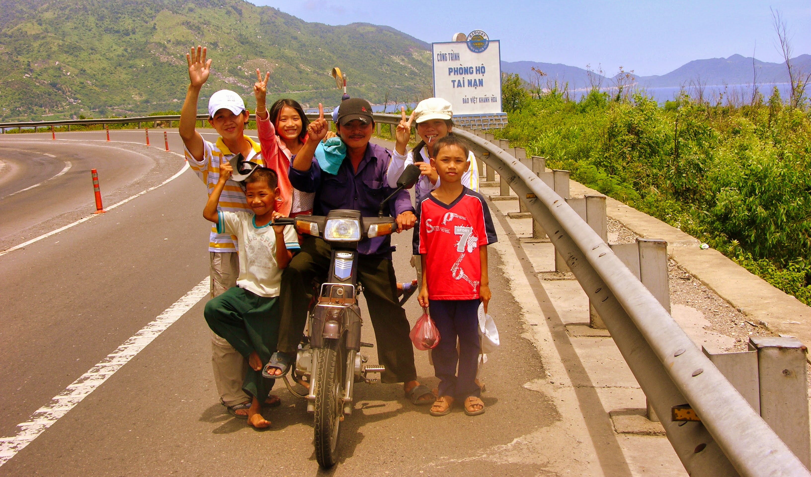
    <em>Along Hwy 1 - Around Dai Lanh</em>
  </figure>

  <figure>
    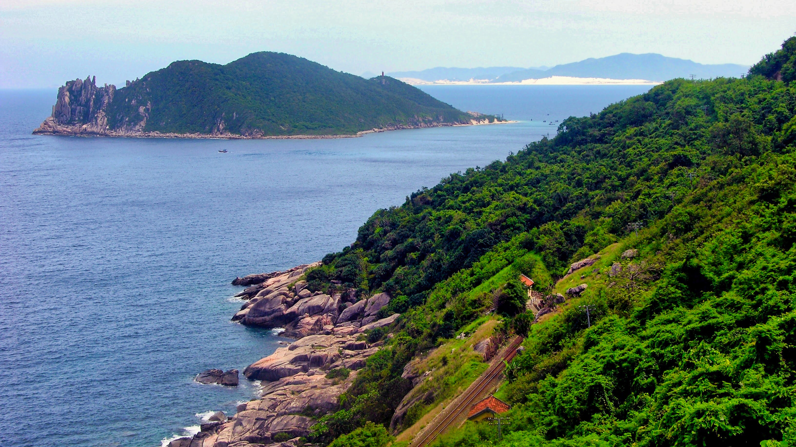
    <em>Dai Lanh Pass</em>
  </figure>

  <figure>
    
    <em>Along Hwy 1 - Around Dai Lanh</em>
  </figure>

  <figure>
    
    <em>Dai Lanh Pass</em>
  </figure>

  <figure>
    
    <em>Along Hwy 1 - Around Dai Lanh</em>
  </figure>

  <figure>
    
    <em>Dai Lanh Pass</em>
  </figure>

## Day 23 — 25 March (113 km)
### Tuy Hòa – Quy Nhơn

For the first time the day was almost continuously hilly. Again and again we climbed short but fairly steep ridges running across the coast. Twenty kilometres beyond Song Cau, Highway 1 swings inland. We turned right instead onto the coastal road 1D into Quy Nhơn, finished only two years ago and therefore a joy to ride. After about ten undulating kilometres through dunes, the road becomes a 20-kilometre mountainous run through coastal hills with occasional spectacular views. The scenery is beautiful: small and large bays with white sandy beaches fringed by coconut palms.

Quy Nhơn — the area's largest city — is a sleepy, pleasant place, well away from Highway 1 and the usual tourist trail. You could call it a smaller, less commercialised version of Nha Trang. It has a lovely golden sand beach stretching for kilometres along the bay. A few kilometres south of the centre on the beach boulevard we found the friendly Au Co Hotel, which was excellent. A huge 'suite' with three large beds, seating area, balcony sea view, and lovingly, gloriously kitsch décor cost an unbelievable 180,000 dong. Across the road from our hotel was a simple but pleasant beach restaurant, Binh Dan. The fresh grilled grouper was superb — some of the best grilled fish I've ever had: crisp skin, firm flesh, perfect sauce — though not exactly cheap at 250,000 dong per kilo.

  <figure>
    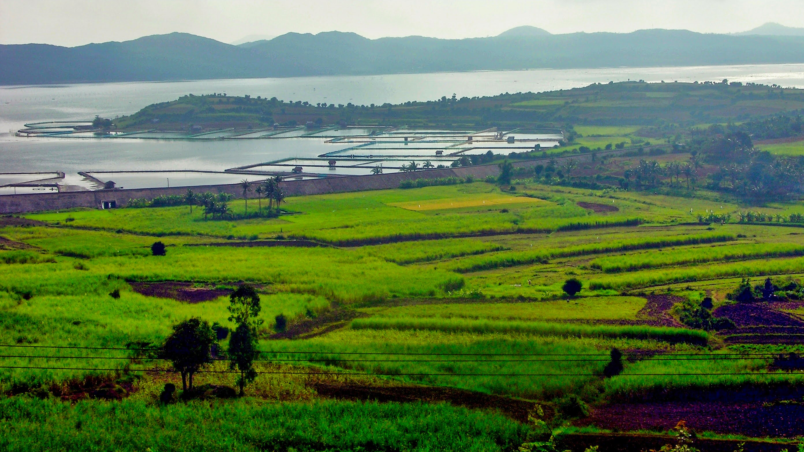
    <em>Along Hwy 1 - Around Tuy Hoa</em>
  </figure>

  <figure>
    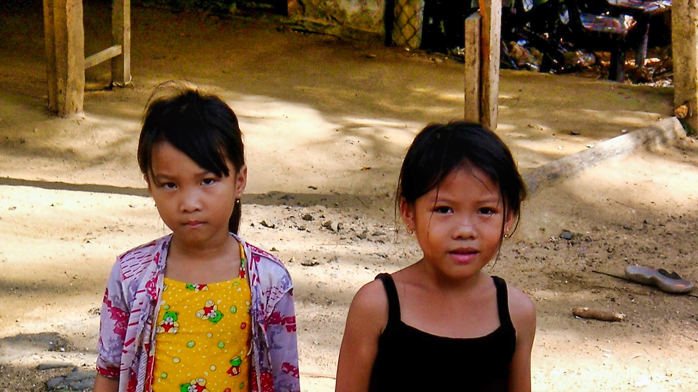
    <em>Along Hwy 1 - Around Tuy Hoa</em>
  </figure>

  <figure>
    
    <em>Along Hwy 1 - Around Tuy Hoa</em>
  </figure>

  <figure>
    
    <em>Along Hwy 1 - Around Tuy Hoa</em>
  </figure>

  <figure>
    
    <em>Along Hwy 1 - Around Tuy Hoa</em>
  </figure>

  <figure>
    
    <em>Along Hwy 1 - Around Tuy Hoa</em>
  </figure>

## Day 24 — 26 March (122 km)
### Quy Nhơn – Sa Huỳnh

A fairly unspectacular day on Highway 1. The first 50 kilometres were flat; the second half from Phu My was a bit hillier, though after yesterday the hills felt mild. And even on an 'unspectacular' day, riding through Vietnam is a feast for the eyes: all the greens of the rice fields and vegetation, farmers in conical hats, ox carts by the roadside, rice grains drying on the highway, fruit piled in markets, motorbikes stacked with pigs, goats, or chickens. Our destination was Sa Huỳnh, a small place with a long beach in a bay where Highway 1 meets the coast again for the first time in a while. Between road and beach there are a few simple guesthouses with restaurants. We stayed at Ha Lan — very basic, but we had a veranda with sea view, plus air-con, minibar and TV, and everything was clean (120,000 dong). Fresh seafood is abundant on this coast. A tasty hotpot, grilled prawns and squid, plus two small whole grilled fish — together with five Saigon beers — came to under €15. Life can be very pleasant.

  <figure>
    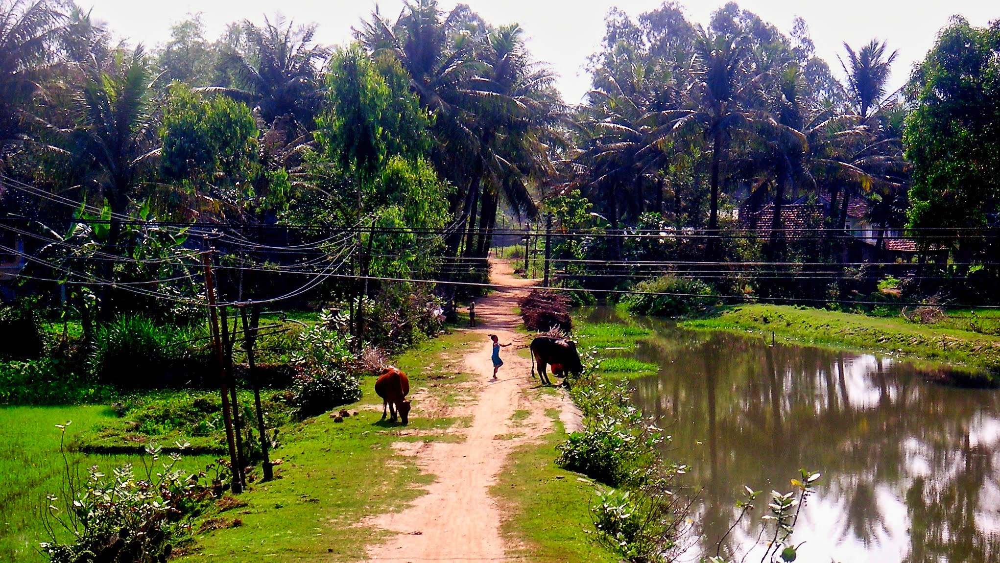
    <em>Along Hwy 1 - Around Phu My</em>
  </figure>

  <figure>
    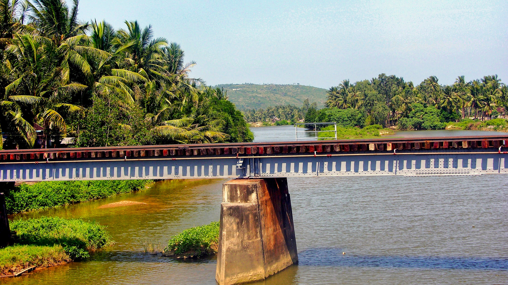
    <em>Along Hwy 1 - Around Sa Huynh</em>
  </figure>

  <figure>
    
    <em>Along Hwy 1 - Around Phu My</em>
  </figure>

  <figure>
    
    <em>Along Hwy 1 - Around Sa Huynh</em>
  </figure>

  <figure>
    
    <em>Along Hwy 1 - Around Phu My</em>
  </figure>

  <figure>
    
    <em>Along Hwy 1 - Around Sa Huynh</em>
  </figure>

## Day 25 — 27 March (132 km)
### Sa Huỳnh – Quảng Ngãi – Tam Kỳ

The last long 'transfer' day on Highway 1 for now. The first 20 kilometres were still slightly hilly, but from Duc Pho onward it was almost completely flat through rice fields away from the coast all the way to Tam Kỳ. The town isn't far from Hội An, yet it sees hardly any tourists — and certainly not many Westerners. We caused quite a stir even just walking through the old riverside market. The highlight of the day was dinner at Quan Gio: an utterly simple place with tiny plastic tables and chairs, but hugely popular and wonderfully located on a wooden platform over the river, with views across rice fields. The food was excellent — top-tier provincial standard — and very cheap, and the atmosphere could hardly be bettered. We ate a whole grilled fish, a whole steamed chicken, fried squid, a delicious warm prawn salad, and drank six beers, all for 200,000 dong. Fantastic dipping sauces and attentive service too.

  <figure>
    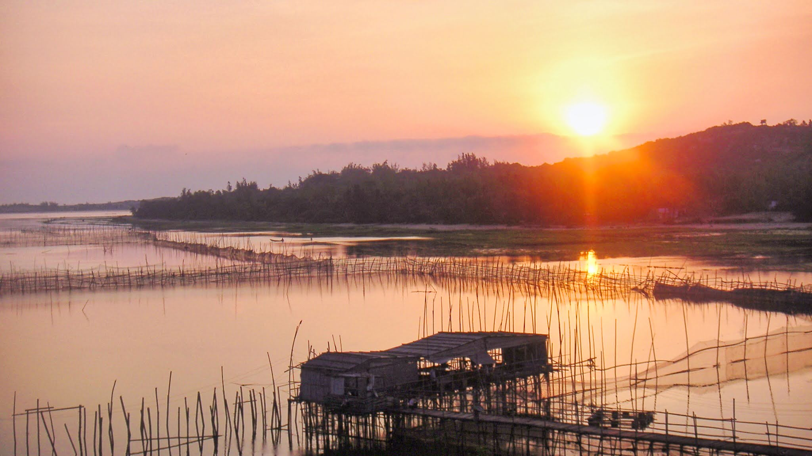
    <em>Along Hwy 1 - Around Sa Huynh</em>
  </figure>

  <figure>
    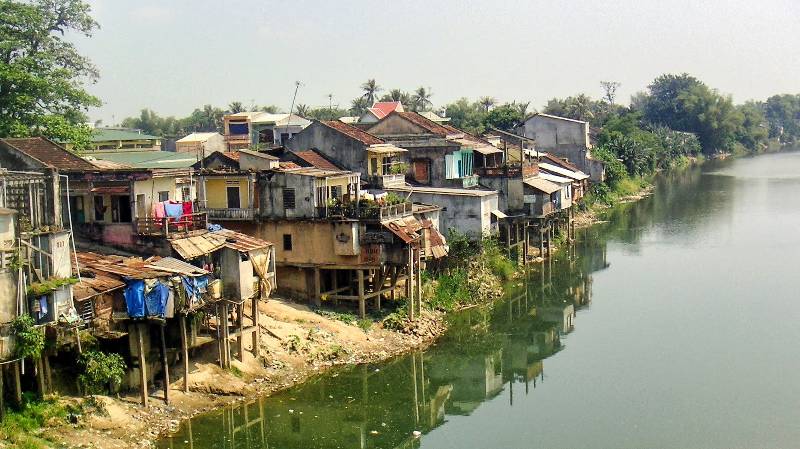
    <em>Along Hwy 1 - Around Quang Ngai</em>
  </figure>

  <figure>
    
    <em>Along Hwy 1 - Around Sa Huynh</em>
  </figure>

  <figure>
    
    <em>Along Hwy 1 - Around Quang Ngai</em>
  </figure>

  <figure>
    
    <em>Along Hwy 1 - Around Sa Huynh</em>
  </figure>

  <figure>
    
    <em>Along Hwy 1 - Around Quang Ngai</em>
  </figure>

## Day 26 — 28 March (62 km)
### Tam Kỳ – Hội An

A short, flat morning ride to Hội An. The only challenge was finding the turn-off from Highway 1. It's also surprising that the road into Hội An — one of the country's biggest tourist destinations — is still a single-lane country road through rural idyll. In town, however, the tourist infrastructure has changed dramatically in recent years. A whole new district — dozens of hotels, bars, shops and restaurants — has sprung up five minutes north of the old town, thankfully in a low-key style. At the friendly Thanh Xua Hotel, we got a modern spacious room with a bathtub and all the usual comforts for just 250,000 dong, including free internet and a pleasant garden café.

Hội An's small historic centre — one of the prettiest in Southeast Asia — has, thankfully, not changed visually. World-heritage status seems to be stronger than greedy speculators. Hội An is always a culinary experience. The town is small, yet you could easily spend a month here just working your way through the restaurants. We started with brunch at Mango Rooms, a wonderfully cosy riverside place furnished with colourful bamboo chairs and cushions. The chef doesn't just do creative local and fusion dishes — he does them very well. We ordered vegetables stuffed with marinated beef, crisp baguette spread with prawn mousse served with a delicious coconut-cream curry, and a green mango salad with prawns. Starters ran 25,000–45,000 dong — very fair for the quality and creativity. For lunch we went to Ly 22, an old-established place that was already popular six years ago and still is. The draw remains the 'a little bit of everything' four-course menu (60,000 dong) of Hội An specialities: white rose dumplings, fried wontons, prawn spring rolls, and fried marinated pork. Good and cheap — still deservedly one of the town's favourites.

  <figure>
    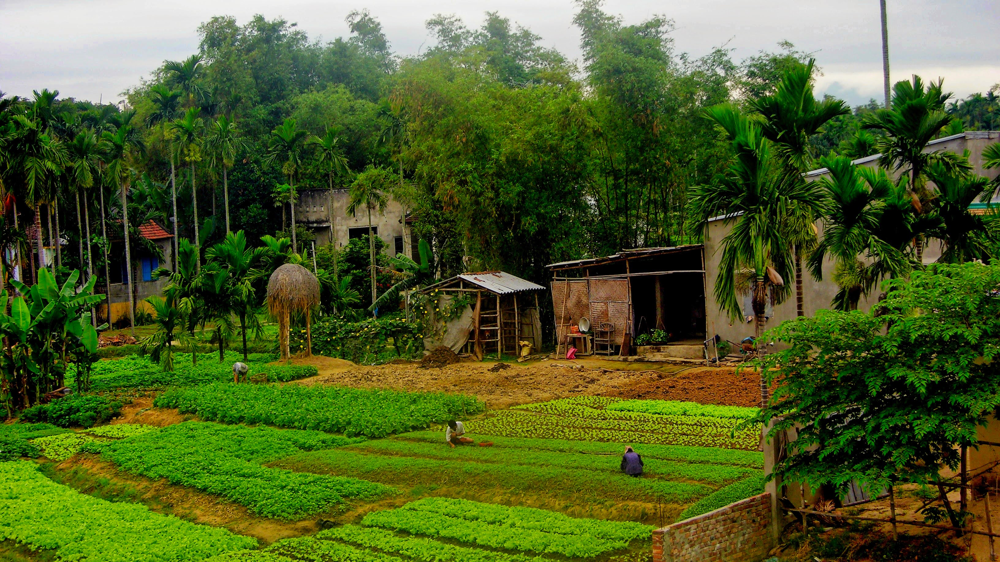
    <em>Around Hoi An</em>
  </figure>

  <figure>
    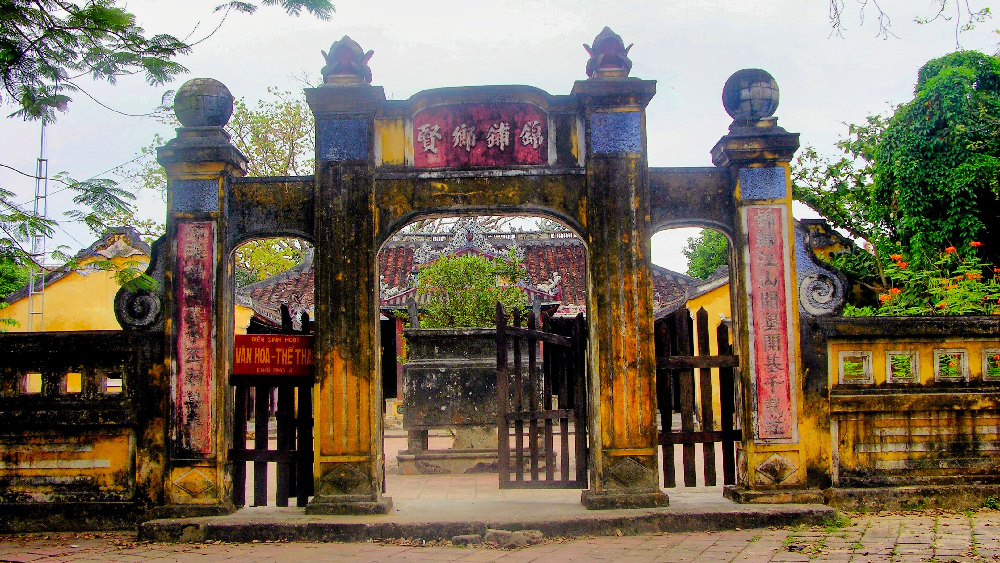
    <em>Hoi An</em>
  </figure>

  <figure>
    
    <em>Around Hoi An</em>
  </figure>

  <figure>
    
    <em>Hoi An</em>
  </figure>

  <figure>
    
    <em>Around Hoi An</em>
  </figure>

  <figure>
    
    <em>Hoi An</em>
  </figure>

## Day 27 — 29 March (40 km)

We had breakfast in the pretty courtyard of Hai Scout Café in the old town. It's comfortable, the fruit shakes are good and — by Hội An standards — reasonably priced (12,000 dong), and the food is solid. The countryside around Hội An is perfect for cycling: the quietest province begins the moment you leave town. Narrow lanes run past small villages through green rice fields and usually end at a river or canal. The endless, broad Cao Dai Beach is only five kilometres from Hội An. But it has changed dramatically. Six years ago there were a handful of simple, ridiculously cheap seafood places with sun loungers on the sand, and I don't remember a single large resort. Now there are probably a dozen four-star resorts.

The nicest and cosiest restaurant on the main road was Son Café, roughly halfway between the old town and the beach. It's pure Indochina cliché in the best sense: built on stilts over a canal, furnished stylishly with white bamboo chairs, sofas and cushions, overlooking an idyllic landscape of rice fields, coconut palms and water, with traditional music playing softly in the background. And yet it's almost absurdly cheap. For dinner we returned to Mango Rooms, having only tried starters last time. The mains passed the test: seared tuna, raw in the middle, with mango salsa (125,000), and prawns wrapped in tender grilled beef were both excellent. Mango Rooms is probably the best restaurant in town right now, and its creative cooking is worth every dong.

  <figure>
    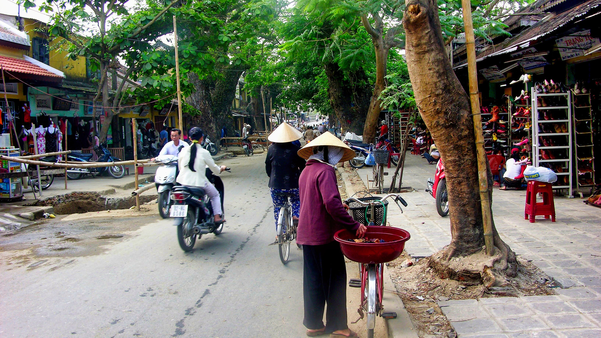
    <em>Hoi An</em>
  </figure>

  <figure>
    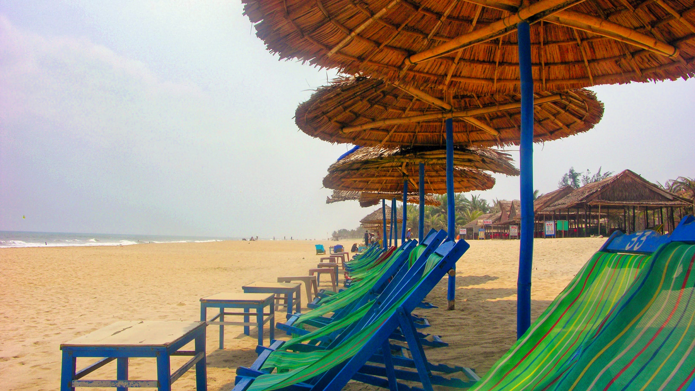
    <em>Hoi An</em>
  </figure>

  <figure>
    
    <em>Hoi An</em>
  </figure>

  <figure>
    
    <em>Hoi An</em>
  </figure>

  <figure>
    
    <em>Hoi An</em>
  </figure>

  <figure>
    
    <em>Hoi An</em>
  </figure>

## Day 28 — 30 March (80 km)
### Hội An – Đà Nẵng

The coastal road from Hội An to Đà Nẵng is being upgraded to a four-lane highway. Unfortunately only the first five kilometres and the last ten or so are finished; the middle section was miserable — sand, gravel, and potholes in endless rotation. Đà Nẵng is a city of around a million people — one of the country's largest — but at first glance you wouldn't guess it. It feels as if the city is only now waking from a long sleep. The city already looks modern and colourful, with new broad boulevards, restored colonial buildings, and a generous river promenade. Đà Nẵng isn't blessed with extraordinary sights or great architecture, but it's an agreeable, untouristed city — an excellent place to see the 'real', modern Vietnam away from the well-worn trail. It's also very cycle-friendly, with wide streets and moderate traffic. We rode nearly 50 kilometres around town and nearby.

The culinary highlight of the day, and one of the best and most expensive meals of the entire trip, was at Apsara — Đà Nẵng's smartest and probably best restaurant. It's elegantly designed, with a replica Cham temple in the garden, traditional music performances, and more staff than tables. The cooking was superb, and for this level of ambience still fairly priced. We treated ourselves to a true feast: three kinds of sashimi (115,000) and grouper maki (30,000), as good as any top Japanese restaurant; a delicious scallop salad served on prawn crackers (58,000); a dozen grilled oysters (54,000); brochettes of marinated beef (38,000); and scallops baked with cheese (65,000). Every dish was a delight, and the whole lot — plus five beers — came to under €25.

<figure>
  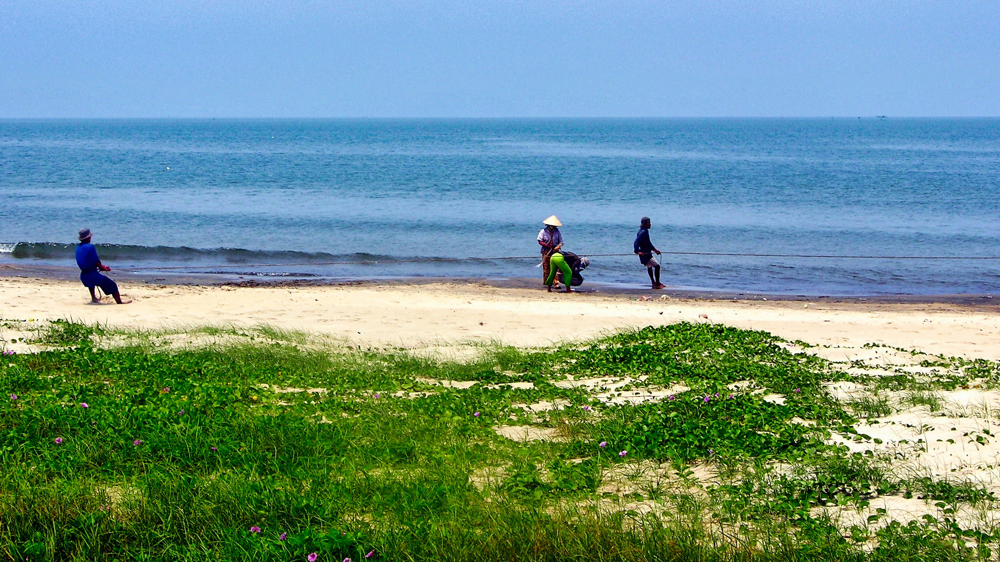
  <em>Danang</em>
</figure>

<figure>
  
  <em>Danang</em>
</figure>

<figure>
  
  <em>Danang</em>
</figure>

## Day 29 — 31 March (112 km)
### Đà Nẵng – Huế

Leaving Đà Nẵng was pleasantly easy, riding along the bay until after about 15 kilometres the road rejoined Highway 1. What followed was less relaxed. First a motorcyclist crashed into my rear pannier and went down, causing general panic because his child (luckily only lightly) was injured. Through no fault of my own I ended up at a police station where nobody spoke English. Surprisingly, after I described what happened to an English teacher at a nearby school, I was released without hassle or bribes and could continue. After that whole performance, the climb up to the Hải Vân Pass began immediately — the most mountainous section of the entire north–south route, rising to about 500 metres above sea level. The pass is often shrouded in mist and forms a climatic divide between Vietnam's tropical south and its subtropical north. The coastal scenery here is stunning: powerful mountains dropping to lonely sandy coves. Beyond the pass lies Lăng Cô, a picturesque sandy spit with fishing boats on the beach — pure postcard.

Huế, the old imperial capital, is one of the country's main tourist magnets. Last time, though, it left me oddly cold. The once-grand citadel was badly destroyed in the war and only a handful of buildings remain. We stayed at the friendly Hai Dang Hotel, very central on the main road to the river. At 160,000 dong it was outstanding value. Huế is considered Vietnam's culinary capital, but our first meal — an afternoon stop at the recommended Tropical Garden — was only middling. In the evening we played it safe and returned to a place we already trusted. We'd eaten very well at Paradise Garden six years ago, and it was excellent again. The fish-filled spring rolls (40,000) are among the best in Vietnam, and portions are generous. Also very good were Huế-style beef salad (40,000) and ram Huế (30,000), a local speciality resembling small meat-filled samosas served with peanut sauce.

  <figure>
    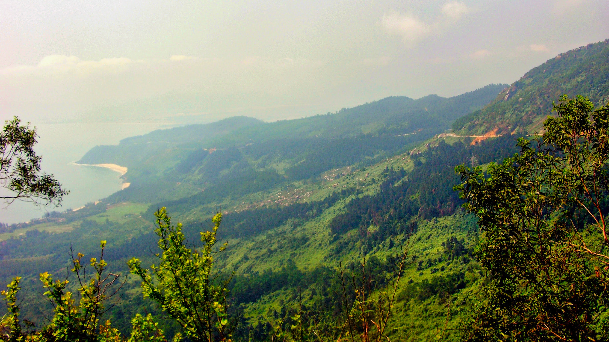
    <em>Along Hwy 1 - Hai Van Pass</em>
  </figure>

  <figure>
    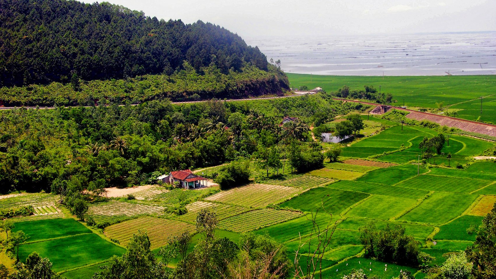
    <em>Along Hwy 1 - Around Hue</em>
  </figure>

  <figure>
    
    <em>Along Hwy 1 - Hai Van Pass</em>
  </figure>

  <figure>
    
    <em>Along Hwy 1 - Around Hue</em>
  </figure>

  <figure>
    
    <em>Along Hwy 1 - Hai Van Pass</em>
  </figure>

  <figure>
    
    <em>Along Hwy 1 - Around Hue</em>
  </figure>

## Day 30 — 1 April (70 km)
### Huế – Hà Nội

We began by cycling through the quiet streets of the outer citadel, a part of town that feels almost village-like. We then left Huế along a narrow, idyllic country road, partly following the Perfume River's north bank and passing the photogenic Thien Mu Pagoda. For lunch we had our best meal in Huế at Tan Long, a simple local place that was nevertheless very nicely arranged. It didn't even have an English menu — unusual for a tourist town like Huế. Maybe that's why it was both cheap and delicious: crisp nems (30,000) served properly with lettuce, mint and coriander; an excellent beef salad (30,000); finely marinated grilled squid (30,000); and two small grilled catfish (40,000). A large bottle of Huda cost only 6,000 — an authentic, highly recommended spot.

In pouring rain we cycled to the station in the afternoon and learned that our express train to Hà Nội had no luggage car for bicycles, so the bikes would have to go on tomorrow's train instead. I'm writing these lines in our sleeping compartment, which is not exactly luxurious: four berths squeezed into a narrow space, slightly dubious bedding, and dinner on the train — although included in the fare — utterly inedible. This is first-class sleeper, mind you. It's no comparison with the comfort of Thai trains; you even have to make the beds yourself. For a bit over €20 you'd expect rather more.

  <figure>
    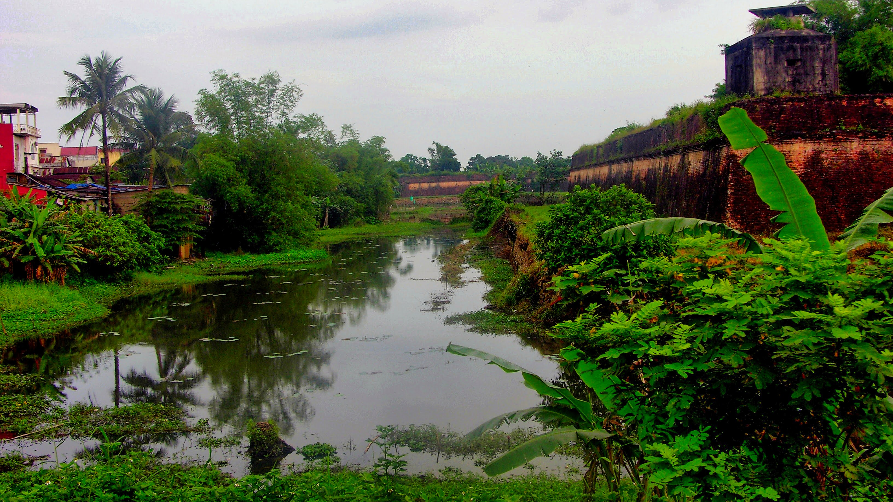
    <em>Hue</em>
  </figure>

  <figure>
    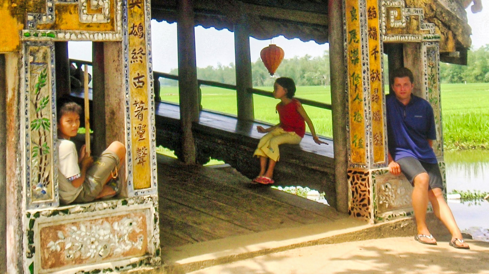
    <em>Around Hue</em>
  </figure>

  <figure>
    
    <em>Hue</em>
  </figure>

  <figure>
    
    <em>Around Hue</em>
  </figure>

  <figure>
    
    <em>Hue</em>
  </figure>

  <figure>
    
    <em>Around Hue</em>
  </figure>

## Days 31–33 — 2–4 April (72 km)

After roughly twelve hours on the train, and a delay of just over an hour, we arrived in Hà Nội early in the morning. As we didn't yet have the bikes and many hotels weren't open at that hour, our options were limited, so we took a taxi straight to the Viet Anh in the Old Quarter. The Old Quarter still offers authentic street scenes and wonderfully photogenic moments, but the harassment from cyclo drivers, xe ôm riders, and street sellers has become barely tolerable. And beyond the chaotic Old Quarter there is another Hà Nội: elegant and dignified, with stately colonial villas, quiet temples, many lakes, and broad avenues. It's precisely these two completely different faces that make Hà Nội so attractive.

After spending our first day on foot mainly in the Old Quarter and around Hoàn Kiếm Lake, we used our bicycles to the full on the second day — by then they had arrived from Huế without damage. We rode 40 kilometres criss-crossing the city and looping around West Lake. The best food we had in Hà Nội was at the affordable and authentic Quán Ăn Ngon. This huge open-air place near the station is rightly popular with Hà Nội's middle class and with a few in-the-know Westerners. In a beer-garden atmosphere, local specialities — mainly soups, seafood and starters — are cooked in front of you and brought straight to the table. Quality is excellent, and for a feast of five different starters (bánh and nem), fresh oysters, beef salad and squid skewers we paid, beer included, just over €10. The best cappuccino in town (25,000 dong) was at the charming Café au Lac, in a lovely courtyard in front of an old villa.

Then it was off to the airport: over the Red River on a kilometre-long bridge and then along the cycle lane beside a four-lane highway — about 30 kilometres in total. Hà Nội's airport is small, modern and comfortable, and our AirAsia flight to Bangkok was on time. We only reached Banglamphu in the evening and took a room at Mango Lagoon Place. Dinner at Hemlock's was superb: classic Thai cooking, hard to beat in Bangkok, and especially at these prices. The Tavoy spicy salad with chicken and sesame (80 baht) was excellent, as was the gang kua pineapple-prawn curry (80 baht), plus fish patties (80 baht) and a ferociously hot jungle curry (75 baht).

## Days 34–35 — 5–6 April

We spent our last two days in Bangkok shopping and eating, as you do in Bangkok. The sushi at Taketei was still excellent, as were the curries and tandoori dishes at Royal India. We ate fantastic dim sum (35 baht per portion) at Shangri La on Yaowarat, and superb seafood at Somboon Seafood, one of Bangkok's biggest and most popular restaurants. Crab curry (250 baht), raw marinated crab meat (150 baht), and scallops with green asparagus (150 baht). To round off a successful trip, we treated ourselves to a final gourmet meal at Blue Elephant.

---

**Exchange rates (March 2006):**
€1 = 47 baht · €1 = US$1.20 · €1 = 19,000 dong · €1 = 4,600 riel

<figure>
  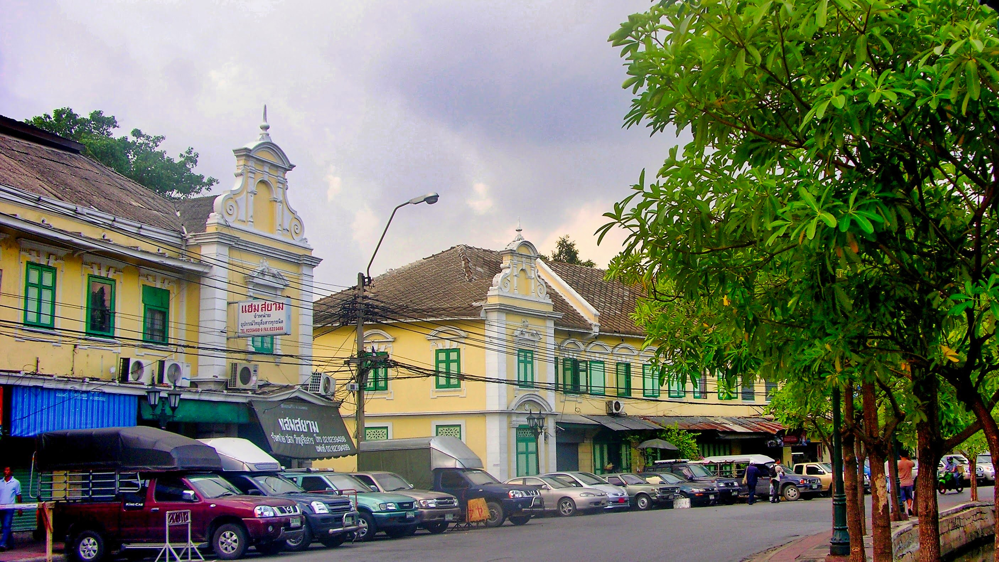
  <em>Bangkok</em>
</figure>

<figure>
  
  <em>Bangkok</em>
</figure>

<figure>
  
  <em>Bangkok</em>
</figure>

