**Cycling Indochina & Yunnan**

*4 April – 11 July 2008*

# Part 1 — Chiang Mai to Jinghong

*4–18 April 2008*

## 4 Apr · 80 km — Chiang Mai – Chiang Dao

Eighty largely uneventful kilometres along Route 107 heading north. The first 50 km were dull, a four-lane road, mostly flat. The next 20 km had a few small hills to tackle before levelling out again on the way into Chiang Dao. This small town has become a popular stop for travellers, though mainly for its proximity to beautiful mountain scenery rather than for the town itself, which is unremarkable. There are, however, a few scattered guesthouses and Western-style cafés. I stayed at Chiang Dao Rainbow, in a peaceful, rural ban just outside town, a very pleasant, cosy resort in lovely surroundings. The cheapest rooms are rather small with shared bathrooms, but with only three rooms to two bathrooms, the standard was excellent (300 baht).

## 5 Apr · 104 km — Chiang Dao – Fang – Thaton

The first part of the day was hilly, with a fairly long climb over a pass. Around 30 km before Fang, the road descended into a valley, and the rest of the route was flat and uneventful. Thaton is one of the more attractive towns, beautifully set on a bend of the Nam Song River, with a picturesque temple complex in the hills above. Down by the riverbank you can sit on straw mats, drink beer, and watch the locals swimming. As the boat trip from Thaton to Chiang Rai is popular with tourists, there are plenty of places to stay. I stayed at Kwan’s Guesthouse, just before the bridge, a friendly, sociable place with simple but adequate rooms, all en-suite, for 200 baht.

<figure>
  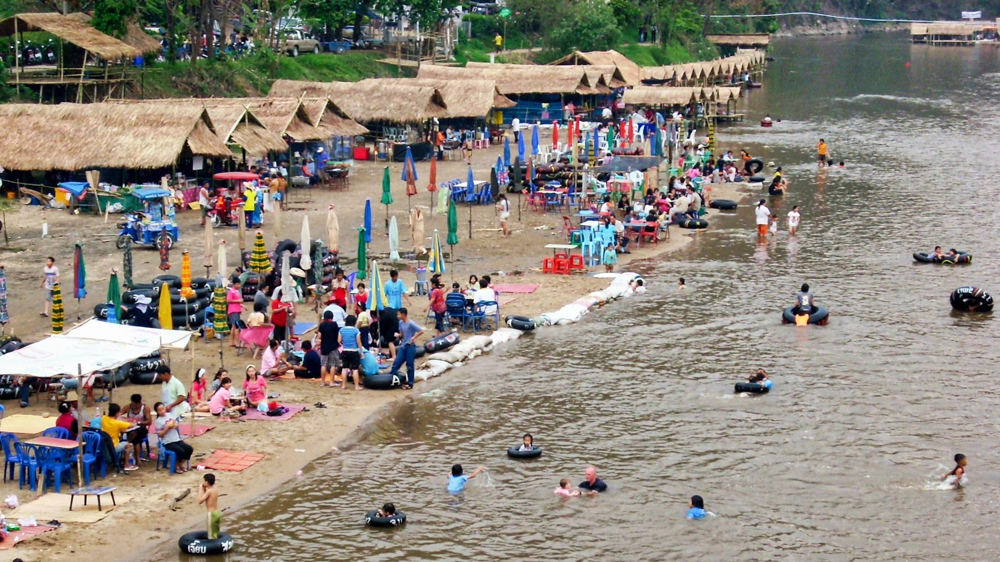
  <em>Thaton</em>
</figure>

## 6 Apr · 98 km — Thaton – Mae Chan – Chiang Saen

The day started with some hills before turning into a proper mountain stage, with long, steep climbs through rugged highland scenery and hill-tribe villages. The region is so dry at the moment, though, that it lacks real scenic appeal. Still, the road itself is in excellent condition. Approaching Mae Chan, the route flattened out into a broad valley, and the remaining 40 km to Chiang Saen were flat and easy-going. Chiang Saen is a pleasant, quiet town on the mighty Mekong. In the evening, numerous food stalls along the riverbank serve grilled fish. Chiang Saen Guesthouse on the riverside road offers rooms of various categories, including a spacious one with hot shower and TV for 300 baht, modern and very clean.

## 7 Apr · 70 km — Chiang Saen – Chiang Khong – Houay Xay

There are two ways to cycle from Chiang Saen to Chiang Khong: a direct route or a longer one following a bend in the Mekong. I took the latter and was rewarded with ideal cycling terrain, an excellent, quiet road winding through hilly country near the river, surrounded by beautiful scenery. About 20 km before Chiang Khong, I came across a secluded resort with a veranda overlooking strawberry fields on the riverbank, a great place to sit with a fresh strawberry shake. In Chiang Khong I crossed into Laos by longtail boat. Houay Xay, on the opposite bank, lacks the colonial charm of other Lao Mekong towns, but thanks to its status as an entry/exit point it now has plenty of guesthouses. I stayed at Nam Kong View for 200 baht, a clean, decent room with a hot shower. Best of all was a veranda overlooking the river, perfect for watching the beautiful sunset.

  <figure>
      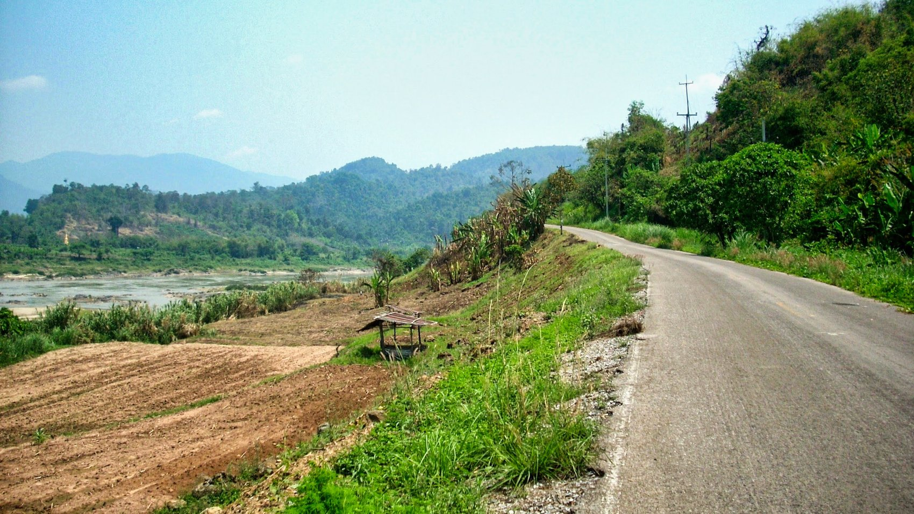
      <em>Along the Mekong to Chiang Khong</em>
    </figure>

  <figure>
      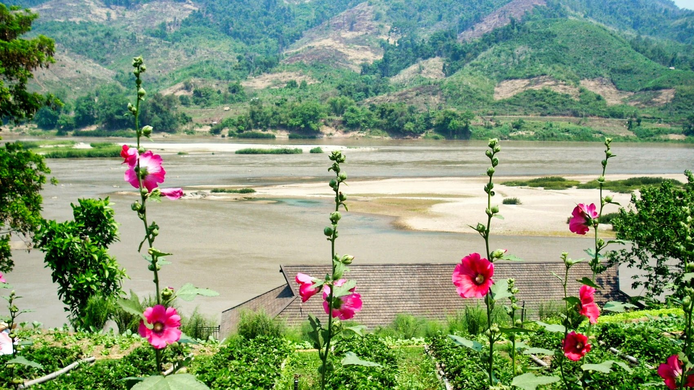
      <em>Along the Mekong to Chiang Khong</em>
    </figure>

  <figure>
      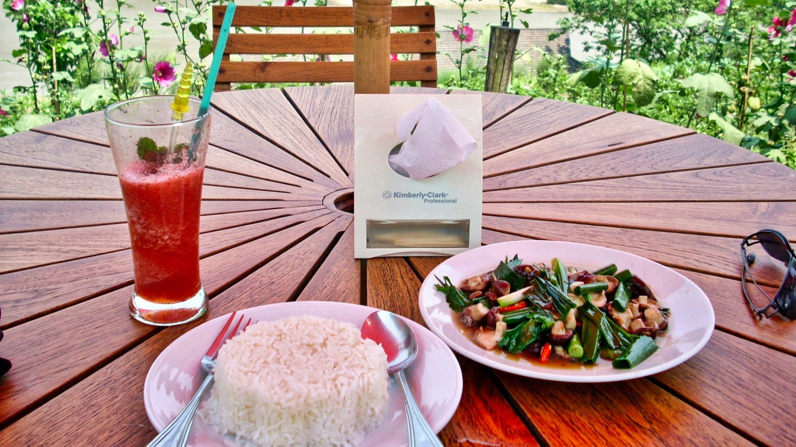
      <em>Along the Mekong to Chiang Khong</em>
    </figure>

  <figure>
      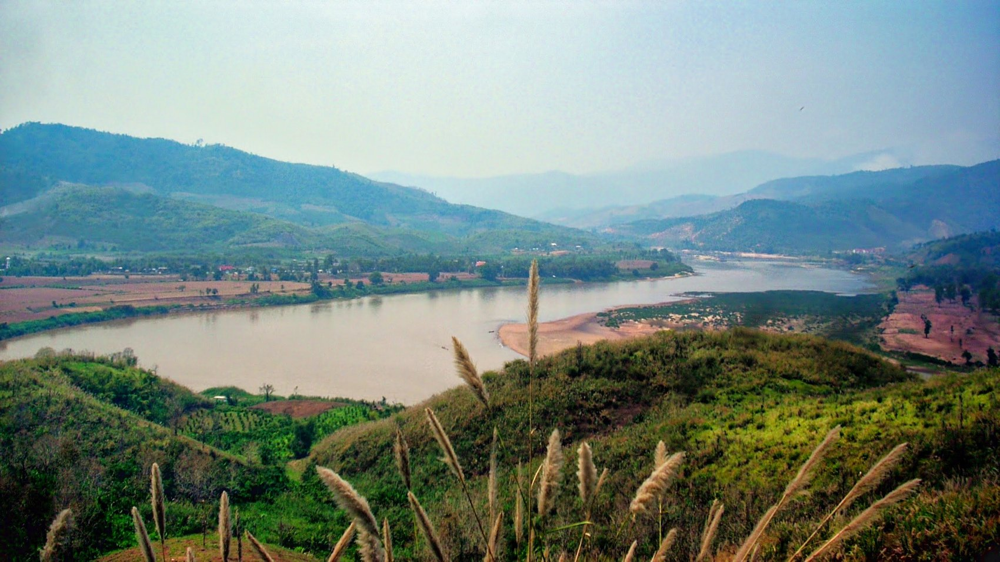
      <em>Along the Mekong to Chiang Khong</em>
    </figure>

  <figure>
      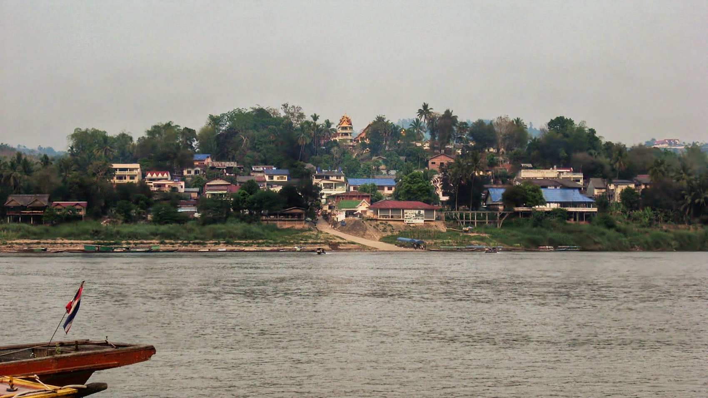
      <em>Chiang Khong</em>
    </figure>

  <figure>
      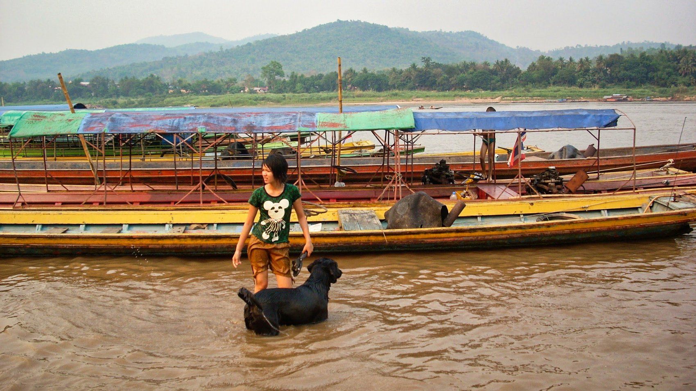
      <em>Chiang Khong</em>
    </figure>

## 9 Apr — Houay Xay

Interestingly, Houay Xay does not have a single good restaurant. Deen served what was possibly the worst Indian food I’ve ever had, and otherwise there are only simple eateries offering standard Lao fare such as laab with sticky rice, sometimes well prepared, sometimes less so. Still, I stayed a few days, reading, relaxing, and cycling a little. There isn’t much else to do here, but Laos’ laid-back atmosphere soon rubbed off on me.

<figure>
  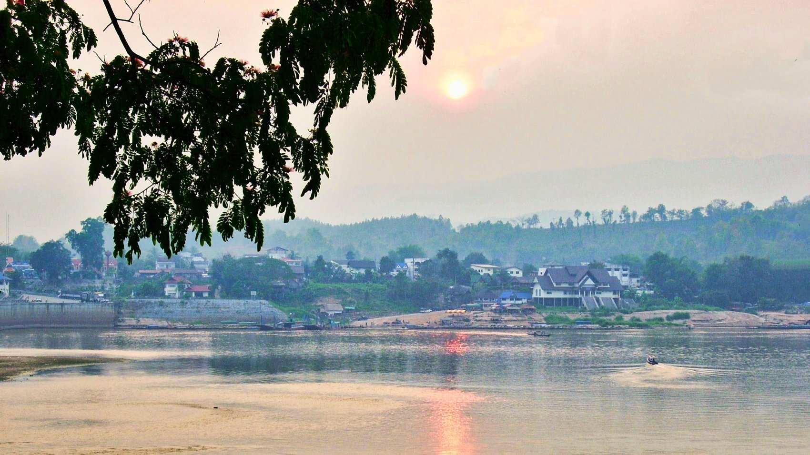
  <em>Huay Xay</em>
</figure>

## 10 Apr · 122 km — Houay Xay – Vieng Phouka

Six years ago this route meant an exhausting eight-hour songthaew ride over poor dirt roads from Houay Xay to Luang Namtha. A new China-funded road has recently been completed, though: now the best road in Laos, with perfect tarmac, no potholes, and barely any traffic. Even so, the ride to Vieng Phouka was tough, shadeless, constantly hilly, with some seemingly endless, steep climbs. Along the way there were only a few basic hill-tribe villages, and at times long stretches with no food or water. Vieng Phouka is barely more than a village, with electricity only for a few hours in the evening. It is, however, slowly developing into an eco-trekking hub, and there are a few very simple guesthouses. I stayed at Bokung, a quiet place surrounded by greenery a few hundred metres off the main road. The basic wooden bungalows had uncomfortable beds, squat toilets, and barrel showers, but at just 30,000 kip they were extremely cheap. Since all four travellers in Vieng Phouka that evening stayed there, it was also quite a sociable guesthouse.

<figure>
  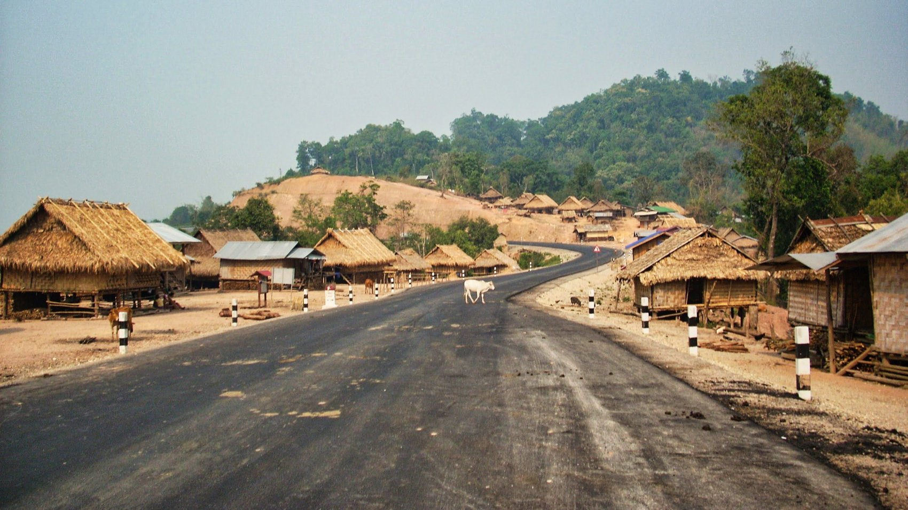
  <em>Hwy 3 to Luang Nam Tha</em>
</figure>

## 12 Apr — Vieng Phouka

With good company, I stayed two more days in Vieng Phouka. On the first day we were invited to a New Year celebration by the families of the trekking guides. After a Baasi ceremony to drive away evil spirits, there was a big drinking session with dancing in the middle of the forest. An unforgettable experience, with beer and Lao Lao flowing from 11 am, and by sunset everyone, regardless of age or gender, was completely drunk. For the next day I had booked a trek with Lea, an American, which turned out to be amusing because she was really unwell. I had quite a hangover too, and even the guides weren’t in the best shape. We first visited a Khamu village and a cave inhabited by numerous vampire bats, with fascinating rock formations, one of the most impressive caves in Southeast Asia. We then set off on a very strenuous hike along steep paths, some of which had to be cleared with a machete, through the jungle-covered karst mountains. Back in Vieng Phouka we were treated to a well-earned feast of fresh forest mushrooms, black coconut sticky rice, eggplant salad, and grilled duck. The treks organised from Vieng Phouka aren’t cheap (280,000 kip), but you can be sure the money ends up in the right hands.

  <figure>
      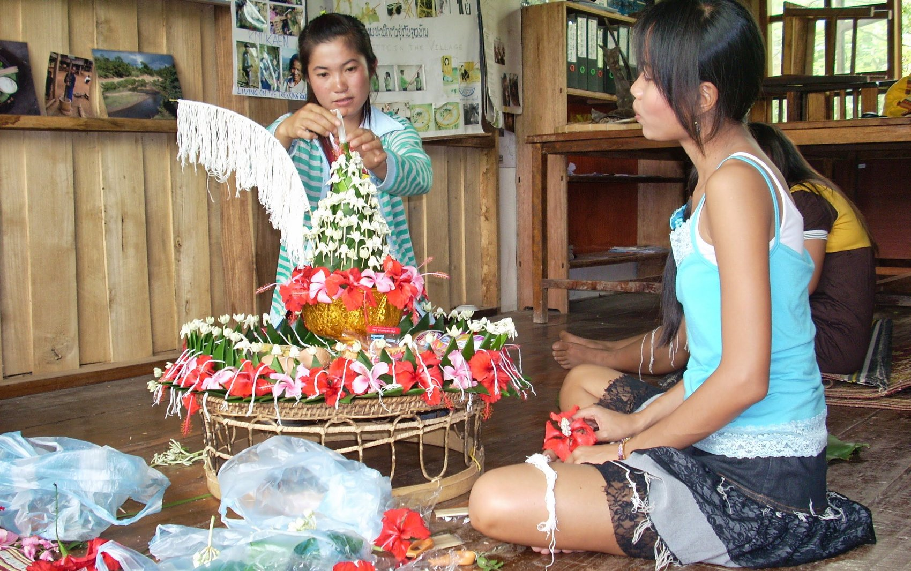
      <em>Vieng Phouka</em>
    </figure>

  <figure>
      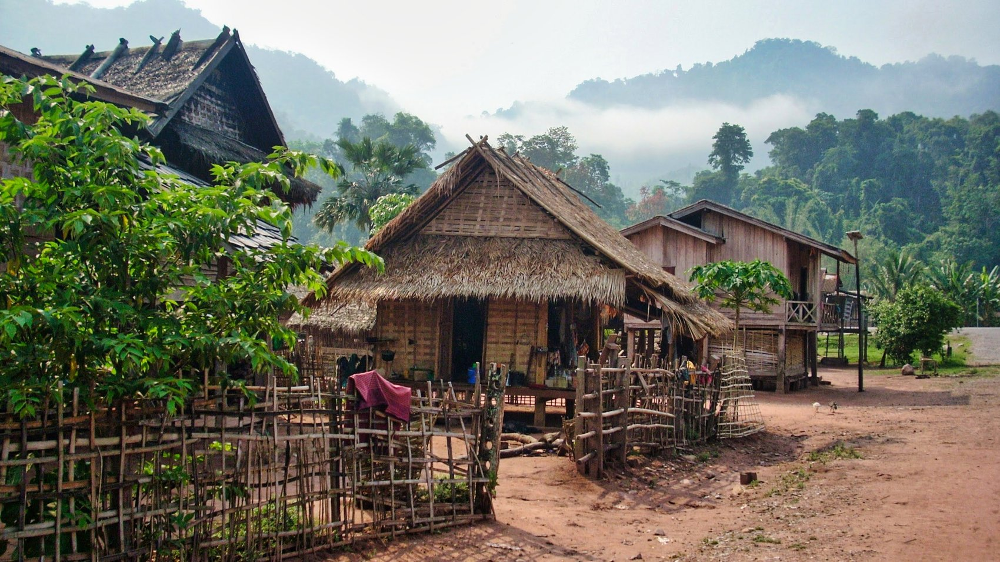
      <em>Nam Ha National Bio-Diversity Conservation Area</em>
    </figure>

  <figure>
      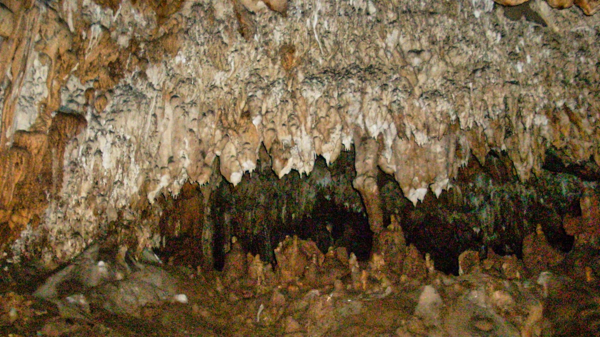
      <em>Nam Ha National Bio-Diversity Conservation Area</em>
    </figure>

  <figure>
      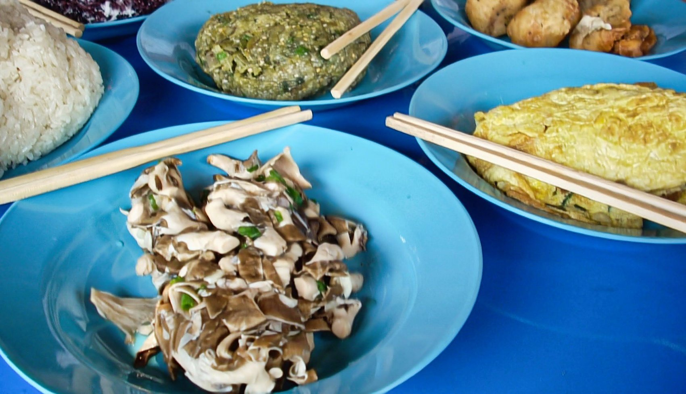
      <em>Nam Ha National Bio-Diversity Conservation Area</em>
    </figure>

<figure>
  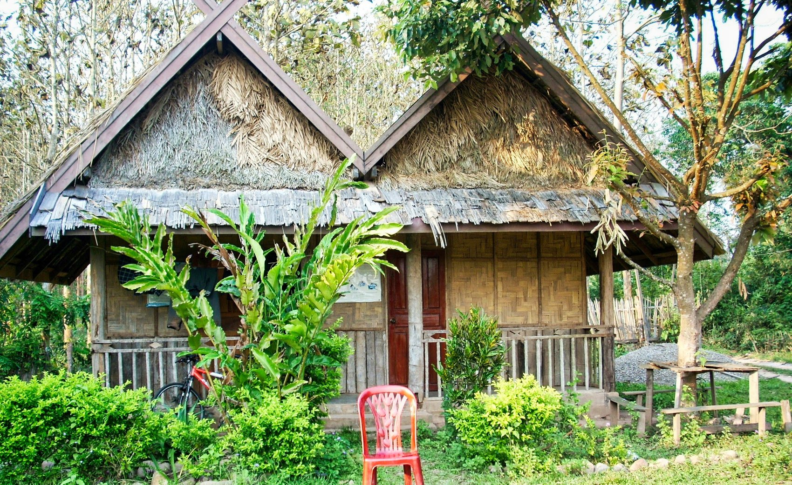
  <em>Vieng Phouka - Bokung GH</em>
</figure>

## 15 Apr — Luang Nam Tha

The remaining 60 km to Luang Nam Tha were far easier than the stretch between Houay Xay and Vieng Phouka. It’s still hilly, but there are only two short, steep climbs, and often the road just rolls gently through river valleys. Scenically this route is very beautiful, even in the dry season, especially where it winds through the valleys. Luang Nam Tha lies in a long, wide valley and has grown into a small, very sociable traveller hub. The town itself isn’t especially attractive, but there are very good guesthouses, and the surrounding area offers great cycling and walking. I stayed at Zuela Guesthouse, a little back from the main road, with new, spacious, very clean rooms for 60,000 kip. Not exactly cheap, but a comfortable bed and a large bathroom with a hot shower made it worthwhile.

  <figure>
      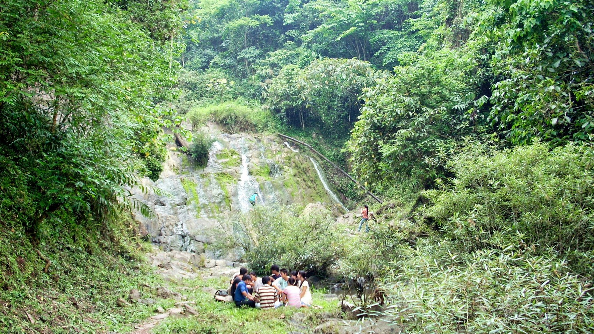
      <em>Luang Nam Tha</em>
    </figure>

  <figure>
      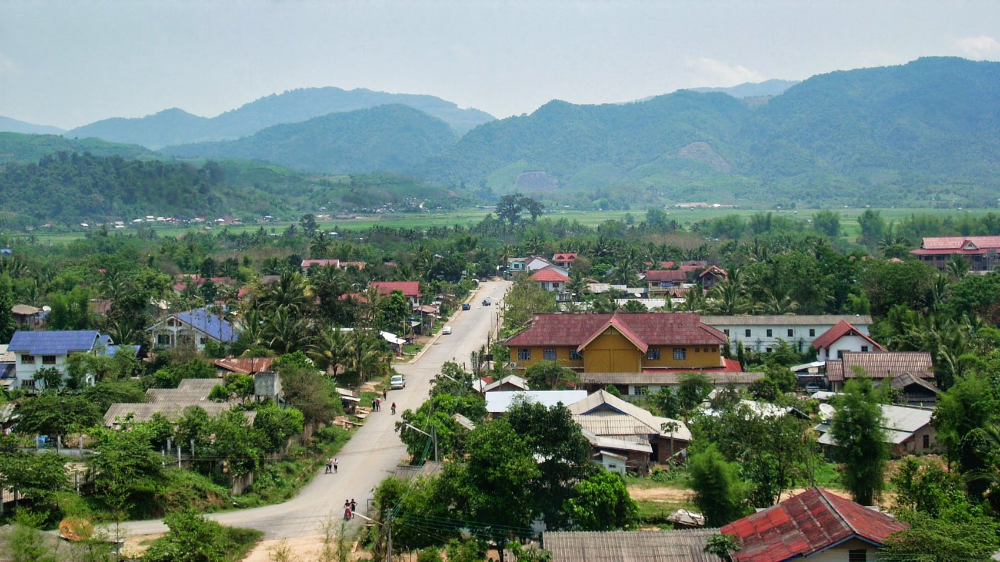
      <em>Luang Nam Tha</em>
    </figure>

  <figure>
      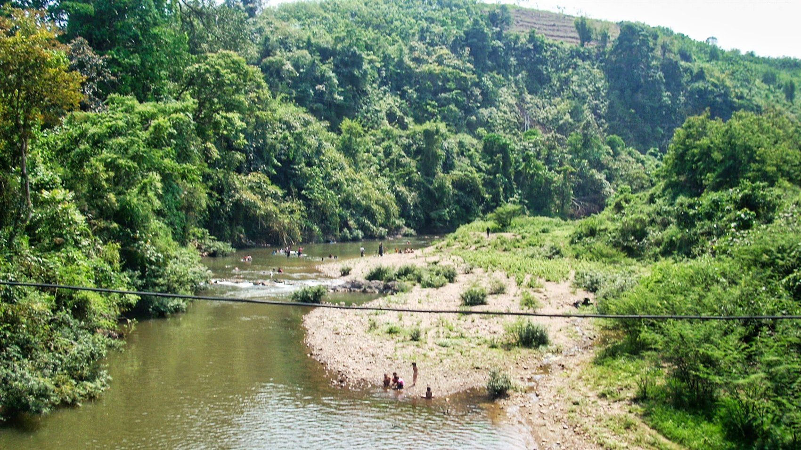
      <em>Luang Nam Tha</em>
    </figure>

  <figure>
      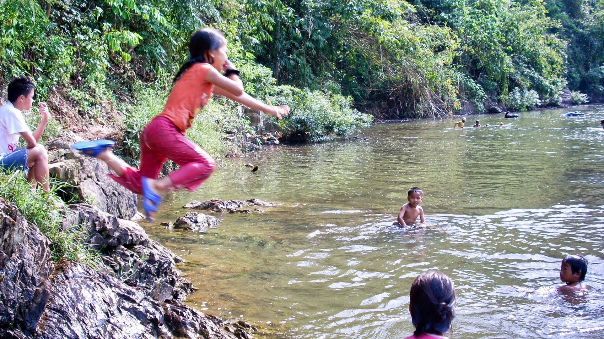
      <em>Luang Nam Tha</em>
    </figure>

  <figure>
      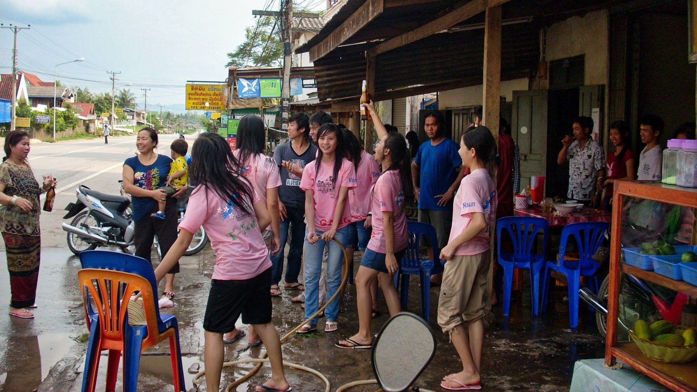
      <em>Luang Nam Tha</em>
    </figure>

  <figure>
      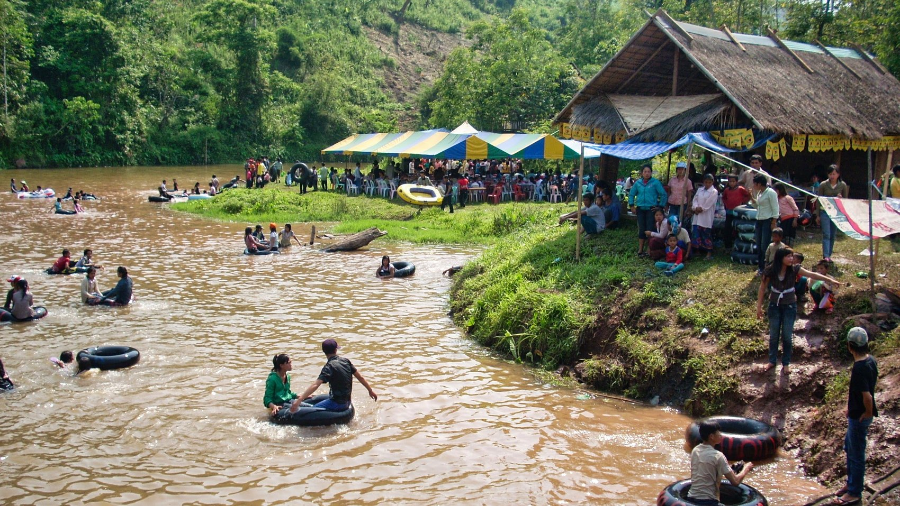
      <em>Luang Nam Tha</em>
    </figure>

<figure>
  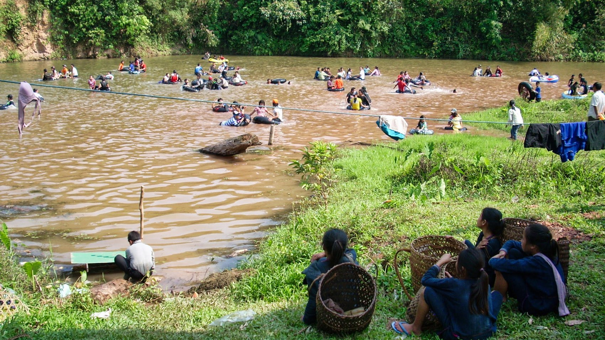
  <em>Luang Nam Tha</em>
</figure>

The Lao New Year festivities peaked during these days, and since I made some nice acquaintances here, including a well-travelled Greek and a French woman who was also cycling, I stayed for the rest of the festival. We spent most of our time exploring the immediate surroundings of Luang Nam Tha by bike and on foot: there’s a pretty little waterfall, lovely swimming spots in the river, and friendly villages along unpaved tracks. We were regularly drenched and occasionally pulled into the many small local parties for Lao Lao or beer. And unlike Houay Xay, Luang Nam Tha has decent restaurants, like Yamuna, where the Indian food, although a bit pricier, was far better than in Houay Xay. There’s also Panda Restaurant, very pleasant, where you could enjoy not only excellent, affordable Lao-farang cuisine but also simple, drinkable French table wine at a cheap 10,000 kip a glass. All in all, Luang Nam Tha is a fine place to spend a few relaxing days, even if you’re not trekking.

## 16 Apr · 108 km — Luang Nam Tha – Boten – Mengla

From Luang Nam Tha it was almost 60 km on a well-maintained road to the Chinese border, a scenic route, mostly gently hilly along the slopes of narrow river valleys. There was only a small pass to cross, and I was through the border formalities before 11 am. On the Chinese side, too, everything went smoothly and quickly, with no questioning or luggage checks. The remaining 50 km to Mengla ran along the brand-new expressway, which bypasses the terrain through tunnels and over bridges, cutting through the beautiful mountain landscape. As there was hardly any traffic, it would have been pointless to take the longer, hillier old road. Despite the time difference, I arrived in Mengla before 3 pm, with plenty of time to acclimatise on my first day in this new country.

  <figure>
      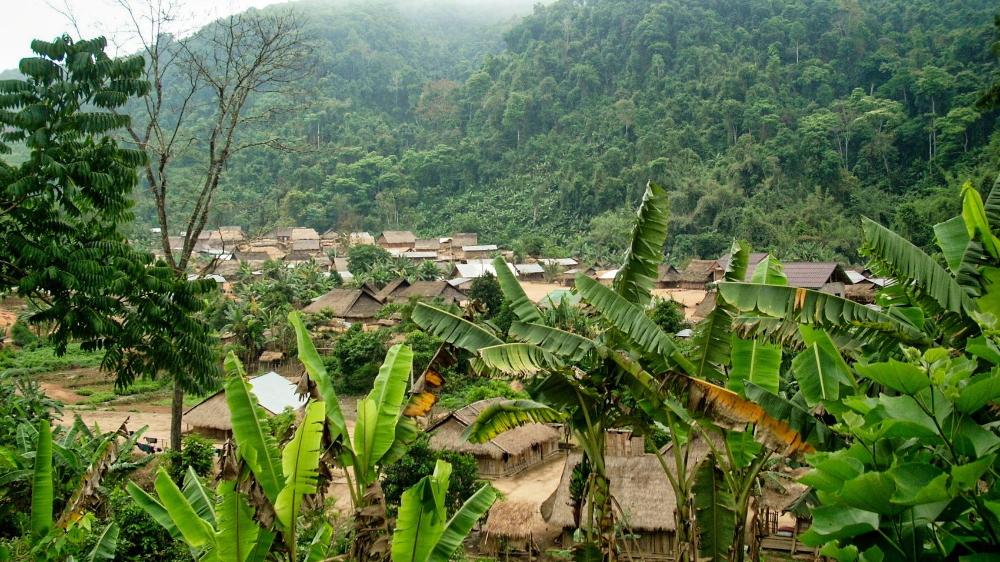
      <em>Hwy 3 to Boten</em>
    </figure>

  <figure>
      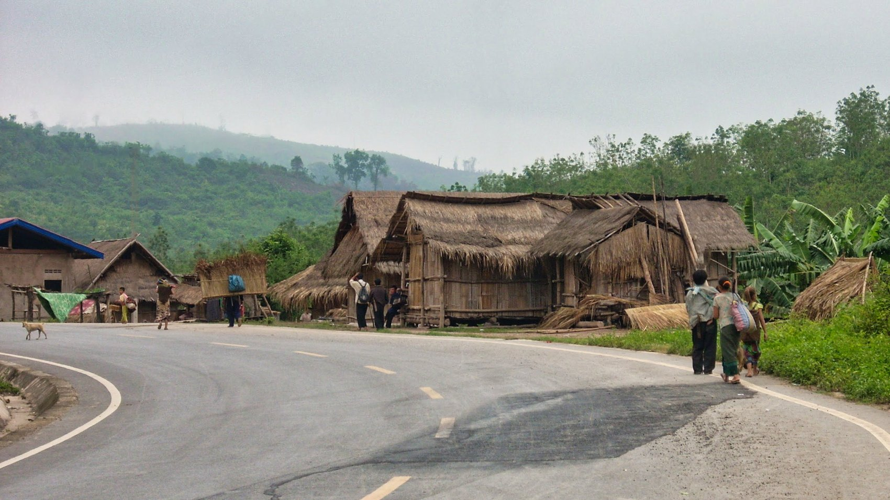
      <em>Hwy 3 to Boten</em>
    </figure>

  <figure>
      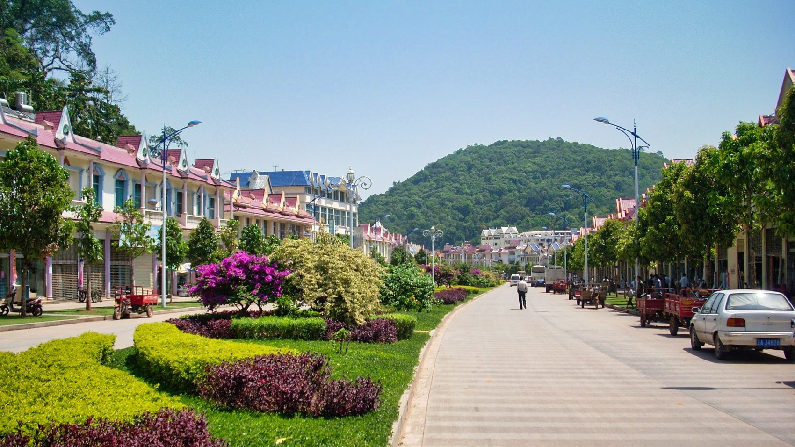
      <em>Xishuangbanna - Mohan Border</em>
    </figure>

  <figure>
      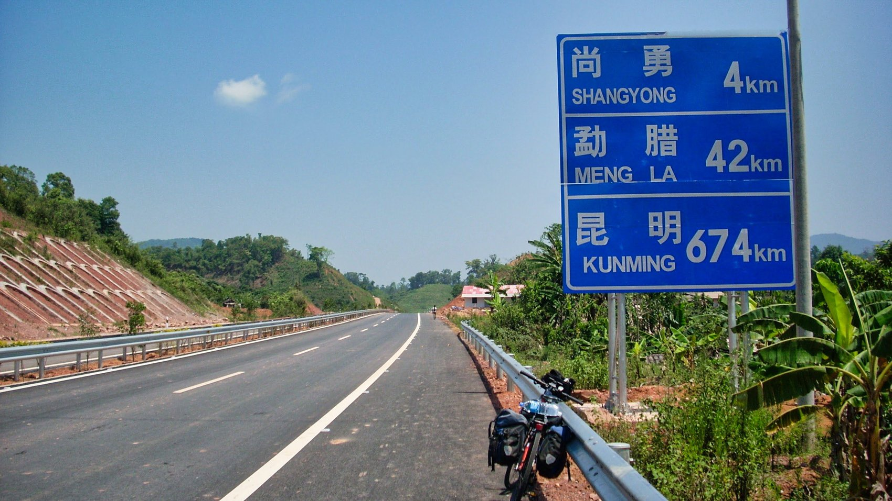
      <em>Xishuangbanna</em>
    </figure>

Having heard many traveller tales about China, I was pleasantly surprised by how easy it was to sort out the essentials. No one here speaks English, but with a phrasebook it’s not so bad. I found a room at Lan Fa Hotel right in the centre (all the numerous hotels here also had signs in Latin script) for a cheap 50Y, with two beds, a TV with 60 channels, air-conditioning, and hot water. The toilet was Asian-style, and general cleanliness in China doesn’t seem to be a top priority, but the beds were clean and the decor modern. For food, I found a small, simple restaurant on the main street of this untouristy town with an English menu, and ordered delicious fried aubergines stuffed with minced meat, a huge plate for an absurdly cheap 8Y. The only thing I couldn’t find in Mengla (or at the border) was a working ATM. There were about half a dozen, but they were either “out of order” or couldn’t connect to my bank. Had I really needed money, though, I could have changed it at the border or in town. Mengla is not a beautiful town, but it’s friendly and modern, and a very pleasant introduction to Chinese city life. After Laos, everything feels loud and hectic, but it wasn’t the culture shock I’d expected.

  <figure>
      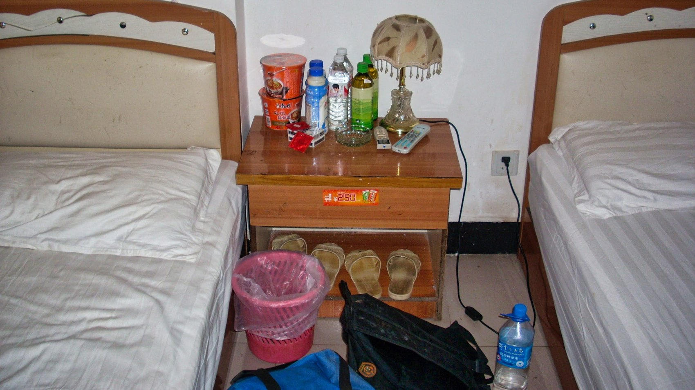
      <em>Xishuangbanna - Mengla - Lan Fa Hotel</em>
    </figure>

  <figure>
      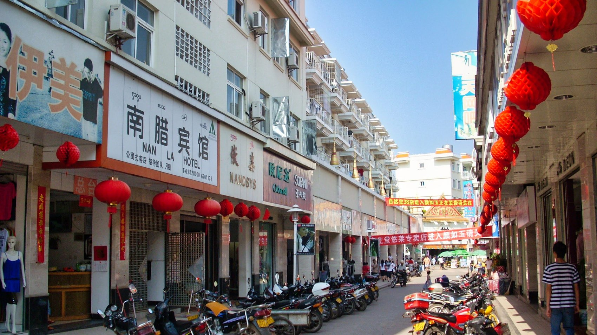
      <em>Xishuangbanna - Mengla - Lan Fa Hotel</em>
    </figure>

## 17 Apr · 97 km — Mengla – Menglun

I’d planned to ride straight to Jinghong today on the new highway, but it didn’t go as expected and took far longer than I thought. The first 50 km were already tough, though on perfect road. There were long, partly unlit tunnels, then almost 25 km of continuous climbing until the new highway ended abruptly at an unfinished tunnel. Other vehicles had been diverted onto the old mountain road after about 35 km, but I thought I’d try my luck and carry on, a mistake. After 50 km I couldn’t go any further, and I couldn’t get back onto the old but paved road, so I had to take a rocky mountain track over the high range. For 10 km I was on a dreadful road, too steep to ride and barely passable even on foot, climbing constantly in the blazing midday heat, followed by a descent of more than 20 km through remote, wild mountain landscapes. I doubt any tourist has ever passed through the villages in this area. After 80 km I reached a town by the river at the bottom of the valley and finally rejoined the old paved road, which I then followed, already on the brink of collapse, all the way to Menglun. The last 15 km led through a beautiful jungle valley by the river, sadly with heavy traffic on a narrow road. Just before Menglun I had to climb a small pass that, in my state, was almost insurmountable.

  <figure>
      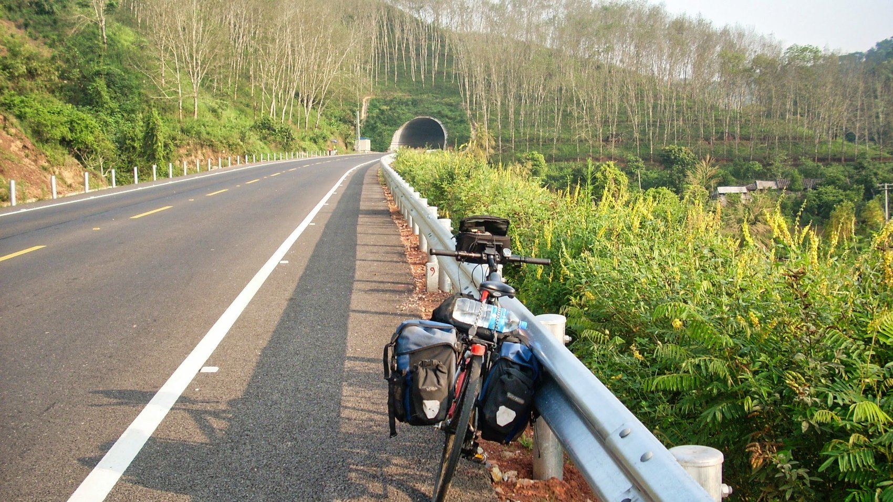
      <em>Xishuangbanna</em>
    </figure>

  <figure>
      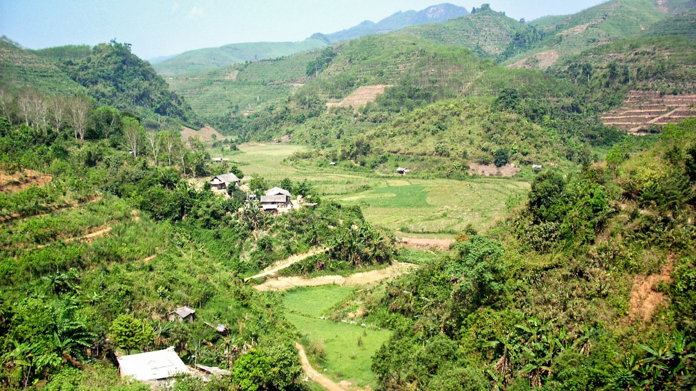
      <em>Xishuangbanna</em>
    </figure>

<figure>
  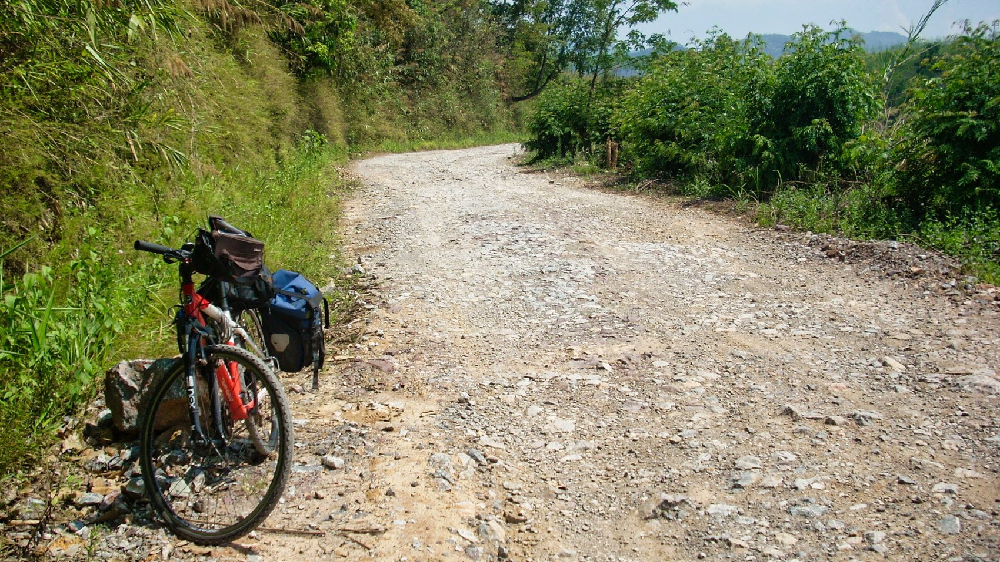
  <em>Xishuangbanna</em>
</figure>

Menglun is smaller, but more hectic and more run-down than Mengla, and most hotels here have only Chinese signage, though they’re still easy to find. I looked at rooms in various places, but the cheapest (70Y) turned out to be the best. The large, chic-looking hotel right in the centre, on the road to the roundabout, had no English sign, but the room was almost 3-star standard: very spacious and clean, with two large beds, a huge wardrobe, air-con, TV, and a modern, large bathroom to Western standards. A very good deal. I was too exhausted to do anything, even though Menglun’s botanical garden is apparently a major attraction. But at least I could enjoy the beautiful room.

## 18 Apr · 58 km — Menglun – Jinghong

These not-quite-60 km were the hardest of my life, mainly because I’d probably caught sunstroke the day before and was utterly drained. On top of that, the first 35 km, back on the perfect new highway, climbed continuously; never very steep, but relentless, and I felt so weak I had to stop again and again. Once more the stretch ran through many tunnels and over bridges amid stunning mountain scenery, but I couldn’t really take it in. Fortunately, the last 20 km into Jinghong were all downhill, so I managed to drag myself into the centre, though the two flights of stairs up to my room felt like Mount Everest. I found another cheap, adequate room in the heart of Jinghong’s traveller district, at the Manting Lu roundabout, in Lie Xieng Hotel. The room wasn’t the cleanest and could use a fresh coat of paint, and the bathroom was very basic, with a shower over a squat toilet, but it did have satellite TV, air-conditioning, and hot water for just 50Y.

# Part 2 — Yunnan

*19 April – 15 May 2008*

## 21 Apr — Jinghong → Shangri-La (by bus)

My physical condition, headache, nausea, cold sweats, didn’t improve overnight, but there was another reason to abandon the plan to cycle up to the Tibetan plateau. I’d read that the first week of May brings a mass influx of domestic tourists, so I thought it best to visit Yunnan’s most popular destinations, Dali and Lijiang, before then. Flights from Jinghong to Lijiang were fully booked for the next few days, so I secured a bus ticket for the 20th and spent another day and a half in Jinghong, not a bad place to recover a little. This relatively large city is no longer the relaxed, exotic Mekong-side destination described in some guidebooks; it has become a bustling, modern city with heavy traffic. Even so, its broad, palm-lined boulevards and the general cleanliness of the modern buildings make Jinghong quite attractive. Thanks to its location, direct ferry connections to Thailand and numerous hill-tribe villages in the surrounding jungle-covered mountains of Xishuangbanna, it draws a growing number of travellers. The Manting Lu area has several guesthouses and genuine traveller cafés with a decent book selection and surprisingly good, affordable cooking, both Western-style and local Dai dishes that reflect Laotian and Thai influences. The best food was at Mei Mei Café, with excellent burgers for 20Y and delicious Dai-style chicken with lemongrass for 15Y. Azalea Café and Mekong Café were also decent, the latter with the bonus of a terrace with Thai cushions. I wouldn’t recommend Banna Café, though: poor service and subpar food.

  <figure>
      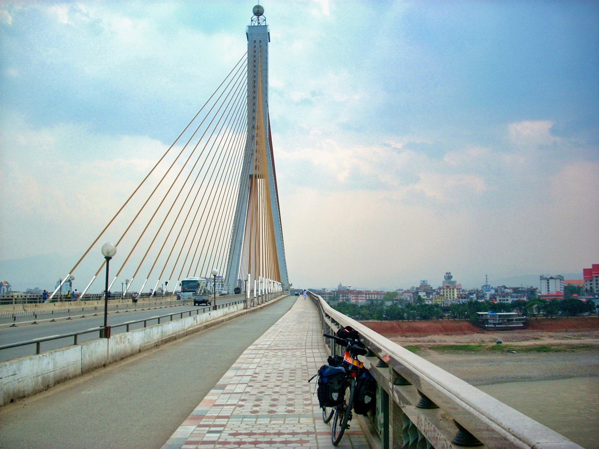
      <em>Jinghong</em>
    </figure>

  <figure>
      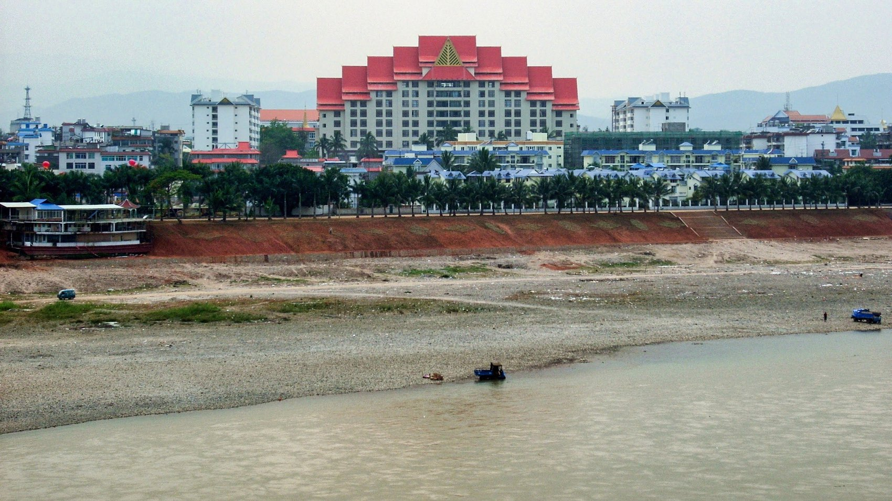
      <em>Jinghong</em>
    </figure>

  <figure>
      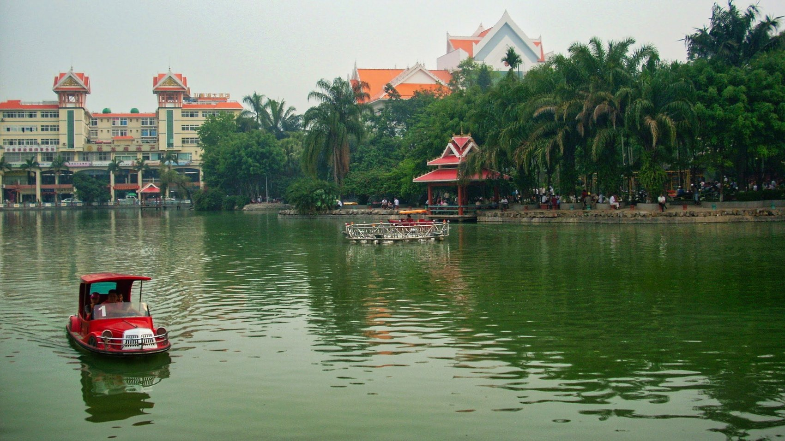
      <em>Jinghong</em>
    </figure>

  <figure>
      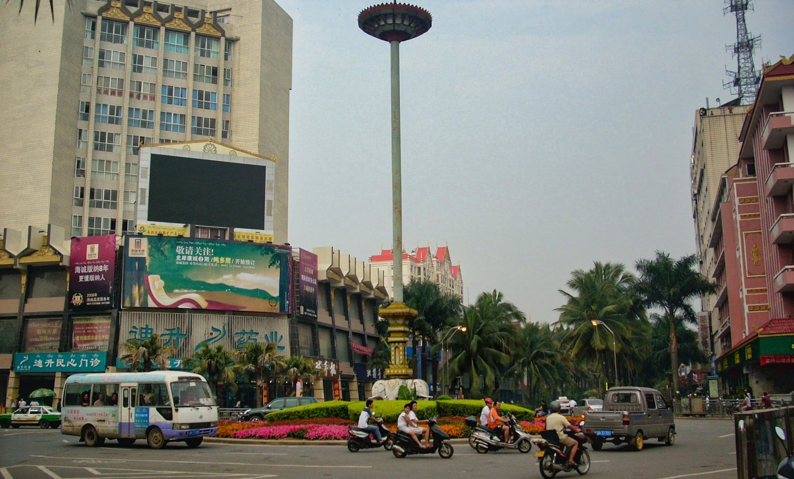
      <em>Jinghong</em>
    </figure>

The bus from Jinghong to Lijiang took 21 hours, fortunately in a modern, comfortable sleeper. This mode of transport isn’t cheap (228Y), but it’s reasonably comfortable as long as the road is good. The “beds” aren’t proper berths, but they do let you lie down properly, if without much room to move. On arriving in Lijiang I immediately caught a connection to Shangri-La, a further five hours north. In all, I was on the road for 26 hours, but at least the route offered spectacular scenery in daylight. The climb up to Shangri-La was particularly breathtaking, winding past strawberry fields along the Yangtze River, with snow-capped peaks soaring 5,000 metres in the background, and dramatic switchbacks offering dizzying yet awe-inspiring views. Transporting the bicycle was free and hassle-free on both journeys: on the large sleeper I only had to remove the front wheel, while on the smaller bus to Shangri-La I had to take off both to fit it into the luggage compartment.

<figure>
  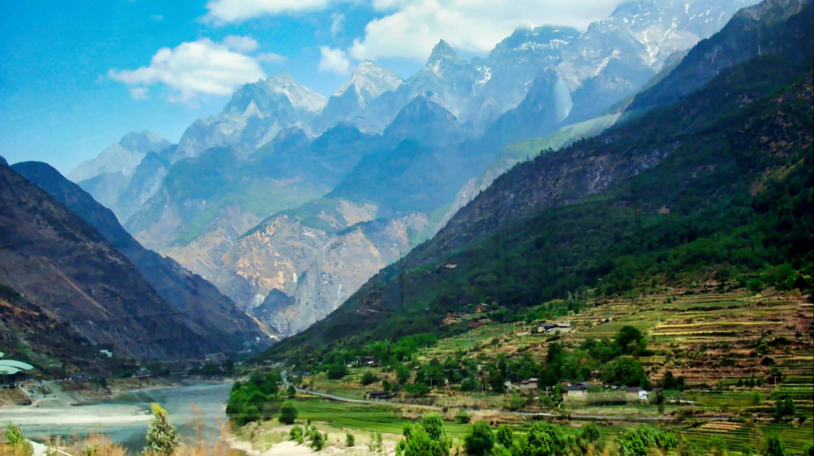
  <em>Along the Yangtze River</em>
</figure>

## 23 Apr — Shangri-La

After the spectacular journey, arriving in Zhongdian, at an altitude of 3,000 metres, was at first something of an anticlimax. You wouldn’t expect to find a mid-sized modern city with boutiques and well-stocked supermarkets in this wild Himalayan landscape. Once I’d recovered from the surprise and let go of a few preconceptions, though, I could see why the city was renamed “Shangri-La” a few years ago. It may not be paradise, but it’s a wonderful place to relax and linger. Shangri-La is thoroughly Tibetan in character: photogenic women in colourful headgear fill the streets, restaurants serve yak steak and butter tea, and the noise and chaos of lower-altitude regions feel far away. The newer part (and “new” is the right word: hardly any building looks more than five years old) is a little sterile but not unattractive, with broad, peaceful, well-kept streets and modern brick buildings imitating traditional architecture.

The main attraction is the small, picture-perfectly restored old town, with cobbled alleys and picturesque wooden houses now almost entirely converted into guesthouses, cafés, or souvenir shops. The restoration seems only a few years old, so Shangri-La remains a relatively fresh tourist draw, still largely overlooked in guidebooks, even the recent ones. True, this is not an authentic Tibetan experience, but this is China, and you have to be grateful that Shangri-La hasn’t been turned into a kitschy fairground and has kept a very peaceful atmosphere. In the old town you can still see locals fetching water or washing their laundry, and even their hair, in the alleyways. The cafés and shops are run by Tibetans rather than Han Chinese, and the locals are very friendly, and even seem truly happy, a sign that mass tourism hasn’t yet taken over. That is bound to change in the coming years. For now, the absence of large Chinese tour groups and the handful of Western travellers can be put down to external factors. First, the escalating Tibet conflict in the run-up to the Beijing Olympics has closed the borders to Tibet, and even the overland route into western Sichuan seems off-limits for now. Rumours online suggest Shangri-La itself is restricted, which is plainly not the case. Still, at present it’s effectively “the end of the road”, apart from Deqin. Second, the climate plays a part: the sunny days are pleasant, but the nights and shaded areas stay bitterly cold, even in late April. My first purchase was a cheap but invaluable warm fleece.

  <figure>
      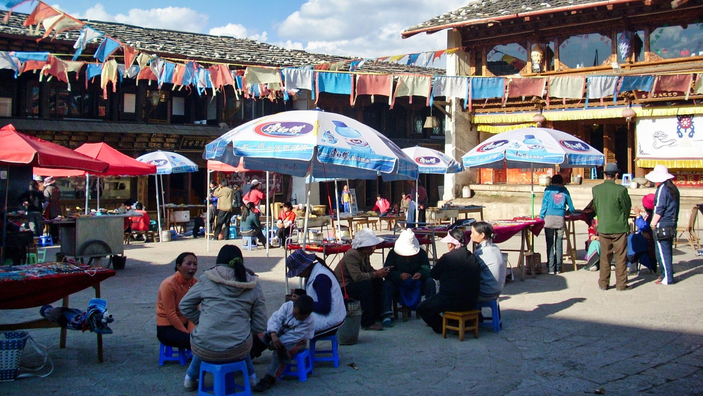
      <em>Shangri-La</em>
    </figure>

  <figure>
      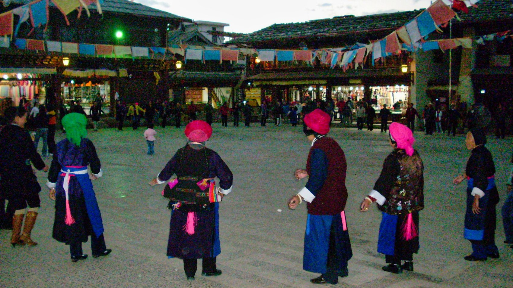
      <em>Shangri-La</em>
    </figure>

  <figure>
      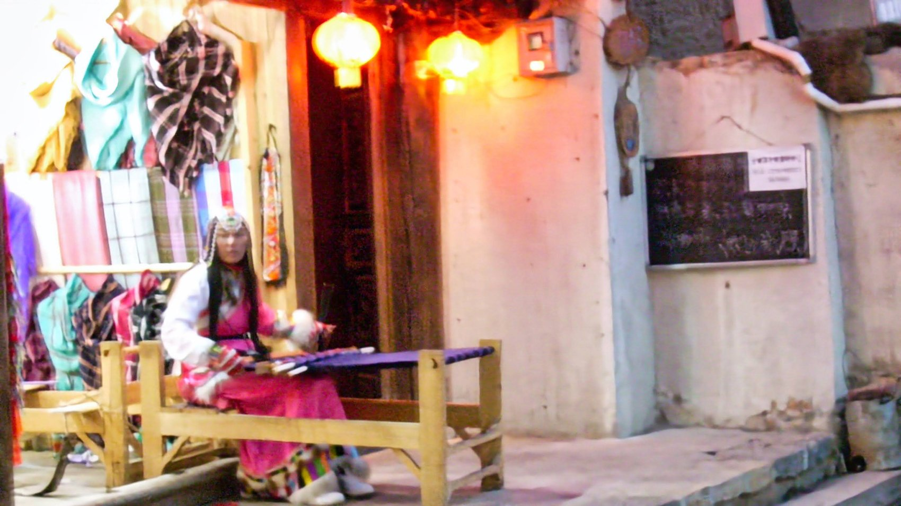
      <em>Shangri-La</em>
    </figure>

  <figure>
      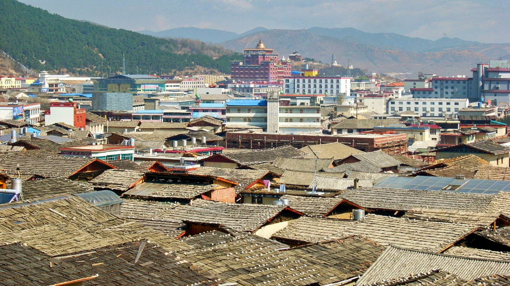
      <em>Shangri-La</em>
    </figure>

  <figure>
      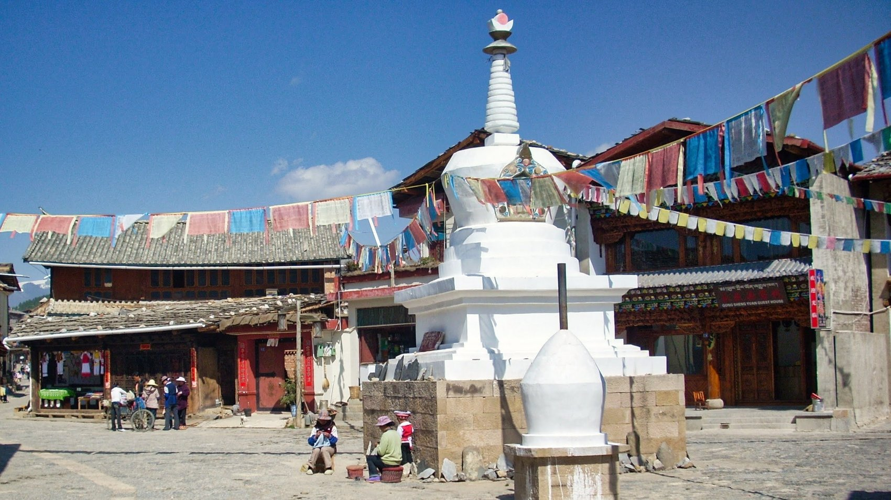
      <em>Shangri-La</em>
    </figure>

  <figure>
      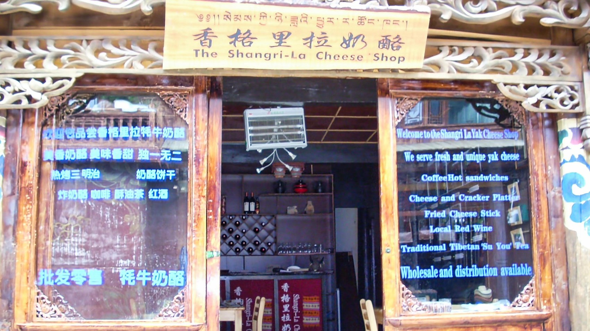
      <em>Shangri-La</em>
    </figure>

<figure>
  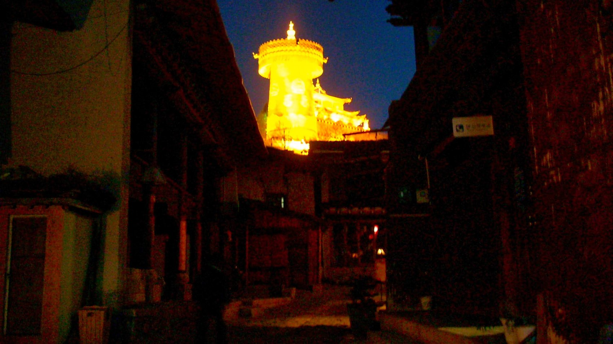
  <em>Shangri-La</em>
</figure>

The star attraction is the ancient Tibetan monastery 5 km north of the city, easily reached by bike, though the last kilometre on a cobbled road is rough. Set against barren hills and snow-covered mountains, it resembles a smaller version of the Potala Palace in Lhasa: an incredibly picturesque, fascinating place, though the interior feels somewhat deserted, with only a few monks in saffron robes. I spent most of my time in the old town’s many cafés, where pizza and espresso macchiato appear on the menus alongside yak meat and butter tea, a kind of globalisation I can live with, being a traveller, not an anthropologist. These cafés cater to Chinese tourists rather than acting as traditional backpacker hangouts; the only one really aspiring to that is Noah’s, just outside the old town, which has a decent second-hand book selection but is otherwise unremarkable, with overpriced and mediocre food. Oddly, it’s still the place that attracts the most Western visitors.

  <figure>
      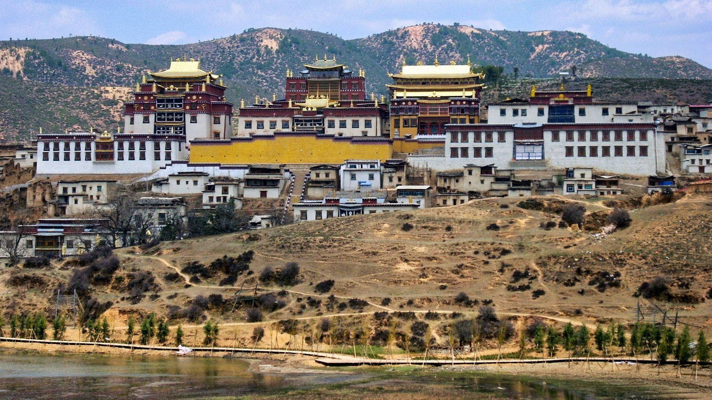
      <em>Shangri-La - Songzanlin Temple</em>
    </figure>

  <figure>
      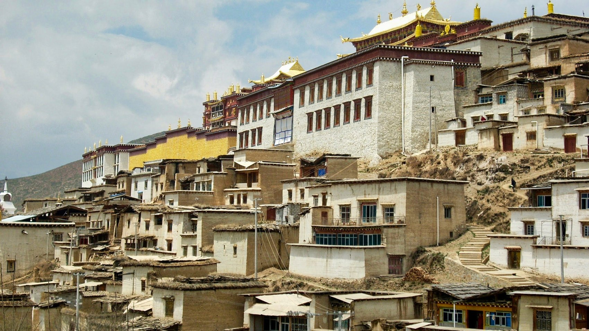
      <em>Shangri-La - Songzanlin Temple</em>
    </figure>

  <figure>
      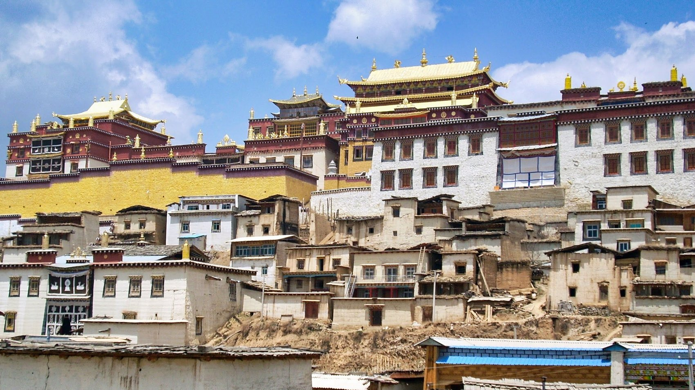
      <em>Shangri-La - Songzanlin Temple</em>
    </figure>

  <figure>
      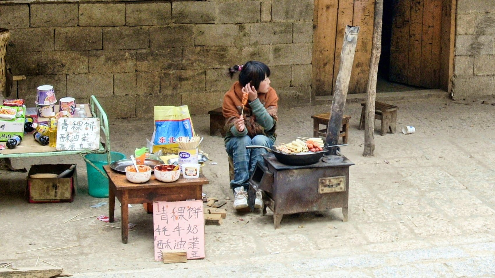
      <em>Shangri-La - Songzanlin Temple</em>
    </figure>

Even the old town’s cafés, charming and friendly as they are, don’t excel on food or pricing. A few stand out, however. Fragrant Valley makes an excellent cappuccino (18Y) and serves a tender, juicy yak steak with fresh wild mushrooms (35Y), though the sauce could be improved. Compass, a slightly more upmarket restaurant with an indoor heater, serves excellent espresso macchiato (16Y), but its food is overpriced (dishes from 30Y) and underwhelming: the veggie burger was bland, and the thick, homemade chips were neither fully cooked nor crisp. For Tibetan cuisine, Potala Restaurant, beautifully decorated and upmarket, is a good choice, though not if you’re dining alone: the steep-looking prices become reasonable once you see the enormous portions, and the delicious momos (18Y) and yak-filled quiche (20Y) could have fed a whole group. A delightful find was Shangri-La Wine & Cheese Shop, a tiny place with a fantastic cheese-and-cracker platter for 25Y. The yak-milk cheese, made in a nearby village with Western expertise, was superb, a strong, hard cheese reminiscent of the finest mountain cheeses of Dalmatia or Sardinia. I stayed at Qiang Sheng yuan Guesthouse, where I found a brand-new, cosy room with a large bed, thick blankets, an electric blanket, parquet flooring, and thoughtful touches like adjustable bedside lamps. The modern bathroom had a large sink, a Western-style toilet, and a hot-water shower, all for 75Y. A great deal!

  <figure>
      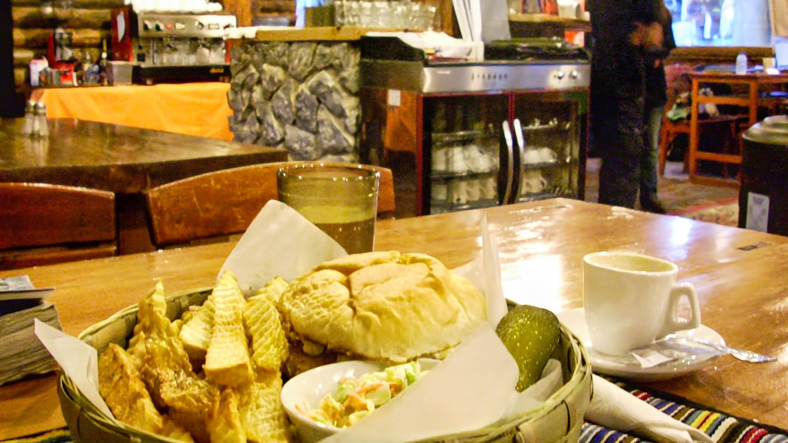
      <em>Shangri-La - The Compass</em>
    </figure>

  <figure>
      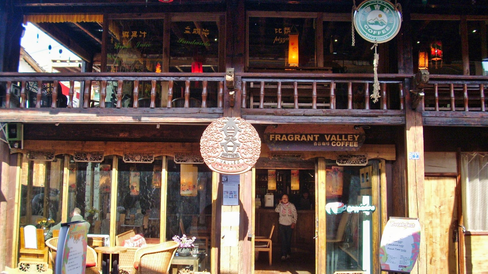
      <em>Shangri-La - Fragrant Valley</em>
    </figure>

  <figure>
      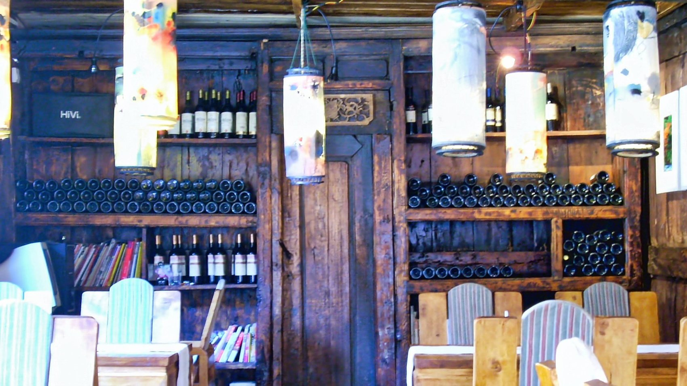
      <em>Shangri-La - Fragrant Valley</em>
    </figure>

  <figure>
      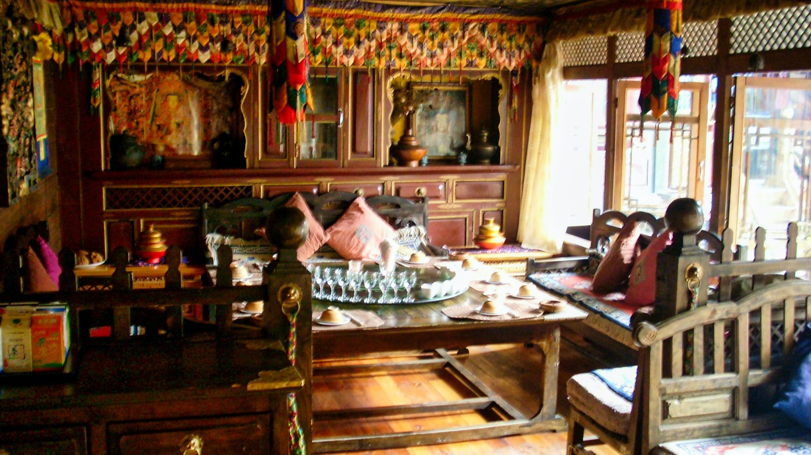
      <em>Shangri-La - Potala Restaurant</em>
    </figure>

  <figure>
      
      <em>Shangri-La - Potala Restaurant</em>
    </figure>

  <figure>
      
      <em>Shangri-La - Cheese&Wine Shop</em>
    </figure>

<figure>
  
  <em>Shangri-La - Cheese&Wine Shop</em>
</figure>

## 24 Apr — Shangri-La – Tiger Leaping Gorge (Qiaotou)

Today was cool and overcast, and even on the bike I was grateful for my fleece and relieved my toes didn’t freeze in my flip-flops. The route down to Tiger Leaping Gorge, dropping below 2,000 metres, was a pleasant ride despite the headwind: mostly well-maintained road, and almost empty. The first 60 km led through the gently rolling hills of the Tibetan plateau before a spectacular 40 km descent to the Yangtze. Sadly the gloomy weather dulled the views; when I’d taken the bus up this route in sunshine, the scenery had been absolutely breathtaking. On reaching Qiaotou (now called Tiger Leaping Gorge Town), my first stop was Gorged Tiger Café. The sandwiches and coffee weren’t especially remarkable, but Margot, the Australian owner, was an incredibly chatty, welcoming host who took great care of her guests. She recommended a hotel about 100 metres north of the café, no English sign and in no guidebook, but easy to find: the one with two lanterns. Her recommendation was spot on. For just 60Y I got a spacious, well-kept room with a Western-style toilet and a hot shower. The hotel restaurant had no English menu but served fiery Sichuan cooking and fresh wild mushrooms from Yunnan.

  <figure>
      
      <em>Shangri-La to Tiger Leaping Gorge</em>
    </figure>

  <figure>
      
      <em>Shangri-La to Tiger Leaping Gorge</em>
    </figure>

  <figure>
      
      <em>Shangri-La to Tiger Leaping Gorge</em>
    </figure>

  <figure>
      
      <em>Tiger Leaping Gorge Town</em>
    </figure>

## 25 Apr — Tiger Leaping Gorge

Tiger Leaping Gorge on the Yangtze is one of the deepest canyons in the world at 3,900 metres, and home to China’s most famous trek. Lacking proper hiking gear, sturdy shoes above all, I decided to explore the gorge by bike instead. According to Lonely Planet, a newly paved road runs for 23 km between the hiking trail and the river, all the way to Walnut Grove, but the guidebook also warned it was overrun by tour buses, ruining the atmosphere. Both claims turned out to be false. A fully paved road does exist, but only for the first 10 km, to a viewpoint where local tour groups are bused in. Beyond that it narrows into a steep, rocky track carved into the mountainside, spectacular, but certainly not accessible to large buses. The only vehicles I met were the occasional minivan or lorry. The route stayed demanding even by bike, but the lack of traffic made for an enjoyable ride, letting me take in the ever-more-stunning scenery in peace. The final 8 km before Walnut Grove alternated between rough dirt and freshly paved sections. Fortunately the last big climb to Tina’s Guesthouse and the bridge over a side gorge, and the final descent into Walnut Grove, were on smooth tarmac.

  <figure>
      
      <em>Tiger Leaping Gorge</em>
    </figure>

  <figure>
      
      <em>Tiger Leaping Gorge</em>
    </figure>

  <figure>
      
      <em>Tiger Leaping Gorge</em>
    </figure>

  <figure>
      
      <em>Tiger Leaping Gorge</em>
    </figure>

<figure>
  
  <em>Tiger Leaping Gorge</em>
</figure>

While much of the gorge at road level is dominated by wild, rocky, almost desolate landscape, Walnut Grove is a lush oasis: green terraced farmland cascading down to the river, in striking contrast to the rugged cliffs. For most trekkers it’s the final destination, and several guesthouses line the road. The most charming is Sean’s, perched high above the river with a terrace offering stunning views, a sociable place with excellent, inexpensive food (the yak cheese dumplings were delicious) and cheap beer. On the way back I stopped at Bridge Café, 2 km west of Sean’s, to sober up a little before cycling on; this tiny café by the bridge arguably has the best views of the canyon. I’m sure hiking the gorge offers even more spectacular experiences, but even by bike it was an unforgettable journey, despite the chilly, overcast spring weather. Since I’d really enjoyed my hotel in Qiaotou, I decided to stay another night rather than take the afternoon bus to Lijiang.

<figure>
  
  <em>Tiger Leaping  Gorge - Bridge Café</em>
</figure>

## 28 Apr — Lijiang

This morning I took a minibus to Lijiang, Yunnan’s main tourist attraction. Arriving in the modern part of the city, still 2,400 metres up, it’s hard to understand why Lijiang is so popular: the new town is sprawling, noisy, hectic, and unattractive. Fortunately there’s no reason to linger there beyond a few minutes on arrival or departure. The moment you enter the old town, the modern world fades away. Old Lijiang is a world of its own, embodying every imaginable stereotype of ancient China and large enough to get hopelessly lost in its maze of narrow cobbled streets. No cars, taxis, or buses are allowed, only beautiful traditional architecture, romantic stone bridges over bubbling canals, waterwheels, and charming street cafés. At night, when the red lanterns glow in the alleys, the town feels like a scene from a fairy tale.

  <figure>
      
      <em>Lijiang</em>
    </figure>

  <figure>
      
      <em>Lijiang</em>
    </figure>

  <figure>
      
      <em>Lijiang</em>
    </figure>

  <figure>
      
      <em>Lijiang</em>
    </figure>

  <figure>
      
      <em>Lijiang</em>
    </figure>

  <figure>
      
      <em>Lijiang</em>
    </figure>

  <figure>
      
      <em>Lijiang</em>
    </figure>

  <figure>
      
      <em>Lijiang</em>
    </figure>

  <figure>
      
      <em>Lijiang</em>
    </figure>

  <figure>
      
      <em>Lijiang</em>
    </figure>

Authenticity? Traditional China? Not at all. Like Rothenburg in Germany, Prague’s old town, or St Mark’s Square in Venice, old Lijiang is both a tourist magnet and a carefully curated illusion. But who cares when you can wander enchanting streets past inviting cafés with names like Rive Gauche, Kafka, or Petit Lijiang Book Café; sip Lavazza espresso in the remote mountains of southern China; and watch Chinese city dwellers turn Xienhua Street into the world’s longest bar at weekends, a scene with a surreal quality all its own? Some travellers no doubt find this artificial charm off-putting; I found it utterly fascinating. That said, the hordes of (mostly Chinese) tour groups flooding the central Sifang Square from 10 a.m. can be frustrating, and I don’t want to imagine what it’s like during the first week of May. But if you wake early or explore the quieter corners, you can enjoy Lijiang in peace, much like Venice or Prague, and there are plenty of lovely cafés in which to wait out the most chaotic hours.

Since my visit coincided with a spell of cold, rainy weather, I had little choice but to focus on the town’s cafés, bars, and restaurants, and tried almost all the most inviting and well-known spots. Besides the three cafés already mentioned, I spent time at Lahmu Tibet, Cherry Lane, Blue Papaya, O Sole Mio, Rembrandt, Book Bar, Susan’s Naxi, Well’s Bistro, and Sexy Tractor. No single place completely blew me away on food, but the atmosphere in most was excellent. O Sole Mio and Blue Papaya were two Italian places in prime locations, with fairly authentic pizzas at rather high prices (30–50Y). Susan’s Naxi and Lahmu Tibet served standard local dishes at the usual high (but, given the region’s outstanding ham and mushrooms, justified) Lijiang tourist prices. Book Bar was a quiet, cosy spot to read (I read Lost Horizon, naturally) and one of the cheapest bars in town, with large bottles of Dali beer for just 8Y. Cherry Lane was a beautifully decorated lounge café with Arabic music, shisha pipes, affordable noodle soups, and terrible cappuccinos. Rive Gauche, as the name suggests, is perfectly placed by one of Lijiang’s canals and is perhaps the most scenic spot in town for a café au lait (25Y), but, like nearby cafés such as Rembrandt, it was ridiculously overpriced. Finally, Kafka and Well’s Bistro stood out for fair prices, a cosy atmosphere, and a decent book selection, though the food and drinks were nothing special. Sexy Tractor was one of the few pubs in town drawing a mixed international crowd: reasonable prices, tasty dumplings, but uninspired cocktails. Lijiang’s old town has countless small traditional guesthouses, often with charming courtyards. The standard price for a simple room with private bathroom, hot shower, and Western-style toilet seemed to be around 50Y, which is what I paid at Old Town Inn. The room was a bit small and the shower rather weak, but the location was perfect, a stone’s throw from Sifang Square and easy to find.

<figure>
  
  <em>Lijiang - Book Bar</em>
</figure>

## 10 May — Dali

I hadn’t planned to stay in Dali more than two or three days. That it became ten, and that I’d be so reluctant to leave, I certainly wouldn’t have expected on my first day. I’d taken the bus (51Y) from Lijiang and failed to get off at the Old Town stop; the new city, Dali City (or Xiaguan, a large, faceless place), is almost 15 km south of old Dali. So I cycled back and looked for a room in the Old Town, only to find every hotel had doubled its prices for four days from 30 April for the May holiday. For the first night I managed to find a very nice, large, clean room with the usual amenities for 80Y on Huguo Lu (also called Foreigner Street). The next day I looked for somewhere more affordable and was lucky to find Jade Emu GH, which not only didn’t raise its prices over the holiday but turned out to be the most comfortable and friendly hostel I’d ever stayed in. That’s why my stay stretched out so far.

<figure>
  
  <em>Dali - Jade Emu Hostel</em>
</figure>

On my first day I’d actually been inclined to leave Dali quickly. The town seemed pretty but, next to Lijiang, rather unspectacular, and I was annoyed that Dali was the first place where persistent vendors harassed me, and unfriendly Bai women in traditional dress kept trying to sell me dope. Those were only first impressions, though; I’ve since got to know Dali much better and grown fond of it, quite apart from the hostel. It’s definitely a place I’d return to. A little history: for many centuries this walled town, at nearly 2,000 m, was the capital of the powerful Bai Kingdom. More recently it became one of China’s first backpacker and hippie hangouts and Yunnan’s main tourist destination. Lijiang has now clearly overtaken it, however, and Chinese tourists in particular seem to be turning their backs. Unlike the masses that besiege Lijiang daily, Dali stayed relatively quiet even during the May holiday, and afterwards it was downright tranquil. Aesthetically that’s understandable: Lijiang is without doubt the more picturesque of the two. Since the hippie days Dali certainly hasn’t grown prettier: only a small part of the impressive city wall remains, and entire streets have fallen to the wrecking ball, replaced by unappealing buildings that dominate some areas. Many parts of the Old Town are still charming and picturesque, and on a clear day the views of the 4,000 m mountain range to the west and Erhai Lake to the east are spectacular; but Dali no longer has the harmonious overall look of Lijiang’s or Shangri-La’s old towns.

  <figure>
      
      <em>Dali</em>
    </figure>

  <figure>
      
      <em>Dali</em>
    </figure>

  <figure>
      
      <em>Dali</em>
    </figure>

  <figure>
      
      <em>Dali</em>
    </figure>

  <figure>
      
      <em>Dali</em>
    </figure>

  <figure>
      
      <em>Dali</em>
    </figure>

  <figure>
      
      <em>Dali</em>
    </figure>

  <figure>
      
      <em>Dali</em>
    </figure>

  <figure>
      
      <em>Dali</em>
    </figure>

  <figure>
      
      <em>Dali</em>
    </figure>

Ironically, it’s precisely this decline in mass tourism that makes Dali interesting for travellers again, because Dali is, at least for now, something Lijiang is not: relaxed. That’s why most long-term travellers I met spent far more time here than in Lijiang, aside from the friendly locals, the cheaper prices, and perhaps also the ever-present, easily available dope. Dali has the same effect on many as places in Laos: you arrive, fall into a state of satisfied lethargy (even without drugs), and suddenly realise you’ve been here a whole week. There is more to do than lounge around and stay out late, though. The surroundings are well worth several days, and the days are long, so you needn’t set out before noon. Two trips are a must: taking the chairlift up into the mountains, and cycling along Erhai Lake and the villages north of Dali. There are real hidden gems out there that you’d never suspect from a brief visit or from passing through on the highway by bus. Parts of the area have, sadly, been developed in an unattractive way, which was another reason I wasn’t too impressed at first. Nothing prepares you for the stunning lake views and the fragrant pine forests as you ascend by chairlift, nor for the wonderful café latte at Pinehaven Café above Zhonghe Temple. Up in the mountains you wouldn’t expect such a lovely hiking trail into the Tao Creek valley, with spectacular views at every turn; nor that a few hundred metres off the unappealing highway lies an ancient village like Xizhou, where time seems to have stopped, ancient rickshaws thread the narrow alleys, and oxen still plough the fields. Or that at the International Youth Hostel by the marina you can get a five-course feast for three for just 50Y, even without an English menu, my best meal in China, not to mention the view over the rice fields and Erhai Lake in the warm afternoon light on the way back.

  <figure>
      
      <em>Dali - Cangshan National Geopark</em>
    </figure>

  <figure>
      
      <em>Dali - Cangshan National Geopark</em>
    </figure>

  <figure>
      
      <em>Dali - Cangshan National Geopark</em>
    </figure>

  <figure>
      
      <em>Dali - Cangshan National Geopark</em>
    </figure>

  <figure>
      
      <em>Dali - Cangshan National Geopark</em>
    </figure>

  <figure>
      
      <em>Around Dali</em>
    </figure>

  <figure>
      
      <em>Around Dali</em>
    </figure>

  <figure>
      
      <em>Around Dali</em>
    </figure>

  <figure>
      
      <em>Around Dali</em>
    </figure>

  <figure>
      
      <em>Around Dali</em>
    </figure>

  <figure>
      
      <em>Around Dali</em>
    </figure>

  <figure>
      
      <em>Around Dali</em>
    </figure>

<figure>
  
  <em>Around Dali</em>
</figure>

I probably wouldn’t have enjoyed all this as much had I not met other travellers at the hostel who also seemed to appreciate these experiences, real travellers, not the wannabe backpackers so often found in Southeast Asia. People you can hang out with at the bar until late, but who don’t see that as the sole purpose of their trip, keeping a good balance between relaxation and authentic travel. For that, Jade Emu was perfect. Dave and Song are the most pleasant hosts imaginable. The rooms, even the dorms, offered hotel standards at hostel prices: all en suite, with wide, comfortable beds, cleanliness on a par with luxury hotels in China, and free extras like towels, shampoo, internet, and a pool table, all brand new, as the hostel had opened only a month earlier. It was also fair that whenever the dorm was full I was simply upgraded to a double or twin at no extra cost, so I could stay in a comfortable hotel room for just 30Y. Among the people I met were Nick, an Englishman and self-proclaimed anarchist just back from North Korea; Thomas, a Swiss who had already visited 175 countries; Jess, a hard-drinking Australian travelling overland to Europe and a walking music encyclopaedia; and Sarah, a caffeine-addicted German-Iranian I spoke with exclusively in English, who’d been on the road for a year and a half: now that’s what I call interesting company.

Like Lijiang and Shangri-La, Dali is no gourmet paradise, but there are plenty of nice traveller cafés and prices are generally lower. In good weather the veranda of Café de Jack is a great place to hang out, average but cheap food, and beautiful mountain views. Lost Angel became my regular spot, thanks to its friendly owners, delicious jiaozi, and yoghurt shakes; every table had a laptop free to use. Good Panda, a simple eatery rated the best Chinese restaurant in town, didn’t impress me much. Dali’s ultimate bar for (very) long nights is Bad Monkey: run by long-haired English potheads, this charmingly run-down bohemian pub would be more at home in Berlin or Prague than in China, cosy, sociable, and loud, serving wicked absinthe shots like Head Fuck or Brain Haemorrhage, and the best pizzas in town.

<figure>
  
  <em>Dali - Bad Monkey</em>
</figure>

## 15 May — Kunming

I spent my last few days in Kunming, the capital of Yunnan. This modern city, relatively relaxed by Chinese standards, doesn’t offer tourists much, but it seems a pleasant place to live; the expat community is sizeable, and most travellers stay a few days, as the city is strategically placed, with connections to Vietnam, Laos, Sichuan, and Guilin. There’s a somewhat legendary party hostel here called “The Hump”. It’s a bit run-down and overpriced (30Y for a dorm bed, high café prices for poor food), but its location in the heart of the nightlife and shopping district is unbeatable. It also has a wonderful veranda, and the ground-floor bar is the most sociable place in Kunming for foreigners, run by a German, with cheap drink deals and frequent theme parties. Naturally, that’s where I spent my evenings.

Despite the lack of major sights, Kunming is a perfect city for cycling, and a truly Chinese one, where Westerners still stand out, in a good way. You can eat cheaply in food courts or small eateries in the remaining parts of the old town, and the area around Green Lake Park and the university is attractive enough to justify several days. Last night I took the 12-hour night bus to Hekou, on the Vietnamese border. From Lao Cai on the other side, I then took the hopelessly overloaded old “chicken bus” up to Sapa, two hours to cover just 40 kilometres.

  <figure>
      
      <em>Kunming</em>
    </figure>

  <figure>
      
      <em>Kunming</em>
    </figure>

  <figure>
      
      <em>Kunming</em>
    </figure>

  <figure>
      
      <em>Kunming - 1910 South Railway Station</em>
    </figure>

# Part 3 — Sapa to Luang Prabang

*19 May – 15 June 2008*

## 19 May — Sapa

I hadn’t planned to stay long in Sapa, just to enjoy the breathtaking views, take a stroll, and eat some good food. But as it rained continuously for three days, I found myself stuck. Stunning as the place is, there’s very little to do in Sapa in bad weather. Since my last visit was over eight years ago, when Sapa was one of the cheapest tourist spots in Vietnam, I was initially shocked by the café and restaurant prices. The town centre now consists almost entirely of refined, near-luxurious establishments serving Western and Vietnamese food at prices close to Hanoi’s Old Quarter, without matching its quality. Nearly every restaurant offers tempting game dishes such as venison, deer, wild boar, or goose, but usually in a dull, uninspired way, and certainly not at the bargain prices of the past. I couldn’t find good spring rolls anywhere in Sapa, which baffled me. The best option was the new, rather stylish tapas restaurant Viet Emotions, where the tapas were genuinely decent and the baguettes, such as the one with goat’s cheese and olives, particularly delicious, though the prices were quite steep, a sandwich costing 60,000 VND.

## 20 May · 110 km — Sapa – Pho Rung

The descent from Sapa down to Lao Cai made up for the dreadful weather of recent days, 35 km of stunning views over mountains, rice terraces, rushing streams, and hill-tribe people. An extraordinarily beautiful region. The rest of the route south along Highways 4D and 70 was also very scenic. Highway 4D began as a gently undulating road through flatter tropical terrain, sometimes parallel to the railway; Highway 70 then wound back through the mountains, crossing several small passes. What both had in common, though, was a terrible surface, narrow, dusty, and extremely bumpy, surprising for the main road link between Hanoi and Kunming. Had I known, I wouldn’t have set off from Sapa as late as 11 a.m. As it was, I reached the small town of Pho Rung only just before nightfall. Luckily there was a simple guesthouse right at the entrance to town, the first in 45 km. My small room had only a wooden mat instead of a mattress, but it did have hot water, a TV, and even a Western-style toilet. After some quick haggling I paid 80,000 VND for the night. The attached restaurant, for some inexplicable reason, even had an English menu, and served decent Vietnamese staples; the beef with mushrooms cost 30,000 VND.

## 21 May · 101 km — Pho Rung – Yen Binh

Today every single kilometre hurt, not because of my condition or the very hilly terrain, but solely because of Highway 70, which, even worse than yesterday, was beyond description. Ten years ago I wouldn’t have been surprised to see a major Indochinese road in such a state, but that these “highways from hell” still exist today did surprise me. The road was essentially one giant pothole, sometimes with asphalt, sometimes without. The countless buses and lorries kept enveloping me in dust, and the relentless ups and downs made it tougher still. I had three punctures, which thankfully I could repair quickly. The landscape wasn’t quite as beautiful as yesterday, but still quite picturesque, and the locals here, quite uncharacteristically for northern Vietnam, were friendly, even enthusiastic, towards a touring cyclist. The first hotel I saw in Yen Binh was quite clearly a brothel (offering massage and karaoke), but as it was already dark, I thought it would do for one night. My room, at a reasonable 120,000 VND, was actually quite decent, spacious, with air conditioning and even a bathtub. Dinner was truly bizarre: this was a real family business, and I ate at the table with the whole clan while the young women of the house tried to make clear to me what their profession was. Since none of them spoke a word of English, I pretended not to understand. The meal, incidentally, was free of charge.

## 22 May · 119 km — Yen Binh – Vinh Yen

On the remaining 40 km of Highway 70 the surface improved slightly. I’d pinned my hopes on Highway 2 to take me down to Hanoi, but to my dismay this supposedly important road was not only heavily trafficked but just as dusty and bumpy, the only difference being that the sprawling landscape wasn’t even particularly scenic. After another 45 km, now covered in a thick layer of dust, I reached Viet Tri, one of the largest cities in northern Vietnam outside Hanoi. Here the flatlands began, and I finally found something that could genuinely be called a road, making the last few kilometres to Vinh Yen relatively pleasant.

Neither Viet Tri nor Vinh Yen is a place tourists usually venture, despite their proximity to Hanoi. Both sprawl noisily and chaotically for miles along the highway, with no real charm. Yet there’s such an absurd number of nha nghi and khach san (guesthouses and hotels) here that I wondered who on earth was using them. I soon had my answer: a large share of these places, whether or not they advertised massage or karaoke, actually operate as love hotels and brothels. When I asked about a room at one nha nghi I was quoted 300,000 VND; when I hesitated, thinking it steep, the price immediately dropped to 200,000 VND. Still not exactly cheap for a guesthouse room, but then I realised it was an all-inclusive price: room plus “extras” for the night. Not an unappealing offer, but after a tough day I just wanted peace and quiet. I found a hotel nearby, Nhu Y, that rented rooms without “extras”. For 120,000 VND it offered all the usual Vietnamese standards: air conditioning, a minibar, and a hot shower. As it was far from the centre, I had only two options for dinner: a dog-meat restaurant across the street, or a huge seafood restaurant, apparently the poshest in town, 500 metres down the road. Unsurprisingly, I chose the latter. After the overpriced tourist fare in Sapa and the basic food in rural eateries, I was finally reminded why Vietnamese cooking is among the best in the world. Quan Ca Bo Song Viet Tri was an expensive seafood specialist, but their take on Hanoi’s cha ca was so outstanding and so generously portioned that it was well worth the 100,000 VND.

## 5 Jun — Hanoi

I spent a good week in Hanoi, and as I already knew the city well, I spent most of it in the Old Quarter, slipping into a sort of backpacker routine, drinking plenty of beer, having the same old backpacker conversations, and doing little else. I got a Laos visa from the consulate without any trouble, in just a day, and, on a cultural note, took in the famous Water Puppet Theatre and the even more renowned Bia Hoi Corner in the Old Quarter. Otherwise I simply lived for the day, read books, and lingered in my favourite café, La Place, near the cathedral. It wasn’t that I felt lethargic (I could have left a few days earlier), but the weather wouldn’t allow it: the first days were unbearably hot, near 40°C with high humidity, then it suddenly cooled sharply and rained for hours each day. Fortunately I’d chosen Hanoi Backpackers, the most sociable hostel in Vietnam. It’s ridiculously overpriced (120,000d for a dorm bed, 20,000d for a small bottle of beer), but the dorms are at least fairly comfortable, and there’s always something going on, which makes it hugely popular; otherwise it really ought to be boycotted for its blatant overcharging. For the last three days I cycled about 250 km through Haiphong and Thai Binh to Ninh Binh, a flat, unremarkable route through completely untouristed country, a welcome change from Hanoi’s hustle, though the weather stayed highly unstable, with heavy rain for hours each day. Not ideal conditions for my planned ride to Luang Prabang, which would involve partly unpaved mountain roads through completely remote regions.

## 7 Jun — Ninh Binh (Tam Coc)

I’m glad I stayed in Ninh Binh a few days longer than planned because of the bad weather, as yesterday made up for all the rain and waiting. Together with five other travellers from my guesthouse, a truly international mix from England, Canada, France, and Austria, we went on a small, relaxed cycling trip to Tam Coc. We were even lucky enough to enjoy the breathtaking boat trip (40,000d per boat) through the caves and karst landscape in bright sunshine. After an excellent lunch of raw, marinated goat meat (70,000d) at a hotel restaurant in Tam Coc, we stopped at Mua Cave on the way back. The detour wasn’t really about the cave itself but about the incredible views of Tam Coc from the shrine, 400 sweat-inducing steps above it. The climb and the panorama were every bit as spectacular as the boat trip, but far less touristy: we were the only ones at the top.

## 7 Jun · 128 km — Ninh Binh – Bim Son – Kim Tan – Cam Thuy – Canh Nang

Heading towards the Laotian border from Ninh Binh is a little complicated, as there’s no direct westward route. I first had to endure an uncomfortable 30 km on Highway 1 heading south, one of the least pleasant stretches of that road for traffic and surface. After Bim Son I turned right onto a much quieter side road, which led to Highway 45 after about 20 flat kilometres. Highway 45 was a relatively peaceful, comfortable road with a decent surface, which I followed another 20 km south before reaching Highway 217, which I could stay on all the way to the border. Today’s stretch of Highway 217 was fantastic cycling and pure Vietnam at its best, friendly locals, dazzling green rice fields, and karst hills defining the landscape: a wonderfully picturesque area, mostly flat, well-paved, with light traffic. Only shortly before my destination, Canh Nang, did the route turn hilly. The real mountains start tomorrow. Canh Nang is one of the larger towns in the area, yet oddly has only two guesthouses, both unusually run-down by Vietnamese standards, with no air conditioning or hot showers (normally standard across the country). Thankfully my mosquito-infested room (100,000d) had a mosquito net; otherwise I’d have been in for a restless night.

## 8 Jun · 102 km — Canh Nang – Na Meo

As expected, today was a true mountain ride. The first pass came after about 15 km, followed by three more before Na Meo, at the Laotian border. Highway 217 is the only road through this remote region, and though fully paved, its surface grew rougher the further west I went. Traffic was almost nonexistent, with only a dozen villages along the way, mostly of wooden houses. It almost felt like Laos already, except that the area had electricity everywhere and cold drinks were available. Scenically, the route was a feast, vivid rice terraces, wild streams with bathing spots, all ringed by towering jungle-covered mountains. The stunning views were well earned after such a demanding, mountainous day. Na Meo, the border village, is little more than a small settlement, but fortunately there’s a perfectly decent guesthouse. Unlike the typical Vietnamese border town, it didn’t exploit its monopoly and offered fair prices for simple but clean rooms, complete with mosquito nets and hot showers (100,000d). The adjoining restaurant served excellent and very affordable spring rolls.

## 9 Jun · 65 km — Na Meo – Vieng Xay

The border formalities took about half an hour, not because of any rush, but because this crossing is so quiet and remote that the officials were glad of something to do; they seemed especially fascinated by the many stamps in my passport. Highway 6 on the Laotian side was surprisingly well-maintained, mostly paved, the potholes easy to avoid by bike. Traffic was minimal, and the few villages were mainly wooden houses, though the area seemed to have 24-hour electricity, and even cold drinks were available. The road followed hilly terrain along river valleys, with two particularly steep climbs, each only a few kilometres long but extremely steep in parts. Vieng Xay, the first major settlement in the region, is little more than a village with a central market, but it has recently begun attracting a few tourists for its historical significance: during the Indochina War the leaders of the Pathet Lao lived in the nearby limestone caves, now a minor attraction. I plan to visit them tomorrow. Accommodation lies outside the centre, amid the beautiful karst. I stayed at Naxay2 Guesthouse, the easiest to find, right opposite the tourist information centre, and a fantastic choice: lovely, clean bamboo bungalows with extremely comfortable beds and private bathrooms with excellent hot showers, all for just 50,000 kip. The second hotel, Thavisay, sits further out by a small lake and has a delightful restaurant right at the water’s edge; the menu was limited, but both the grilled fish (30,000 kip) and homemade chips (10,000 kip) were delicious.

## 10 Jun — Vieng Xay

I spent today exploring the stunning landscape of Vieng Xay, where some truly remarkable events took place during the Vietnam War, or, more accurately, the Indochina War. From 1964 to 1973 the area was subjected to daily American bombing raids, and around 20,000 people, including the entire leadership of the Pathet Lao, who would later govern Laos, lived in the caves for years. For the past few years the most impressive of these have been open to tourists, and Vieng Xay even has a well-run tourist information centre, complete with a book exchange, guide-training courses, and bicycle rental. For 30,000 kip you get a guide for the cave tours. I was lucky to be the only one on the 9 a.m. tour, which let me visit more caves by bicycle than usual. The sheer scale of this “hidden city”, with a large theatre stage, bomb shelters, a Politburo meeting room, and a hospital, is staggering. A couple of details still surprised me: according to my guide, the Vieng Xay hospital was run by Cuban doctors, and even in the bleakest war years there were large-scale dance and theatre performances. The cave tour is undoubtedly one of the most fascinating sights in Laos and, combined with Vieng Xay’s beautiful landscapes and off-the-beaten-track location, makes for an absolutely worthwhile visit.

## 11 Jun · 33 km — Vieng Xay – Sam Neua

I got off to a rather late start today, not because of the five bottles of beer I shared with company last night, nor because of staying up until 1 a.m. watching football, but because of the long, ultimately somewhat successful repair of a snapped gear cable. I really didn’t think I’d be able to find a new one in Vieng Xay, but thankfully I did, even if the new wire is a little short. It was only 30 km to the provincial capital, Sam Neua, mostly on newly tarred road (German-funded). Despite the naturally hilly terrain there was only one significant climb, so I rolled into the town, if you can call it that, by about half-past twelve. Sam Neua offers a decent choice of lodgings, internet access, and a bank with poor exchange rates, but not much more. Granted, this is Laos, so the place is completely laid-back, the surrounding mountains are lovely, and the altitude keeps the climate pleasantly cool; still, it’s not somewhere you’d feel compelled to linger. The dining scene is very humble too. I had a perfectly adequate small room with a good hot-water shower for 50,000k at Shulya Guesthouse, and enjoyed excellent chips, but a very disappointing Beef Laab, at Dan Nao Restaurant.

## 12 Jun · 101 km — Sam Neua – Phou Lao – Nam Neun

Today was a proper mountain stage, non-stop, through the isolated highlands of Houapanh. Along the entire stretch there were only scattered, tiny hilltribe villages where I could top up supplies. The longest climbs and descents came right at the start, after Sam Neua, and right at the end before Phou Lao; reaching the passes genuinely put me above the clouds, but the rest of the route was scarcely less demanding. To make matters worse, the poor cable meant repeated gear trouble, and my brake pads were almost gone, hardly ideal for a mountain tour, and I had to cycle through pouring rain for nearly two hours. I’m fit enough now, though, that I reached the day’s objective without trouble. As I’d expected, there was no guesthouse in Phou Lao, at the junction of Highways 6 and 1, so I had to carry on the 7 km towards Phonsavan to Nam Neun, about 500 m lower. That was a magnificent downhill, though I’ll have to climb all the way back up to the junction tomorrow. Since I’d only planned a manageable 60 km tomorrow anyway, because of accommodation, this shouldn’t be a problem: it’s mountainous everywhere here regardless. Nam Neun is just a small hamlet of wooden shacks, but it has a beautiful location in a deep river valley and, crucially, a guesthouse. As expected, it was the simplest kind, with thin mattresses and a shared bathroom with a squat toilet and non-functioning showers; luckily there was a large bucket of water, and mosquito nets were provided (30,000k). By the market and bus stop there are a few basic eateries, and in one of them I found some genuinely delicious Pork Laab with sticky rice.

## 13 Jun · 66 km — Nam Neun – Phou Lao – Vieng Thong

In distance this was a short day, but incredibly demanding, spent on a narrow, rough, but thankfully tarred little road that Laos calls Highway 1. After the 7 km climb back to Phou Lao I was first rewarded with an equally long descent into the river valley. The next 6 km were the flattest of the day, winding gently through two short valleys. After about 20 km, though, a very punishing 30 km ascent began, taking me into the clouds, followed by a 15 km descent down to my destination, Vieng Thong. Today’s route led through even more isolated mountain scenery than before, with fewer than a handful of mostly tiny hilltribe settlements along the way. The last kilometres before and after the pass cut through wonderful mountain jungle where even wild tigers are said to roam; they certainly needn’t worry about traffic, as there was barely any: apart from a few motorbikes, a lorry or a songthaew might pass every half hour. Vieng Thong is positively modern for this part of the country, with two guesthouses, a restaurant with an English menu, and a few buildings of concrete rather than wood. Since this tiny spot offers the only accommodation for miles, I had no real choice but to stop, despite arriving early. That turned out well: first because it began absolutely tipping down as I arrived, and the rain lasted hours; and second because, as mentioned, the place offered something close to tourist infrastructure. I had a basic but adequate room with a large bed, mosquito net, and private bathroom (cold water and squat toilet only) for 40,000k in one of the two guesthouses near the market. Next door, at the restaurant with the English sign, I had a wonderful plate of Fried Vegetables (mostly delicious wild mushrooms, 12,000k) with Sticky Rice.

## 14 Jun · 119 km — Vieng Thong – Vieng Kham

This was a long stage for such mountainous terrain, but there was nowhere to stay before Vieng Kham anyway. Thankfully the day was predominantly downhill, though that doesn’t mean there weren’t two significant climbs to deal with, one of ten kilometres and one of twenty, to get out of Vieng Thong and up to the Sam Soun junction, each followed by long descents into the valley. The rest of the route was also very undulating, but the general trend was down. What made today so gruelling was the surface. In Xieng Khouang Province it was often very rough, packed gravel, but at least continuous and without many potholes. That changed abruptly on entering Luang Prabang Province, where the highway became a genuine pothole obstacle course, and that was the tarred bit; frequent stretches of stony or muddy track were incredibly punishing on both me and the bike, and a broken spoke was the logical result. Despite all this I still arrived in good time, and the stunning scenery more than made up for the hardship. Vieng Kham is a rather picturesque village of wooden houses spread across both banks of a river. The tourist facilities are markedly worse than in Vieng Thong: there’s only one extremely rudimentary guesthouse in a wooden house, with tiny, stuffy rooms and a shared, dilapidated bathroom, no shower, but a kind of Indonesian mandi (30,000k). Electricity was available only a few hours in the evening. Surprisingly, I met other tourists here for the first time since Sam Neua: two Spaniards on a motorbike. We had dinner next door, in what seemed the only restaurant in the village, where the Laab Gai had about as many bones as pieces of meat; the fried fish, however, was quite decent.

## 15 Jun · 50 km — Vieng Kham – Nong Khiaw

One final pass lay between Vieng Kham and a few well-deserved rest days in a hammock by the Nam Ou. After seven hilly kilometres up the Nam Xeng, Highway 1, in slightly better shape today, swung west, and I faced a continuous climb of a good 15 km. From the summit it was a 10 km descent, and after another nearly 15 undulating kilometres through beautiful karst scenery, Nong Khiaw appeared: a small, magnificently situated market town on the Nam Ou, about 150 m wide here, nestled among high limestone mountains. Travellers arriving by the usual route, from Luang Prabang, will think what a wonderfully simple, isolated spot it is. Coming from Sam Neua, however, Nong Khiaw feels like a return to civilisation, with 24-hour electricity, fridges, internet, and even a resort offering cappuccino and a wine list. Despite the stunning setting and the existing amenities, Nong Khiaw is merely a stepping stone for many travellers heading to Muang Ngoi Neua, an established backpacker hangout an hour’s boat ride north. So there are hardly any tourists here right now: June is one of the quietest months in Indochina anyway. There are about half a dozen guesthouses on both banks, mostly offering basic and superior bamboo bungalows, verandas, and river views. Since Riverside Resort was too pricey for an overnight stay, but I still wanted a room with a private bathroom, I ended up at Sengdao Guesthouse. It’s on the less popular side of the Nam Ou, but it has a lovely garden, and my spacious bungalow there, large bed, hot water, and almost stylish furnishings, was the best value I’d found (70,000k).

# Part 5 — Luang Prabang to Bangkok

*3–11 July 2008*

## 3 Jul — Nong Khiaw to Paksan

I’m writing this in my first air-conditioned room since leaving Vietnam, at the very pleasant, family-run BK Guesthouse in Paksan, after a long 150 km ride from Vientiane. This is the first day in over two weeks that my bike has been fit enough for a long stage again, after a thorough overhaul at an expat-run bike shop in Vientiane. Since Nong Khiaw, instead of cycling, I’ve been getting around the classic backpacker way, by bus and boat, always in good company and on the well-beaten track. From Nong Khiaw I first took the boat upstream for an hour and a half to Muang Ngoi Neua, the hardest-to-pronounce backpacker hangout in Asia: a remote village with no road access, no concrete buildings, and no reliable power, but a dozen or so simple guesthouses, mostly of the “wooden shack with hammock” variety for 15–30,000k. In high season the backpackers here barely outnumber the locals, I imagine, but things are very quiet right now, about twenty on average. There are plenty of reasons to come: it’s cheap, there are hammocks over the river, you can go trekking, the scenery is gorgeous, and even for a country as relaxed as Laos, Muang Ngoi is unbelievably chilled, thanks partly to the lack of cars and motorbikes, and opium is easy to find, too.

I’d planned just to relax here after the tough mountain stages, a few days with a book in a hammock, but I bumped into Sarah and Nick again, who I’d cycled with in Tam Coc, and let myself be talked into a two-day trek, even though I had no suitable footwear. That wouldn’t have mattered in the dry season, but right now the path is essentially mud, dirt, and muck, with steep ascents and descents and river crossings, a proper trek, and I was completely unprepared. In short, those two days were among the hardest of my life: two six-hour stints barefoot (flip-flops were useless) through the jungle, my feet bloodied by numerous leeches and cuts, stony passages through rivers, mosquito invasions, muddy slides down the mountain on my backside, a real adventure. Despite the pain (I also had a nastily inflamed foot), the trek itself was wonderful. We stayed overnight in a remote but very clean hilltribe village (everyone had their own room with a mattress and mosquito net), and we were a great, international group of eight, some of whom I travelled on with, in various combinations, all the way to Vientiane: seven of us in Nong Khiaw, five in Luang Prabang, and by Vang Vieng and Vientiane just me, Adi from Israel, and Tina from Germany. Shattered as we all were from the trek, the final evening on Penny’s veranda was very sociable, and Nick, Sarah, Mikael from the Basque Country, and I drank opium tea, which proved a bad move for the other three. I woke the next morning with a heavy head after a very interesting, psychedelic night of waking dreams, but no other ill effects; the others were totally out of action for the day, alternately sweating in bed or being sick in the toilet. At least everyone made it onto the boat back to Nong Khiaw.

The next day, Adi, Tina, and I took the boat to Luang Prabang, an expensive (110,000k) but truly beautiful trip, first on the Nam Ou, then on the Mekong. Like the far more famous slow boat between Houay Xay and Luang Prabang, this is primarily a tourist boat (because of the price), but with the difference that you’re not packed in like sardines among masses of backpackers; we could comfortably enjoy the scenery, six of us aboard, with a chair and cushion. I spent the last ten days on the main Laotian tourist trail, Luang Prabang, Vang Vieng, Vientiane, the Laos of tour groups and 18-year-old Gap Year Brits, a world unto itself, far removed from the rest of the country: a holiday-and-comfort paradise offering real cappuccino, gourmet restaurants, and cold beer whenever you want. But even here the low season was a real bonus. Luang Prabang was quieter, more beautiful, and more atmospheric than I’d ever known it, and in Vang Vieng guesthouse owners were practically begging you to stay. Where my first visit focused on culture and sightseeing, and my second was by bike, this time I experienced the area in a completely different way, the classic backpacker style.

In Luang Prabang that means starting the morning with an excellent cappuccino at Joma Bakery, then spending the day relaxing, perhaps a stroll through the magnificent old town and along the Mekong bank, or the view from Phousi Hill, and otherwise lingering in one of the many lovely cafés or restaurants. In the evening the challenge, perhaps after a tasty BBQ and cheap cocktails at Lao Lao Garden, is to get around the 11:30 p.m. curfew, which usually ends with you drunk at the infamous Bowling Alley, typically the only place open until 2 a.m., and few customers go there to bowl. Fortunately Tam Tam Garden showed the European Championship matches live on a big screen (it must have cost a fortune in bribes), so we managed to stay out until 4 a.m. twice, quite a feat in the otherwise rather conservative, anti-fun atmosphere of Luang Prabang. My guesthouse, Mixay, run by a Franco-Laotian family, was highly recommendable: very friendly, not far from the night market and the Mekong, and great value, a spacious, basic room with a large bed and a hot-water shower for 50,000k.

A typical backpacker in Vang Vieng watches “Friends” in one of the identical farang cafés, drinks Happy Shakes, and spends the afternoon “tubing”, the town’s number-one activity. I limited myself to the latter, and must admit that, contrary to expectation, I had a brilliant time. Drifting down the river on a tractor-tyre inner tube is really just a cover, a very good one, for a massive drinking session at the riverside bars: cold Beer Lao, buckets of cheap whisky and Coke, and, best of all, huge trapezes from which you can launch yourself into the river from high up, a hilarious activity, especially after a bucket or two. In the evening the drinking and dancing carry on at Jaydee’s, or better, at Bucket Bar by the river, which is beautiful and atmospheric. The midnight curfew isn’t a big deal in Vang Vieng, as everyone starts drinking at lunchtime and few even make it to midnight. I spent the final days in Vientiane indulging in the food of a city that, in quality and variety, is among the best in Asia, with value for money you can only dream of in Europe, before heading back into more remote areas. Good coffee is easier to find here than anywhere else in the region, and so is cheap wine. I particularly liked Full Moon Café, with its “East meets West” tapas, and Le Côte d’Azur, which serves some of the best affordable wood-fired pizzas (around 50,000k) in Southeast Asia. Good sushi is still available at Fujiwara, and for inexpensive pub grub like potato wedges, Sticky Fingers is hard to beat. For all its big-city gastronomic variety, Vientiane in 2008 remains one of the most relaxed and pleasant capitals in the world.

  <figure>
      
      <em>Vientiane</em>
    </figure>

  <figure>
      
      <em>Vientiane - Le Côte d'Azur</em>
    </figure>

## 11 Jul — Paksan to Bangkok

Back in Bangkok. From Paksan I cycled south on Highway 13 down to Thakek, with a detour into the Khammouane highlands. This area, reached via the very hilly but well-maintained Highway 8, is breathtakingly beautiful in parts, stretches of dense jungle alternating with wide valleys hemmed in by bizarre limestone formations. After the longest climb, just before Ban Na Hin, there’s a viewpoint with spectacular vistas of the rock formations, a kind of Bryce Canyon in grey and green. Ban Na Hin is the “tourist hub” of the area, with a proper traveller’s guesthouse, Mi Thuna, lovely, spacious, modern, and clean rooms with private bathroom and air-con for 80,000k, and a great meal to be had in the attached restaurant. Unfortunately the owners weren’t there when I arrived, and the staff wouldn’t rent me a motorbike. The real reason I’d come was Tham Kong Lor, a 7 km cave through which an underground river runs and which you can travel by boat. Sadly you can’t visit it as a day trip by bike or public transport, and with my visa running out I had no time for another overnight stay; so, without a motorbike, I had to miss Kong Lor. Still, the detour was well worth it for the fantastic views from Highway 8 alone. I spent a day in Thakek, staying in the dorm at Traveller’s Lodge for 25,000k, then took the Mekong ferry across to Thailand, to Nakhon Phanom.

  <figure>
      
      <em>Khammouane</em>
    </figure>

  <figure>
      
      <em>Khammouane</em>
    </figure>

From there I cycled the mostly flat, excellent roads of Northeast Thailand, through Mukdahan and Yasothon, to Roi Et, where I caught the night bus to Bangkok. Mukdahan is an attractive town on the Mekong, directly opposite Savannakhet; thanks to the border traffic it’s one of the more touristy places in Isaan. I didn’t see any other foreigners there, but there’s at least an art café aimed at the traveller market, called The Mook, modern and stylishly furnished, with sofas, cocktails, and real cappuccino. Yasothon, by contrast, is the Thai provincial capital least visited by Westerners, and for good reason: the town genuinely has nothing to offer. There isn’t even a hotel signposted in English, which I haven’t encountered anywhere else in Thailand: I only learned my hotel was called Orchid Garden from the business card. But the modern, enormous rooms of this mid-range hotel, with a balcony, air conditioning, and a TV, were an absolute steal at 400 Bt, and right next door was a very good massage parlour, so the stop in Yasothon was worthwhile after all. I really liked Roi Et, a pleasant, cosy town with a park around a lake, so much that I stayed two days. This otherwise unremarkable, remote town has an unusually large expat community and a whole host of farang cafés, even a German restaurant. White Elephant isn’t just popular with expats, though; it’s the nicest restaurant in town, serving excellent Thai food at reasonable prices. Rarely found dishes like Yam Nüa (raw minced beef, 80Bt) tasted just as delicious as the classic Gaeng Phaet Ped (red duck curry, 100Bt), and even the Currywurst for 120Bt was pretty authentic. Perhaps the cheapest genuine cappuccino in Southeast Asia, at 20Bt a cup, was at Coffee Club on the waterfront road.

<figure>
  
  <em>Roi Et - White Elephant</em>
</figure>

### Exchange rates (per €1.00)

*Thai Baht 52 · Lao Kip 14,000 · Chinese Yuan 11 · Vietnamese Dong 25,000*
