# Fiji
**7 November – 3 December 2004**

A month exploring the islands of Fiji, including Nadi, the Coral Coast, and the old capital Levuka on Ovalau.

---

## 7 Nov 2004 — Sydney → Fiji

The next ten days were mostly fairly uneventful. We did meet a few more
nice people (Ty from London, Yael from Israel) but we didn’t go out
nearly as much anymore, mainly because of money.

In terms of sightseeing, Balmain is especially worth mentioning (a
pretty neighbourhood with lots of cafés, shops and nice architecture)
and Paddy’s Market, a big indoor market with clothes and food stalls
that brings a slice of Asia to Sydney.

I'm no longer sure whether the decision to go to Fiji with Elaine was
the right one, even though I really like her; financially the whole
thing is pretty risky. But above all it was about developing a plan to
get out of Eva’s and King’s Cross and to escape the big city for a
while.

The last evening was strange: depending on the moment I felt a mix of
wistfulness, indifference and excitement. Since the flight was early and
we had to be at the airport at 5 a.m., we stayed up all night: one last
time to O’Malleys, smoked some grass, and got the farewell ceremony over
with. I was completely finished and dead tired when I got on the plane.

Stupidly, it wasn’t a direct flight; we first had to go to Brisbane,
where we had a two-hour layover that we drifted through in a trance. But
the onward flight to Nadi (three hours) was fine, because we could
sleep.

## Fiji — Arrival

Because of the time difference, we didn’t arrive in Fiji until around 5
p.m., and spent the first night in a beach suburb of Nadi at the Tropic
of Capricorn, a simple but decent budget resort where a double room
with private bathroom and a shared kitchen cost \$45. The beach here
isn’t particularly attractive, but the atmosphere is incredibly relaxed,
exactly what we wanted.

In the evening we ran into Ty again, who’s on his way to South America
and is spending a week in Fiji. We went out for a small bite to eat and
decided to spend the next few days together.

## 15 Nov 2004 — Fiji

The week flew by. We took the bus (\$5) to the Coral Coast, where we
spent the first three days at the Tubakula Resort. We had an entire
house with kitchen and veranda for \$102 and spent the days playing
table tennis, lounging by the pool, and enjoying the gorgeous sunsets on
the beach.

  <figure>
      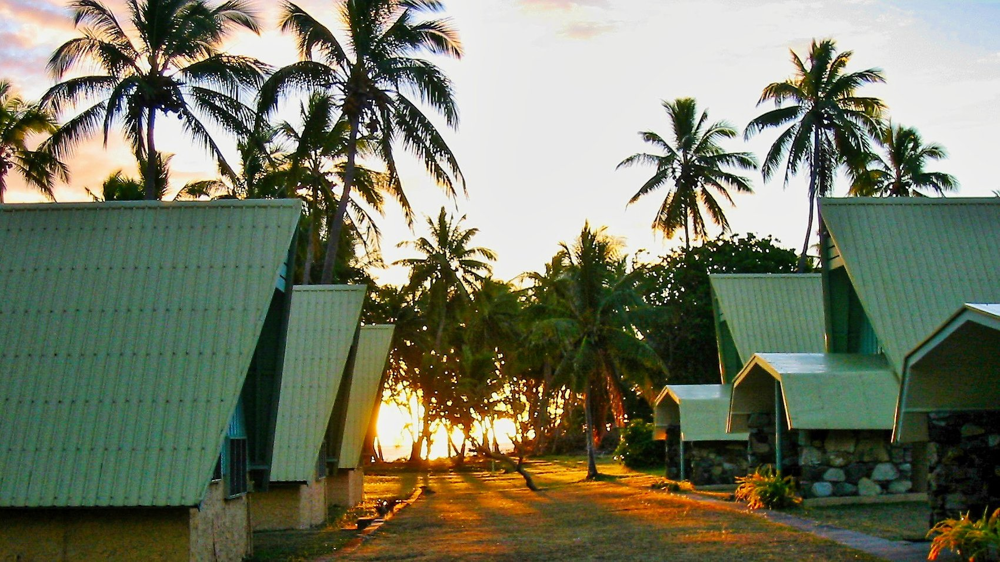
      <em>Viti Levu - Coral Coast - Tubakula Resort</em>
    </figure>

  <figure>
      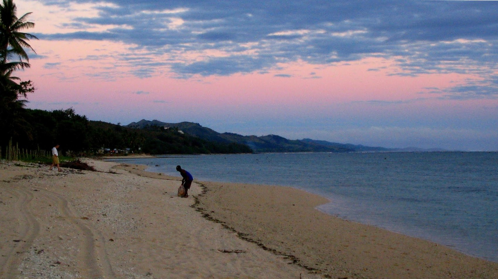
      <em>Viti Levu - Coral Coast - Tubakula Resort</em>
    </figure>

  <figure>
      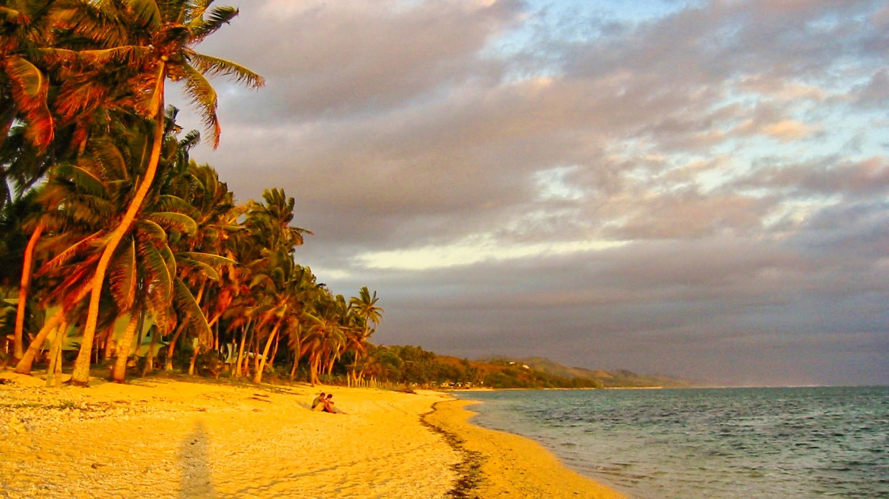
      <em>Viti Levu - Coral Coast - Tubakula Resort</em>
    </figure>

  <figure>
      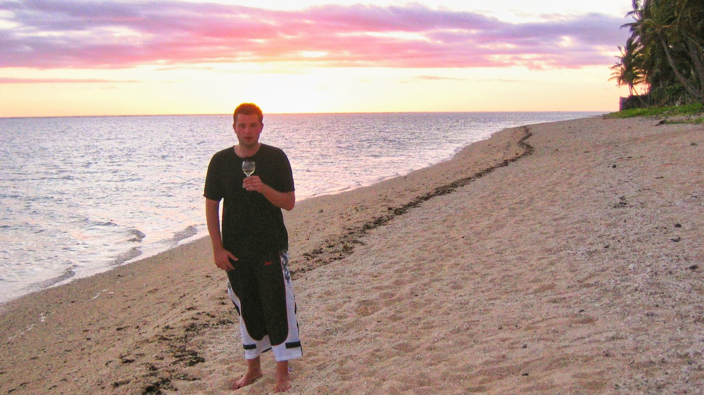
      <em>Viti Levu - Coral Coast - Tubakula Resort</em>
    </figure>

We decided to rent a car for the next four days to explore the island,
so we took the bus to Suva (\$6.80), Fiji’s capital, and stayed about 10
kilometres outside in the laid-back Raintree Lodge surrounded by
rainforest. A dorm bed cost \$20 and the bathrooms were fairly basic,
but otherwise the place was really lovely, with a wonderful restaurant
by a small lake and cosy hammocks where you could listen to the sounds
of the jungle.

In the evening we drove into Suva in our rental car (\$90 a day) to run
a few errands, but the city was packed and very hectic because the
Indian population was celebrating Diwali the next day, a kind of New
Year festival.

<figure>
  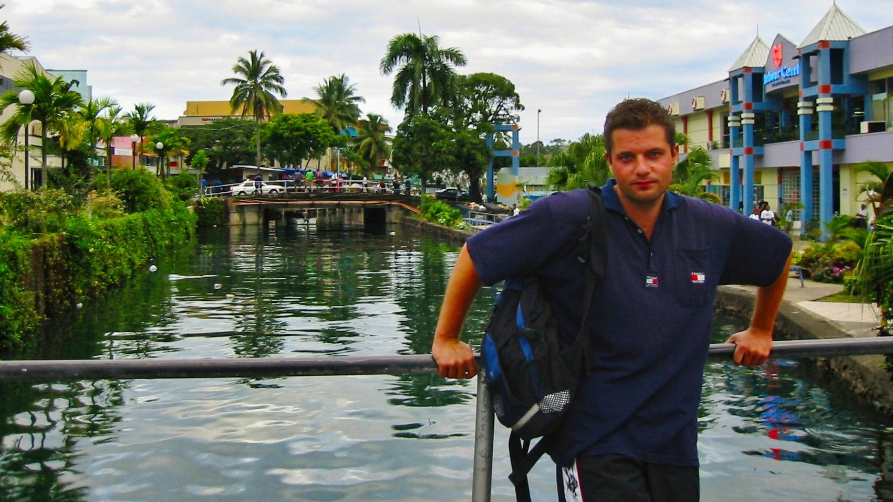
  <em>Viti Levu - Suva</em>
</figure>

We had a great evening back at the lodge: a proper dinner
with wine, getting stoned in the hammock, and long conversations while
blissed out. We didn’t go to bed until 3:30 even though we had a lot
planned for the next day.

We drove back from Suva to the Coral Coast because we’d been invited to
Diwali by an Indian family we’d met shopping a few days earlier. On the
way we stopped for lunch at the Beachhouse, a very nice backpacker lodge
on one of the most beautiful stretches of the Coral Coast.

  <figure>
      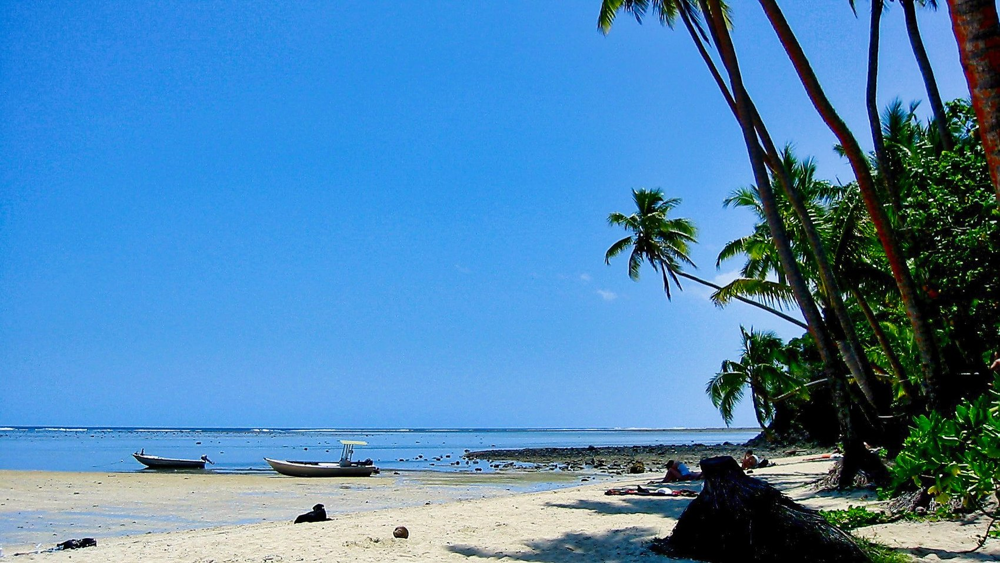
      <em>Viti Levu - Coral Coast</em>
    </figure>

  <figure>
      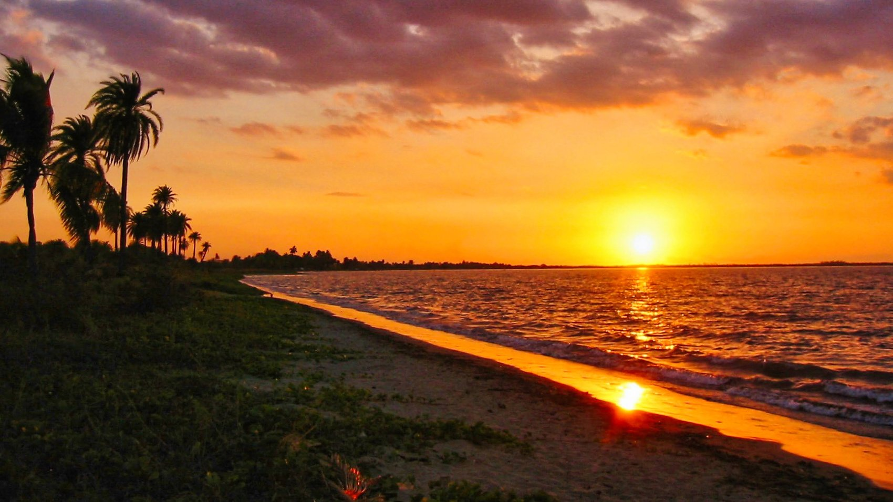
      <em>Viti Levu - Coral Coast</em>
    </figure>

Afterwards we
hiked to a gorgeous waterfall near the village of Biasevu, 45 minutes
through beautiful scenery. The waterfall was impressive and had a pool
for a refreshing swim.

<figure>
  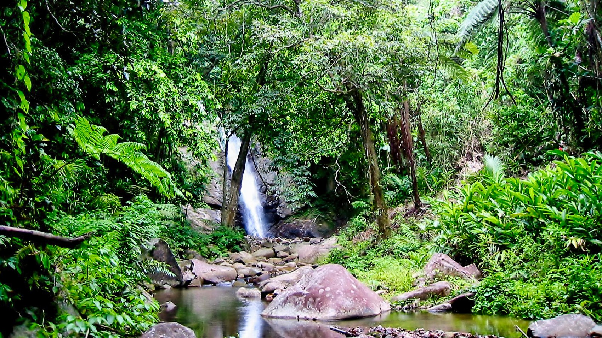
  <em>Viti Levu - Biasevu</em>
</figure>

In the afternoon we drove on to Natandola Beach, the only beach on the
Coral Coast that’s good for swimming regardless of the tides, a perfect
long sand beach in a sheltered bay without a reef. You could handle life
here!

<figure>
  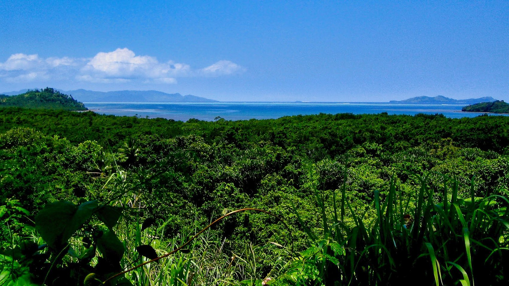
  <em>Viti Levu</em>
</figure>

<figure>
  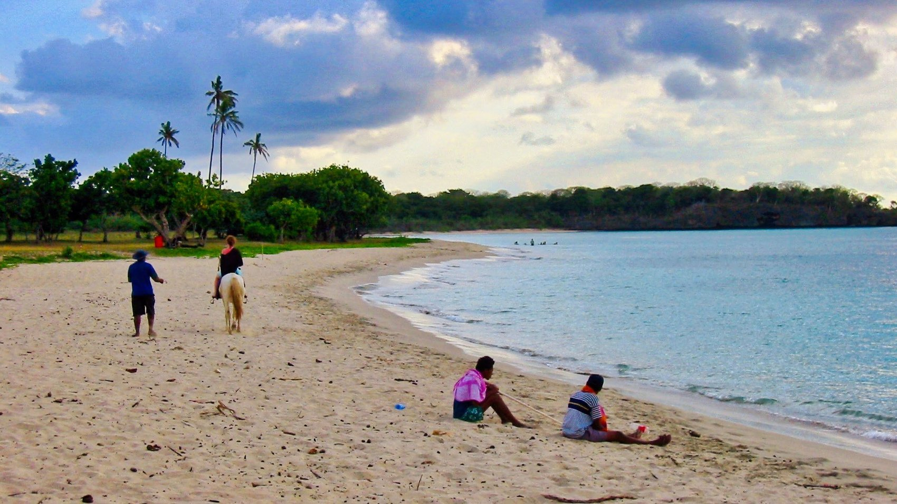
  <em>Viti Levu - Coral Coast - Natandola Beach</em>
</figure>

We took a room at the Casablanca Hotel in Korotogo because it was close
to the family’s house. An excellent decision! We got a huge room with a
bathtub and balcony for \$70 and got ready to celebrate Diwali.

<figure>
  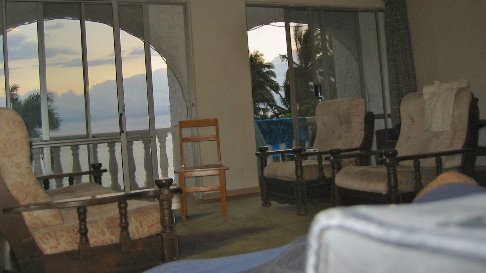
  <em>Viti Levu - Coral Coast - Casablanca Hotel</em>
</figure>

We had
bought sweets and fireworks, and Elaine had even picked up a sari in
Suva. It was a great evening: we visited all kinds of relatives of the
family, drank kava, were fed Indian delicacies, and got a real insight
into local life.

<figure>
  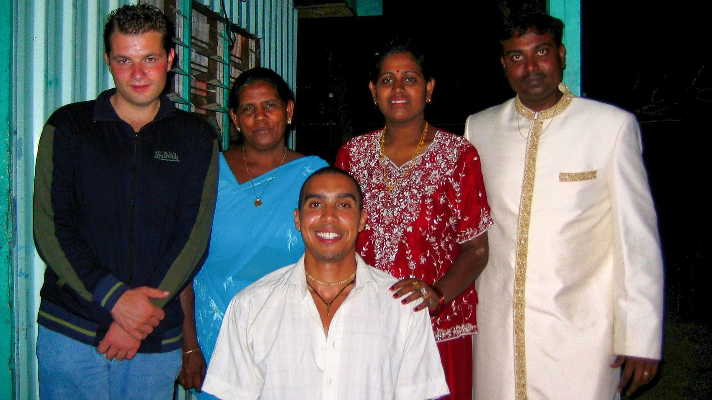
  <em>Viti Levu - Coral Coast - Diwali Festival</em>
</figure>

The next day we took it easy. We spent a few hours in Sigatoka burning
photo CDs (not very easy here in Fiji) and then went back for a swim at
Natandola Beach.

<figure>
  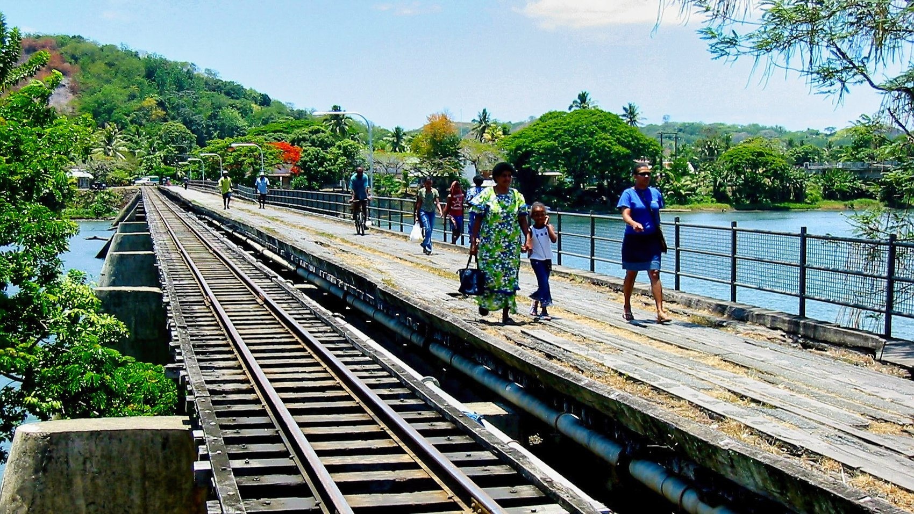
  <em>Viti Levu - Coral Coast - Sigatoka</em>
</figure>

  <figure>
      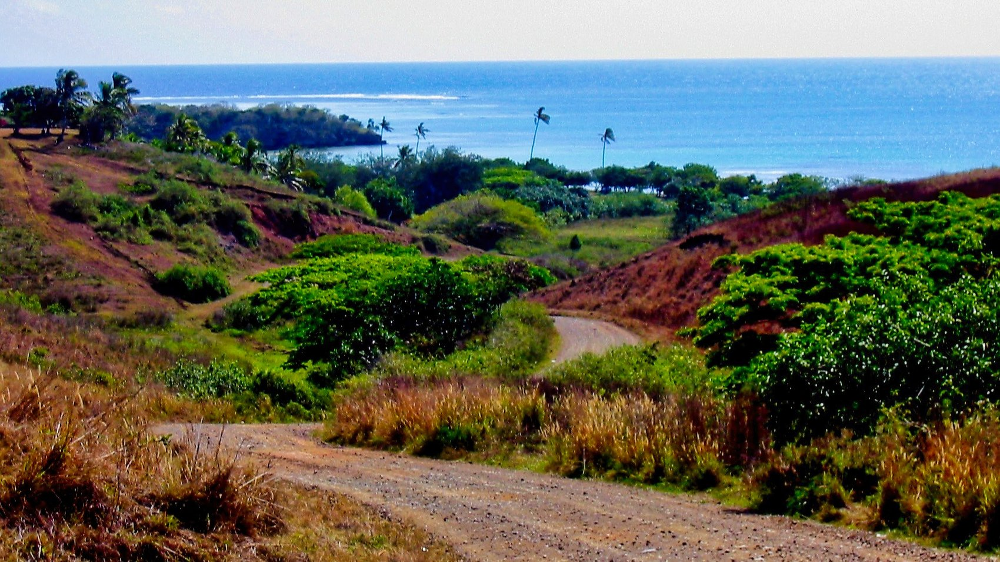
      <em>Viti Levu - Coral Coast - Natandola Beach</em>
    </figure>

  <figure>
      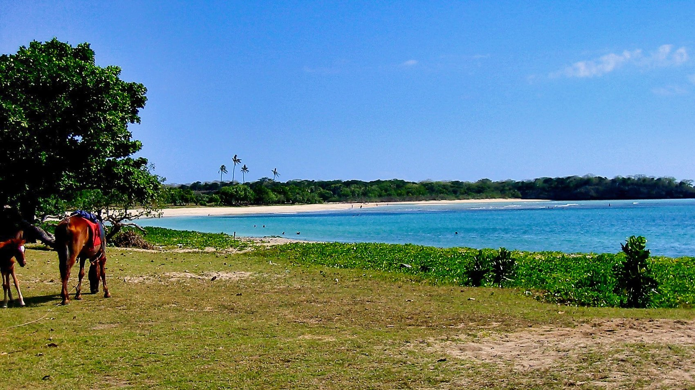
      <em>Viti Levu - Coral Coast - Natandola Beach</em>
    </figure>

Ty was flying to Auckland the next day, so we took a room near Nadi at
the Beach Escape Villas (\$75 for a simple but very spacious bungalow).
We treated ourselves to a delicious dinner at the beach restaurant of
the Travelers Beach Resort (grilled snapper in lolo sauce for \$14.90),
then went back to the bungalow, drank wine and smoked grass until we
were all stoned.

The next day we took Ty to the airport and drove further along King’s
Road on Fiji’s north coast. This area is very untouristy and
traditional, and the landscape is dreamlike.

<figure>
  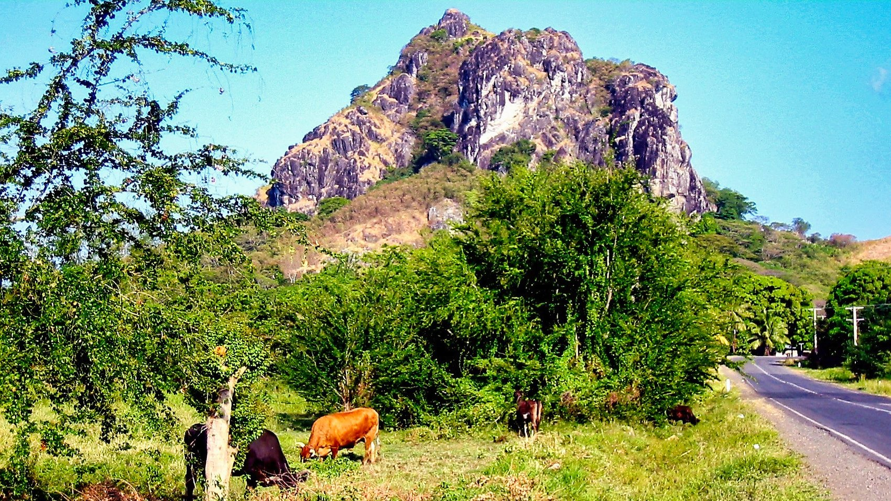
  <em>Around Viti Levu - King's Road</em>
</figure>

We had originally wanted to
go to a resort on the offshore island of Nananu i Ra, but we didn’t feel
like waiting that long for the boat, so we decided to continue to
Korovou.

What we hadn’t reckoned with was the state of the road between Viti Levu
Bay and Korovou: a track with adventurous wooden bridges and potholes;
you’d have wanted a 4WD for it.

At first it was still quite amusing, because the area is very
traditional and picturesque and we were greeted very warmly in all the
villages. After dark, however, the whole thing became pretty adventurous
and exhausting. The track seemed to have no end, and we even managed to
get lost because it was completely dark and we couldn’t see any signs,
and our petrol was also starting to run low.

But around 10 p.m. we finally reached the Tailevu Hotel in Korovou,
where we got a roomy but somewhat neglected room for \$60. We didn’t
care in the slightest; all we wanted was a bed and something to eat.
The hotel food was cheap and excellent, and they even brought it to our
room, together with a cold bottle of beer. I don’t think I’ve ever
enjoyed a beer that much.

After that we collapsed into bed and slept for eleven hours straight.

Today we had to go back to Suva to return the car. Luckily the road here
was paved again, and we were back at the Raintree Lodge in less than 45
minutes, where we checked in for two days, this time not in the dorm,
but in a pretty little double room with a balcony by the lake (\$50).

  <figure>
      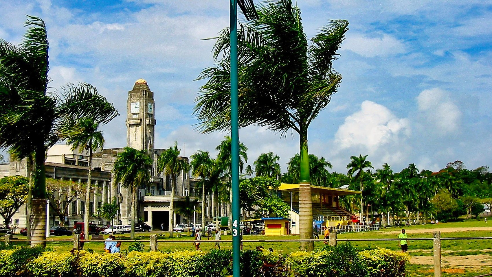
      <em>Viti Levu - Suva</em>
    </figure>

  <figure>
      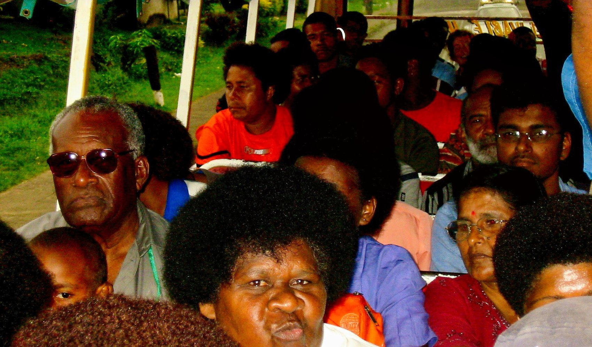
      <em>Viti Levu - Suva</em>
    </figure>

## 25 Nov 2004 — Levuka (Ovalau)

We spent another two nights at the Raintree Lodge and didn’t even make
it to the nature reserve on the other side of the road. One day
disappeared in the hammock with a book, and on the last day there was
only time for a bit of culture in Suva. We visited the Fiji Museum with
its interesting cannibalism section, drank cappuccino, and booked a
ticket to Levuka for the next day.

The trip to Levuka took five hours: first by bus to Natovi, then a
fairly spectacular 45-minute ferry crossing, followed by another bus
ride on the island of Ovalau.

<figure>
  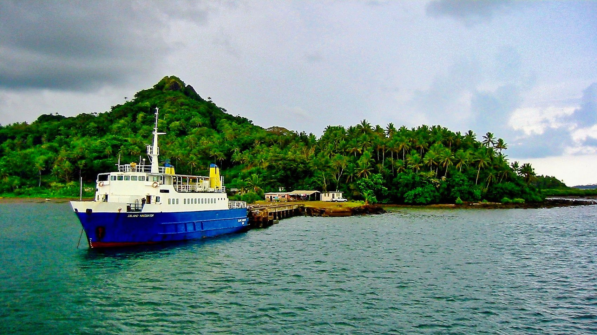
  <em>Ovalau Ferry</em>
</figure>

Levuka is Fiji’s old capital, with an unbelievably relaxed atmosphere,
colonial-style wooden houses, and a wonderful location by the sea
beneath jungle-covered hills. It’s one of those places where time seems
to stand still, and we stayed a few days longer than planned.

  <figure>
      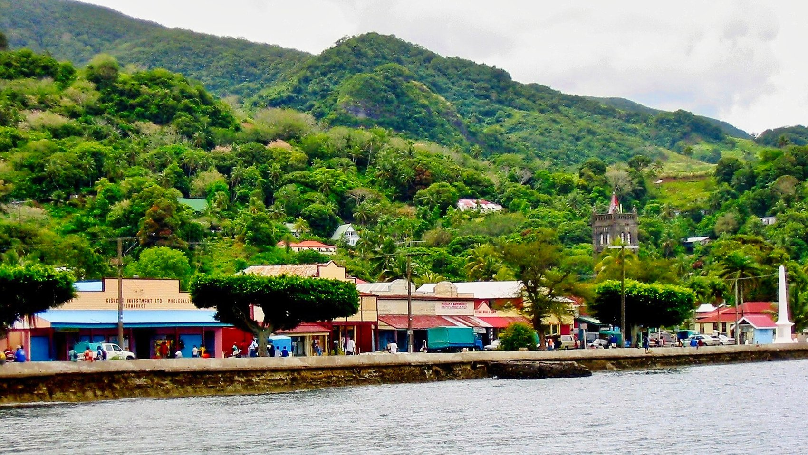
      <em>Ovalau - Levuka</em>
    </figure>

  <figure>
      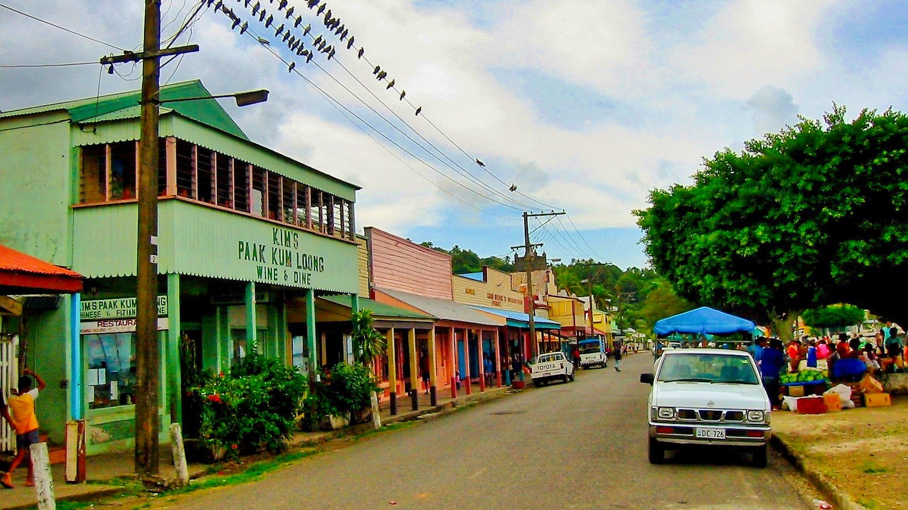
      <em>Ovalau - Levuka</em>
    </figure>

  <figure>
      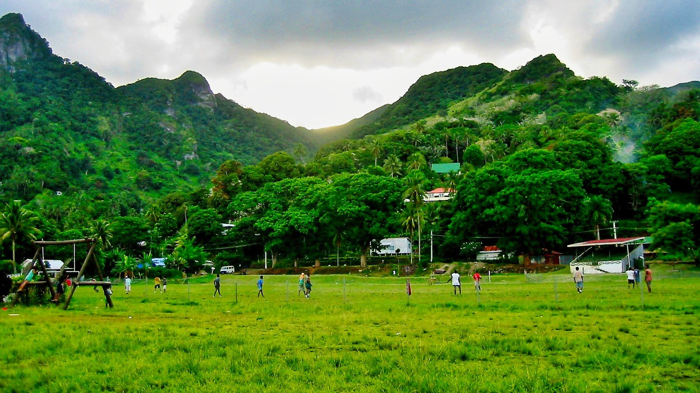
      <em>Ovalau - Levuka</em>
    </figure>

  <figure>
      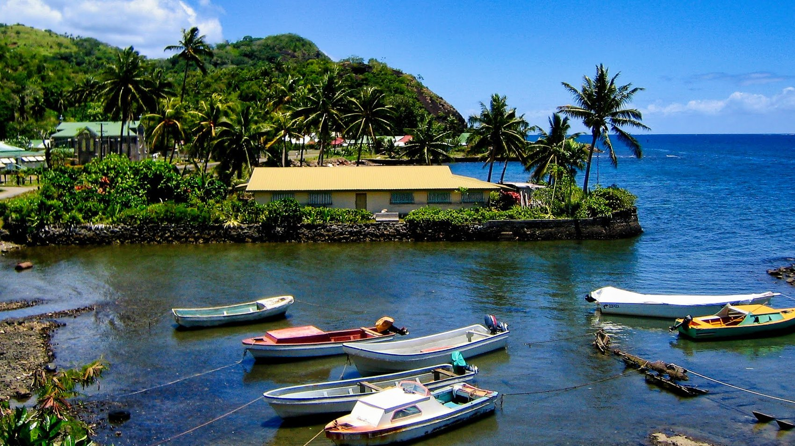
      <em>Ovalau - Levuka</em>
    </figure>

There were several reasons for this. For one thing, you can stay
incredibly cheaply in a wonderfully atmospheric colonial hotel, the
Royal, long past its best days, but still almost unbeatable value for
money. Our double room, simple but stylish, cost under \$30. The pool,
which we usually had to ourselves, was absolutely brilliant, set in a
garden with views of the green mountains inland, and the bar and lounges
radiated the charm of a long-gone era. I loved this place.

  <figure>
      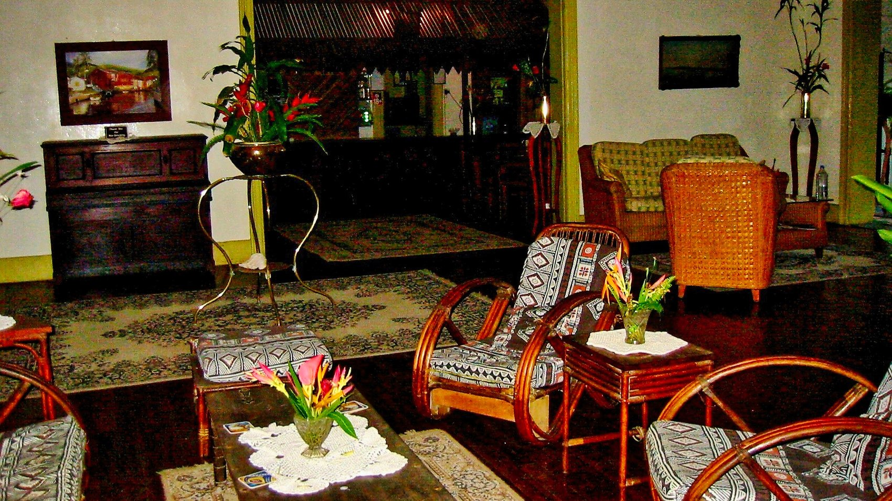
      <em>Ovalau - Levuka - Royal Hotel</em>
    </figure>

  <figure>
      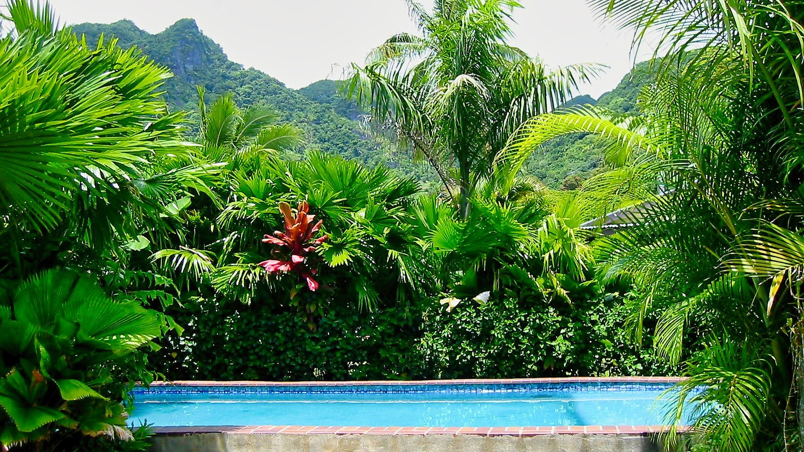
      <em>Ovalau - Levuka - Royal Hotel</em>
    </figure>

<figure>
  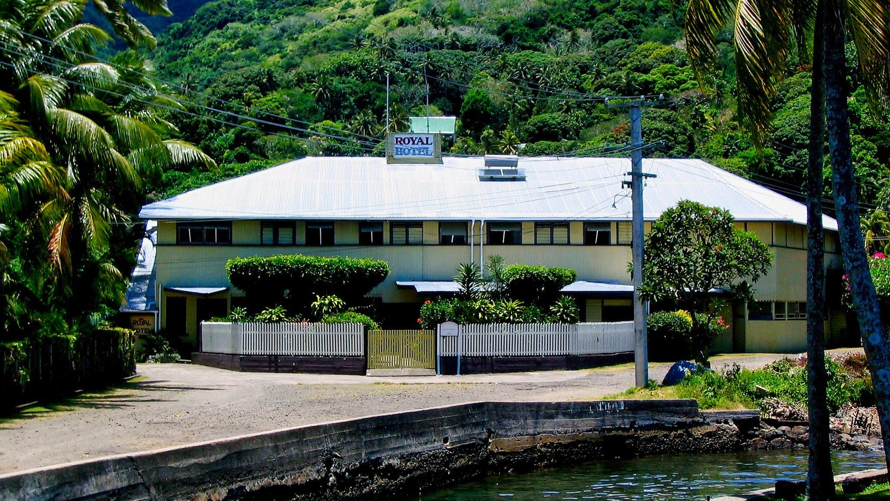
  <em>Ovalau - Levuka - Royal Hotel</em>
</figure>

Another reason we stayed so long was simply that we couldn’t leave.
Bobo’s Farm in the north of Ovalau was fully booked, and the inland tour
we wanted to do didn’t run again until the following week because of
deaths in the village.

So we spent a few cosy days in Levuka, swam in the pool, and enjoyed the
good food in the town’s two restaurants, the pretty Whale’s Tale and
the Chinese‑influenced Kim’s.

There is no nightlife in Levuka; even the hotel bar closed at 9:30.
Still, on Friday we managed to stay out until half past twelve and had a
wonderful evening in the colonial Ovalau Club with lots of beer and
interesting conversations with the club chairman, his wife and a few
local regulars. Another great experience, and a cultural insight you
only get as an open-minded independent traveller.

On Monday we also did the Highland Tour with Epi, a local from the
inland village of Lovoni. It was a nice hike through beautiful scenery
to the village, and at the same time an insight into the island’s
history and the medicinal properties of jungle plants. Epi is a great
storyteller, even if probably only half of what he says is even remotely
well founded.

  <figure>
      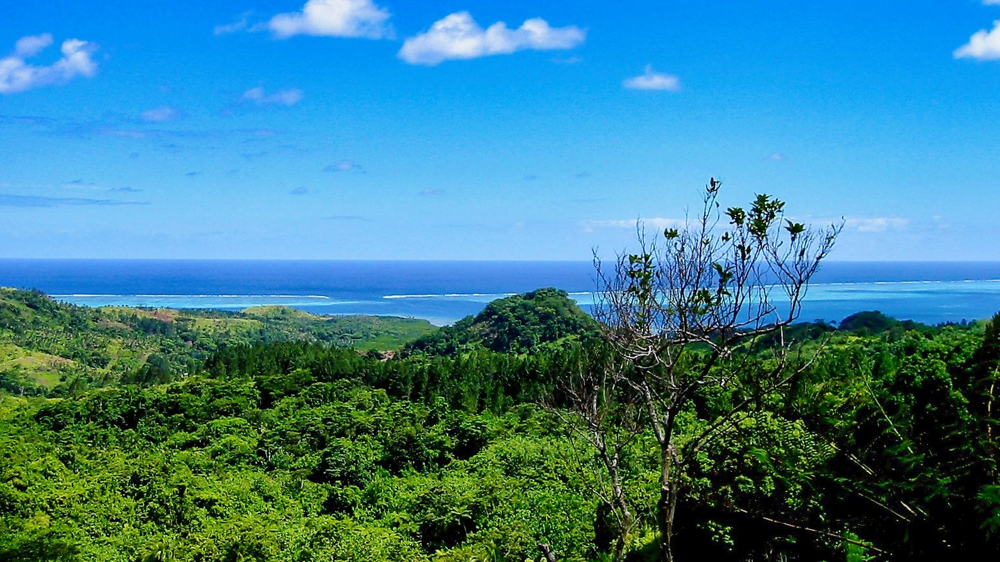
      <em>Ovalau - Lovoni Trek</em>
    </figure>

  <figure>
      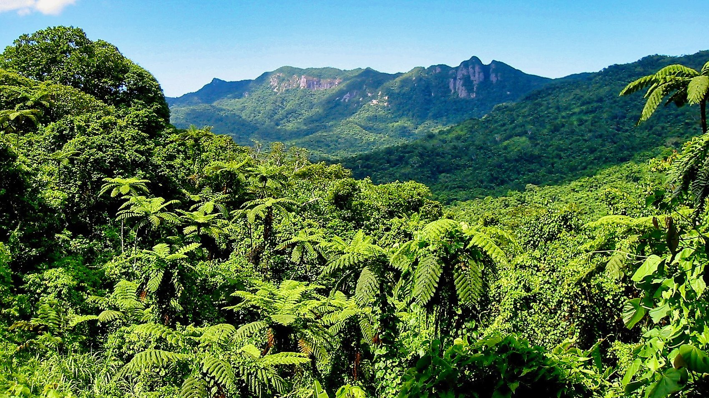
      <em>Ovalau - Lovoni Trek</em>
    </figure>

<figure>
  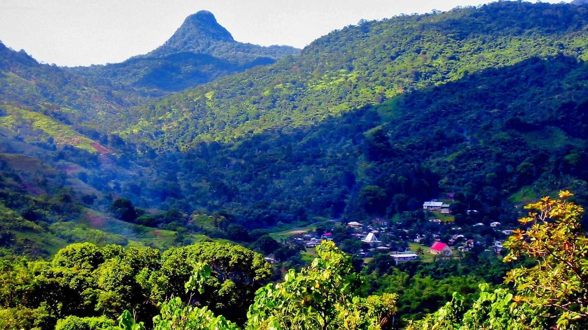
  <em>Ovalau - Lovoni Trek</em>
</figure>

In the village we got a tasty traditional lunch (taro, cassava, tuna)
and we visited the chief’s house. The chief wasn’t at home, but his used
underwear was lying scattered around the room. A very nice day for \$30.

On Tuesday afternoon we took a small speedboat (\$20) to the coral
island of Caqelai, just off Ovalau, a little paradise and the
fulfilment of South Seas clichés. The island is tiny, you can walk
around it in 15 minutes: white beaches with coconut palms, reefs
offshore, wonderful snorkelling with intact coral and brightly coloured
fish.

  <figure>
      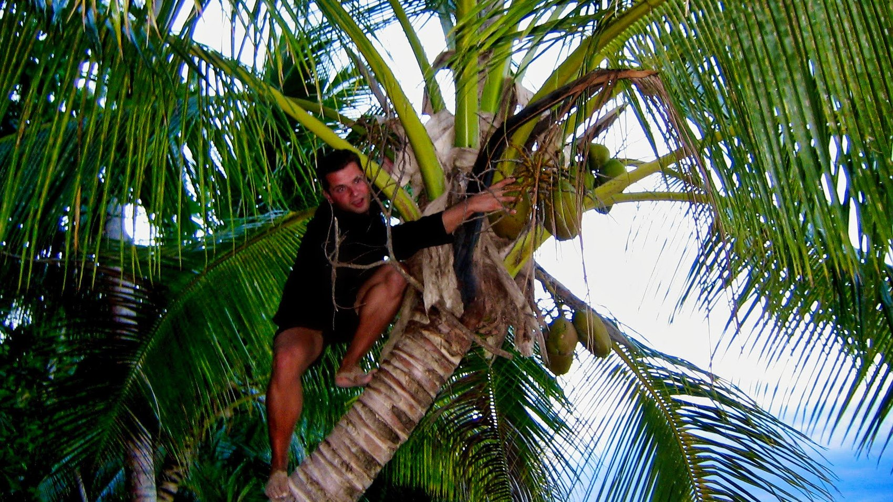
      <em>Fiji - Caquelai</em>
    </figure>

  <figure>
      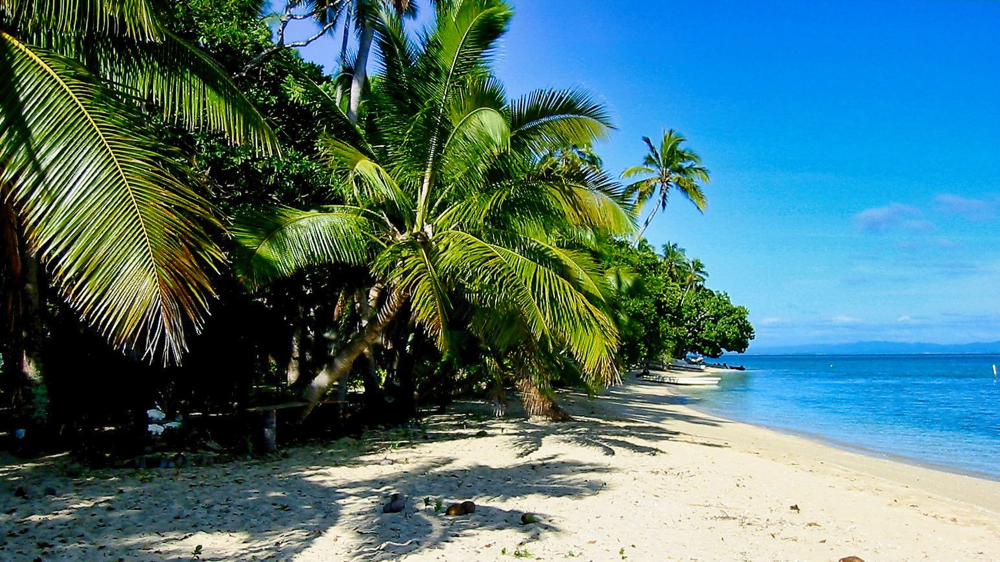
      <em>Fiji - Caquelai</em>
    </figure>

<figure>
  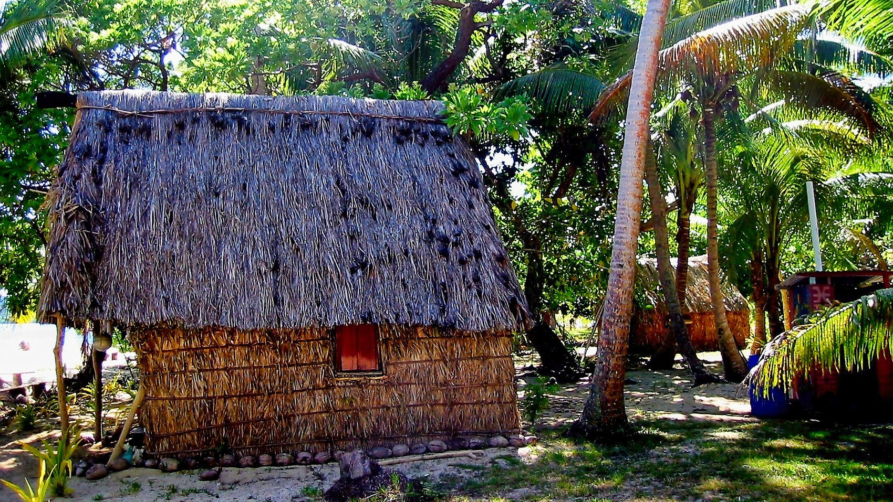
  <em>Fiji - Caquelai</em>
</figure>

The resort here is very basic: no running water, no electricity, none
of that unnecessary luxury. Just a few simple bures under palms, little
toilet huts, bucket showers and a common room where three meals a day
are served.

  <figure>
      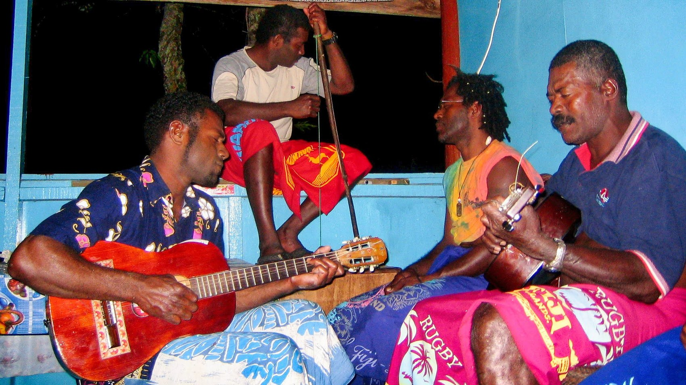
      <em>Fiji - Caquelai</em>
    </figure>

  <figure>
      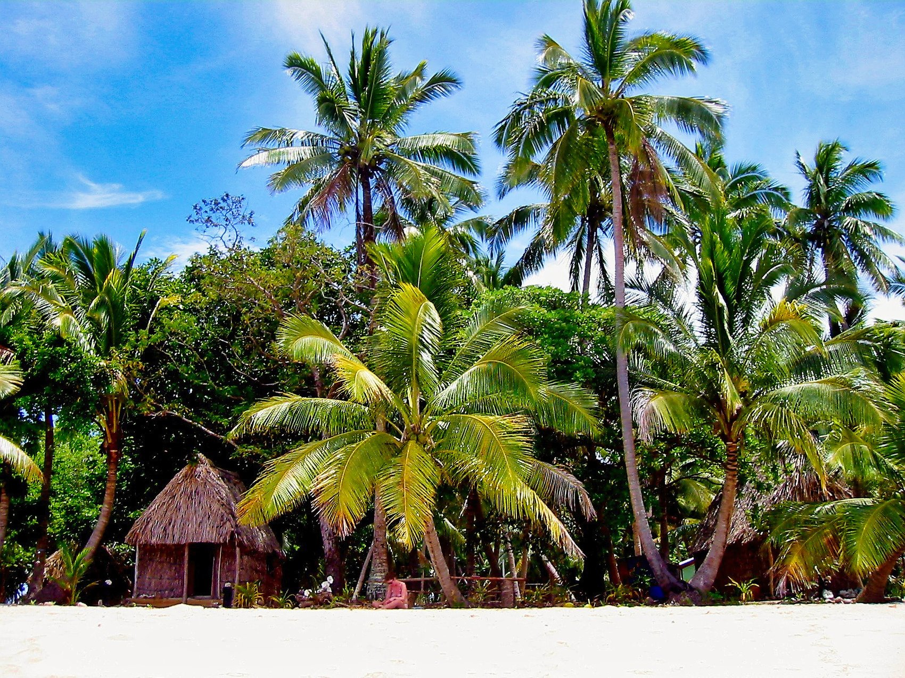
      <em>Fiji - Caquelai</em>
    </figure>

In the evening there’s guitar, singing, dancing and kava.

The people working here are all very nice, too, and you don’t feel like
a tourist being fed an entertainment programme. It’s more like being a
guest spending an authentic evening with locals.

A wonderful place to relax and forget. We paid \$45 per person for the
bure and three meals, a fair price for the right to spend a few days in
paradise.

  <figure>
      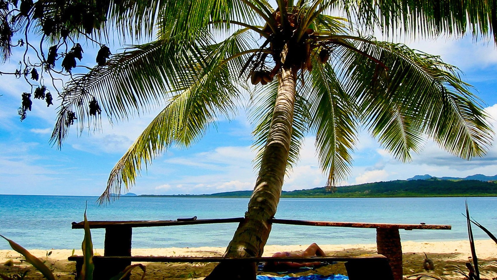
      <em>Fiji - Caquelai</em>
    </figure>

  <figure>
      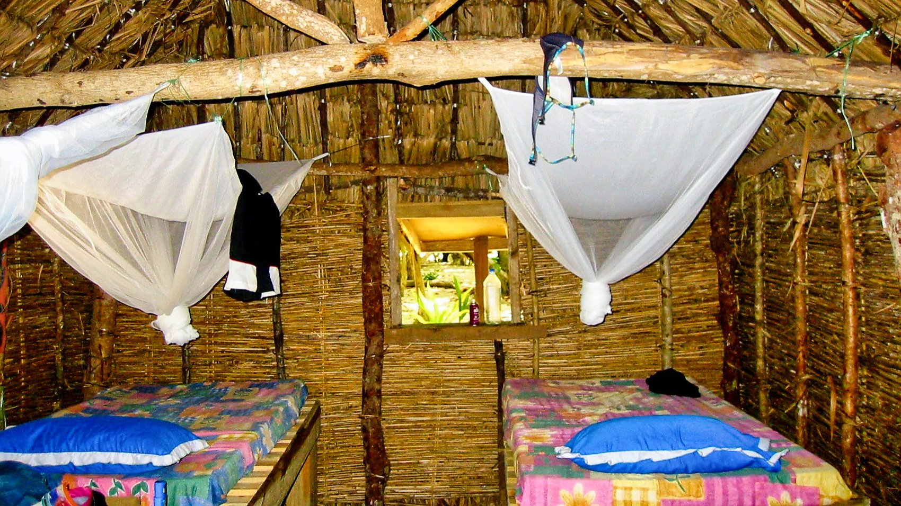
      <em>Fiji - Caquelai</em>
    </figure>

## 3 Dec 2004 — Fiji (end)

Today is our last day in Fiji. The last week wasn’t particularly
eventful because Elaine got sick shortly after we left our paradise and
headed back towards Viti Levu. We spent two nights at the Casablanca on
the Coral Coast, mostly in the room, since the weather wasn’t great
either. On Saturday it rained for the first time after three weeks of
dream weather.

Our plan was to spend the last few days on an island in the Mamanucas,
so we spent another night in Nadi, this time at the Hotel Kennedy. Not
the most attractive hotel on Queens Road, but the rooms (\$50) were
excellent: a huge bathroom with a jacuzzi (!) and 24-hour room service
at no extra charge, which was very convenient given Elaine’s condition.

We went with the cheapest island option, Mana Island (a one-hour boat
ride from Nadi), a mistake, as it turned out. The boat ride (\$70
return) was very beautiful; some of the islands we passed were the
ultimate South Seas dream.

  <figure>
      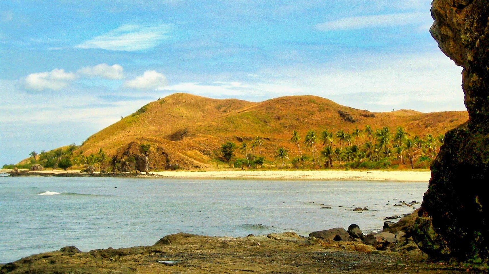
      <em>Mamanucas - Mana Island</em>
    </figure>

  <figure>
      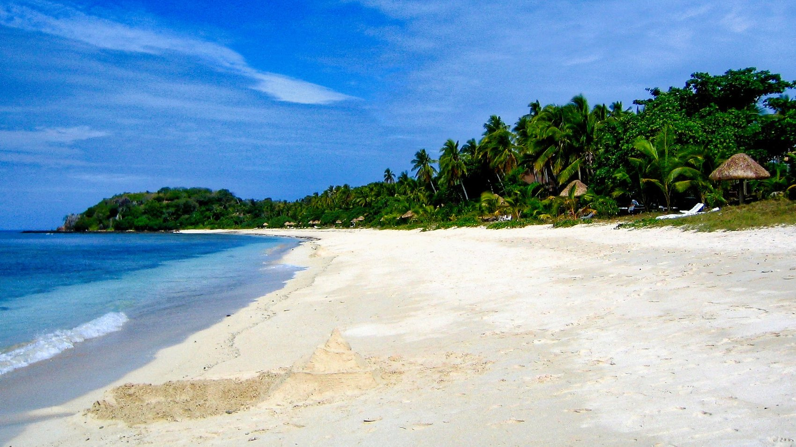
      <em>Mamanucas - Mana Island</em>
    </figure>

<figure>
  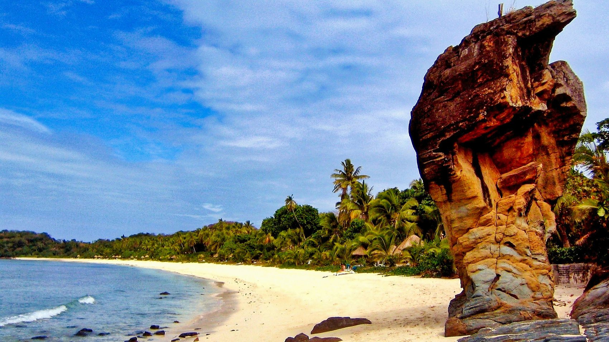
  <em>Mamanucas - Mana Island</em>
</figure>

But our resort on Mana was an absolute dump with zero character, full of
party backpackers. The rooms were grubby and too expensive (\$45 per
person including food). The island itself is really quite pretty. I
explored it thoroughly with two Germans who arrived on the boat with us,
and some of the beaches were gorgeous; the views of the surrounding
islands absolutely grand.

  <figure>
      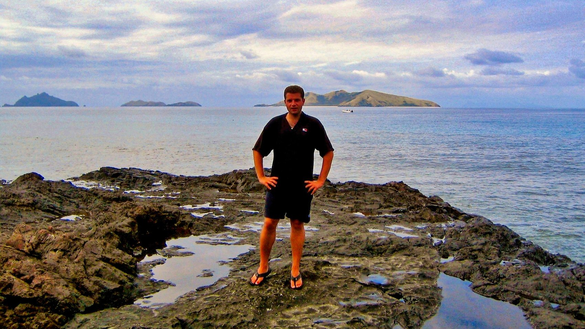
      <em>Mamanucas - Mana Island</em>
    </figure>

  <figure>
      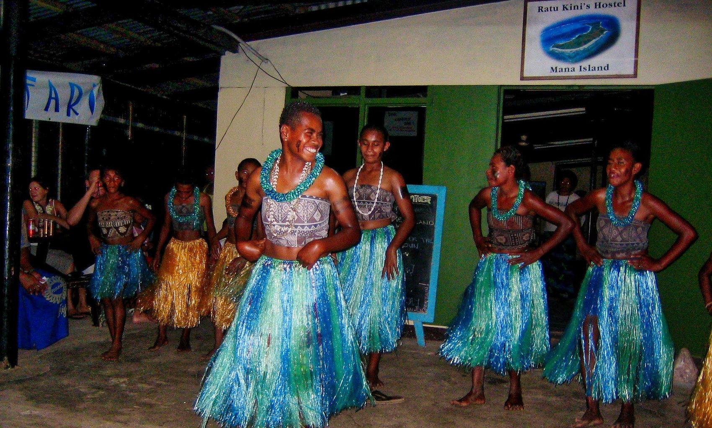
      <em>Mamanucas - Mana Island</em>
    </figure>

<figure>
  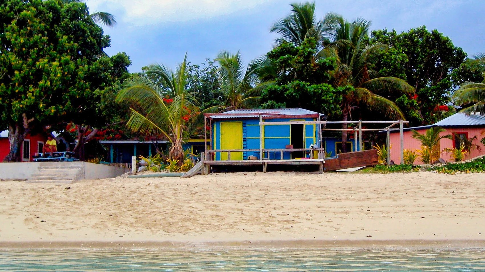
  <em>Mamanucas - Mana Island</em>
</figure>

We still went back the very next day, because it didn’t make much sense
to spend the last days in Fiji in a resort we both hated. And apart from
beaches and views, the island had nothing else to offer. The village was
unattractive, and all the hills had been cleared.

This part of Fiji (Nadi and the backpacker resorts on the surrounding
islands) is, despite all the natural beauty, the least attractive area
in the country: too touristy, too loud, and everything is overpriced.
The worst part is that most backpackers only ever see this part of Fiji.

I’m so glad we saw so much more, and I regret a bit that we didn’t stay
longer in Caqelai, or do the trip to Taveuni.

Since Elaine’s health hadn’t improved much, which made travelling
impossible, we spent another two days in Nadi, in a nice mid-range room
(\$75) at the West Motor Inn, and enjoyed a bit of luxury: the pool and
the good food in the restaurant.

Every day I walked into town to shop and discovered The Chef’s
Restaurant, where I had lunch twice. The “Chef’s” is one of the smartest
restaurants in town, but the prices were very fair and the food
absolutely delicious. For \$10.50 I got a mixed plate (Mezze of 8) with
raw tuna, aubergine, tabbouleh, hummus, tender chicken kebabs and kofta,
a real gourmet meal in a stylish setting, and the best thing Nadi has
to offer touristically.

For the last night we switched hotels again because we wanted to spend
an evening with Abi, a Scot from Eva’s. She had booked a package tour
and, like all package-backpackers before they are shipped off to the
islands, was staying at the Nadi Bay Resort.

The hotel itself is quite nice, with two pools, good food and clean
rooms. Still, the whole thing is basically a rip-off designed to take
money from inexperienced backpackers. Drinks and food were overpriced,
as was the room, \$56 without a private bathroom, especially if you
compare it with the less backpacker-oriented hotels nearby.

And the atmosphere didn’t do much for me either. Package-backpackers
generally aren’t my favourite people: they think they’re especially cool
and individual because they have a backpack and are far away from home,
but basically they don’t do anything different from your average
Mallorca package tourist.

