# Indonesia
**December 2007 – February 2008**

A bicycle journey across Indonesia, beginning in Sumatra and continuing through Java and Bali.

---

## Day 1 – 29.12 – 55 km

Georgetown – Belawan – Medan

After several days of waiting for the post-Christmas reopening of the Indonesian consulate, I was finally able to take the ferry to Sumatra today, as my 60-day visa (170 RM) had been issued yesterday. This is the classic route, used by generations of travellers, but nowadays, flying to Medan is actually far more practical and barely more expensive. The trip on the ice-cold speedboat was anything but romantic and lasted six hours (150 RM). After nearly another hour dealing with immigration formalities, I was finally able to set off from Belawan port to Medan at around 3:30 PM. The nearly 30 km journey was comfortable at first on the wonderfully smooth highway, but after about 4 km, a polite police officer informed me that the road, with its nice wide shoulder, was off-limits for bicycles. However, he reassured me that it was no problem at all to ride back against traffic (!) to the intersection and take the alternative route through the villages. This road was far less pleasant: narrow, bumpy, and full of kamikaze bemos (minibuses). After a nerve-wracking ride, I finally arrived in Medan around 5:30 PM and decided that, for my first night in this new country, I would splash out a little on a decent room in the 3-star Hotel Antares. The cheapest room (250,000 Rp) was small and windowless but comfortable, with a cosy bed, air conditioning, and a hot shower. The hotel had porters, parking attendants, and a lift. Since I still had a few errands to run and it was already frustratingly late, I hopped back on my bike and visited a few of the city's huge, modern malls. Medan has a bad reputation among travellers, often described as one of the most awful, unattractive big cities in Asia, a dump to escape from as quickly as possible. I can't quite agree with that. It's true that Medan, apart from a beautiful Moroccan-style mosque and an old, rather picturesque sultan’s palace, doesn’t offer much in the way of sights: there’s no colonial old town or anything similar, traffic is chaotic, and city planning is nonexistent in this sprawling metropolis. However, Medan still has all the advantages of a big city; its modern, air-conditioned malls provide a comfortable shopping environment and a welcome escape from the heat. Additionally, the city boasts Merdeka Walk, a wonderful, modern pedestrian zone with numerous open-air restaurants. That’s not what I’d call an awful and unattractive city. It would be the perfect place for people-watching, but since Indonesia (outside Bali) has seen a dramatic decline in tourist numbers for years, even in a large city like Medan, you yourself often attract a lot of attention. Thankfully, the curiosity is always expressed in a friendly, non-intrusive way.

<figure>
  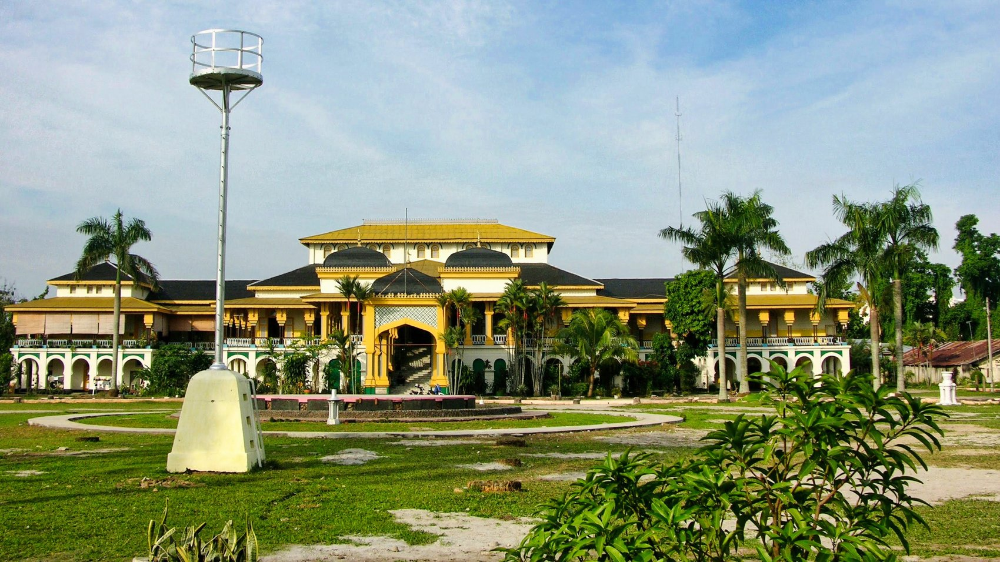
  <em>Medan</em>
</figure>

## Day 2 – 30.12 – 75 km

Luckily, the breakfast buffet included in the room price was abundant and varied, which was much needed for today’s leg of the journey, 1,300 metres of elevation gain, from the coastal lowlands to Berastagi in the Karo Highlands. The first 35 km were relatively flat, but after that, things got serious, 25 km of unrelenting, steady climbing up to a mountain pass that offered beautiful views of the lowlands. To make matters worse, the narrow, bumpy road was packed with traffic; it seemed as if half of Medan was heading for the mountains this Sunday. Essentially, it felt like city rush-hour traffic on a jungle mountain road. The scenery along the route was beautiful; it ran straight through the jungle, though the heavy traffic somewhat ruined the atmosphere. After the pass, it didn’t level out or descend towards Berastagi, as one might hope, but continued with rolling hills all the way to the centre of this visually unremarkable little town. Berastagi is popular as a getaway due to its cool climate, fruit and vegetable farms, and two volcanic craters nearby, making it a popular hiking destination. It really is cool up here; for the first time in Southeast Asia, I was actually glad the afternoon sun came out and provided some warmth. The clearer skies also improved the views of the volcanic craters. Berastagi itself is a hectic but friendly town with an interesting market and good accommodation options.

  <figure>
      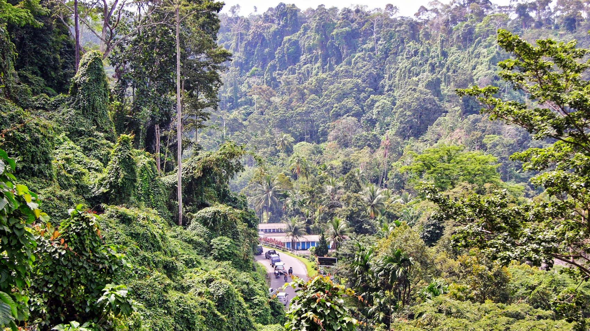
      <em>Berastagi</em>
    </figure>

  <figure>
      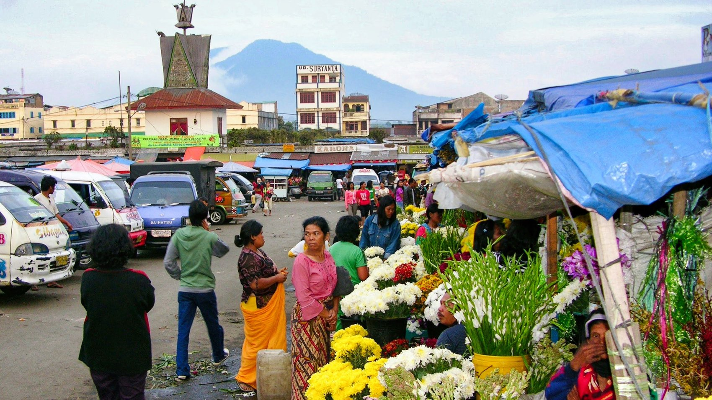
      <em>Berastagi</em>
    </figure>

I stayed at Wisma Sibayak, a charming little resort in a central location.

<figure>
  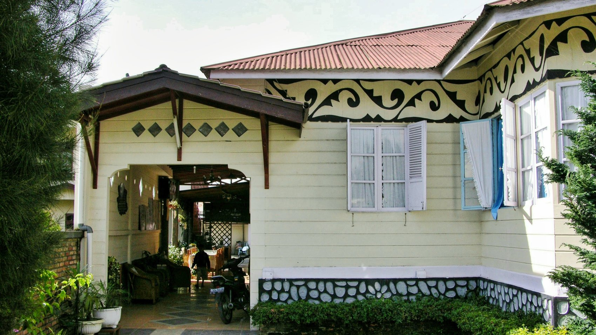
  <em>Berastagi - Wisma Sibayak</em>
</figure>

Unfortunately, only the cheapest rooms in wooden bungalows with shared mandi (traditional Indonesian bathroom) were available, but even these were spacious, clean, and featured a large bed and veranda, all for the very affordable price of 35,000 Rp.

## Day 3 – 31.12 – 112 km

Berastagi – Merek – Parapat – Tuk-Tuk

Going from Berastagi to Parapat, from 1,300 m down to 900 m, might sound like an easy ride, but today was just as exhausting as yesterday. The first 12 km to Kabanjahe were mostly downhill, but after that, the road conditions deteriorated significantly, and the ride to Merek was a series of endless hills. Merek itself was a chaotic market town where I turned east towards Parapat. The first kilometres on this road were in terrible condition, full of potholes that made it impossible to move quickly. Thankfully, the second section of the route, along the north side of Lake Toba, was newly paved, allowing for a much smoother ride. The 50 km stretch on this narrow, quiet road high above the lake was stunning, with breathtaking views of the vast, sparkling lake and the mountains of Samosir Island.

  <figure>
      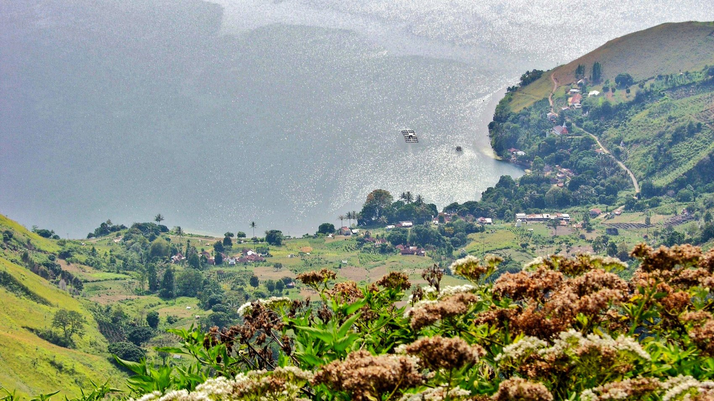
      <em>Lake Toba</em>
    </figure>

  <figure>
      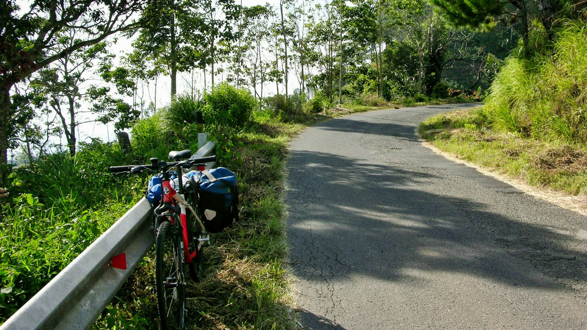
      <em>Lake Toba</em>
    </figure>

  <figure>
      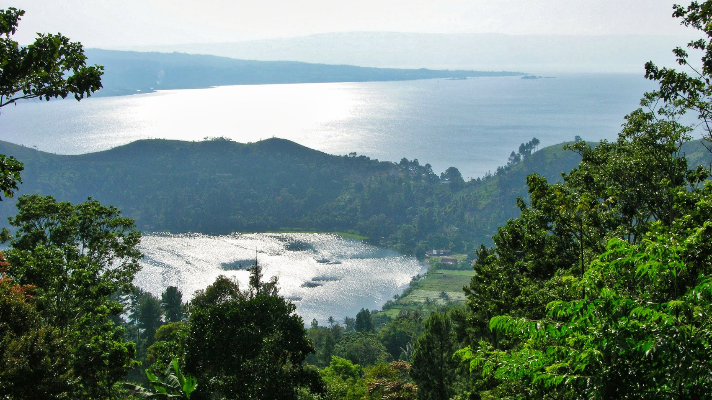
      <em>Lake Toba</em>
    </figure>

  <figure>
      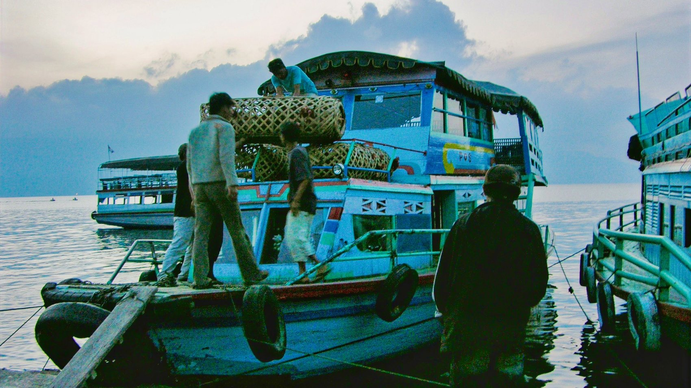
      <em>Lake Toba</em>
    </figure>

However, it was also brutal, full of long climbs and descents. Determined to reach Samosir before dark, I pushed myself too hard and was completely exhausted by the time I reached the main highway. From there, the last 8 km descended in winding switchbacks to Parapat on the lake shore. I arrived at the ferry terminal at exactly 5:58 PM, hoping to catch the 6:00 PM ferry, only to discover that the departure times here are more of a suggestion; the ferry had already left. So, I had to wait over an hour for the next one. Staying overnight in Parapat was not an option, as this moderately attractive yet beautifully located town was packed with holidaymakers for New Year’s Eve, and all rooms were fully booked. So, I had no choice but to take the 7:30 PM ferry (10,000 Rp) to Tuk-Tuk in the dark, a fortunate turn of events. Sailing across Lake Toba on a warm, starry night, with fireworks lighting up both shores, was an unforgettable experience. Naturally, most hotels in Tuk-Tuk were also full of Indonesian holiday tourists, but after several failed attempts, I finally found a cottage at Tony’s, at the far northwest end of the peninsula. It wasn’t the classic Batak house by the lake that I had envisioned, but tonight was not a night for being picky. The cottage was situated on a hillside across the road, a bit worn but very spacious, with a private bathroom, sitting area, and some traditional décor. Normally, such a room would cost just 30,000 Rp, but given the peak season, 75,000 Rp felt like a fair price, especially since the place is mostly empty for the rest of the year.

## Days 4-5 – 1-2 January – 46 km

I spent two days on Samosir Island, a place where I could have easily stayed for weeks. On New Year's Day, I woke up around 9 AM with a slight hangover. But one look out of the large window of my cottage was enough to wake me up instantly. The view was breathtaking: a tropical green mountain range bathed in sunlight, glowing rice fields, and the shimmering deep blue lake, a picture-perfect tropical paradise.

  <figure>
      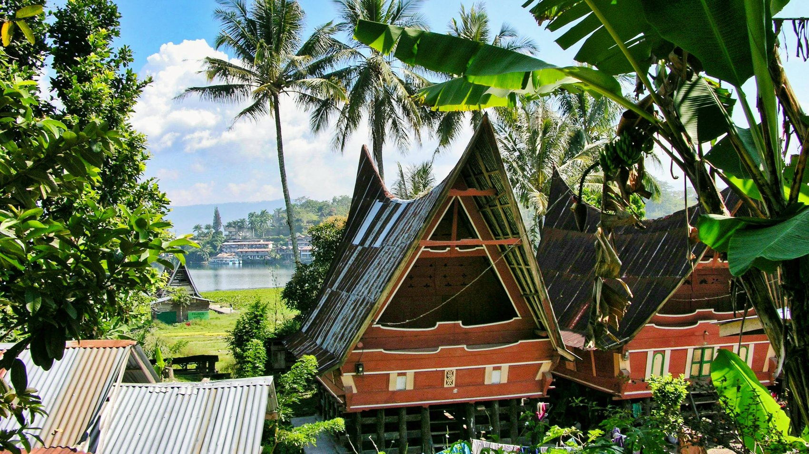
      <em>Lake Toba</em>
    </figure>

  <figure>
      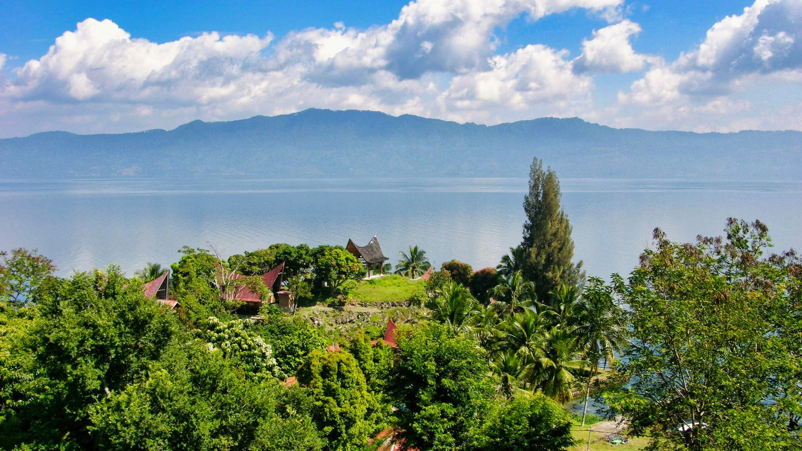
      <em>Lake Toba</em>
    </figure>

  <figure>
      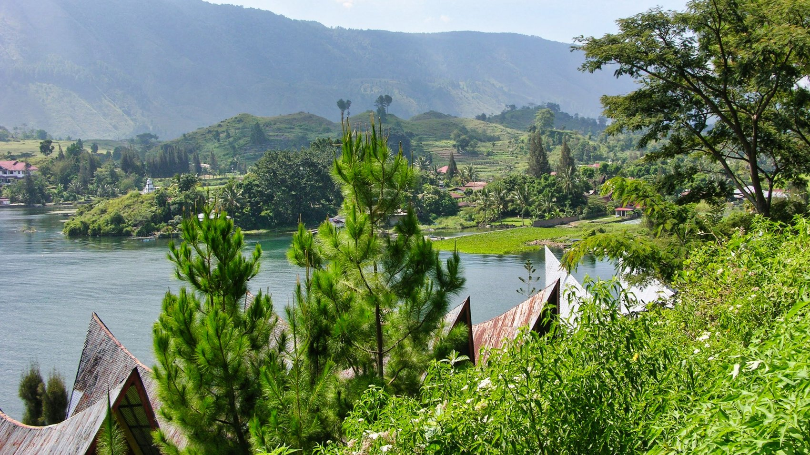
      <em>Lake Toba</em>
    </figure>

  <figure>
      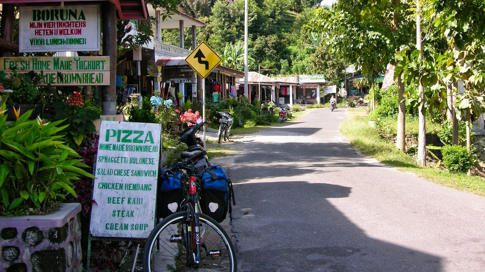
      <em>Lake Toba</em>
    </figure>

<figure>
  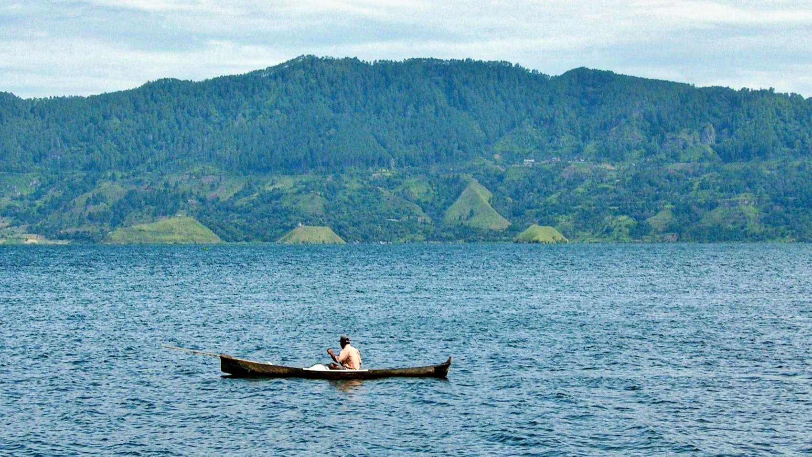
  <em>Lake Toba</em>
</figure>

Until about ten years ago, the Tuk-Tuk Peninsula was one of Southeast Asia’s most popular travel destinations, where generations of travellers enjoyed the laid-back atmosphere and pleasant climate. However, after various natural and geopolitical disasters in the first decade of this millennium, tourism almost completely collapsed. As a result, some hotels had to close or were never even finished. And while the worst seems to be over, there were still surprisingly few Western tourists here, even over New Year's. The remaining accommodations now rely on local holidaymakers and weekend visitors, but even when almost all rooms are occupied, Tuk-Tuk feels far from crowded. Many of the numerous bars and restaurants remain half-empty, and after a few walks along the main road, you start recognizing almost every Westerner by sight. Yet, Tuk-Tuk has everything a traveller’s heart desires: stunning scenery, a wonderfully relaxed atmosphere, extremely affordable and comfortable accommodations, great swimming spots in the clear, pleasantly warm lake, and last but not least, the Batak people, an incredibly friendly community. They seem to treat tourism as more of a side business, making you feel more like a temporary part of the community rather than just a source of income, no sign of scams or rip-offs, despite the dramatic decline in visitor numbers over the past years. Since most Bataks are nominally Christian, alcohol flows freely here, so you don’t have to give up anything. Tuk-Tuk is one of those places best enjoyed by doing nothing at all, just getting a nice room by the lake, reading a few good books, cooling off in the water from time to time, and finding a cosy restaurant in the evening. However, Samosir is also great for cycling. At least to the north, the road is in good condition and not too hilly, allowing for a relaxed ride through friendly villages with occasional refreshing dips in the lake. On the second day, I switched accommodations to be directly by the water. At Lekjan Resort, I got a large room with a balcony and a hot shower on the second floor of a traditional Batak house for 50,000 Rp.

  <figure>
      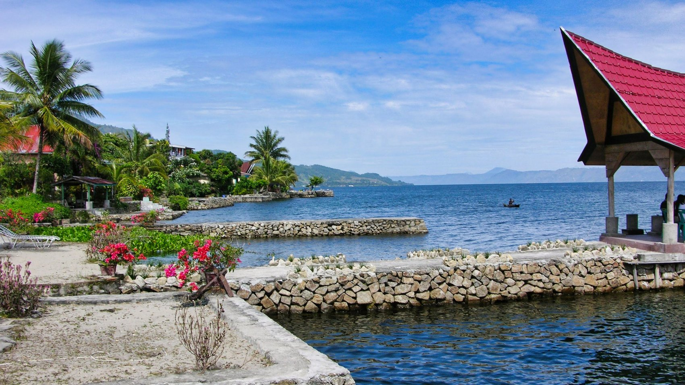
      <em>Lake Toba - Lekjon Cottages</em>
    </figure>

  <figure>
      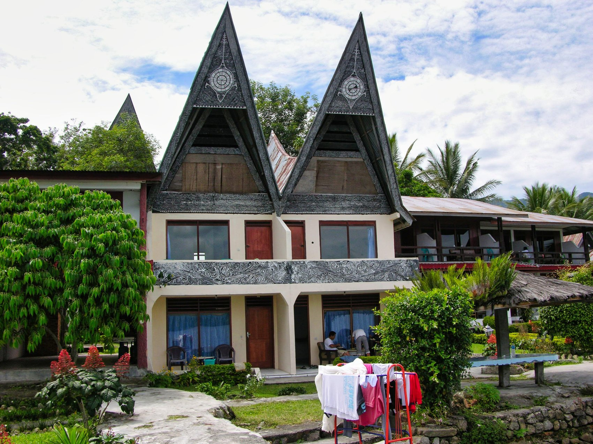
      <em>Lake Toba - Lekjon Cottages</em>
    </figure>

Since the resort had a well-maintained swimming area with a grassy shoreline, I borrowed a book from the library and left my bike behind for the day.

## Day 6 – 3 January – 108 km

Tuk-Tuk – Parapat – Balige – Tarutung

Shortly after 8:30 AM, I took the first boat back to Parapat. Since the ferry stopped at nearly every pier along the Tuk-Tuk coast to pick up passengers, the ride took over an hour. However, it was a great opportunity to enjoy the peninsula from a different perspective one last time. Just before 10 AM, I set off from Parapat, following the Trans-Sumatra Highway towards Padang. On Sumatra, 'highway' doesn’t imply speed; it merely means the main connection road, a narrow, twisting line through the mountains. Traffic was much lighter than between Medan and Berastagi, but cycling on Sumatra is by no means a walk in the park. From Parapat, the road climbed steeply for about 10 km in winding switchbacks before leveling out into rolling hills for another 10 km. This was followed by a 10 km descent, which I had to take carefully due to the numerous potholes. Some were so large and deep that a single lapse in attention could have ended my journey right there. The next 30 km to the first larger town, Balige, along the shore of Lake Toba, were relatively flat and, despite some rough patches, easy to cover quickly. From there, the road headed south into the mountains, a steady but manageable 15 km climb. About 10 km past Balige, there was a viewpoint offering one last, stunning view of Lake Toba.

<figure>
  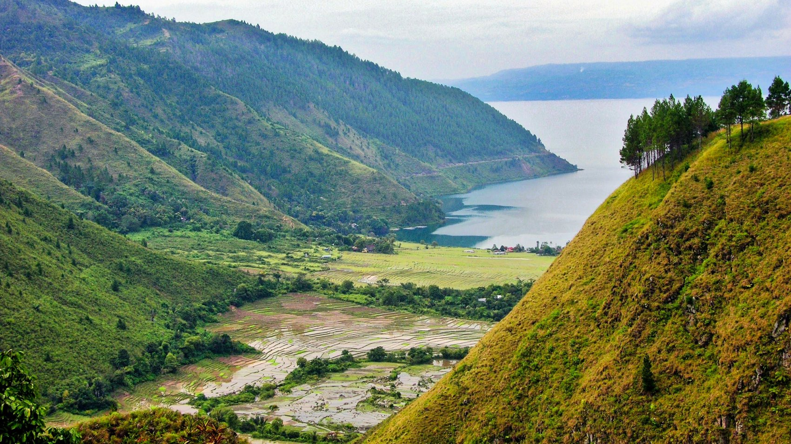
  <em>Lake Toba</em>
</figure>

The final 30 km to Tarutung were still quite hilly but mostly downhill, if only it weren’t for the potholes. Scenically, the route was beautiful, with mountains and lush green rice fields, and the locals were generally very friendly. As a cycling tourist, I was a huge attraction here, of course. Tarutung is a well-maintained and relatively attractive small town (by local standards), situated along a river that flows through a long, wide valley.

<figure>
  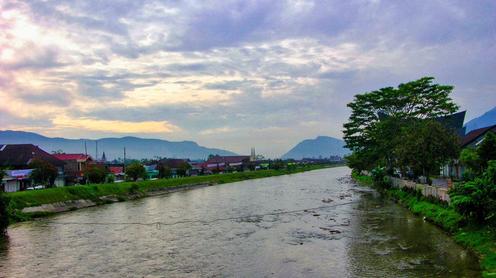
  <em>Tarutung</em>
</figure>

There are a few nice, simple eateries by the river, including Café William, which served good food (Special Mee Goreng with shrimp and chicken for 13,000 Rp) and excellent fresh fruit juices. I spent the night near the first bridge on the eastern riverbank at Perdana Hotel, which seemed to be the better option among the two hotels in town. It was a relatively well-kept motel with rooms arranged around a courtyard. My room was actually quite charming, though slightly worn-out, featuring a large, comfortable bed, thick blankets, and a simple mandi (a traditional Indonesian water basin for bathing) for 100,000 Rp. I couldn’t yet judge whether this was a fair price, as I was still unfamiliar with pricing in Indonesian provincial hotels. Cheaper rooms without a private bathroom were also available. One thing I did realize today: after a tough day of cycling, a cool mandi bucket shower is an absolute blessing, far better than the sad trickles that pass for showers in some other countries.

## Day 7 – 4 January – 79 km

Tarutung – Sipirok

Today was another consistently mountainous day, with no flat sections at all, essentially a roller-coaster ride on the Trans-Sumatra Highway, whose condition on this stretch was significantly worse than yesterday. The first 50 km or so trended downhill, and while there were no dramatically long, steep climbs heading south, the final stretch before Sipirok featured a climb spanning several kilometres, with steep sections and areas where cycling was simply impossible due to the road conditions. The highway was already rough, bumpy, and full of potholes, but today, at regular intervals, the paved road inexplicably vanished, leaving behind sand, stones, and gravel. One of these sections was so long and steep that, in rainy conditions, a cable winch is used to pull vehicles uphill. Scenically, the route once again passed through beautiful mountain landscapes, with simple villages lining the roadside.

  <figure>
      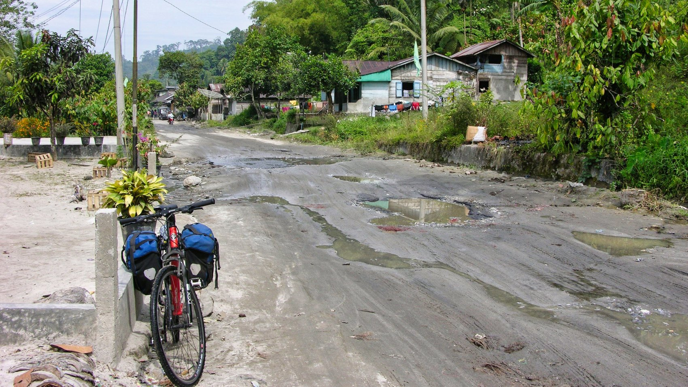
      <em>Trans-Sumatra Highway</em>
    </figure>

  <figure>
      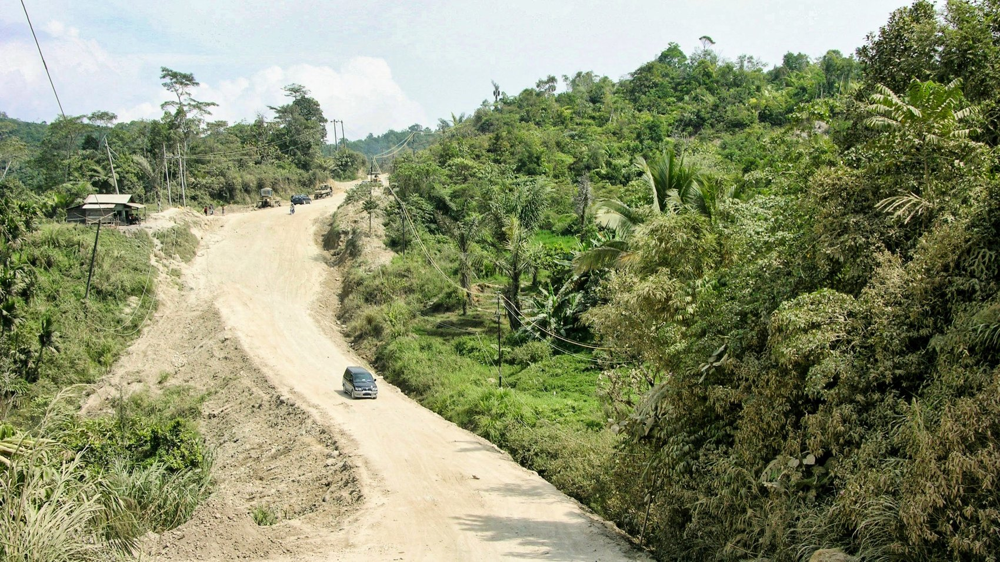
      <em>Trans-Sumatra Highway</em>
    </figure>

Beyond the rundown town of Sipirok, the road continued to climb. After about 5 km, I reached the Tor Sibohi Nauli Resort, situated amid stunning nature with expansive views of the surrounding mountains.

  <figure>
      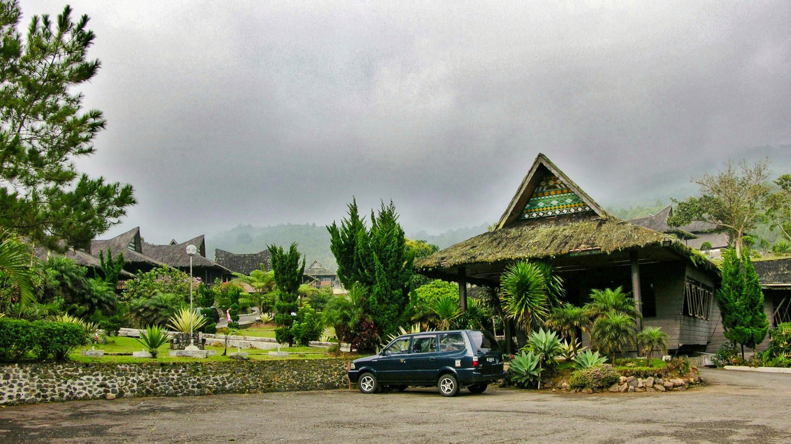
      <em>Tor Sibohi Nauli Resort</em>
    </figure>

  <figure>
      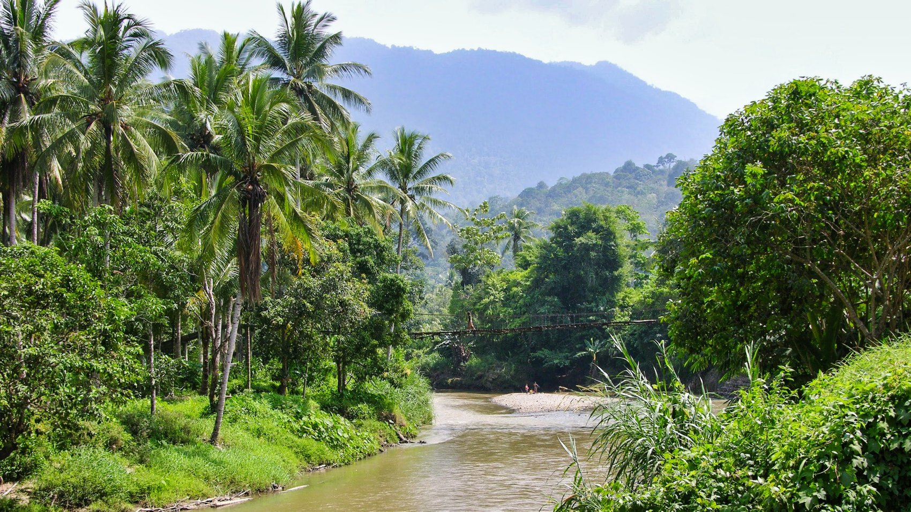
      <em>Tor Sibohi Nauli Resort</em>
    </figure>

  <figure>
      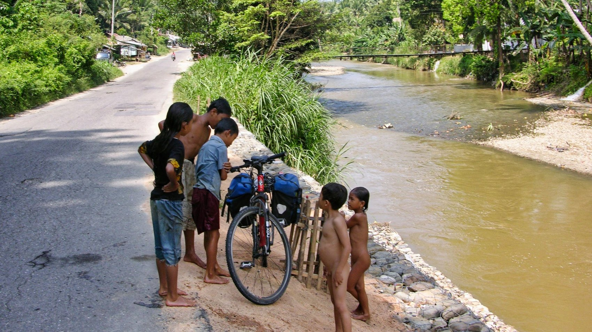
      <em>Tor Sibohi Nauli Resort</em>
    </figure>

  <figure>
      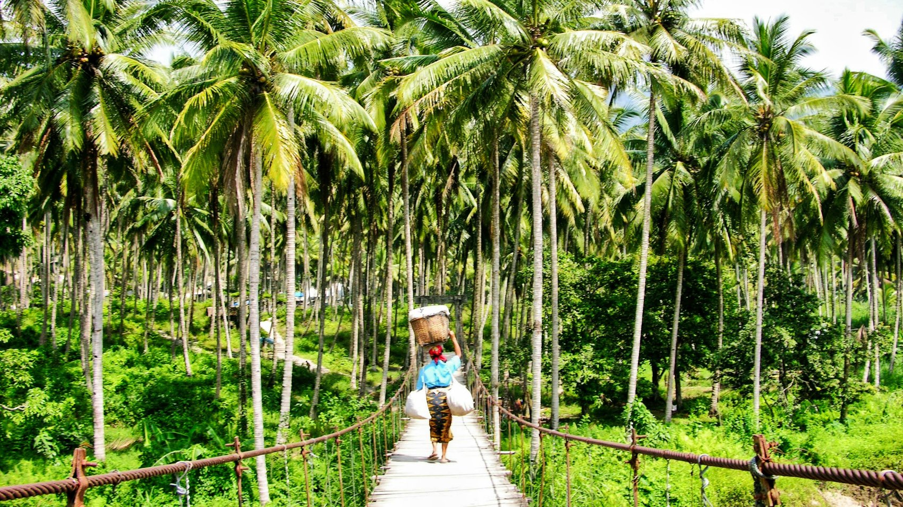
      <em>Tor Sibohi Nauli Resort</em>
    </figure>

<figure>
  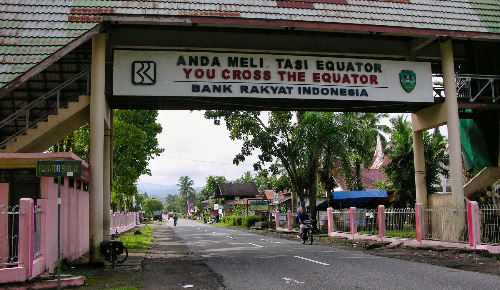
  <em>Tor Sibohi Nauli Resort</em>
</figure>

I decided to stay there. Though it was only 3:30 PM, a nasty storm was brewing. While a tropical downpour can be refreshing in the lowlands, in the mountains, getting drenched on a bike is an entirely different, and much colder, experience. Besides, the next town was still 30 km away. Thus, I ended up in what was, by local standards, a proper luxury resort, complete with a pool. For 175,000 Rp, I got a massive chalet featuring a sitting area, a carpeted living and sleeping space with comfortable beds, fully panelled wooden walls, and a real Western-style bathroom with hot water and a bathtub. Of course, luxury in Sumatra does not necessarily mean that everything works perfectly. Most tourist accommodations on the island were built over a decade ago during the tourism boom and have since been neglected due to declining visitor numbers. As a result, rooms always have a slightly worn-out feel, and it took me hours to finally get hot water for a bath. Still, given the price, there was little reason to complain, and in the end, the bath was truly wonderful. The resort’s restaurant served good, affordable satay and krupuk. However, I was the only guest, on a Friday during the holiday season, in a place with 72 rooms!

## Day 8 – 5 January – 148 km

Sipirok – Padangsidempuan – Panyabunang – Kota Nopan

From my resort, the road continued to climb for a few more kilometres before leading into a predominantly downhill ride towards Padangsidempuan, a surprisingly large city with heavy traffic. Beyond the city, the route became quieter, with the highway gently undulating along the slopes of a broad valley. Approaching Panyabunang, the valley narrowed, and the terrain became hillier. However, the scenery was stunning, with the road following a picturesque river. From Panyabunang, it was another 45 km to Kota Nopan: first, 10 km of gentle hills through a valley, followed by a steady 10 km climb, then an equally long descent. The final 15 km into town wound through yet another scenic valley alongside a river. For Sumatra, today’s route was relatively moderate, especially since some sections of the highway had been newly paved, which made a huge difference regardless of the terrain. Still, calling this stage “comfortable” would be a stretch. Kota Nopan turned out to be a thoroughly grim place, but at least there was a hotel, albeit one of equally low standards. I opted for the so-called “VIP” room for 70,000 Rp, which came with a tiny, uninviting shared mandi (traditional Indonesian water basin for bathing). Perhaps this room had been decent 40 years ago, but today it looked rather sad and didn’t even have a fan. One thing I’ve already learned about Sumatra: in areas where tourism exists, hotels are significantly better in terms of both quality and value for money. Competition clearly improves business. However, as a cyclist, you simply have to take what you can get.

## Day 9 – 6 January – 102 km

Kota Nopan – Rao – Panti – Lubuk Sikaping

Today’s route was incredibly scenic, passing through remote jungle valleys, often accompanied by meandering rivers and occasionally framed by shimmering green rice fields. The first 25 km consisted of a steady but relatively gentle climb up to the mountain pass. This was followed by a beautiful 10 km descent through a secluded valley. Road conditions were mixed, with some very rough patches but also some well-paved sections. Fortunately, traffic was light on this narrow road. After the descent, the route continued through a broad valley with numerous villages, alternating between flat and gently rolling terrain. The last 20 km were once again hilly and generally trended uphill, winding through a valley framed by towering mountains. Today, I crossed into West Sumatra, a region with a strong Muslim presence. However, the Minangkabau people are just as friendly as the Bataks. Since today’s stage was easier than expected, I arrived at my planned destination by 3:30 PM. Luckily, as shortly after 3 PM, it had started pouring rain. Lubuk Sikaping is a truly peculiar town, modern and well-maintained, with neat single-family homes and wide, pothole-free streets. Given the presence of a relatively large military base here, I assume the town was planned rather than having developed organically. It feels completely out of place in the wild setting of Sumatra. However, Lubuk Sikaping was an ideal stopover. Just as modern and well-kept as the town itself was my hotel, Wisma Pasaman Sayia. For just 5,000 Rp more than the grim little place in Kota Nopan, I got a spotless room with a comfortable bed. The rainy afternoon provided the perfect opportunity for conversation. Some of the military personnel staying at the hotel spoke decent English, and in the evening, they even invited me out for Saté Padang and krupuk.

## Day 10 – 7.1 – 77 km

Lubuk Sikaping – Bukittinggi

My last stage on the Trans-Sumatra Highway, and it was quite a challenge. Although it was only 77 km to Bukittinggi, after an initial descent, an estimated 50 km was uphill, with absolutely no flat sections. The road wound its way up through narrow valleys, over multiple hill ridges, with only short descents after each climb, only to start the same game all over again. Bukittinggi, probably Sumatra's most pleasant city and the biggest tourist attraction after Lake Toba, sits at almost 1,000 metres above sea level, surrounded by towering volcanoes nearly 3,000 metres high and lush green hills as far as the eye can see.

  <figure>
      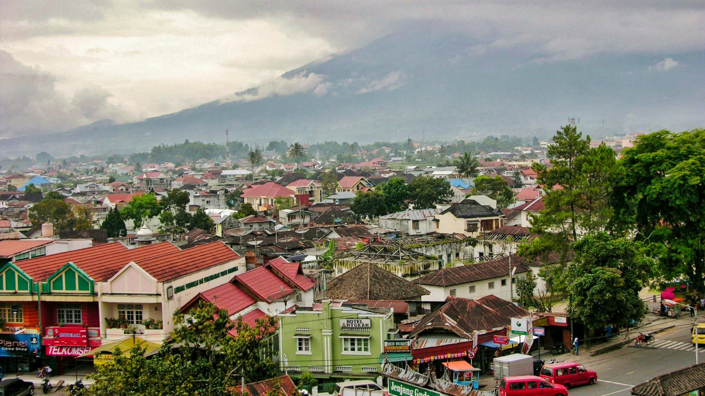
      <em>Bukittinggi</em>
    </figure>

  <figure>
      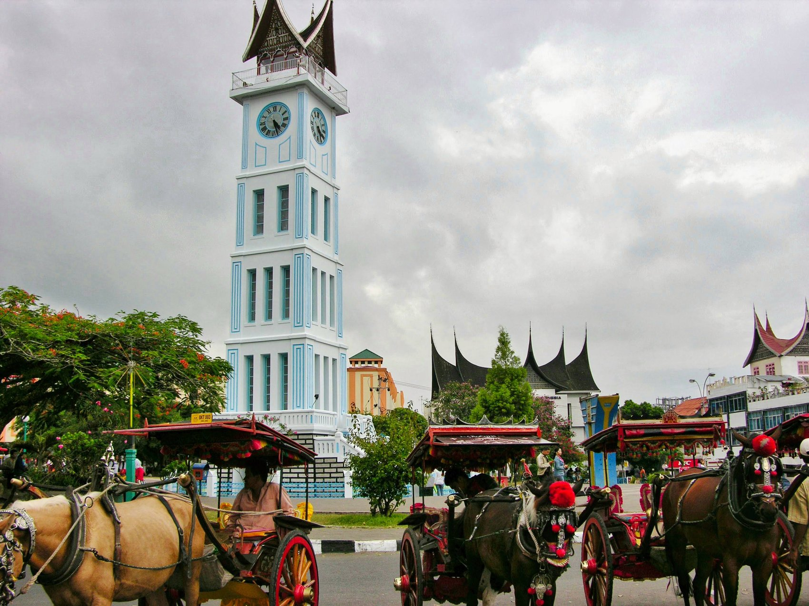
      <em>Bukittinggi</em>
    </figure>

  <figure>
      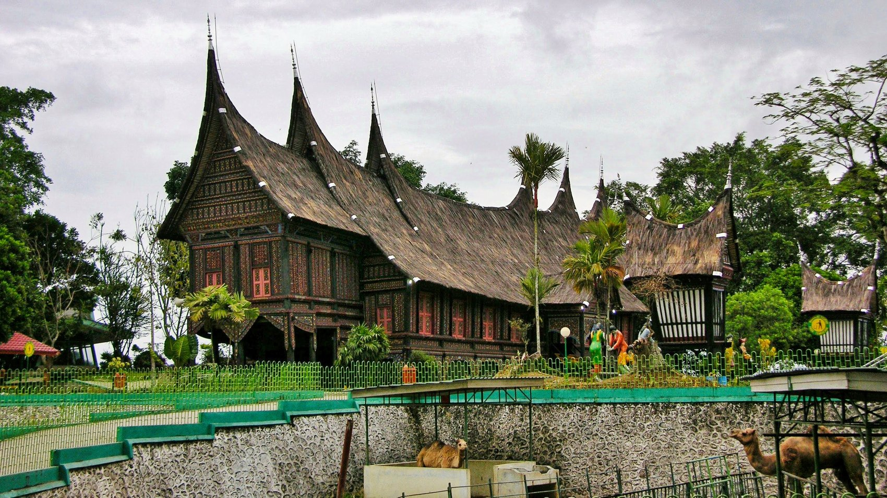
      <em>Bukittinggi</em>
    </figure>

  <figure>
      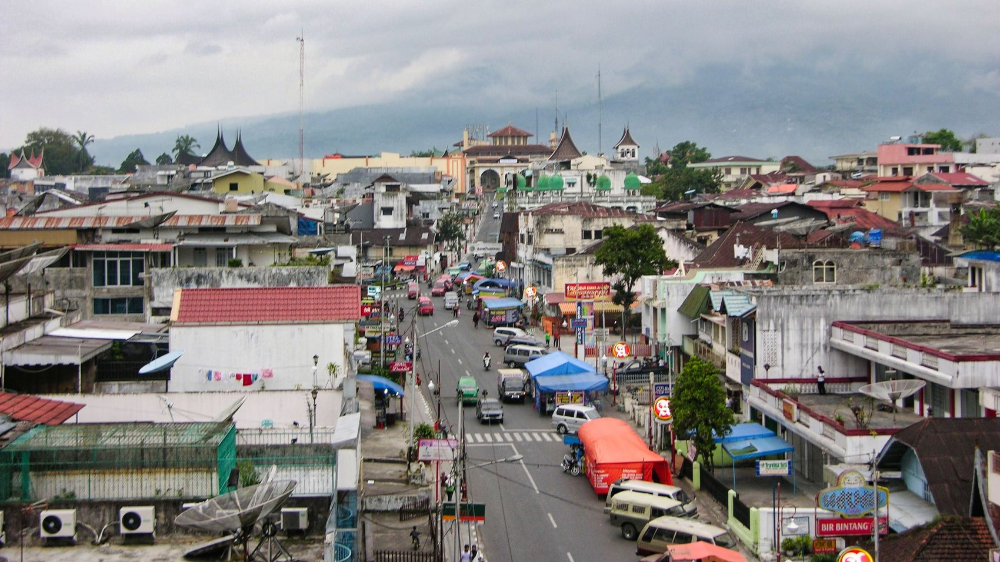
      <em>Bukittinggi</em>
    </figure>

Unfortunately, today’s weather didn’t allow for a great view, but I could still get an idea of how beautifully the city is located. There are plenty of viewpoints in this hilly town. But what I also liked was Bukittinggi itself. It feels like the locals know they live in Sumatra’s nicest and most relaxed town, and that gives the place a positive vibe, enhanced by its pleasant climate and general cleanliness (yes, Bukittinggi actually has public litter bins, something I haven’t seen anywhere else here). There isn’t much to do in the city, but it’s enjoyable just to stroll through the streets and take in the occasional breathtaking views. Surprisingly, Bukittinggi offers diverse shopping options and several internet cafés, a rare find in rural Sumatra. Tourism, however, is nearly dead. The city’s infrastructure, with numerous hotels and even a few classic traveller cafés, suggests that Bukittinggi was once a popular backpacker destination, but those days are long gone. Today, for the first time since Lake Toba, I did see some Western tourists, but there were no more than a handful. With the local New Year’s holiday over, accommodations were widely available, and I probably could have bargained the price down. However, I really feel sorry for the hoteliers, café owners, and guides struggling with the lack of tourists, so I’m always willing to pay a fair price. I stayed at the Khartini Hotel, which seemed to be the best budget option, featuring a lovingly decorated, well-maintained lobby. My room was worth every bit of the 100,000 Rp: a very clean space with a large bed, hot shower, Western toilet, and a private veranda with a view. The only downside was the mosque across the street, but the calls to prayer echo throughout the city centre anyway, so setting an alarm wasn’t necessary. Since nightlife here is virtually nonexistent, waking up with the muezzin isn’t the worst thing.

## Day 11 – 8.1 – 56 km

Bukittinggi – Maninjau

I had originally planned today as a 'post-TSH' rest day, but the 40 km to Lake Maninjau were tougher than expected. Exiting Bukittinggi, I followed the main road towards Padang for about 5 km before turning right onto the strangely unmarked road to Maninjau. The route began with gentle hills but soon transformed into steep switchbacks leading up a mountain pass. After the summit, a shorter descent provided stunning views of the picturesque highlands of West Sumatra.

  <figure>
      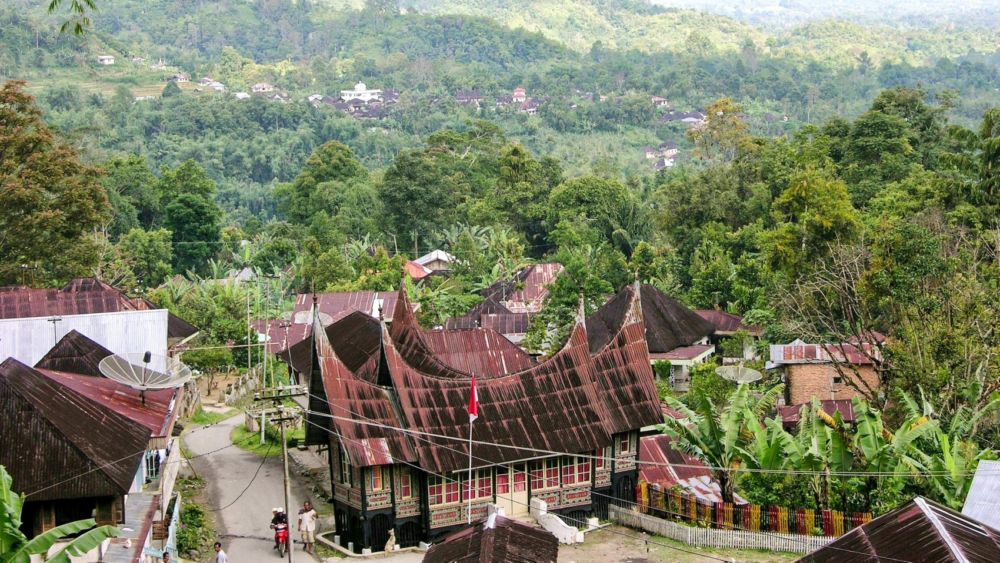
      <em>Around Bukittinggi</em>
    </figure>

  <figure>
      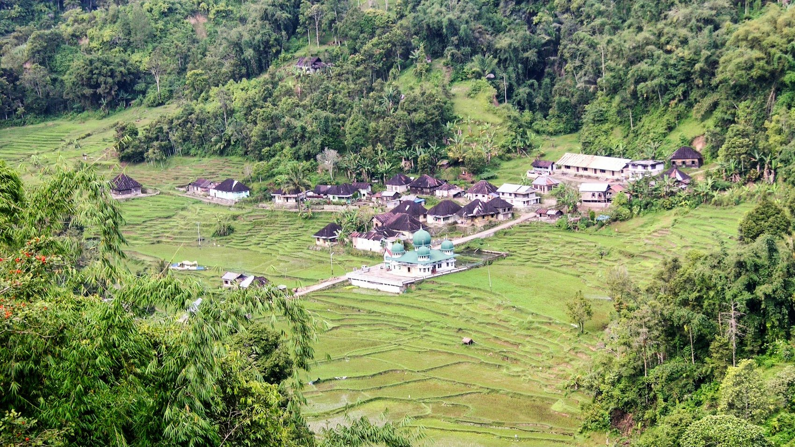
      <em>Around Bukittinggi</em>
    </figure>

<figure>
  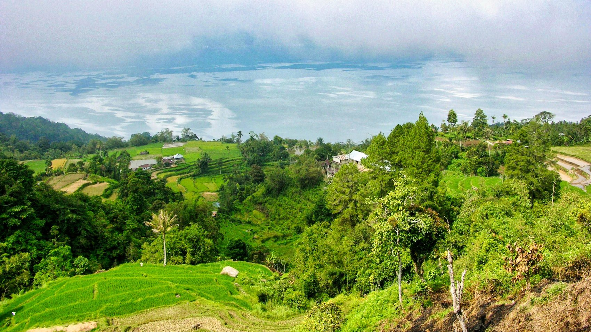
  <em>Around Bukittinggi</em>
</figure>

Reaching the valley floor, the road became hilly again, mostly climbing, up to 1,100 metres at the edge of the mountain range encircling Lake Maninjau. What followed was a dramatic 10 km descent with 44 numbered hairpin turns, winding through breathtaking rice terraces down to the lakeshore, 600 metres below. The views of the lake were spectacular, but the road was overrun with hundreds of monkeys, making me hesitant to stop and take pictures; those creatures can be quite aggressive.

  <figure>
      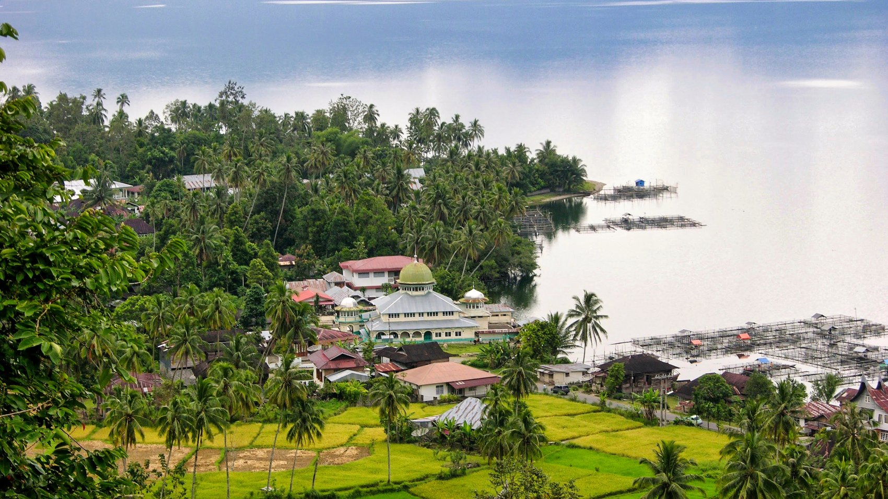
      <em>Lake Maninjau</em>
    </figure>

  <figure>
      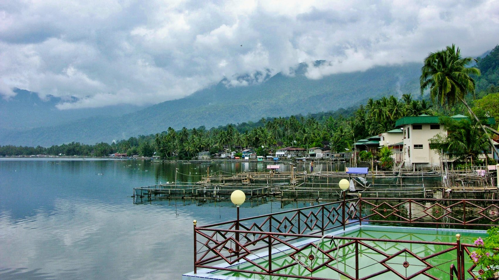
      <em>Lake Maninjau</em>
    </figure>

<figure>
  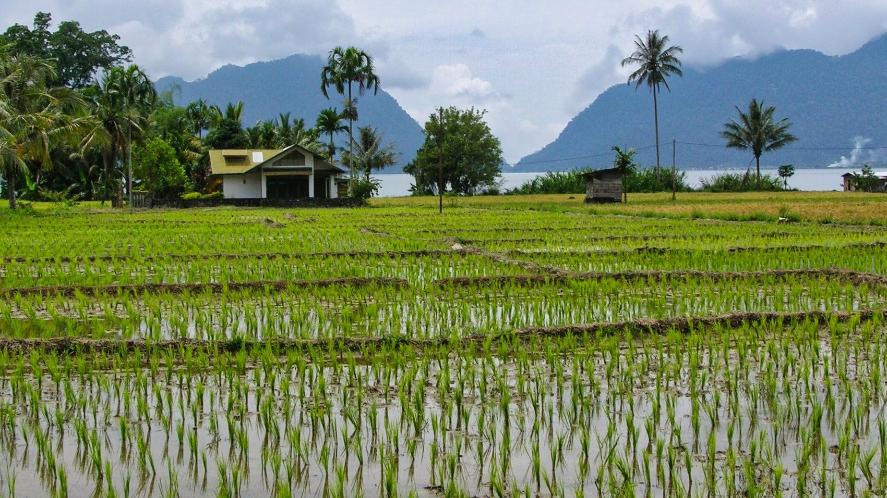
  <em>Lake Maninjau</em>
</figure>

With its picture-book landscape and mild climate, Lake Maninjau would undoubtedly be an overrun tourist hotspot anywhere else in Southeast Asia. But like much of Sumatra, tourism here is practically nonexistent. In the village of Maninjau, I found a few traveller cafés, but when I wanted to grab a drink, they were completely deserted. The two bungalow resorts I checked out in Bayur, the 'main tourist hub' a few kilometres north, were both entirely empty. Even after cycling around the area a bit, I didn’t see a single other tourist today. And yet, this place is stunning; you can swim in the lake, and the infrastructure for visitors is in place. Between Maninjau and Bayur, there’s even a stylish restaurant, the Waterfront Zalino, offering a fantastic lake view, a pool, and a lawn for sunbathing.

<figure>
  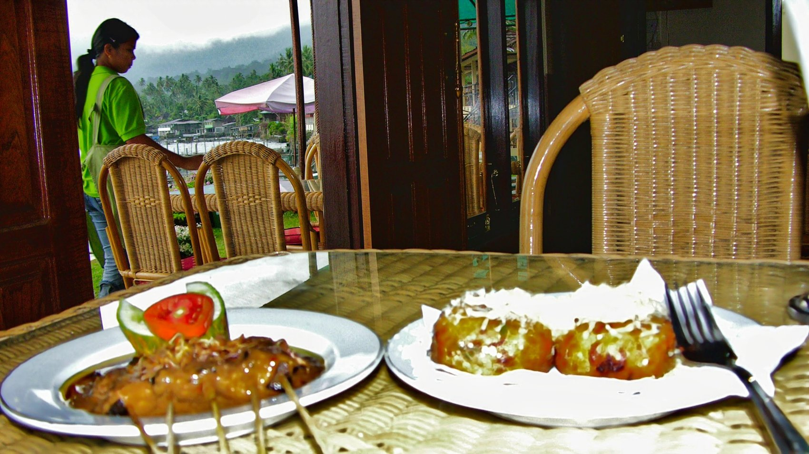
  <em>Lake Maninjau - Waterfront Zalino</em>
</figure>

I had an excellent dinner here, not just the usual fare, but delicious venison satay with Indonesian-style roasted potatoes. The Bayur bungalows are only accessible via narrow footpaths through the rice fields, a few hundred metres off the main road. But once you reach the lakefront, it’s pure tranquility. I stayed at the Beach Inn, run by friendly, unobtrusive locals. Each pair of rooms shares a bathroom with a shower and a Western toilet, not an issue when you’re the only guest. The large, comfortable bed alone was worth the 40,000 Rp.

## Day 12 – 9.1

I took a proper rest day today, spending most of it reading at the resort. The only activity I allowed myself was a swim in the lake. The weather wasn’t great anyway. In the evening, I had a small meal at the resort café and even had some company. The place was experiencing a real tourist boom, counting me, there were four of us.

## Day 13 – 10.1 – 152 km

Maninjau – Lubuk Basung – Tiku – Pariaman – Padang

It was a beautiful sunny day, and the views of the lake were once again breathtaking.

  <figure>
      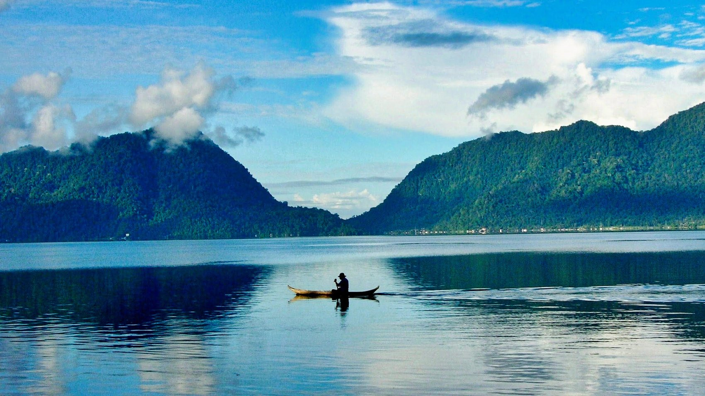
      <em>Lake Maninjau</em>
    </figure>

  <figure>
      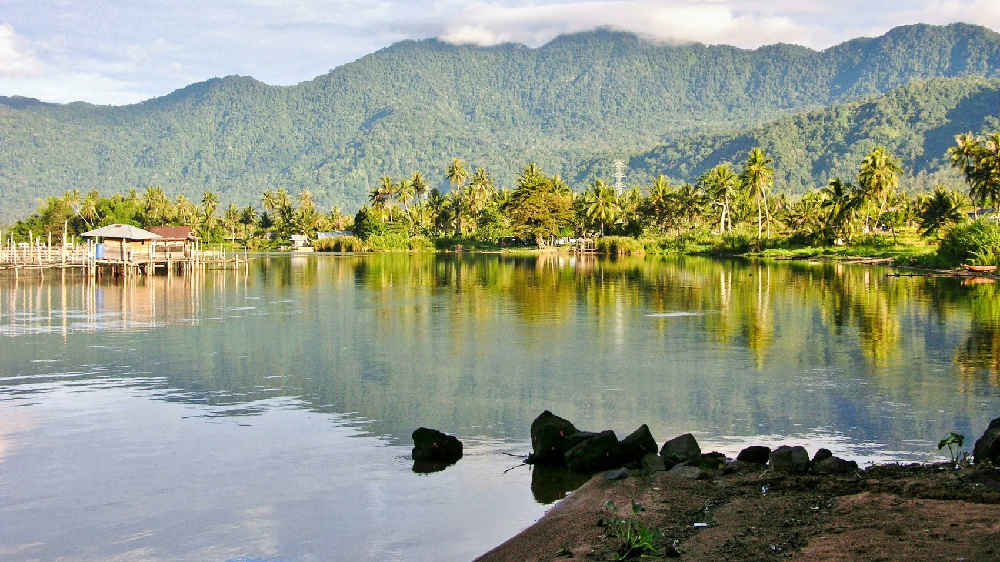
      <em>Lake Maninjau</em>
    </figure>

I cycled the 10 km around the northern shore before turning right towards the coast. A 15 km descent followed through a scenic valley, reaching the coastal plain at Lubuk Basung. The first 40 km between Tiku and Pariaman ran close to the sea, offering occasional glimpses of the sparkling blue Indian Ocean, though the grey beaches weren’t particularly inviting. The rest of the route to Padang stayed further inland, but the road remained flat, and its surface was much better than the Trans-Sumatra Highway. However, traffic increased significantly approaching Padang. West Sumatra’s capital, the island’s third-largest city, appears hectic, unattractive, and faceless at first glance. But upon closer exploration, it has its charms. Padang is a friendly, swelteringly hot tropical port city with a long, coconut palm-lined beach promenade, perfect for evening strolls and sunset watching.

  <figure>
      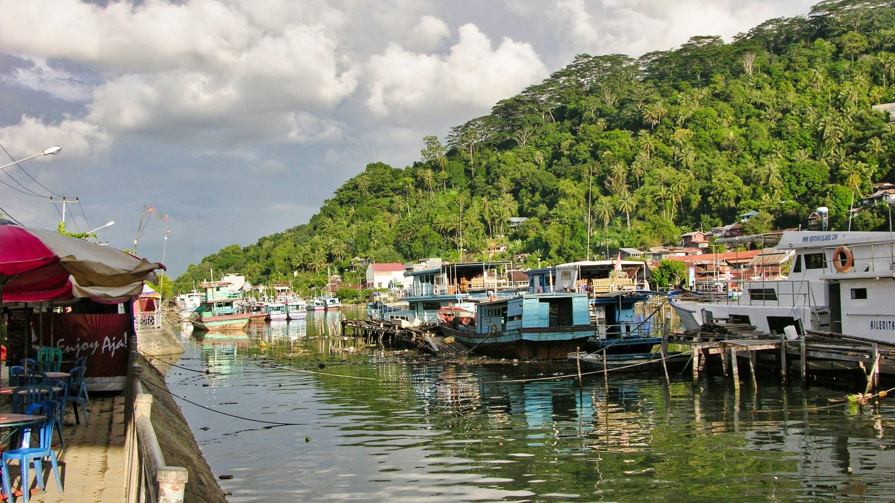
      <em>Padang</em>
    </figure>

  <figure>
      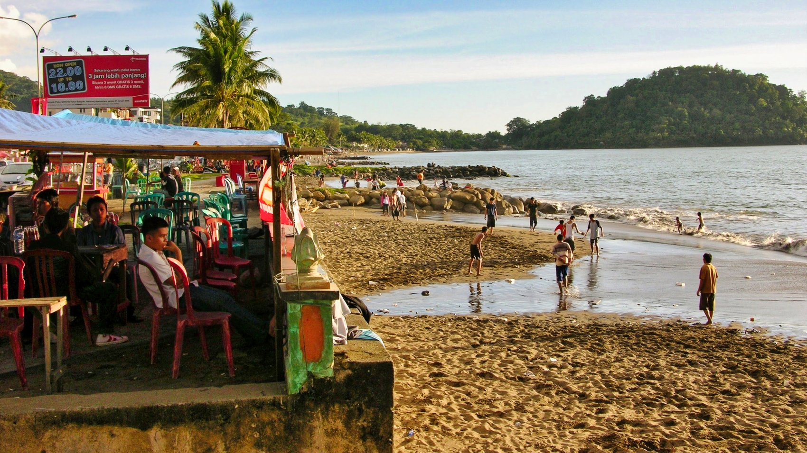
      <em>Padang</em>
    </figure>

<figure>
  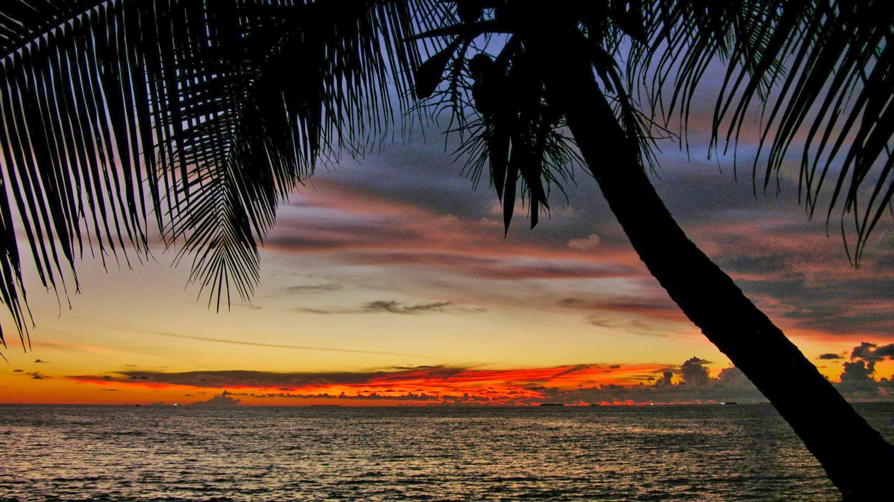
  <em>Padang</em>
</figure>

There's also an old quarter by the picturesque river south of the chaotic, architecturally uninspiring centre, though it’s quite run-down. Padang is best known for its cuisine, particularly the rich beef or buffalo coconut curry, Rendang, and the creamy chicken curry, Kalio Ayam. Even more famous than the dishes themselves is the unique way meals are served in Padang restaurants. There’s no menu (convenient for non-Indonesian speakers); instead, multiple dishes are brought to the table, and you simply eat what you want, paying only for what you consume. Accompanying every meal are rice, water spinach, and chili sauce, though the latter is hardly necessary, as Padang cuisine is already quite spicy. Even though this style of eating isn’t ideal when you’re on your own, and I’d already had Padang food several times on the trip, I couldn’t very well be in Padang without trying one of the city’s best-known places, Simpang Raya. It held no surprises, and I’ve definitely eaten better, but at 7,000 Rp a plate it did the job. In general, though, even if there are a few truly delicious dishes, I’m not a huge fan of Padang food. Padang is far from being a tourist city, despite having an international airport, so accommodation is mostly aimed at locals, either very cheap and terrible or quite expensive and decent. I found a reasonable option at Immanuel Hotel, where a large but somewhat neglected double room with a shower, Western toilet, and the unnecessary luxury of air conditioning cost 120,000 Rp after a discount. Anyone with a soft spot for pink beds and dried-flower bouquets will be in their element here. After over 1,000 km, I had my first flat tire today; fortunately, I was already in Padang. Finding a new 28-inch tube here seems difficult, but plenty of old-school repairmen, using fire pits and vices, can patch one up for 5,000 Rp.

## Day 14 – 11 January – 135 km

Padang – Painan – Kambang

The coastal landscape south of Padang is stunning, mountainous and rugged.

  <figure>
      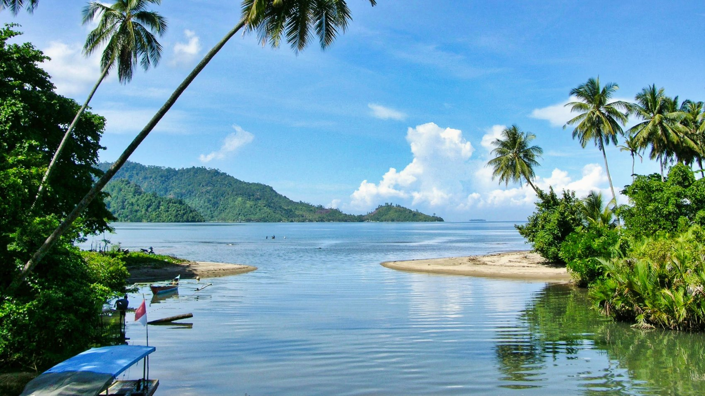
      <em>Padang-Bengkulu Coastal Road</em>
    </figure>

  <figure>
      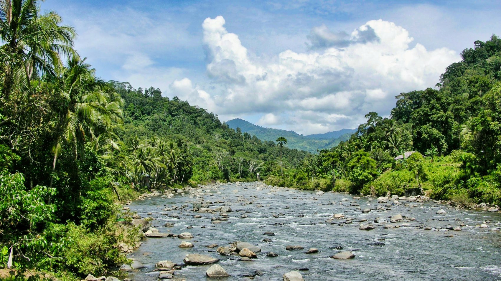
      <em>Padang-Bengkulu Coastal Road</em>
    </figure>

Leaving the city, the first 10 km were flat, passing between the hills before encountering the first cape to cross. After passing the beach resort of Bungus, the road led into the mountains, with a long, steep ascent followed by a descent through an inland valley. After the descent, it was another 15 km of hilly terrain back to the coast. From this point on, the road mostly followed the coastline (sometimes flat, sometimes featuring short but steep climbs over rocky outcrops) until reaching Painan after 80 km. Painan is a well-maintained town set in a spectacular coastal landscape, with offshore islands and towering, jungle-covered mountains in the background. The only downside is that the beaches in this region are not very appealing, as the sand is mostly brown or grey. Beyond Painan, there was another long, steep climb followed by a very steep descent back to the coast. The final 40 km were mostly flat, except for occasional small inclines, through a densely populated area where a bicycle tourist is an absolute sensation. Most cyclists seem to stick to the Trans-Sumatra Highway, but this route is also quite scenic and entirely off the beaten tourist track. The road quality varied greatly, with some smooth sections and others that were terribly bumpy. After 100 km, there was a wonderfully inviting beach resort for an overnight stay, but unfortunately, it was closed. Other than that, there were no accommodation options after Painan until reaching Kambang, where I found a single rundown guesthouse behind the market, something I never would have found without help.

<figure>
  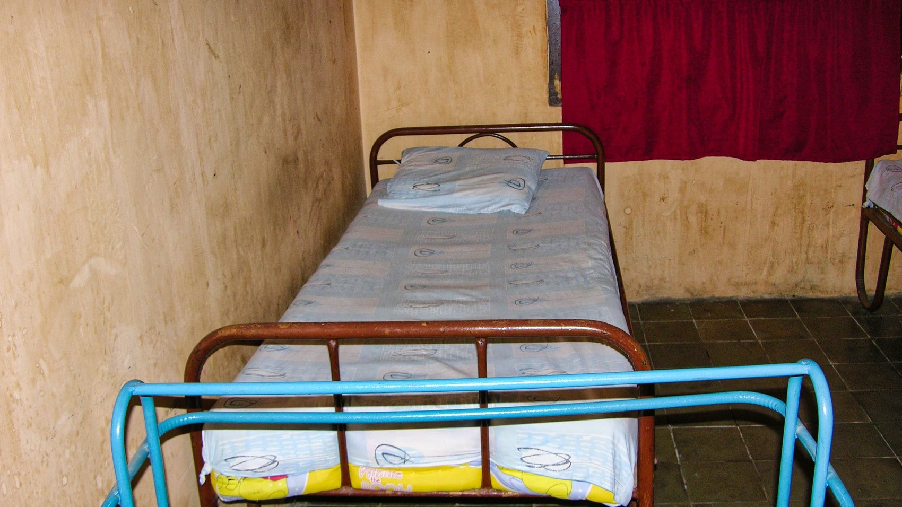
  <em>Kambang</em>
</figure>

No one stays here willingly. The small, stuffy rooms without a fan (and even worse, without mosquito nets) were already bad enough, but the shared mandi facilities defied description. Well, that’s just part of travelling off the well-trodden tourist paths. It was a cultural experience, and I am now hardened for the rest of the trip. And of course, it was cheap: 25,000 Rp.

## Day 15 – 12 January – 132 km

Kambang – Tapan – Muko Muko

Today was the day of punctures. I had to patch my inner tube three times because the tire on my rear wheel was slowly falling apart. I have little hope of finding a proper replacement before Jakarta. The route today was completely unspectacular. It followed a poor road through sparsely populated and uninteresting inland terrain. The real appeal of this area lies in the fact that hardly any Western tourists pass through, and almost no one speaks more than two words of English ("Hello Mister"). The first 80 km to Tapan were slightly to moderately hilly, on at least a passable road. Shortly after Tapan, I had my second repair stop. Since it was already 3:30 PM and the next hotel in Muko Muko was nearly 70 km away, I accepted the invitation of a local who spoke some English and let him tow me a few kilometres with his motorcycle to make up for lost time. I could have reached Muko Muko in time, despite the extremely hilly terrain and the abysmal road conditions. Unfortunately, the third puncture put an end to that plan, and I had to stop about 20 km before Muko Muko. The repair took until nightfall, and riding on this road in the dark without lights was simply out of the question. Fortunately, the neighbour of the workshop, a tailor who spoke a few words of English, offered to take me and my bike into town on his motorcycle. I gratefully accepted. In moments like that, you rely on the kindness of strangers. The first hotel I found was a slight upgrade from last night’s stay, meaning the room had a fan, a mosquito coil, and a private but basic mandi. It cost 60,000 Rp. After today’s stressful events, I didn’t care about the accommodation anymore.

## Day 16 – 13 January – 104 km

Muko Muko – Ipuh

This route towards Bengkulu, which looks so appealing on the map, always following the coastline, is an absolute nightmare.

<figure>
  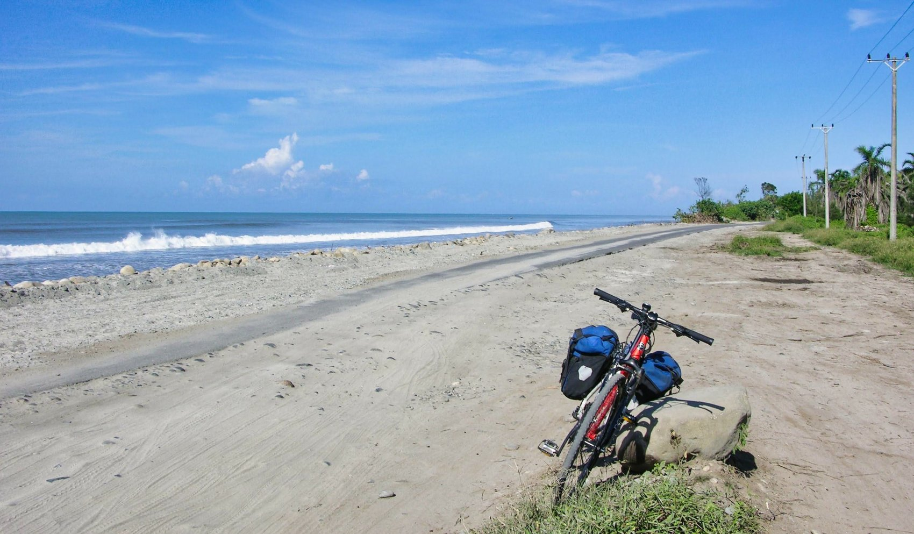
  <em>Padang-Bengkulu Coastal Road</em>
</figure>

The first 10 km led through an unremarkable swampy area, flat along the coast. After that, the winding road constantly rose and fell through nearly shadeless oil palm plantations and barren land, far from the coast. There were no major settlements along the entire route, and it was nearly impossible to find anything cold to drink, as this region only has electricity for part of the day, mostly at night. The sun was relentless all day, with no clouds in sight. Riding this absurdly hilly and monotonous route in 35°C heat without cold drinks was pure masochism. I reached the first larger town, Ipuh, just before nightfall. My accommodation at Dahlia Ipuh was somewhere between last night’s and the night before. There was a private mandi and mosquito nets but no fan, which didn’t promise a restful night in this climate. However, for 50,000 Rp, the room was at least very clean.

## Day 17 – 14 January – 43 km

Ipuh – Bengkulu

Today’s route was just like yesterday’s: ridiculously steep ups and downs through endless oil palm plantations. By 9 AM, it was already so hot that being in the sun was unbearable, and for a solid 25 km, I couldn’t find anything to drink, as the area was completely uninhabited. After 40 km, I had had enough. There was no point in exhausting myself on such a route, where there was nothing to see anyway. So, I hopped onto the next minibus to Bengkulu. The bike was strapped to the roof, and the 130 km journey cost only 25,000 Rp, even though the bus wasn’t even full. I definitely didn’t miss anything. Up to Lais, 40 km before Bengkulu, it was a dreadfully monotonous route. The road, which was already in poor condition, deteriorated so much that despite the reckless driving style of the minibus driver, it still took three hours to cover 90 km. From Lais onwards, the road improved and the landscape became more attractive, but overall, I would say that the trip from Padang southward is only worthwhile if Bengkulu is an incredible tourist attraction, which it isn’t. Otherwise, the effort-to-reward ratio, especially by bike, just isn’t there.

## Day 18 – 15 January – 17 km

Before my flight to Jakarta tomorrow, I used today to rest and take care of some practical matters, such as doing laundry, visiting the hairdresser, and most importantly, giving my bicycle a complete overhaul. Bengkulu was perfect for all of this. I had a huge room with air conditioning and a mandi with a Western toilet in a wonderfully dilapidated old colonial villa for 75,000 Rp. The owner of Wisma Balai Buntar is so old that she still speaks Dutch. This accommodation was a perfect fit for Bengkulu, a remote outpost far away from all the well-trodden tourist paths. For its size, the city is astonishingly sleepy. The old quarter consists of rundown Dutch wooden villas under coconut palms, an old British fort stands on a hill above the coast, and a kilometre-long, empty, moderately attractive sandy beach stretches along the shoreline.

  <figure>
      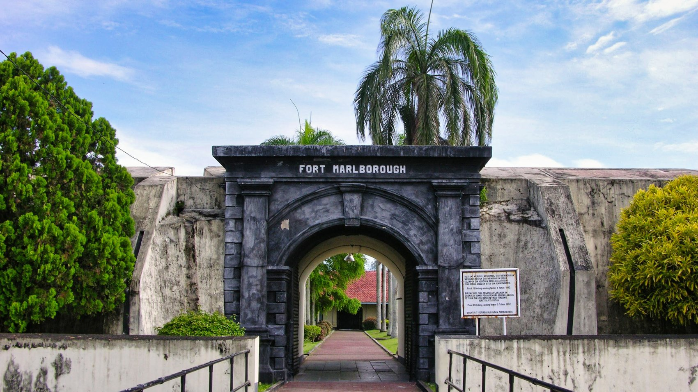
      <em>Bengkulu</em>
    </figure>

  <figure>
      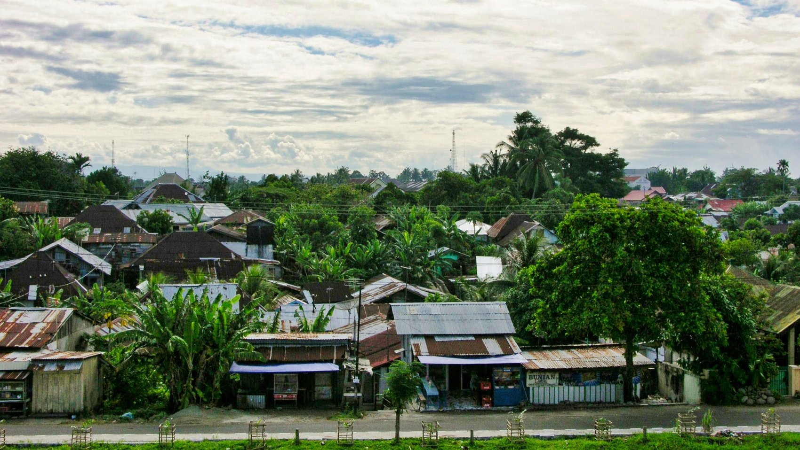
      <em>Bengkulu</em>
    </figure>

Since Fort Marlborough is the only 'sight' in town, one can assume, based on the guestbook there, that the last Western tourist visited the city two weeks ago. This, of course, means that I became something of an attraction myself, which had never happened to me before in a city of this size. However, the people were all very friendly, and my breakfast, Nasi Ayam, was kindly paid for by the man who cleaned my bicycle, who also charged less for the washing than the meal itself cost at the stall. In the busier new part of town, I found a bike shop that completely overhauled my bicycle, which had been heavily worn by the local roads, a process that took several hours. A haircut with washing at a proper salon cost only 20,000 Rp, and all of this was accomplished with my rather rudimentary Indonesian, as almost no one here speaks English. It always amuses me to discover an unexpectedly exquisite dining gem in such a remote Third World location like Bengkulu. One such place was 'de Palma Café and Lounge'; the name alone was intriguing. It looked as if a local had once visited Jakarta and decided to bring the concept of stylish, minimalist urban-chic lounge cafés to Bengkulu. Surprisingly, there was no clientele for this extravagance, and so 'de Palma' only had one dish left on its menu. However, that dish was excellent and incredibly cheap. There are probably very few places in the world where you can get a tender, sizzling hotplate-grilled beef steak with pepper sauce, crisp vegetables, and delicious homemade fries for just over €1.

## Day 19 – 16 January – 96 km

Bengkulu – Jakarta Airport – Tangerang – Serpong – Bogor

Bengkulu's airport is 14 km south of the city and was easily reachable by bicycle in 45 minutes. I had bought my ticket to Jakarta less than a week ago in Padang, but even with relatively short notice, domestic flights in Indonesia are very cheap due to the numerous budget airlines. The 50-minute flight to Jakarta with Lion Air cost 329,000 Rp, and my bicycle was transported without any hassle and free of charge. Everything went smoothly; the plane was on time, fairly new, and made a good impression, quite different from the horror stories often heard about Indonesian airlines. The only annoyance, as always in Asia, was that the air was let out of the tires. Since I didn't have a pump with me, I had to walk 20 minutes from domestic Terminal 3 towards Terminal 1, where I luckily found a roadside workshop that reinflated the tires. All in all, I was only able to start my journey at around 1:30 PM. The first 20 km to Tangerang were discouraging; the road was terrible, narrow, bumpy, and the traffic was hellish. This entire area is part of Jakarta’s urban sprawl, a chaotic mixture of corrugated metal slums and modern, chic ‘Super City Suburbs,’ an extreme contrast between ostentatious wealth and desperate poverty. Serpong, the next satellite city on the road to Bogor, is the complete opposite of Tangerang. It has enormous malls, hypermarkets, Carrefours, and a brand-new eight-lane superhighway. Beyond Serpong, the landscape became more rural again. The last 40 km to Bogor consisted of a narrow, bumpy, and busy two-lane road passing through mostly quiet villages. The entire route was either flat or gently hilly, and the 300-metre altitude gain to Bogor was hardly noticeable. The only reason for detouring to Bogor was Taman Raya, the city’s world-famous botanical gardens.

  <figure>
      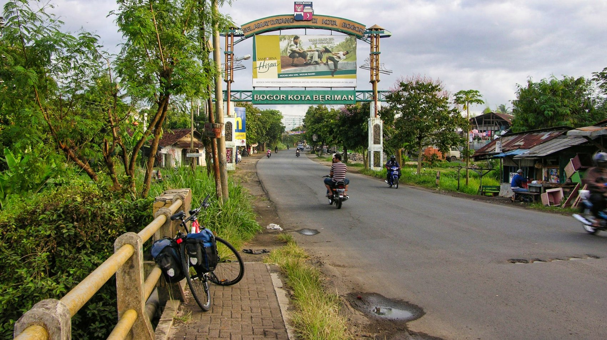
      <em>Bogor</em>
    </figure>

  <figure>
      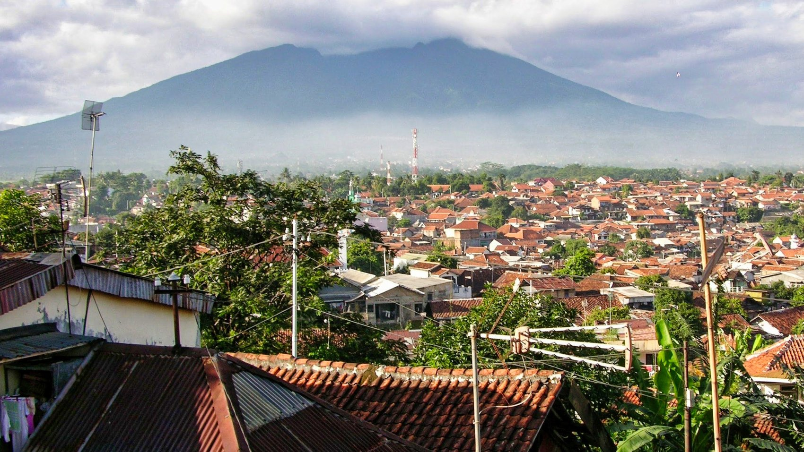
      <em>Bogor</em>
    </figure>

  <figure>
      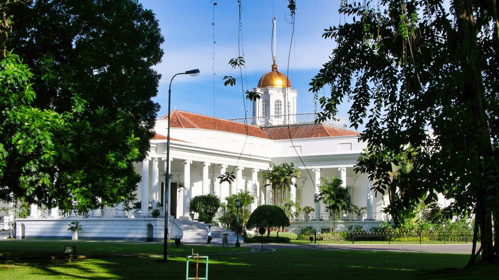
      <em>Bogor</em>
    </figure>

  <figure>
      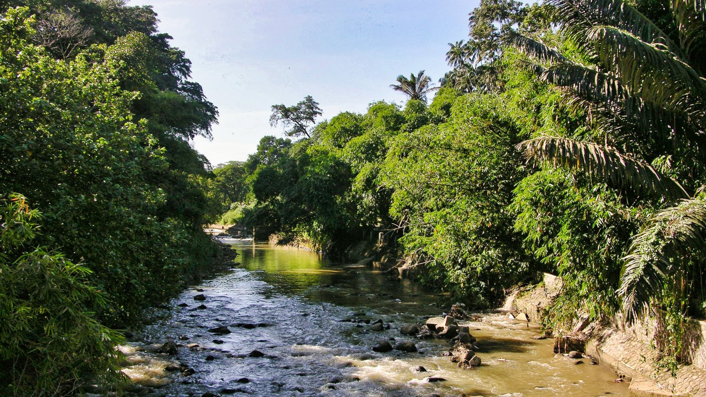
      <em>Bogor</em>
    </figure>

However, what I saw of Bogor before sunset was not flattering. It is anything but a peaceful retreat from Jakarta; rather, it is a hectic city with awful roads and heavy traffic. As it was already getting dark when I reached the centre, I chose my accommodation based on its proximity to my planned dinner spot. That’s how I ended up at Firman Guesthouse, a classic, family-run traveller’s losmen (though without travellers), with small, spartan, but acceptable rooms for 70,000 Rp, each with its own mandi. The best part of the place was its communal terrace with sofas and a valley view. To reach the rooms, one had to walk through the family’s living room every time. As mentioned, my reason for staying here was the Gumati, a magnificent, very stylish terrace café just a few houses away.

<figure>
  
  <em>Bogor - Gumati</em>
</figure>

<figure>
  
  <em>Bogor - Ali Baba</em>
</figure>

In a lovely setting, one could sit in wicker chairs by candlelight, enjoy the cool breeze, and look down at the lights in the valley, a refreshing change after weeks in Sumatra. The food wasn’t particularly expensive, either. I had Lumpia (spring rolls) and Empe Empe (fish cakes in a spicy vinegar-soy sauce), each costing around 15,000 Rp. Additionally, I enjoyed a Juice Alpokat (avocado shake), one of Indonesia’s greatest culinary inventions. The food was decent, but the main attraction was undoubtedly the ambiance.

## 21 January 2008
Jakarta is not a classic tourist destination. It is a sprawling metropolis with no clear centre, no city planning, and few major sights. Yet, I stayed here for almost a week and had an amazing time. Jakarta’s traveller district is Jalan Jaksa, home to cheap, old-school guesthouses, traveller cafés, and bars. However, since Jakarta is not a tourist city, backpackers make up only a small portion of the clientele. The rest consists of bar girls, ladyboys, pedophiles, sex tourists, African drug dealers, homosexuals… but also Jakarta’s ‘rich kids’ and expats, who appreciate Jaksa because here, everyone can openly indulge their desires. It is a hedonistic ‘anything-goes’ place where the underworld, naïve tourists, and Westernized locals turn night into day. I found this mix fascinating and made numerous unusual but interesting acquaintances. It was a wild time that I wouldn’t want to miss. I also really liked Jakarta as a city. One could say that Jakarta is like Bangkok without the sights. However, even without its canals, temples, and palaces, Bangkok would still be an exciting, vibrant city, and so is Jakarta. The extreme contrasts between rich and poor, the elegant villa districts and the desperate slums, the insane traffic, and the pollution can be overwhelming, but Jakarta offers an incredible array of sensory experiences: restaurants with cuisines from all over the world, fragrant street food stalls, massive shopping malls, and noisy bajajs. It is never boring here. The only touristy thing I did in Jakarta was visit the observation deck of the National Monument (Monas), which offered a panoramic view of this enormous city.

  <figure>
      
      <em>Jakarta</em>
    </figure>

  <figure>
      
      <em>Jakarta</em>
    </figure>

Eating out in Jakarta is predictably more expensive than in the rest of the country, but by Western standards, it is still very affordable. The best traveller food by far on Jl Jaksa was found at Ya Udah, the ideal place for breakfast with delicious fruit juices and focaccia sandwiches at fair prices. A memorable experience was dinner at Lara Djonggran, an ultra-chic lounge designed like a temple, featuring cushion seating, air-conditioning, and a sinfully expensive wine list. The food, a selection of classic Indonesian dishes from all corners of the archipelago, was quite affordable and good, though it could not quite match the extraordinary ambiance. The Balinese mushroom pepes (38,000 Rp) and the spicy Makassar tuna curry (48,000 Rp) came in huge portions and were beautifully presented. Good, almost authentic, and inexpensive Lebanese food such as hummus, tabbouleh, arayes, and falafel (each around 20,000 Rp) was available at Ali Baba on Jl H. Ayur Salim. I spent my nights at Memories Café, the liveliest of Jaksa's pubs. Here, there was extremely mixed-quality live music every night, but the Bintang beer was cheap, and the atmosphere was great. A simple but relatively clean room for the area, with its own mandi, cost 50,000 Rp.

## Bali – 23 January – 6 February 2008

  <figure>
      
      <em>Kuta</em>
    </figure>

  <figure>
      
      <em>Kuta</em>
    </figure>

<figure>
  
  <em>Uluwatu</em>
</figure>

<figure>
  
  <em>Candi Tebing Gunung Kawi</em>
</figure>

<figure>
  
  <em>Tegallalang Rice Terrace</em>
</figure>

  <figure>
      
      <em>Ubud - Café Lotus</em>
    </figure>

  <figure>
      
      <em>Ubud - Café Lotus</em>
    </figure>

  <figure>
      
      <em>Batur Area</em>
    </figure>

  <figure>
      
      <em>Batur Area</em>
    </figure>

<figure>
  
  <em>Ubud</em>
</figure>

<figure>
  
  <em>Tirta Gangga</em>
</figure>

<figure>
  
  <em>Amed</em>
</figure>

<figure>
  
  <em>Ubud - Warsi Bungalow</em>
</figure>

  <figure>
      
      <em>Danau Bratan Area</em>
    </figure>

  <figure>
      
      <em>Danau Bratan Area</em>
    </figure>

## 7 February 2008

After two wonderful weeks in Bali, during which I explored the entire island by motorbike, I arrived in Yogyakarta early at 8:30 AM and rode the roughly 10 km from the airport to the city centre. Since I had plenty of time, I checked out various losmen in Yogya’s traveller hub, Sosrowijayan, but quickly decided on Bladok. The rooms here were slightly more expensive than other budget accommodations, but Bladok is impeccably maintained, has a small pool, and generally offers a great atmosphere. My single room for 77,000 Rp was small but super clean and even quite stylish, featuring a beautiful Indonesian mandi. The attached restaurant served very decent but slightly overpriced, mostly Western dishes. I spent the rest of the day exploring Yogya, Indonesia’s most touristy city and certainly one of its most attractive.

  <figure>
      
      <em>Yogyakarta</em>
    </figure>

  <figure>
      
      <em>Yogyakarta</em>
    </figure>

  <figure>
      
      <em>Yogyakarta</em>
    </figure>

  <figure>
      
      <em>Yogyakarta</em>
    </figure>

At its centre lies a walled old town that, even in the 21st century and despite tourism, still feels very traditional, village-like, and authentic. Wandering through the narrow alleys of this charming kampung is a wonderful way to spend a few hours, provided you wear sunglasses and earphones. Unfortunately, this positive impression of the city is significantly dampened by the sheer number of hustlers, touts, and scammers, more than in any other place I have visited outside of India. The becak drivers still earn my sympathy; it is a tough job, and the oversupply of pedicabs has reached almost grotesque proportions. Worse, however, are the batik sellers and touts who constantly harass you. This is a real shame because, otherwise, Yogya would be a very relaxed and attractive city by Indonesian standards. Yogya’s biggest tourist attraction, the Sultan’s Palace in the heart of the old town, is rather disappointing. Neither the architecture nor the exhibits in the rooms, in my opinion, justify the entrance fee. On the other hand, at least here you are not harassed by touts, which is, of course, a plus. Back in Sosrowijayan, I grabbed a bite at Bedhot Resto. Of all the traveller cafes in the area, this one is the most beautifully decorated, and the beef satay was also very tasty.

## 8 February 2008

After a wonderful morning dip in the hotel pool, I spent the entire morning in Yogyakarta. This time, I decided to explore by bicycle, despite the traffic, the most pleasant way to get around the city since you are left alone while riding. Around 1 PM, I set off for Borobudur, about 40 km northwest of Yogya. The first 30 km, often slightly uphill, on the four-lane main road towards Semarang were rather boring to ride, with only occasional beautiful views of the 3,000-metre-high volcano, Gunung Merapi. The last 10 km on a quiet road to Borobudur led through beautiful landscapes, with rice fields lining the route. The entire Borobudur region is scenic, featuring vibrant rice paddies, coconut palms, and lush green hills in the background.

<figure>
  
  <em>Borobodur</em>
</figure>

I arrived just in time to check into my room at Lotus 2 Guesthouse before the heavy afternoon rain began.

<figure>
  
  <em>Borobodur - Lotus 2 GH</em>
</figure>

The guesthouse is only 500 metres from the temple entrance and has just two rooms, both huge and simply but stylishly furnished, featuring large four-poster beds with mosquito nets, a TV, a terrace overlooking the rice fields, and a gigantic warm-water mandi. The room would have easily been worth its 120,000 Rp price if the water supply had functioned better.

## 9 February 2008

I forced myself out of bed before sunrise to admire the Borobudur temple before the major tourist crowds arrived. The complex opens at 6 AM, and there were already about a dozen visitors at that time, mostly locals. Unfortunately, I had chosen a bad day to visit Java’s biggest tourist attraction. The weather was poor, which somewhat dulled the otherwise breathtaking views, and due to the weekend and the Chinese New Year holiday, the place was absolutely packed by 8 AM. Western tour groups are rarely a reason to avoid a site in Indonesia anymore; it is the domestic tourists who noisily roam their own country and can ruin the atmosphere of a venerable temple just as much as their European counterparts. That being said, Borobudur is a magnificent temple, richly decorated and dramatically perched on a hill amidst stunning landscapes.

  <figure>
      
      <em>Borobodur</em>
    </figure>

  <figure>
      
      <em>Borobodur</em>
    </figure>

<figure>
  
  <em>Borobodur</em>
</figure>

On clear days, it even offers views of the volcanoes to the east. Some travel guides mention Borobudur, Bagan, and Angkor in the same breath. While it is true that these are the most spectacular ancient temple complexes in Southeast Asia, the comparison, especially with Angkor, is rather flawed. However, I already knew this beforehand and was therefore not unnecessarily disappointed by overly high expectations. Borobudur is merely a single, isolated temple that, much like the Bayon in Angkor, has the aesthetic issue of not looking particularly spectacular from a distance. Its fascination only reveals itself upon closer inspection of its countless reliefs, Buddha statues, and stupas. Borobudur is certainly worth a visit, but unlike Angkor, it is not a place one must see before they die. On the way back to Yogyakarta, I took a different route than yesterday, a significantly hillier but far more beautiful road along narrow, well-paved country roads through the villages of Klangon and Seyegan. The journey passed through an attractive landscape of rivers and rice fields, even featuring rice terraces of almost Balinese beauty.

## 12 February 2008 – Prambanan & Solo

I spent another two days in Yogya before continuing my journey by bike to Solo, the second cultural capital of Central Java (and Indonesia). However, compared to Yogyakarta, Solo is more second-tier when it comes to tourism. Between these two cities lies Prambanan, Java’s (and Indonesia’s) second most important ancient temple complex. Unlike the (Buddhist) Borobudur, Prambanan (which is Hindu) features multiple temples (some well-preserved, others in ruins) which would make it, in theory, even more visually appealing than Borobudur. I say 'in theory' because Prambanan was heavily damaged by the severe earthquake in mid-2006, and restoration work is still ongoing. Unfortunately, this meant that the main temples could only be viewed from a distance, surrounded by scaffolding, which made the visit feel somewhat pointless.

  <figure>
      
      <em>Prambanan</em>
    </figure>

  <figure>
      
      <em>Prambanan</em>
    </figure>

However, once the temples are fully restored and accessible again, Prambanan will undoubtedly be a fascinating site and an outstanding attraction. I really liked Solo and stayed there for several days.

<figure>
  
  <em>Solo - O Solo Mio</em>
</figure>

  <figure>
      
      <em>Solo</em>
    </figure>

  <figure>
      
      <em>Solo</em>
    </figure>

Similar to Yogya, Solo also has an old town with a Kraton (sultan’s palace). While it may not be as picturesque as its rival, Solo is the more pleasant and friendlier of the two cities. There are no touts, no tourist district, and no aggressive batik sellers, making it an ideal place to experience authentic Javanese city life undisturbed and attend cultural events.

## 15 February 2008 – Malang

From Solo, I took a train to Malang, a fairly pleasant city with some remaining colonial buildings and a mild climate.

<figure>
  
  <em>Malang</em>
</figure>

<figure>
  
  <em>Malang - Toko Oen</em>
</figure>

Most travellers come here to organize tours to the famous Mt. Bromo. The mountainous surroundings of the city are said to be beautiful, but I couldn't verify this because I couldn’t find a rental motorbike anywhere in town. Since the weather wasn’t good for a Bromo tour, I decided to continue to Surabaya, but not before having dinner at Malang’s most extravagant restaurant, L’Amour Fou. This rather chic place serves decent Western dishes at affordable prices, offers wine and beer, and has a bold, love-themed interior that one wouldn’t expect in a Muslim country, especially not in the provinces. Discovering and experiencing such curiosities is one of the things that makes travelling so exciting.

## 16 February 2008 – Surabaya

From Malang, I cycled to Surabaya, spending the night in a grand old colonial hotel in a small, otherwise completely unremarkable town. The hotel seemed entirely out of place here. The very spacious rooms, with king-size beds and bathtubs, weren’t luxurious but had a lot of character, and at 175,000 Rp, they were very affordable.

<figure>
  
  <em>Wonosari</em>
</figure>

<figure>
  
  <em>Lawang - Hotel Niagara</em>
</figure>

Still, I wonder how this hotel survives; there can’t be many tourists passing through. Surabaya, Indonesia’s second-largest city, holds the dubious honour of being one of the world’s least-known five-million-person metropolises. Most people outside Indonesia have never heard of it, and even if they have, few could say where it is or how big it is. Even most travellers in Java skip Surabaya on their way to Bali. Honestly, I don’t quite understand why. While Surabaya may not have any major sights, the city is a perfect and, in general, quite attractive place to experience all facets of 21st-century Java in an authentic, completely untouristic setting. Surabaya clearly has many wealthy residents; it boasts grand villa districts, ultra-modern malls, and trendy bistros. You can go to the movies or lounge on a couch in a stylish café. The cost of living here is significantly lower than in Jakarta, and you can enjoy a good life for very little money. But Surabaya also has another side, a very traditional one. The rundown old town north of the centre, with its crumbling colonial buildings, foul-smelling canals, old craft shops, ancient temples, and mosques, where countless rickshaws clog the narrow streets, is a fascinating place for a walk and a world of its own.

  <figure>
      
      <em>Surabaya</em>
    </figure>

  <figure>
      
      <em>Surabaya</em>
    </figure>

  <figure>
      
      <em>Surabaya</em>
    </figure>

  <figure>
      
      <em>Surabaya</em>
    </figure>

  <figure>
      
      <em>Surabaya</em>
    </figure>

  <figure>
      
      <em>Surabaya</em>
    </figure>

Since the weather remained too unstable for a trip to Mt. Bromo (half of East Java is still flooded), I stayed in Surabaya for an entire week before flying back to Bali, and I have no regrets.

## 24 February 2008 – Ubud

<figure>
  
  <em>Ubud Terrace</em>
</figure>

<figure>
  
  <em>Ubud - Three Monkeys</em>
</figure>

## Exchange rate
1€ = 14,000 Rp