# Melbourne, Tasmania & the Great Ocean Road
**7 February – 3 March 2005**

A month in southeastern Australia: Melbourne, a road trip around Tasmania, and the Great Ocean Road.

---

## 7 Feb 2005 — Perth → Melbourne

I arrived at One World in a state of emptiness, completely broke and
alone, and now I’m sitting at the airport on my way to Melbourne and
I’m genuinely sad to leave Perth. The last month was wonderful and very
educational.

For the first ten days I didn’t even have money to buy food, so I had to
live exclusively off the not‑exactly‑uplifting contents of the free-food
shelf, and I was hardly able to take part in the hostel’s social life.
During that time I read a lot, slept a lot, and worked to pay rent and
tobacco.

My job was great, unusual and exciting. I didn’t earn all that much at
first, but who can say they’ve been a rickshaw driver in Perth? It’s
hard work, but I wouldn’t want to miss a single minute. Every night
funny things happened: drunk girls stripping on the back seat or trying
to pay with a blowjob, people paying me \$10 just to go across the
street, and during the waiting times I could watch the wild nightlife of
Northbridge and Fremantle.

On Australia Day I worked fourteen hours straight. The city of Perth had
spared no effort to celebrate, and half a million people watched a
magnificent 45‑minute fireworks show over the river, and I was right in
the middle of it all as a rickshaw driver.

Once I finally received my new bank card, I could also take an active part
in hostel life and enjoyed my free evenings to the full. Especially the
last two weeks we had a great group. We did day trips, or went for
cappuccino at Vulture’s, cooked together almost every day, went out
in the evenings or played cards all night, drank and listened
to music. The last few days I never got to bed before sunrise.

It was almost like the beginning at Eva’s again. I felt unbelievably
comfortable in the hostel, but at least I had a fixed date when I had
to leave Perth. Otherwise I could easily have imagined sinking into it
again, because I really had very nice people around me. It was genuinely
hard to say goodbye today.

I spent the afternoon with Steffi, a Swiss girl I got on brilliantly
with, in Kings Park. Before I had to leave, Will (Dutch and basically
part of the furniture at OWB, and an all‑round great person) and Steffi
decided to play a prank on me. Everyone in the hostel knew about it
except me: they cancelled the shuttle bus to the airport that I’d
booked.

After I waited and waited, I decided to call a taxi, but Sally, the
night manager, was in on it too, so of course no taxi came either. When
I’d almost accepted that I was going to miss the flight and opened my
third beer, Chris suddenly drove up in his car. Steffi and Will had
organised the whole thing and accompanied me to the airport to say
goodbye. I was really touched, and I won’t forget my time in Perth and
the people from OWB anytime soon.

## 

## 9 Feb 2005 — Melbourne

When I arrived in Melbourne early in the morning, in the dark, it was
raining. I took the airport bus, the Skybus (\$13), into the city. Dawn
was grey, wet and cold; I had to run through the rain to the tram stop,
froze miserably, and cursed Melbourne.

When my hostel, the much‑praised “Nunnery”, also turned out to be
absurdly overpriced (A\$25 for a ten‑bed dorm with one (!) bathroom for
everyone), all I wanted was to go back to Perth. But since that was
unrealistic, and it was still pouring, I lay down for a bit, and when I
woke up it was five in the afternoon, the sun was shining, and the world
looked a lot better.

The hostel wasn't too bad: the dorm was fairly clean and spacious, and
the interior had atmosphere. Still, after OWB, especially for that kind
of money, it was a disappointment. The kitchen was small and messy, and
there was neither a nice courtyard nor a rooftop terrace.

I took a long walk through Fitzroy and Carlton, two of Melbourne’s most
popular going‑out districts, and, against all odds, fell in love with
the city immediately.

<figure>
  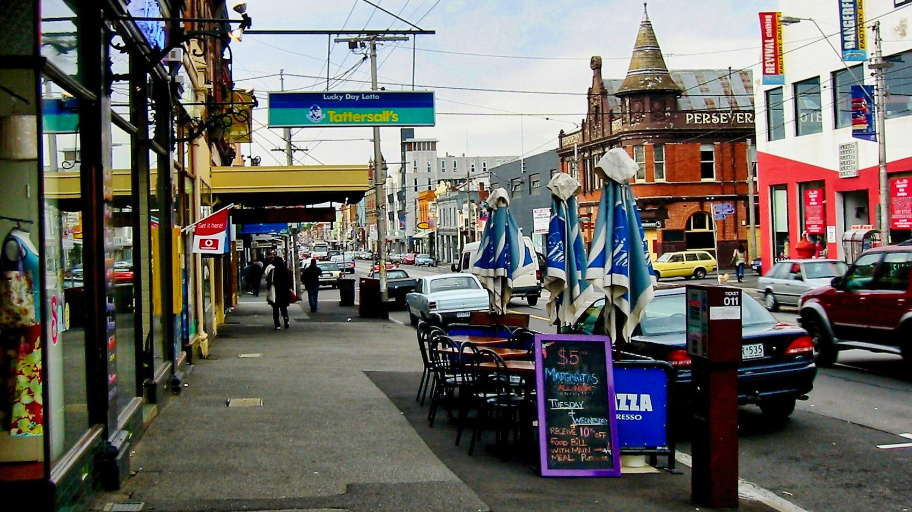
  <em>Melbourne</em>
</figure>

Fitzroy alone has such an abundance of cafés and
bars (bohemian, stylish, cosy) wine bars, pubs, cocktail bars,
restaurants of every kind… I could hardly believe my eyes. Everything
I’d missed, as a European, in terms of gastronomy and culture in Sydney and
Perth, Melbourne has in abundance. At Volare on Brunswick Street I had
the best cappuccino I’d had in weeks, and afterwards I went for a
delicious malai kofte (A\$9.50) at Fitz Curry, which, despite its modest
interior and low prices, is apparently the first Indian restaurant in
Australia to offer organic food.

  <figure>
      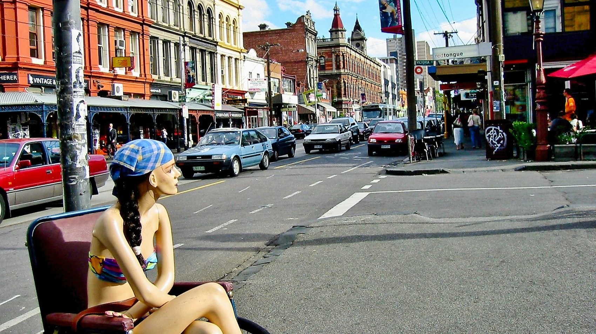
      <em>Melbourne - Fitzroy</em>
    </figure>

  <figure>
      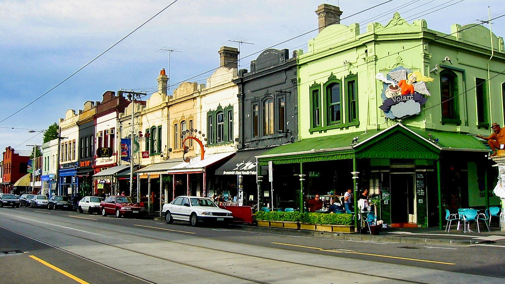
      <em>Melbourne - Fitzroy</em>
    </figure>

I also liked Carlton a lot, even if it doesn’t have Fitzroy’s slightly
run‑down charm. Lygon Street is Melbourne’s Italian quarter: one Italian
restaurant after another, all with outdoor tables, and almost all of
them busy even though it was a Tuesday. Melburnians definitely have a
Southern‑European style going‑out culture, which I really like. At night
I took another walk through downtown and, to my surprise, realised that
Melbourne’s CBD doesn’t empty out after dark, there are plenty of
places to go out here, too.

Today was exhausting. Since I’m not planning to spend several weeks in
Melbourne but am here as a tourist, I’d given myself a strict
sightseeing programme. I bought a day ticket (A\$5.90) for Melbourne’s
excellent public transport and took the tram to St Kilda, the seaside
suburb about 8 km south of downtown. The beach itself isn’t anything
special (but who comes to Melbourne for the beach?) yet there are
cafés and restaurants everywhere, plus nice views of the coast and the
CBD skyline from the pier.

  <figure>
      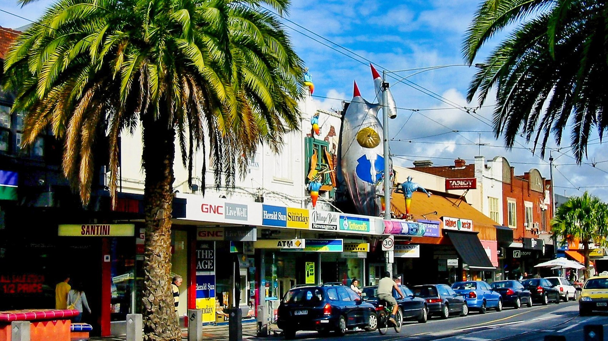
      <em>Melbourne - St. Kilda</em>
    </figure>

  <figure>
      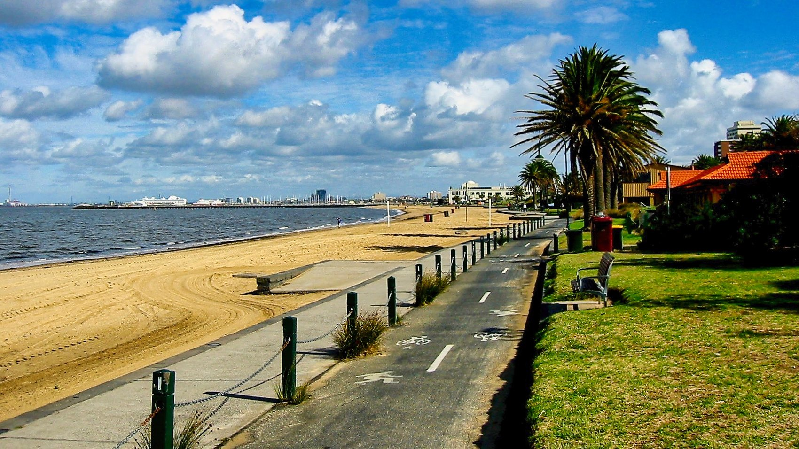
      <em>Melbourne - St. Kilda</em>
    </figure>

Since the nightlife is supposed to be very
good here and many backpackers base themselves in St Kilda, I might
spend a few nights here before I fly back.

I had a very good cappuccino at the cosy Veludo on the café strip, then
took tram 16 back towards the centre.

<figure>
  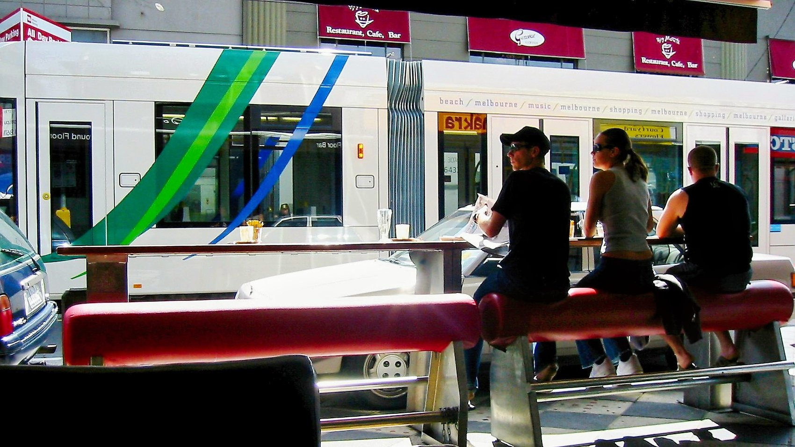
  <em>Melbourne - St. Kilda - Veludo Café</em>
</figure>

Halfway there I got off to visit
Prahran and South Yarra, two more attractive inner‑city districts where
you could easily spend a whole day shopping, eating and drinking, given
all the options. If only one had the money.

<figure>
  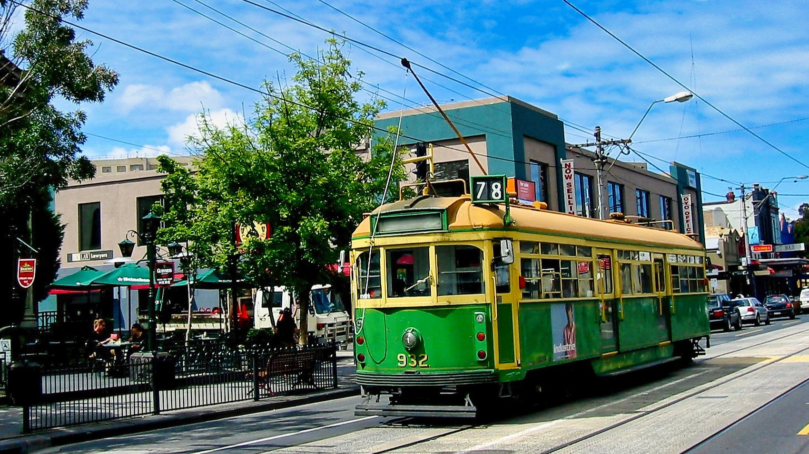
  <em>Melbourne - Prahran</em>
</figure>

I walked several kilometres back towards the city through the beautiful Botanic
Gardens, one of the nicest city parks I’ve ever seen, to Southgate, an
impressive shopping and entertainment mecca with a promenade on the
south bank of the Yarra.

<figure>
  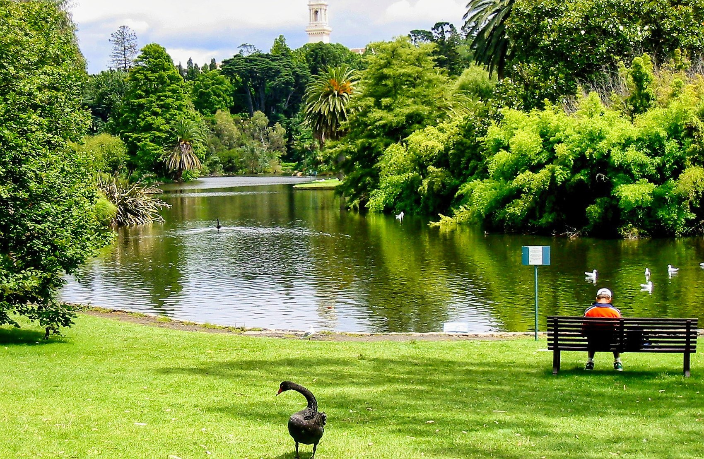
  <em>Melbourne - Botanical Gardens</em>
</figure>

The views across the river to the skyline and
Federation Square, a masterpiece of modern architecture, are
breathtaking, and for the first time I found myself thinking that
Melbourne isn’t just attractive, cultured and liveable; it's genuinely
beautiful. Not as spectacular as Sydney, but beautiful in its own way.

Since I was at Flinders Street Station anyway, I decided to do the
“Walking Tour” described in Lonely Planet, which starts there. Even
though I usually prefer exploring cities on my own, without a fixed
plan, this was an excellent decision: discovering some of the narrow laneways
mentioned would probably have remained sheer luck for me, and they’re
easily an absolute highlight, especially Degraves Street and Block
Place.

I could hardly believe my eyes: right in the middle of the modern
high‑rise canyons of the CBD, these tight little lanes with pretty
outdoor cafés and restaurants, more like a Southern‑European old town
than Australia, and with far more charm than Starbucks & Co.

  <figure>
      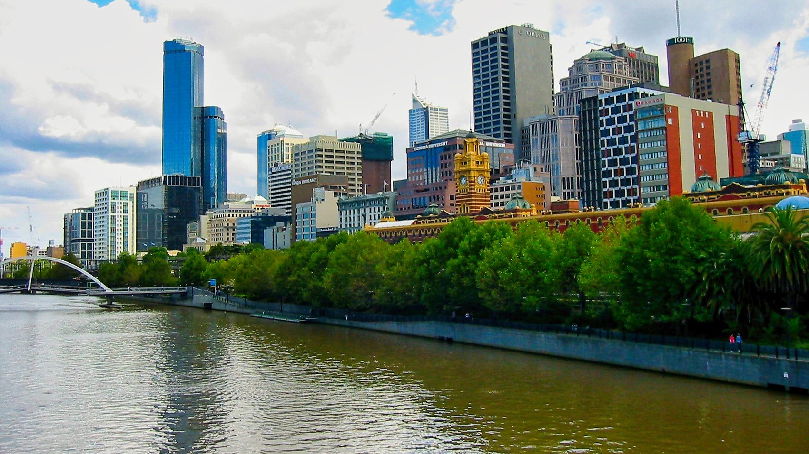
      <em>Melbourne - CBD</em>
    </figure>

  <figure>
      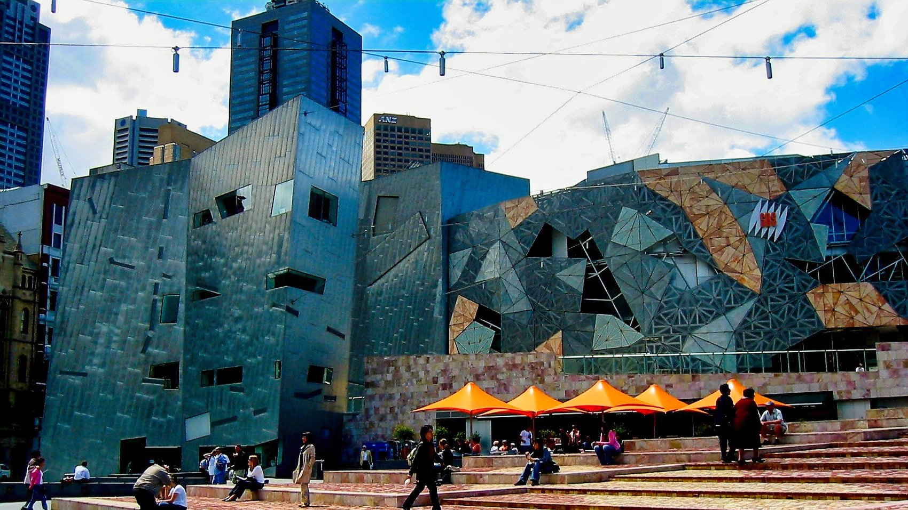
      <em>Melbourne - CBD</em>
    </figure>

  <figure>
      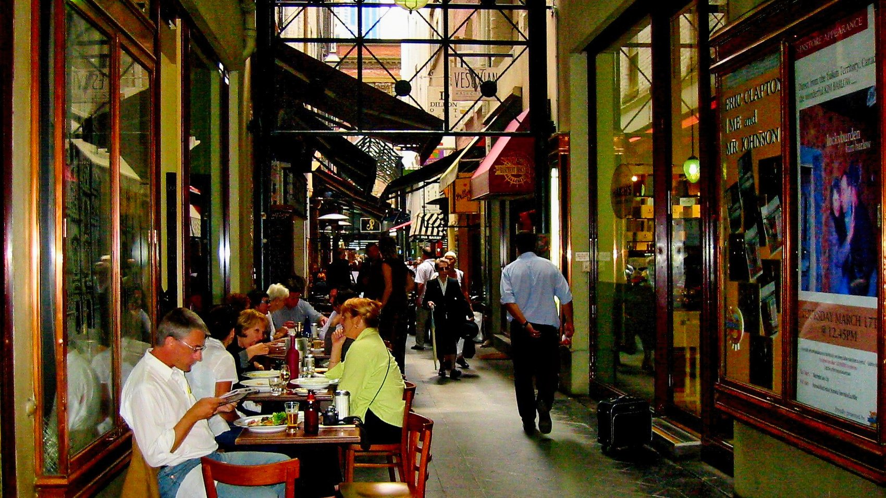
      <em>Melbourne - CBD</em>
    </figure>

  <figure>
      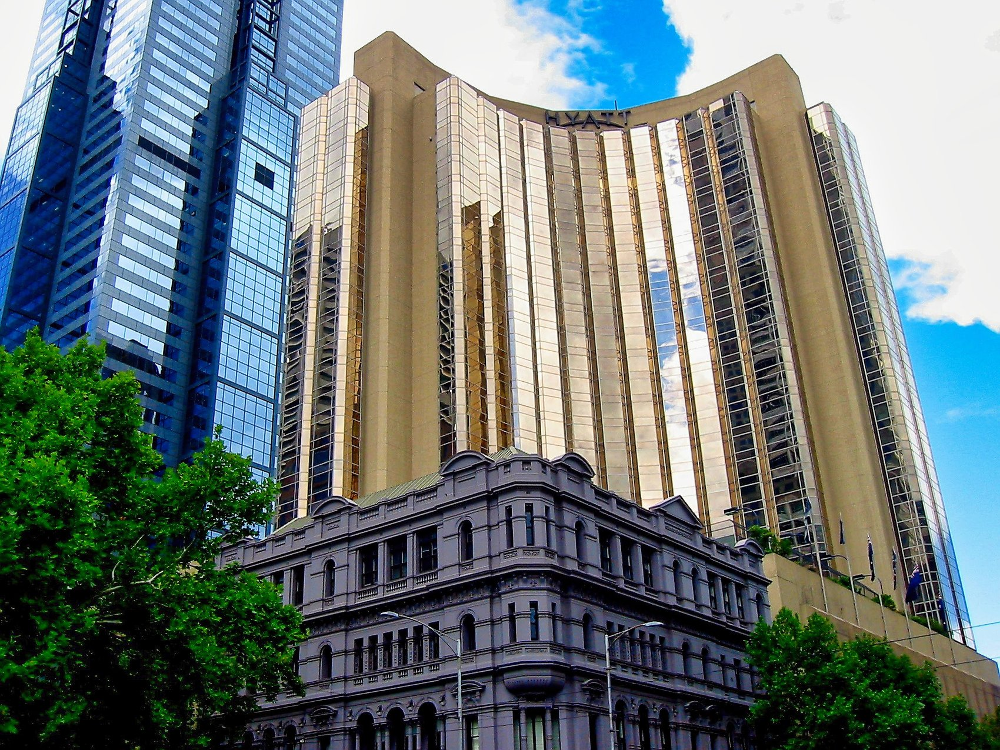
      <em>Melbourne - CBD</em>
    </figure>

I finished the walk with a yum‑cha lunch in Chinatown.

<figure>
  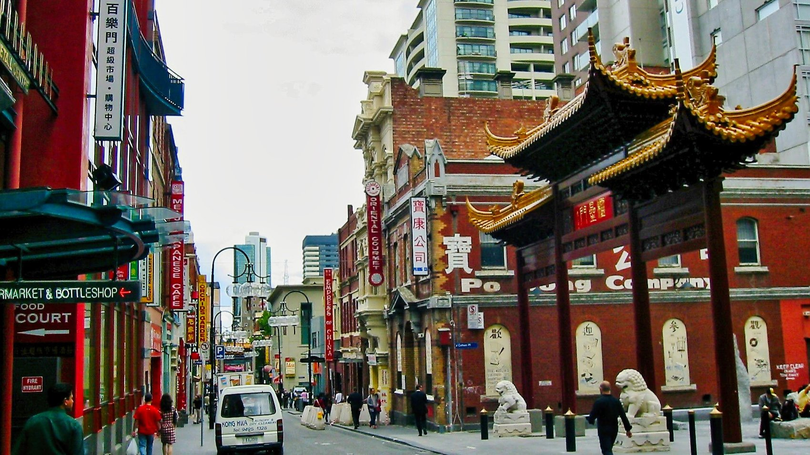
  <em>Melbourne - Chinatown</em>
</figure>

For A\$14.50 I
got spring roll, wontons, soup, fried rice with shrimp, and mixed dim
sum. The owner of the Post Mao Café supposedly cooked the Chairman’s
favourite dishes personally, whether that’s true or not, the food was
very good.

## 13 Feb 2005 — Melbourne

On Thursday morning I picked Mona up from the airport bus terminal and
we moved into the Hotel Bakpak. The day before I’d booked a twin room
there (why, I honestly don’t know) because it has to be the worst accommodation
in Australia: a huge run‑down hostel full of loud, brainless party
backpackers; completely overpriced, foul‑smelling rooms (A\$75); and
bathrooms like at an Eastern‑European campsite. Unbelievable that this dump
is insanely popular; it must be the two bars, and the fact that there
don’t seem to be any rules of behaviour.

In the afternoon we did a crash tour of Melbourne: cappuccino in Carlton
and at Segovia in Block Place, a walk along the Southgate river
promenade, and Fitzroy’s Brunswick Street, where we had an aperitif in
the wonderfully atmospheric, cosy Bar With No Name. Afterwards we had an
excellent dinner at Afghan Village, especially the mixed starters
(A\$13), which were really delicious.

<figure>
  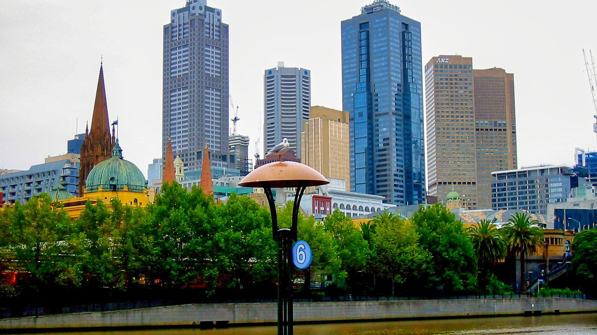
  <em>Melbourne</em>
</figure>

On Friday we had breakfast under the arcades of the Victoria Market and
then took the City Circle Tram, a lovely old tram that’s free and runs a
fixed loop around the city centre. We got off first at the Docklands. A
modern entertainment complex on the water is being built here,
Melbourne’s version of Darling Harbour. Once it’s finished it could
become an attractive place to go out, but at the moment what’s already
done still feels very sterile and underused.

We continued on the City Circle Tram as far as Parliament and went for
lunch at Ants in Chinatown, an excellent choice: a chic, appealing
little bistro with fresh Szechuan food and tasty dim sum; the Tasty
Chicken was also great. Very cheap lunch specials, highly recommended.

In the evening we had a few pints in the pub of the James Squire
Brewery. The beer is very expensive (A\$7.60 a pint), but the Amber Ale
really is something special, absolutely delicious.

On Saturday we went to the Victoria Market again to shop for a picnic.
The market in the historic halls is enormous and is considered the best
in Australia.

<figure>
  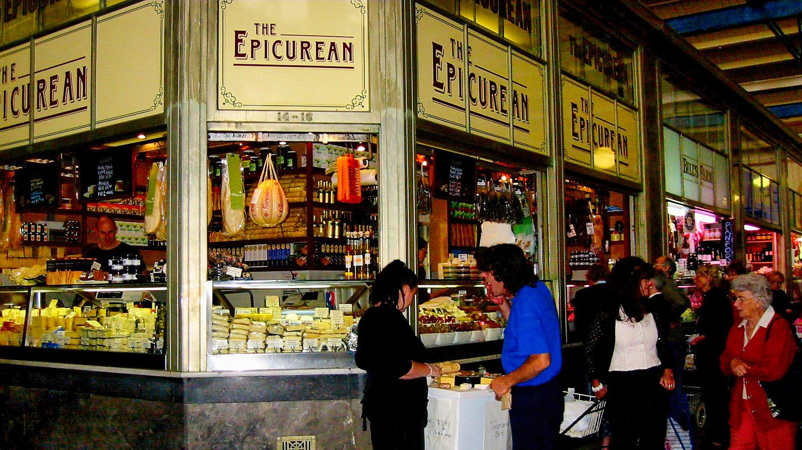
  <em>Melbourne - Victoria Market</em>
</figure>

I’m not surprised, you can get almost everything: deli
stuff, fish, vegetables, fruit, clothes, souvenirs, and at very
reasonable prices. We bought ciabatta, olives, stuffed chillies and
cheese, took the tram to St Kilda, and from there the weekend ferry from
the pier to Williamstown (A\$6.50). With stormy, cold weather it was a
pretty wobbly affair, more like a winter day on the Mediterranean than
the Australian high summer, but the views across the bay to Melbourne’s
skyline were very appealing, and nobody got seasick.

Williamstown is a well‑preserved 19th‑century harbour town that reminded
me a bit of Fremantle.

  <figure>
      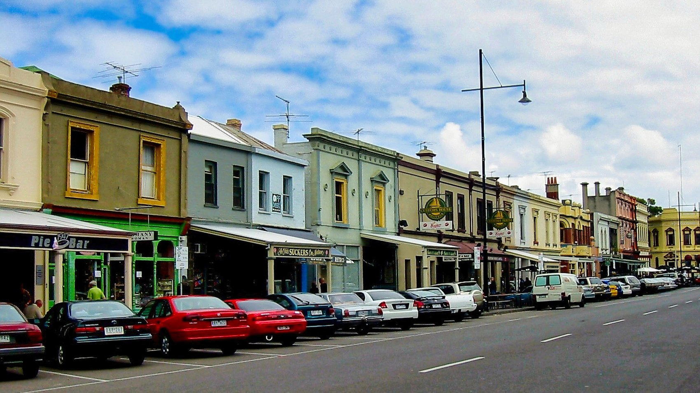
      <em>Melbourne - Williamstown</em>
    </figure>

  <figure>
      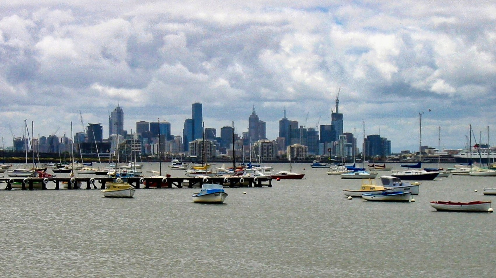
      <em>Melbourne - Williamstown</em>
    </figure>

As a suburb of Melbourne it’s a popular day trip
destination, full of pretty cafés and restaurants. But we’d brought
provisions, so we had our picnic and watched black swans and pelicans
foraging for food.

Back in the city we took the train to Flinders Street Station and, now
in sunshine, had a glass of Chardonnay at the stylish Arintji on
Federation Square.

<figure>
  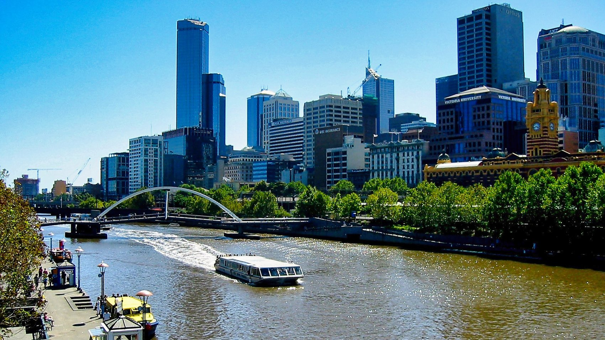
  <em>Melbourne - CBD</em>
</figure>

Then we went on a long walk through the Botanic
Gardens and back into town along the river. We finished the day
relatively early with a cappuccino in Block Place, my favourite lane in
Melbourne.

<figure>
  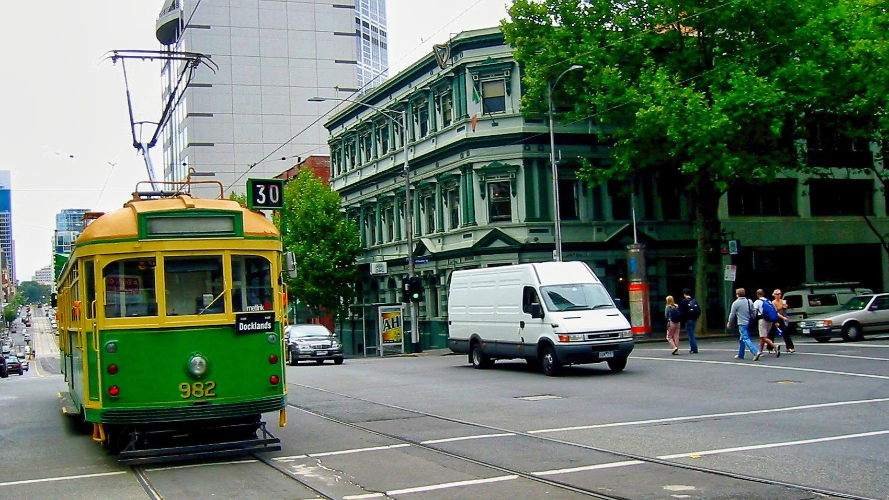
  <em>Melbourne - CBD</em>
</figure>

Today, as every day, we started with a delicious croissant and
cappuccino under the arcades of the Victoria Market and took the train
to South Yarra, where we strolled along Chapel Street, visited the
Prahran Market (small and nice, but rather expensive), and bought a few
bits and pieces at Aldi. Hard to believe, but the Aldis in Australia
are, in terms of look and layout, a one‑to‑one copy of the German
originals.

Today was the final day of the St Kilda Festival, Melbourne’s biggest
street festival, and of course we weren’t going to miss it. For the
first time we had sunshine and summer weather. Huge crowds pushed through the streets
and along St Kilda’s beach promenade; there were markets, food stalls,
concert stages, street performers, the whole package.

I’m sure it would have been very interesting in the evening too, but we
were flying to Launceston at 9 p.m. So after a delicious Vietnamese
lunch at Café Dang on Fitzroy Street (spring rolls, rice‑paper rolls,
beef in vine leaves, all A\$6.50; vermicelli with lemongrass and large
king prawns, A\$9), we went back into the city. One last cappuccino at
Segovia, and then it was time to say goodbye, for now, to Australia’s
most cultured and stylish metropolis.

Three days earlier I’d found such a cheap deal for flights to Tasmania
(A\$65 with Jetstar) that we grabbed it on the spot, and we’ll be
spending the next two weeks on this enigmatic island.

## 14 Feb 2005 — Launceston (Tasmania)

The flight to Launceston only took 45 minutes and since we didn’t arrive
until just before ten, we took a taxi to the Launceston Backpacker
(A\$27). There we discovered they’d messed up our booking and were fully
booked. So at half past ten at night we were standing there without a room.

Luckily they were understanding and admitted it was their mistake, so
they not only found us a room somewhere else and drove us there, but
also paid us the price difference of A\$21.

Thanks to this blunder we ended up at Lloyd’s Hotel and I stayed in an
Australian “hotel” for the first time (which here, as is well known,
usually means a pub that also rents out rooms). We got a small but clean
twin with fridge, private bathroom and TV. The actual price would have
been A\$65, but with the A\$21 from Launceston Backpackers this little
bit of luxury only cost us A\$44.

In the morning we checked in at the Launceston Backpackers, in terms of
value for money the best hostel in Australia so far.

  <figure>
      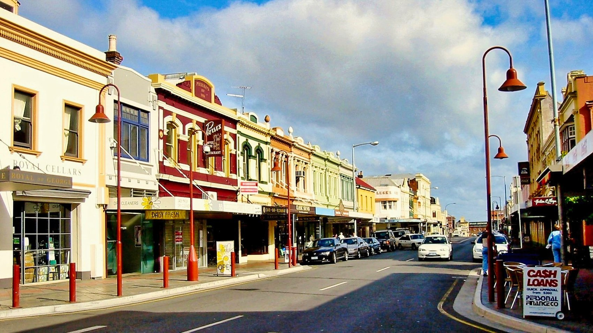
      <em>Launceston</em>
    </figure>

  <figure>
      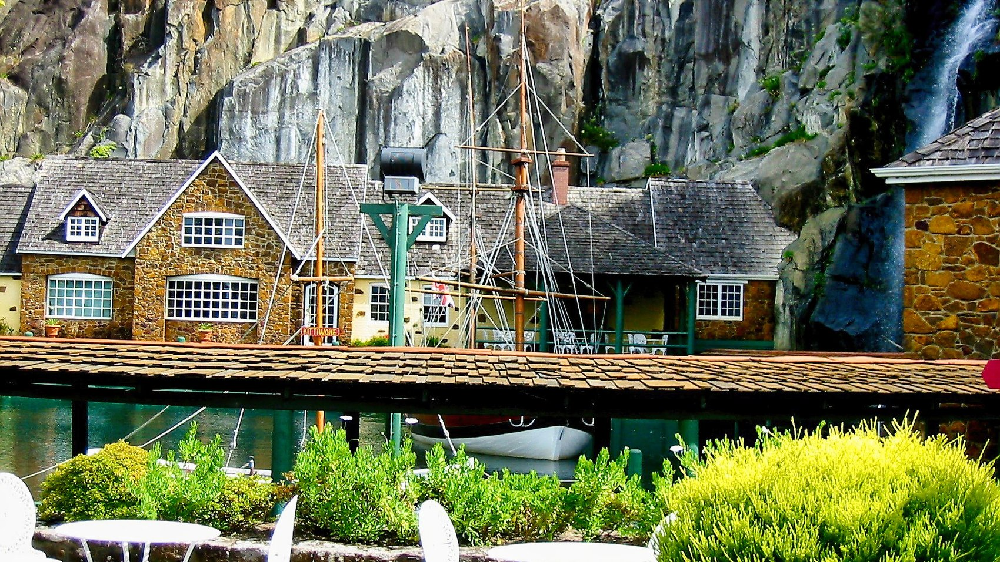
      <em>Launceston</em>
    </figure>

A very spacious,
bright twin room costs only A\$22 per person; the bathrooms are fine;
there’s a big kitchen; and everything is quite clean.

We spent the morning reserving a rental car for the next day and buying
camping equipment, which wasn’t a problem in Launceston.

In the afternoon we took a walk through Cataract Gorge, Launie’s main
attraction. There are trails on both sides of the impressive river
canyon near the centre: an easy stroll on the north side, and a steeper,
more strenuous path on the south. The views are beautiful; there’s a
restaurant, a suspension bridge over the river, and a free swimming pool
with lawns for sunbathing.

  <figure>
      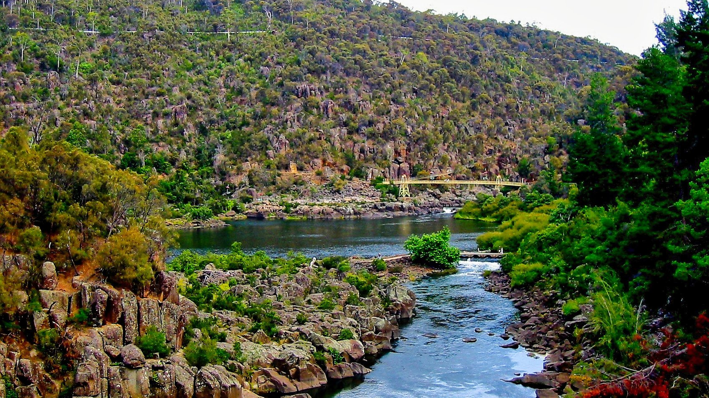
      <em>Launceston - Cataract Gorge</em>
    </figure>

  <figure>
      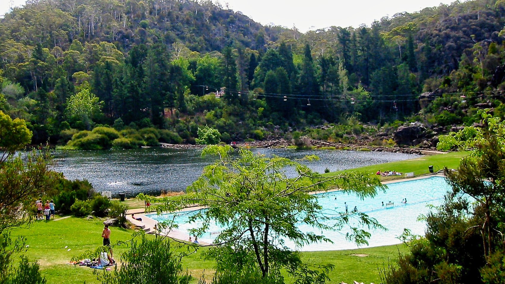
      <em>Launceston - Cataract Gorge</em>
    </figure>

Well worth it.

We spent the rest of the day in town and had pints of the local James
Boag beer at the nice Cock n Bull English pub. Launceston is a pretty
attractive little town with lots of historic buildings, enough good
cafés and restaurants, and an almost too‑relaxed atmosphere; after five
o’clock the pavements are rolled up; not a place for wild nightlife.

## 15 Feb 2005 — Tasmania: North Coast to Rocky Cape

In the morning we picked up our rental car and left Launie on small back
roads, some of them unpaved, heading west to Liffey Falls. The day
before we’d picked up the excellent free brochure “60 Great Short Walks
in Tasmania” and we’ll do quite a few of them during our stay.

The walk to Liffey Falls was short (45 minutes) but beautiful, through
fairy‑tale rainforest, and the waterfall itself was very picturesque.

  <figure>
      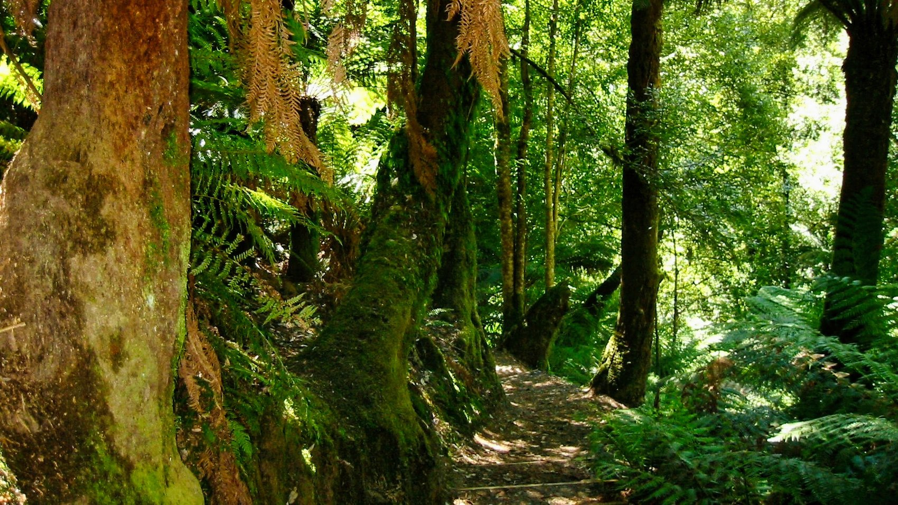
      <em>Liffey Falls</em>
    </figure>

  <figure>
      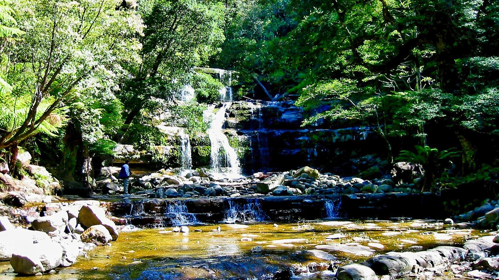
      <em>Liffey Falls</em>
    </figure>

After that we drove up onto the central plateau and took a short walk at
Pine Lake in this harsh, unreal landscape. The rare, ancient pencil
pines, found only in Tasmania, stand there like skeletons.

On the way to the north coast we stopped for lunch in Deloraine, a
pleasant little town by a river, and had a tasty Tasmanian cheese
platter (a Ploughman’s Lunch for A\$11.95) at the deli of the same name,
and a cappuccino.

<figure>
  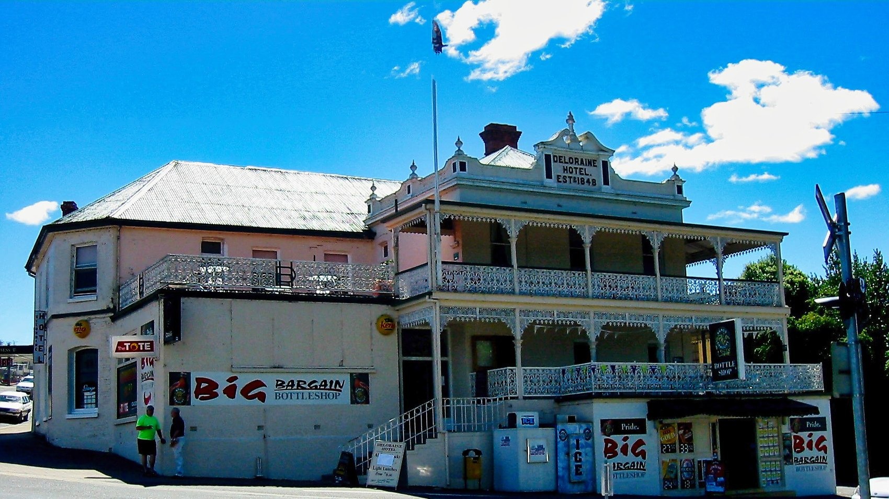
  <em>Deloraine</em>
</figure>

We then followed the coast, which, at least until after Burnie, wasn’t
all that spectacular and, for Tasmania, fairly heavily populated. Only
the little town of Penguin, with its nice beach and a few cafés, was
worth a stop; we had coffee on the beach road.

<figure>
  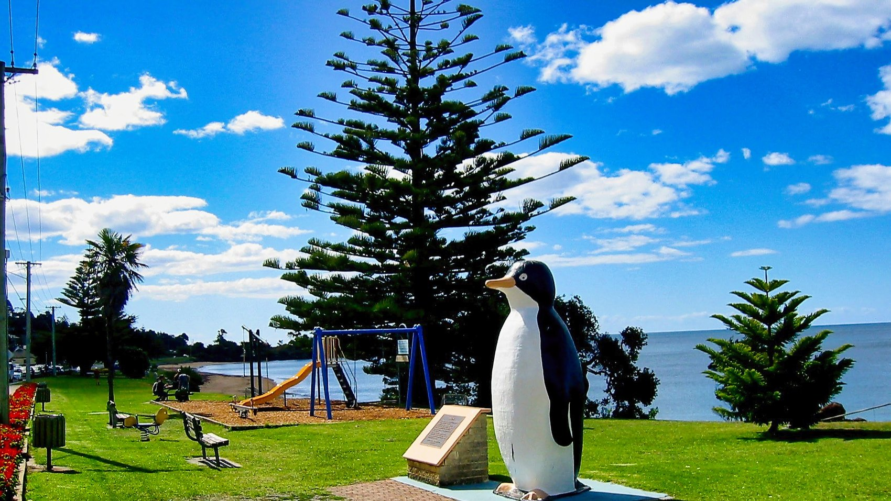
  <em>Penguin</em>
</figure>

It got properly beautiful around Wynyard: a cosy place at a stunning
river mouth, where we ate a seafood basket on the quay.

From there it was one highlight after another: gentle, unspoilt coastal
scenery; dramatic cliffs at Table Cape with wonderful views; the lovely
little bay of Boat Harbour with blazing white sand and crystal‑clear
water; the long white Sisters Beach with lagoon; and more impressive
cliffs at Rocky Cape with a lookout. A fantastic area, and anything but
crowded.

At Rocky Cape National Park I saw my first kangaroo after more than five
months in Australia, so that’s finally ticked off as well.

We spent the night at a small roadside camping ground with pub and
bottle shop near the turn‑off to Rocky Cape: lush green grass, a
barbecue area, and good, clean facilities, for just A\$8.

## 16 Feb 2005 — Stanley to Cradle Mountain

Today was fairly sunny, but cool and extremely windy. We continued along
the beautiful north coast past long white beaches to the historic town
of Stanley, with its neat old houses below the imposing rock “The Nut”,
beautifully set at the end of a peninsula. White sand beaches and
deep‑blue sea on all sides.

  <figure>
      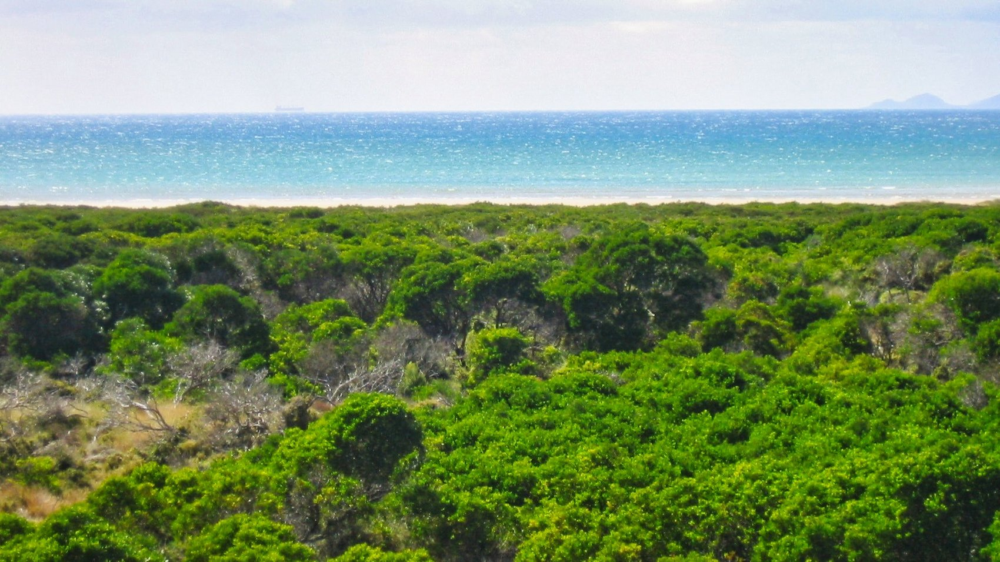
      <em>Around Stanley</em>
    </figure>

  <figure>
      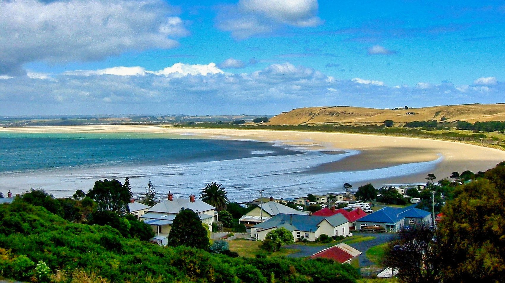
      <em>Around Stanley</em>
    </figure>

  <figure>
      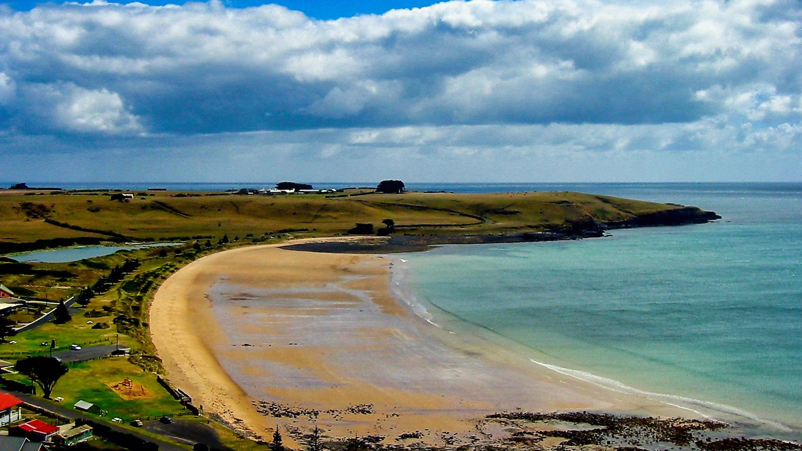
      <em>Around Stanley</em>
    </figure>

  <figure>
      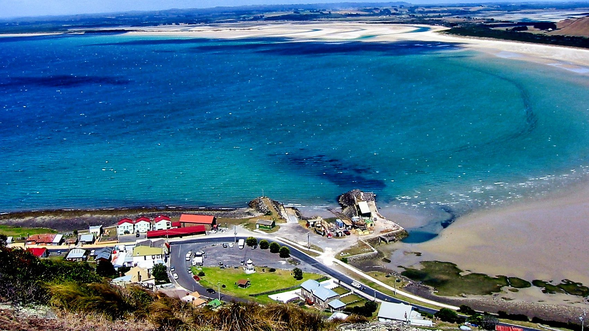
      <em>Around Stanley</em>
    </figure>

First we had coffee and I ate scallops at the lovely Swinging Anchor
Café, in a historic building on the main street. Then we climbed The Nut,
a steep 20‑minute walk; there’s a chairlift too, but the views made
the climb well worth it. We walked the 45‑minute circuit around the
massive rock and went back down into Stanley.

<figure>
  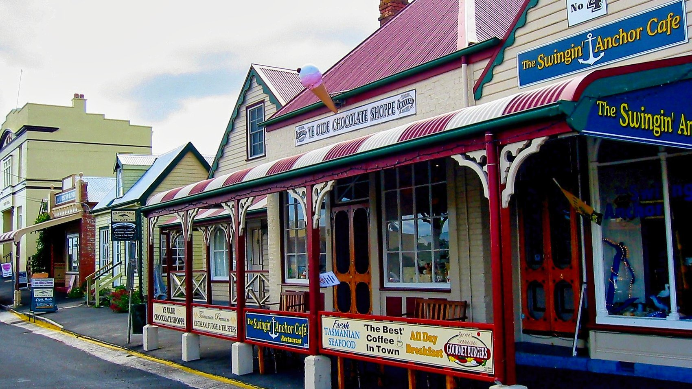
  <em>Stanley</em>
</figure>

Via Wynyard we then took the scenic A10 inland to Cradle Mountain
National Park, Tasmania’s biggest tourist magnet: massive mountain
scenery, picturesque lakes, dense, fairy‑tale rainforest; no wonder
it’s pretty crowded (A\$50 for a two‑month pass for all Tasmanian
national parks).

We only arrived in the afternoon and up here it was bitterly cold (well,
around 10 degrees). We did two short walks near the visitor centre: to
Pencil Pine Falls and the Enchanted Walk, mostly through rainforest
along a mountain stream.

  <figure>
      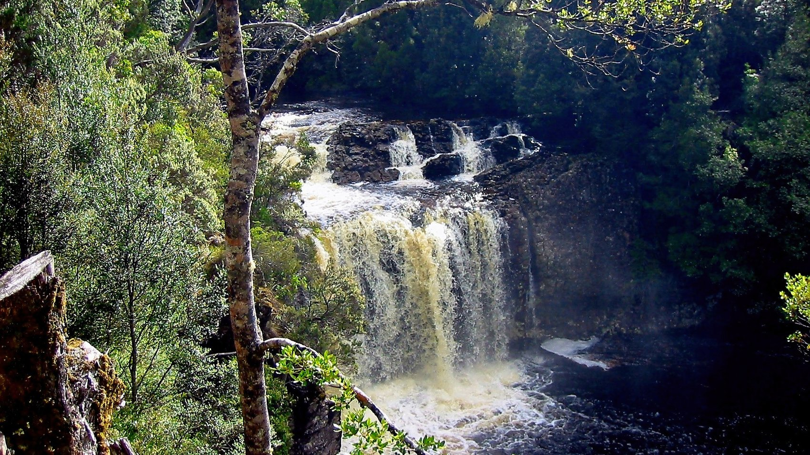
      <em>Cradle Mountain NP</em>
    </figure>

  <figure>
      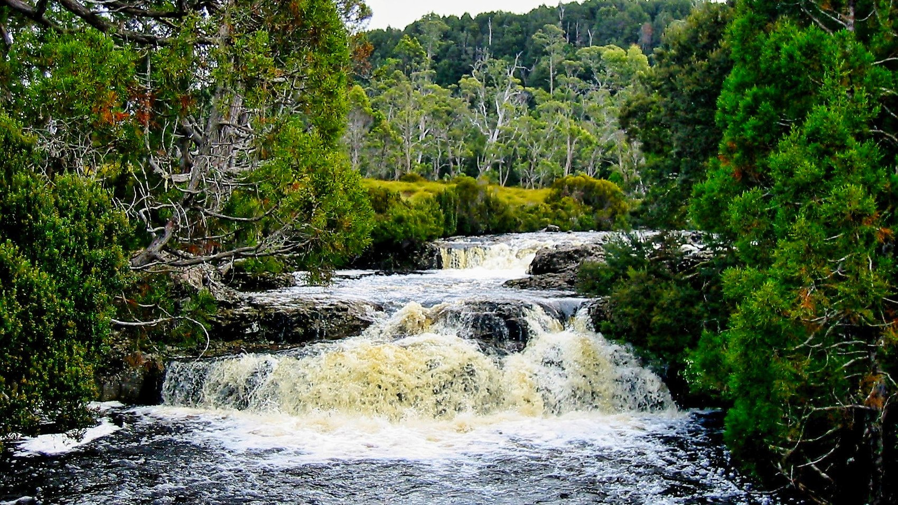
      <em>Cradle Mountain NP</em>
    </figure>

<figure>
  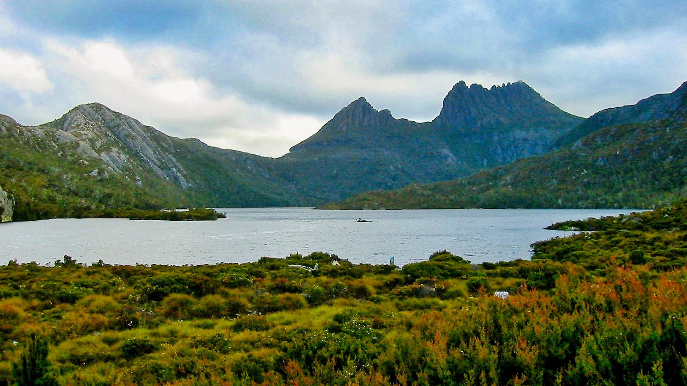
  <em>Cradle Mountain NP</em>
</figure>

When we reached the camping ground in the tourist park it started to
rain and the temperature dropped further. I hope I survive the night;
camping in sub‑zero temperatures is anything but fun. The site isn’t
great (forest floor) and is outrageously overpriced (A\$30). On the plus
side, the facilities are high standard and there’s a big communal
kitchen (without equipment, but with a large fireplace that puts out a
nice heat).

## 17 Feb 2005 — Cradle Mountain to Strahan

We took the free shuttle from the visitor centre to Dove Lake and walked
the two‑hour Dove Lake Circuit around the lake. The weather was good and
the views of Cradle Mountain were fantastic.

  <figure>
      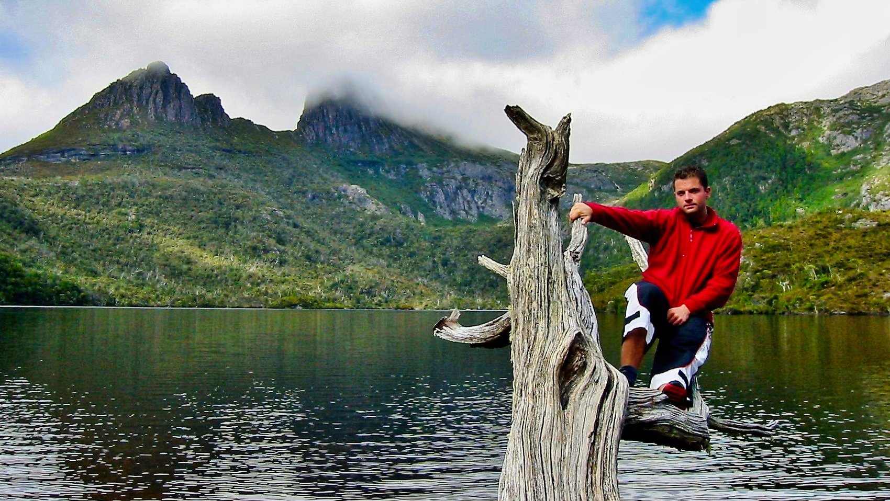
      <em>Cradle Mountain NP</em>
    </figure>

  <figure>
      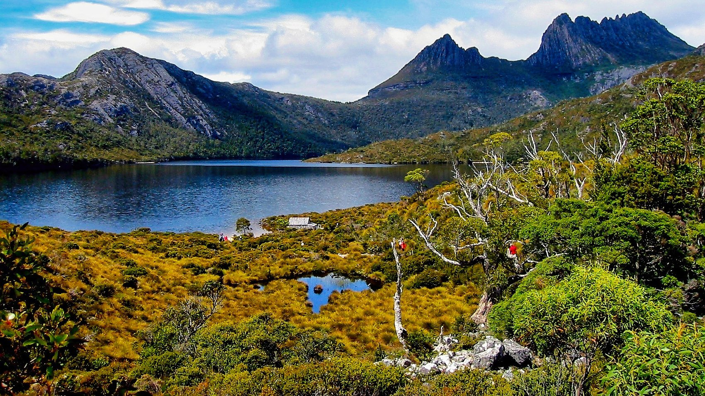
      <em>Cradle Mountain NP</em>
    </figure>

The path mostly ran through
rainforest past inviting little beaches, far too cold for swimming,
though. Still, a beautiful area and a very pleasant walk.

Around midday we drove on towards the west coast through scarcely
populated, mountainous forest country. We had lunch at the Tullah
Tavern, a simple country pub in a godforsaken spot. The food, however,
was excellent, with portions big enough for hungry truckers: a fantastic
salad with fat garlic king prawns (A\$18), and a big rump steak with
scallops and jumbo prawns (reef & beef, A\$22), genuinely fine cooking
for a place like that.

To walk it off we did a three‑hour hike (return) to Montezuma Falls near
Zeehan. The trail followed an old railway line right through dense,
green rainforest. The walk itself was already lovely; the waterfall was
an absolute highlight: 100 metres high in a dream setting.

  <figure>
      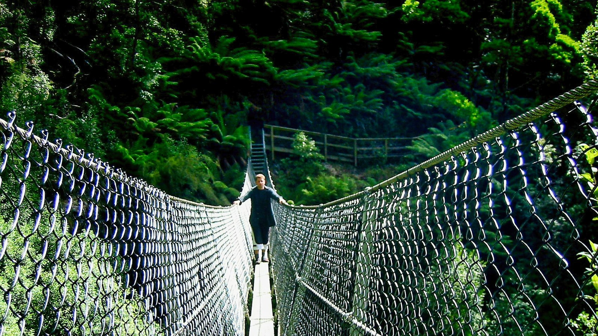
      <em>Montezuma Falls</em>
    </figure>

  <figure>
      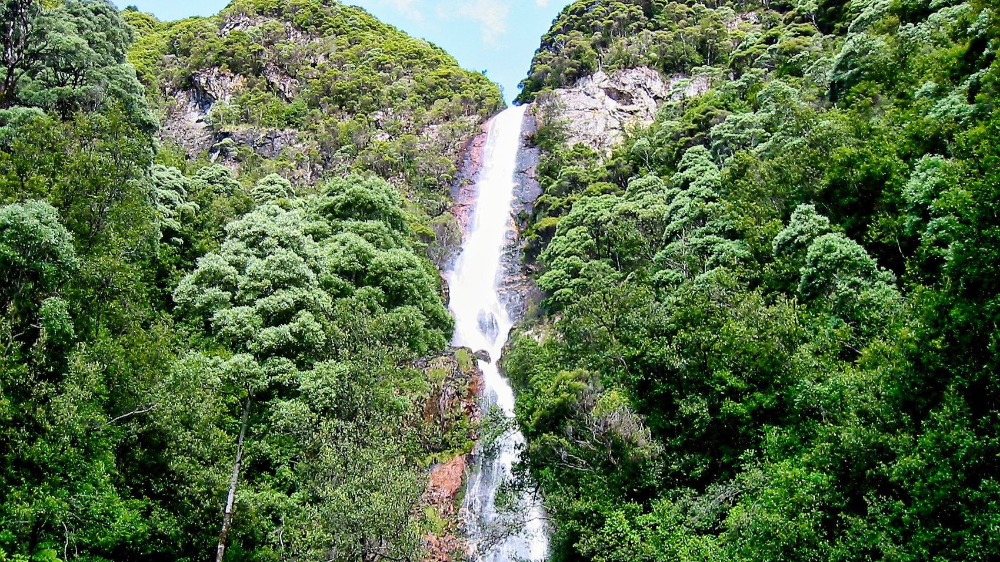
      <em>Montezuma Falls</em>
    </figure>

A narrow,
adventurous suspension bridge spans the deep gorge in front of the
falls, with great views of the forested surroundings and the waterfall.
This hike was more than worth it.

Through pretty green hill country we continued to the coast to Strahan,
the only larger place (800 inhabitants) on Tasmania’s west coast. We
arrived so late that we didn’t even see the town in daylight, but we’ll
probably stay another day.

We snagged the last free pitch at the Strahan Tourist Park, about a
15‑minute walk from the centre, right on the water. Not cheap (A\$20),
but with decent, if slightly small, grassy pitches and good
facilities.

In the evening we wandered into town and I ate half a dozen wonderful
Tasmanian oysters at Hamer’s Hotel, with a glass of (less wonderful)
Tasmanian Chardonnay.

## 18 Feb 2005 — Strahan / Henty Dunes / Gordon River

Even though the weather didn’t exactly invite us to stay, we decided to
spend another day in Strahan, an excellent decision, because the area
has a lot to offer.

In the morning we drove 14 km back towards Zeehan to visit the Henty
Dunes. All that points to this grand dune landscape is a small wooden
sign to a “picnic area” in the forest, and even the Lonely Planet guide
mentions it with only a single sentence. Yet the high sand dunes are
absolutely spectacular, with views over the endless green West Tasmanian
rainforest on one side and the blue ocean on the other.

<figure>
  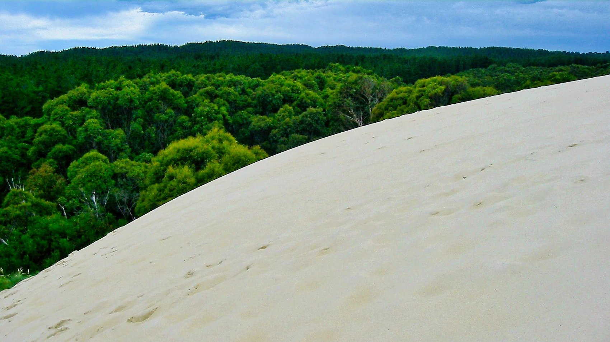
  <em>Around Strahan - Henty Dunes</em>
</figure>

Somewhere else
in the world, these dunes would be a major tourist attraction.

Back in Strahan we did a nice 45‑minute walk through dense rainforest,
which starts right behind the town, to Hogarth Falls.

After an excellent cappuccino at the Banjo Café on the Esplanade, our
six‑hour Gordon River boat tour, which we’d booked, started at 2 p.m.
The trip isn’t cheap (A\$65), but it’s one of the few ways to penetrate
the untouched wilderness of western Tasmania, one of the most pristine
regions on earth and a World Heritage area.

On a fairly luxurious boat we first cruised through Strahan’s huge
harbour, twice the size of Port Jackson, out to open sea. We passed
the narrow harbour entrance, Hell’s Gate, and had wonderful views of
Ocean Beach, a 33‑km‑long white dune beach; very impressive coastal
scenery.

  <figure>
      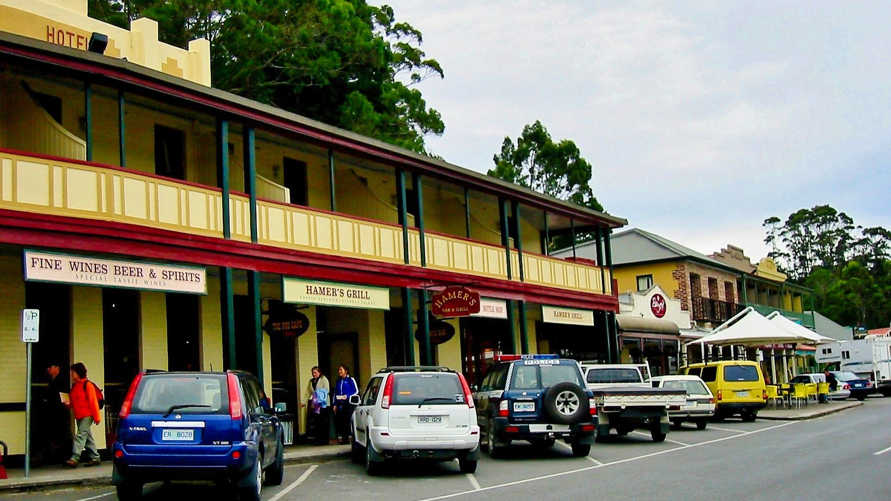
      <em>Around Strahan</em>
    </figure>

  <figure>
      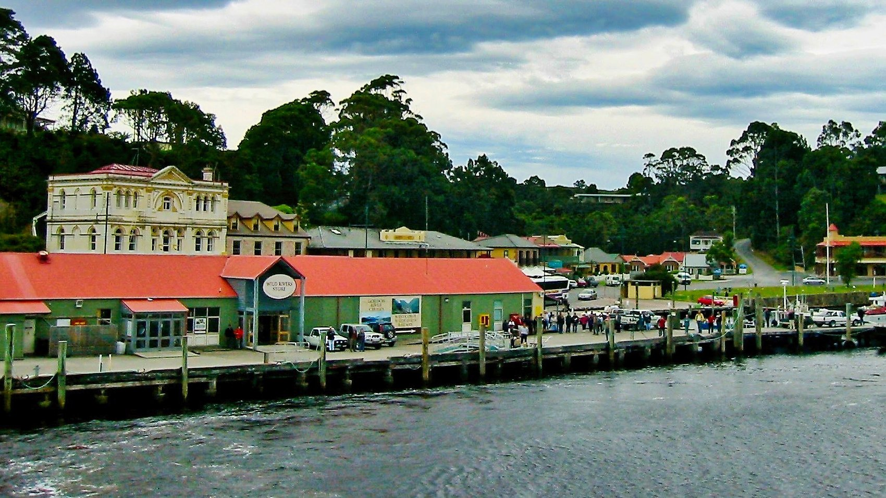
      <em>Around Strahan</em>
    </figure>

<figure>
  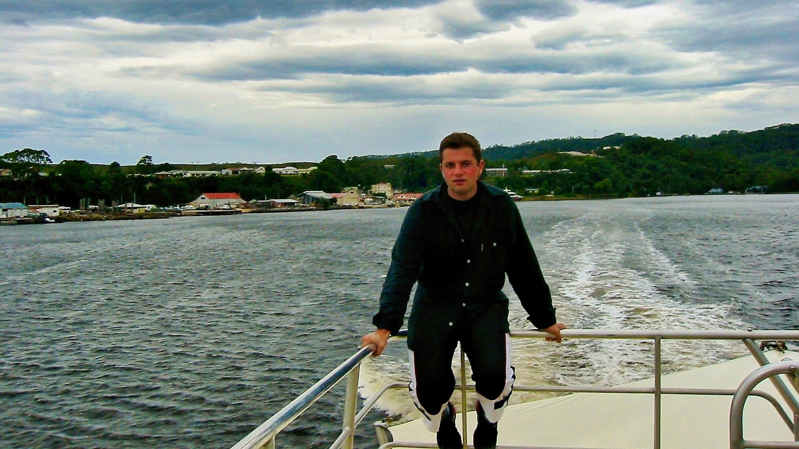
  <em>Around Strahan</em>
</figure>

Back in the harbour we stopped at Sarah Island, once one of the most
remote penal colonies of the Empire; there isn’t much left to see,
though.

  <figure>
      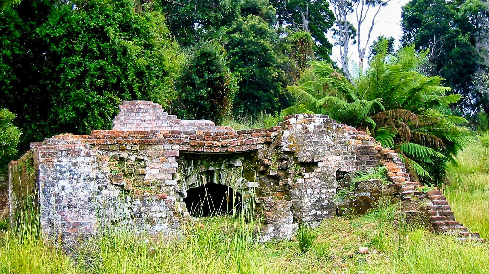
      <em>Around Strahan - Sarah Island</em>
    </figure>

  <figure>
      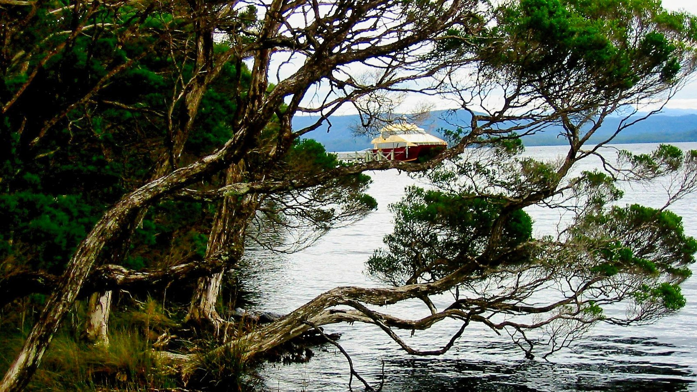
      <em>Around Strahan - Sarah Island</em>
    </figure>

Shortly afterwards we reached the mouth of the Gordon River, one of
Tasmania’s longest rivers, winding through the wilderness. As far as the
eye can see: green, dense rainforest; no roads, not even hiking trails
penetrate this impenetrable region. We cruised about an hour upriver to
Heritage Landing, where we took a short walk through the rainforest.

<figure>
  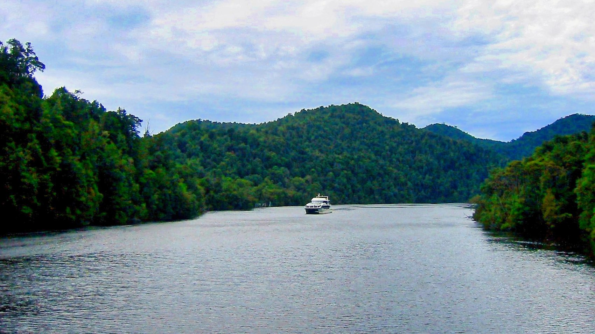
  <em>Around Strahan - Gordon River</em>
</figure>

The
forest itself wasn’t any more spectacular than on walks in less remote
areas, but the real attraction is the feeling of being at the end of the
world, in one of the most isolated places, surrounded by pure nature.

Dinner For dinner they served a good buffet on board, very reasonably
priced at \$12, among other things smoked salmon and brie, plus a beer
to wash it down, and the return trip flew by.

## 19 Feb 2005 — West to East: Queenstown / Mt Field / New Norfolk

We left Tasmania’s wild, rainy west coast and took the only road that
crosses the West Tasmanian wilderness, heading east. Our first coffee
stop was in a café at the railway station in Queenstown, a former
boomtown surrounded by hillsides cleared for mining, an unreal place,
but, despite the drizzle, not unattractive thanks to the many historic
buildings.

  <figure>
      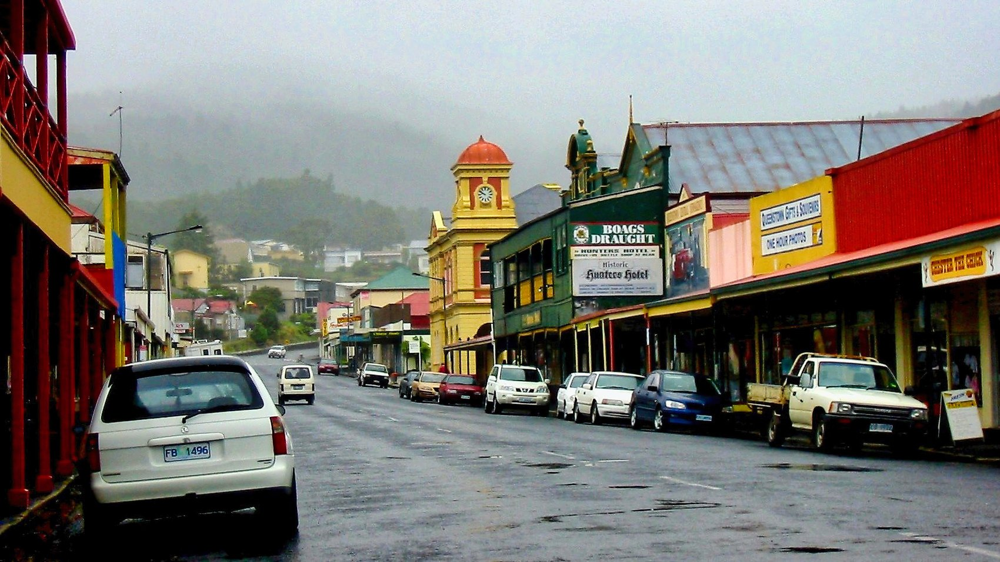
      <em>Queen's Town</em>
    </figure>

  <figure>
      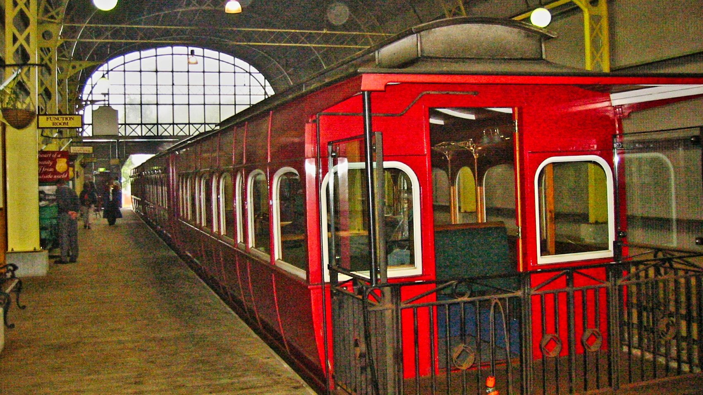
      <em>Queen's Town</em>
    </figure>

<figure>
  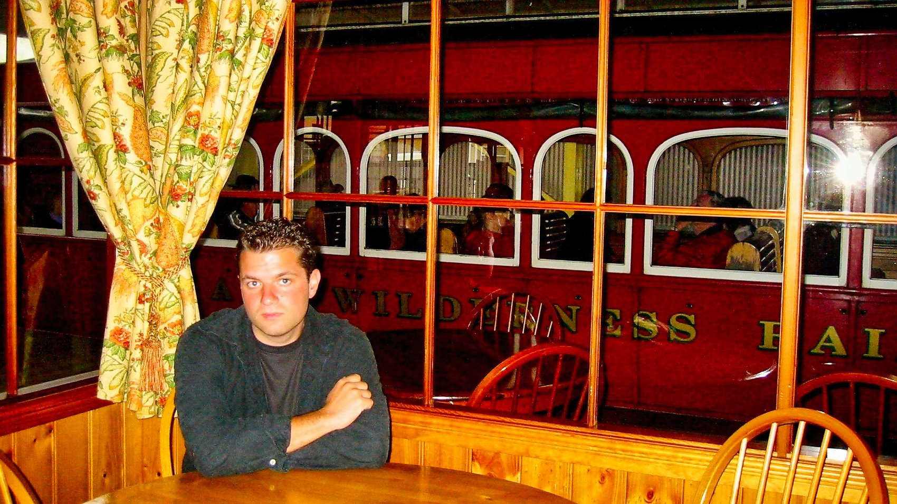
  <em>Queen's Town</em>
</figure>

At the station we were lucky enough to watch the historic Wilderness
Railway depart, a beautifully restored tourist train that runs through
the rainforest and, for a lot of money (A\$90 one‑way), ferries
pensioner groups to Strahan. Ridiculously overpriced, but quite nice to
look at.

On the long, winding drive through uninhabited countryside towards the
east coast we did a few signposted walks to stretch our legs: first
through rainforest to the very pretty Nelson Falls; a bit further along
we hiked up to Donaghys Lookout (40 minutes), with wonderful views over
the endless wilderness; and we also enjoyed the short rainforest walk
along the Surprise and Franklin Rivers (25 minutes).

<figure>
  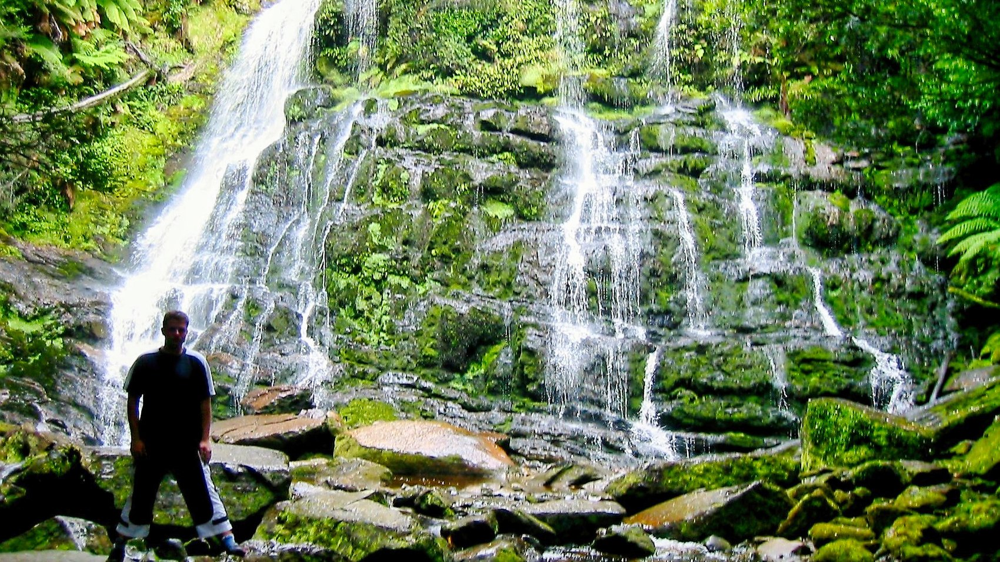
  <em>Nelson Falls</em>
</figure>

<figure>
  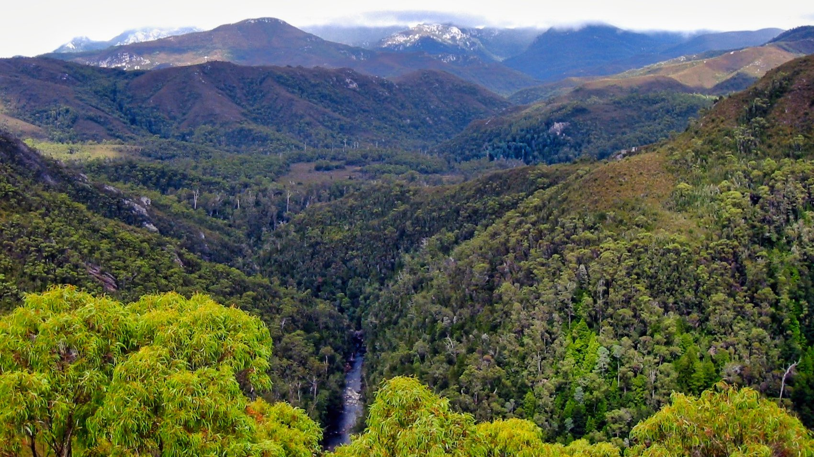
  <em>Donaghys Lookout</em>
</figure>

We had lunch at the Derwent Bridge Wilderness Hotel, a very nicely
decorated pub and restaurant with a big fireplace and views over the
greenery.

<figure>
  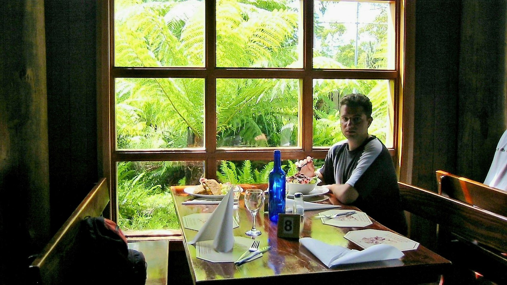
  <em>Derwent Bridge - Wilderness Hotel</em>
</figure>

Tour groups get fed here too, but the prices were reasonable
and there was nothing wrong with the focaccia stuffed with smoked
venison ham (A\$9.50).

For a digestion walk we went to Lake St Clair, the end point of the
Overland Track in Cradle Mountain National Park.

  <figure>
      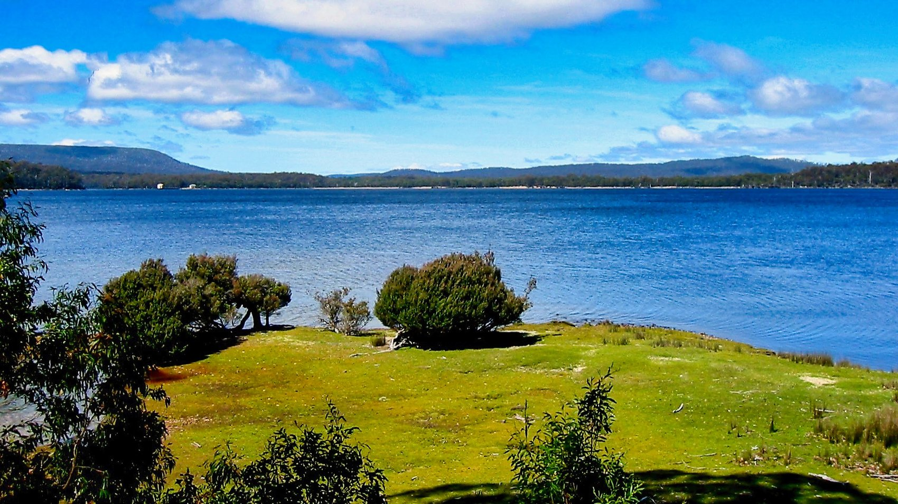
      <em>Lake St. Claire</em>
    </figure>

  <figure>
      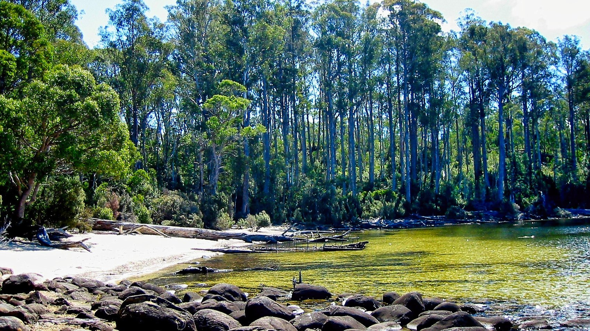
      <em>Lake St. Claire</em>
    </figure>

It’s a beautiful spot:
a clear blue mountain lake surrounded by rainforest. We walked to the
very pretty Platypus Bay (45 minutes) with a sandy beach and great
views, although we didn’t see any platypuses in Platypus Bay.

We saved the best walk of the day, and an absolute Tasmanian highlight,
for last. The trail to Russell Falls and Horseshoe Falls (45 minutes)
in Mount Field National Park ran through magical, picture‑book
rainforest so perfect it could have been painted.

  <figure>
      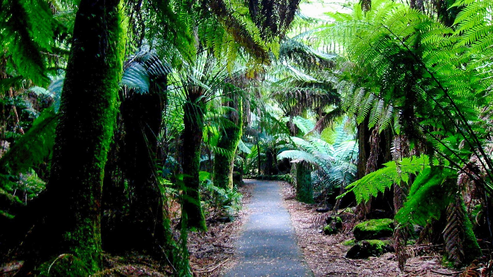
      <em>Mt Field NP</em>
    </figure>

  <figure>
      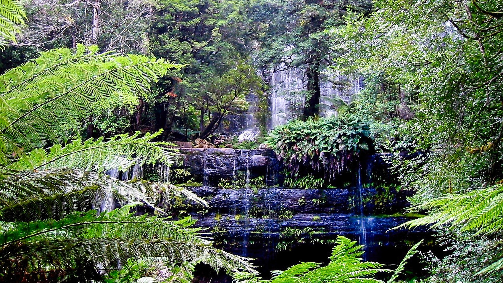
      <em>Mt Field NP</em>
    </figure>

  <figure>
      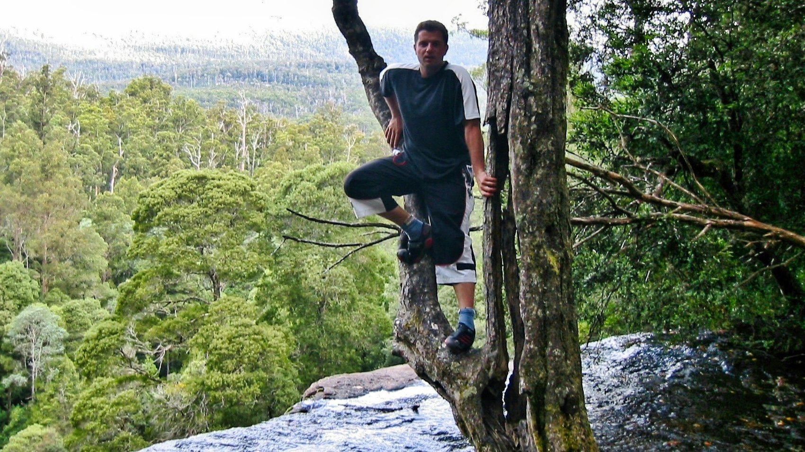
      <em>Mt Field NP</em>
    </figure>

  <figure>
      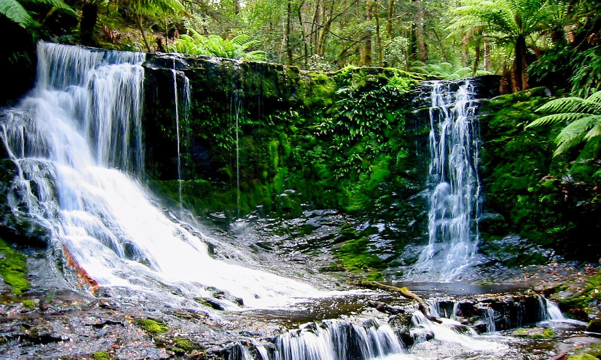
      <em>Mt Field NP</em>
    </figure>

Both waterfalls were
unbelievably picturesque, and along the way we saw lots of cute
wallabies hopping about. Completely beyond words!

In the soft early‑evening light it was a wonderful drive through the
gently rolling, lovely Derwent River Valley to New Norfolk, a small town
on the river set in beautiful scenery, where we spent the night at the
camping ground: good grassy pitches, decent facilities, reasonably
priced (A\$12), and, above all, in the perfect spot right by the water.

<figure>
  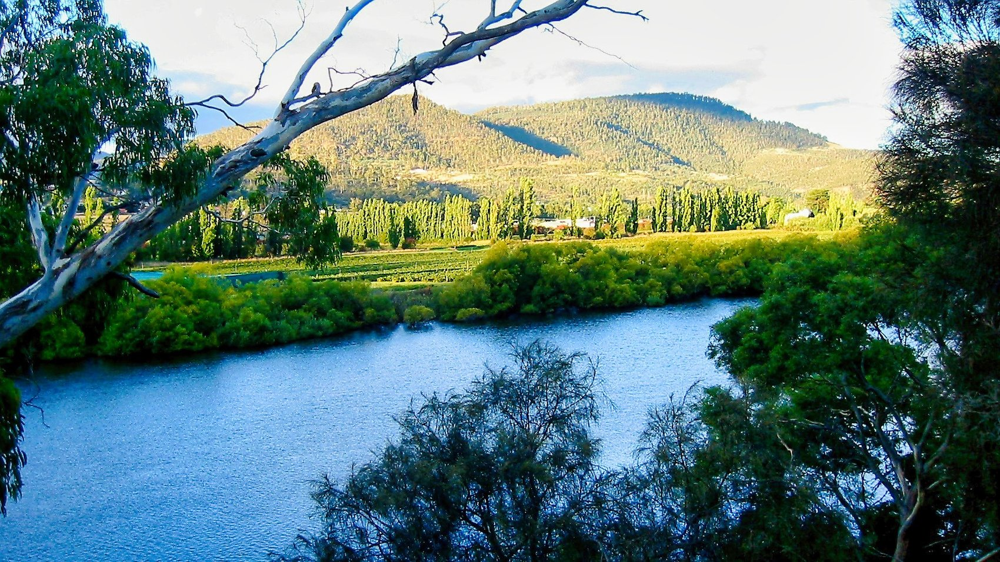
  <em>Derwent River Valley</em>
</figure>

## 20 Feb 2005 — Richmond / Apsley / Bicheno / Freycinet

We first drove through wine‑growing country to Richmond, Tasmania’s most
historic little town north of Hobart. Here you feel a bit as if you’re
in Europe: old buildings, orchards, geese and ducks by the pretty river
and its picturesque historic bridge… and bagpipe bands were marching
down the streets. We took a break with cappuccino and divine nut cake in
the garden of the Richmond Wine Centre, which, right down to the chairs,
looked like a summer wine garden in southern Germany. Very bizarre, but
still a charming place.

  <figure>
      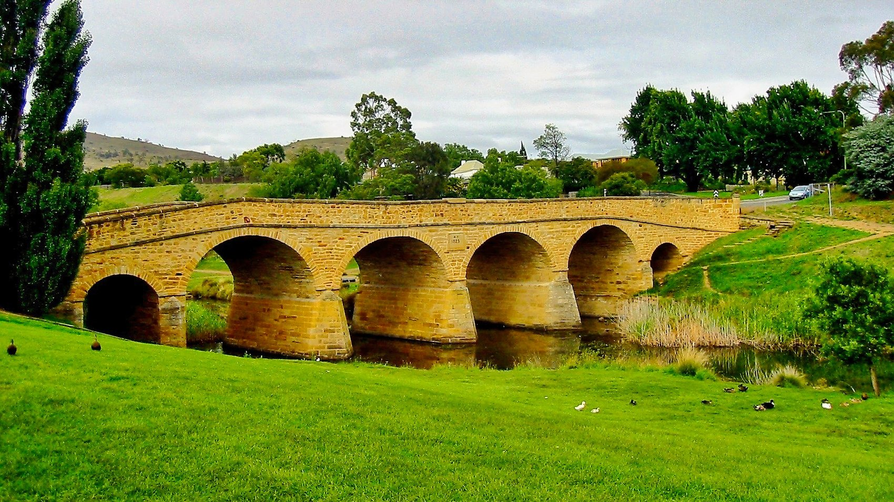
      <em>Richmond</em>
    </figure>

  <figure>
      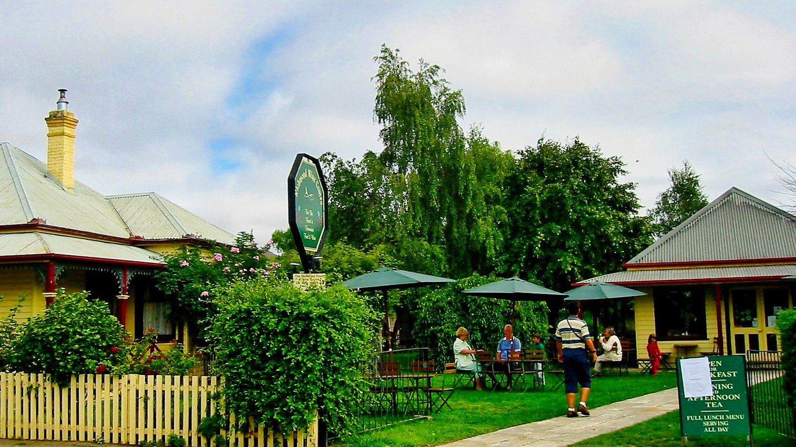
      <em>Richmond</em>
    </figure>

<figure>
  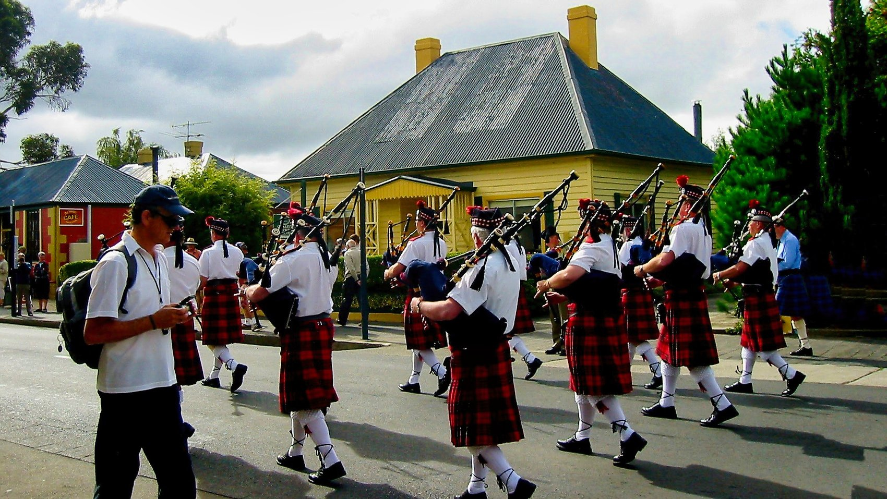
  <em>Richmond</em>
</figure>

From there we followed the scenic east coast north via Orford and
Swansea to Bicheno. Unfortunately the weather deteriorated dramatically,
and with grey skies and rain we couldn’t really enjoy the scenery.

North of Bicheno we made a short detour inland to Apsley National Park,
which we reached after some time on a very rough track. The weather
improved again and we were able to take a nice walk through wonderfully
fragrant dry forest (rare in Tasmania) to the Apsley Waterhole: a large,
beautifully turquoise pool in the Apsley River, in the middle of
unspoilt nature.

<figure>
  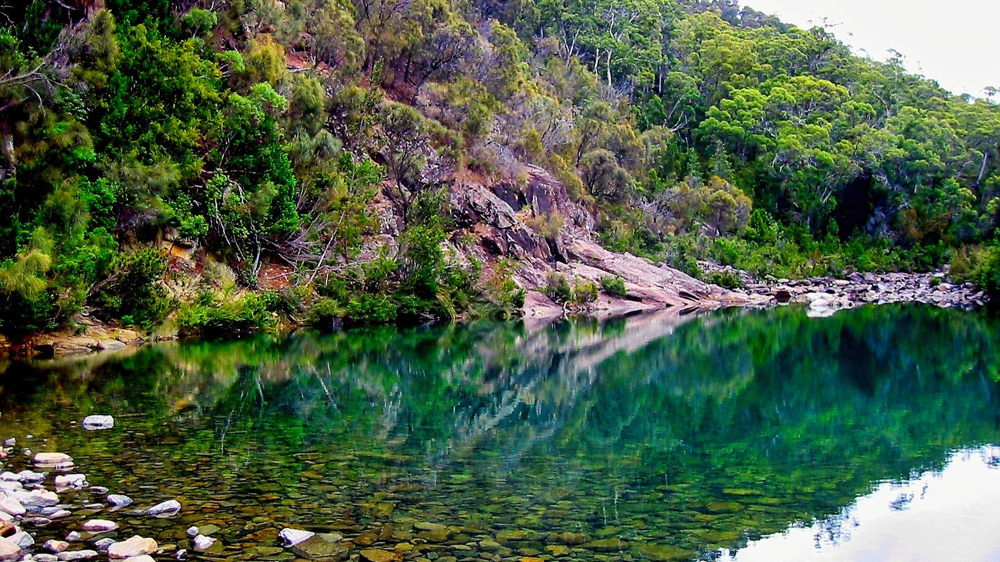
  <em>Apsley Waterhole</em>
</figure>

Back on the coast we spent some time in Bicheno, a small holiday town
set in very attractive coastal scenery, with white sandy coves between
reddish rocks.

  <figure>
      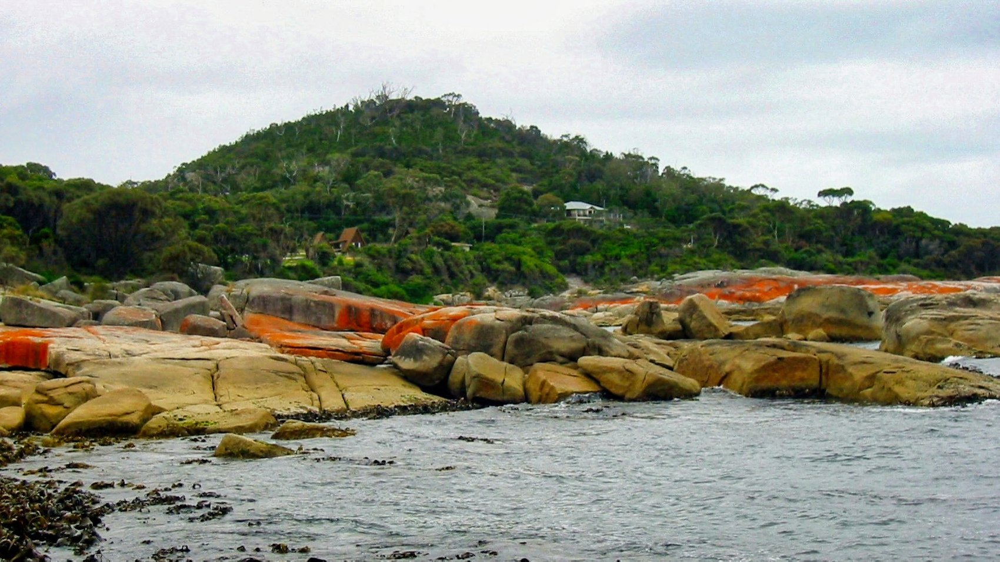
      <em>Around Bicheno</em>
    </figure>

  <figure>
      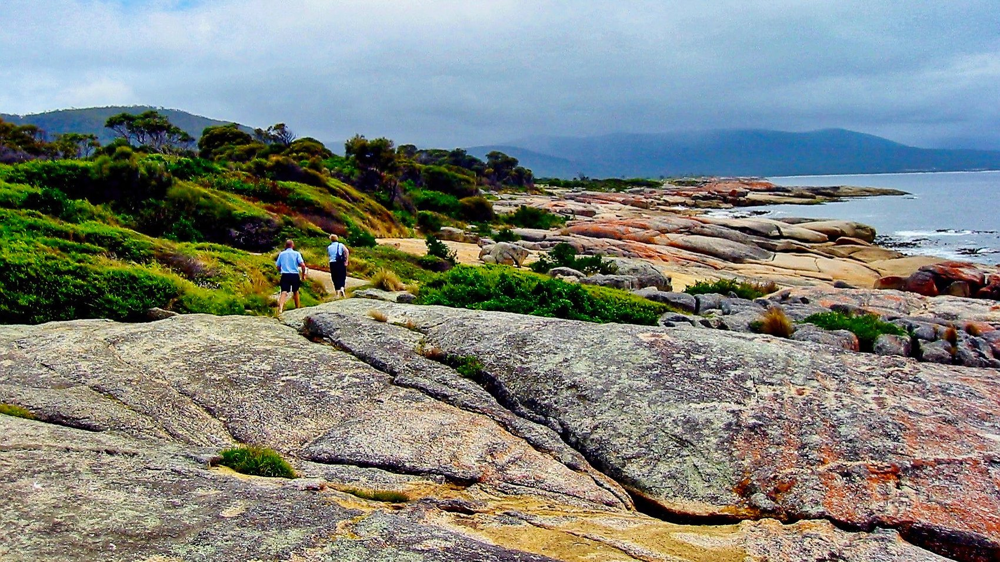
      <em>Around Bicheno</em>
    </figure>

<figure>
  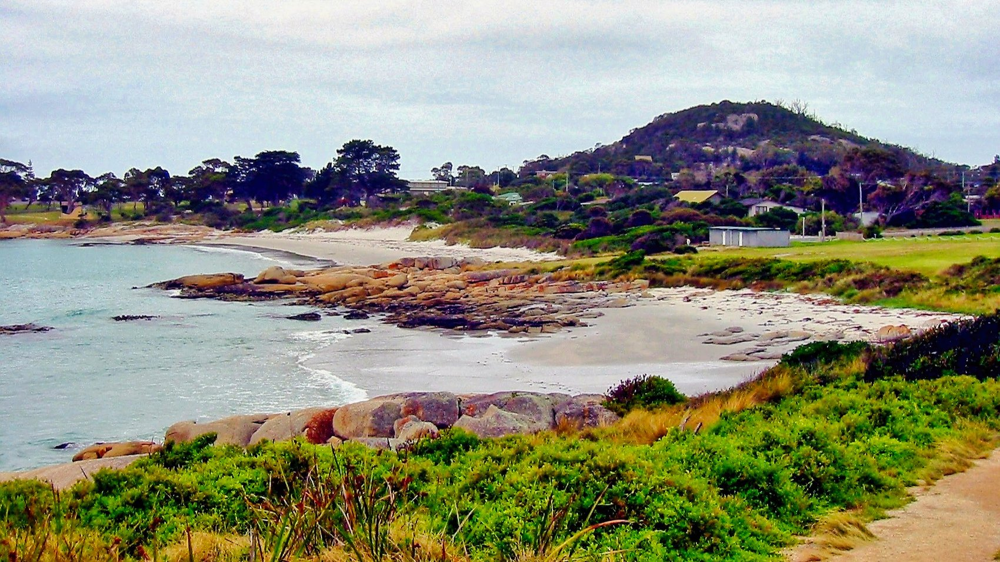
  <em>Around Bicheno</em>
</figure>

Then we headed south again to Coles Bay in Freycinet National Park, one
of Tasmania’s most‑praised tourist attractions. On the way we stopped at
the Friendly Beaches. By then the sun was out again, the sky was blue,
and the kilometres long, powdered‑sugar‑white sand beach with
crystal‑clear water and green hinterland looked absolutely wonderful, a
great teaser for the other highlights of the Freycinet Peninsula.

<figure>
  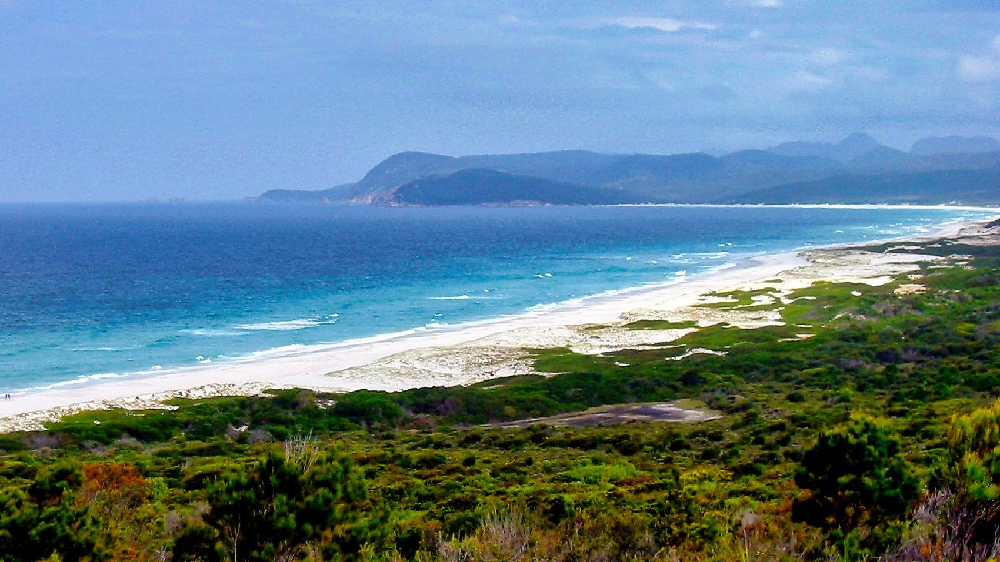
  <em>Friendly Beaches</em>
</figure>

We drove to the camping ground in Coles Bay, the beautifully located
tourist hub of the national park. At Iluka Holiday Park we got a
wonderful pitch on a hill with sea views for A\$18, and dinner in the
tavern in the evening was quite decent too, even if the portions were a
bit stingy: reef & beef (A\$24) and pan‑fried blue‑eye fish of the day
(A\$15).

Before dinner I took a little trip into the national park, enjoyed the
wonderful views from Cape Tourville and walked to pretty little Sleepy
Bay, with its pink fine‑gravel beach between red rocks.

  <figure>
      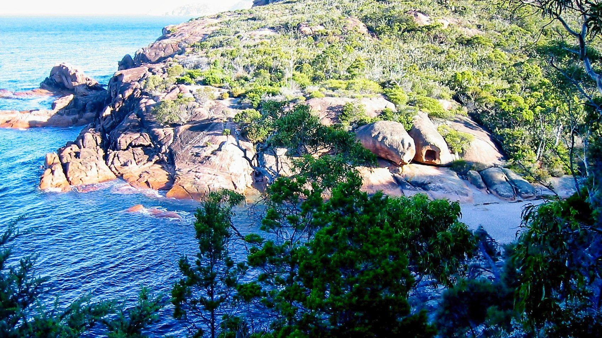
      <em>Freycinet NP</em>
    </figure>

  <figure>
      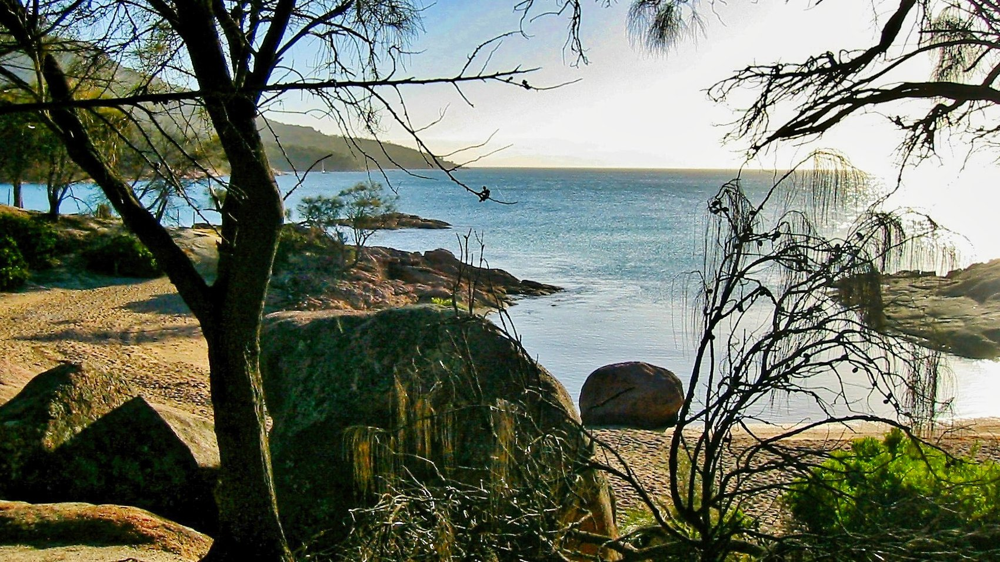
      <em>Freycinet NP</em>
    </figure>

On the way back
I stopped briefly at the equally picturesque Honeymoon Bay and ate half
a dozen delicious Tasmanian oysters at the lovely Oystercatcher in Coles
Bay, with views of the national park’s impressive rock formations. They
also serve what’s probably the best cappuccino south of Melbourne.

## 21 Feb 2005 — Freycinet National Park

Glorious summer weather today, and we spent most of the day in the
magnificent Freycinet National Park. We did a long loop: first up to the
fantastic Wineglass Lookout, with views on a Ko Phi Phi level, down to
the dazzling white beach of the same name, where we went for a swim.

  <figure>
      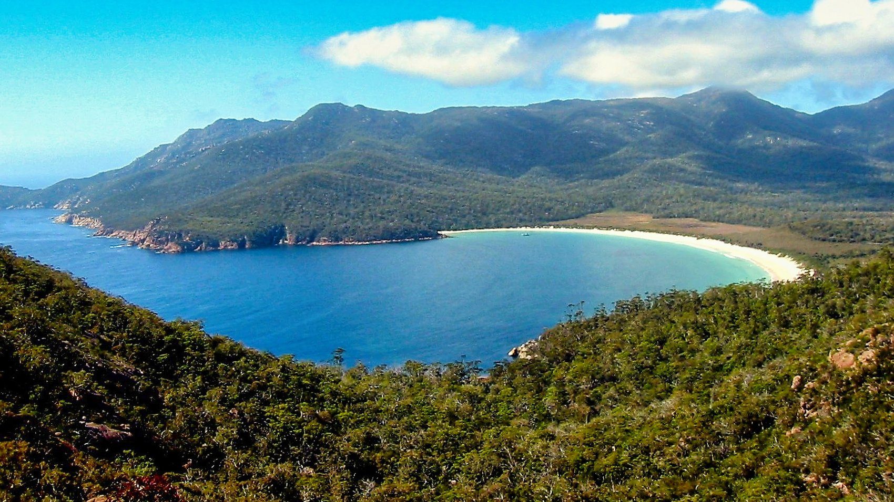
      <em>Freycinet NP</em>
    </figure>

  <figure>
      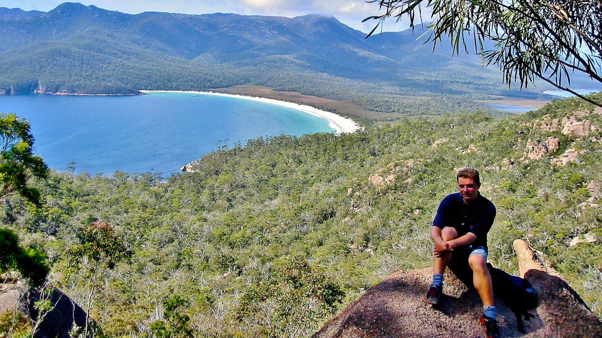
      <em>Freycinet NP</em>
    </figure>

  <figure>
      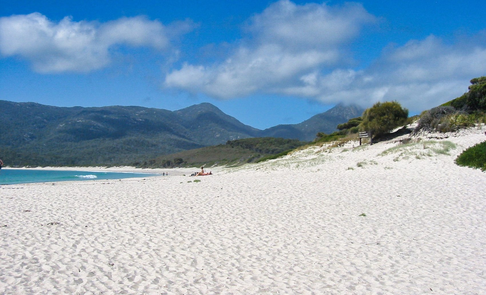
      <em>Freycinet NP</em>
    </figure>

  <figure>
      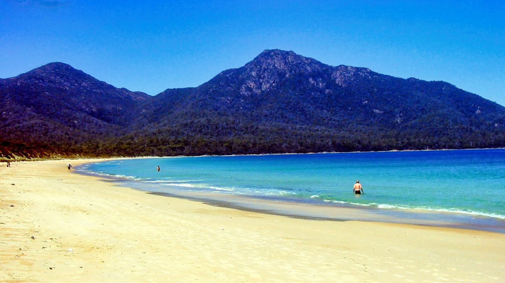
      <em>Freycinet NP</em>
    </figure>

<figure>
  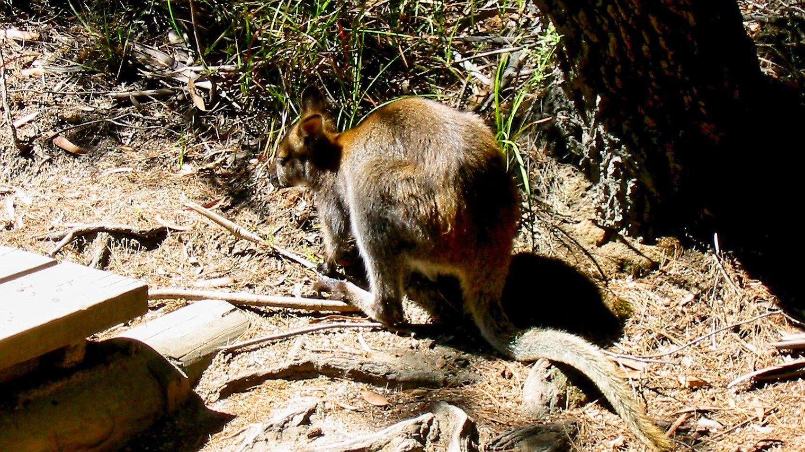
  <em>Freycinet NP</em>
</figure>

Half an hour later, across a narrow neck of the peninsula, we made it to
the almost equally magnificent Hazards Beach. The sand wasn’t dazzling
white (it was more golden) but the calm, crystal-clear water, with a
small island just offshore, was not only incredibly picturesque, it was
perfect for swimming.

The following hour and a half back to the car park along the coast was a
wonderful walk in gorgeous scenery, with views of deep‑blue sea and
white sandy beaches. Freycinet National Park is without a doubt one of
the most beautiful coastal landscapes I’ve seen so far.

In the afternoon we drove back down the lovely east coast, this time in
bright sunshine, to Richmond, where we stayed overnight at a nice small
camping ground with very good facilities (A\$16). On the way we’d bought
rump steak and wallaby for a barbecue, which was a good idea because in
Richmond everything was already shut by 6 p.m., and anyway, a proper
barbie at the campsite is simply part of the Aussie lifestyle.

## 22 Feb 2005 — Tasman Peninsula / Port Arthur area

We left our tent up at the campsite in Richmond today and, after a
smoked‑salmon pie and cappuccino at the Wine Centre, drove to the Tasman
Peninsula, another stunning coastal region with impressive scenery,
which we explored in depth.

  <figure>
      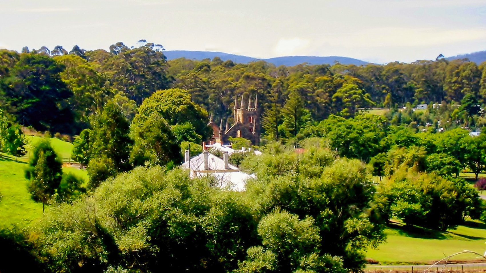
      <em>Tasman Peninsula</em>
    </figure>

  <figure>
      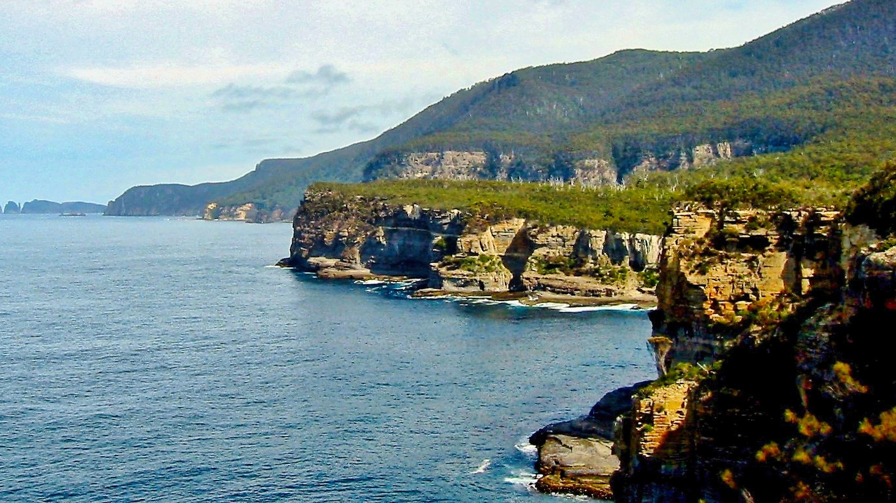
      <em>Tasman Peninsula</em>
    </figure>

Our first destination was the white sand of Fortescue Bay at the end of
a 12‑km gravel road. What I liked most there was the lagoon, with
wonderfully green water surrounded by dense forest.

  <figure>
      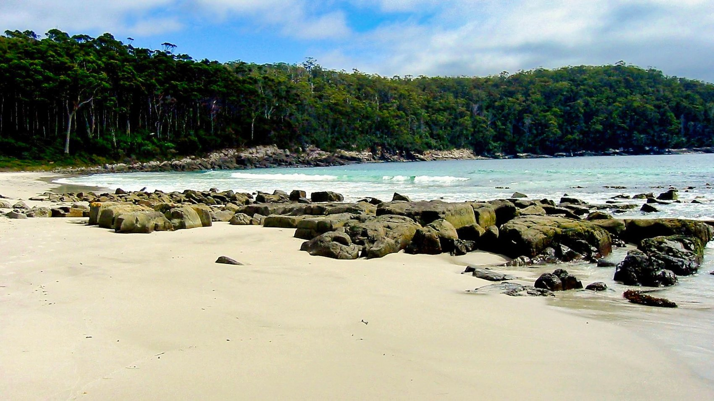
      <em>Tasman Peninsula - Fortescue Bay</em>
    </figure>

  <figure>
      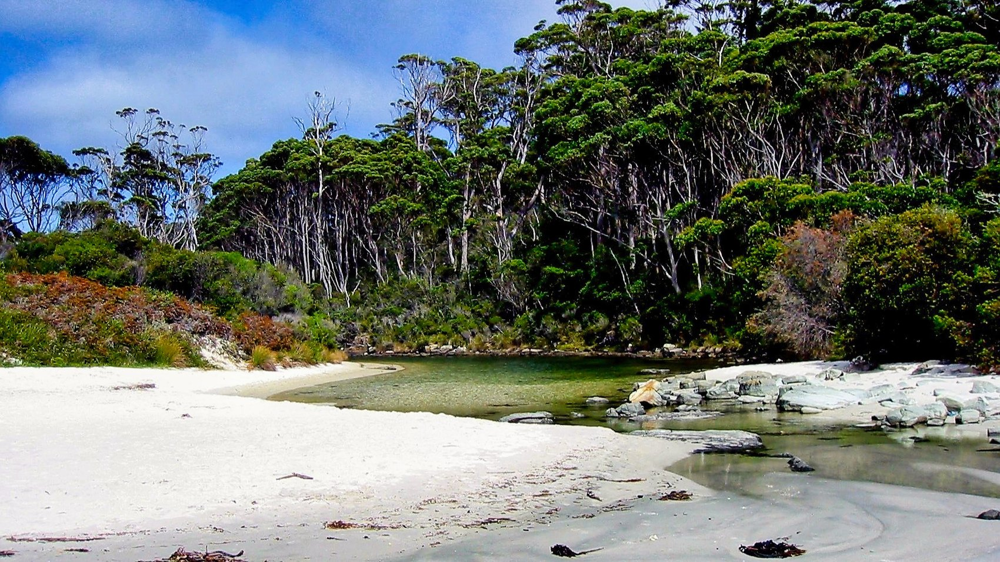
      <em>Tasman Peninsula - Fortescue Bay</em>
    </figure>

Our next stop was Port Arthur. This very well‑preserved former convict
settlement, set in beautiful scenery, is considered one of Tasmania’s
biggest tourist attractions. We were content with the view from the
lookout, though, because the A\$24 entrance fee struck us as a bit much.

<figure>
  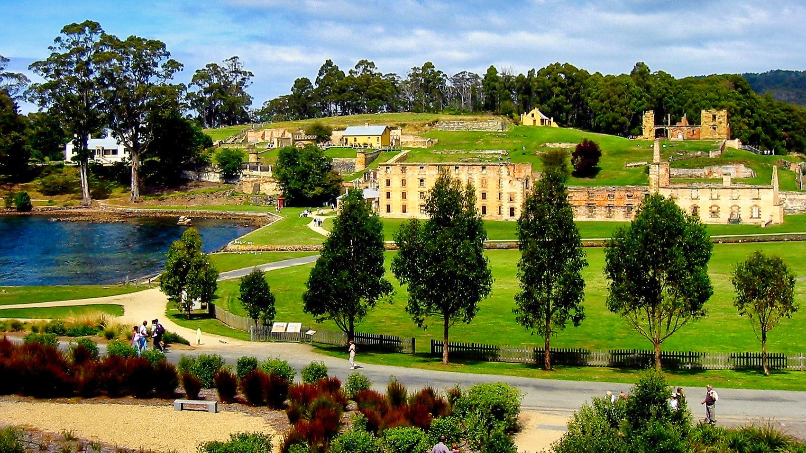
  <em>Tasman Peninsula - Port Arthur</em>
</figure>

Instead we drove along the pretty coastline to the end of the road,
where Remarkable Cave was a real highlight: a rock opening shaped like
Tasmania in a beautiful bay. Truly remarkable!

<figure>
  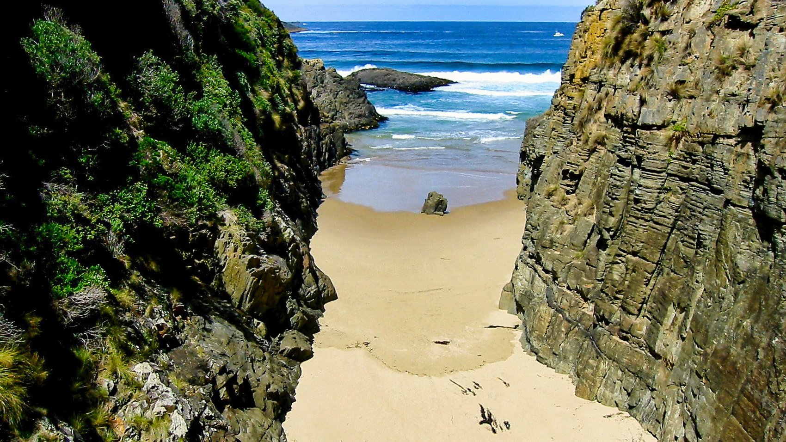
  <em>Tasman Peninsula - Remarkable Cave</em>
</figure>

We also drove around the rest of the peninsula (White Beach, Nubeena:
wonderful scenery, green meadows, forests, lonely beaches) and at
Eaglehawk Neck walked to the various viewpoints along the imposing wild
cliffs on the peninsula’s eastern side.

On the way back to the campsite we bought fresh seafood for a barbecue:
snapper and trevally (the local fish), plus a whole big lobster at the
bargain price of A\$8. Delicious.

## 23 Feb 2005 — Huon Valley / Cockle Creek / Snug

After a cappuccino at Maldini on Salamanca Square in Hobart we drove up
to the Mt Nelson Lookout high above the city to enjoy the view, then
continued through the beautiful Huon River Valley (with its orchards,
vineyards and historic little towns, like the charming Franklin)
towards the south coast.

<figure>
  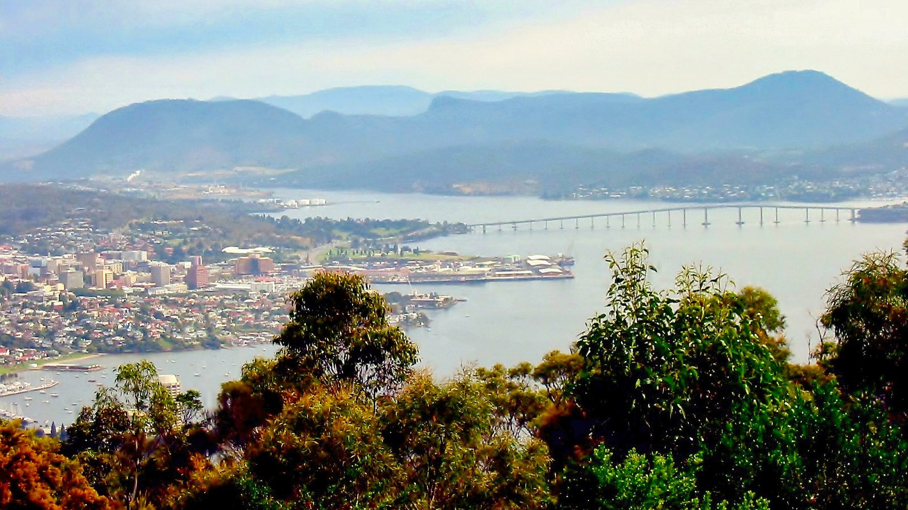
  <em>Hobart - Nelson Lookout</em>
</figure>

Near Geeveston we took a detour into the Southern Forests and did a
short walk at Keoghs Creek. The main goal today, however, was Cockle
Creek at the end of the southernmost road in Australia. The last 20 km
were dirt road, but the trip down was absolutely worth it: wonderful
white sandy bays in beautiful coastal scenery with a lagoon, a remote,
unspoilt area with something magical about it.

  <figure>
      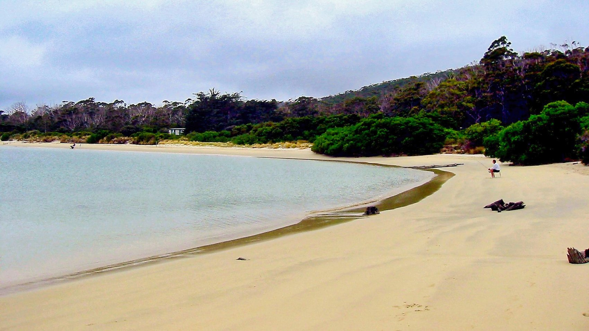
      <em>Cockle Creek</em>
    </figure>

  <figure>
      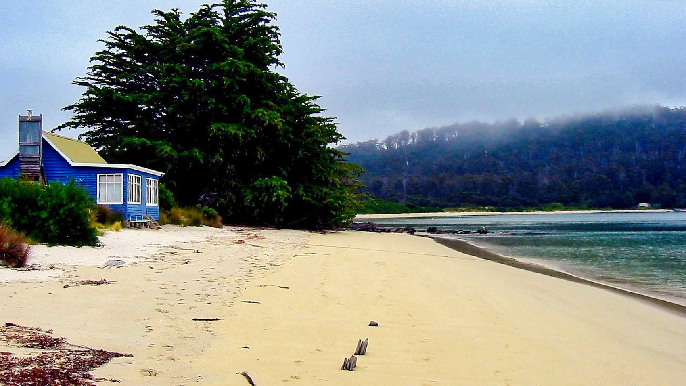
      <em>Cockle Creek</em>
    </figure>

We had a picnic and a swim before returning to civilisation, which in
Tasmania isn’t exactly loud or hectic anyway. The entire drive (first
along the Huon River, then along the coast almost to Hobart) was
gorgeous: great views, hardly any settlements.

  <figure>
      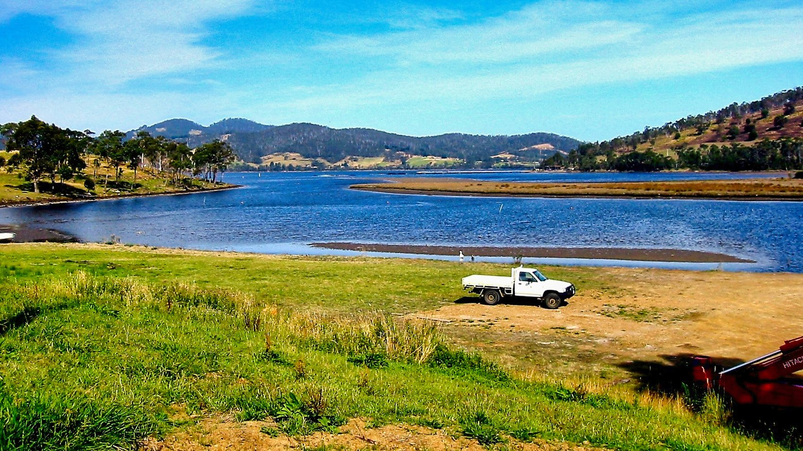
      <em>Huon River Valley</em>
    </figure>

  <figure>
      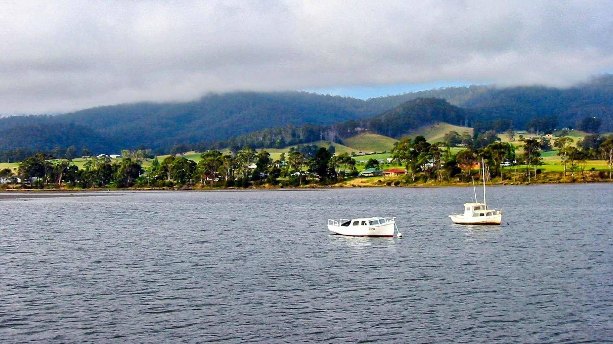
      <em>Huon River Valley</em>
    </figure>

  <figure>
      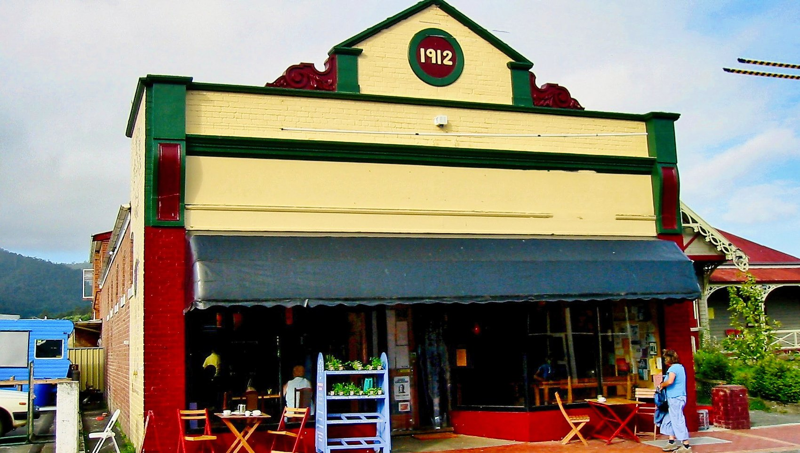
      <em>Huon River Valley</em>
    </figure>

  <figure>
      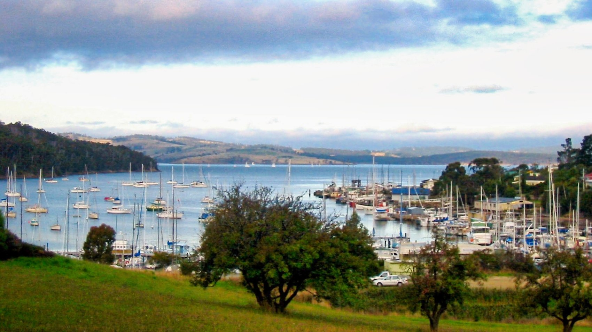
      <em>Huon River Valley</em>
    </figure>

We made just one stop in the nice historic little town of Cygnet, on a
picturesque bay, where we had cappuccino and delicious chocolate cake at
the Red Velvet Lounge, a funky, alternative eco‑café.

Our campsite in Snug, south of Hobart, was the best we’d had so far: a
grassy pitch right by the sea with views of Bruny Island, a cosy kitchen
where we could grill lamb fillet, and excellent modern facilities, all
for A\$16.

## 24 Feb 2005 — Bruny Island

As our last stop before Hobart we did a day trip to Bruny Island, which
we could already see from our campsite. The ferry crossing took only 15
minutes and cost A\$25 return.

Despite being so close to Hobart, Bruny is still considered something of
an insider tip: sparsely populated, beautifully scenic, with long white
sandy beaches, lovely bays, wooded hills, and that “end of the world”
landscape around the windy Cape Bruny lighthouse.

  <figure>
      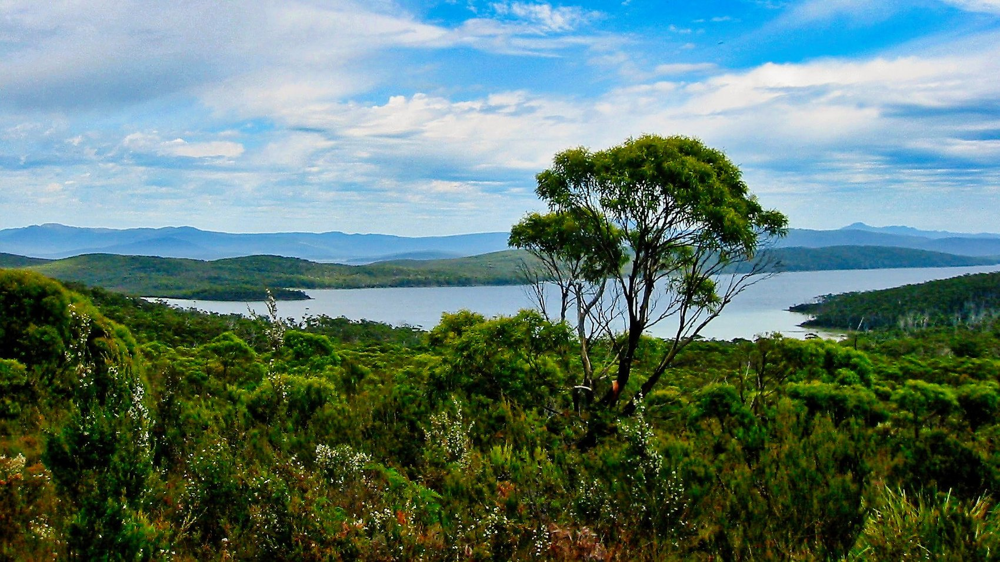
      <em>Bruny Island</em>
    </figure>

  <figure>
      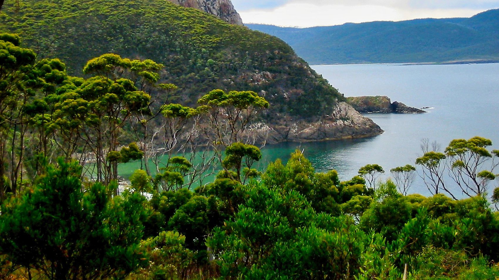
      <em>Bruny Island</em>
    </figure>

  <figure>
      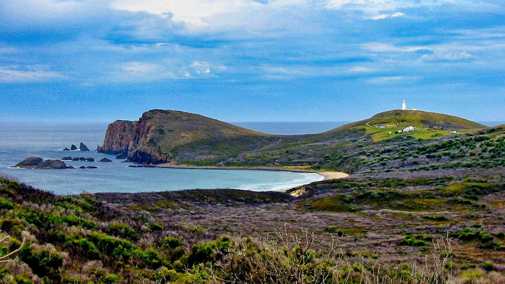
      <em>Bruny Island</em>
    </figure>

  <figure>
      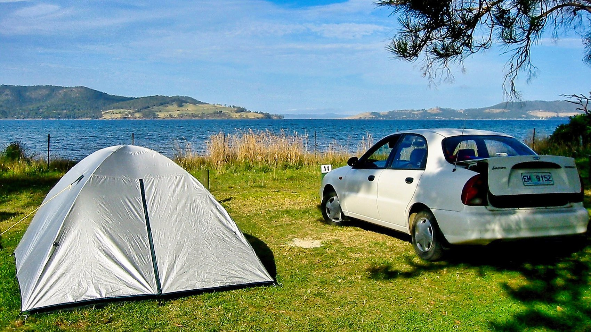
      <em>Bruny Island</em>
    </figure>

Most of the island’s roads are unsealed, but easy enough to drive, and
we drove almost all of them. After a delicious lunch at the wonderfully
pretty Penguin Café in Adventure Bay we hiked up to the 300‑metre Fluted
Cape (2 hours), and in the afternoon we went swimming at the
kilometres‑long beach on the narrow strip of land that connects North
and South Bruny.

In the evening we did another gourmet barbecue at the campsite. Tasmania
is truly blessed with fresh produce of the highest quality: we bought
fruit (strawberries, cherries, apricots), a piece of fish fillet, and
lots of scallops, not only delicious here, but also abundant and
therefore cheap.

## 26 Feb 2005 — Hobart

We spent the last two days in Hobart, Tasmania’s small, relaxed,
beautifully located capital, which has plenty to offer: lots of
well‑preserved historic buildings (even in the CBD); the cafés on
Salamanca Place with its colonial sandstone buildings; Battery Point,
the oldest part of Hobart, a genuinely picturesque village of
wonderfully photogenic terraced houses, cafés, restaurants and a quiet
atmosphere.

  <figure>
      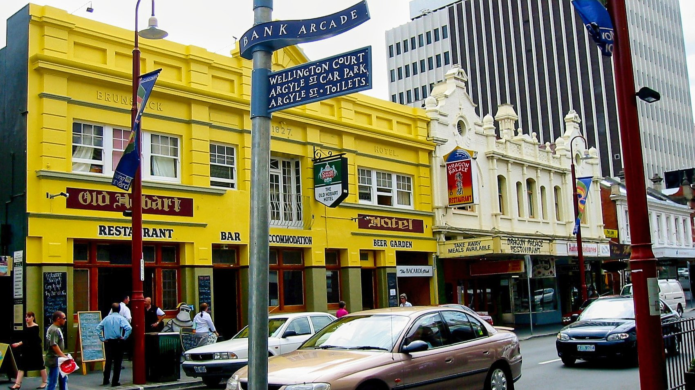
      <em>Hobart</em>
    </figure>

  <figure>
      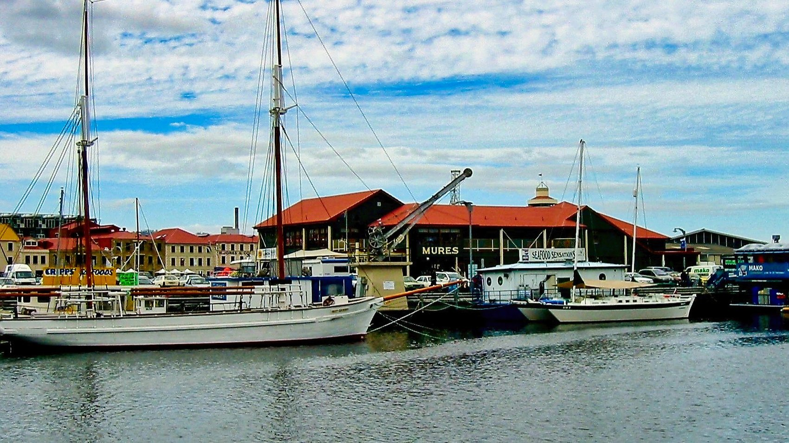
      <em>Hobart</em>
    </figure>

And from almost everywhere in the city you can see the majestic
1,300‑metre Mount Wellington towering above it all; from the summit you
get impressive views over Hobart and Tasmania’s entire south‑east coast.
Also well worth doing was a harbour cruise on an old tourist boat (A\$17
for 90 minutes) for a different perspective.

  <figure>
      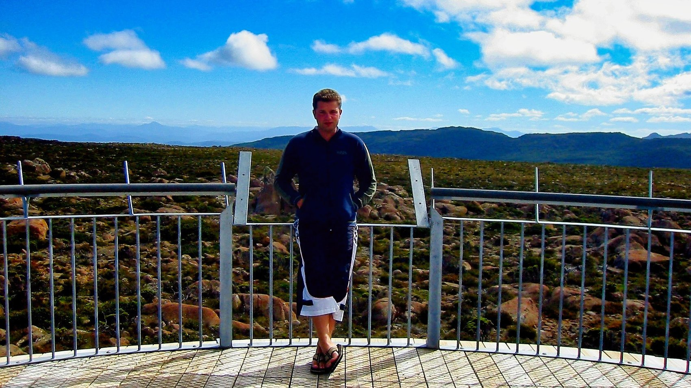
      <em>Hobart</em>
    </figure>

  <figure>
      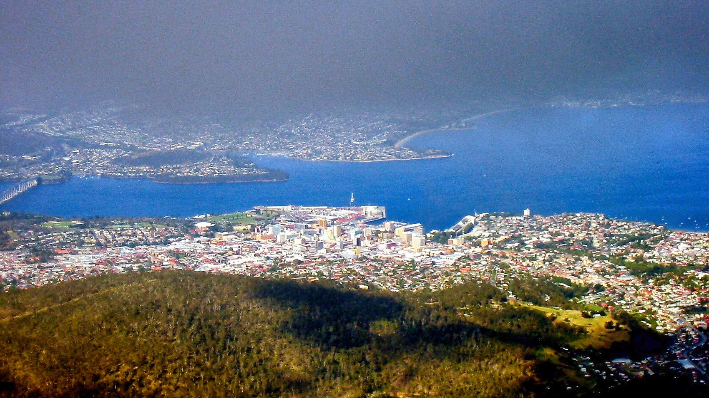
      <em>Hobart</em>
    </figure>

Every Saturday Hobart also has what’s arguably the biggest outdoor
market for a city this size: the fantastic Salamanca Market, with
hundreds of stalls where you can buy pretty much anything, from koala
plush toys to German currywurst.

  <figure>
      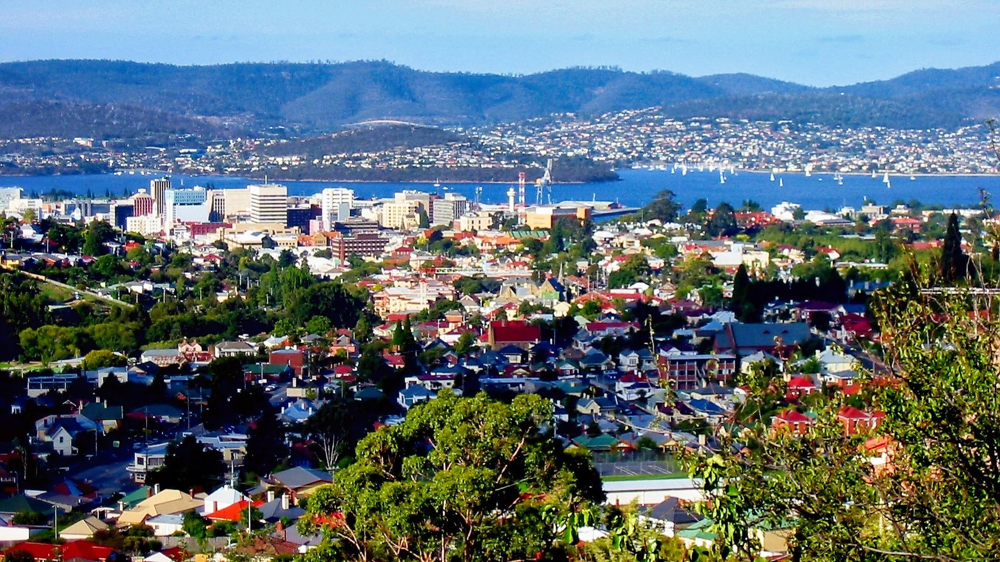
      <em>Hobart</em>
    </figure>

  <figure>
      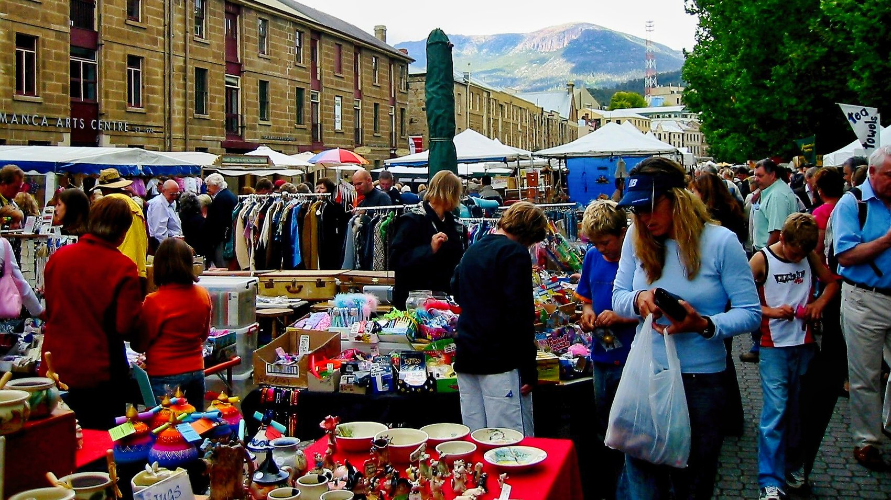
      <em>Hobart</em>
    </figure>

Hobart has a lot to offer food‑wise too: countless seafood restaurants
and stalls at the harbour, and a big choice of ethnic food, especially
on the restaurant strip in North Hobart. On the first day we ate at
Curry & Tandoor House, a very authentic, cheap Indian. The prawn
vindaloo (A\$16) was devilishly hot, as it should be, and the chicken
korma (A\$13) was also very good.

On Saturday lunchtime we ate grilled fish (A\$20) and a calamari salad
(A\$12) at Fish Frenzy at the harbour, and in the evening we went for
Asian at Dede, a restaurant with Indonesian and Thai food, an unusual
combination, but the food was good, especially the Indonesian dishes,
and reasonably priced: chicken satay (A\$6.60), scallops in plum‑soy
sauce with garlic and basil (A\$18). The pad thai (A\$13.50) was rather
mediocre.

As far as cafés go, Queenshead in North Hobart had the best cappuccino;
the prettiest café was The Village Store in Battery Point.

  <figure>
      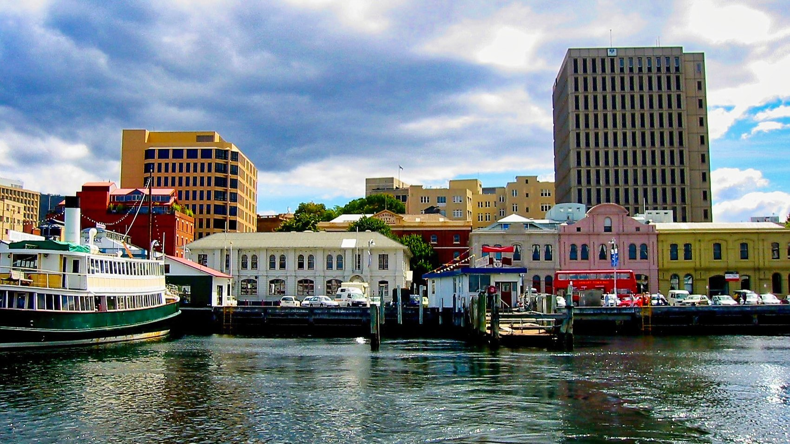
      <em>Hobart</em>
    </figure>

  <figure>
      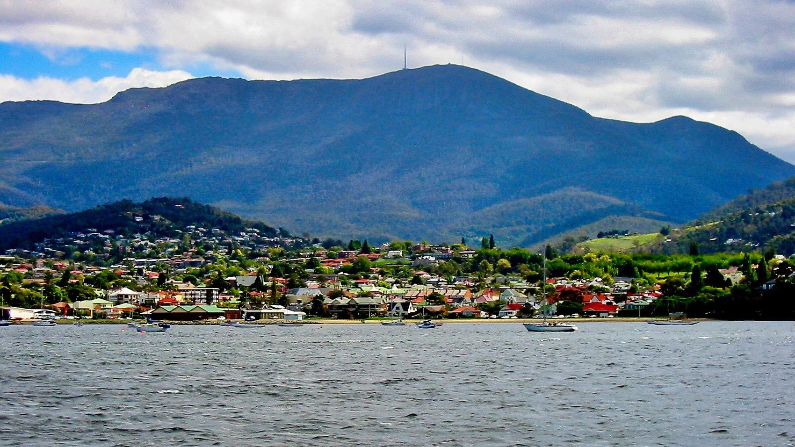
      <em>Hobart</em>
    </figure>

And when it
comes to pubs, Hobart feels very cosmopolitan too: and pretty much
everywhere they had a delicious liquorice-like stout on tap, Cascade
Special Stout. We went to Shipswrights Arms Hotel in Battery Point,
Irish Murphy’s at Salamanca Place, and Bells & Anchor, supposedly
Australia’s oldest pub.

We stayed at Narrara Backpackers, relatively central, about a 10‑minute
walk from the centre, a small hostel in a pretty old house and cheap
(A\$44 for a twin). That’s the good news. The room was very small, the
shared areas weren’t always clean, and a lot of things (showers,
internet…) could do with being fixed up.

## 1 Mar 2005 — Tasmania: North‑East Coast / Launceston / back to Melbourne

On Sunday morning, after a small breakfast and good coffee at Sal’s on
Salamanca Place, we left Hobart in bright sunshine heading north on the
Heritage Highway, which connects the capital with Launceston. It runs
through a landscape that, for Tasmania, is fairly unspectacular, very
dry, brown summer hills that feel almost Southern‑European.

To relieve the monotony, there are a few pretty historic little towns
along the way, like Oatlands or the picturesque village of Ross.

  <figure>
      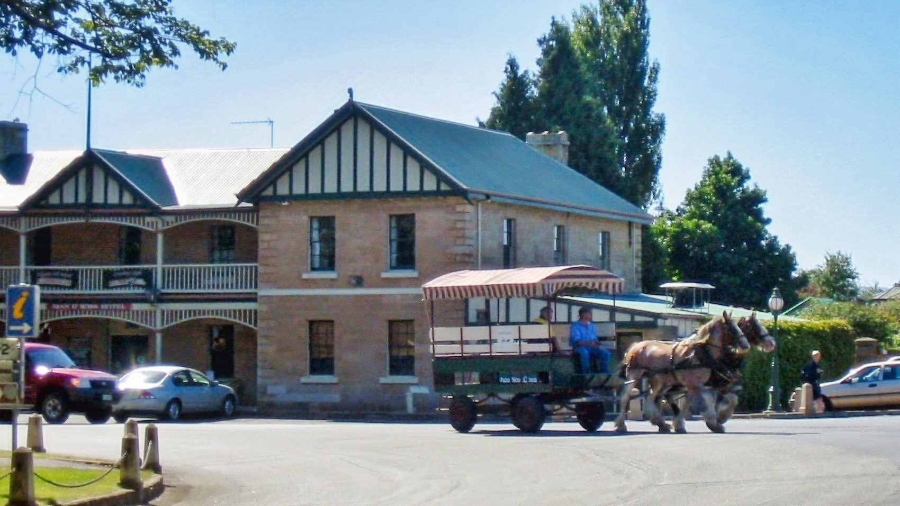
      <em>Ross</em>
    </figure>

  <figure>
      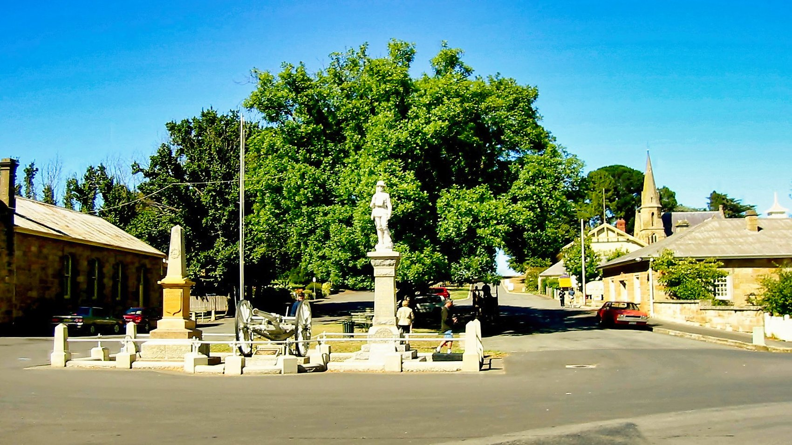
      <em>Ross</em>
    </figure>

North
of Ross we left the highway and headed for the north‑east coast. The
closer we got to the sea, the lusher and greener the vegetation became.

At the Mount Elephant Pass near the coast there’s a beautiful little
countryside café in the middle of nowhere with tasty crêpe specialities,
not cheap, though (A\$16.50 for a crêpe filled with chicken,
blueberries and camembert).

<figure>
  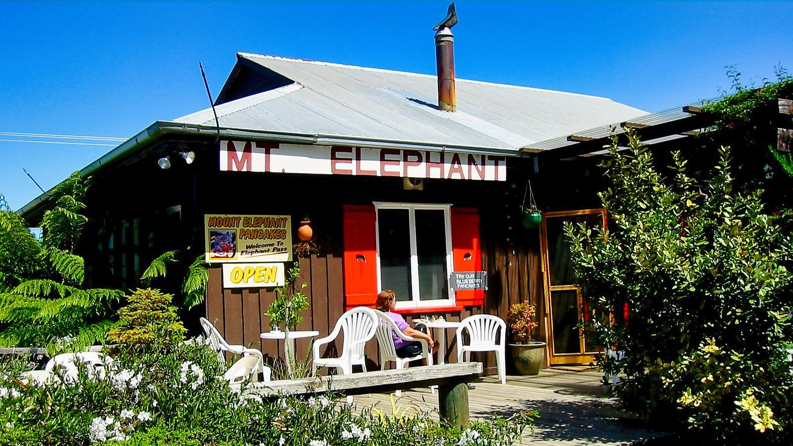
  <em>Mt. Elephant Pass</em>
</figure>

After the pass we hit the coastal road at
the grand, long Lagoon Beach. As far as St Helens the road runs past
white, untouched beaches and beautiful lagoons.

  <figure>
      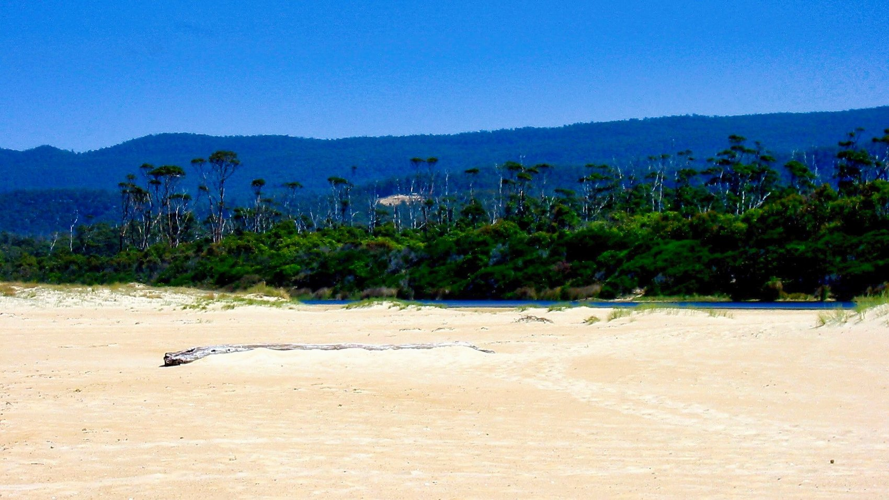
      <em>Around St. Helens</em>
    </figure>

  <figure>
      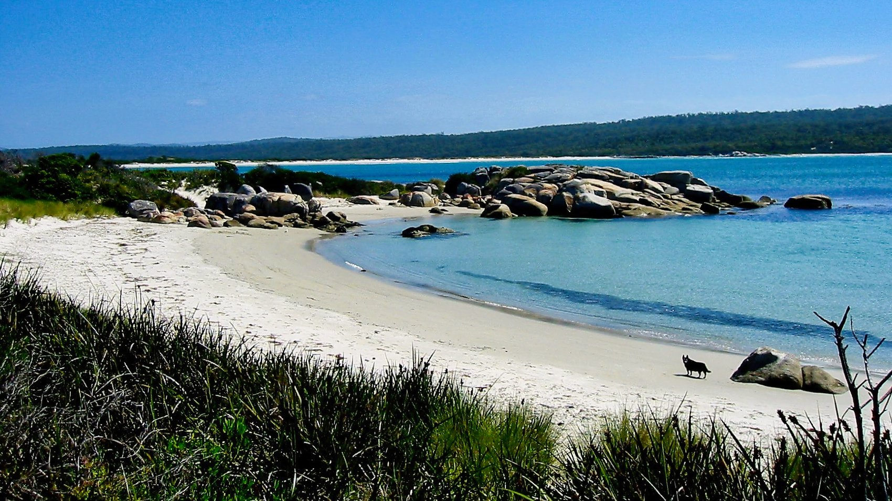
      <em>Around St. Helens</em>
    </figure>

<figure>
  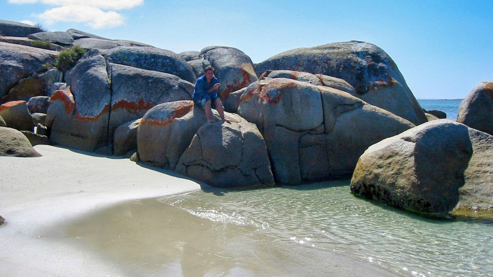
  <em>Around St. Helens</em>
</figure>

<figure>
  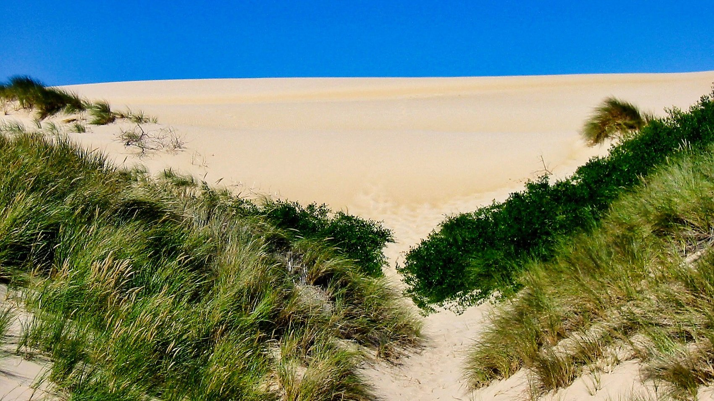
  <em>Around St. Helens - Peron Dunes</em>
</figure>

One of Tasmania’s most beautiful coastal landscapes (and that’s saying
something) lies between St Helens and the cape of the same name on a
peninsula: the wonderful Peron sand dunes above an endless white beach
on the south side, and small coves in postcard scenery on the north
side, where we even dared a swim in the calm, crystal‑clear water.

After that we visited a cheese farm in Pyengana (they also made an
excellent cappuccino) and also did two short inland walks to waterfalls,
and the rainforest walk to the 90-metre-high St Columba Falls was
particularly wonderful

<figure>
  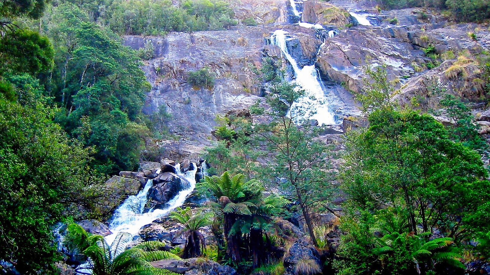
  <em>St. Columba Falls</em>
</figure>

The road from there was a horrible gravel track through the forest and
we were lucky our car made it. Back on sealed roads we drove through
very picturesque, almost pre‑alpine rolling hills, past countless cow
pastures, to Scottsdale, where we could stay for free at the municipal
campsite. In itself it’s a lovely spot in a park with grass, barbecues
and a small pond. Unfortunately the facilities were old and grubby, but
you know what they say about gift horses…

We spent our last day in Launceston mostly doing chores: laundry,
packing, returning the car, etc.

<figure>
  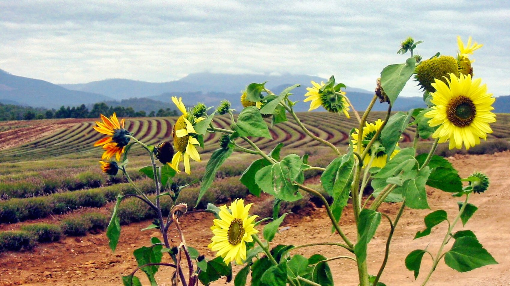
  <em>Around Launceston</em>
</figure>

We treated ourselves to lunch at
Stillwater, considered one of Tasmania’s best restaurants, though with
all the great fresh produce here you don’t have to be a genius to put
good food on a plate. The fish fillet with ginger mash was tasty, as
were the scallops in soy‑mirin sauce, but I suspect I could have managed
to cook this just as well. With main courses at A\$20–25 it isn’t cheap,
but eating well in a nice setting is still nice.

We stayed again at the Launceston Backpackers and flew back to Melbourne
the next morning (Virgin Blue, A\$58).

<figure>
  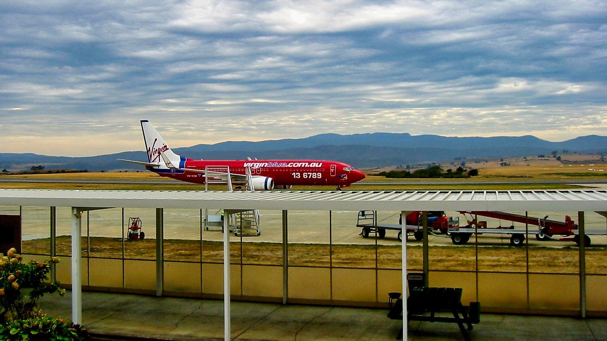
  <em>Launceston Airport</em>
</figure>

## 3 Mar 2005 — Leaving Australia: Great Ocean Road / Ballarat / Geelong

I’m lying in a half‑empty plane (Thai Airways from Melbourne to
Bangkok), with a whole row of seats to myself. A long‑haul flight really
doesn’t get better than that. And still I’m a little sad to be leaving
Australia for good, much as I’m looking forward to Asia and to seeing
Elaine again. I had a bloody great time here, and I wish I had more
time and money to travel Australia properly.

After we arrived in Melbourne around noontime we rented a car for the
last two days to drive the Great Ocean Road, one of the most beautiful
coastal roads in the world, and from Melbourne it’s just a 700‑km loop,
which is nothing by Australian standards. The Great Ocean Road really is
well worth it and incredibly varied.

<figure>
  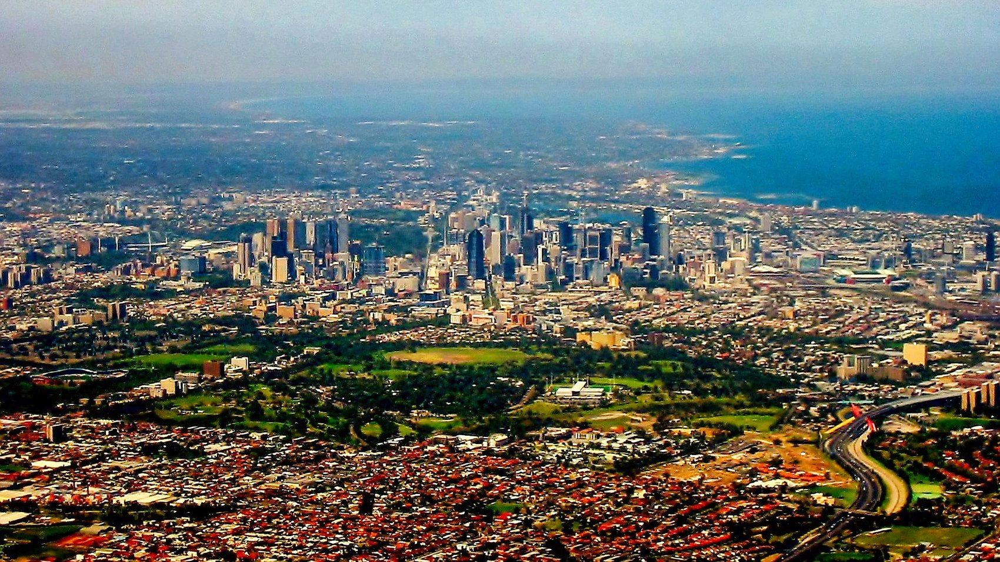
  <em>Melbourne</em>
</figure>

Over those two days we saw cute koalas in their natural habitat on Cape
Otway Road; impressive green coastline with lonely beaches between
Anglesea and Apollo Bay; the beautiful Erskine Falls in rainforest near
Lorne; dense eucalyptus forests; gentle green hill country that much
reminded me of the Wild Coast of South Africa’s Transkei; and, of
course, the famous sandstone formations around Port Campbell: the
postcard scenes of the Twelve Apostles, Gibson Beach, Loch Ard Gorge,
and so on.

  <figure>
      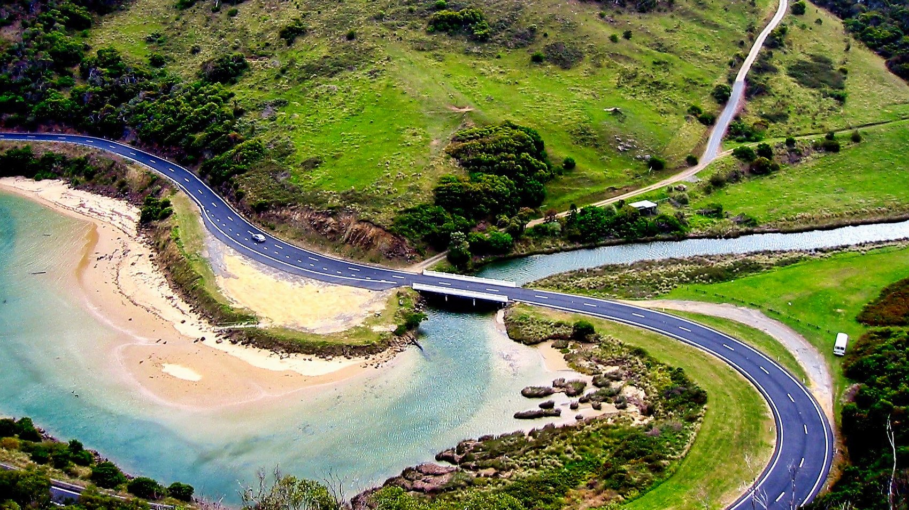
      <em>Great Ocean Road</em>
    </figure>

  <figure>
      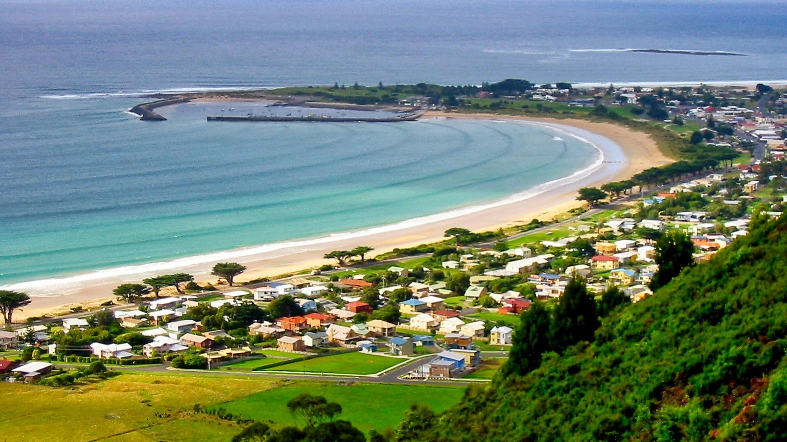
      <em>Great Ocean Road</em>
    </figure>

  <figure>
      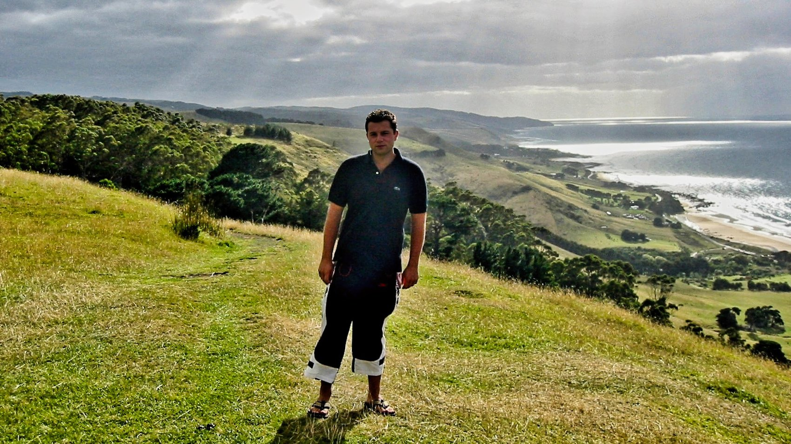
      <em>Great Ocean Road</em>
    </figure>

  <figure>
      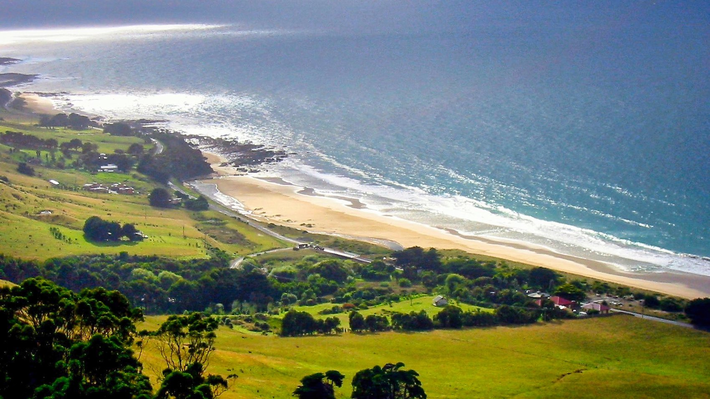
      <em>Great Ocean Road</em>
    </figure>

<figure>
  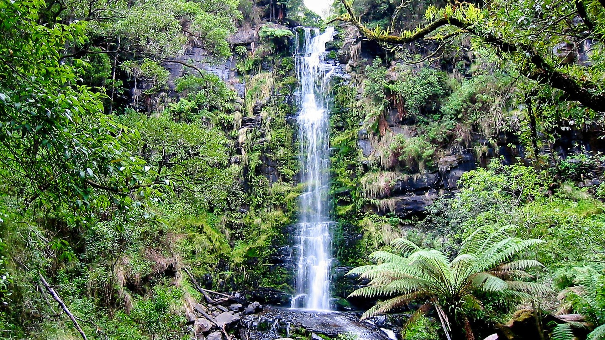
  <em>Great Ocean Road - Erskine Falls</em>
</figure>

<figure>
  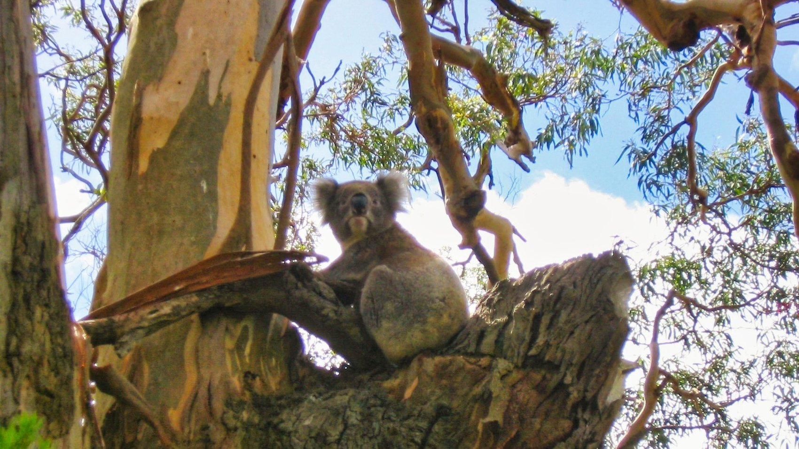
  <em>Great Ocean Road - Cape Otway Rd</em>
</figure>

  <figure>
      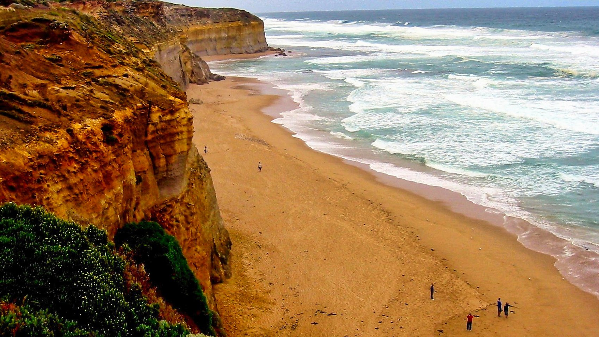
      <em>Great Ocean Road - Around Port Campbell</em>
    </figure>

  <figure>
      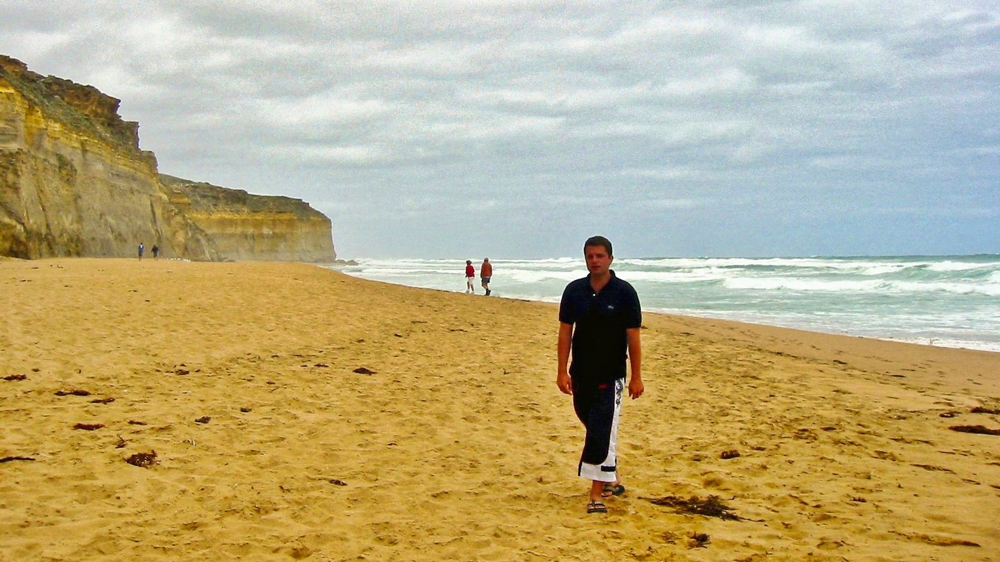
      <em>Great Ocean Road - Around Port Campbell</em>
    </figure>

  <figure>
      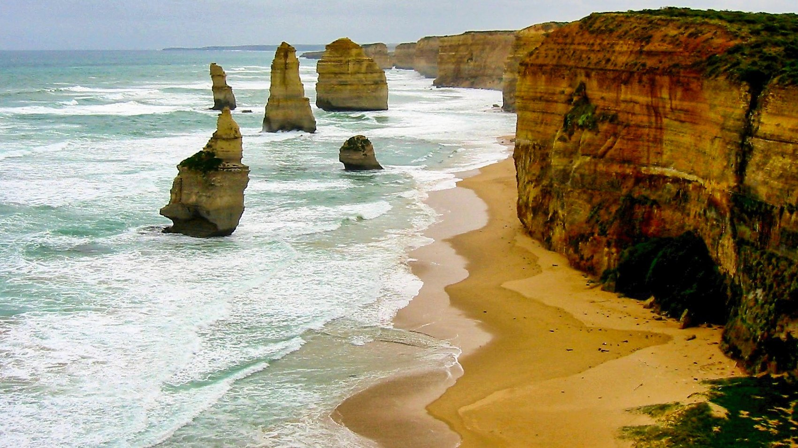
      <em>Great Ocean Road - Around Port Campbell</em>
    </figure>

  <figure>
      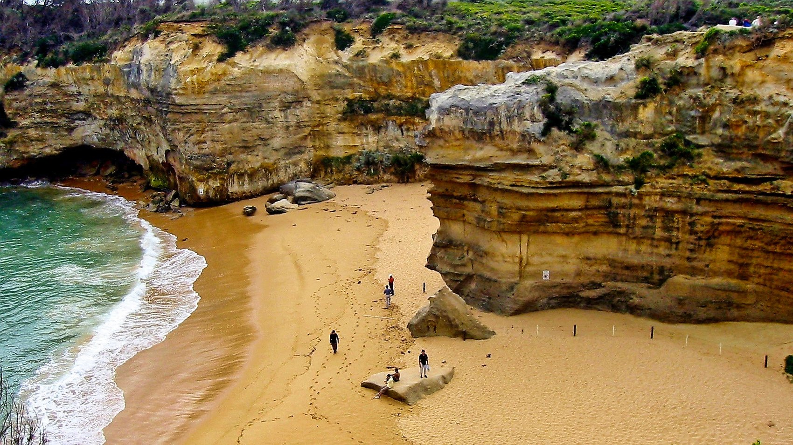
      <em>Great Ocean Road - Around Port Campbell</em>
    </figure>

<figure>
  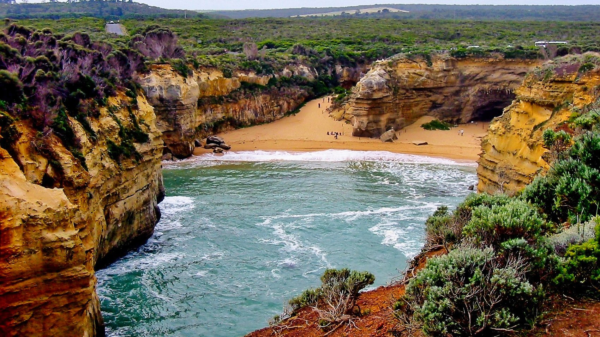
  <em>Great Ocean Road - Around Port Campbell</em>
</figure>

We spent the first night at a wonderfully located small campsite (A\$20)
near Lorne, right by Cumberland Creek in a pretty little canyon where
ducks and kangaroos wandered around on the grass. We enjoyed a delicious
seafood dinner at the Pier Restaurant in Lorne right by the sea: tasty
grilled baby snapper (A\$28) and garlic scallops (A\$15), plus a
beautiful sunset over Lorne.

  <figure>
      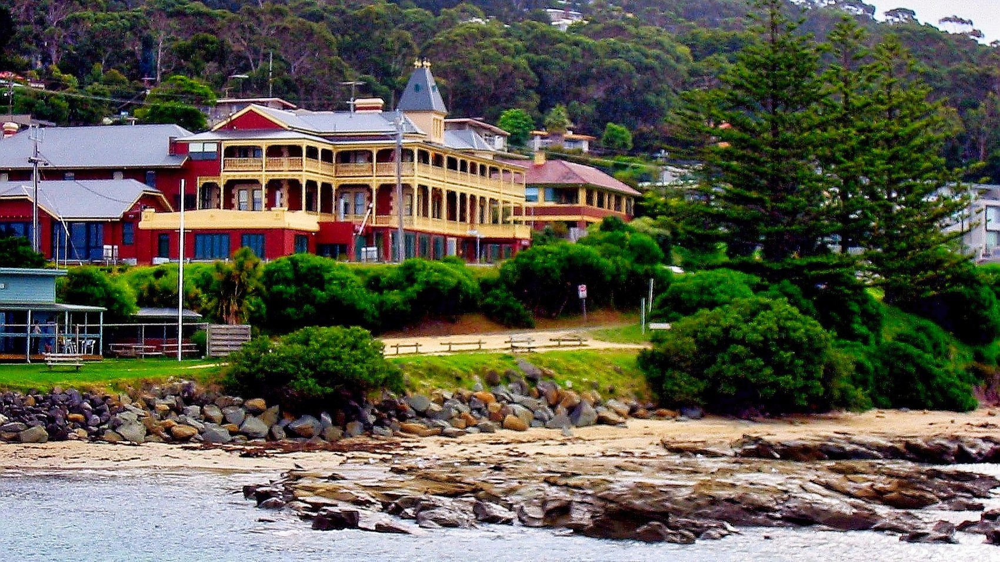
      <em>Great Ocean Road - Lorne</em>
    </figure>

  <figure>
      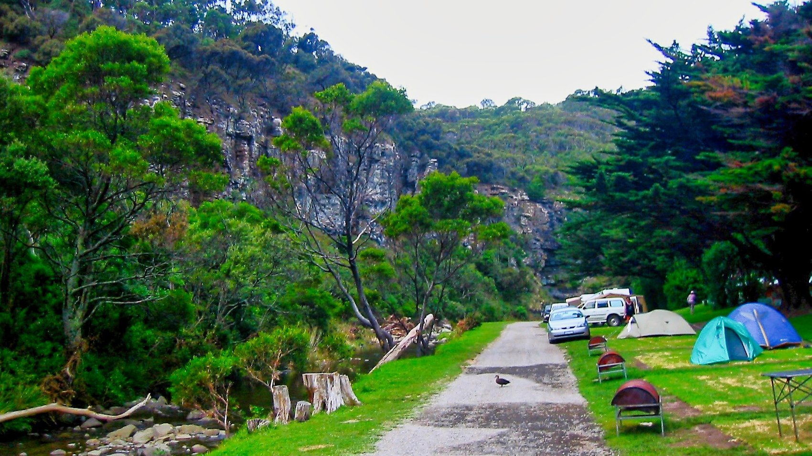
      <em>Great Ocean Road - Lorne</em>
    </figure>

On the way back to Melbourne we made a detour to Ballarat, a former
gold‑rush boomtown whose centre still has magnificent 19th‑century
buildings, at a scale and harmony you rarely find in Australia.

  <figure>
      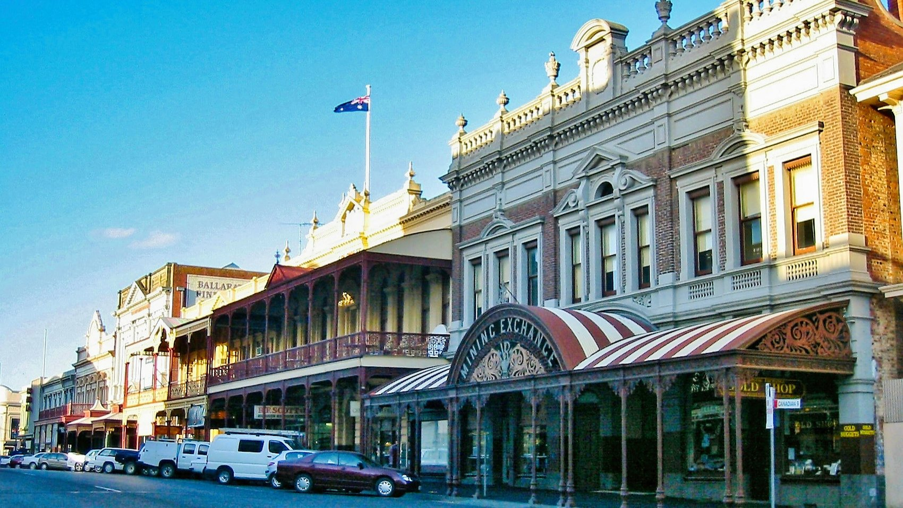
      <em>Ballarat</em>
    </figure>

  <figure>
      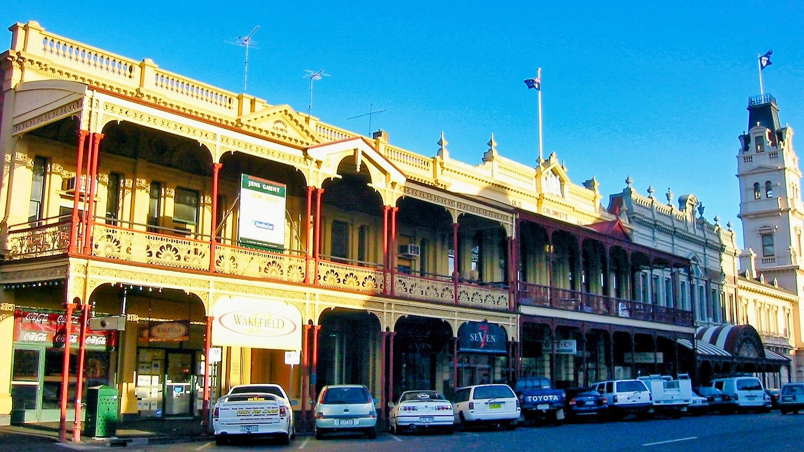
      <em>Ballarat</em>
    </figure>

There’s
a reason Ballarat is one of Victoria’s biggest tourist attractions.

On the last evening we treated ourselves once more to a very good dinner
at the Gamekeepers Inn, despite the kitschy safari décor a rather
upmarket restaurant with typical Australian food: a grill platter with
buffalo, kangaroo and emu (A\$26), and a seafood plate with scallops,
prawns and squid (A\$25), plus crisp fresh vegetables. A nice culinary
finale.

We spent the night at the Formule 1 at the airport. The rooms (A\$69)
are all en‑suite here in Australia, but otherwise they’re no different
from the French standard.

After I drove Mona to Avalon airport this morning, I spent a few hours
in Geelong, Victoria’s second‑largest city, 75 km south of Melbourne.
Despite the big, ugly industrial plants around the city, Geelong is
worth a short detour. Even if Lonely Planet is probably right when they
say, “Geelong isn’t a city where you spend your honeymoon,” it still has
a very pretty green harbour promenade and enough street cafés to be
reasonably attractive, and more than that: right in the centre of
Geelong there was a Bretzel café that bakes possibly the best pretzels
east of Stuttgart.

<figure>
  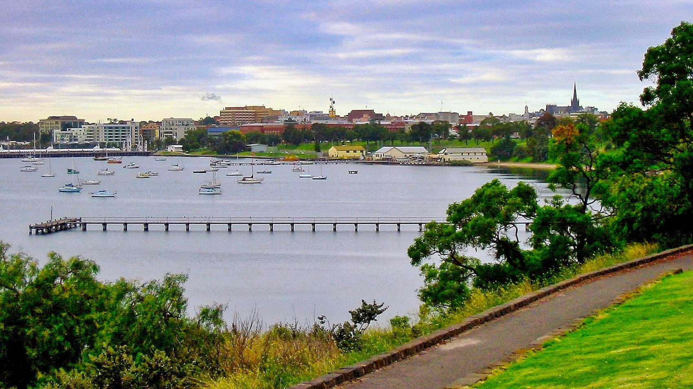
  <em>Geelong</em>
</figure>

Good‑bye, Australia!

