# Palawan Revisited
**March 2025**

Sixteen years after my first long journey through Palawan, we returned to ride the island once more, this time as a couple on a rented Honda XRM, from Puerto Princesa up to El Nido and back. Much has changed, some of it beyond recognition; much, thankfully, has not.

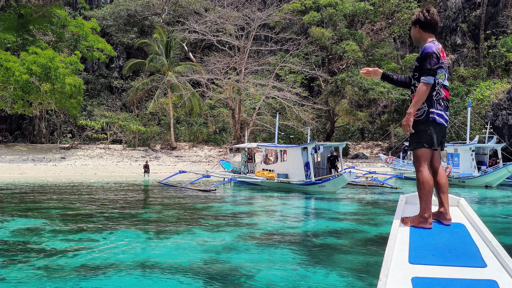
*The Bacuit Archipelago off El Nido*

---

## 15 March 2025

We flew in from Manila and reached Puerto Princesa in the afternoon. The bike was already waiting: we had rented a Honda XRM from Palawan Peter Motorcycle (370 pesos per day for thirteen days), and the whole arrangement was as easy and straightforward as motorbike rental gets, very good communication, no passport deposit needed, and the bike delivered to the airport on the evening of our arrival. Highly recommended if you are planning the same trip.

Our base for the first nights was Filigan's Hotel on Rizal Avenue, a basic RedDoorz place without any charm but clean enough, and at 700 pesos perfectly acceptable for a provincial capital that has never been famous for its accommodation.

Puerto Princesa has grown enormously since 2009, but at its core it is still the same likeable, unhurried town, more a place you pass through than a destination in itself. That said, it has always been a good town for eating, and the first evening confirmed it.

Our first stop was [Palaweño Brewery](https://andrestgt.github.io/food/philippines/puerto-princesa/bars-pubs/palaweno-brewery/), the town's only craft beer microbrewery, a friendly place with a nice garden setting, but with not much choice, barely any food options and hardly any guests. The beer is expensive but tasty, and the place could be great; Puerto, it seems, is simply not ready yet for this kind of thing.

Dinner made up for everything. [KaLui](https://andrestgt.github.io/food/philippines/puerto-princesa/restaurants/kalui-seafood/) was the one restaurant I had insisted on revisiting. I first ate here almost two decades ago, alone, working my way through the set seafood menu for two, an incredible deal at 395 pesos at the time. The set menu is now closer to 900, but if anything the place has become even more beautiful, and the service even more attentive. We had a generous portion of tuna sashimi, seafood sisig and squid adobo in its ink, all of impeccable quality, and the whole bill, including beers and a cocktail, stayed under 1,500 pesos. Still a must in Puerto Princesa.

Around ten we moved on to [BeerUp TapRoom](https://andrestgt.github.io/food/philippines/puerto-princesa/bars-pubs/beerup-taproom/), and the same theme as at Palaweño repeated itself. The bar was completely empty on a Saturday night, and despite the name there was not a single beer on tap; they keep a decent selection of cans and bottles, but an empty bar simply has no atmosphere. A real pity, because the place has genuine potential.

The night ended, well past midnight, at [Tiki Resto Bar](https://andrestgt.github.io/food/philippines/puerto-princesa/bars-pubs/tiki-resto-bar/). I know I would have loved this place twenty years ago. The live band is actually quite good, but they hardly play; most of the evening belongs to a DJ blasting far less enjoyable music with a "rapper" shouting over it. Most beers were out of stock, and there is a 50 peso entrance fee that would feel fair if the band had more stage time. Still, it is a casual, good-natured, anything-goes kind of place with a fun mix of locals, Western backpackers and older expats, and we did not regret going.

## 16 March 2025

The next day was dedicated to Puerto itself, and mostly to its food. The morning began at [Capheinated](https://andrestgt.github.io/food/philippines/puerto-princesa/cafes/capheinated/), a tiny place serving very authentic Vietnamese cà phê phin; the đen đá is as black as the night and strong enough to curl your toenails. Palawan's Vietnamese heritage, a legacy of the refugee community that settled here in the eighties, survives in these places and in the chaolong joints all over the island, and it is one of the things that make eating here different from the rest of the country.

Lunch was at [Lato](https://andrestgt.github.io/food/philippines/puerto-princesa/restaurants/lato-coffee-and-restaurant/), an upmarket carinderia with sea views on Puerto's rather forlorn Baywalk. They do a good range of Filipino favourites, kinilaw, ensaladang talong, dinuguan, at prices on the high side for what is essentially canteen style food, but the quality is there and the service is excellent. They even have functioning WiFi, which in this town counts as a rare bonus.

In the late afternoon we rode out to [Neva's Place](https://andrestgt.github.io/food/philippines/puerto-princesa/restaurants/nevas-place/). Anyone who knows Neva's in Dumaguete will recognise the concept, and I am still not sure whether the two are related or one simply borrowed the idea. Either way it works: really good pizza at very competitive prices in a beautiful, peaceful garden setting, even nicer than the Dumaguete original. Their "Kuripot" pizza replaces the mozzarella with synthetic Filipino cheese, which sounds like a crime and tastes surprisingly good.

<figure>
  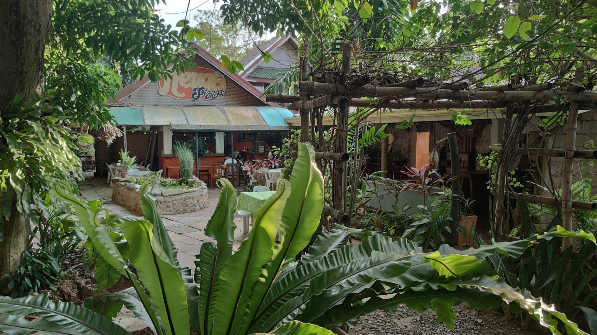
  <em>Puerto Princesa - Neva's Place</em>
</figure>

The evening brought one of those finds that are great for exactly one reason. [Majo-Imbiss](https://andrestgt.github.io/food/philippines/puerto-princesa/restaurants/majo-imbiss/) is a basic German eatery with a bar and a nice garden, and their litro bottles of Beer na Beer are very cheap, which alone makes it worth knowing about. The food, sadly, is another matter: not professional, not even tasty amateur home cooking, and the burgers came dry, with cold cheese. Come for the cheap beers, eat elsewhere. Elsewhere, that night, was [Bona's Chao Long Haus](https://andrestgt.github.io/food/philippines/puerto-princesa/restaurants/bonas-chao-long-haus/), a basic eatery with very tasty, inexpensive chaolong, a great option for a proper bowl of Viet-style noodle soup. The banh mi is better avoided, though, it is nothing like the real thing.

## 17 March 2025

After breakfast at [Vinyl Cafe](https://andrestgt.github.io/food/philippines/puerto-princesa/cafes/vinyl-cafe/), an oasis of calm set around a charming courtyard just off noisy Rizal Avenue, where the beef tapsilog was good and the flat white, made with UHT milk, tasted of feet, we loaded up the XRM and headed north.

In 2009 this journey meant a bus to the Roxas junction, a long wait, and then more than an hour and a half in a jeepney for the last 22 dreadful kilometres. Today the ride from Puerto takes less than three hours on very good roads, a four to six lane highway as far as the turn-off, totally different from the potholed, narrow country road of years ago, and even the once notorious road into Port Barton is now paved and smooth. The bad road was the one thing protecting sleepy Port Barton from turning into a tourist centre; the potential, as I wrote back then, was definitely there.

And so it happened. In 2009 I drank Matador on the beach with the locals, and there were simply no other tourists. The Port Barton of today is an essential backpacker stop on a well-trodden path. It is still far more laid-back than El Nido, but the quiet, end-of-the-road feeling that once made it so special is gone, and prices have risen to match the new clientele.

  <figure>
    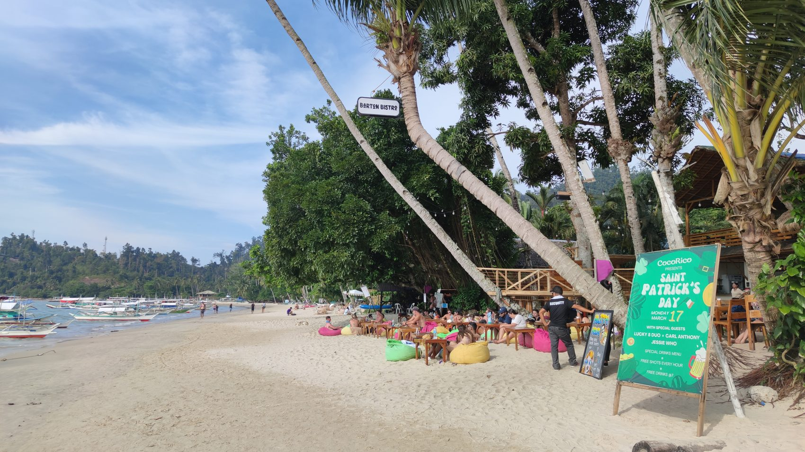
    <em>Port Barton</em>
  </figure>

  <figure>
    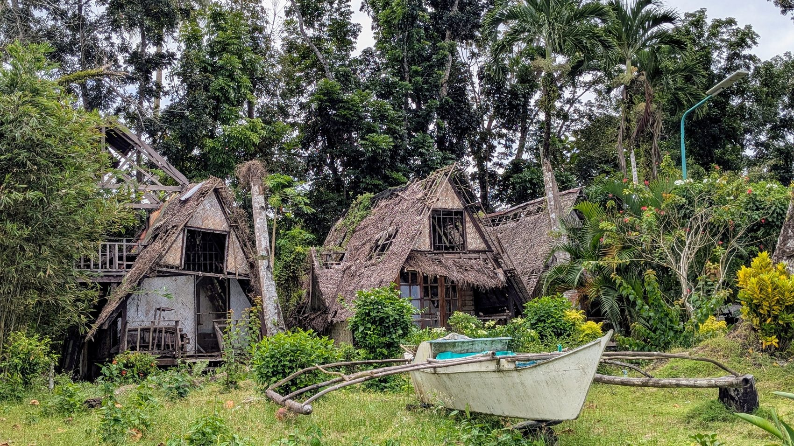
    <em>Port Barton</em>
  </figure>

We checked in at [Dheltor Hilltop](https://andrestgt.github.io/food/philippines/port-barton-san-vicente/), probably the best budget accommodation we found in all of Palawan. The highlight is the lovely little swimming pool, clean, well maintained and never crowded; the bungalows are neat, the shared bathrooms spotless, and the included breakfast surprisingly generous, with both Filipino and Western options. For Port Barton, where accommodation tends to be overpriced, it is a great deal.

<figure>
  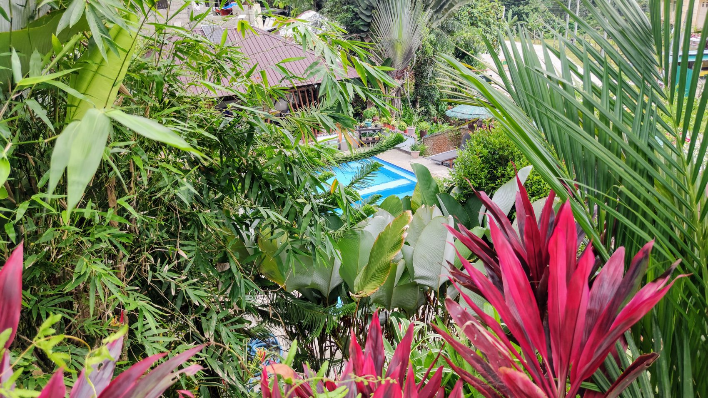
  <em>Port Barton - Dheltor Hilltop</em>
</figure>

Dinner was at [Ayette's Bamboo Balai Balai](https://andrestgt.github.io/food/philippines/port-barton-san-vicente/restaurants/ayettes-bamboo-balai/), and this was a reunion too: I stayed here in 2009, just after they had built their very first bungalow, at a fraction of today's price. The accommodation has become much more expensive, but the restaurant is still a great place to eat. Food prices are on the pricey side, like everywhere in town, but the quality is good, and they serve the cheapest beer in Port Barton, which is obviously a bonus. We ended up eating here three nights out of three, which says it all.

## 18 March 2025

The day began with a nice breakfast at our resort, followed by a very good Italian coffee at [Milano Café](https://andrestgt.github.io/food/philippines/port-barton-san-vicente/cafes/milano-cafe/), expertly prepared (a rarity in the Philippines) in a modern, fan-cooled setting, although the milk had that distinct UHT aftertaste that even the "fresh" milk on Palawan never quite escapes. Prices are on par with Europe or Manila, but then again, Port Barton is generally expensive these days.

In the afternoon we rode out to White Beach, and took the hard way there on purpose, through the mountains, so we could make a loop of it. That route is often nothing more than a rugged, narrow trail, would be impossible in the rainy season, and is really only for experienced riders, but we had it entirely to ourselves; backpackers seem to be less adventurous these days. Even the coastal road between Port Barton and White Beach, the normal way in, is still very rugged and tricky in places, a small reminder of what all the roads here used to be like.

<figure>
  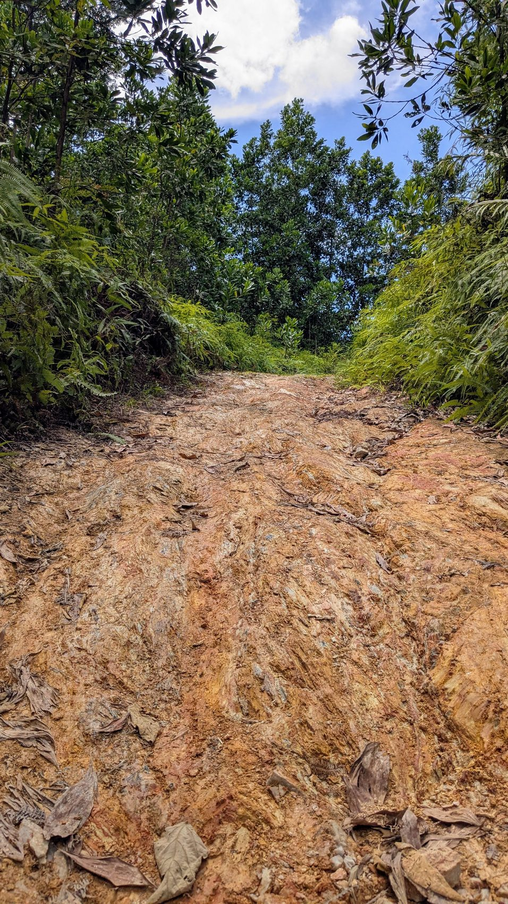
  <em>Port Barton</em>
</figure>

White Beach itself is absolutely stunning, one of the most beautiful beaches in Palawan: soft sand, crystal-clear water and a thoroughly relaxed atmosphere. It is popular, especially with backpackers, so you should not expect a secluded paradise, and they charge a 50 peso entrance fee while providing precisely zero amenities, no toilets, no changing rooms, nothing; where that money goes is anyone's guess. The beach is still entirely worth it.

  <figure>
    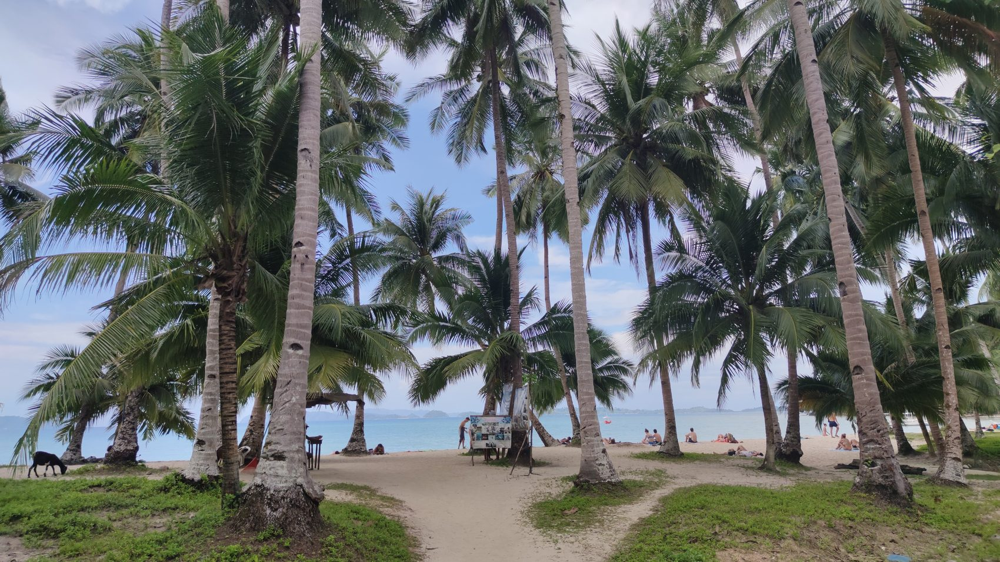
    <em>Port Barton - White Beach</em>
  </figure>

  <figure>
    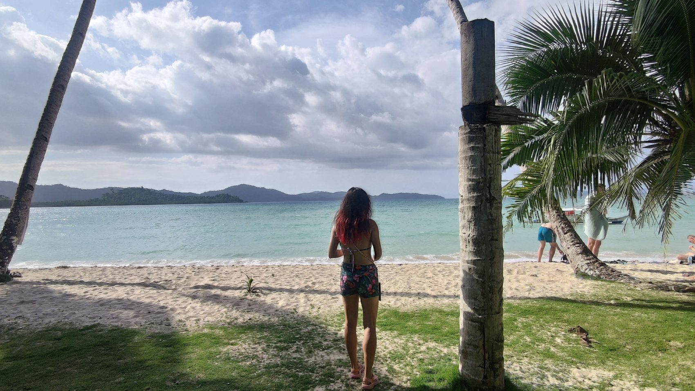
    <em>Port Barton - White Beach</em>
  </figure>

  <figure>
    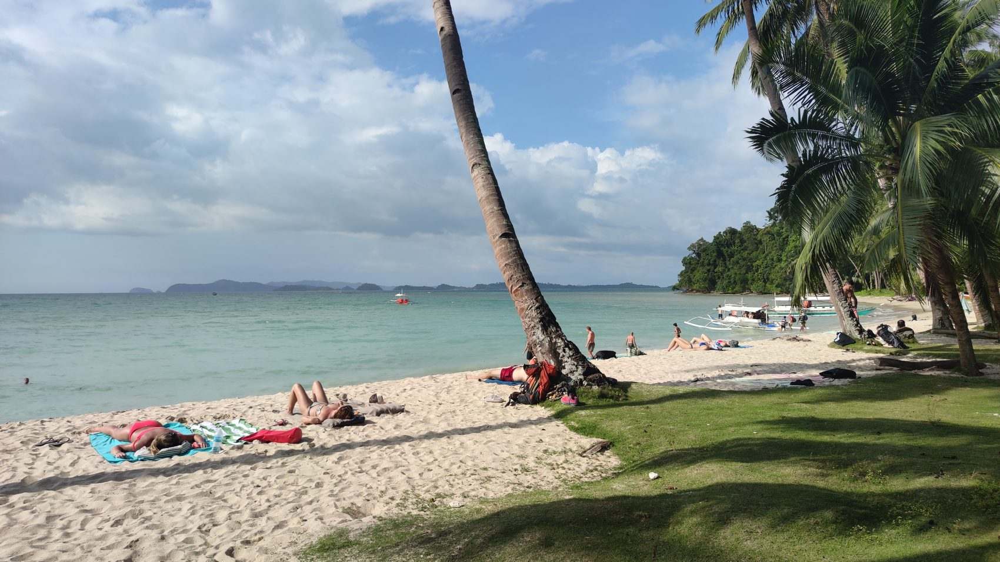
    <em>Port Barton - White Beach</em>
  </figure>

  <figure>
    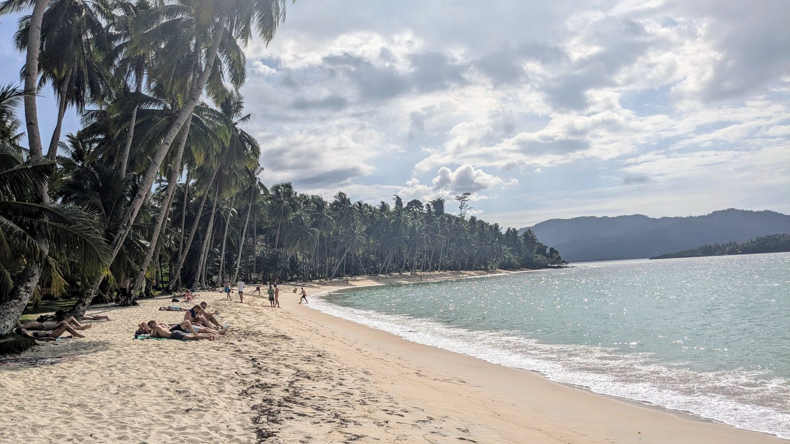
    <em>Port Barton - White Beach</em>
  </figure>

Sunset drinks were at [The Beach Barn](https://andrestgt.github.io/food/philippines/port-barton-san-vicente/bars-pubs/the-beach-barn/), which is anything but stylish, the décor is honestly pretty awful, but if you can look past that it is the cheapest spot for drinks and food right on the beach, perfect for a few beers and a quick snack while the sun goes down.

<figure>
  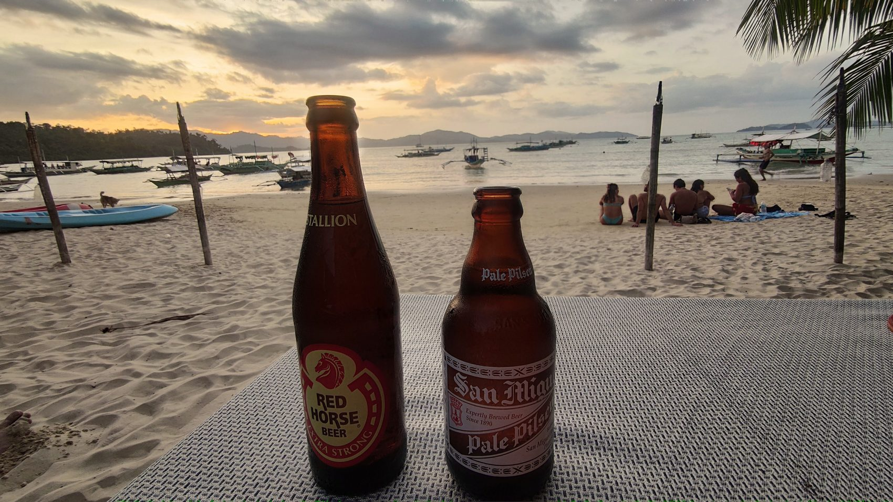
  <em>Port Barton - The Beach Barn</em>
</figure>

  <figure>
    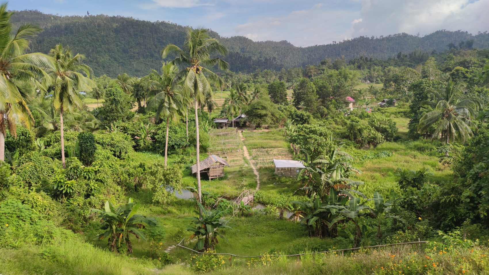
    <em>Port Barton</em>
  </figure>

  <figure>
    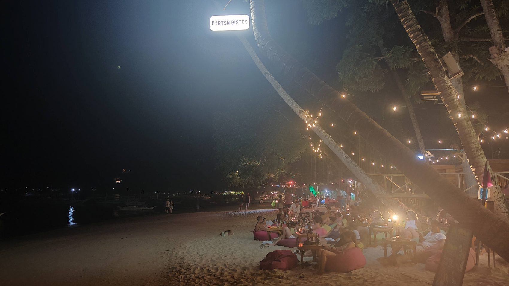
    <em>Port Barton</em>
  </figure>

Dinner at [Master Chaolong](https://andrestgt.github.io/food/philippines/port-barton-san-vicente/restaurants/master-chaolong/) summed up a certain Filipino restaurant paradox. The place sits right next to Star Apple, the most popular and overpriced restaurant in town, and serves big portions of tasty Vietnamese-Filipino beef noodles and banh-mi-style sandwiches at backpacker prices. It could be a hit. Instead, the uninterested staff, the questionable cleanliness and the uninspired décor make it feel as though they are actively trying to drive customers away. The food deserves better.

## 19 March 2025

Today we explored the surroundings of Port Barton. In the late morning we rode out to Bigaho Falls, a lovely little waterfall tucked away in the jungle north of town. The road is mostly unpaved and I would not recommend it on a scooter in the rainy season, but the short walk in is pleasant and well maintained, and the 40 peso entrance fee is entirely fair, since the locals keep the path and the village in good condition. The main pool can get crowded, but there are smaller pools downstream where you can have the water to yourself.

  <figure>
    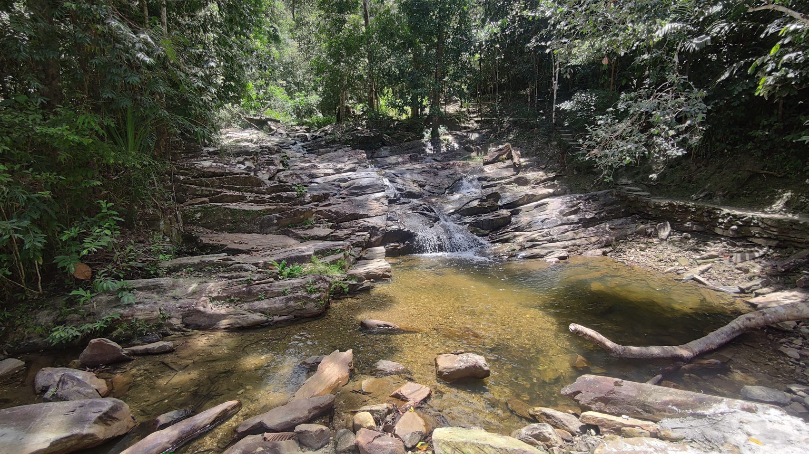
    <em>Port Barton - Bigaho Falls</em>
  </figure>

  <figure>
    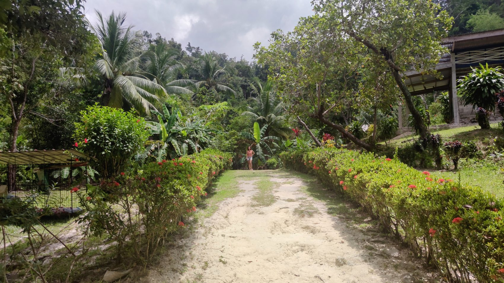
    <em>Port Barton - Bigaho Falls</em>
  </figure>

Afterwards we stopped for drinks at [Prince John Resort](https://andrestgt.github.io/food/philippines/port-barton-san-vicente/bars-pubs/prince-john-resort/), a gorgeous spot that is tricky to reach by road and, perhaps for that reason, almost empty, which is a pity; it is a fancy and rather expensive place for such a hard-to-reach remote part of the coast.

  <figure>
    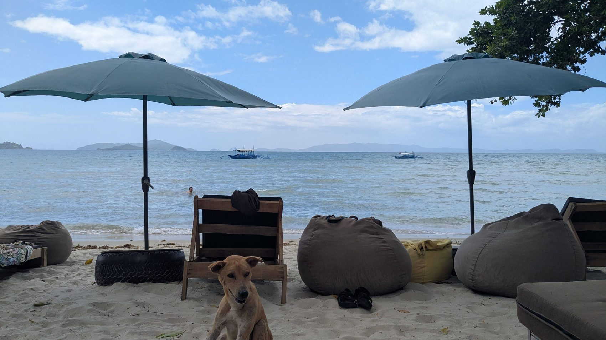
    <em>Port Barton - Prince John Resort</em>
  </figure>

  <figure>
    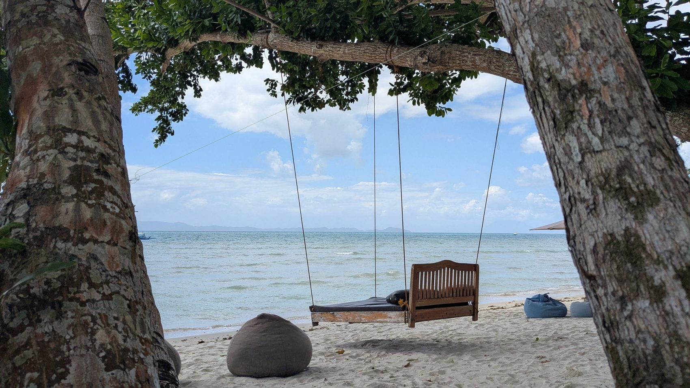
    <em>Port Barton - Prince John Resort</em>
  </figure>

The late afternoon belonged to Pamuayan Beach, just a short but bumpy ride from Port Barton. It is far less popular than White Beach and yet stunningly picturesque; with the bankas and the sandbar it looks like something straight out of a travel magazine.

  <figure>
    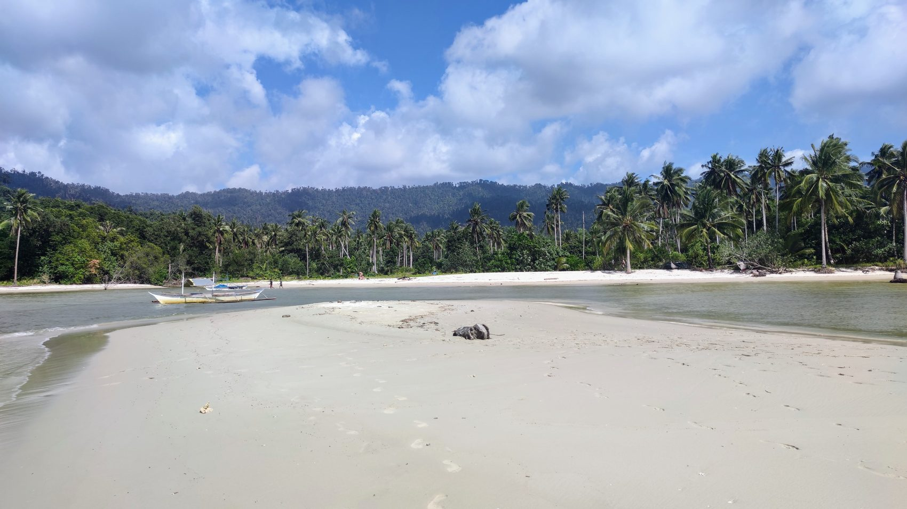
    <em>Port Barton - Pamuayan Beach</em>
  </figure>

  <figure>
    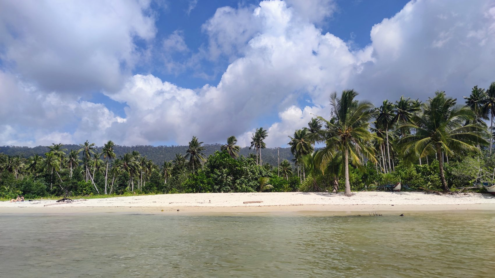
    <em>Port Barton - Pamuayan Beach</em>
  </figure>

<figure>
  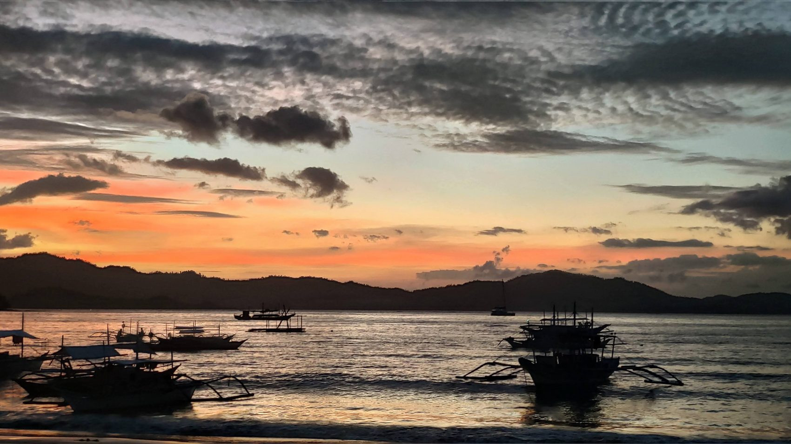
  <em>Port Barton</em>
</figure>

The evening ended, once again, at Ayette's.

## 20 March 2025

Time to move on, northwards to the coast around San Vicente, an area that barely registered on the tourist map in 2009 and that I had not visited back then.

The interesting part is that there is now a direct coastal road from Port Barton to San Vicente that simply did not exist before, and it still does not appear on Google Maps. It is mostly unpaved, and I would not attempt it in a car, but on a bike it is bumpy without being too hard, at least in the dry season, and it saves the long detour back to the highway.

<figure>
  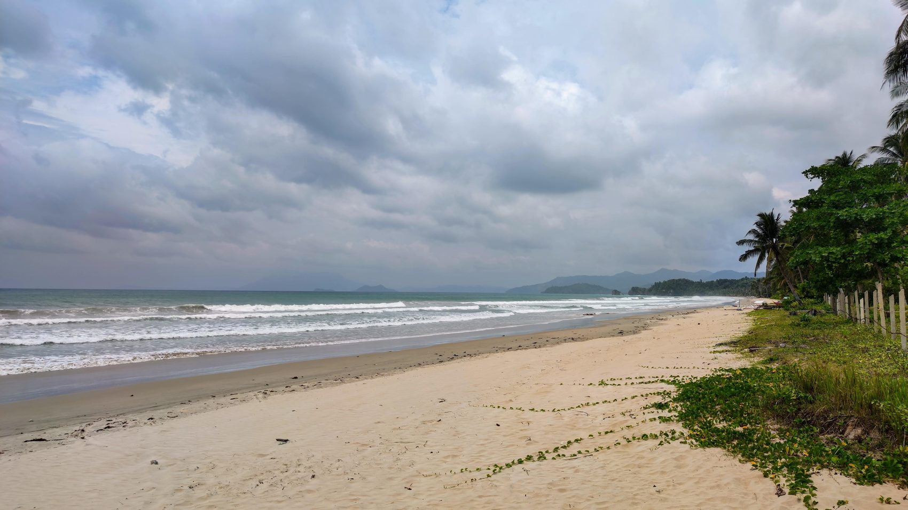
  <em>Around San Vicente</em>
</figure>

The first stop was [Kape San Vicente](https://andrestgt.github.io/food/philippines/port-barton-san-vicente/cafes/kape-san-vicente/) in San Vicente town. It is great to find something resembling a modern coffee shop with a proper espresso machine outside the main tourist centres, and at about half of what you pay in Port Barton, for food and coffee alike. Coffee purists should probably avoid the milk-based drinks, the milk seems to be sweetened or flavoured, but for the price it is well worth the stop.

Further up the coast in Alimanguan, [Kitzmon Food House](https://andrestgt.github.io/food/philippines/port-barton-san-vicente/restaurants/kitzmon-food-house/) turned out to be much neater and cleaner than your average provincial foodhaus, with a good variety of Filipino favourites including chaolong, the Palawan version of Vietnamese beef stew. Prices are very reasonable, the service is friendly, and it is probably the best food option outside the resorts for many miles; we liked it enough to come back the next day.

For the next two nights we stayed at Amwani Sunset Colours on Erawan Beach, north of Alimanguan.

<figure>
  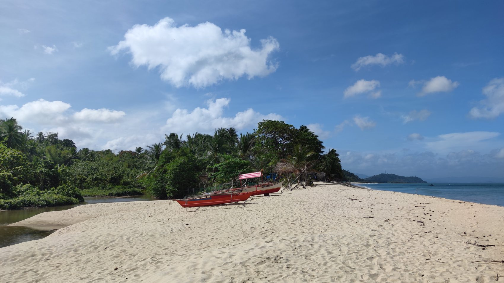
  <em>Around San Vicente - Amwani Sunset Colours</em>
</figure>

Since they paved the roads up from San Vicente, the place feels far less remote than it must have been only months earlier. The resort itself is quite basic, but it would be a great spot for a long-term stay: there is a shared kitchen for everyone to use, they sell beer at cost price, and the food prices are fair, with big portions. Dinner that first evening was delicious grilled squid, three of them for only 300 pesos. The two seaview bungalows were sadly booked out, those are the rooms to try for, but our family room was spacious enough and even had its own small kitchen. The real winner, though, is the beach: stunning, and despite the waves probably the best beach we found in Palawan for actual swimming rather than just lounging, thanks to the steep entrance.

  <figure>
    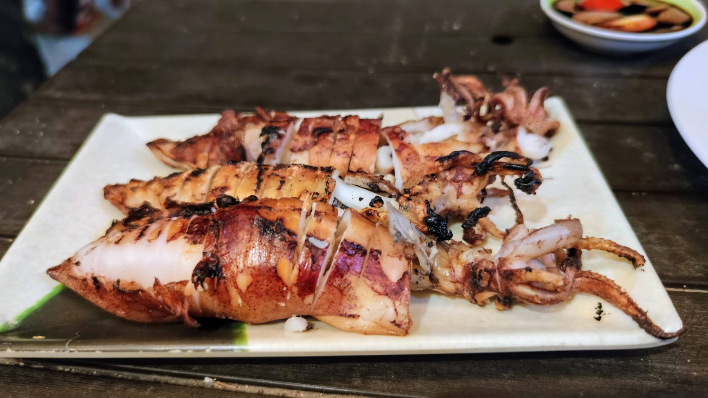
    <em>Around San Vicente - Amwani Sunset Colours</em>
  </figure>

  <figure>
    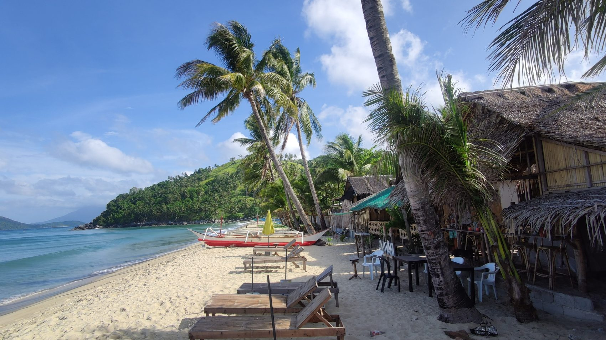
    <em>Around San Vicente - Amwani Sunset Colours</em>
  </figure>

## 21 March 2025

Today we explored the coastal road north of Erawan, which has recently been paved, well, mostly, as far as Binga; after that it turns back into red dirt.

<figure>
  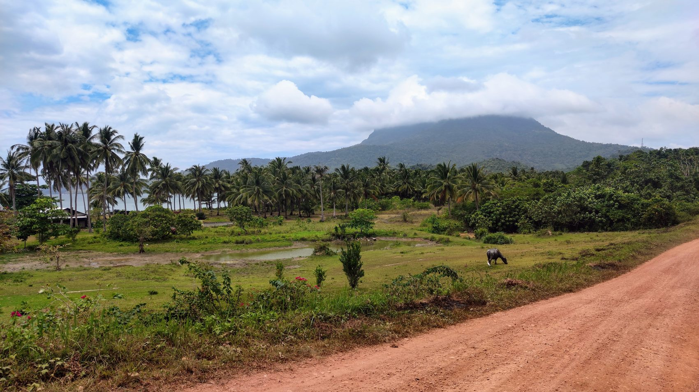
  <em>Around San Vicente</em>
</figure>

Paved or not, it must be one of the most scenic and least travelled coastal roads in the country.

The first stop was Bato ni Ningning, a beautifully manicured viewpoint offering some of the most stunning views on the island, across the coastline and the outlying islands. Despite the remote location it is absolutely worth the trip, and with the new road it is not even a hard journey. Nearby Imuruan Viewpoint offers very pretty views of its own, without an entrance fee.

<figure>
  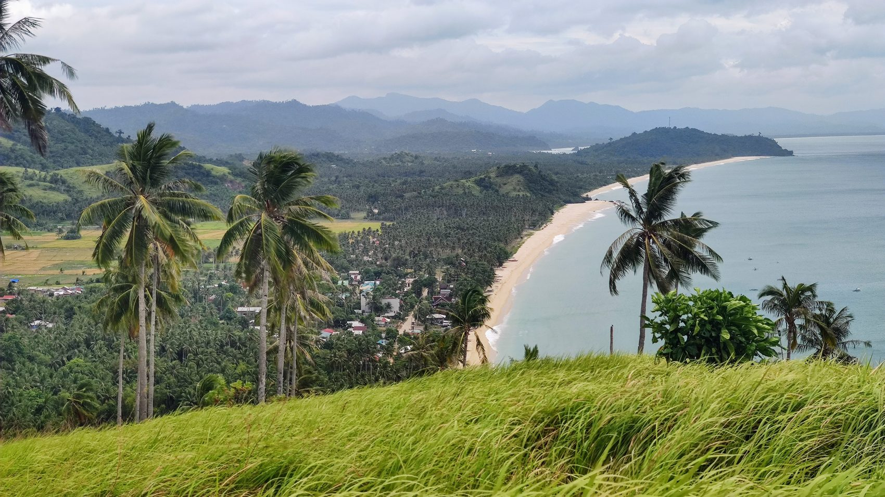
  <em>Around San Vicente - Bato ni Ningning</em>
</figure>

From there we continued to the very end of the road. Lumambong Beach is about as far up as you can go from San Vicente along this part of the coast; the last six or seven kilometres are quite rough, but it is absolutely worth it if you are looking for a beautiful, unspoiled tropical beach. You can reach it through Binga Beach Resort, or take the adventurous route across a rickety wooden bridge over a small creek just past the resort. Chances are you will have the whole beach to yourselves, and it is a great spot for swimming too.

  <figure>
    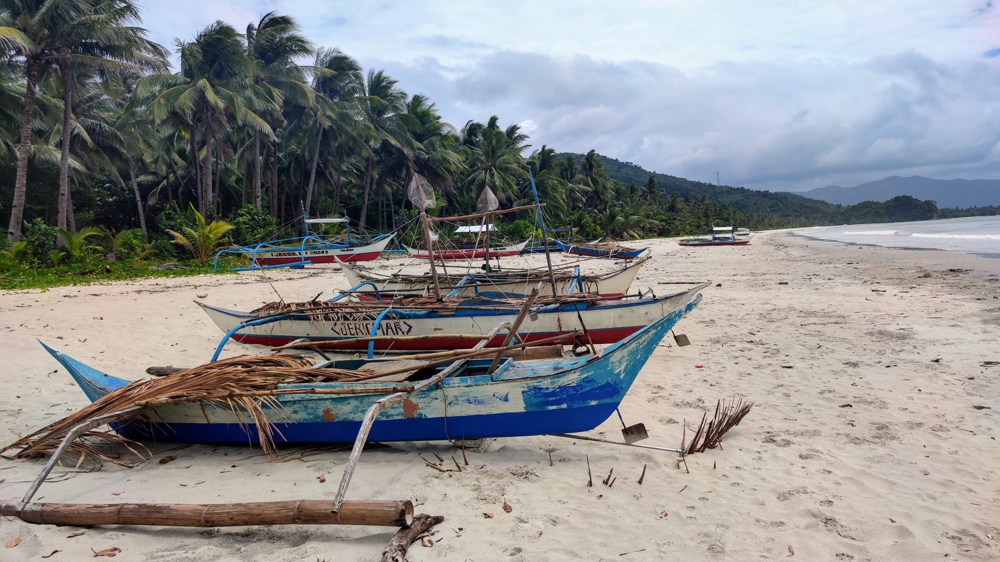
    <em>Around San Vicente - Lumambong Beach</em>
  </figure>

  <figure>
    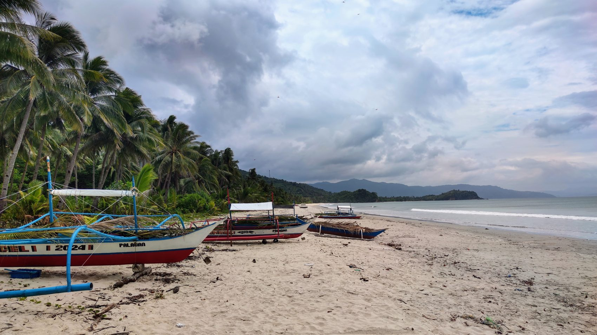
    <em>Around San Vicente - Lumambong Beach</em>
  </figure>

  <figure>
    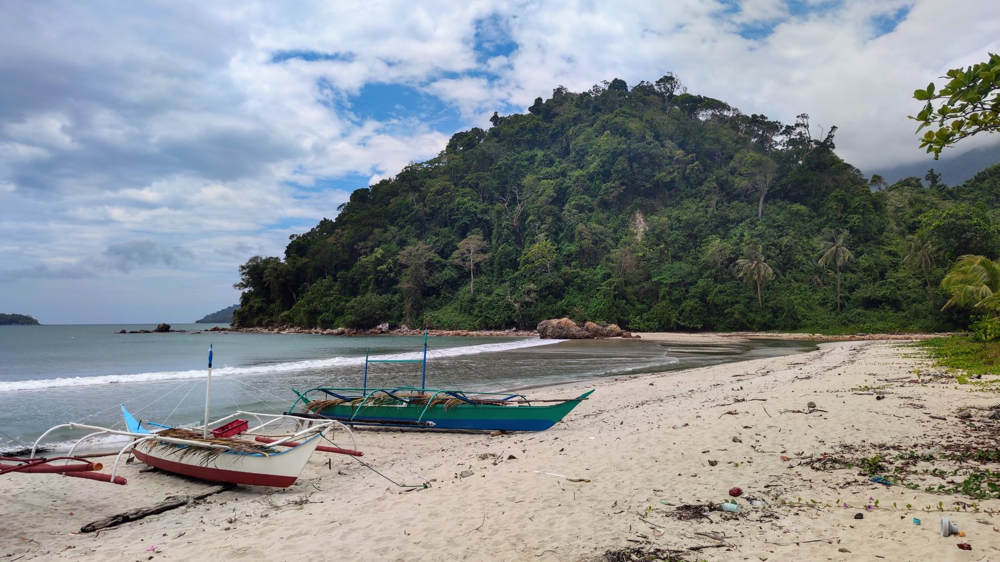
    <em>Around San Vicente - Lumambong Beach</em>
  </figure>

  <figure>
    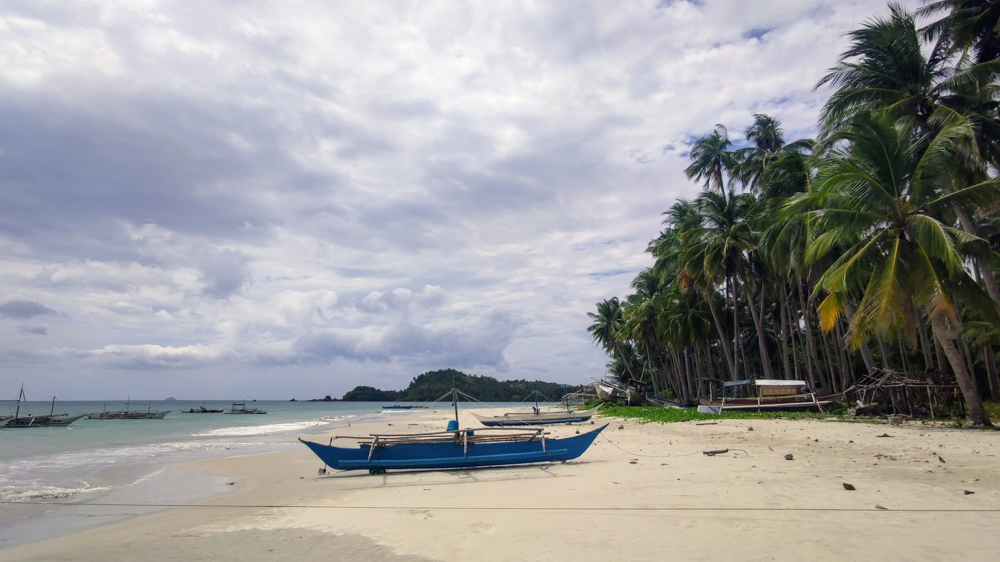
    <em>Around San Vicente - Binga Beach</em>
  </figure>

On the way back we stopped at Sparkling Beach, a very beautiful spot where the lagoon meets the sea. Access is easy and public, and although the road now makes it simple to get here from San Vicente, it still feels remote, a beach quietly waiting to be discovered.

  <figure>
    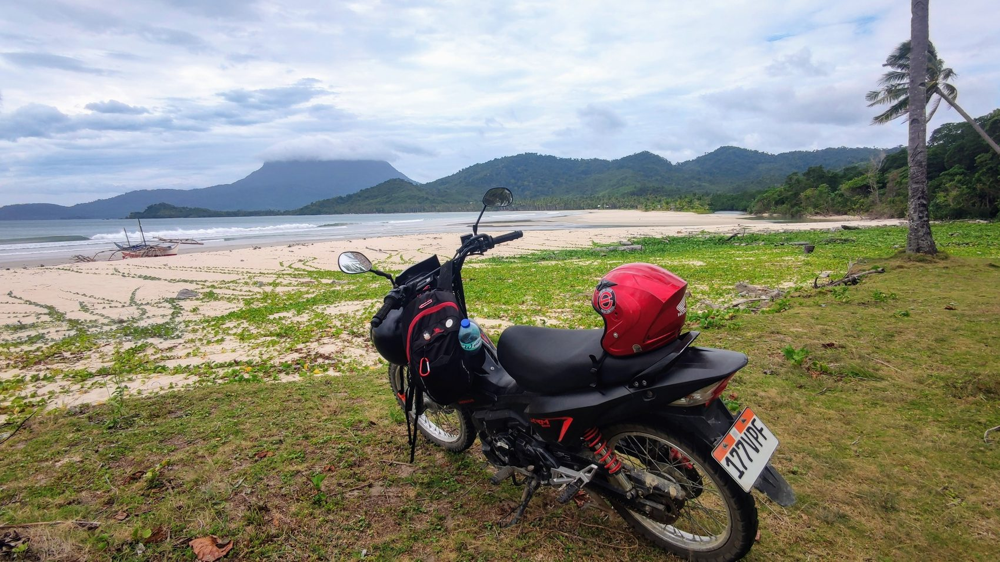
    <em>Around San Vicente - Binga Beach</em>
  </figure>

  <figure>
    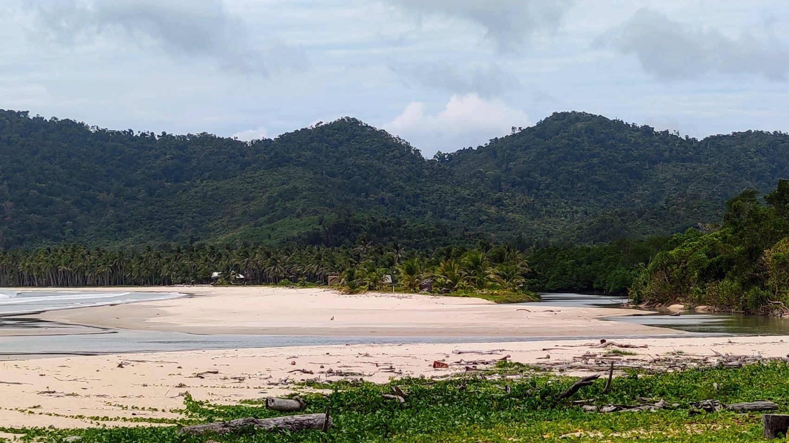
    <em>Around San Vicente - Binga Beach</em>
  </figure>

Dinner was at Kitzmon again, and the evening ended back at Amwani with a sunset that lived up to the resort's name.

  <figure>
    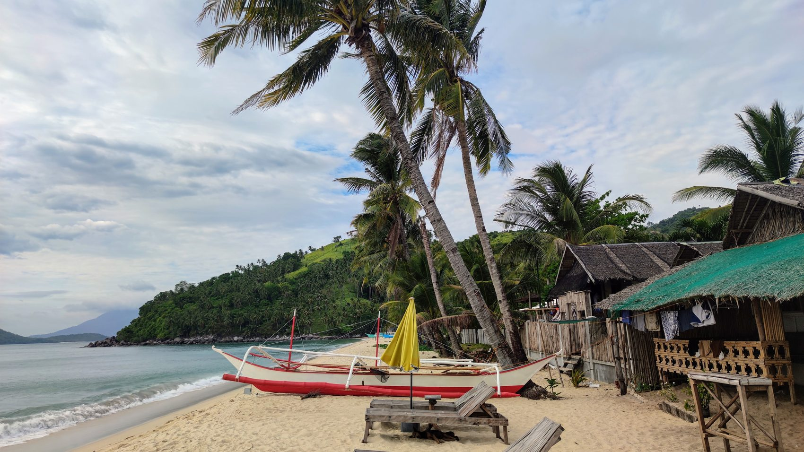
    <em>Around San Vicente - Amwani Sunset Colours</em>
  </figure>

  <figure>
    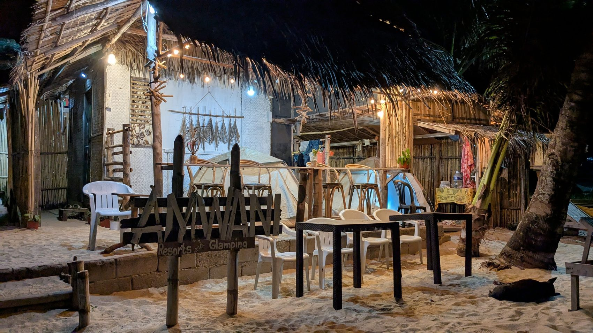
    <em>Around San Vicente - Amwani Sunset Colours</em>
  </figure>

## 22 March 2025

The longest riding day of the trip so far: from Erawan Beach back through Alimanguan and across the island to Taytay, then up the east coast to Sibaltan.

The reward for the long ride came in the middle of nowhere, somewhere in provincial Palawan near Taytay. [Leonida's](https://andrestgt.github.io/food/philippines/taytay/restaurants/leonidas/) is a proper gem: a beautiful garden café where you least expect one, beautifully decorated, with very friendly service and food on par with some of the better Filipino restaurants in the big cities. The crispy pork kare-kare was absolutely mouth-wateringly delicious, and the prices are very reasonable for this kind of quality in this kind of setting. They even serve really good, proper coffee, if a bit on the pricey side. One of the culinary highlights of the whole trip.

By late afternoon we reached Sibaltan on the east coast, the quiet other side of El Nido municipality, and checked in at Erlittop Garden for three nights: a simple but beautiful resort set in nature on a hill far above the coast, with huts built from natural materials, a veranda, a sea view and a surprisingly nice en-suite bathroom for a budget resort, all for 1,100 pesos, which is great value. There is a good restaurant too. It is very quiet up there and you really want your own wheels when staying here, but I can highly recommend it.

  <figure>
    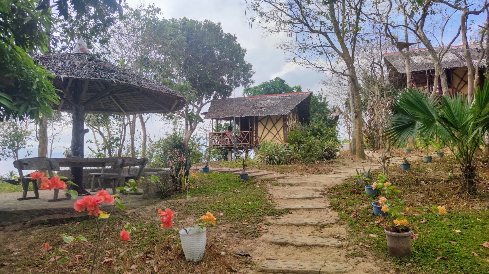
    <em>Around El Nido - Erlittop Garden, Sibaltan</em>
  </figure>

  <figure>
    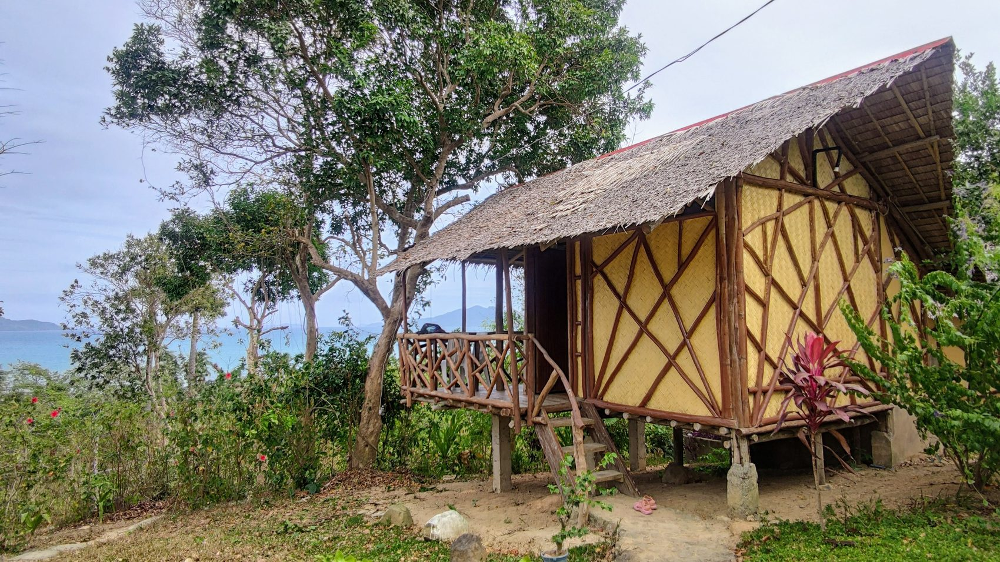
    <em>Around El Nido - Erlittop Garden, Sibaltan</em>
  </figure>

  <figure>
    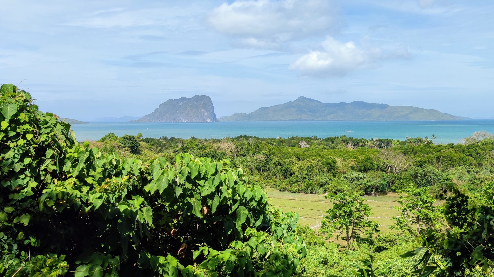
    <em>Around El Nido</em>
  </figure>

Sibaltan deserves a word of its own. While El Nido town on the west coast has been transformed almost beyond recognition by mass tourism, the east coast still feels like Palawan did a generation ago: a long, quiet beach, a scattering of low-key places to stay and hardly a tourist in sight.

  <figure>
    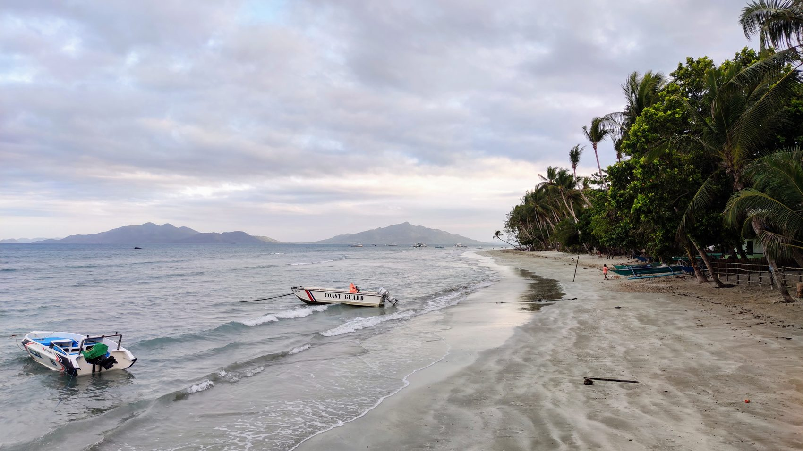
    <em>Around El Nido - Sibaltan</em>
  </figure>

  <figure>
    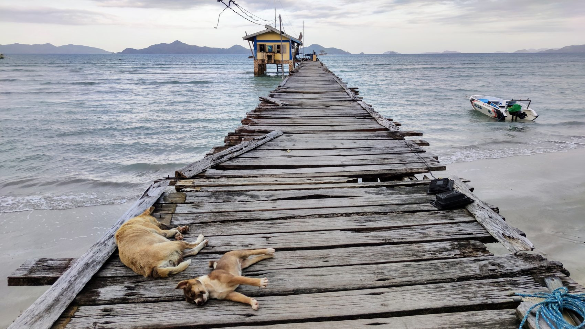
    <em>Around El Nido - Sibaltan</em>
  </figure>

Dinner was at [Carinderia by the Bay](https://andrestgt.github.io/food/philippines/el-nido/restaurants/carinderia-by-the-bay/), right on the water. It is definitely not the friendliest place in the Philippines, but the location is fantastic, and this is a proper beach restaurant: if they can grill you a whole fresh fish, definitely go for it. We paid 550 pesos for a jackfish that was easily enough for two, which is very fair. Some of the other dishes did not seem to offer the same value, but for fresh fish this place is hard to beat, and we came back the next evening.

<figure>
  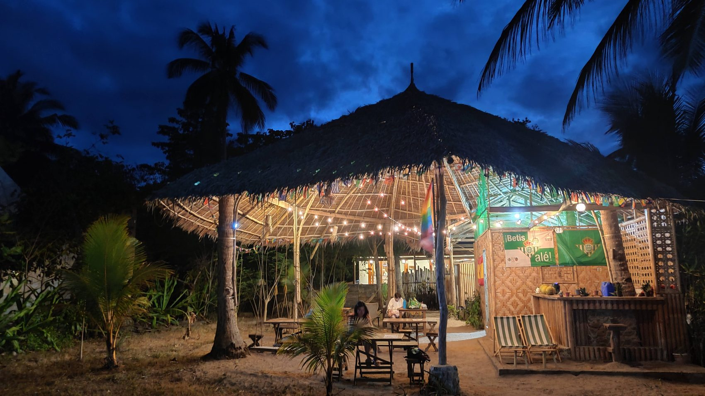
  <em>Around El Nido - Carinderia by the Bay, Sibaltan</em>
</figure>

## 23 March 2025

A beach discovery day, riding north along the coast road and having world-class beaches almost entirely to ourselves.

Duli Beach, with sand more brownish than white, attracts a small crowd of surfers and long-termers drawn by the waves and the generally relaxed lifestyle. It is a very picturesque, coconut-lined beach, and although most of it feels quite secluded, there is a decent choice of bars and restaurants at the northern tip.

<figure>
  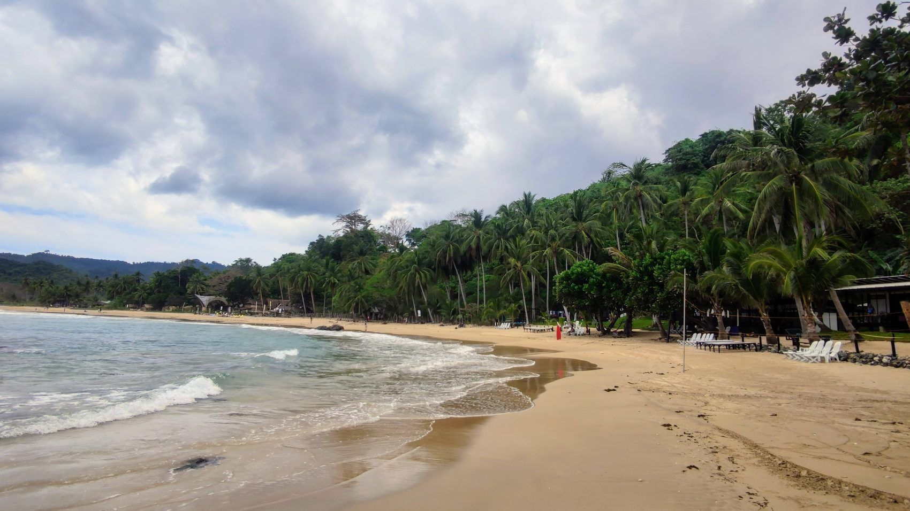
  <em>Around El Nido - Duli Beach</em>
</figure>

Dagmay Beach, a little further on, is another beautiful tropical beach that you are likely to have all to yourselves, at least until the resort being built there is finished. For now it is still wonderfully unspoiled, without even a village behind it.

  <figure>
    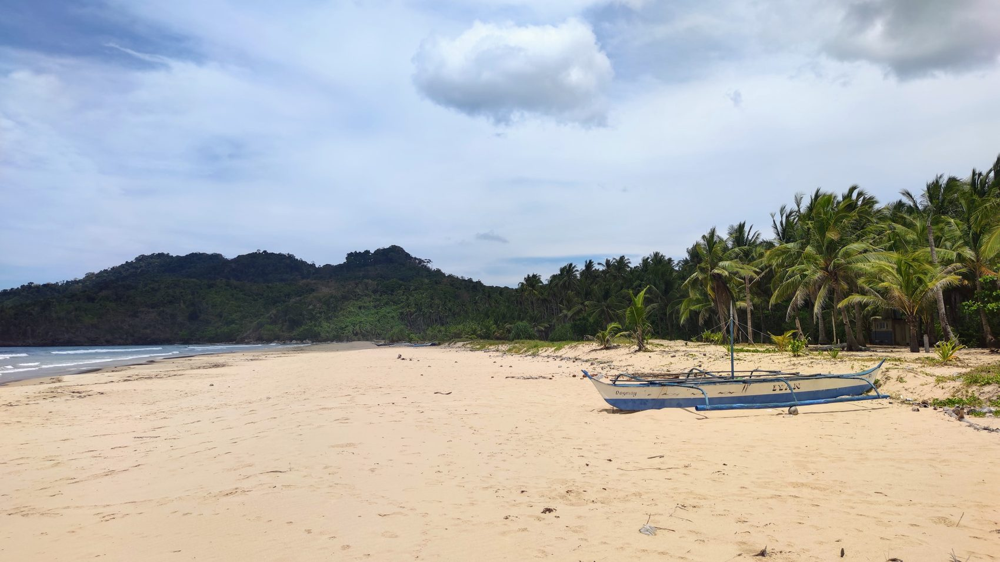
    <em>Around El Nido - Dagmay Beach</em>
  </figure>

  <figure>
    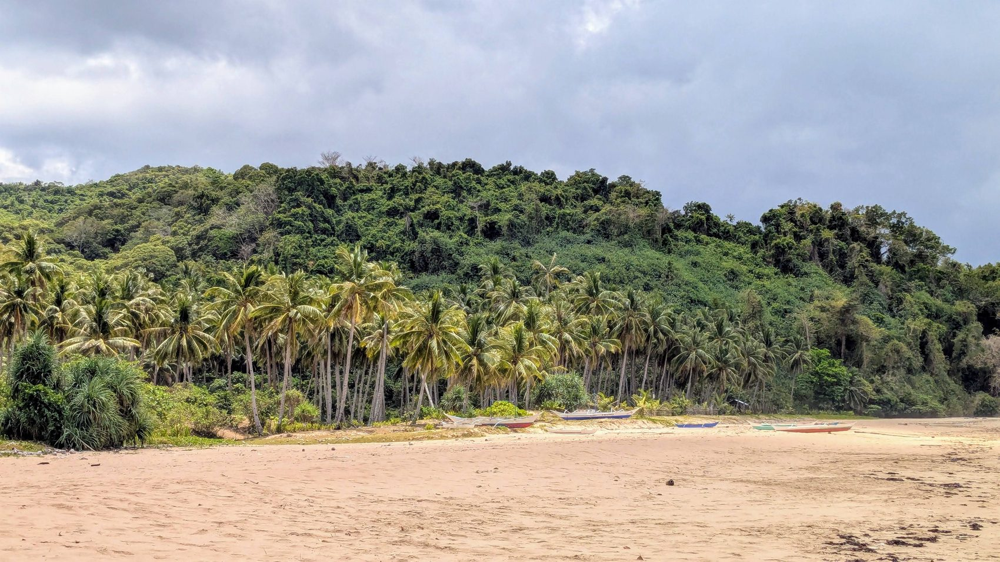
    <em>Around El Nido - Dagmay Beach</em>
  </figure>

The best of the three, for us, was Diapela Beach, as far as the road goes north of El Nido. It is not a remote jungle beach, there is actually a fairly big village behind it, but the water is crystal clear and it was the best place to swim in the whole area, much nicer than some of the more famous beaches further south. Getting there is not exactly effortless, the road is bumpy, but in the dry season it is fine even on a scooter, and definitely worth the trip all the way up.

  <figure>
    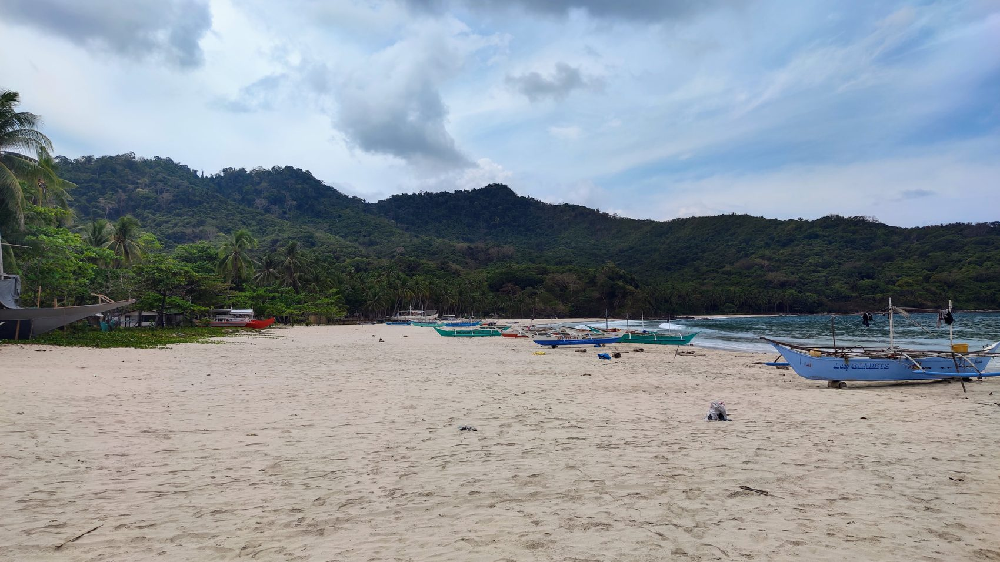
    <em>Around El Nido - Diapela Beach</em>
  </figure>

  <figure>
    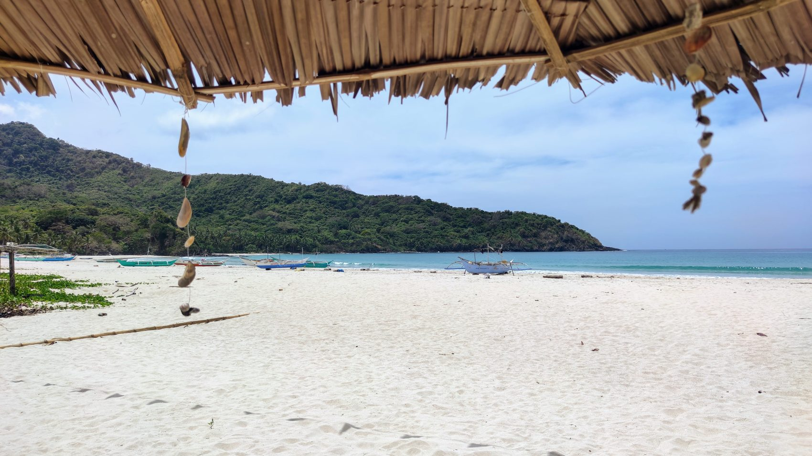
    <em>Around El Nido - Diapela Beach</em>
  </figure>

  <figure>
    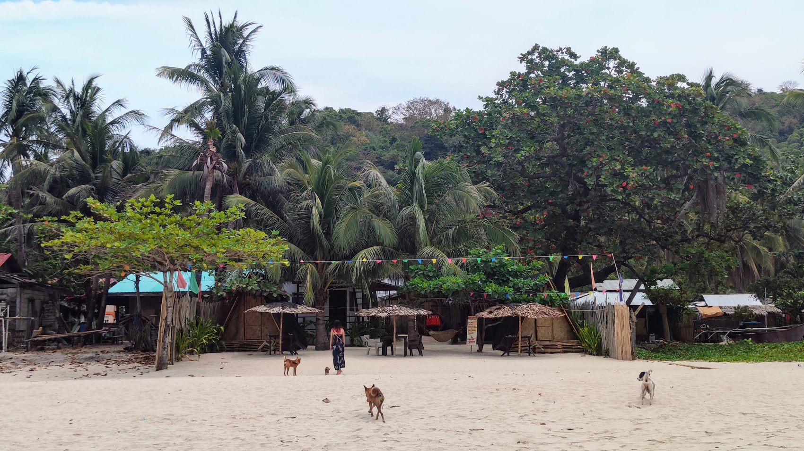
    <em>Around El Nido - Diapela Beach</em>
  </figure>

  <figure>
    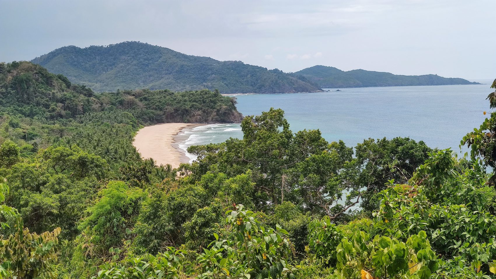
    <em>Around El Nido</em>
  </figure>

## 24 March 2025

I had picked up a bit of a cold, so I took it easy. Linh went off on a Bacuit tour for the day, while I stayed behind to see for myself just how much El Nido had changed since my last visit in 2009.

The changes are insane. I recognised the beach, the rocks and the little alleys around the Boutique Artcafé, and almost nothing else. The most startling of all was Corong-Corong: back then it was a secluded stretch of beautiful beach, today it is mostly a shopping mall, with a narrow strip of sand left over and hemmed in by resorts. The views across the bay are still spectacular, though.

<figure>
  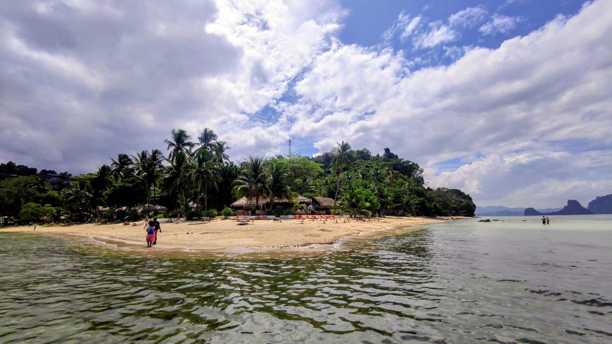
  <em>Around El Nido - Corong-Corong</em>
</figure>

## 25 March 2025

From Sibaltan we crossed over to El Nido's west coast, with a mid-morning break at [Socorro Hills View](https://andrestgt.github.io/food/philippines/el-nido/street-food/socorro-hills-view/), the nicest pit stop along Route 490. This viewpoint resto offers more than just sweeping sea views: the shakes are tasty, the food is decent, and the prices are moderate, which makes it a great place to take a break and simply enjoy the scenery.

<figure>
  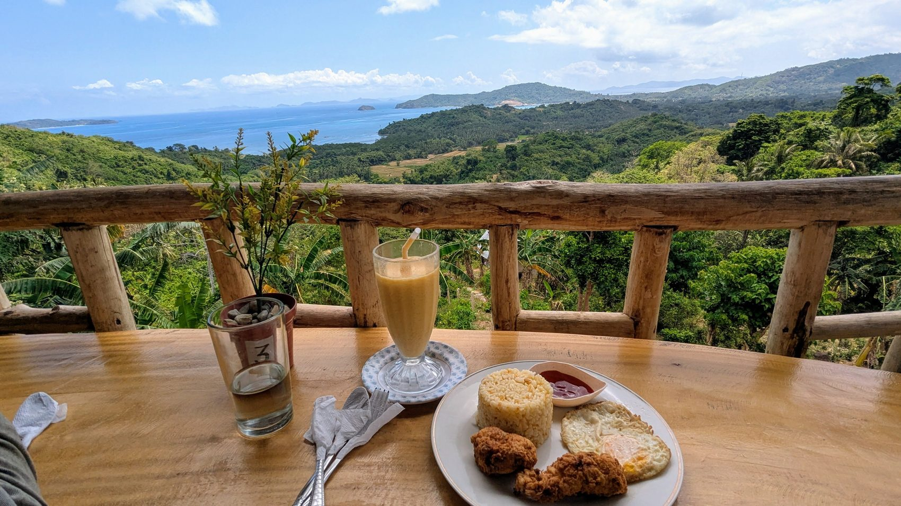
  <em>Around El Nido - Socorro Hills View</em>
</figure>

<figure>
  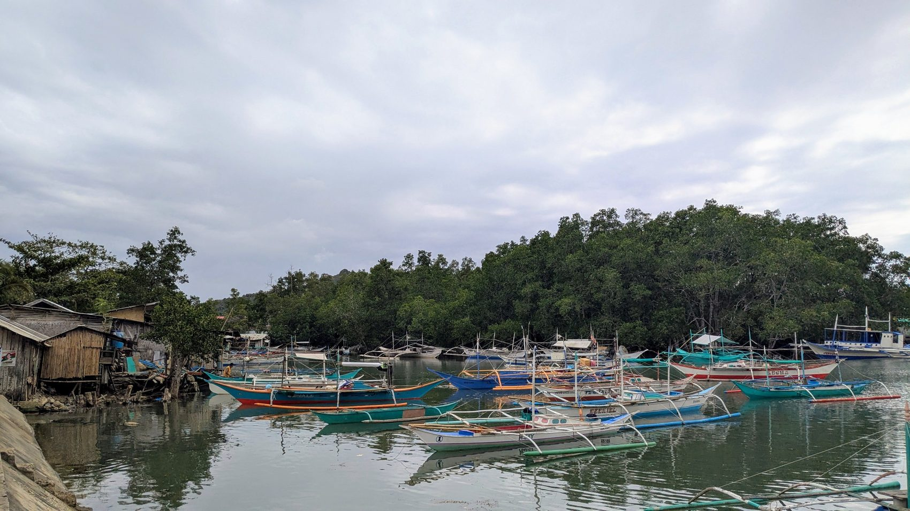
  <em>Around El Nido</em>
</figure>

Then came the moment I had been half looking forward to and half dreading: Nacpan Beach. In 2009, Nacpan was still possibly the most beautiful beach in the world, with no beach restaurants and hardly any development at all. Times have changed. Nacpan is much busier these days, the beach has become an obligatory stop on every El Nido itinerary, and yet, it remains a stunning place, at least the northern and southern ends; the central stretch gets very busy.

  <figure>
    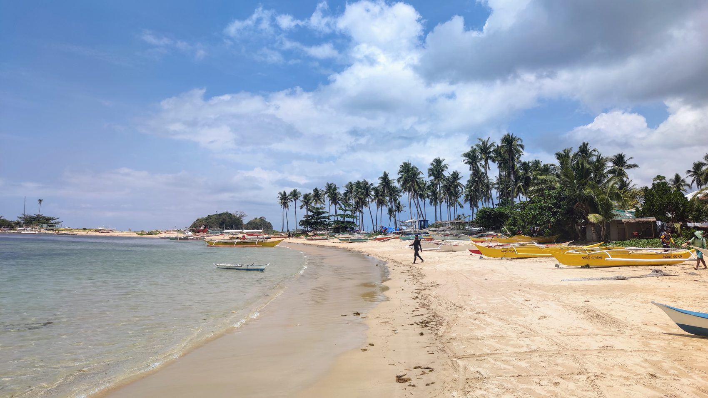
    <em>Around El Nido - Nacpan Beach</em>
  </figure>

  <figure>
    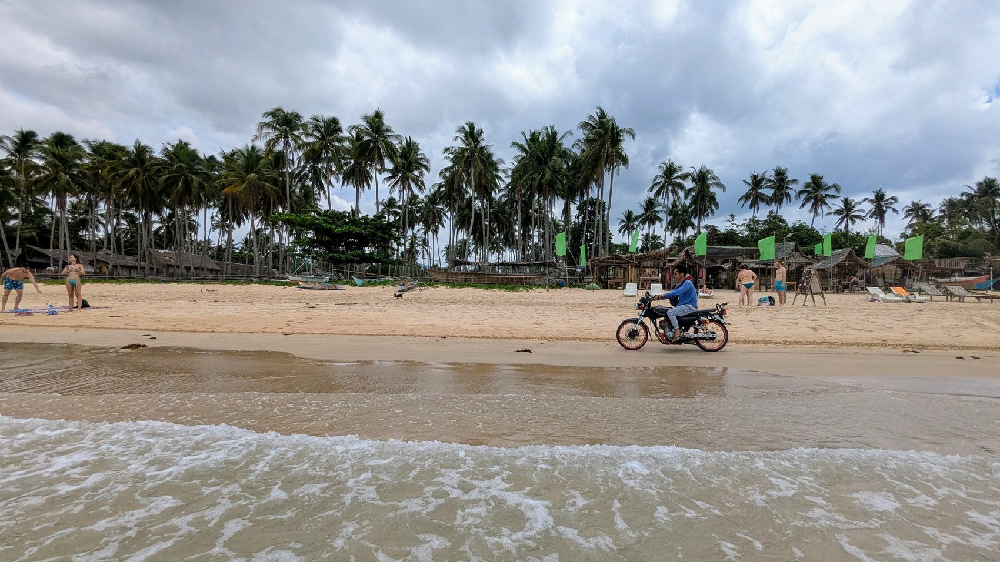
    <em>Around El Nido - Nacpan Beach</em>
  </figure>

<figure>
  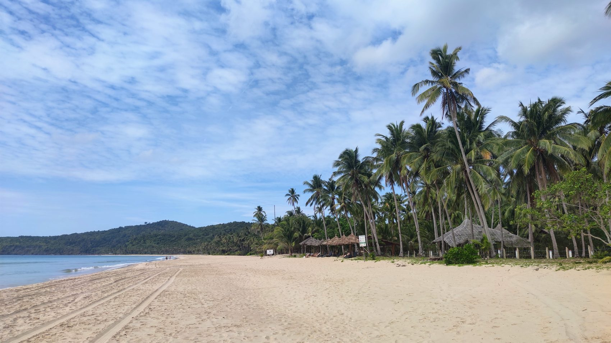
  <em>Around El Nido - Nacpan Beach</em>
</figure>

Lunch was at [Nacpan Grill](https://andrestgt.github.io/food/philippines/el-nido/restaurants/nacpan-grill/), a friendly beachfront spot and, of all the places along the beach, the one that appealed to us most: a cold beer, a fresh coconut, a hearty serving of sinuglaw, and a convenient place to leave your belongings while you swim. Prices are still reasonable for such a prime location.

For the night we stayed at Femya Native House on Bucana Beach, just south of El Nido town: super basic, but friendly and right by the beach, and at 750 pesos for a tiny native room one of the few bargains left in the area.

<figure>
  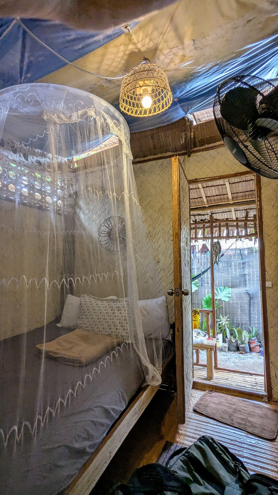
  <em>Around El Nido - Bucana</em>
</figure>

For dinner we went to [Chill'N-Sea](https://andrestgt.github.io/food/philippines/el-nido/restaurants/chilln-sea-restaurant/) next door, which is hard to beat for pure beach restaurant atmosphere: cheap cocktails, seafood sizzlers and a gorgeous sunset on the sand at Bucana Beach. If you want to experience what El Nido felt like before the boom, this gorgeous location at sunset is about as close as it gets.

<figure>
  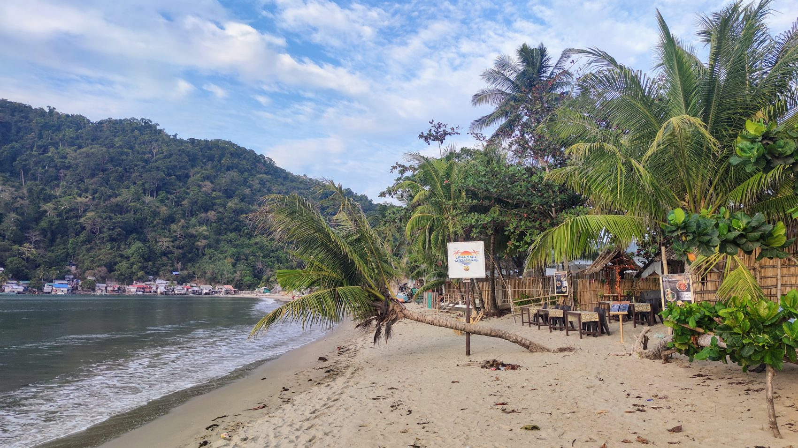
  <em>Around El Nido - Chill'N-Sea, Bucana</em>
</figure>

## 26 March 2025

After a last quiet morning on Bucana Beach we moved into town, to The Only Place Inn for the final two nights, a neat little apartment building in a good location within walking distance of the beach and the cafés, functional, with air conditioning, for 1,000 pesos, quite a bargain for El Nido.

  <figure>
    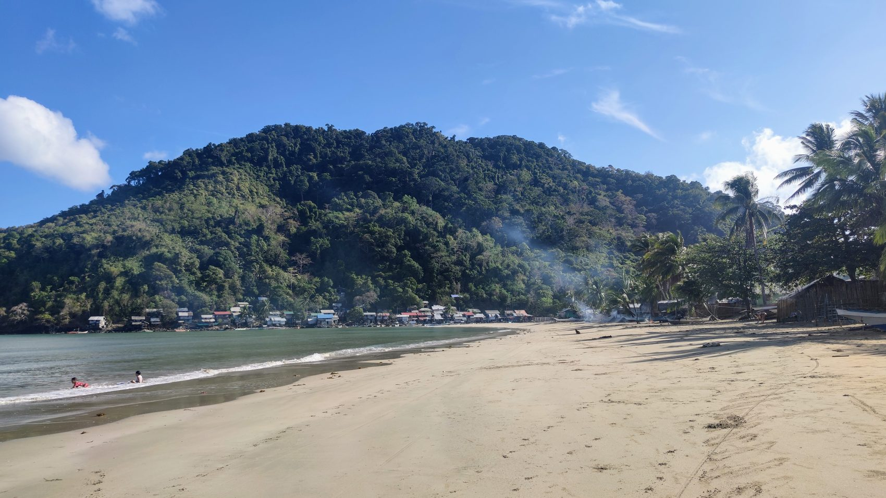
    <em>Around El Nido - Bucana</em>
  </figure>

  <figure>
    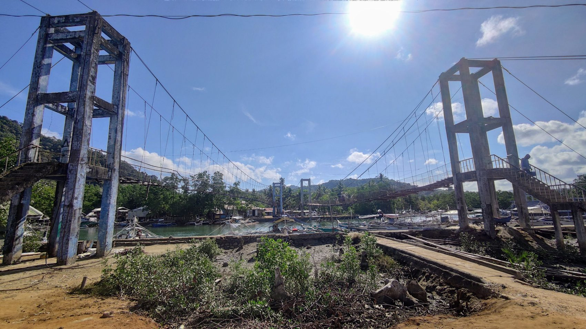
    <em>Around El Nido - Bucana</em>
  </figure>

In 2009 my main complaint about El Nido was the overpriced accommodation in a town that had just started to become popular. Whatever complaints I had back then seem laughable now: El Nido today is a full-blown resort town, wall-to-wall with hostels, tour agencies and backpacker bars. The setting, those dramatic limestone cliffs rising straight behind the town, remains as spectacular as ever; everything in between has changed.

  <figure>
    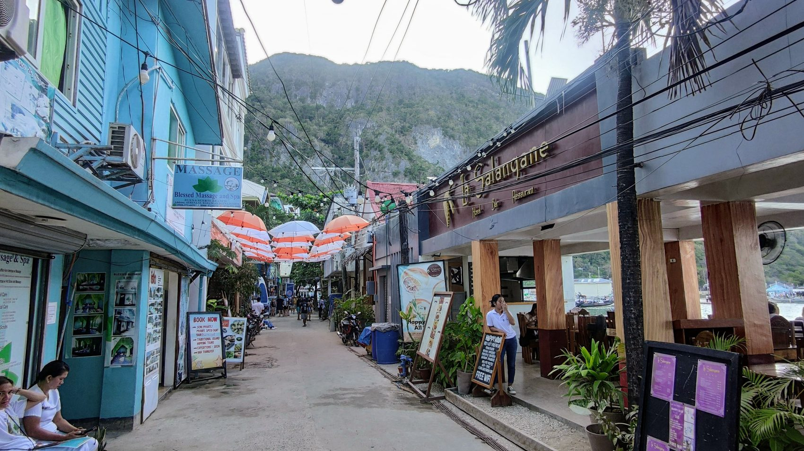
    <em>El Nido</em>
  </figure>

  <figure>
    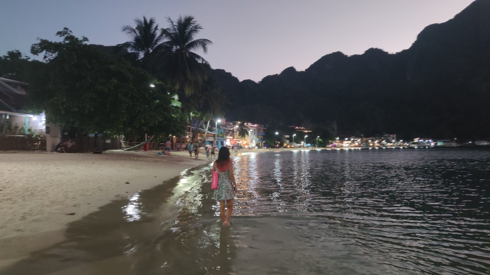
    <em>El Nido</em>
  </figure>

<figure>
  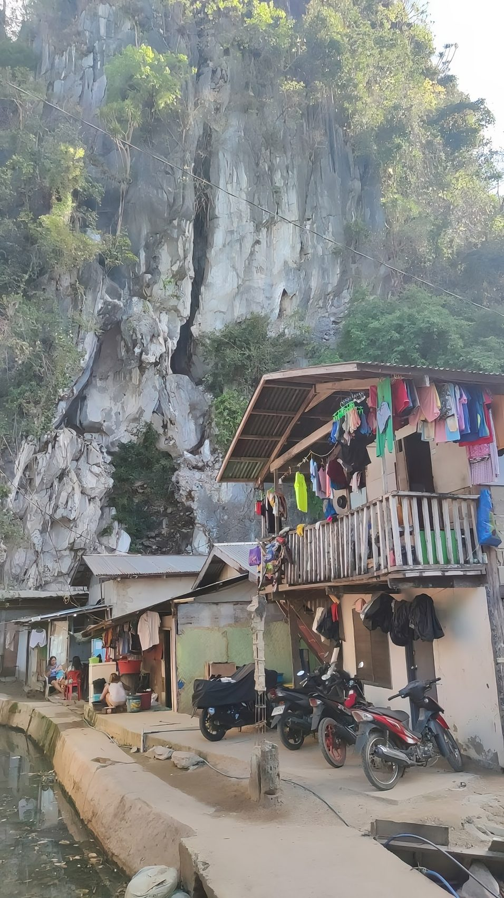
  <em>El Nido</em>
</figure>

After ten days of travelling the hard way, we spent today simply taking full advantage of tourist-town creature comforts.

[Hama Coffee](https://andrestgt.github.io/food/philippines/el-nido/cafes/hama-coffee-el-nido/) is by far the nicest coffee shop in town, with a million-dollar view over the beach, the karst islands offshore and the limestone hills, which also means it is almost always packed; getting a seat with a view is a bit like winning the lottery. Fortunately the flat whites, probably the best in town, taste just as good at the bar.

[Pong's Pares](https://andrestgt.github.io/food/philippines/el-nido/restaurants/pongs-pares/) provided lunch: pungent, heavy, oily and delicious, best enjoyed as a hangover cure or a foundation for a long evening. Both the pares mami and the tofu sisig would make your PT cry, and their chili oil on the table is a very rare find in the Philippines. At 170 pesos for a pares it is not cheap, but for El Nido it is standard.

In the afternoon we paid a nostalgic visit to the [El Nido Boutique Artcafe](https://andrestgt.github.io/food/philippines/el-nido/restaurants/el-nido-boutique-artcafe/). When I first came here in the late 00s, the Art Café had unique selling points that sound exotic today: things like cappuccino and WiFi. It was pricier than the competition but a notch above in everything. Nowadays it feels like a relic, a dinosaur whose sheer size makes it stand out in a town of small places. It is no longer the travellers' focal point, but it still gets things right: the décor is nicer than it used to be, prices are now on par with the competition, the second-floor terrace has pleasant views, and in a town not exactly famous for exceptional food, the food here is better than it used to be.

Later we stopped for beers at [Odessa Mama](https://andrestgt.github.io/food/philippines/el-nido/bars-pubs/odessa-mama/), the only craft beer microbrewery in El Nido, and a good one: nice beers, the best in town. I like Ukrainian food, but the prices here were too steep for me, so we stuck to the beer. A sign at the door announces that Russians are not welcome, which, considering the circumstances, is fair enough.

Sunset drinks at the [Yacht Wreck Bar](https://andrestgt.github.io/food/philippines/el-nido/bars-pubs/yacht-wreck-bar/), the cheapest spot with a prime seaside location in town. Strangely you will not find many backpackers here, they seem to prefer the pricier, posher places with louder music, which suits us fine: this rustic beach bar has vibes of the old El Nido from the 00s. The only drawback is that they serve no food at all with the drinks, not even basic pulutan.

For dinner we went to [Patron Mexican Restobar](https://andrestgt.github.io/food/philippines/el-nido/restaurants/patron-mexican-restobar/). I certainly did not expect authentic Mexican food in El Nido of all places, and to be clear, that is not why the place is packed every night: the food is merely decent and quite tasty. The real draw is the cheerful atmosphere, the cheap long drinks and, by El Nido standards, reasonably priced food, even if the portions are on the smaller side. A thumbs up in a town where good value is hard to come by.

## 27 March 2025

First, breakfast coffee at [Masa](https://andrestgt.github.io/food/philippines/el-nido/cafes/masa/), a modern bakery with minimalist design and an open kitchen, air-conditioned, fast WiFi, everything you would expect from a stylish contemporary café. It was also where I set a new personal record: my most expensive coffee ever in the Philippines, a flat white breaking the 200 peso mark. The coffee itself is very good, though the milk foam texture was not quite right, which stings a little at that price. If money is no issue, still recommended.

Then out into the Bacuit Archipelago, the reason everyone comes here. We had booked Tour D (1,100 pesos), the least popular and least crowded one, and the highlights were kayaking in Cadlao Lagoon, just as beautiful as the two more famous lagoons on Miniloc, and the spectacular Pasandigan Cove.

The archipelago is still absolutely stunning, one of the most beautiful seascapes on earth, but out on the water it has changed just as much as the town. There are countless more tour boats than there used to be, and the deserted beaches I remember from 2009 are gone. Back then Bacuit was the quiet alternative to Halong Bay and Krabi; it is not anymore.

  <figure>
    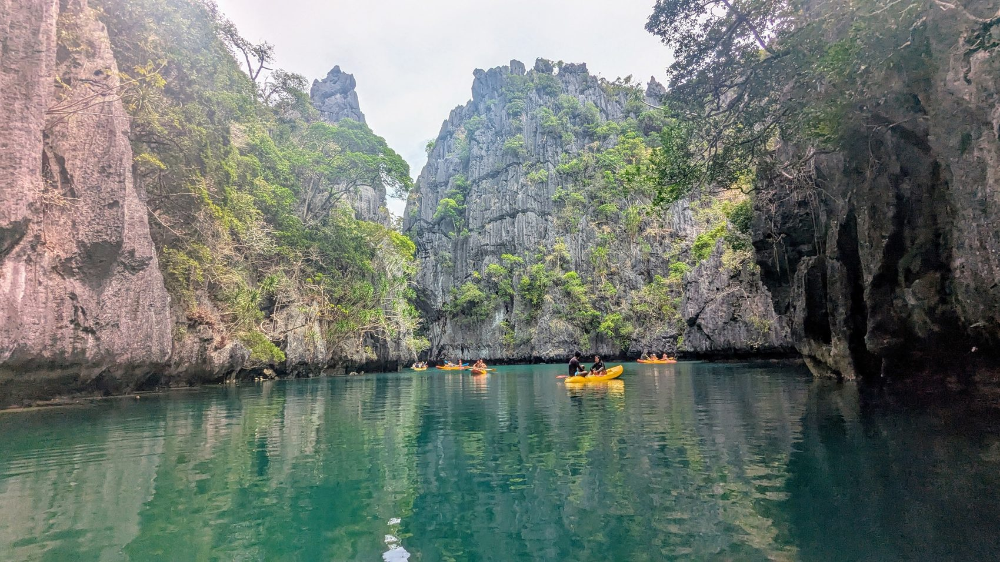
    <em>Bacuit Archipelago</em>
  </figure>

  <figure>
    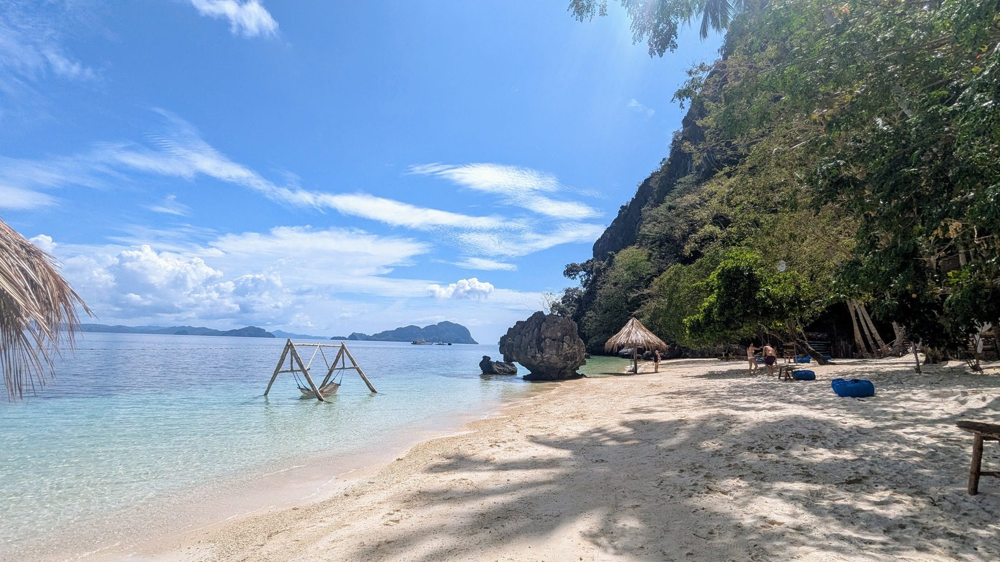
    <em>Bacuit Archipelago</em>
  </figure>

  <figure>
    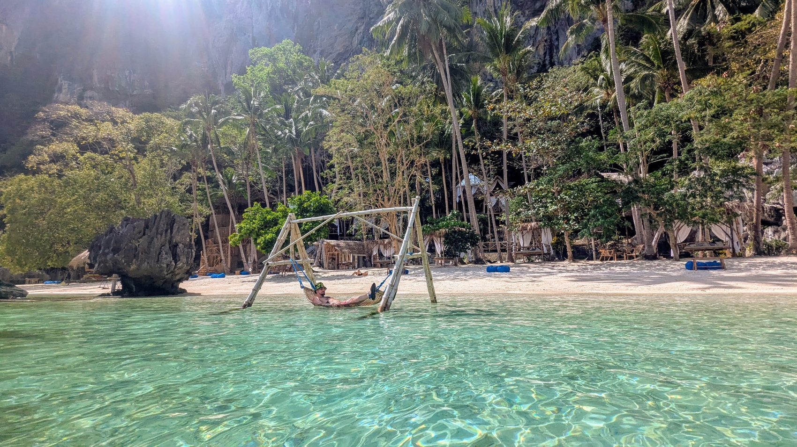
    <em>Bacuit Archipelago</em>
  </figure>

  <figure>
    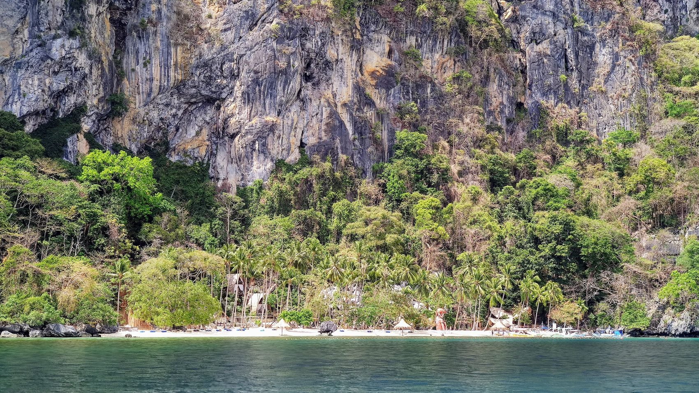
    <em>Bacuit Archipelago</em>
  </figure>

<figure>
  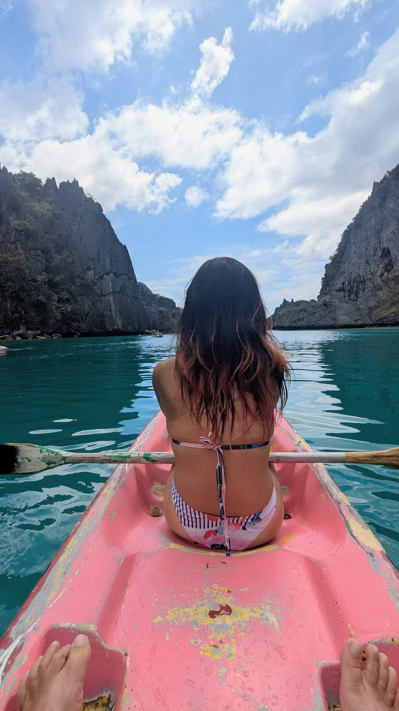
  <em>Bacuit Archipelago</em>
</figure>

Back on land, we had a relaxed last night in preparation for the long way back tomorrow. [Bhabah's Chaolong](https://andrestgt.github.io/food/philippines/el-nido/restaurants/bhabahs-chaolong/) is extremely basic, almost a dark hole, with a few tables thankfully outside, though right by the busy, polluted road. But it is cheap and the Viet-Fil noodle soup is very tasty; not that there was much choice, it seemed to be the only chaolong place in town. Snacks afterwards at [Caliente](https://andrestgt.github.io/food/philippines/el-nido/street-food/caliente-el-nido/), which is more snack bar than restaurant, just a few uncomfortable stools and tables, serving perfect pre-drinking snacks in Filipino-Mexican style. The tacos are very tasty, but since they are just two bites each you could easily eat a dozen, and then they might blow your budget; it may look like a cheap place, but it is not.

## 28 March 2025

The long ride back: some 230 kilometres from El Nido to Puerto Princesa in a day, which sounds worse than it is now that the road is good all the way. Fuel for the journey came from [Blackbird Coffee](https://andrestgt.github.io/food/philippines/el-nido/cafes/blackbird-coffee/) in El Nido, which does not have Hama's gorgeous location, but when Hama is too busy it is a great alternative for quality coffee: tiny but air-conditioned, friendly, and the breakfasts looked great and massive.

Our halfway break was at [Casa Rosa](https://andrestgt.github.io/food/philippines/taytay/restaurants/casa-rosa-seaview-inn/) in Taytay, a very quiet resort on a hill above the town with beautiful views from the restaurant terrace. The service is slow and the food so-so, but it is a lovely rest stop on the long way back, and with more time it would have been worth breaking the journey here for a night.

<figure>
  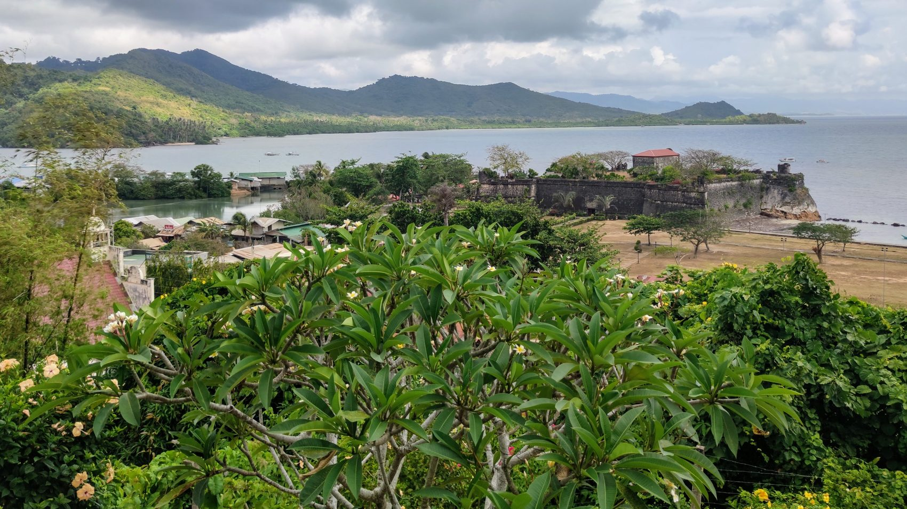
  <em>Taytay</em>
</figure>

By late afternoon we were back in Puerto Princesa, back at Filigan's, and celebrating the end of the loop the way these things should be celebrated: at [Kinabuchs](https://andrestgt.github.io/food/philippines/puerto-princesa/restaurants/kinabuchs/), or KGB, still exactly as it was in 2009, a great open-air grill institution with good food and huge portions. More expensive now, of course, but still reasonable.

---
