# South Africa
**September-October 2002**

A road trip through South Africa, from Johannesburg and Kruger National Park through the Drakensberg and Garden Route to Cape Town.

---

## Day 1 – 3 September

Our flight to Madrid was three hours late and we also had to change in Barcelona, so we didn’t get in until about 8pm. We spent about two hours wandering through the wonderful old town, then had very good tapas at the stylish Café Oriente. After another hour’s delay, our flight to Johannesburg finally took off shortly before 3am.

## Day 2 – 4 September

We arrived in Jo’burg around midday, picked up our hire car and drove straight on towards Kruger National Park. After a surprisingly decent and inexpensive Chinese dinner in Lydenburg, we spent the night a few kilometres outside town at the pretty Longtom Farm Guesthouse. Excellent, comfortable rooms with a great bathroom and a kitchen for R165 per person including breakfast.

## Day 3 – 5 September

After breakfast we drove from Lydenburg over a pass to Sabie, where we visited the beautiful Bridal Veil Falls nearby. Afterwards I went for a swim in the Mac Mac Pools and we also took a look at the impressive waterfall of the same name.

<figure>
  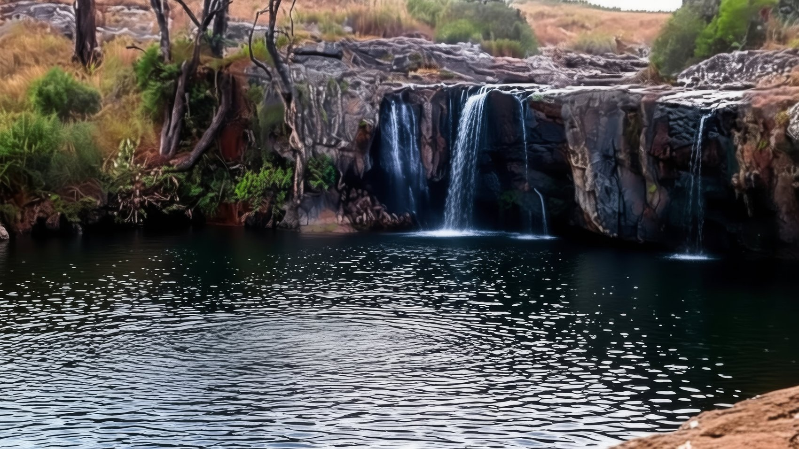
  <em>Mac Mac Pools</em>
</figure>

<figure>
  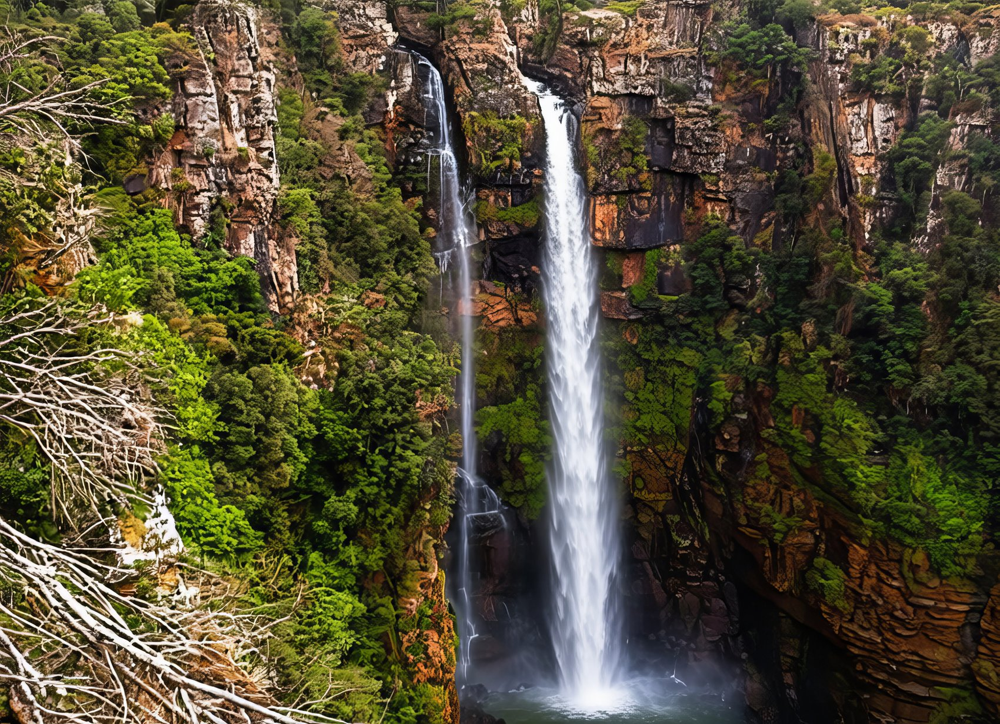
  <em>Mac Mac Falls</em>
</figure>

After a cappuccino in the historic gold‑mining village of Pilgrim’s Rest, which is entirely protected as a heritage site, we treated ourselves to an excellent but inexpensive lunch at Notty Pine Restaurant in Graskop: good Malay‑style lamb curry and the house speciality, grilled trout (around €4 per dish).

North of Graskop the scenery became even more spectacular. We first visited another impressive waterfall, Berlin Falls, and then looked out through “God’s Window” over the Lowveld lying 1,000 metres below.

<figure>
  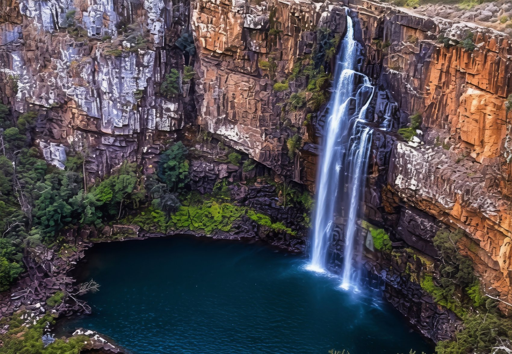
  <em>Berlin Falls</em>
</figure>

Bourke’s Luck Potholes left us with mixed feelings. On the one hand, the small canyon with its bizarre rock formations is beautiful; on the other, the area has been disfigured with awful railings and bridges, put there so the inevitable coachloads of package tourists, first greeted by a kitschy dance troupe, don’t fall into the water.

  <figure>
      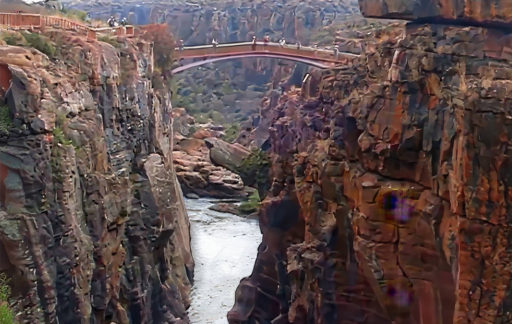
      <em>Bourkes Luck.Potholes</em>
    </figure>

  <figure>
      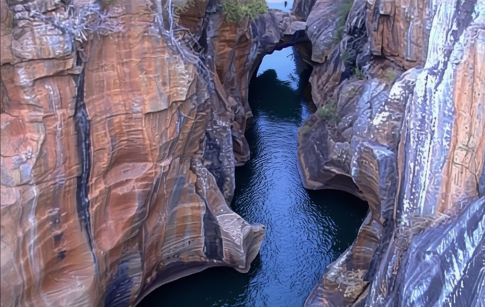
      <em>Bourkes Luck.Potholes</em>
    </figure>

After that, Blyde Canyon proper began: a magnificent gorge that you could look down into from several viewpoints. We spent the night at the wonderfully located Aventura Eco Blydepoort Resort, in perfectly decent lodges with kitchen, bathroom and a barbecue terrace for R300. The buffet in the restaurant, however, was catastrophic.

## Day 4 – 6 September

After crossing the scenic Abel Erasmus Pass, we drove through the Lowveld into Kruger National Park (entry: R84 for two people). We entered through Orpen Gate and drove (partly on tarmac, partly on dirt tracks) to Olifants Camp. The landscape really did match the kitsch “Out of Africa” image, and we saw masses of zebras, giraffes and antelope.

<figure>
  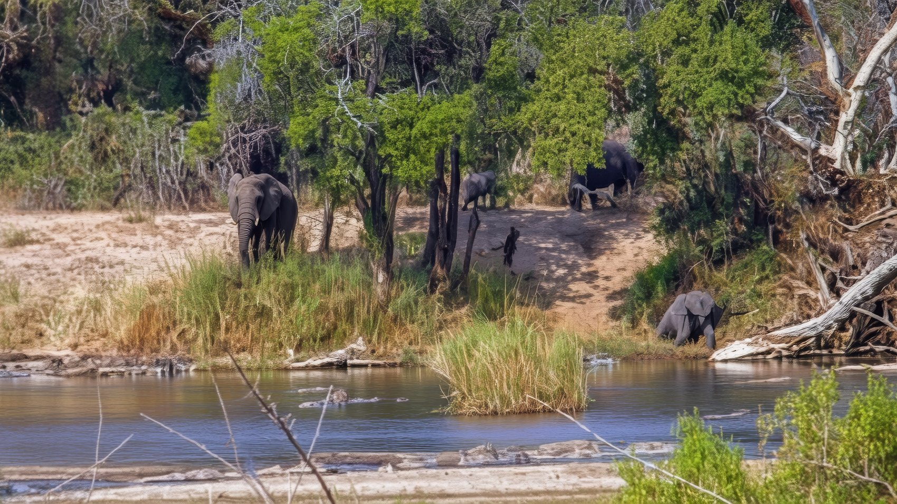
  <em>Kruger NP</em>
</figure>

We were also lucky enough to come across a herd of buffalo and two herds of elephants.

We stayed in a typical rondavel at beautifully situated Olifants Camp (neatly furnished, with a braai area) for R315. From the resort terrace in the evening we could even watch a few hippos bathing.

## Day 5 – 7 September

At 5.30am we set off on the three‑hour morning safari we’d booked the day before (R70 per person). In the open truck (and, thanks to the low season, only seven of us) we drove through the park and, right at the start, spotted lions returning from a hunt. We were also taken to a spot that was perfect for hippo‑watching and saw two crocodile heads in the distance; otherwise we’d seen more animals yesterday.

We left Kruger via Phalaborwa Gate and drove to Tzaneen, a modern but pleasant provincial town, where we had an excellent, good‑value lunch at Villa Italia on the main road: carpaccio for R23, grilled squid (R40), and a tasty mushroom‑spinach mixture topped with mozzarella (R21).

Over the misty, green Magoebaskloof Pass we reached the motorway and drove on to Warmbad, a spa town with hot springs, where we stayed at the very pretty Palmeira Guesthouse (R180 per person including breakfast). “Very pretty” applied mainly to the communal areas; the rooms themselves had plenty of character and were spacious, but a touch neglected.

## Day 6 – 8 September

In the morning we took the shortest route to Pilanesberg National Park (which meant partly on unpaved roads). It’s a park that is much smaller and scenically more beautiful than Kruger, but it also doesn’t offer the same density of wildlife. Still, we managed to spot a rhino, elephants, hippos, wildebeest and baboons, and watched a mighty lion stroll calmly across the road right in front of us. Right in the middle of the park, in an old colonial building, there’s a restaurant with a beautiful panoramic terrace. All in all, a very worthwhile destination.

  <figure>
      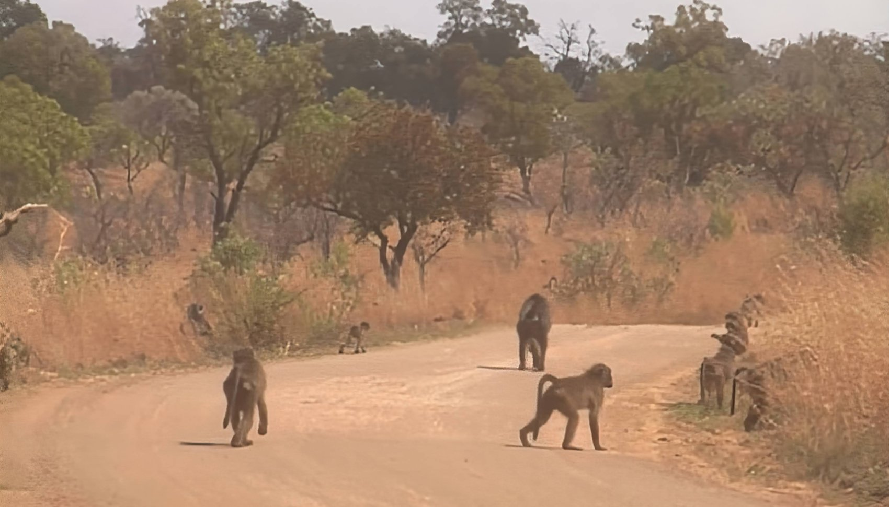
      <em>Pilanesberg NP</em>
    </figure>

  <figure>
      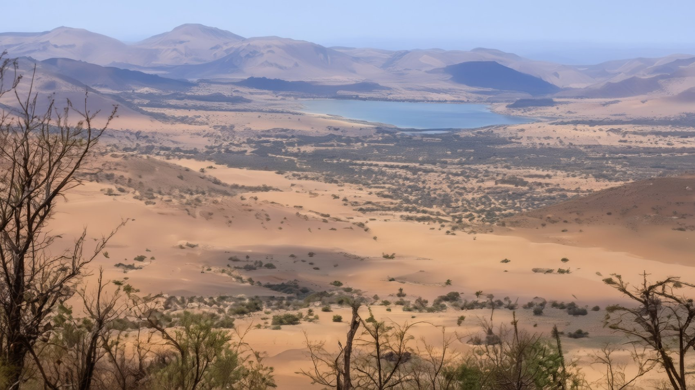
      <em>Pilanesberg NP</em>
    </figure>

In the afternoon we took a detour to Sun City, an artificial kitsch metropolis, complete with palace hotel, South Seas beach and casinos.

<figure>
  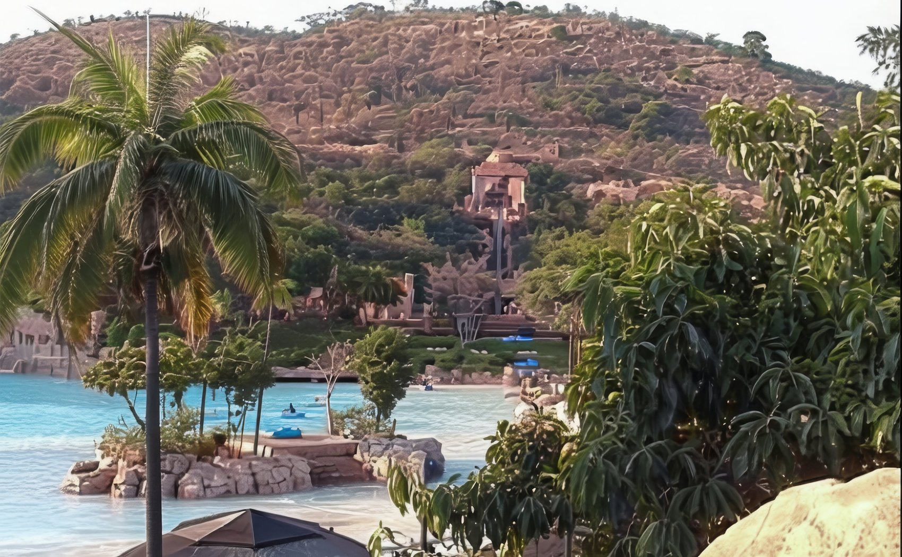
  <em>Sun City</em>
</figure>

It’s done quite well, but it really isn’t my thing. We did, however, eat well and cheaply at “Squires”. The ostrich fillet was even excellent. We spent the night in a highly atmospheric, but overpriced, safari tent (R200) at Pilanesberg Camp.

## Day 7 – 9 September

Today we set off for Jo’burg, with an extended lunch break in Pretoria, whose centre feels very American. A few colonial buildings still remain, and the government buildings are quite impressive.

<figure>
  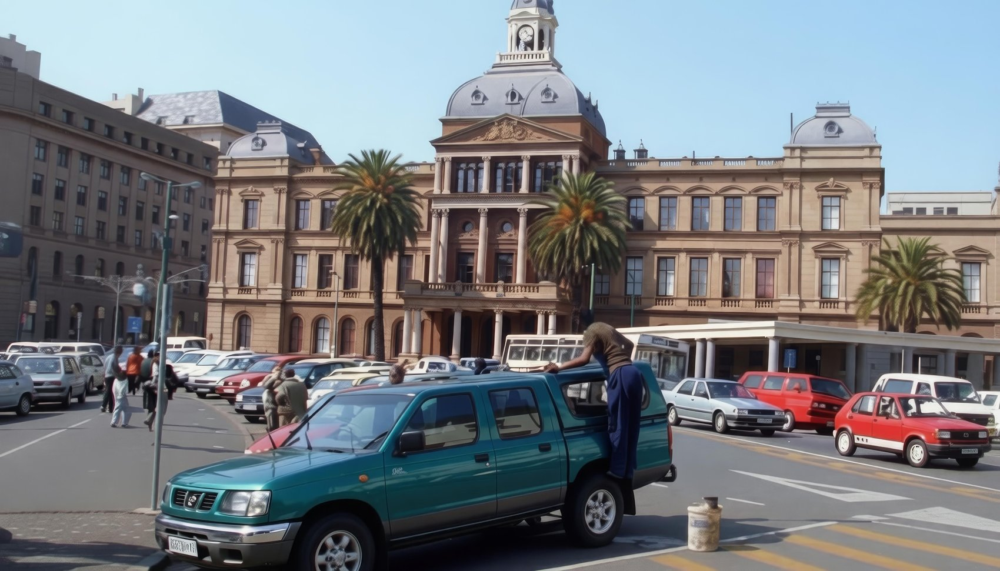
  <em>Pretoria</em>
</figure>

Otherwise the city isn’t a must-see, but it isn’t unattractive either.

We had lunch in Hatfield, Pretoria’s pub and restaurant district, on a pleasant square at the Italian place “Mozarella’s”. Here too the food was generally good and inexpensive; unfortunately the vinaigrette on both the spinach salad and the carpaccio was too sour.

Back in Johannesburg we checked into our hotel. “Protea Wanderers” is in a ‘safe’ suburb about a 10-minute drive from the centre, and we had a very comfortable room for R600.

In the afternoon we strolled around the huge Rosebank Mall and in the evening drove to the pretty restaurant district of Melville. Here there’s one café and restaurant after another. We were spoilt for choice and decided on “Chaplin’s”, which is said to be among the 100 best restaurants in South Africa. The ambience was wonderful; the presentation, however, was too pretentious and the food was, at best, average. The ostrich fillet was very good, the crème brûlée was quite OK, but the Thai prawn and chicken curry was an absolute joke and tasted of nothing. When we asked about it, we were told that this was how it had to be, because Thai cuisine is fundamentally very mild (!!!).

## Day 8 – 10 September

Today we took a guided tour of Johannesburg and Soweto. For R250 per person we had a minibus and a guide all to ourselves, which was rather surprising. Our guide’s aim was to show us that reports of crime and danger in Jo’burg don’t reflect reality and are largely a thing of the past, and he was so successful that, in the afternoon, we went back into the supposedly dangerous city centre on our own.

Jo’burg is a huge city with ultra‑rich suburbs, a downtown where a few colonial buildings still stand among the skyscrapers, and then the vast townships, the suburbs where Black people were forced to live during apartheid.

The highlight of Jo’burg was the view over the city from the 52nd floor of the Carlton Building.

  <figure>
      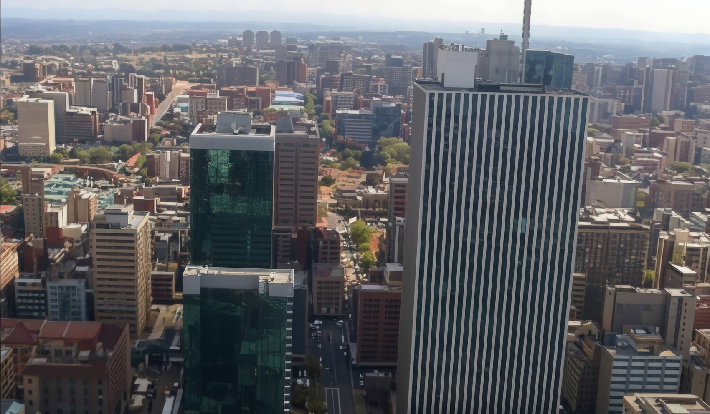
      <em>Johannesburg</em>
    </figure>

  <figure>
      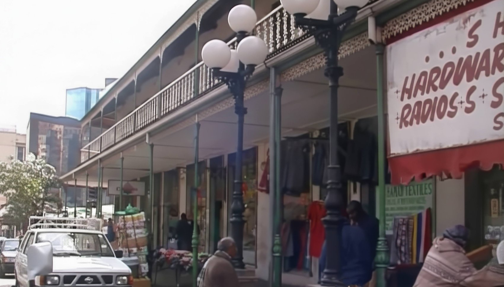
      <em>Johannesburg</em>
    </figure>

Soweto isn’t a slum in the traditional sense, but more a city in its own right, with many modest middle‑class houses, a few large villas and also the poorer settlements, which, compared with the slums in India, look fairly orderly.

<figure>
  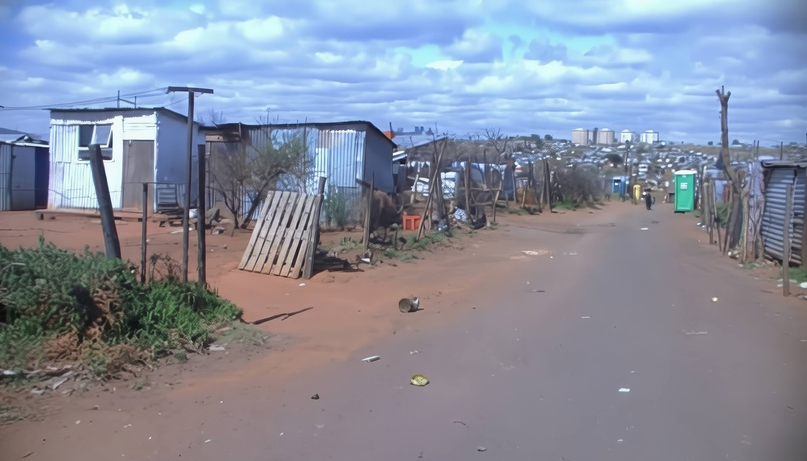
  <em>Soweto</em>
</figure>

Visiting Mandela’s former house felt like a tourist rip‑off; the brand‑new museum around the corner, documenting the 1976 uprisings, was excellent.

We also had lunch in Soweto, at Wandie’s Place, where there were as many tourists as locals; the all‑you‑can‑eat buffet for R50 in the atmospheric dining hall was perfectly fine. Traditional African food, very simple, but tasty.

<figure>
  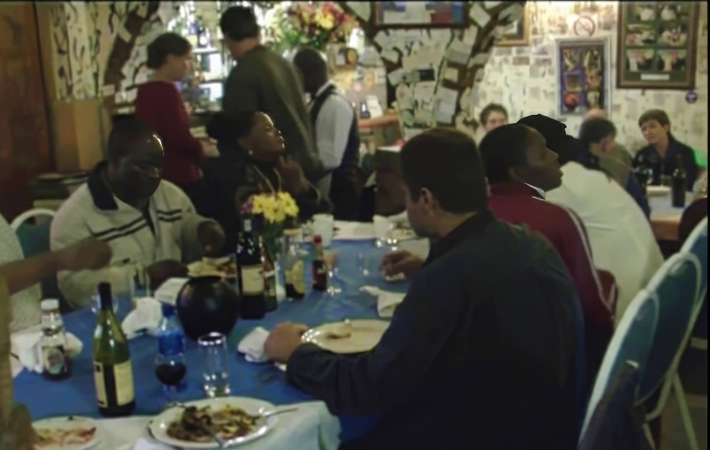
  <em>Soweto - Wandies</em>
</figure>

We had dinner in Newtown, Jo’burg’s “new” cultural quarter in the centre. “Gramadoelas” is supposed to be the most beautiful and best restaurant in South Africa, and anyone who’s anyone eats here. That evening, however, we were the only guests in this beautiful place. The food was excellent, the Moroccan dessert was a revelation, and the prices were surprisingly moderate.

## Day 9 – 11 September

It’s about 400 km from Jo’burg to Swaziland through dull agricultural and industrial scenery. The border formalities were quick and easy, and we drove another 35 km to the Malotja Wilderness Area, where we rented a comfortable wooden cabin with a kitchen and fireplace (R300).

On the bumpy, unpaved roads of the reserve we drove through wonderful wild mountain scenery to a few viewpoints, before doing a two‑hour hike along a canyon to Malotja Falls. The walk was very strenuous because of the steep climb, but the fantastic views, and the solitude of the wilderness, made up for the effort.

<figure>
  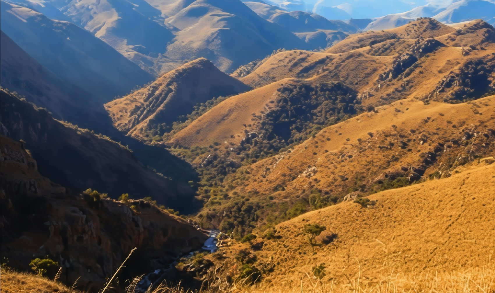
  <em>Molotja Wilderness Area</em>
</figure>

## Day 10 – 12 September

After a stroll around Mbabane, Swaziland’s prettily situated little capital (though not particularly attractive), we drove into the royal Ezulwini Valley.

<figure>
  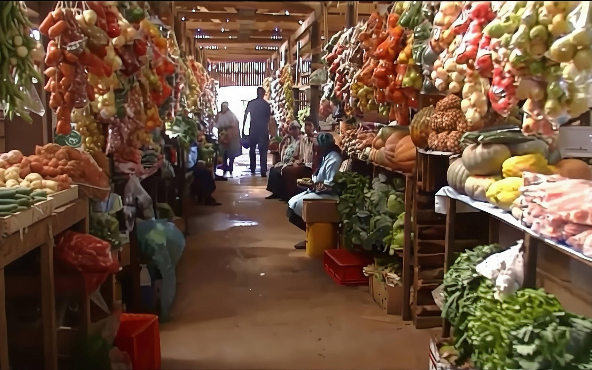
  <em>Mbabane</em>
</figure>

We first sorted out our accommodation. Sondzuela Backpacker’s Lodge lies in the secluded Mlilwane Wildlife Reserve and is an unusually comfortable traveller’s guesthouse with pool on a large property. The double room here cost E150 with a spotless shared bathroom.

  <figure>
      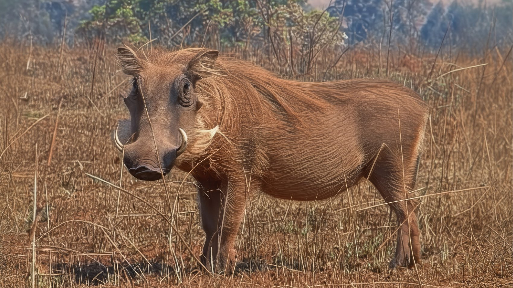
      <em>Ezulwini Valley</em>
    </figure>

  <figure>
      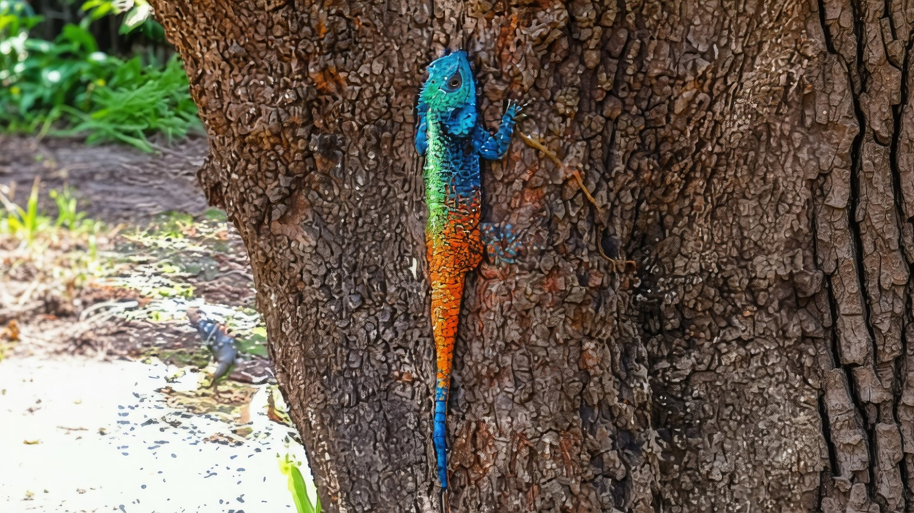
      <em>Ezulwini Valley</em>
    </figure>

After booking a “luxury safari” (R730 per person all inclusive) in Mkhaya Reserve for the next day, we drove around Mlilwane for a bit, where there were, among other things, warthogs and zebras. Then we visited a Swazi Cultural Village (R40) in the Ezulwini Valley. The village is beautifully located on a river and near a pretty waterfall with a picnic spot, and it is still inhabited, so it isn’t too dreadful a tourist trap. After a tour with a guide in a loincloth, we watched a traditional Swazi dance which, however, was not particularly impressive.

  <figure>
      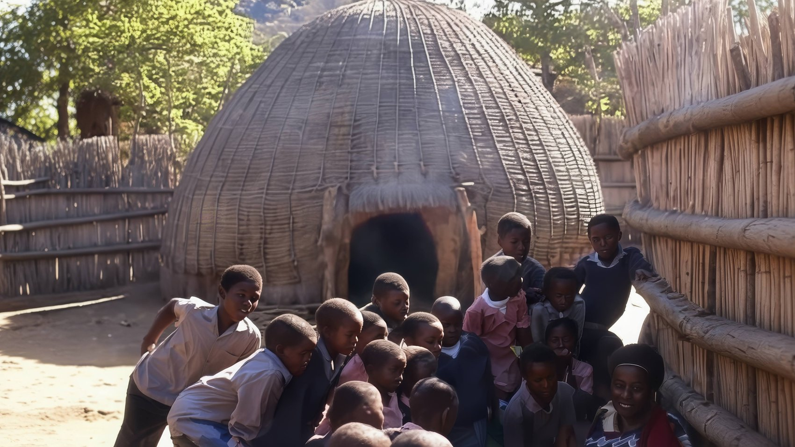
      <em>Ezulwini Valley</em>
    </figure>

  <figure>
      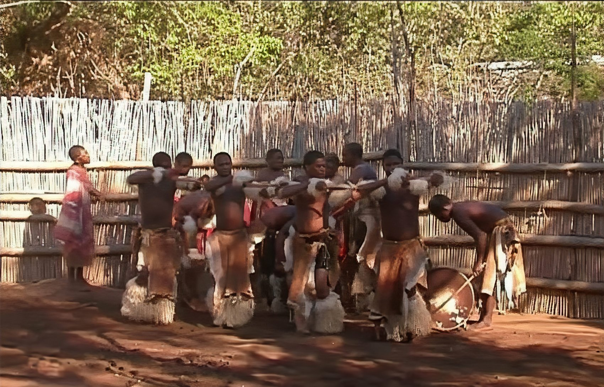
      <em>Ezulwini Valley</em>
    </figure>

## Day 11 – 13 September

At 10am our first safari in a private reserve began. A guide picked us up in a Land Rover and, on the way to the camp, we saw a rhino family, including a clumsy baby rhino, close enough to touch.

  <figure>
      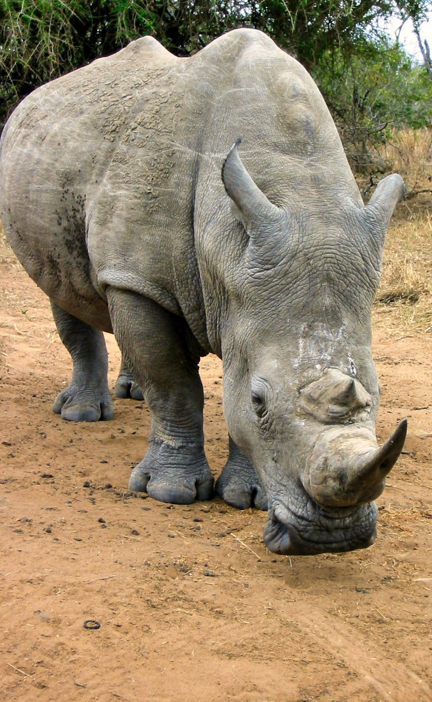
      <em>Swaziland - Mkhaya Reserve</em>
    </figure>

  <figure>
      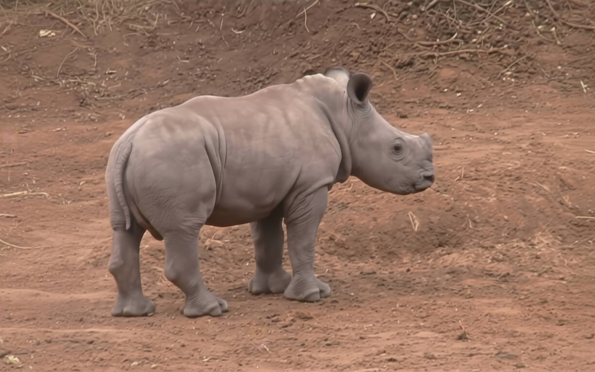
      <em>Swaziland - Mkhaya Reserve</em>
    </figure>

The most impressive safari experience so far.

Once we arrived at the camp we had a good lunch and, until the afternoon, we were the only guests. The camp, and the accommodation there, is among the most atmospheric and wonderful places you could possibly stay. The open‑air stone cottages are secluded in the middle of the bush, yet very comfortable.

  <figure>
      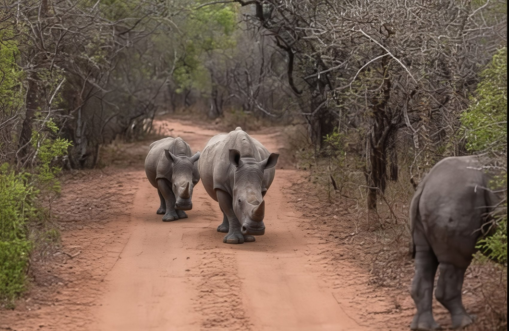
      <em>Swaziland - Mkhaya Reserve</em>
    </figure>

  <figure>
      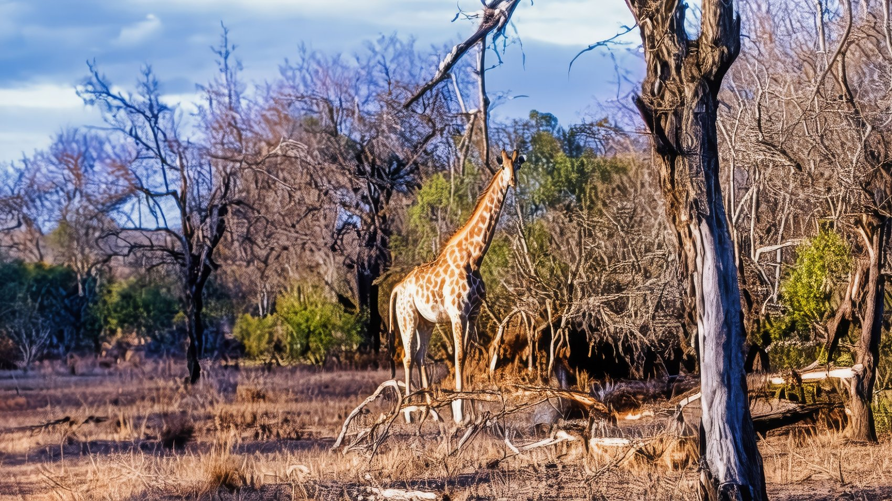
      <em>Swaziland - Mkhaya Reserve</em>
    </figure>

We really could have skipped the second wildlife drive, because we’d already had the best experience at midday and the camp itself is so idyllic. Even so, we did see giraffes, hippos, crocodiles and rhinos once again. Dinner was also good (especially the impala with cabbage), and the atmosphere in the camp in the evening was unbeatable.

<figure>
  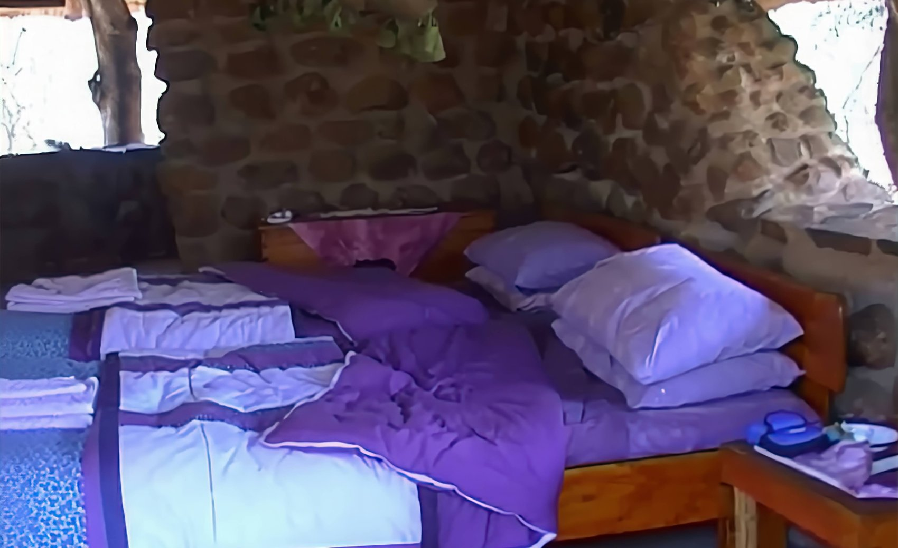
  <em>Swaziland - Mkhaya Reserve</em>
</figure>

## Day 12 – 14 September

Early in the morning, before breakfast, we took our last excursion and saw three of the Big Five once more: elephants, buffalo and rhinos.

<figure>
  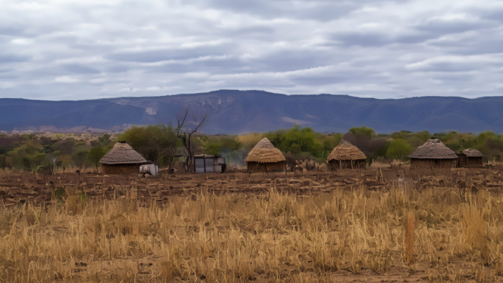
  <em>Swaziland</em>
</figure>

Then, sadly, it was time to say goodbye to the camp and drive towards KwaZulu‑Natal.

Swaziland gave us a fine send-off: a fantastic lunch at Lubombo Lobster Restaurant in Big Bend: magnificent king prawns (R140 a dozen), tasty seafood curry and grilled calamari; seafood that cheap, cooked that well, is hard to find.

Back in South Africa we drove over the spectacular Lebombo Mountains to Sodwana Bay in Maputaland. For many kilometres the road was unpaved but still quite easy to drive. In the national park we rented a large chalet, with terrace and a view over the Indian Ocean, surrounded by dense green vegetation, another wonderful little corner of the earth for R320.

## Day 13 – 15 September

Today we had an easy day in Sodwana Bay. In the morning we spent a few hours on the kilometre‑long, deserted beach, backed by wonderfully dense, green vegetation. At lunchtime we had tasty fish in the nice restaurant at Sodwana Bay Lodge, then we passed the rest of the day in our lovely chalet.

  <figure>
      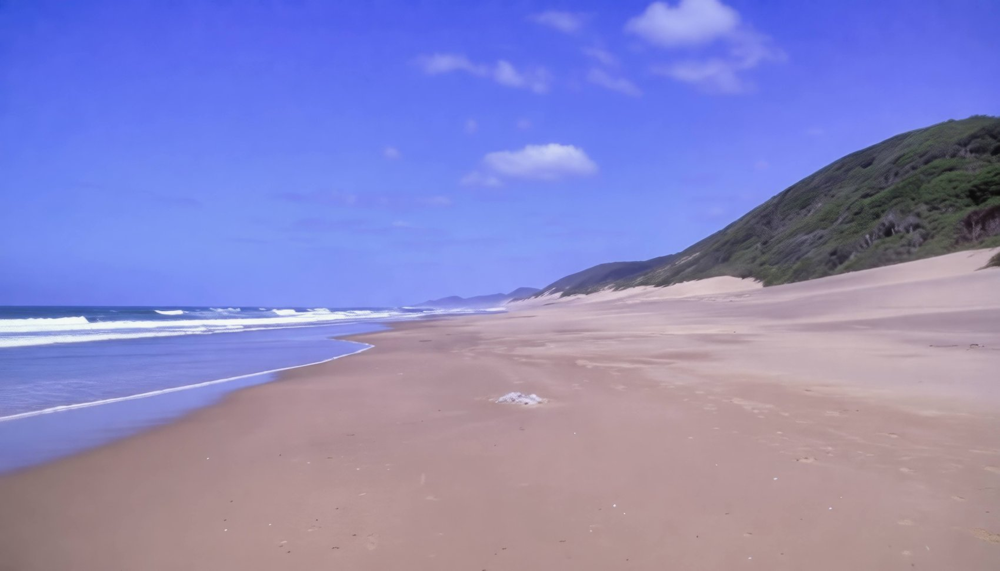
      <em>Sodwana Bay</em>
    </figure>

  <figure>
      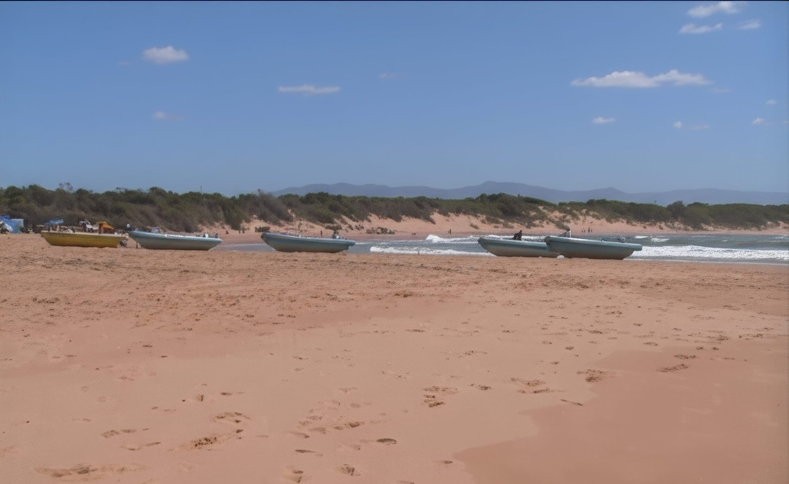
      <em>Sodwana Bay</em>
    </figure>

Off the coast of Sodwana Bay you’ll find the southernmost coral reefs in the world, which are meant to be very impressive. Unfortunately it was extremely windy today, so we gave snorkelling a miss.

## Day 14 – 16 September

In the morning we drove to St Lucia, where we took a boat trip on the lake of the same name (R20 per person) and saw crocodiles and hippos.

  <figure>
      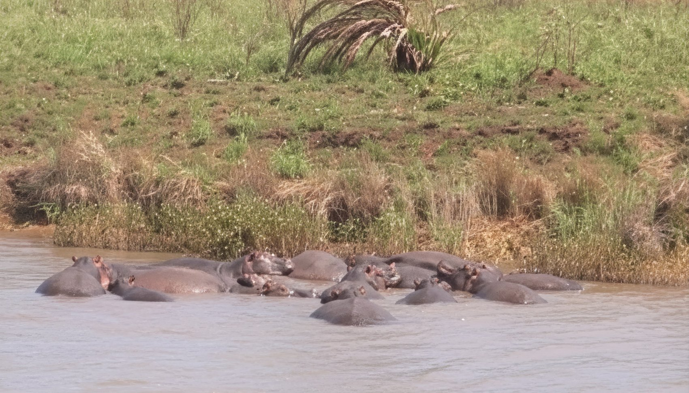
      <em>Lake St. Lucia</em>
    </figure>

  <figure>
      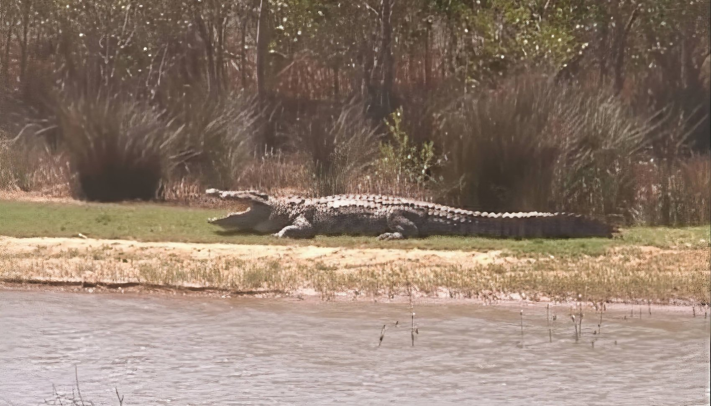
      <em>Lake St. Lucia</em>
    </figure>

The beach and lagoon at St Lucia are beautiful as well. After an excellent seafood lunch at Quarterdeck (the calamari steaks were fantastic, as was the inevitably pricey rock lobster), we drove through the lovely hilly landscape of Zululand inland to Babanango, a remote little backwater, and checked into the venerable Babanango Hotel.

<figure>
  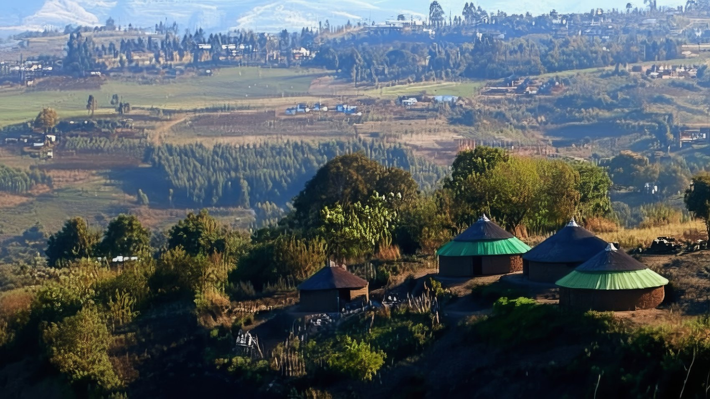
  <em>Zululand</em>
</figure>

The hotel has definitely seen better days and the rooms were quite expensive (R360), but the drinks in the brilliantly stocked Stan’s Bar, and dinner too, were ridiculously inexpensive.

## Day 15 – 17 September

Via Dundee and Harrismith we drove to Golden Gate National Park, with its colourful sandstone formations.

<figure>
  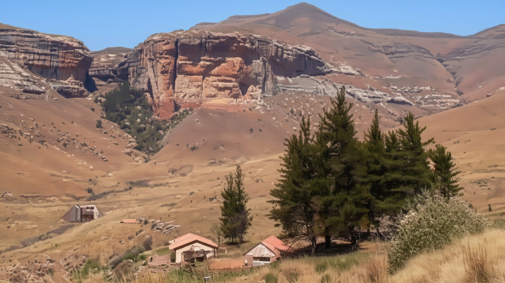
  <em>Golden Gate NP</em>
</figure>

Beyond the park we stopped for lunch in the pretty artists’ village of Clarens, where, surprisingly for the middle of nowhere, there are some lovely cafés and restaurants, an absolute rarity in this region.

Then it was on through impressive scenery to Fouriesburg, near the border with Lesotho, where we spent the night a little way out of town in a chalet at the secluded Meiringskloof Camp. The chalet was simple but spacious, wonderfully situated below high cliffs, and excellent value (R180).

<figure>
  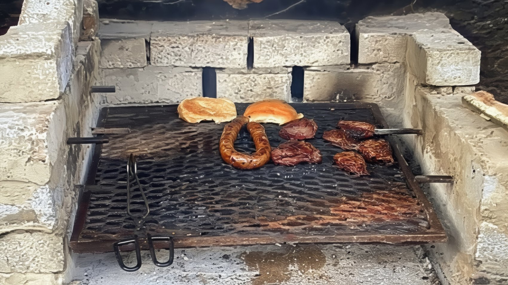
  <em>Meiringsskloof Camp</em>
</figure>

In the evening we grilled fillet steak and boerewors, because the braai spot behind our chalet was simply irresistible.

## Day 16 – 18 September

Early this morning we drove into Lesotho. There we picked up a new road, spectacularly engineered through the mountains, from Leribe to Katse Dam. The mountain scenery (especially by the Bokong National Park visitor centre, looking out towards the waterfall) was absolutely magnificent.

  <figure>
      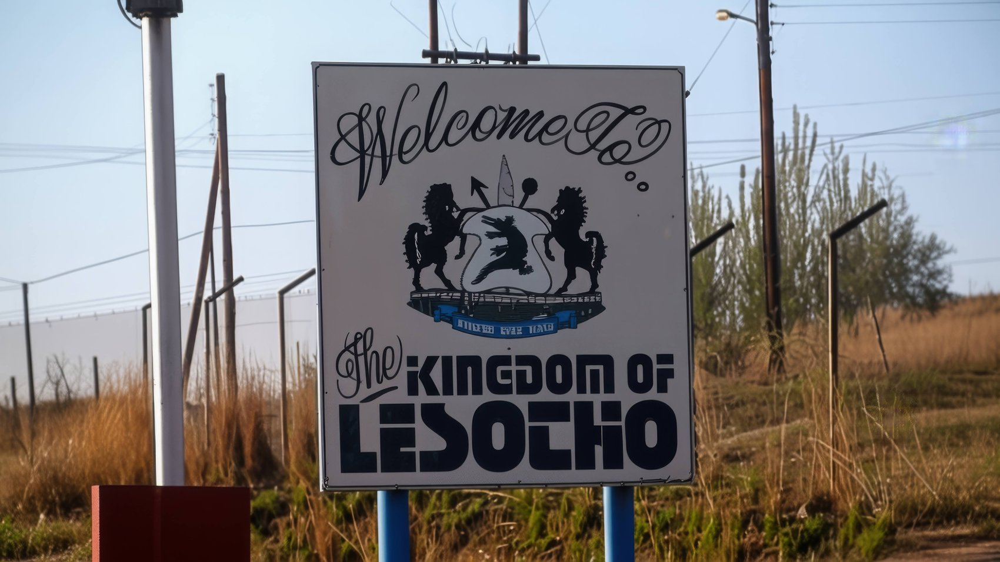
      <em>Lesotho</em>
    </figure>

  <figure>
      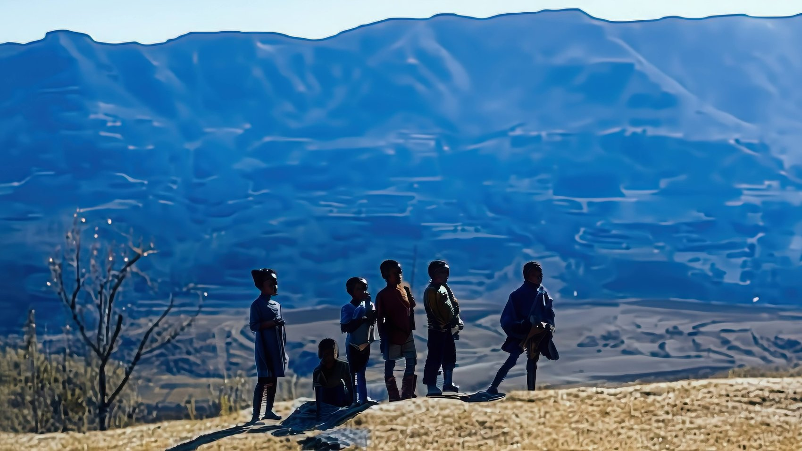
      <em>Lesotho</em>
    </figure>

And it got even better. From Katse we drove along a gravel track to the remote town of Thaba Tseka. Along the way there were not only breathtaking views around every bend, but also beautiful Basotho villages of round huts.

  <figure>
      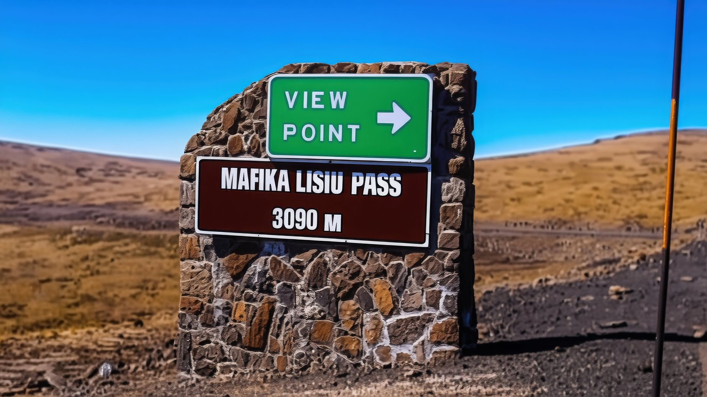
      <em>Lesotho</em>
    </figure>

  <figure>
      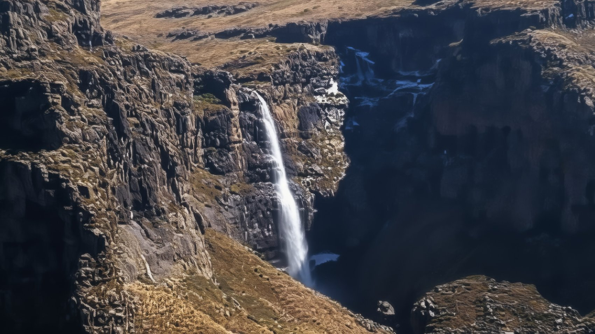
      <em>Lesotho</em>
    </figure>

Life here is still entirely traditional: people travel on foot or by pony, and the most common job seems to be a shepherd. This region is one of the least developed and most unspoilt regions I’ve ever travelled through. It felt like being transported back centuries.

  <figure>
      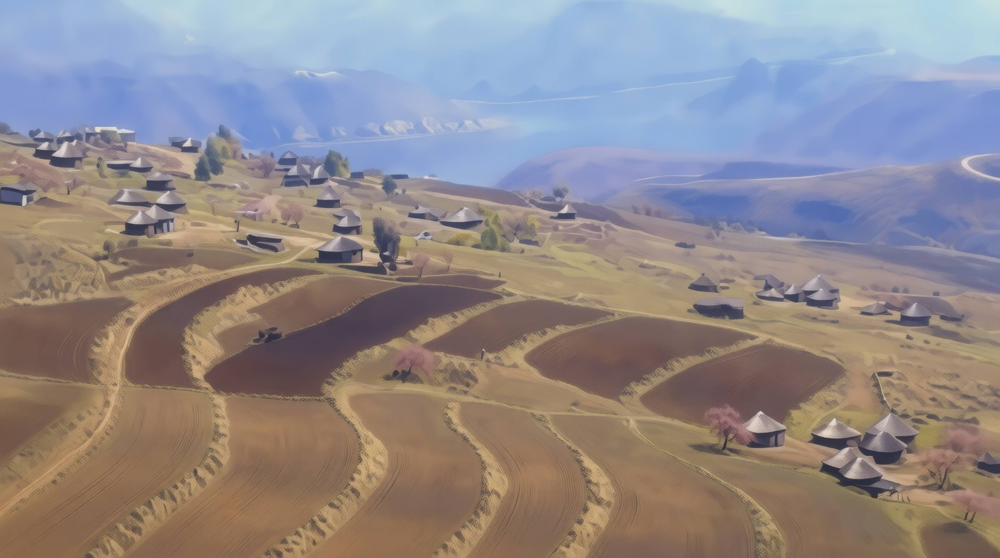
      <em>Lesotho</em>
    </figure>

  <figure>
      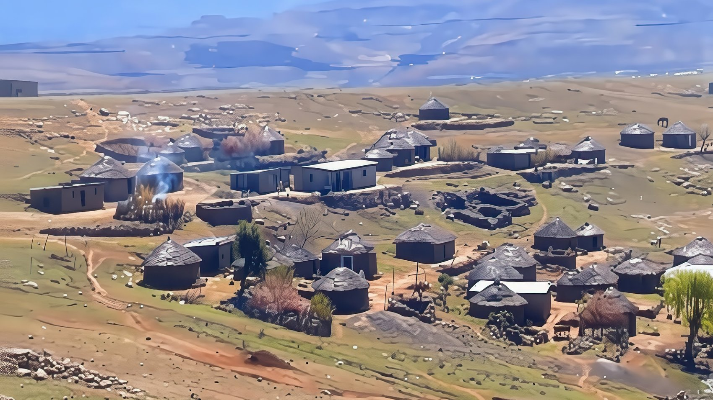
      <em>Lesotho</em>
    </figure>

Near Thaba Tseka there was supposed to be a guesthouse, but it no longer existed, so we had to cover another mountainous 150 km (100 of them on dirt tracks) over four passes to the next lodge. Mmelilni Lodge, about 20 km before Maseru, was decent enough, with rondavels and a bathroom for 230 Maloti. The restaurant also served an excellent vegetarian platter for 25 Maloti.

  <figure>
      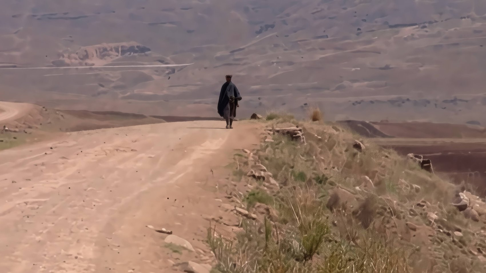
      <em>Lesotho</em>
    </figure>

  <figure>
      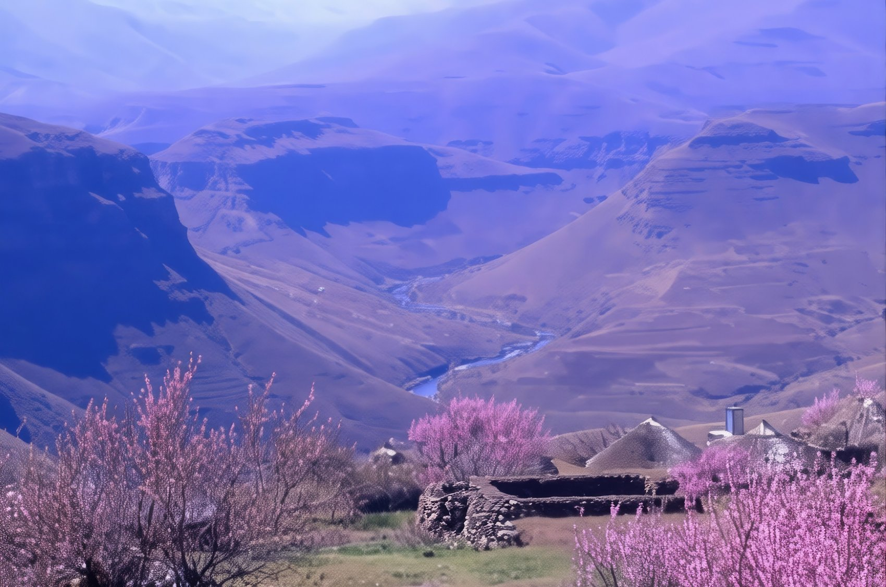
      <em>Lesotho</em>
    </figure>

## Day 17 – 19 September

In the morning we drove to the capital, Maseru, but didn’t stay long, as there are neither sights nor any of the other big‑city amenities, inviting cafés and the like. By late morning we arrived at Malealea Lodge, wonderfully located and more or less the hub of tourism in Lesotho.

While there are hardly any places to stay, let alone tourist infrastructure, in the rest of the country, even tour groups stop here, which doesn’t exactly help the atmosphere. Still, the surroundings of the lodge offer a magnificent mountain backdrop.

<figure>
  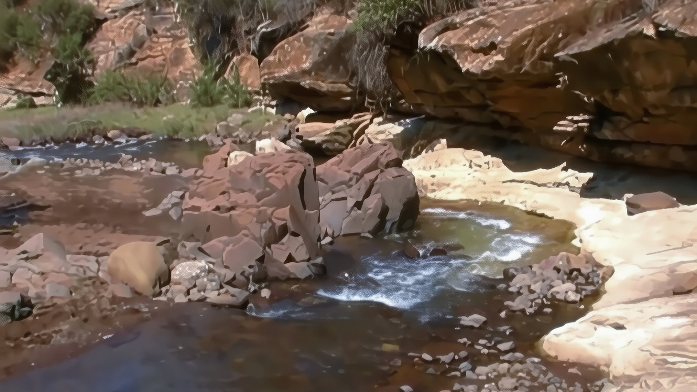
  <em>Lesotho - Malealea</em>
</figure>

First we drove along a track to Botsoela Waterfall, a glorious spot we had all to ourselves. The “road” continued to a viewpoint from which you could survey the whole area, with its mountain chains and gorges.

Our accommodation at the lodge was fine: a simply furnished hut with bathroom cost 220 Maloti. Dinner for 60 Maloti was surprisingly good, chicken with vegetables, simple, but the flavours were spot-on.

## Day 18 – 20 September

In the morning we did the by-now almost obligatory ride on Basotho ponies (90 Maloti per person). For two hours we followed the dramatic Pitseng Canyon through Lesotho’s wild mountain landscape. The ride was a real highlight, but two hours was absolutely enough for my backside and my back.

Via Mohale’s Hoek and Quthing we crossed back into South Africa, and after many kilometres on dirt tracks we finally reached a proper road again. The scenery here is still interesting in places, but the drive from Aliwal North to Queenstown took us for many kilometres through utter emptiness.

In Queenstown, a fairly big town in the middle of nowhere, we stayed in very neat little rooms at Val’s GH (R145 per person). When it comes to food, your choice is basically steakhouse or steakhouse, but the dishes (fillet steak on a hot stone, mushroom skewers) at the absolutely packed Buffalo Springs Spur were good and good value.

## Day 19 – 21 September

Today we headed back to the coast. Our first stop was the big city of East London.

<figure>
  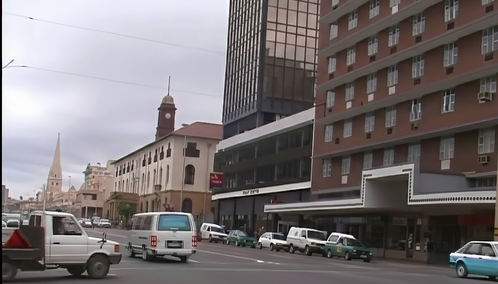
  <em>East London</em>
</figure>

It doesn’t have any particular sights, but with its beachfront setting, the green hinterland and a few handsome colonial buildings, it isn’t unattractive.

Not far from East London is the beautiful coastal resort of Cintsa, where we had lunch at Michaela’s. This hilltop restaurant, reached by lift, is among the finest coastal restaurants anywhere.

  <figure>
      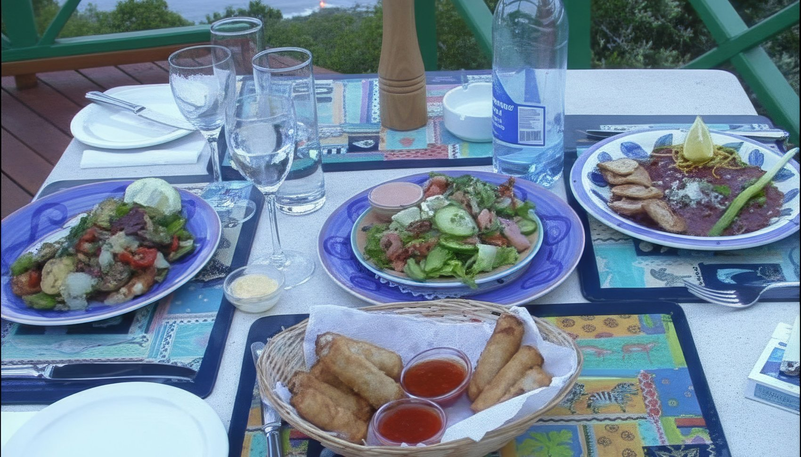
      <em>Cintsa - Michaela`s</em>
    </figure>

  <figure>
      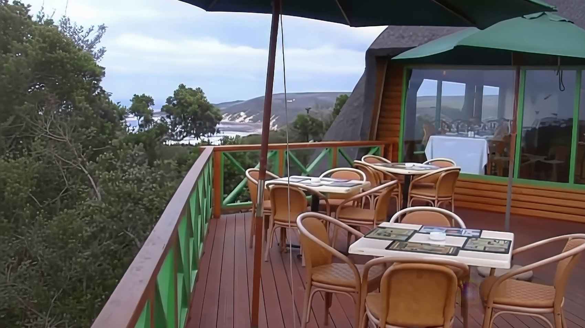
      <em>Cintsa - Michaela`s</em>
    </figure>

It’s tastefully done, and from the terrace you get sublime views over the sea, the beach and the dense vegetation inland. To top it all off, the food is very good and the prices are sensible.

Back on the N2, the Great Kei River Pass served up more spectacular views before the stretch to the turn‑off for Coffee Bay became rather dull. This part of South Africa seems especially poor, and we repeatedly passed bleak corrugated‑iron shanty settlements.

The route through the coastal region of the Transkei was more cheerful again: lovely traditional Xhosa villages of round huts dot the beautiful rolling hills all the way to the sea. Despite its relative remoteness, Coffee Bay is quite touristy, but still a relaxed little place with a lagoon on a wildly romantic green coast.

We spent the night at Kwa Tshezi Lodge, a would-be luxury hotel, which was highly entertaining. The rooms were nice and very spacious, but far too expensive (R255 per person B&B) and somehow felt unfinished. The lounge, on the other hand, was genuinely tasteful and luxurious, and in the evening there were free oysters and other snacks at the bar.

The service was completely inept, and the head chef seemed to think he was Bocuse in person. His beautifully arranged “nouvelle cuisine” was, dessert aside, pretty generic in flavour, and the tiny portions were overpriced. In this wild, remote region, the whole scenario was an almost surreal experience.

## Day 20 – 22 September

Because it rained today, we drove the 400 km straight through to Durban. The route took us through the former Transkei homeland and wasn’t especially scenic, apart from the spectacular Kei River Pass.

We arrived fairly late in Durban and checked into City Lodge, not far from the beach. The room was small, but very comfortable (R405).

Since Durban is strongly influenced by Indian culture, we decided to go for an Indian meal. Jewel of India at Holiday Inn North Beach is meant to be one of the city’s best. The restaurant was rather upmarket and pleasantly furnished. The food was excellent too and, for that standard, good value.

## Day 21 – 23 September

Today we spent the whole day in Durban, an attractive, and above all interesting, city, because Indian, African and Western influences mix here. The markets are lively and entertaining; the centre is a combination of modern, sleek shopping arcades and old colonial buildings; and the city sits on a 6 km beachfront promenade, a seaside resort right in the middle of a big city.

  <figure>
      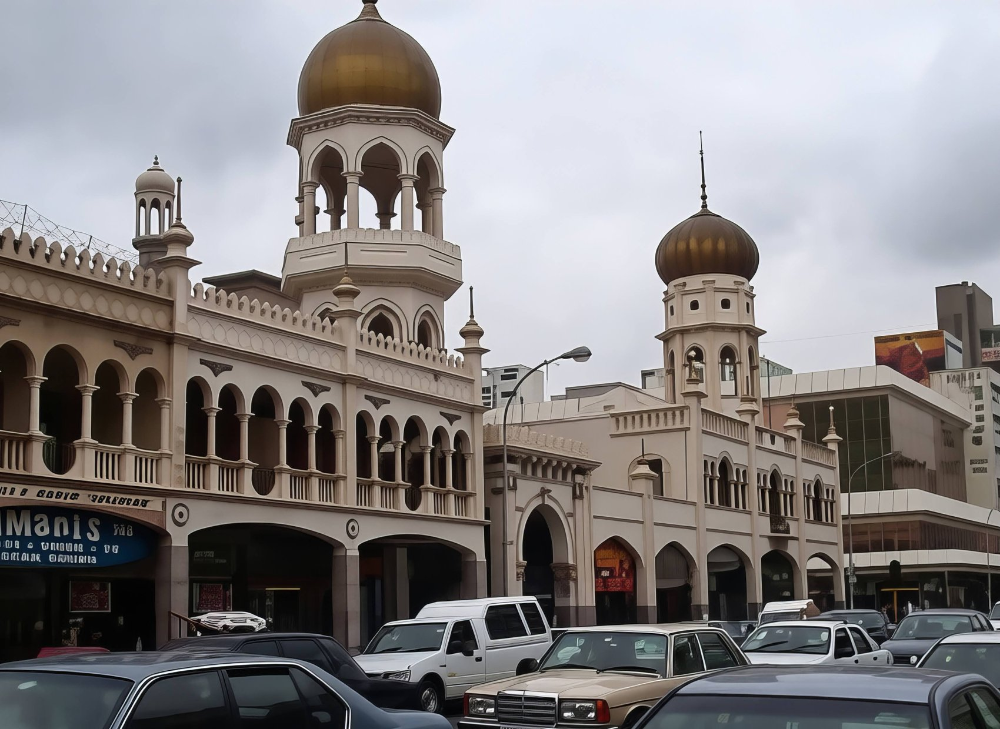
      <em>Durban</em>
    </figure>

  <figure>
      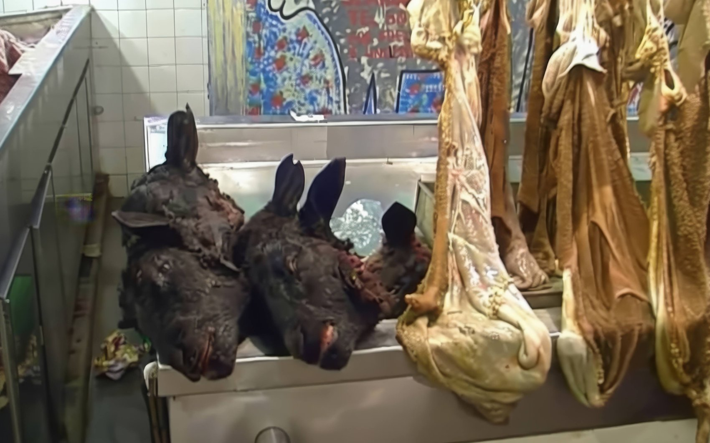
      <em>Durban</em>
    </figure>

<figure>
  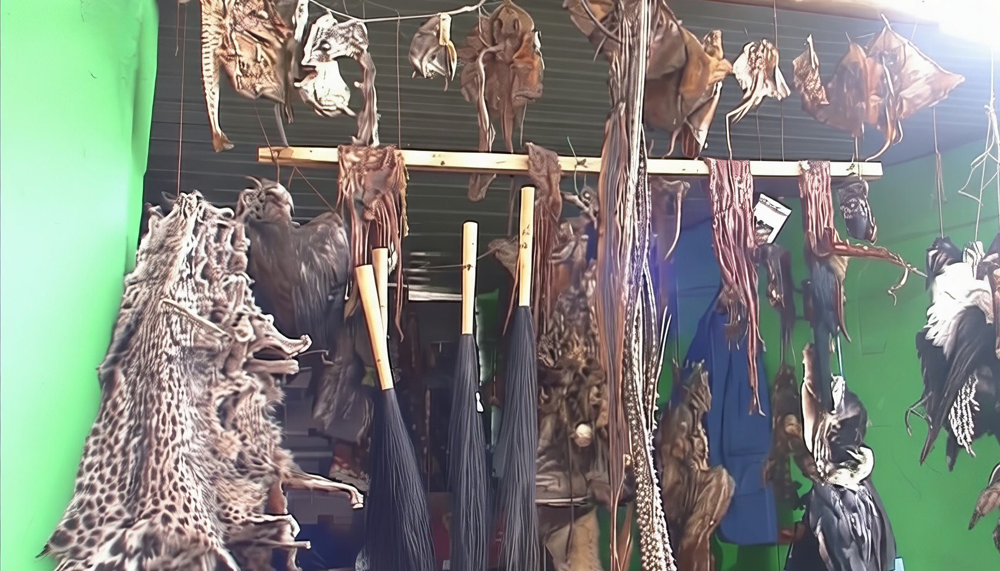
  <em>Durban</em>
</figure>

In the evening we ate at Holiday Inn again, Durban’s gourmet hotel. The smart Daruma served flawless sushi and other Japanese treats at reasonable prices.

## Day 22 – 24 September

After Achim started his cycling tour today, I spent a bit more time in Durban, at the Workshop, a beautiful mall in an old colonial building, and along the seafront promenade.

<figure>
  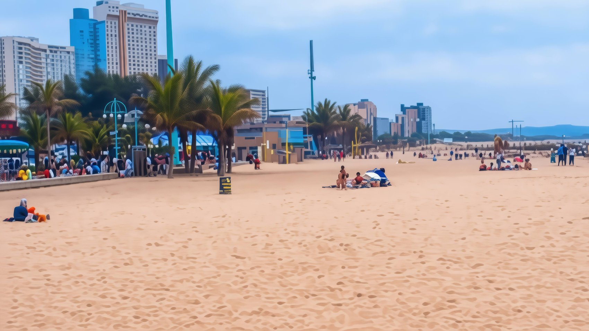
  <em>Durban</em>
</figure>

Then I set off myself, in my locally hired funky blue Golf, heading for the Sunshine Coast. This stretch of coast south of Durban is a very popular holiday area, but out of season it’s quite pleasant: the region is pretty, with wild sandy beaches, lots of lagoons and a tropical‑green hinterland.

In the evening I had a good seafood dinner at Bell&Anchor Restaurant near Hibberdene. I stayed on the campsite in a pretty safari tent for R150.

  <figure>
      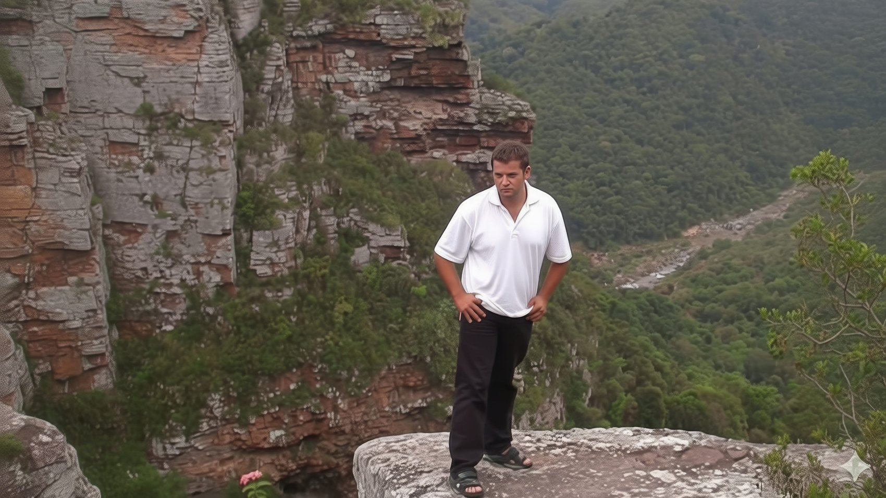
      <em>Oribi Gorge</em>
    </figure>

  <figure>
      
      <em>Oribi Gorge</em>
    </figure>

<figure>
  
  <em>Oribi Gorge</em>
</figure>

## Day 23 – 25 September

Further south along the Hibiscus Coast it’s still lovely, but more built‑up than the Sunshine Coast. There’s even a resort called Margate where, coconut palms aside, you could almost imagine you were on the Costa Brava.

From Port Edward the road turned inland through the Transkei. The landscape and villages here aren’t as beautiful as further south. The approach to Port St Johns, at a river mouth, was breathtaking though.

Port St Johns itself is small and not particularly attractive, but the surroundings are wonderful: tropical vegetation, lagoons and beaches; Second Beach in particular is of magical beauty.

  <figure>
      
      <em>Port St. Johns</em>
    </figure>

  <figure>
      
      <em>Port St. Johns</em>
    </figure>

Up on a rise above the lagoon sits The Lodge, where we stayed overnight. The simple rooms were a bit pricey (R150 per person including breakfast), but the view from the lodge veranda over the coast was priceless.

We had a decent seafood dinner at Gecko Moon, but with lousy service.

## Day 24 – 26 September

Via the interior we drove back to Umtata and then on towards Coffee Bay, though this time we stayed 8 km west of it at Hole in the Wall Resort.

Hole in the Wall refers to a rock arch just off the coast, one of the attractions along the Wild Coast. The resort also sits by two lovely beaches in magnificent scenery.

  <figure>
      
      <em>Coffee Bay</em>
    </figure>

  <figure>
      
      <em>Coffee Bay</em>
    </figure>

The coastal road from Hole in the Wall to Coffee Bay is very difficult in a normal car, but it offers spectacular views along the coast and passes through beautiful, if poor, traditional Xhosa villages.

  <figure>
      
      <em>Coffee Bay</em>
    </figure>

  <figure>
      
      <em>Coffee Bay</em>
    </figure>

Tonight I stayed in the hotel’s backpacker section, where I had a four-bed room entirely to myself for R55. The set menu in the hotel restaurant for R50 was surprisingly decent.

<figure>
  
  <em>Coffee Bay</em>
</figure>

## Day 25 – 27 September

On the way back to Cintsa I took a detour to Kei Mouth and Morgan Bay. Kei Mouth is a fairly developed resort at the mouth of a large river, reached via a 30 km dirt road. Morgan Bay is smaller and lies just 4 km to the west (18 km by car). Both have lovely beaches, though the vegetation here is no longer quite as tropical as further north.

Cintsa  is among the most beautiful places on the coast, at least among those that are easy to reach. Apart from the glorious setting, it also offers the priceless luxury of Michaela’s restaurant, where we once again had a glorious lunch before driving on to our hotel in East London. The Windsor Courtyard had decent, if slightly small, en‑suite rooms for a reasonable R245.

## Day 26 – 28 September

The stretch of coast between East London and Port Alfred is known as the “Shipwreck Coast” and offers largely untouched dune beaches that are easy to access. The area around Hamburg is particularly impressive, and Port Alfred itself is an attractive holiday town with a marina and plenty of accommodation.

<figure>
  
  <em>Port Alfred</em>
</figure>

We had a beach bungalow at Spinning Reels, simply furnished, but very spacious (six beds), with a veranda overlooking the sea. A real bargain at R150. At lunchtime we had excellent catch-of-the-day on a terrific terrace at Guido’s Restaurant above the beach. In the evening we took a trip to Kenton‑on‑Sea, a cosy resort in especially beautiful coastal scenery.

<figure>
  
  <em>Kenton-on-Sea</em>
</figure>

Excellent dinner at Bock & Hunter in Port Alfred: kudu steak and pizza. Very cheap!

## Day 27 – 29 September

In the morning we drove inland to Grahamstown for breakfast. This colonial town, with a lovely Victorian centre complete with cathedral, feels very European and oddly out of place in this landscape, but it is highly attractive.

<figure>
  
  <em>Grahamstown</em>
</figure>

Breakfast at the pretty Dulce Café was excellent too.

On to Port Elizabeth, by far the biggest city in the region, built right into the slopes above the coast. The steep streets and colonial buildings are faintly reminiscent of San Francisco, and the city is easy to explore on foot via the signposted 5 km Donkin Heritage Trail. From the old lighthouse in the centre we had a wonderful view over the city.

  <figure>
      
      <em>Port Elizabeth</em>
    </figure>

  <figure>
      
      <em>Port Elizabeth</em>
    </figure>

PE is a very pleasant, attractive big city; the only blot on the cityscape is the ugly motorway that runs almost straight through the centre. We had lunch at a Japanese place in an extravagant, kitschy restaurant-and-shopping complex on the seafront promenade. The sushi was very good and the prices were moderate.

The coast south of PE is very appealing and surprisingly unspoilt, with rocky shorelines and sandy coves. We spent the night in Jeffreys Bay, a beach resort east of PE best known as a surfers’ mecca.

Seashells Luxury Accommodation looked fairly ordinary from the outside, but it more than lived up to its name. We had a huge, superb apartment with two bedrooms, two bathrooms, a lounge with sofa suite, satellite TV, a fully equipped modern kitchen (with washing machine and tumble dryer), and a massive sea‑facing terrace with a barbecue right on the water. The value for money was equally sensational: all that luxury for R400.

<figure>
  
  <em>Jeffrey's Bay</em>
</figure>

Good seafood for dinner, and magnificent mushrooms with spinach at Breakers Restaurant.

## Day 28 – 30 September

Today we passed Storms River Canyon, the official start of South Africa’s famous (and touristy) Garden Route. Our first stop was the “Big Tree”, as the name suggests, a very big tree, marketed as a major attraction in woodland‑poor South Africa. It’s a pleasant little walk along a boardwalk through dense forest to reach it; the tree is impressive enough, but not in the same league as California’s redwoods.

A different calibre altogether is Storms River Mouth in Tsitsikamma National Park. Unfortunately it’s also a stop for coach tours, but the coastal scenery here is enchanting, and a welcome change from the dune beaches so far: steep, densely wooded cliffs; the mouth of the Storms River Canyon spanned by a suspension bridge; small sand-and-shingle bays; and grand views from the View Point, a punishing 45‑minute walk from the resort (so punishing that the package tourists don’t make it up there, which, honestly, is half the appeal).

  <figure>
      
      <em>Tsitsikamma NP</em>
    </figure>

  <figure>
      
      <em>Tsitsikamma NP</em>
    </figure>

Since the tour groups had taken every chalet, we carried on towards Plettenberg Bay via Nature’s Valley, a wonderfully idyllic, relaxed place on the coast, set amid the densest vegetation, with a magical lagoon and the dramatic Tsitsikamma mountain range behind it.

<figure>
  
  <em>Nature's Valley</em>
</figure>

We stayed in average chalets at Aventura Resort, beautifully located on Plettenberg’s lagoon, but at R350 a bit too expensive for what they were.

<figure>
  
  <em>Plettenberg</em>
</figure>

In Plett we found an absolute rarity in rural South Africa: an (almost) authentic Thai restaurant. The chic Lemongrass served a divine fish grilled Thai‑style and a very good tom yam khung at the usual prices. The red beef curry needed a little extra seasoning, but the flavours were good.

## Day 29 – 1 October

On this sunny but very windy day we first spent a little more time in Plettenberg Bay, South Africa’s most popular seaside resort. It’s not hard to see why Plett is so popular: the mix of lagoons, mountainous hinterland and a magnificently curved bay with a broad sandy beach is fantastic. The town itself is a fairly ordinary, low‑key resort, thankfully, with just one eyesore, unfortunately plonked in a particularly lovely spot.

On the drive from Plettenberg to Knysna we turned off the N2 towards the coast several times: once to a gorgeous picnic spot on a deep gorge with views of the wild rocky shoreline; to a waterfall not far from the main road; and to Noetzie, a small lagoon beach framed by orange, jagged rocks, where the English built pretty private castles that are now rented out as apartments.

<figure>
  
  <em>Noetzie</em>
</figure>

Knysna is the centre of the Garden Route.

<figure>
  
  <em>Garden Route</em>
</figure>

It’s quite attractive, but very touristy, set on a large lagoon. The town centre has a few nice cafés; the best part of Knysna, though, is The Heads, where the lagoon squeezes through a rocky gap into the sea.

<figure>
  
  <em>Knysna</em>
</figure>

After an excellent steamed red snapper at the Chinese restaurant Wok This Way, we took a detour to the quiet holiday resorts of Brenton‑on‑Sea and Buffalo Bay, linked by a superb 7 km beach. Then, through a landscape of lakes behind the coast, we continued to Wilderness, a place of beautiful scenery that is sadly stuck right on the four‑lane N2, which runs along the coast here and kills any relaxed holiday mood stone dead.

We spent the night at Victoria Beach Lodge above the pleasant little bay of the same name. The chalets were spacious, well kept and at R165 almost a steal. Dinner at the Wilderness Grille: excellent seafood (including king prawns) and pizza!

## Day 30 – 2 October

From Victoria Bay it was only a short hop to George, the largest town on the Garden Route. The place itself feels rather sterile and dull, but its setting beneath the Outeniqua Mountains is quite striking.

Two passes lead from George over the range into the Little Karoo. The Outeniqua Pass is a fast road with fantastic views, but the more interesting one is the Montagu Pass, an unsealed, narrow route carved out of the rock over 150 years ago, winding through green mountains.

<figure>
  
  <em>Outeniqua Pass</em>
</figure>

<figure>
  
  <em>Montagu Pass</em>
</figure>

The final stop on the Garden Route is Mossel Bay. Its location and beach are excellent, but a vast industrial area on the outskirts rather undermines the charm. On the plus side, there’s a guesthouse in an old train right on the beach, and one of the very few genuine beachfront places in South Africa, set on the terrace of an old pavilion, with great fish dishes at bargain prices.

  <figure>
      
      <em>Mossel Bay</em>
    </figure>

  <figure>
      
      <em>Mossel Bay</em>
    </figure>

From Mossel Bay the R328 crosses the Robinson Pass (glorious views) into the Little Karoo and on to Oudtshoorn, the world capital of ostrich farming.

<figure>
  
  <em>Little Karoo</em>
</figure>

Around town, in fascinating semi‑desert, there are ostrich farms that also serve as tourist attractions. The town itself isn’t unattractive, with a few nice cafés and restaurants in colonial buildings, but it is very touristy.

Dinner was ostrich, served three ways, in the lovely setting of De Fijne Kuiken. The calamari steak there was excellent too. We stayed in modest chalets at Smit Caravan Park for R240.

## Day 31 – 3 October

In the morning we drove over the magnificent Swartberg Pass on an unsealed road to Prince Albert in the Karoo. The pass is, rightly, one of South Africa’s most famous and impressive landmarks.

  <figure>
      
      <em>Swartberg Pass</em>
    </figure>

  <figure>
      
      <em>Swartberg Pass</em>
    </figure>

Prince Albert is a tiny desert backwater with a few pretty colonial houses in a stark setting, about as provincial as it gets.

  <figure>
      
      <em>Swartberg Pass</em>
    </figure>

  <figure>
      
      <em>Swartberg Pass</em>
    </figure>

On the way back to Oudtshoorn we took an alternative route through the dramatic Meiringspoort Canyon, where a beautiful tall waterfall with a deep, round pool would have been perfect for a swim, if it hadn’t been so cold.

Middling lunch at the “Wiener Kaffeehaus” Secession; the chocolate‑almond cake for pudding, however, was divine.

<figure>
  
  <em>Meiringspoort.Canyon</em>
</figure>

From Oudtshoorn through the Little Karoo to Swellendam. The whole route was stark and desolate, but still scenic, especially the Tradouw Canyon behind Barrydale. Swellendam is spectacularly set at the foot of the Langeberg massif. Numerous historic buildings now serve as B&Bs, restaurants or cafés. A very provincial but pretty town.

In the evening we had upmarket fare at Koornland’s Restaurant; unfortunately the ostrich fillet was tough. We spent the night in large but very basic chalets at the campsite, too expensive at R235.

## Day 32 – 4 October

Our first stop today was Montagu, a very pretty, sleepy wine town where, sadly, all the nice cafés were still closed. The drive there was scenic, running parallel to the Langeberg range before cutting through Kogmanskloof into town.

<figure>
  
  <em>Kogmanskloof</em>
</figure>

On to McGregor, another old little wine village, and then via Worcester and Villiersdorp over the splendid Franschhoek Pass into the wonderfully situated town of the same name. Franschhoek is one of South Africa’s best‑known wine towns and, as well as its setting, is extremely attractive, with handsome architecture, cafés and a huge number of smart restaurants, both in town and on the surrounding historic estates.

<figure>
  
  <em>Franschhoek</em>
</figure>

We found a lovely chalet among the vines by a small stream: fully equipped, with fireplace and two bedrooms, for a very reasonable R250. Fresh, healthy, tasty cooking at the atmospheric Topsi & Co. The kitchen there was open to the dining room, so you could watch the food being prepared.

## Day 33 – 5 October

Today we had a look around the heart of the Winelands, visiting Stellenbosch and Paarl. Stellenbosch is an attractive, leafy university town with avenues, parks, historic buildings and a pleasant atmosphere. We had a very good but rather pricey (for South Africa) lunch at the upmarket Wijnhuis.

Paarl is less appealing than Stellenbosch. There are some fine examples of colonial architecture, but the town has no real centre, and plenty of eyesores sit between the old houses.

The whole region is magnificent, with vineyards nestled between high mountains. Dinner was at the La Couronne wine estate in Franschhoek. There can’t be many restaurants in a more beautiful setting, and the elegant dining room felt like a French haute‑cuisine temple. The food was of a high standard, with a divine cheese board and excellent desserts.

<figure>
  
  <em>Franschhoek</em>
</figure>

You get this sort of luxury in South Africa at prices lower than you’d pay in a country pub (main courses all under €9).

## Day 34 – 6 October

In the morning we stopped in Stellenbosch for a coffee, then continued to the coast at Gordon’s Bay, from where you could already see Cape Point. From Gordon’s Bay a coastal road with breathtaking views runs all the way to Kleinmond.

<figure>
  
  <em>Kogel Bay</em>
</figure>

<figure>
  
  <em>Betty's Bay</em>
</figure>

Particular highlights were the picture-perfect beach of Kogel Bay, tucked beneath a dramatic mountain wall, and the dune landscapes near Betty’s Bay.

We spent the rest of the day in Hermanus, a touristy town whose main draw is the many whales that come right in close to the shore of the bay. Needless to say, the coastal scenery around Hermanus is beautiful too.

Excellent seafood dinner at Ocean Basket (delicious linefish for R40). We stayed in a luxurious small room at Mussel River B&B, a little outside the centre. From our sea‑view balcony we could watch whales, and the bathroom was heavenly. The B&B also had a Jacuzzi and an outdoor pool, and with only three rooms in total it almost felt like being at home.

  <figure>
      
      <em>Hermanus - Mussel River B&B</em>
    </figure>

  <figure>
      
      <em>Hermanus - Mussel River B&B</em>
    </figure>

Not cheap, though: R330 per person including breakfast.

## Day 35 – 7 October

In the morning we drove into Cape Town on the N2, past the endless corrugated‑iron shacks of the townships. For the next seven days we didn’t want to stay in the centre but in a quiet seaside suburb, and we found an ideal spot in Melkbosstrand, a 30‑minute drive north of central Cape Town.

The beach itself is nothing extraordinary, but it’s a calm holiday town, and we had an entire two‑storey house (with three bedrooms, two bathrooms and its own garden) near the beach for R700 at Atlantic Beach Resort.

<figure>
  
  <em>Melkbosstrand - Atlantic Beach Resort</em>
</figure>

Melkbos also has a nice beach restaurant (Café Orca) with good seafood.

## Day 36 – 8 October

Today we explored the relatively untouched West Coast north of Cape Town. It’s a remote, wild coastline with long white sandy beaches and the odd fishing village, though these days they mainly serve as holiday resorts for Capetonians. Langebaan is pleasantly set at the start of a lagoon with a little island offshore, but the prettiest place in the area is Paternoster, a remote village on two ravishing, sweeping sandy bays.

<figure>
  
  <em>Yzerfontaine</em>
</figure>

  <figure>
      
      <em>Paternoster</em>
    </figure>

  <figure>
      
      <em>Paternoster</em>
    </figure>

Here we also found a proper beach shack, a colourful corrugated‑iron hut. At Voorstrand we had good fish and the tastiest mussels in the world (so good that even I liked them).

## Day 37 – 9 October

Along the east coast of the Cape Peninsula to the Cape of Good Hope. The towns along False Bay from Muizenberg to Simon’s Town are quite appealing and have a bit of the charm and atmosphere of northern French seaside resorts.

<figure>
  
  <em>Muizenberg</em>
</figure>

The beaches and scenery are fine, although the railway line runs right along the shore.

It only turns truly magical (an adjective that, rightly, has become almost synonymous with the Cape) from Boulders onwards, with its magnificent rocky coves that are home to those comical African penguins.

  <figure>
      
      <em>Boulder Beach</em>
    </figure>

  <figure>
      
      <em>Boulder Beach</em>
    </figure>

<figure>
  
  <em>Boulder Beach</em>
</figure>

From here the landscape is spectacular and dramatic, reaching its peak at the Cape’s tip, with the fabulous Diaz Beach tucked below a wild, beautifully vegetated cliff coast.

  <figure>
      
      <em>Cape of Good Hope</em>
    </figure>

  <figure>
      
      <em>Cape of Good Hope</em>
    </figure>

  <figure>
      
      <em>Cape of Good Hope</em>
    </figure>

  <figure>
      
      <em>Cape of Good Hope</em>
    </figure>

The Cape Point lighthouse is a dreadful tourist circus, but it’s easy enough to find your own little paradise if you just walk ten minutes away from the car park, because most coach tours don’t give tourists enough time to explore the area (thankfully!!).

In the afternoon we stopped in the city centre for coffee and a snack.

## Day 38 – 10 October

Today we headed back to the Winelands to have lunch in Franschhoek at Le Quartier Français, which is considered one of South Africa’s best restaurants. While it doesn’t match the quality of France’s great gourmet temples, the cooking is still very good, and a meal in the beautiful dining room costs only a fraction of what you’d pay in Europe.

After lunch we had another little wander around Stellenbosch before heading back to the Atlantic.

<figure>
  
  <em>Franschhoek</em>
</figure>

<figure>
  
  <em>Stellenbosch</em>
</figure>

## Day 39 – 11 October

Today’s plan was the botanical garden of Kirstenbosch, which sounds dull, but is a real highlight. Kirstenbosch is, quite simply, a large, colourfully planted park at the foot of Table Mountain. I can’t imagine there’s a city park anywhere on earth with a more spectacular setting than Kirstenbosch.

  <figure>
      
      <em>Kirstenbosch</em>
    </figure>

  <figure>
      
      <em>Kirstenbosch</em>
    </figure>

On the way back into the city centre we took the road via Constantia, Hout Bay and Camps Bay, first through green, rolling hills, then along a spectacular coastal road. We’ll take a closer look at this area properly later.

## Day 40 – 12 October

…and the laziest day of the trip so far. Doing nothing at all, and an excellent lunch at Blowfish Restaurant and Sushi Bar in Bloubergstrand, a resort built without much imagination, but with a brilliant beach and even better views of Table Mountain.

  <figure>
      
      <em>Bloubergstrand</em>
    </figure>

  <figure>
      
      <em>Bloubergstrand</em>
    </figure>

At Blowfish you could put together a grill platter from around ten different fish and pay by the gram. The fish was served pan-fried with delicious vegetables. A feast for the senses, with cheap sushi for dessert.

## Day 41 – 13 October

A sightseeing walk through central Cape Town: from the old fort to the colourful old Muslim quarter of Bo-Kaap, along beautiful Long Street, the city’s nightlife hub, and through the splendid Company’s Gardens, framed by historic buildings.

  <figure>
      
      <em>Cape Town</em>
    </figure>

  <figure>
      
      <em>Cape Town</em>
    </figure>

Yes, Cape Town really does have more to offer than “just” its grand scenery and surroundings: it’s an attractive city of old and new architecture, ugly and lovely corners, and wherever you are, chances are you’ve got spectacular views.

At lunchtime we made a brief detour to the V&A Waterfront, one of Cape Town’s biggest tourist attractions, a mix of restored old harbour buildings and brand-new construction. It’s a bustling place full of chic shops and cafés: undoubtedly a good spot for shopping, eating, and enjoying a bit of Western-style comfort at bargain prices.

  <figure>
      
      <em>Cape Town</em>
    </figure>

  <figure>
      
      <em>Cape Town</em>
    </figure>

We had a light lunch at super-chic Café Balducci: delicious Japanese seafood salad and good carpaccio at R44 each, plus a divine strawberry shake.

  <figure>
      
      <em>Cape Town</em>
    </figure>

  <figure>
      
      <em>Cape Town</em>
    </figure>

A superb dinner again at Blowfish in Blouberg; it’s hard to imagine fish prepared better, or fresher, especially at these prices.

<figure>
  
  <em>Cape Town</em>
</figure>

## Day 42 – 14 October

We left our generous digs in Melkbosstrand to move into the city. On the way we had the sushi master at Blowfish conjure up a few more delicious speciality creations.

Our new hotel, Cullinan between the Waterfront and the city centre, felt a little disappointing compared with the house we’d had before, but it had good rooms, typical of a first-class city hotel, and was good value at R500.

Before dinner in the opulent dining room of Mount Nelson Hotel, we had a look around Gardens, an exceptionally attractive neighbourhood with plenty of cafés and restaurants on the slopes of Table Mountain.

Mount Nelson is South Africa’s grand address: a magnificent colonial hotel with all the trimmings.

<figure>
  
  <em>Cape Town</em>
</figure>

In the atmospheric bar there were fine cocktails (surprisingly affordable at R25–32), and dinner was among the best we’d had in South Africa so far, especially the Cape Malay chicken and prawn curry, and the kingklip. Not cheap, but even here no dish cost more than €10.

## Day 43 – 15 October

We first drove down the fantastic Atlantic coast via Clifton and Camps Bay to the fishing harbour of Hout Bay. Clifton consists of four exquisite coves in a villa district.

  <figure>
      
      <em>Cape Town</em>
    </figure>

  <figure>
      
      <em>Cape Town</em>
    </figure>

Camps Bay has a gleaming white sand beach, a dramatic setting beneath a mountain chain (the Twelve Apostles), and chic cafés and restaurants with sea views.

  <figure>
      
      <em>Cape Town</em>
    </figure>

  <figure>
      
      <em>Cape Town</em>
    </figure>

Hout Bay is a mix of real fishing village and tourist market in a beautiful bay; it’s said to have the best seafood in South Africa, and in fact, the lobster prawns at Kingfisher were brilliant.

  <figure>
      
      <em>Cape Town</em>
    </figure>

  <figure>
      
      <em>Cape Town</em>
    </figure>

Until a few years ago, Chapman’s Peak Drive ran straight along the coast south towards Noordhoek; sadly the road is no longer passable all the way through, but the six kilometres up to the closure offered spectacular coastal scenery with superb views.

  <figure>
      
      <em>Cape Town</em>
    </figure>

  <figure>
      
      <em>Cape Town</em>
    </figure>

At lunchtime we went to South Africa’s oldest wine estate, on the southern slopes of Table Mountain. At Groot Constantia you could enjoy lovely cheesecake and Kahlúa coffee in a small shady park.

  <figure>
      
      <em>Cape Town</em>
    </figure>

  <figure>
      
      <em>Cape Town</em>
    </figure>

In the afternoon, in glorious weather, we took the cable car (R85) up Table Mountain. This experience once again belonged in the category “unforgettable”, and above all, “impossible to describe”.

When we came back down after sunset, the day still wasn’t over: at Saigon in Gardens we were served the best Vietnamese food outside Vietnam. Pure bliss!

## Day 44 – 16 October

After breakfast at Tuscany Beach in Camps Bay, we made a brief detour to Llandudno, an exclusive, quiet Atlantic suburb with a gorgeous sandy bay.

Then we took the inland route to Noordhoek, where we had lunch on a lovely terrace at Red Herring, before driving the reopened southern section of Chapman’s Peak Drive, which served up yet more unbelievable views, this time over the five-kilometre stretch of white dune beach between Noordhoek and Kommetjie.

## Days 45–48 – 17–20 October

We spent these last days pretty much just enjoying life in Cape Town. The day usually began with breakfast (around 11) at Tuscany Beach in Camps Bay; other activities included Waterfront shopping, visiting the bars and cafés of Long Street, a harbour cruise on a sailing boat, and going out to eat.

Yindees, The Restaurant, Balduccis … and the obligatory, sobering visit to Robben Island as a contrast to our decadent life of indulgence.

<figure>
  
  <em>Cape Town</em>
</figure>

€1 = 10 rand
