# Thailand & Cambodia
**6 March – 11 April 2005**

A journey from Bangkok through southern Thailand to the Cambodian coast and Phnom Penh.

---

## 6 Mar 2005 — Bangkok

I didn’t get to Banglamphu until after midnight and had already resigned
myself to all the decent rooms being taken. But I was lucky: the first
room I looked at was perfectly fine. At Four Sons on Phra Arthit Road I
got a small but clean single for 350 baht, including luxuries like
air‑con, satellite TV, hot shower, a safe and 24‑hour room service. No
complaints, really.

It’s so wonderful to be back in Thailand, to be able to afford my own
room, to eat delicious food without watching every penny, and to let
myself be properly spoiled. On the first day I got a proper shave, a
haircut, and treated myself to a fantastic 90‑minute massage for 300
baht. I gorged on delicious mangoes and pineapple, had grilled red
snapper (100 baht) and som tam for dinner, and ended the day with a big
Chang.

Yesterday was the coolest day I’ve ever experienced in Bangkok, and I
took advantage of the pleasant temperature: I walked to Chinatown and
visited the markets for the first time without breaking into a sweat.
Then I took a tuk‑tuk to MBK, did a bit of shopping and went to the
cinema. Constantine has to be one of the worst films I’ve seen in years,
but with a ticket price of 120 baht that’s not too tragic.

  <figure>
      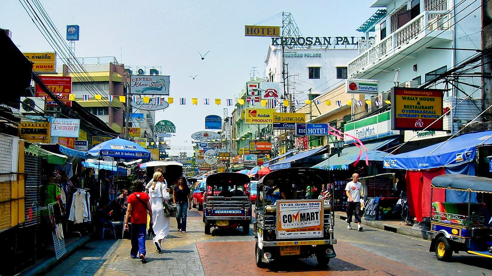
      <em>Bangkok</em>
    </figure>

  <figure>
      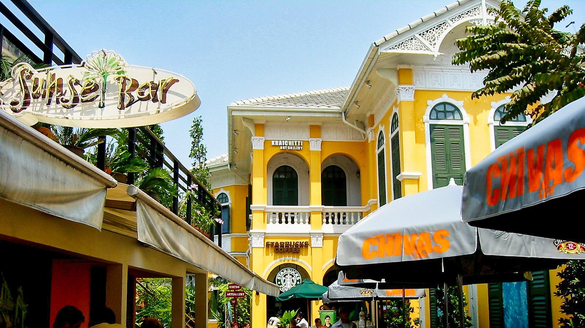
      <em>Bangkok</em>
    </figure>

  <figure>
      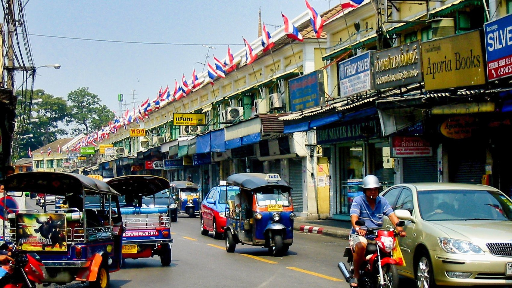
      <em>Bangkok</em>
    </figure>

  <figure>
      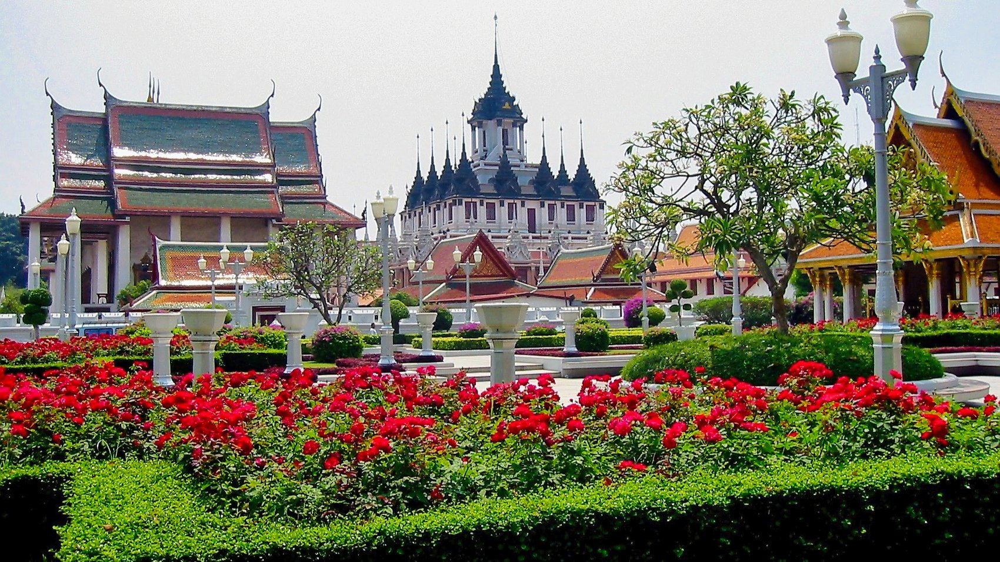
      <em>Bangkok</em>
    </figure>

  <figure>
      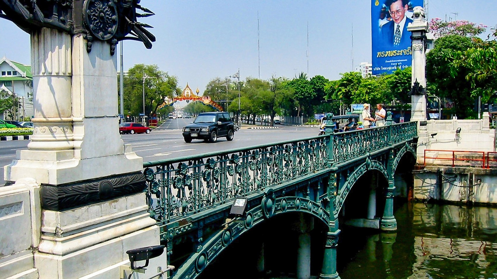
      <em>Bangkok</em>
    </figure>

  <figure>
      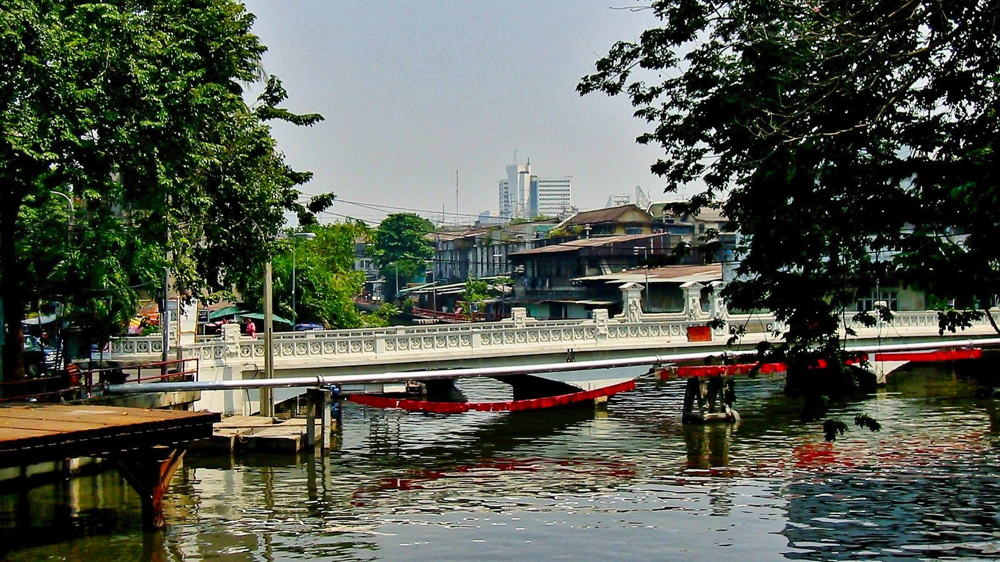
      <em>Bangkok</em>
    </figure>

  <figure>
      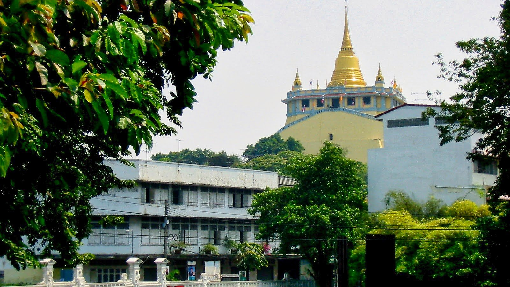
      <em>Bangkok</em>
    </figure>

  <figure>
      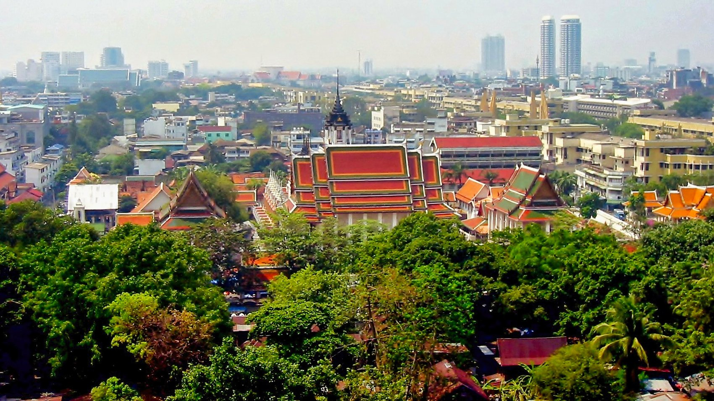
      <em>Bangkok</em>
    </figure>

  <figure>
      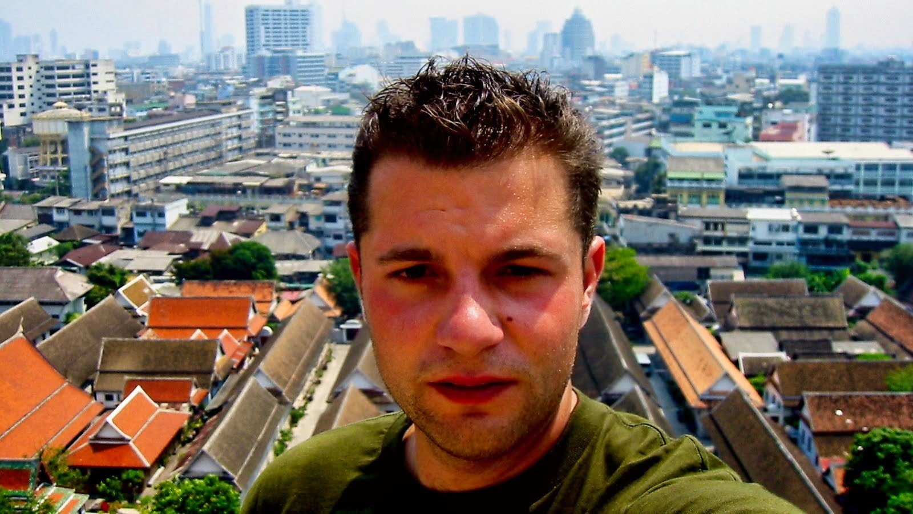
      <em>Bangkok</em>
    </figure>

  <figure>
      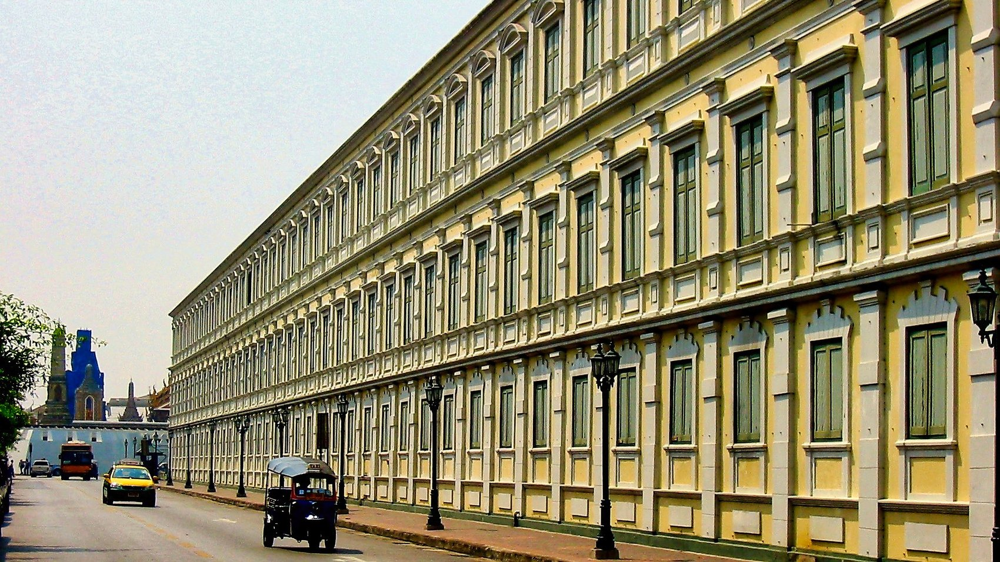
      <em>Bangkok</em>
    </figure>

<figure>
  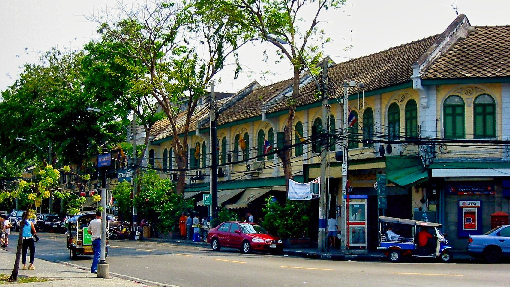
  <em>Bangkok</em>
</figure>

I took the Skytrain and the boat back to Banglamphu, ate a good red
squid curry in my guesthouse and went to bed early.

Tonight I’m taking the tourist VIP bus to Khao Sok National Park (550
baht). What fascinates me again and again is the speed with which the
Khao San Road area transforms from a backpacker ghetto into a smart
nightlife district, with bars and restaurants that are also frequented
by plenty of locals.

There are fewer and fewer of the traditional dives; instead lots of new
guesthouses are opening, with rooms of almost mid‑range quality. And the
bar and restaurant scene is improving too: chic cocktail lounges and
restaurants keep popping up. The nicest new opening is Sunset Street, a
stylish oasis in a side lane off KSR: a beautiful courtyard flanked by
colonial‑style buildings. A morning in Bangkok can hardly start better
than with an excellent (and at 65 baht very expensive) cappuccino in the
beautiful Starbucks branch in Sunset Street.

## 8 Mar 2005 — Bangkok / Khao Sok National Park

I had another very nice day in Bangkok. It was a sunny but not too hot
Sunday, perfect for a long walk through the old town. I climbed the
Golden Mount, enjoyed the calm in the Royal Park, went to the fish
market at Tha Tien Pier, and walked across the university campus and
along the river promenade to Banglamphu Pier.

I had a small lunch at Som Tam Lamphu on Phra Arthit Road, a cute
little restaurant like many in the area. The food was only so‑so,
though: the spicy prawn salad (70 baht) was more salty than spicy. The
dim sum were very cheap and okay (15 baht for three ha kao), at least.

At around 9 a.m. I arrived in Khao Sok National Park. I had a very good
seat on the bus and was able to sleep most of the time. I moved into a
nice, secluded bungalow on stilts with private bathroom and a veranda at
Mountain View Lodge (200 baht) and enjoyed the privacy and the quiet
forest location for a while.

<figure>
  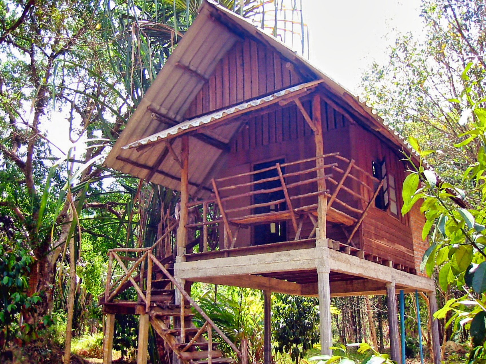
  <em>Khao Sok NP - Mountain View Lodge</em>
</figure>

At midday I went on an almost three‑hour elephant trek (700 baht). I had
my own elephant, and although we didn't end up riding inside the
national park, the area was very beautiful, karst scenery like in Khao
Sok itself.

<figure>
  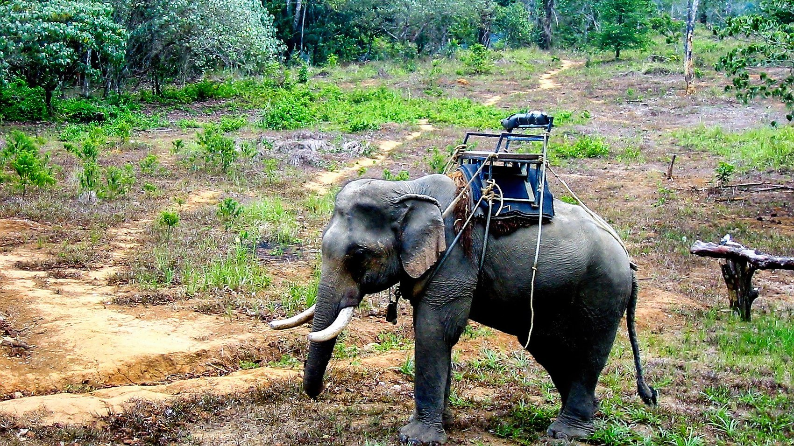
  <em>Khao Sok NP</em>
</figure>

In the afternoon the friendly young owner of the resort drove us to a
nearby cave temple where lots of monkeys hang around and we could feed
them. I spent the evening with a Chang beer on my veranda, listened to
music and looked out over the jungle. A wonderful place; I felt very
comfortable.

  <figure>
      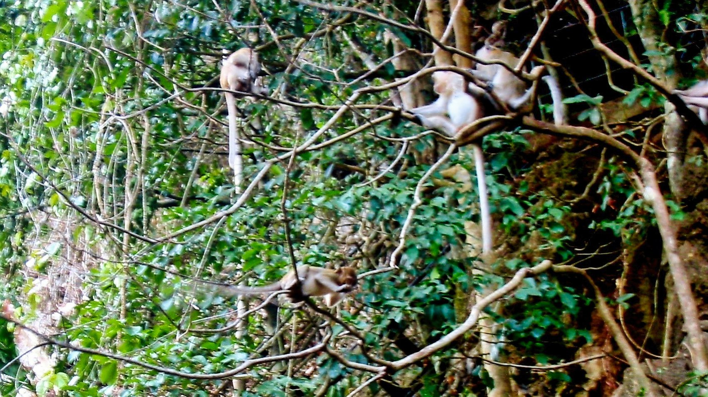
      <em>Khao Sok NP</em>
    </figure>

  <figure>
      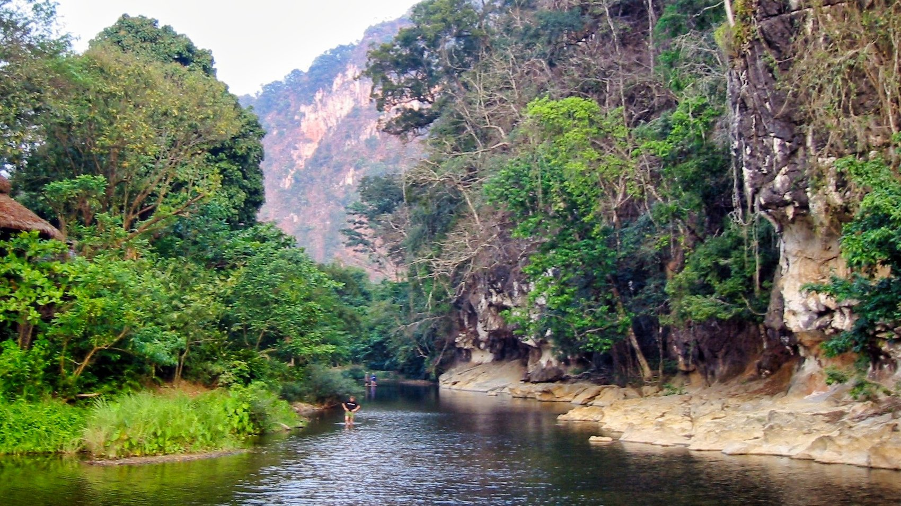
      <em>Khao Sok NP</em>
    </figure>

Today was very tiring. I spent almost the entire day in the national
park, whose entrance is about a 15‑minute walk from my bungalow. Along
the road there are lots of resorts, restaurants and even internet cafés.
It’s very quiet here at the moment, because the coastal tourists haven’t
come back yet since the tsunami

For a few years now foreigners have had to pay 200 baht entry to all
Thai national parks, which I find a bit much. At least you get a
brochure with possible walks and the trails were fairly well signposted.
After Tasmania, where most paths are also suitable for people who
aren’t very fit, I first had to readjust to the Thai jungle.

<figure>
  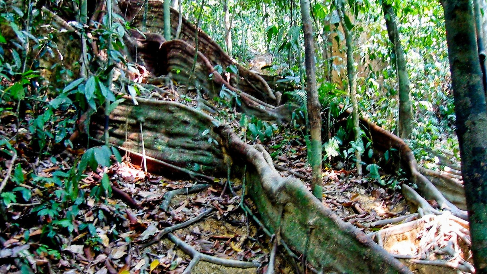
  <em>Khao Sok NP</em>
</figure>

I walked 7 km to Ton Glay waterfall. The last couple of kilometres were
very tough, partly on steep trails that are hard to walk even when dry.
I must have lost at least five litres of water; luckily there were
enough small waterfalls along the way, and even a nice canyon with pools
to cool off in.

<figure>
  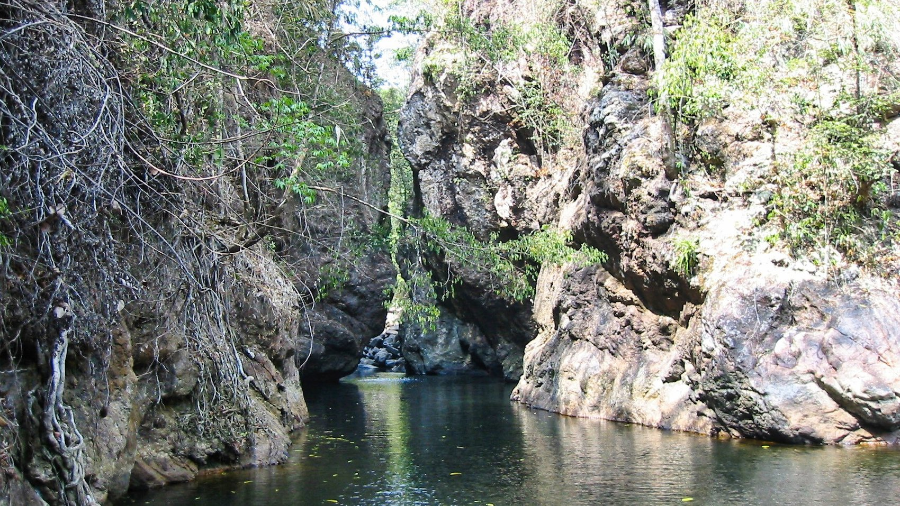
  <em>Khao Sok NP</em>
</figure>

The area is definitely pretty, especially the karst landscape, similar
to Krabi province, but at the moment everything is incredibly dry, so it
hardly feels like rainforest.

Since the food both at my lodge and at the Jungle Lodge next door wasn’t
great, I went to a proper restaurant after the hike, Thai Herb, hoping
to get something reasonably authentic. They also offer cooking classes,
and you dine with beautiful views over the surrounding landscape, so it
is worth it for that alone. I ordered a red Thai curry with tofu and
vegetables, and although the basil was missing it was quite tasty, and
no more expensive than at the lodges (55 baht). And the 20‑baht
pineapple shake even came garnished with an orchid. That’s what I call
culture.

## 15 Mar 2005 — Ko Phangan

I spent just under a week on Ko Phangan, as usual at my dream beach,
Thong Nai Pan Noi. Like everywhere in Thailand’s tourist areas, this
region is moving more and more towards comfort tourism: the cheap bamboo
huts are being replaced by comfortable air‑con bungalows; prices are
going up; and since my last stay six months ago several new bars have
opened, and even a Mexican restaurant.

  <figure>
      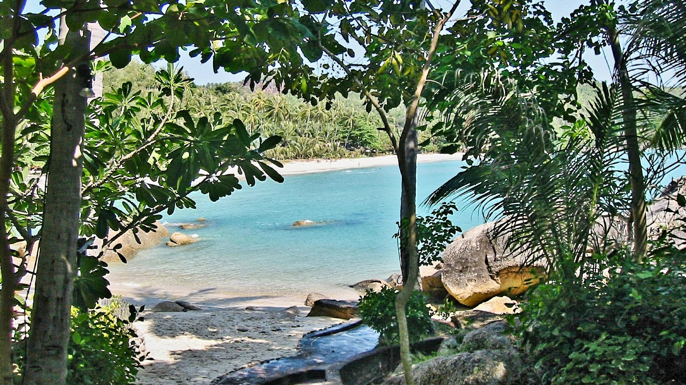
      <em>Ao Thong Nai Pan Noi</em>
    </figure>

  <figure>
      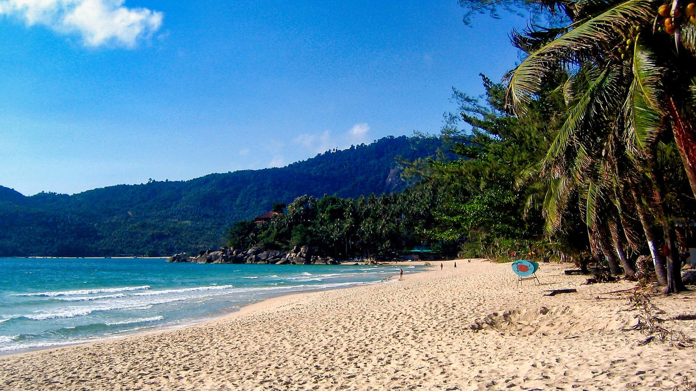
      <em>Ao Thong Nai Pan Noi</em>
    </figure>

  <figure>
      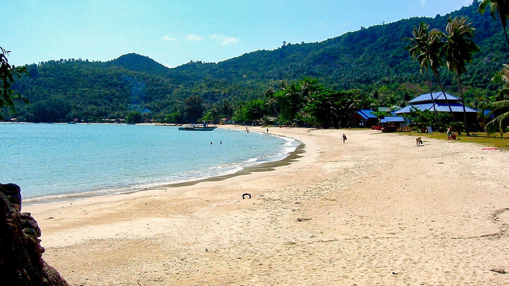
      <em>Ao Thong Nai Pan Yai</em>
    </figure>

  <figure>
      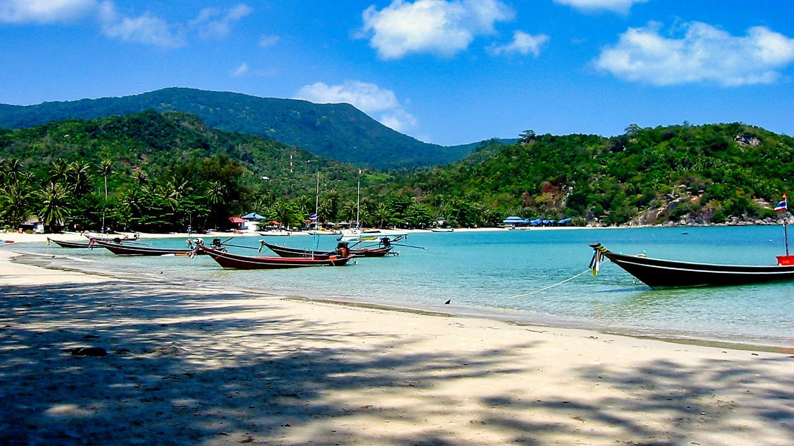
      <em>Ao Thong Nai Pan Yai</em>
    </figure>

But that’s happening all over the island now, and Ko Phangan hasn’t been
a destination for hardcore budget backpackers for a long time. Even
though the roads are still in bad shape, more and more families and
middle‑class tourists are escaping the hustle of Samui. because it’s
still quiet and relaxed here, and Nai Pan Noi is still the paradise I
had found five years ago, just no longer an unknown backpacker paradise.
Which, as I get older, doesn’t bother me as much anymore.

I spent the first three nights in one of the few remaining budget
bungalow resorts, Digree, whose simple but quite nice huts on stilts
stand above the lagoon. For 250 baht I had my own bathroom and a veranda
with Thai cushions. The bed was as hard as the floor, though, and in
the rainy season I wouldn’t stay there even for free because of the
mosquitoes.

For the last three nights I treated myself to more comfort and moved
into a very nice wooden bungalow at Thong Ta Pan Resort: with a big,
wonderfully comfortable bed; everything very clean and pretty; and the
bungalow stood on a small hill, in a quiet garden, with sea views from
the veranda, not bad for 500 baht.

Elaine came over from Samui with her mother, and as expected they loved
the beach just as much as I do. It’s the perfect place to do absolutely
nothing: sleep, sunbathe, read, swim, eat, and occasionally get a
massage on the beach.

I had absolutely no desire to leave, but I’d booked two flights to Macau
for tomorrow for me and Elaine, and since she’s turned into a real
traveller over the past months and wants to see the world, I couldn’t
persuade her to bin the tickets and stay longer.

## 20 March 2005

We took the ferry from Ko Phangan to Surat Thani and the night bus back
to Bangkok, getting in around five in the morning. Since we didn’t have
to be at the airport until around midday, we rented ourselves a 150‑baht
cell at the Euro Inn for the remaining hours, one of the last proper
dives left on Khao San Road. The flight to Macau (1,200 baht, AirAsia)
took just under three hours, and it was already almost dark when we
arrived.

We took the public bus from the airport into the centre (3.30 MOP) and
first managed to get ourselves a bit lost while looking for Hotel
Central, which, in the end, wasn't all that hard to find at all, just
west of Largo do Senado, which, with its restored Portuguese colonial
buildings, is probably one of the most beautiful squares in Asia,
especially at night when it’s lit up. We had a very spacious room with
an old‑fashioned bathroom; a little musty and without a window, but
otherwise perfectly fine for 160 MOP.

  <figure>
      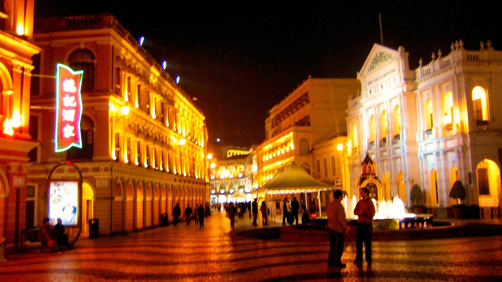
      <em>Macau</em>
    </figure>

  <figure>
      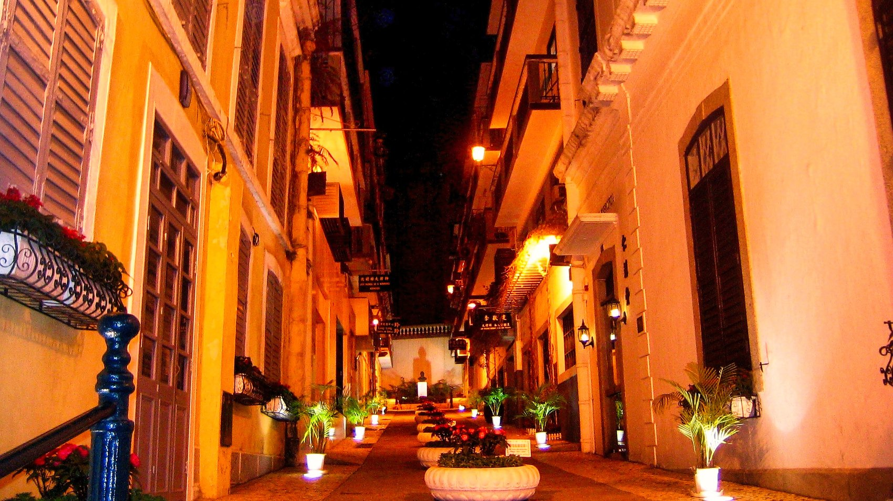
      <em>Macau</em>
    </figure>

<figure>
  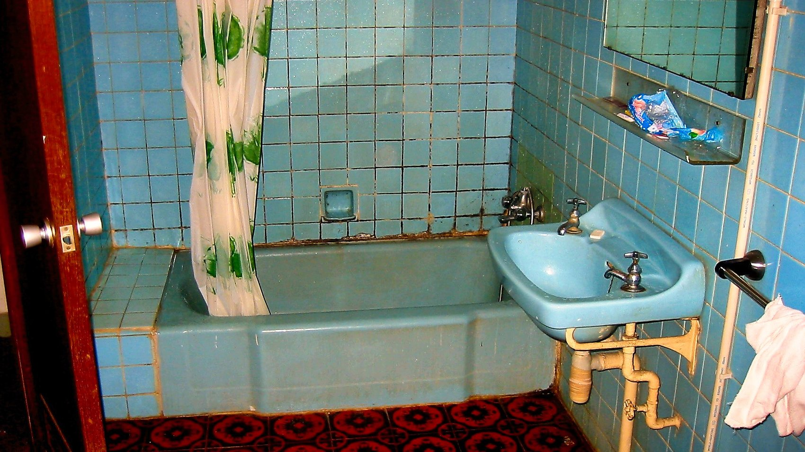
  <em>Macau - Hotel Central</em>
</figure>

On the first evening we went out for a few beers in a bar in Nape, the
nightlife district, and although Macau is probably cheaper than Hong
Kong, the prices after Thailand were rather painful (88 MOP for six
bottles of beer of your choice). We spent the next day sightseeing on
the peninsula: we visited Monte Fort, spent some time in the
entertaining Macau Museum, saw the ruins of St Paul’s, and took a long
walk to the 12th‑century A‑Ma Temple and back along the Avenida da
República promenade.

  <figure>
      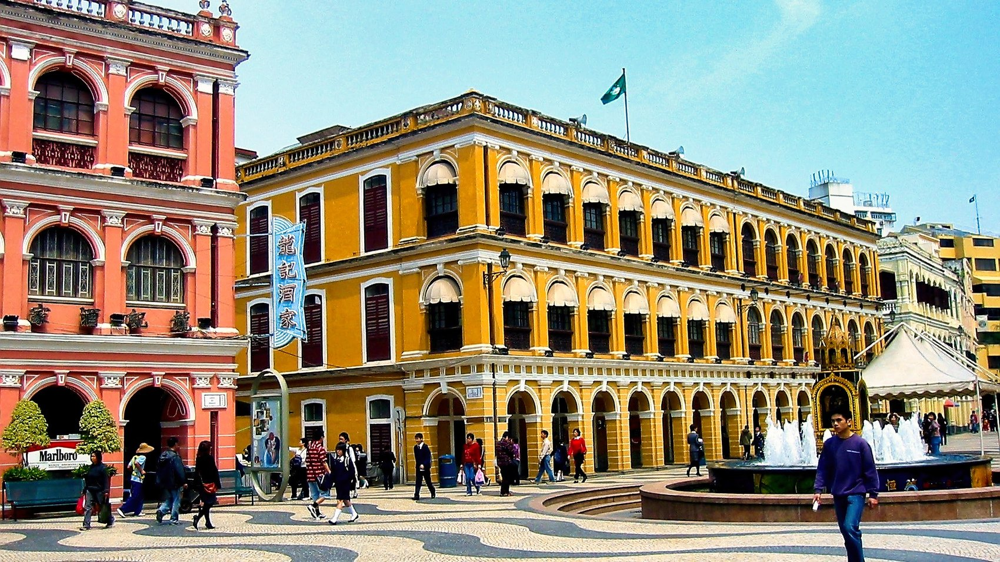
      <em>Macau</em>
    </figure>

  <figure>
      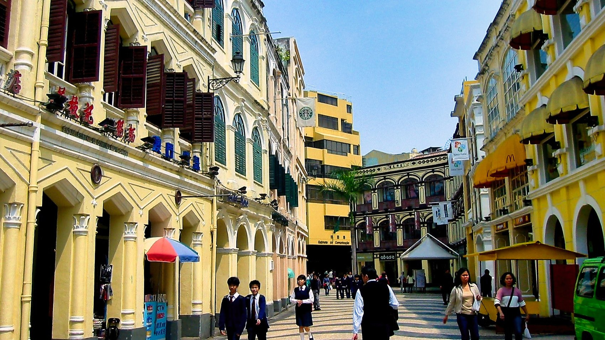
      <em>Macau</em>
    </figure>

  <figure>
      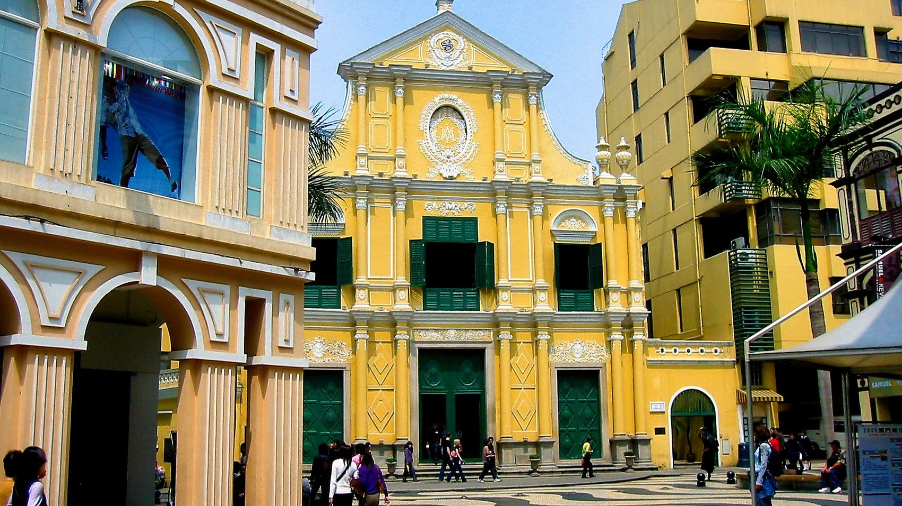
      <em>Macau</em>
    </figure>

  <figure>
      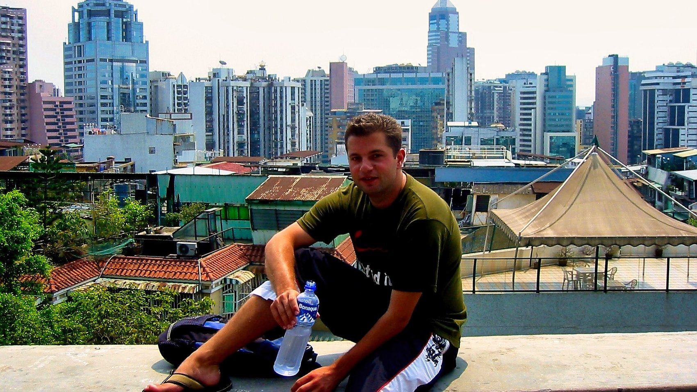
      <em>Macau</em>
    </figure>

  <figure>
      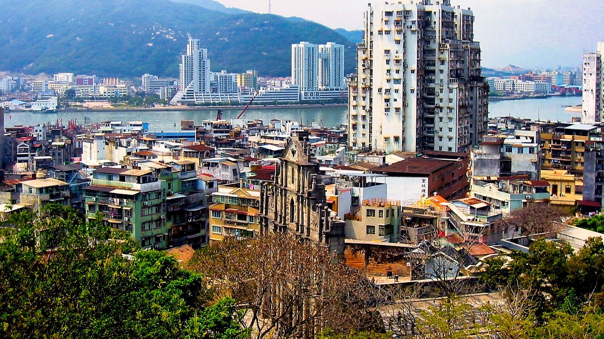
      <em>Macau</em>
    </figure>

  <figure>
      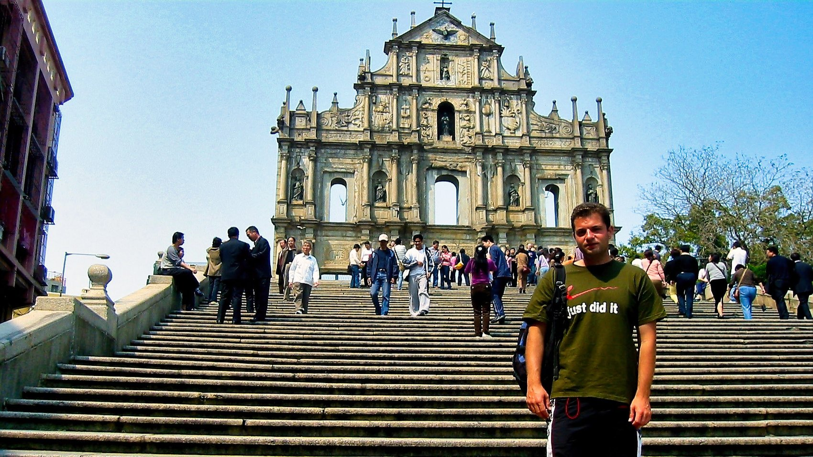
      <em>Macau</em>
    </figure>

  <figure>
      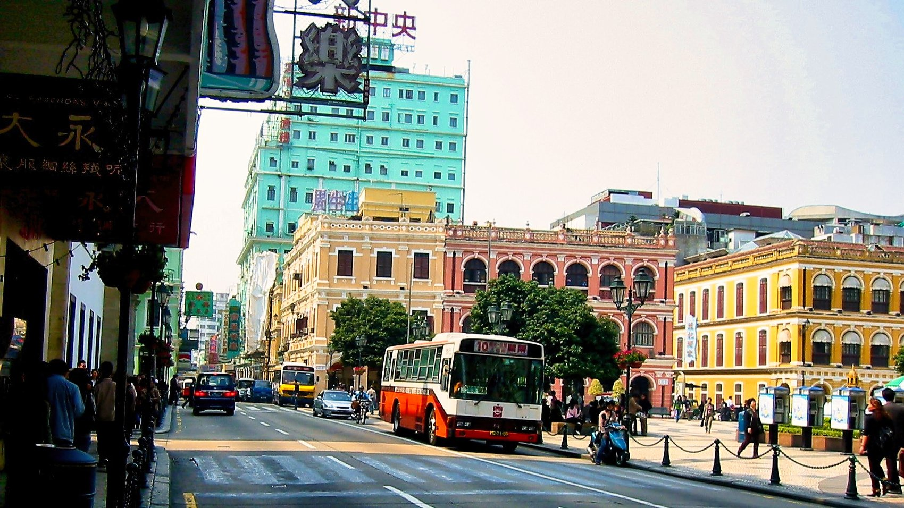
      <em>Macau</em>
    </figure>

  <figure>
      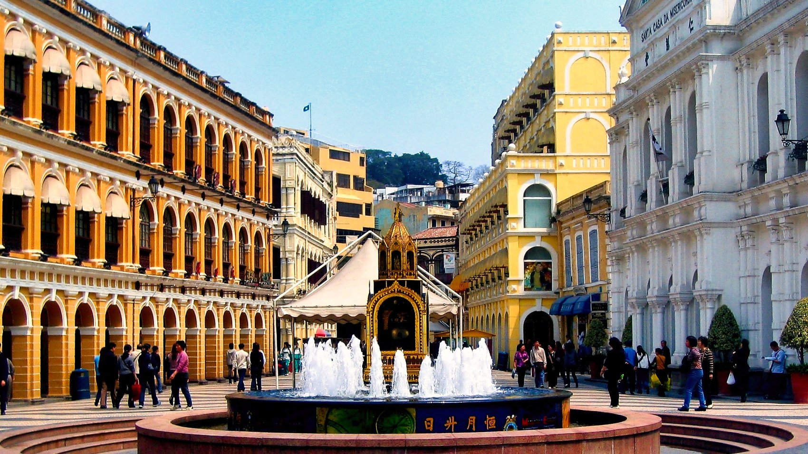
      <em>Macau</em>
    </figure>

Macau is an interesting and attractive city, Chinese, with a fairly
well‑preserved Portuguese legacy. But it hasn’t been a sleepy little
colonial town for a long time: high‑rise estates on reclaimed land and
kitschy casinos dominate Macau more than colonial buildings or the
original Chinese quarters.

On Friday we took the bus (5 MOP) out to Coloane, an island belonging to
Macau. Its only settlement, Vila do Coloane, has preserved a little of
its original atmosphere and feels very quiet and laid‑back. I had a
feijoada (25 MOP) for lunch at the Village Café, a not particularly
tasty bean‑and‑pork stew that nonetheless seems to be very popular in
Macau, and we walked along the quite pretty coast to Hac Sa beach. Back
in Macau we wandered through the very pleasant, authentic Chinese
quarter southwest of Avenida do Ribeiro, with lots of traditional shops
and seafood restaurants.

  <figure>
      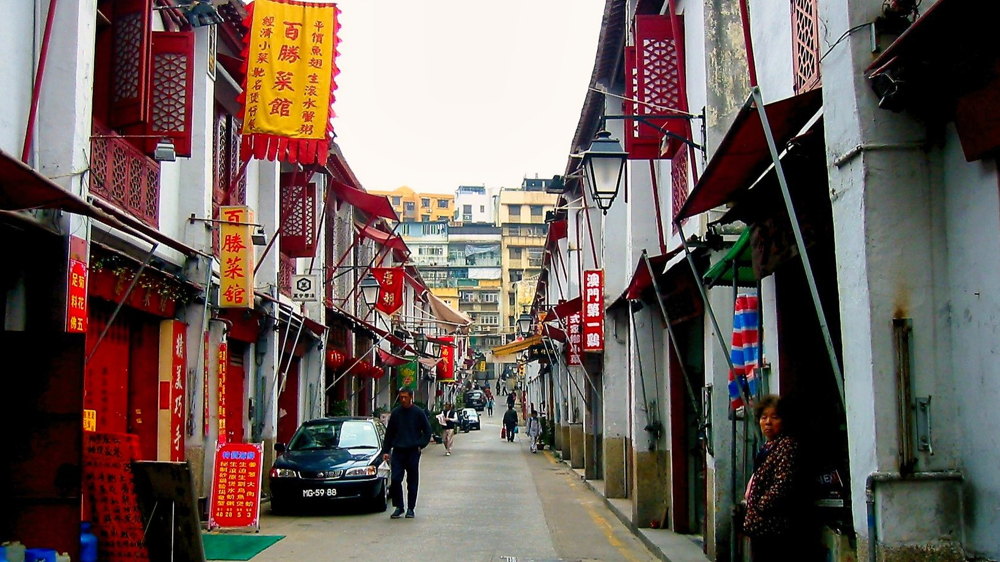
      <em>Macau</em>
    </figure>

  <figure>
      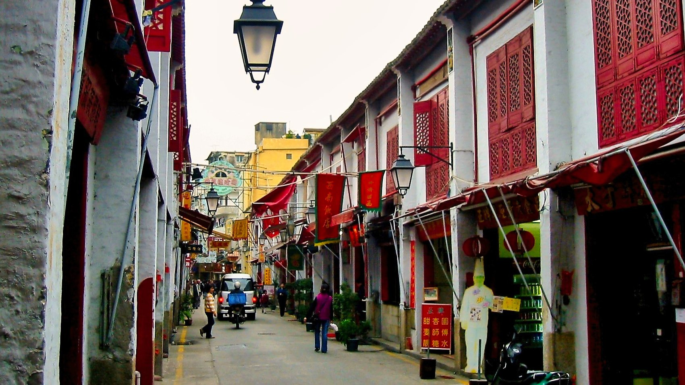
      <em>Macau</em>
    </figure>

<figure>
  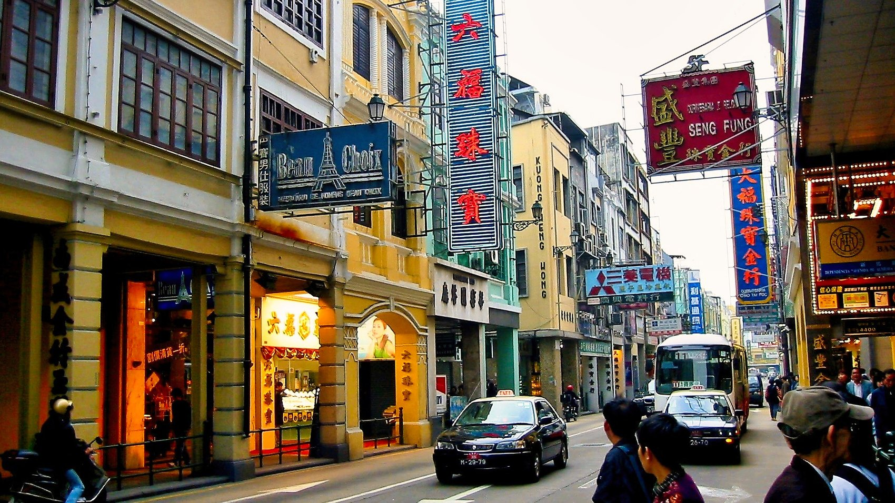
  <em>Macau</em>
</figure>

On Saturday at lunchtime we took the fast boat to Hong Kong. The
crossing (HK\$155) took only an hour, but it’s not recommended for
anyone with a sensitive stomach, even if the views are very nice at
times. We checked into the first guesthouse we came across in the
Mirador Mansions in Kowloon, with the nice but misleading name Garden
Hostel. For the painfully high price of \$200 we got a dark
five‑square‑metre cell with two narrow beds and a tiny bathroom.

Mirador Mansions is one of Kowloon’s notorious, filthy, run‑down
high‑rise blocks: budget guesthouses, travel agencies and shops where
you can buy everything from fake Rolexes to overpriced electronics, and
dark corridors full of people from all over the world. Definitely an
interesting, if not exactly cosy, place to spend the night.

In the afternoon we had a look around the chaos of Kowloon, but we both
agreed that Hong Kong, for all that, is a fascinating, very pleasant
city where you can really feel quite at home. I ate at the nice, busy
fusion restaurant Red Ants: “Shredded Duck and Jellyfish in Chili Sauce”,
very tasty and surprisingly cheap (\$30). The room was only bearable
when completely drunk, so we went for six beers (\$109) during happy
hour at the pretty 48th St Blues Bar and afterwards drank a bottle of
Sang Som with Coke back in the room, but what happened next?

<figure>
  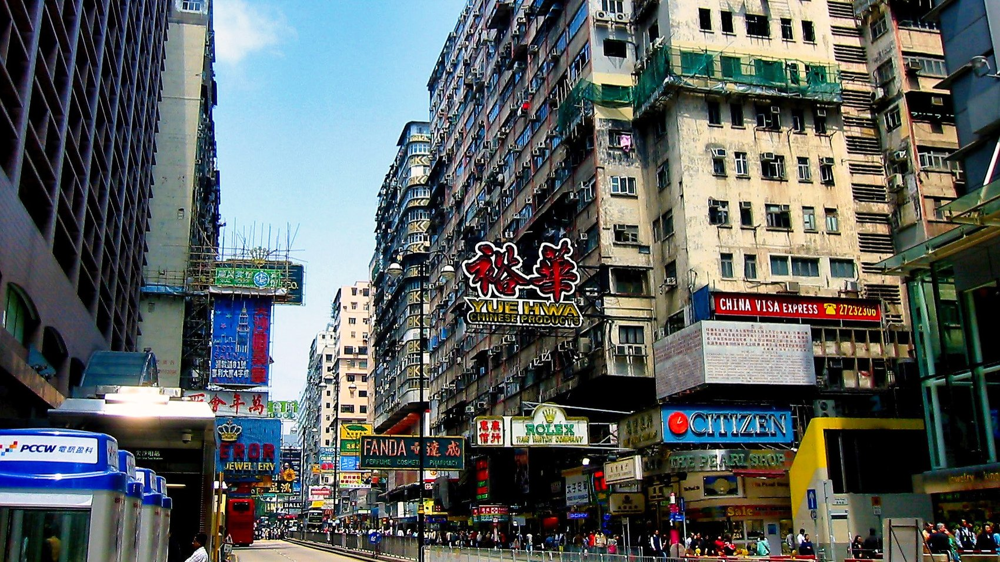
  <em>Hongkong - Kowloon</em>
</figure>

<figure>
  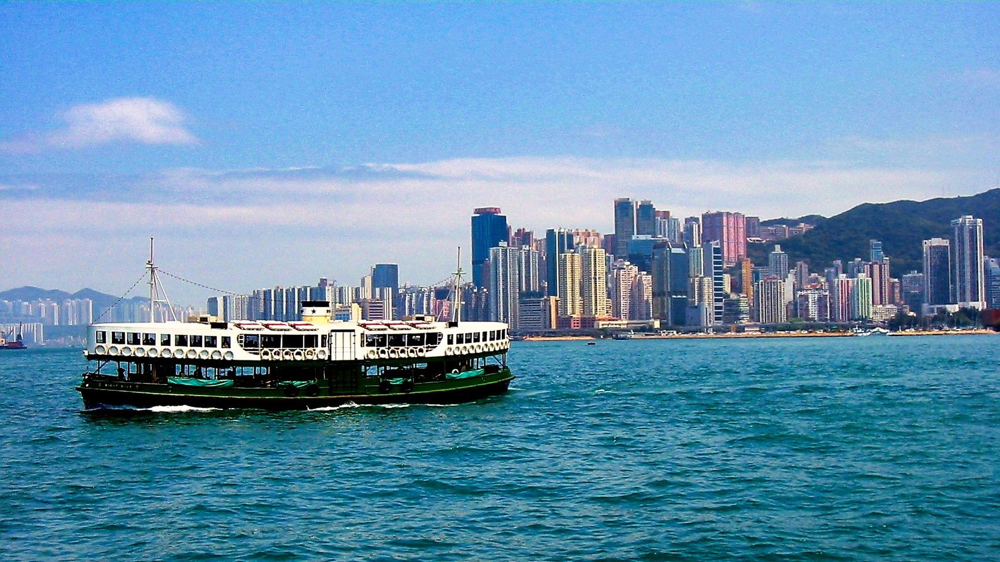
  <em>Hongkong</em>
</figure>

Today we checked out and moved to the Cosmic Guesthouse on the 12th
floor of Mirador Mansions, a much better choice. The room here (\$200)
is tiny too, but bright, quiet, very clean and surprisingly quite
homely. Since Elaine had to sleep off her hangover, I went out around
lunchtime and had a look around on my own. I took the ferry to Wan Chai;
the views of Victoria’s skyline and the harbour are fantastic,
especially at night when everything’s lit up.

After an afternoon snack at the Aussie pub Ned Kelly’s Last Stand (a
delicious chilli burger with excellent chips for \$85), we went to the
R.E.M. concert at the Wan Chai Convention Center. As luck would have it,
and what a stroke of luck, R.E.M. were playing their only Asia show
in Hong Kong today, and of course we couldn’t miss it despite the steep
ticket prices. Even after all these years, R.E.M. are still one of the
best live bands in the world, and the concert was magical, one of the
absolute highlights of the last six months.

## 21 March 2005

Today was pretty eventful, which meant we scrapped our original plan to
travel to Vietnam via Guangzhou and instead booked a flight to Bangkok
for next Saturday. We trudged from one travel agency to the next trying
to get visas for Vietnam and China, but it would have cost a fortune and
we would have had to stay in Hong Kong for another whole week, which, at
these prices, would have been ruinous.

  <figure>
      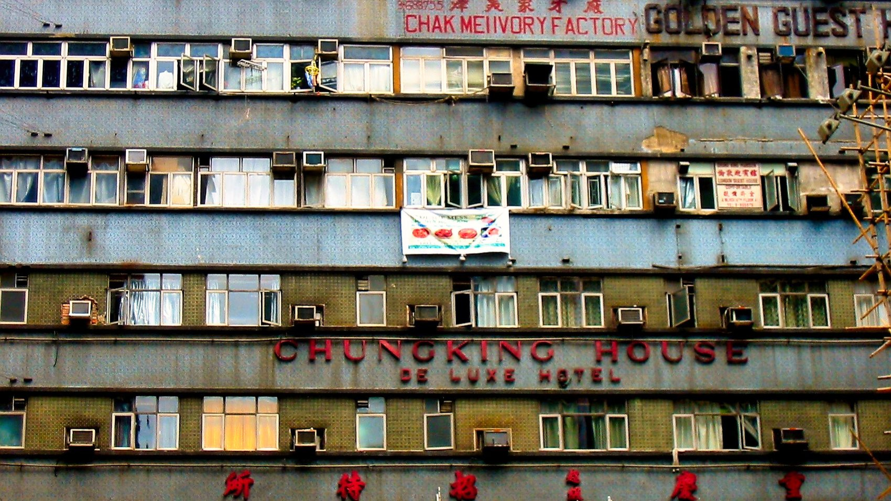
      <em>Hongkong - Chungking Mansion</em>
    </figure>

  <figure>
      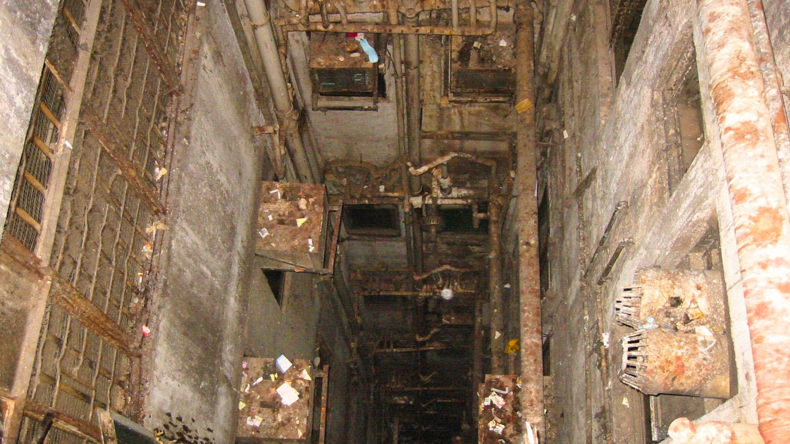
      <em>Hongkong - Chungking Mansion</em>
    </figure>

So, over a tasty lunch at the Anyway Café in Kowloon (turbot fillet on
lemongrass vermicelli, \$45 including soup and coffee), I suggested we
fly back to Thailand. After that decision we both had the idea of
properly enjoying Hong Kong over the next few days, and we went for
afternoon tea at the Peninsula, Hong Kong’s most famous hotel, a
magnificent colonial building with pompous interiors.

<figure>
  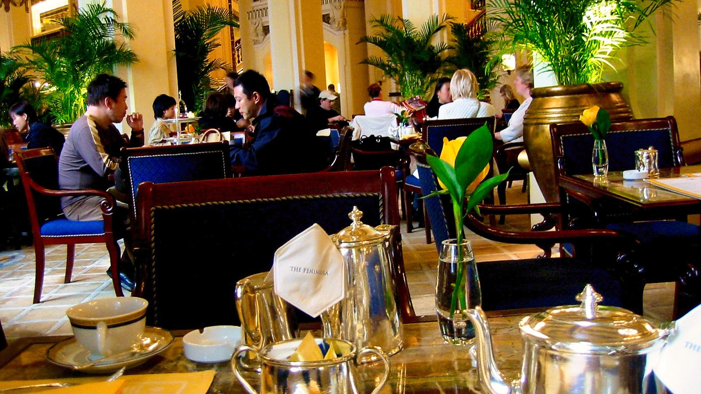
  <em>Hongkong - The Peninsula</em>
</figure>

It cost a fortune (\$320), but when you’re living in a cell you should
allow yourself something nice every now and then, and the quality was
excellent. In the evening I went to the Temple Street Night Market. I
like Hong Kong best at night anyway, and this market confirmed that
impression. It’s nice to have the feeling of really being in China: all
the bustle, the crowds, neon lights and the smell of the food stalls …

<figure>
  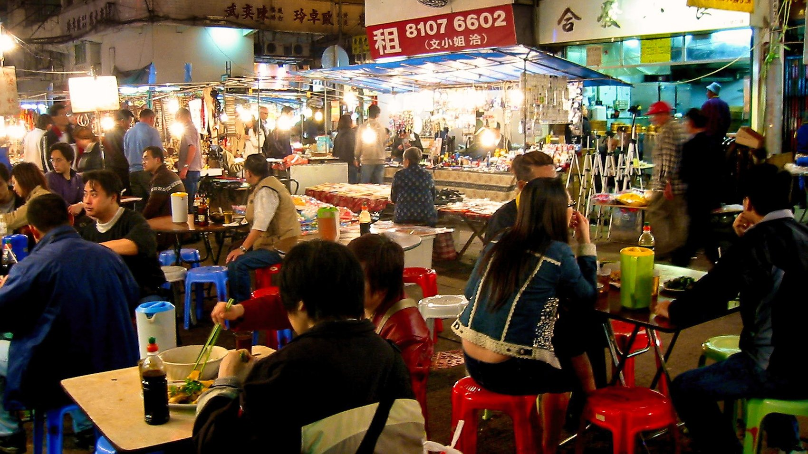
  <em>Hongkong - Temple Street Night Market</em>
</figure>

## 23 March 2005

We spent most of yesterday in and around Central. In the morning it was
absolutely pouring, but luckily it isn’t hard to find a nice café here.
We took shelter in the chic Q8 Lounge, whose glass front looks out onto
Central’s street life. The cappuccino was excellent too, and very
expensive (\$40).

Once the rain stopped we took the escalator up to SoHo, Hong Kong’s
nicest restaurant district. In a relatively small area you find almost
everything, from pretty Mediterranean cafés to a Russian place and a
Mexican. Not surprisingly, I liked this neighbourhood a lot. I picked up
a tasty, generous sushi lunch box from a Japanese place for \$60, and we
spent a few hours at the wonderfully kitschy, comfortable Sen Deli Café,
which makes excellent sandwiches with indulgent things like Gruyère and
foie gras.

After that we took the escalator all the way up to Mid‑Levels, a
high‑rise residential district above the city, and walked back down
through the botanical gardens (with a small zoo) to Lan Kwai Fong, Hong
Kong’s most attractive nightlife district, whose narrow lanes offer an
excellent selection of bars and lounges. Given our financial situation,
our nightlife consisted of drinking canned beer in our cell, well, at
least that way we can choose the music ourselves.

<figure>
  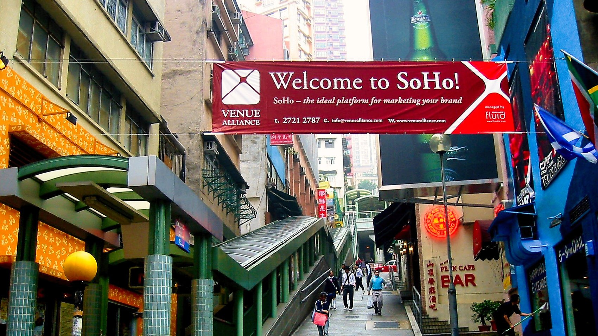
  <em>Hongkong - Victoria</em>
</figure>

<figure>
  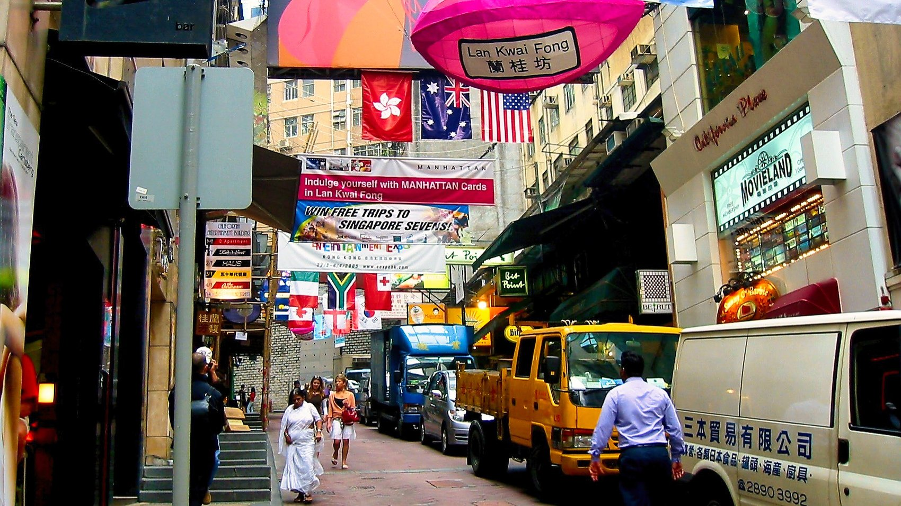
  <em>Hongkong - Lan Kwai Fong</em>
</figure>

Today we visited the Hong Kong Museum of History, because all museums
are free on Wednesdays. It’s well worth a visit that covers Hong Kong’s
history from the Stone Age to the present day, with short films, photos,
lots of exhibits and multimedia displays. We spent many hours there and
afterwards went to the pretty Café de Fontaine by the fountain on the
main square in Tsim Sha Tsui East, that modern, built‑from‑scratch
“sibling district” of Hong Kong’s chaotic but far more atmospheric
tourist area.

For dinner we went to the “Biergarten”, a German pub in Kowloon. I
haven’t eaten anything German in six months and suddenly felt a strange
craving for it, even though it isn’t very sensible to order outrageously
overpriced Käsespätzle (\$68) in a culinary paradise like Hong Kong.
Still, the food was quite good and I enjoyed the Hefeweizen too (\$36,
happy hour price).

Elaine enjoyed her meatloaf with fried potatoes. When it comes to
culinary pleasure she’s a hopeless case, and it’s very hard to find
common ground. But I can adapt, even if it means needlessly spending a
lot of money on Western food. After dinner we went for a wander around
the Temple Street Night Market.

## 26 March 2005

I’m sitting on the plane from Macau to Bangkok and I’m already looking
forward to being back in Thailand. Not that I didn’t like Hong Kong,
quite the opposite: it’s a great city everyone should see and
experience. But the weather, the prices and the prospect of having a
decent room all clearly speak in favour of Bangkok.

The last two days were really nice. We spent most of our time on Hong
Kong Island and took the bus to Shek O, one of the last villages left in
Hong Kong’s concrete chaos, an oasis of calm, nice for strolling around
and relaxing on the pretty beach. The setting is wonderful too, but Hong
Kong Island in general is spectacular, and the bus rides along narrow,
winding roads over the hills are an attraction in their own right.

We also visited Stanley, a smart beach district in the south of the
island; anyone who owns an apartment here must be very rich. There’s a
big but fairly touristy market and a waterfront promenade lined with
restaurants. We opted for a picnic instead: pâté and Gruyère.

Since the weather was quite decent we took the bus back to Central via
Repulse Bay and rode the Peak Tram up to the lookout above the city. The
railway has been operating since 1888, and the ride up, but above all
the views down over the city and the harbour, are probably the
highlights in Hong Kong. We timed it so we could enjoy the view both in
daylight and later, once it was dark and the city had turned into a sea
of lights.

Afterwards I went to Lan Kwai Fong for a beer and some people‑watching.
It was the day before the Easter holiday and most of the bars were
packed, great atmosphere.

Yesterday the weather was pretty bad and we spent most of the day on
public transport, which is a great way to explore the city. Public
transport in Hong Kong has to be among the best in the world. The metro
is fast and efficient, the buses are double‑deckers, and from the top
deck you can watch city life go by or admire the scenery. The trams are
double‑deckers too, real originals, mostly still from the middle of the
last century. And then, of course, there are the ferries, perhaps the
most typical Hong Kong form of transport.

And although almost everything in Hong Kong is expensive, public
transport is very cheap and thanks to the brilliant Octopus Card, which
works on all modes of transport (and can even be used in many
supermarkets and even restaurants, etc.), you never really need to
carry cash.

We took the bus from Central to Aberdeen, whose harbour is still home to
plenty of families living on their boats. From there we’d originally
wanted to take a ferry to Lamma Island, but the cool, grey weather
didn’t exactly make us feel like an island trip. Instead we just jumped
on random buses, saw neighbourhoods we didn’t know yet, and eventually
ended up in Causeway Bay, where we went for a walk through Victoria
Park.

From there we took one of those wonderful old trams that run along
almost the entire north coast of Hong Kong Island to North Point, a very
atmospheric, lively district with interesting markets and hardly any
tourists. After a bit of shopping there we took the bus to Kennedy Town
and the tram back to Central.

On our last evening we decided to eat in SoHo and, for budget reasons,
chose a Mexican place, El Taco Loco. They only had plastic cutlery, but
the food (nachos, enchiladas) was good and cheap (\$58), and the mojitos
were too (two for \$58). Afterwards we went next door to the Empire
Lounge for a few cocktails. You have to experience this place to believe
it exists: ultra‑kitschy booth corners, everything ornate and in shades
of red, the most terrible romantic love songs of all time… You only
really find something like this in Asia. It was cosy enough, though, and
while the cocktails were expensive, they were good.

We finished the day with a couple of happy‑hour Coronas (\$46 for two)
in Lan Kwai Fong.

## 31 March 2005

The last few days in Bangkok were unspectacular. I had a very nice,
comfortable room at Mango Lagoon Place on Rambuttri (700B) and enjoyed
the air con and the luxury (carpet, couch, big comfortable bed) after
the week in the Mansion. The days were very hot and I read a lot,
either in my room or in a café/restaurant, and I enjoyed Bangkok’s cosy
atmosphere, the low prices and the good food. Every now and then I met
up with Elaine for dinner or a few beers.

We’d decided to go our separate ways, since lately we’d been getting
into arguments more and more often over silly little things and it made
no sense to keep forcing ourselves to travel together. Very unfortunate,
but probably the most sensible solution.

One evening I met Peak for dinner, a well‑travelled woman from Bangkok
from the VT community, and we talked about this and that: our travels,
and the changes Bangkok, and especially Khao San, has gone through in
recent years… that was really nice.

The culinary highlight was dinner at Hemlock on Phra Arthit Road, which
quite rightly is considered the top Thai restaurant in Banglamphu. The
food is Thai cooking at its best, with a menu as thick as a book full of
great things. The red chicken‑and‑pineapple curry was absolutely top (80
baht), as were the mushrooms with cashews (80 baht), and despite the
outstanding standard of the kitchen Hemlock is hardly more expensive
than the many farang restaurants in the area, definitely not my last
visit.

After five years I decided it was time to visit southern Cambodia again
and see what has changed, so this morning I took the minibus to Trat
near the border (200 baht / 6 hours and uncomfortable, but I was too
lazy to take a public bus, since Bangkok’s bus terminals are all ages
away from Banglamphu). I got a room at the Trat Hotel by the market.
There are some pretty guesthouses here too, but since I don’t have a
guidebook with me and didn’t feel like walking around town in the
blazing heat with my backpack, I went to the first hotel I saw, and the
room is fine: spacious and fairly clean, with a private bathroom
(unfortunately only a squat toilet), 220B.

Trat hasn’t changed all that much in the last five years. Sure, there
are more guesthouses, internet cafés and farang restaurants, but the old
town with its wooden houses is still a very quiet, relaxed place, and
just for the market alone, where you can eat wonderfully, Trat is always
worth a short visit. Also, I haven’t seen many other farangs here.

## 1 Apr 2005 — Thailand → Cambodia (Hat Lek / Koh Kong / Sihanoukville)

Early in the morning I took the minibus to the border at Hat Lek (100
baht). Crossing the border was relatively painless. I paid 1,000 baht
for my visa; they wanted 1,100, but I knew they always try to rip you
off (the official price, which they never accept, would be US\$20).

The next rip‑off attempt came shortly after, but I was prepared for that
too. I took a motodop (US\$1) to Koh Kong when a persistent tout from
Mealy Chenda tried to lure me into an overpriced tourist van. He managed
to convince my motodop driver to take me straight to their agency, but I
threatened not to pay him if he didn’t take me to the regular bus
station, which worked. The tout still wouldn’t give up and followed us.

After I’d already negotiated a price (US\$4) to Sihanoukville with the
bus driver, the tout had a chat with the driver and suddenly the price
jumped to 400 baht. Mealy Chenda is a mafia‑style tourism outfit that
“Thailand‑ises” travelling in Cambodia by offering tourist‑only vans
between destinations at inflated prices, and they use all kinds of
methods to intercept and lure travellers to their business as they enter
Cambodia.

Fortunately I’d read about them beforehand and was determined to avoid
them. Granted, the Mealy Chenda vans are obviously much more comfortable
(but also much more expensive) than public transport, but what makes
Cambodia so interesting and challenging, namely travelling with locals
in overcrowded vehicles, gets completely lost for many travellers.

I told the tout to piss off, but in the end the bus driver still refused
to take me for US\$4. At least I bargained him down to 300 baht. The
trip to Sihanoukville was, as I’d expected, a nine‑hour nightmare with
25 (!) people in a knackered Honda van, but that was exactly what I
wanted: to experience Cambodia again the way it was five years earlier,
before tourist vans and all that.

Of course I could have taken the ferry to Sihanoukville, which would
have taken only three and a half hours, but I’d already done that trip
and I was curious about the new road through what used to be
impenetrable terrain. In Cambodia, “new road” doesn’t mean a nice paved
highway, though: it was the usual bumpy track, with four river crossings
on ferries that must have looked no different a century ago.

Luckily I had a decent window seat and could watch the untouched “Wild
West” landscape. I was pretty wrecked when I arrived in Sihanoukville,
but the trip was definitely worth it, if only for nostalgic reasons.
This was the Cambodian adventure I’d got to know and love back then, and
which no longer exists on the main tourist routes.

I got a room at the Geckozy, a very pretty guesthouse in the centre of
Sihanoukville, not near the beach, but I’m certainly not here for
sunbathing; I could have done that in Thailand. For US\$4 I got a very
nice, very individually decorated room (Japanese themed; every room has
a different theme) with private bathroom (unfortunately with a squat
toilet, the only downside) still excellent value for money, and the
atmosphere in the cosy lounge is great too.

The guesthouse is run by a German‑Japanese team, accordingly very well
kept, with an interesting menu at very fair prices (Lao beer, 75 cents).
I was starving when I arrived and ordered a Japanese udon salad (a real
treat, and a huge portion for US\$2.75) though I could just as easily
have ordered meatballs with fried potatoes.

In the evening I wandered around Sihanoukville a bit, but the town
itself isn’t particularly attractive. On the other hand, it now offers a
wide choice of farang bars and restaurants where you can forget the
hardships of independent travel in Cambodia at reasonable prices. The
season seems to be over, though, because most places were pretty empty.

I had a good cappuccino (US\$1.50) at Espresso Kampuchea, and since I
was the only guest I ended up having a longer chat with the English
owner, who then even gave me a glass of Australian Cabernet Sauvignon on
the house.

For dinner I ate a tasty pâté baguette (2,000 riel) from a street stall,
one of the best legacies the French left in Indochina.

## 2 Apr 2005 — Sihanoukville (beaches / food / sunset)

I thought it would be a good idea to do something for my fitness again,
so I rented a bicycle to ride along Sihanoukville’s beaches. My first
stop was the biggest and most popular beach, Occheutal, east of town.
And I’m not revising my verdict: the beaches here really aren’t anything
special, white sand, sure, and bright blue sea, but for real tropical
feeling there are simply not enough coconut palms, and the beaches are
fairly narrow. And everywhere (like all over the country) there’s
rubbish lying around.

Five years ago the special appeal was that the beaches were still
relatively empty and unspoilt. That’s over too: Sihanoukville is now an
obligatory stop on any Southeast Asia trip. But enough negativity. The
area is very beautiful, and you really can have a good time here.

There are countless seafood restaurants and cocktail bars with sunbeds
and hammocks right on the beach, and in many of these places you even
get a room for free if you eat and drink there twice a day, with the
very low prices they charge, that’s an excellent deal.

On the way to Sokha Beach I got a flat tyre and had to push the bike
back to the guesthouse for half an hour. I decided a motorbike is better
suited to the roads here, and at US\$4 per day you almost have to rent
one.

I went to Sokha Beach, the prettiest and cleanest beach in
Sihanoukville, though most of it is taken up by a luxury resort. For
lunch I chose Victory Beach and the Hawaii Seafood Restaurant, despite
the silly name more of an beach hangout place for rich Khmers than a
tourist restaurant, and the food was among the best I’ve had in the
last six months. For US\$5 I got a huge plate of fried mud crabs in
garlic‑chilli sauce: a true gourmet meal right on the beach. Mud crabs,
with their delicious slightly sweet meat, are a highly sought‑after and
outrageously expensive delicacy in the Western world.

After that I checked out Weather Station Hill, ground zero for
backpackers in Sihanoukville, and the place where we’d stayed five years
ago. Not much has changed, except that there’s more choice now, and
with Papagayo there’s a wonderfully cosy cocktail‑and‑tapas bar with
Latin‑American chill‑out music. This is where I’m writing these lines.
For dessert I had some tasty stuffed gnocchi “Japanese style”, fusion
style, for US\$1.50.

As I said: even if Sihanoukville isn’t exactly paradise, you can pamper
yourself very well here for little money.

My next destination was Sihanoukville Mountain, a viewpoint on a hill
above town. The views over the city and the coast, with the many
offshore islands, were great, and from up there Sihanoukville looked
really quiet and tropical.

Before sunset I had a passable Cambodian fish soup on the beautiful
terrace of the Mary‑an Guesthouse. I enjoyed the glorious sunset at
Victory Beach. It may be the worst beach of them all, but it has the
best beach bars in Sihanoukville and unobstructed views of the red
fireball sinking into the sea right between the offshore islands, very
picturesque, especially with the fishing boats on the shore.

For dinner I treated myself to something really good again, since
everything here is so affordable. I dined at La Paillotte, a chic French
restaurant that feels a bit out of place in the backpacker ghetto of
Weather Station Hill. The interesting menu was personally presented by
the chef (a Madagascan), in French. I had a fish carpaccio (US\$3) as a
starter and barracuda fillet in ganja sauce (Khmer fusion, I’d call it)
with thyme potatoes (US\$5) as my main. Both were excellently prepared
and very tasty.

I ended the evening with two (surprisingly good) cocktails (US\$1.50)
next door at Papagayo.

## 4 Apr 2005 — Kampot / Kep

Yesterday morning I took the public van (10,000 riel) to Kampot. The
road is nothing like it was five years ago: it’s fully paved now, and
the first 75 kilometres are in excellent condition. The trip took less
than two hours.

Kampot itself has thankfully hardly changed since my last visit. It’s
still a cosy provincial town on the river, with whole streets of French
colonial architecture, an interesting, authentic market, and a peaceful
atmosphere. Of course far more travellers pass through now. You can book
tours to Bokor, there are a few farang bars, espresso and internet, but
all still on a manageable scale, and the town hasn’t lost any of its
atmosphere. And every now and then, a little more tourism would be
welcome.

By now there’s even a proper traveller guesthouse with the fitting name
Blissful, offering everything a backpacker needs: a cosy chill‑out
lounge with hammocks, a cheap bar with happy hour, and clean rooms,
unfortunately all fully booked, so I had to settle for a dorm bed. That
was fine: the dorm was basically a spacious triple room, the shared
bathroom was big and clean, and for \$2.50 you really can’t complain.

I spent the day walking through Kampot’s streets, ate prawns with
lemongrass at the local place by the bridge (8,000 riel), and enjoyed
the glorious sunset by the river. For dinner I went to Ta Euv, a big
seafood place on the river where only locals were eating. I had squid
with broccoli (8,000 riel), very tasty.

Today I rode a motorbike (\$3 a day) to Kep‑sur‑Mer, a former French
seaside resort 25 kilometres east of Kampot. Most of the French villas
are now just ruins, but at the moment they’re working hard to turn Kep
into a resort for rich Cambodians. Foreigners will find it difficult to
get excited about Kep because there aren’t any truly beautiful beaches.
Still, the scenery is quite pretty, with tropical islands offshore,
though there’s no accommodation on those beaches yet.

I liked Kep for two reasons: first, the colonial ruins make great
brilliant subjects for photos; second, you can eat fresh seafood
cheaply. There are lots of vendors along the shore who cook it for you,
and that’s reason enough to come here.

Back in Kampot I took a walk through the market and went to happy hour
(5–6:30) at the Rusty Keyhole, a farang bar by the river: 5,000 riel for
a big bottle of Angkor, and the sunset is free.

Luckily the happy hours here are well coordinated. At Blissful, happy
hour starts at 7 p.m., and the Blue Lagoons (\$1.50) are excellent.

What genuinely makes me happy, and what I missed in Sihanoukville, is
that in this region the Khmer smiles and helpfulness are still real.
Kids greet you with a grin and “hello”, not with an outstretched hand
and “you give me one dollar”. There are no motodop drivers trying to rip
you off, and when my motorbike broke down, everyone tried to help and
work out what was wrong, without asking for money.

This is the Cambodia I got to know and love five years ago, and I’m glad
it still exists, at least off the beaten track.

## 11 Apr 2005 — The End (Phnom Penh → Bangkok → Frankfurt)

The end! Back in Frankfurt.

I spent another five nice, cosy days in Phnom Penh (\$2 by minibus from
Kampot, three hours). For the first night I stayed in the backpacker
area at Boeung Kak Lake, at the simple Grand View Guesthouse. The room
was small, but had a window with a lake view, a bathroom, and a big bed
for \$3.

Although there were plenty of cheap bars and traveller cafés and the
lakeside area, with its many wooden houses, was quite interesting and
traditional, I decided to change location the next day; I had
absolutely no appetite for backpacker culture here. I got myself a nice
\$10 room at Tiger Feet near the riverside promenade, with air‑con, TV,
minibar, etc., and simply wanted to enjoy the last days of the trip.

I met Elaine again and spent quite a bit of time with her, went shopping
at the Russian Market, took long walks through Phnom Penh’s streets, and
spent a lot of time in the lovely street cafés along the wonderful
riverside promenade, or at Le Tamarin in gastronomically solid 240
Street. One night we had an excellent dinner there on the balcony by
candlelight, with cocktails, a bottle of French wine, and tasty tapas,
mostly Mediterranean with Asian influences. Fair prices, nice
atmosphere, good food.

I also really liked the Salt Lounge, a modern‑chic scene bar that struck
me as very gay‑friendly and, in a city like Phnom Penh, almost feels out
of place: comfy sofas, electronic beats, good cocktails. Something like
this certainly didn’t exist here five years ago, but otherwise the city
has hardly changed in any noticeable way.

For fun we took a one‑hour rickshaw ride for \$1 to the main sights. It
was very nice, even though I already knew the city fairly well.

Personally, I think Phnom Penh is an extremely attractive city with a
strong feel‑good factor, a place where you can easily spend a week or
more, and a worthy end to my trip. Of course that’s purely from a
tourist’s perspective. In Cambodia, even in the capital, many things are
still going catastrophically wrong. To see that, you only have to walk
around with open eyes and occasionally glance at the Phnom Penh Post.

Since a flight to Bangkok cost over \$100, I decided to go back by bus
(\$16), as fast as possible via Battambang. It was still a long 15‑hour
trip, and I only arrived in Bangkok late in the evening. I treated
myself to something properly nice one last time and took a small,
luxurious room at Majestic Suites on Sukhumvit for 1,200 baht.

Currencies:\
€1 = A\$1.70 = F\$2.18 = 51 baht = HK\$10.5 = MOP 10.5 = 5,000 riel
