# Vietnam in the Time of Corona

**June – July 2020**

We had originally planned a short bike trip from Nha Trang up to Quy Nhon, three or four days, no more than that. But once we got going, it became clear that this was an unusual moment to be travelling in Vietnam. The country was closed to the outside world because of Covid-19, but inside, everything was still open, and the roads, beaches, caves and mountains were essentially empty of foreign tourists. It was too good an opportunity to pass up.

The short trip turned into an epic 6,600-kilometre loop that took us through most of the country: up the central coast, along the Ho Chi Minh Trail into the far north, around the Hà Giang loop, and back down through the highlands to Nha Trang. Six weeks of riding through the country we thought we knew, with hardly any other tourists on the road.

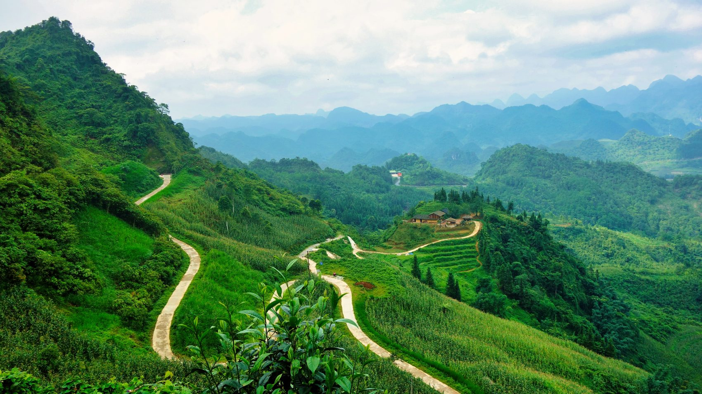
*Hà Giang Province*

---

## 1 June 2020

We left Nha Trang in the morning and headed up the coast. First stop was [Dai Lanh](https://www.google.com/maps/search/?api=1&query=%C4%90%E1%BA%A1i+L%C3%A3nh%2C+Ph%C3%BA+Y%C3%AAn), a picturesque fishing village on a long, beautiful, but not particularly clean beach.

  <figure>
    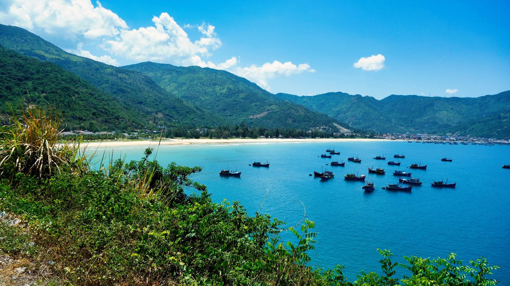
    <em>Dai Lanh</em>
  </figure>

  <figure>
    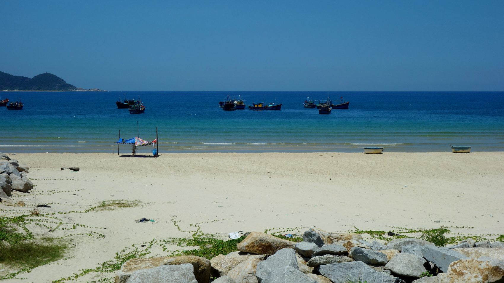
    <em>Dai Lanh</em>
  </figure>

<figure>
  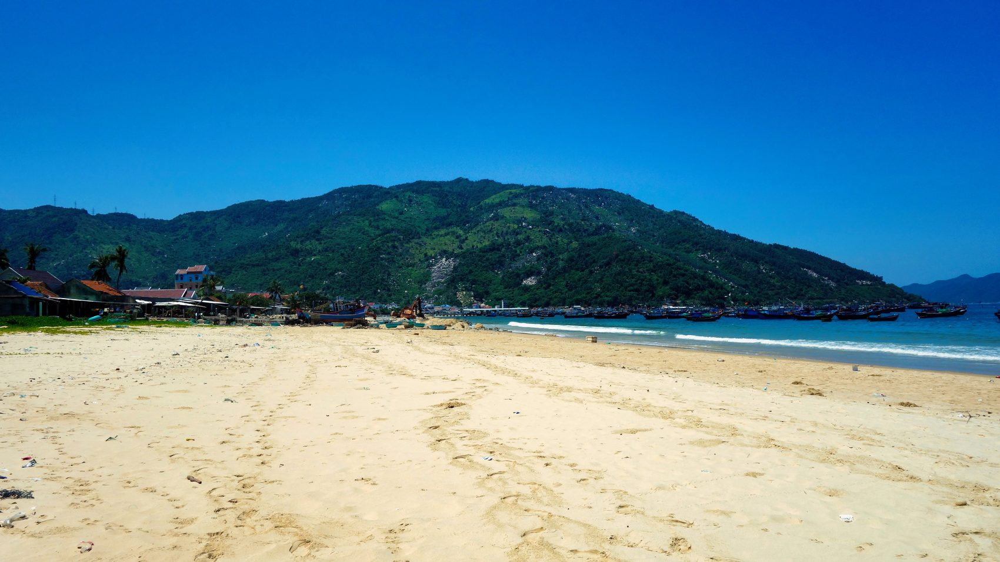
  <em>Dai Lanh</em>
</figure>

Then past the scenic Dai Lanh pass to [Bai Mon](https://www.google.com/maps/search/?api=1&query=B%C3%A3i+M%C3%B4n%2C+Ph%C3%BA+Y%C3%AAn), one of the most stunning beaches in the country. There is a small entrance fee but the place itself is completely unspoilt and magnificent. There is no shade at all, so it is best visited outside the hottest months of the year.

  <figure>
    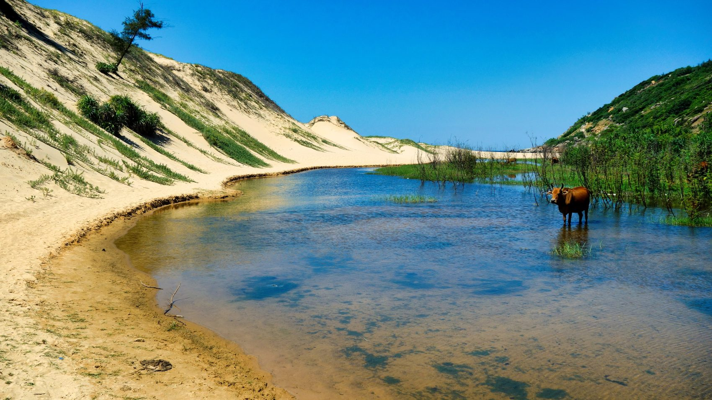
    <em>Bai Mon</em>
  </figure>

  <figure>
    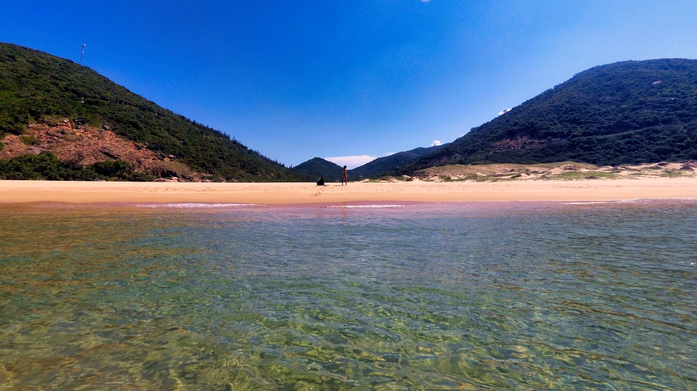
    <em>Bai Mon</em>
  </figure>

<figure>
  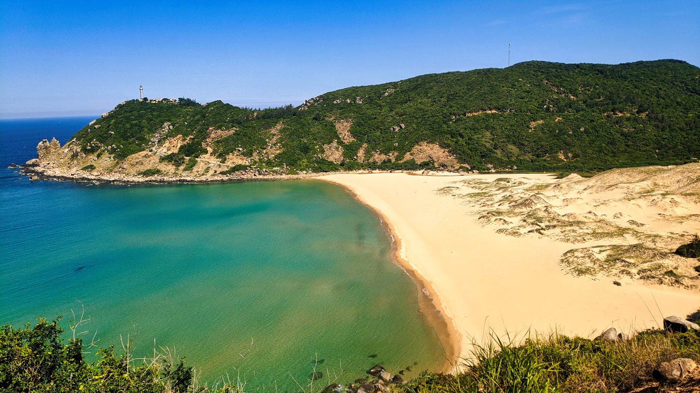
  <em>Bai Mon</em>
</figure>

We had a late lunch on the outskirts of Tuy Hoa at [Quán Binh Xin](https://andrestgt.github.io/food/vietnam/phu-yen/tuy-hoa/restaurants/quan-binh-xin/), packed with locals well past lunchtime. The seafood fried rice was tasty but a bit expensive at 90k. The gỏi cá mai, a raw anchovy salad, was absolutely gorgeous and generous at 60k, worth stopping here just for that.

<figure>
  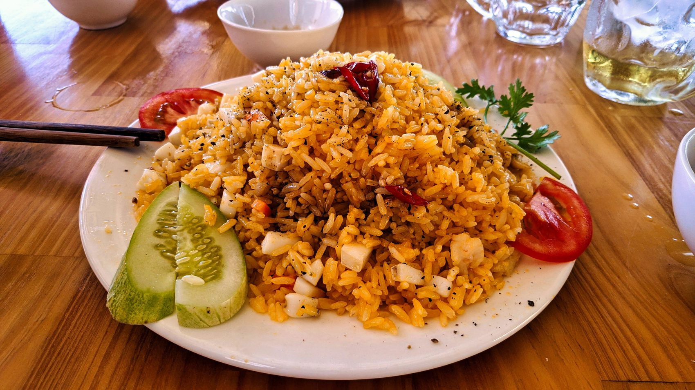
  <em>Quán Binh Xin - seafood fried rice</em>
</figure>

By mid-afternoon we arrived in Tuy Hoa and checked in at [Hotel Hiệp Thành](https://www.google.com/maps/search/?api=1&query=Hotel+Hiep+Thanh+Tuy+Hoa), a standard provincial mini hotel but very friendly, with an elevator and brand-new, if smallish, rooms.

<figure>
  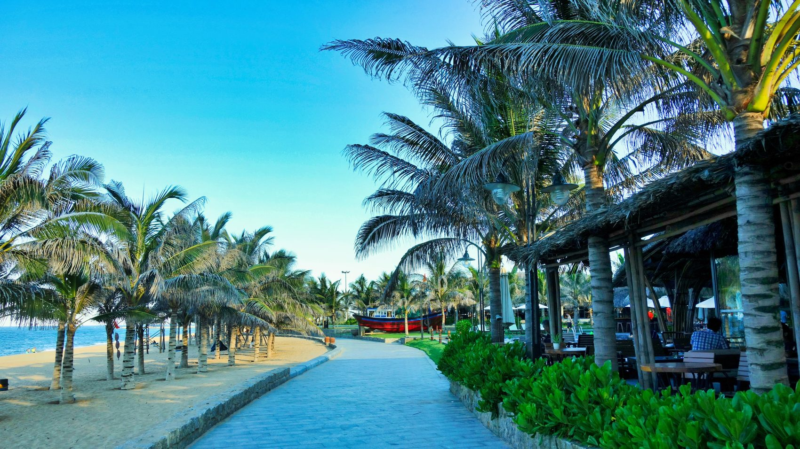
  <em>Tuy Hoa</em>
</figure>

Pre-dinner snacks at [Quán A Chín](https://andrestgt.github.io/food/vietnam/phu-yen/tuy-hoa/street-food/quan-a-chin/), a basic but very popular bia hơi place. Fresh beer at 20k for two litres and the bò lá lốt, served pancake-sized on a plate rather than in the usual rolls, was possibly the best I have ever had (70k). Dinner proper at [Quán Bà Tám](https://andrestgt.github.io/food/vietnam/phu-yen/tuy-hoa/restaurants/quan-ba-tam-ca-ngu-dai-duong/), a basic tuna specialty restaurant running the full range from steamed tuna eye to beautifully grilled tuna belly. Cheap, delicious, friendly, an absolute must in Tuy Hoa.

<figure>
  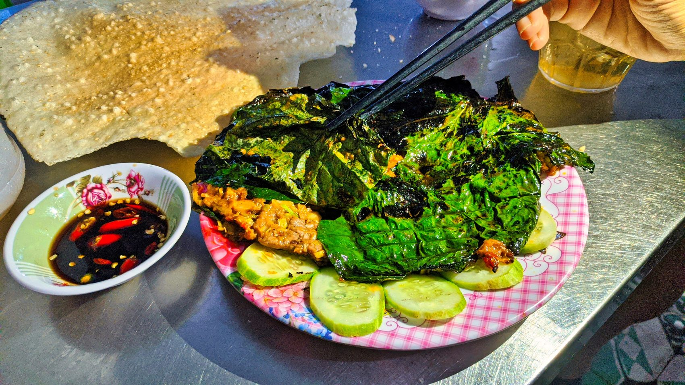
  <em>Quán A Chín - bò lá lốt</em>
</figure>

## 2 June 2020

Next day up to Quy Nhon along the small back roads rather than Highway 1. We first stopped at [Bai Phu Thuong](https://www.google.com/maps/search/?api=1&query=B%C3%A3i+Ph%C3%BA+Th%C6%B0%E1%BB%A3ng%2C+Ph%C3%BA+Y%C3%AAn) near Ganh Yen, one of the most beautiful beaches in Central Vietnam. It can only be reached through a maze of small village roads, which prevents any development, at least for now. Pristine, clean, with crystal-clear water, a gem of a beach for individual travellers with their own wheels.

  <figure>
    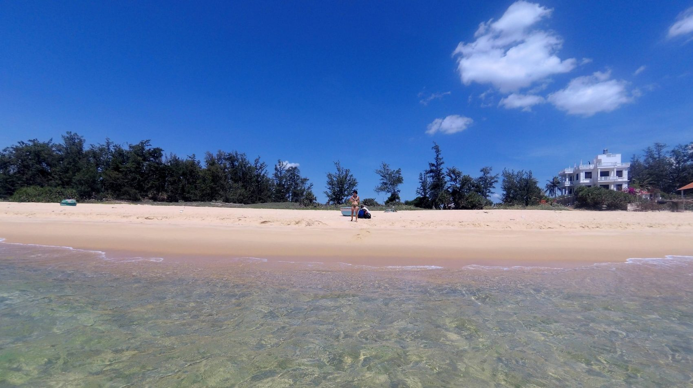
    <em>Phu Yen - Bai Phu Thuong</em>
  </figure>

  <figure>
    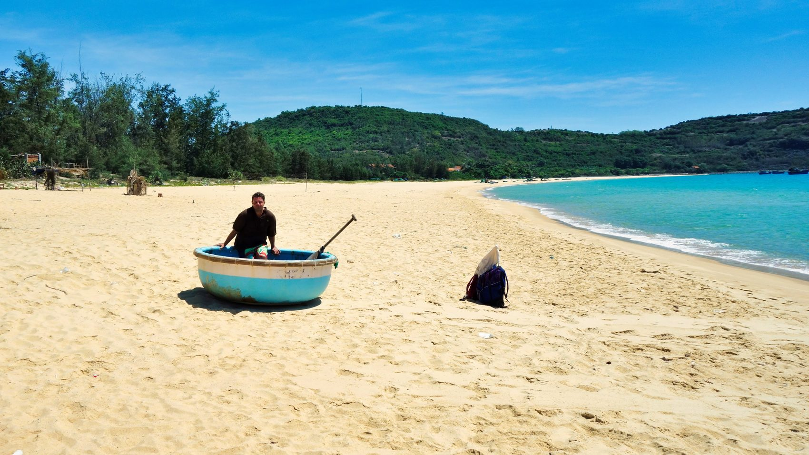
    <em>Phu Yen - Bai Phu Thuong</em>
  </figure>

<figure>
  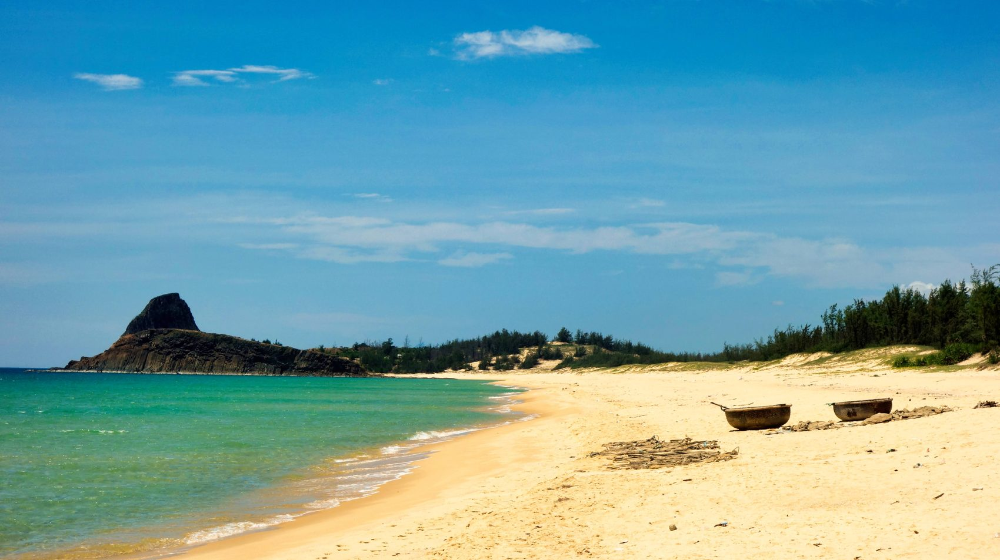
  <em>Phu Yen - Bai Phu Thuong</em>
</figure>

Before Song Cau we crossed [Cau Go Ong Cop](https://www.google.com/maps/search/?api=1&query=C%E1%BA%A7u+G%E1%BB%97+%C3%94ng+C%E1%BB%8Dp%2C+Ph%C3%BA+Y%C3%AAn), a long wooden bridge that is the much more pleasant alternative to Highway 1 for bicycles and motorbikes. Free of charge.

<figure>
  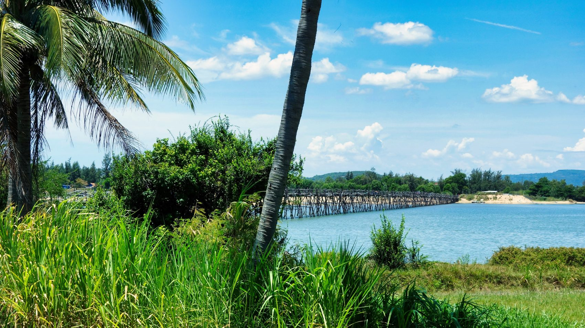
  <em>Phu Yen - Cau Go Ong Cop</em>
</figure>

Around Song Cau we stopped twice, first for refreshments and beautiful sea views at [Nhà hàng Nhất Tự Sơn](https://www.google.com/maps/search/?api=1&query=Nh%C3%A0%20h%C3%A0ng%20Nh%E1%BA%A5t%20T%E1%BB%B1%20S%C6%A1n%2C%20S%C3%B4ng%20C%E1%BA%A7u%2C%20Ph%C3%BA%20Y%C3%AAn), and then along Highway 1 just past the town for a quick lunch at [Quán cơm Phương Thảo](https://www.google.com/maps/search/?api=1&query=Qu%C3%A1n%20c%C6%A1m%20Ph%C6%B0%C6%A1ng%20Th%E1%BA%A3o%2C%20S%C3%B4ng%20C%E1%BA%A7u%2C%20Ph%C3%BA%20Y%C3%AAn), one of those basic truckers' and motorists' rest stops where you usually get nice food at great prices.

<figure>
  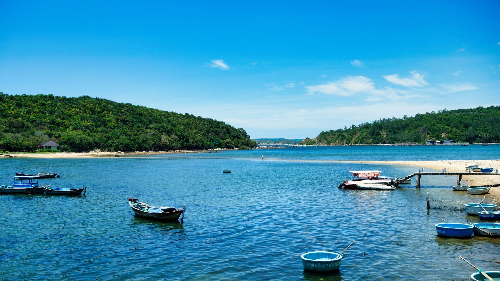
  <em>Song Cau - Nhà hàng Nhất Tự Sơn</em>
</figure>

<figure>
  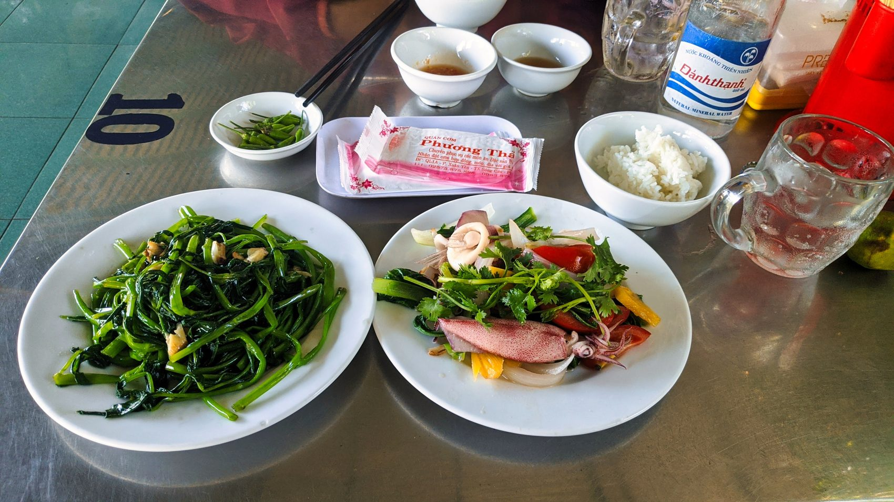
  <em>Quán cơm Phương Thảo - mực xào chua ngọt and rau muống</em>
</figure>

The peninsula facing Song Cau has a lot of tourist potential, but was ultimately a bit disappointing. [Bai bien Om](https://www.google.com/maps/search/?api=1&query=B%C3%A3i+bi%E1%BB%83n+%C3%94m%2C+S%C3%B4ng+C%E1%BA%A7u) looks beautiful in pictures but the place was off limits to the public because of a big construction site, another beauty spot spoilt by rampant development. [Bai Bien Vinh Hoa](https://www.google.com/maps/search/?api=1&query=B%C3%A3i+Bi%E1%BB%83n+V%E1%BB%8Bnh+H%C3%B2a%2C+S%C3%B4ng+C%E1%BA%A7u) is picturesque enough but a village beach, not very clean, and not terribly inviting for a swim.

<figure>
  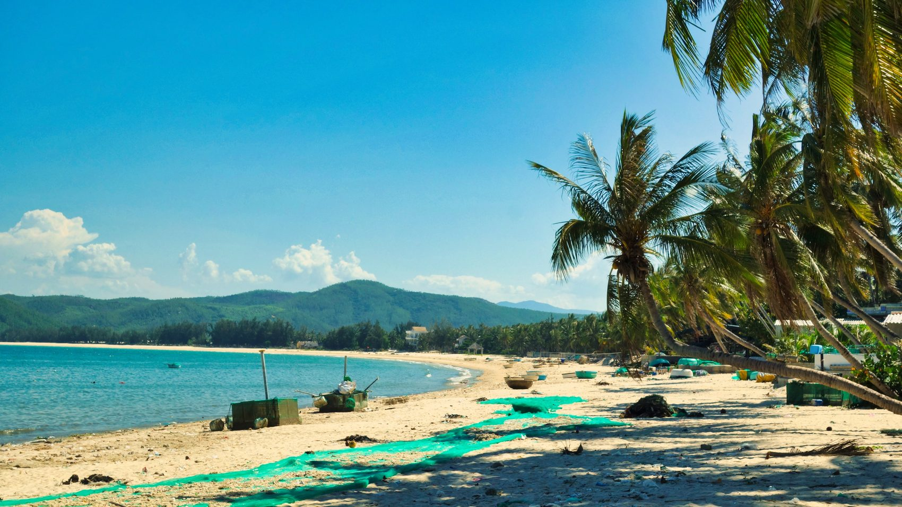
  <em>Phu Yen - Bai Bien Vinh Hoa</em>
</figure>

In the late afternoon we stopped for a swim at [Bai bien Quy Hoa](https://www.google.com/maps/search/?api=1&query=B%C3%A3i+bi%E1%BB%83n+Quy+H%C3%B2a%2C+Quy+Nh%C6%A1n). The water was a bit murky, but the bay itself is beautiful and usually empty; as a former leper colony, most locals still avoid this beach.

<figure>
  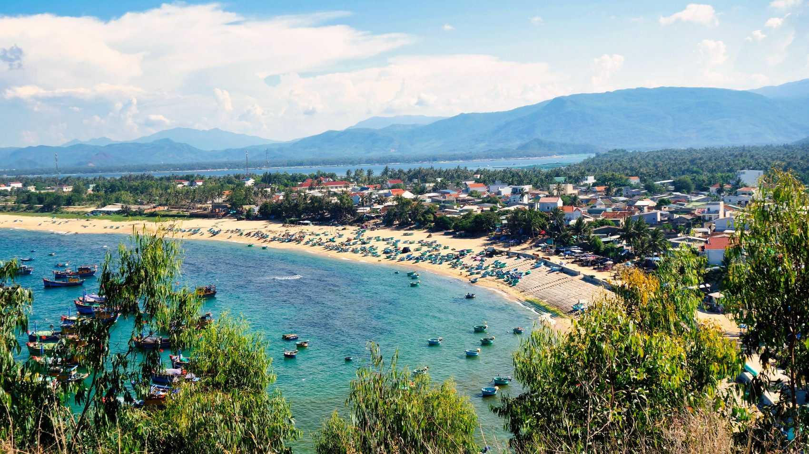
  <em>Phu Yen - Xuan Hai</em>
</figure>

  <figure>
    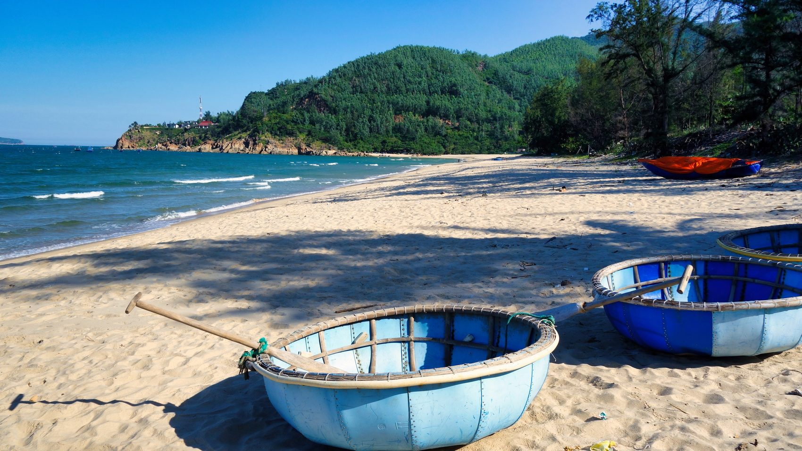
    <em>Quy Nhon - Quy Hoa</em>
  </figure>

  <figure>
    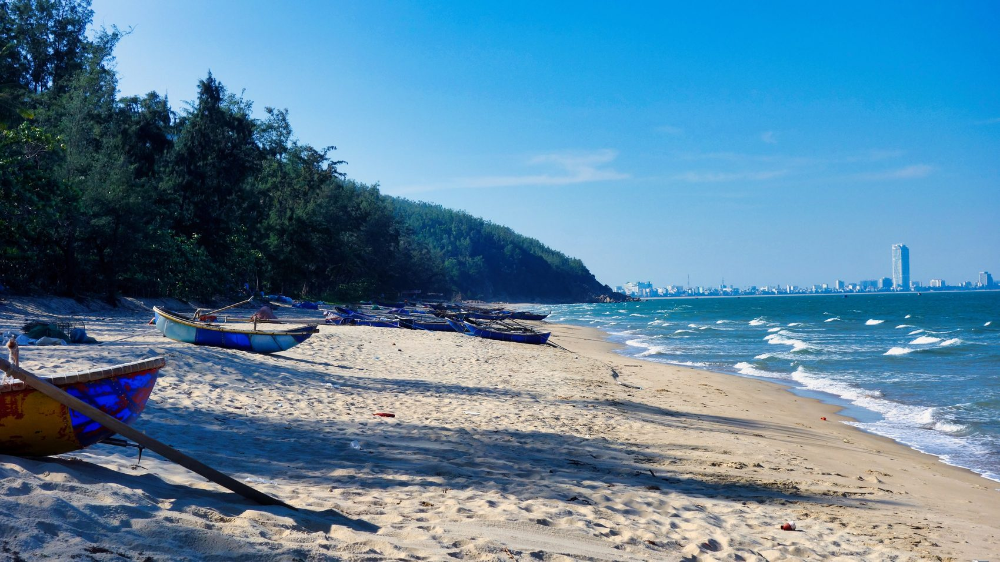
    <em>Quy Nhon - Quy Hoa</em>
  </figure>

For the night we stayed at [La Cactus Hotel 1](https://www.google.com/maps/search/?api=1&query=La+Cactus+Hotel+Quy+Nhon), not a bad place but there is no elevator and no fridge in the room. We got a very cheap online deal, so no complaints, but for the walk-in rates they charge, you should at least get a fridge, which is standard in Vietnam.

Early dinner at [Quán Năm Thêm](https://andrestgt.github.io/food/vietnam/binh-dinh/quy-nhon/restaurants/quan-nam-them/), a large and busy drinking place in the new part of town. Nothing out of the ordinary but the food is very good and prices reasonable. The local Quy Nhon beer is 7k a bottle, oysters are fresh and some quite large at 16k a piece, and the bánh tráng with coconut flavour (15k) is perfect with gỏi hải sản (65k).

<figure>
  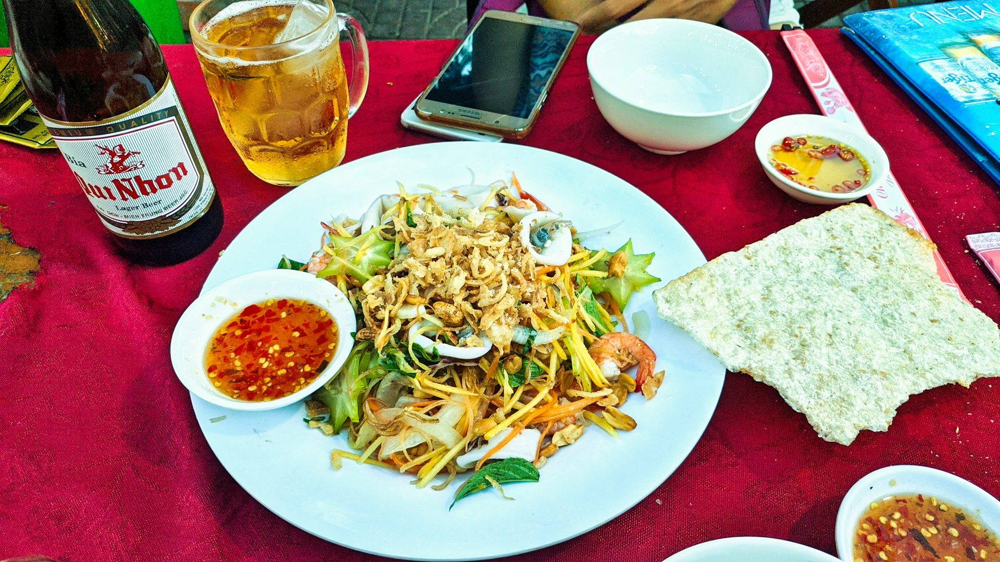
  <em>Quán Năm Thêm - gỏi hải sản</em>
</figure>

Sundowners at [Surf Bar](https://andrestgt.github.io/food/vietnam/binh-dinh/quy-nhon/bars-pubs/surf-bar/) in prime location. A beautiful beach bar with reasonable prices, but we should have just ordered beer or coffees; the cocktails were horrible. 30k for a Tiger in prime location is fair, though.

<figure>
  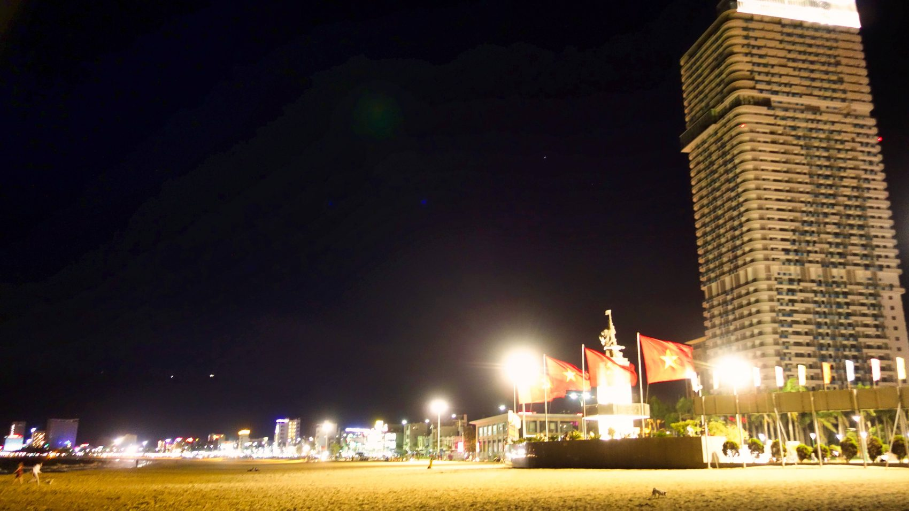
  <em>Quy Nhon - Surf Bar</em>
</figure>

Late-night drinks and snacks at [Quán Nhậu 97](https://andrestgt.github.io/food/vietnam/binh-dinh/quy-nhon/street-food/quan-nhau-97/) in the upmarket area around the lake. A simple drinking place, always packed and super welcoming. The local Quy Nhon beer is dirt cheap at 7k a bottle and the grilled dishes are outstanding. My favourite place in town.

<figure>
  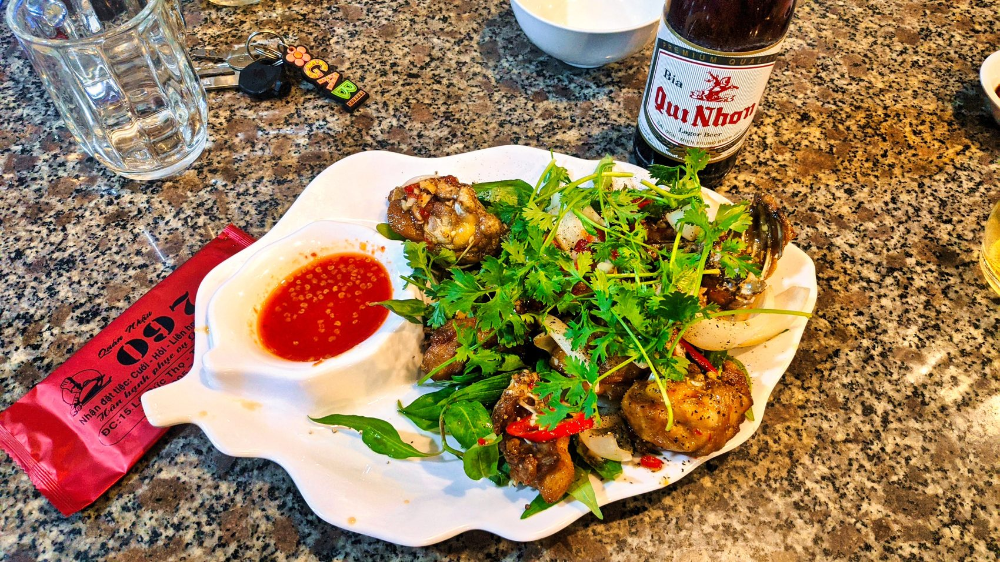
  <em>Quán Nhậu 97 - grilled chicken wings</em>
</figure>

## 3 June 2020

Quy Nhon deserved another day of exploring. Morning coffee at [Homebrew Coffee](https://andrestgt.github.io/food/vietnam/binh-dinh/quy-nhon/cafes/homebrew-coffee/), a brand-new Western-style café with a smooth cappuccino for only 39k. AC and Wi-Fi available, but so popular there were not enough comfy seats.

  <figure>
    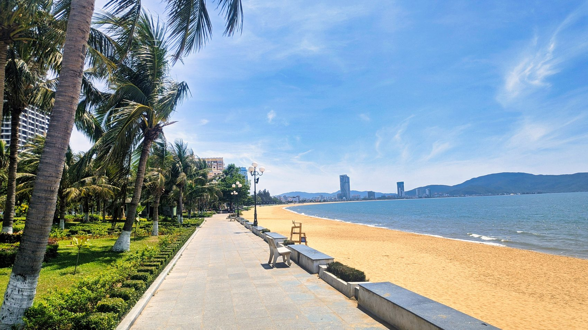
    <em>Quy Nhon</em>
  </figure>

  <figure>
    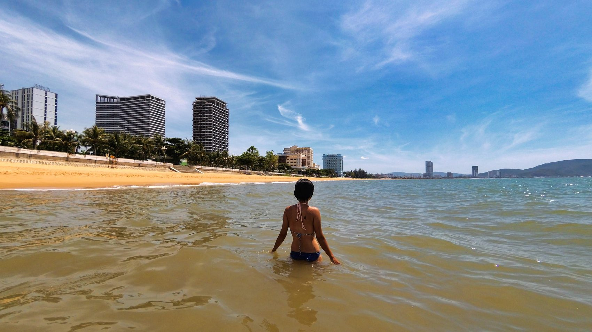
    <em>Quy Nhon</em>
  </figure>

<figure>
  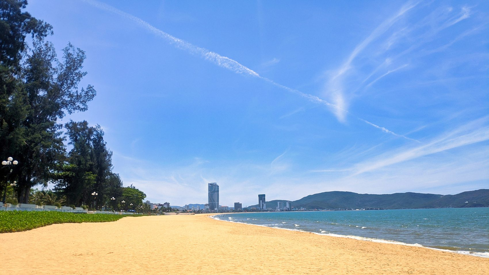
  <em>Quy Nhon</em>
</figure>

Breakfast at [Bánh canh Bà O](https://andrestgt.github.io/food/vietnam/binh-dinh/quy-nhon/street-food/banh-canh-ba-o/), a basic hole-in-the-wall popular for its bánh canh noodle soup, which is very good here. The real star, however, is the bánh cuốn, which here resembles Malaysian popiah and is dipped in peanut sauce. 52k for a bowl of soup and two rolls, on the high side for this kind of basic eatery but worth it.

<figure>
  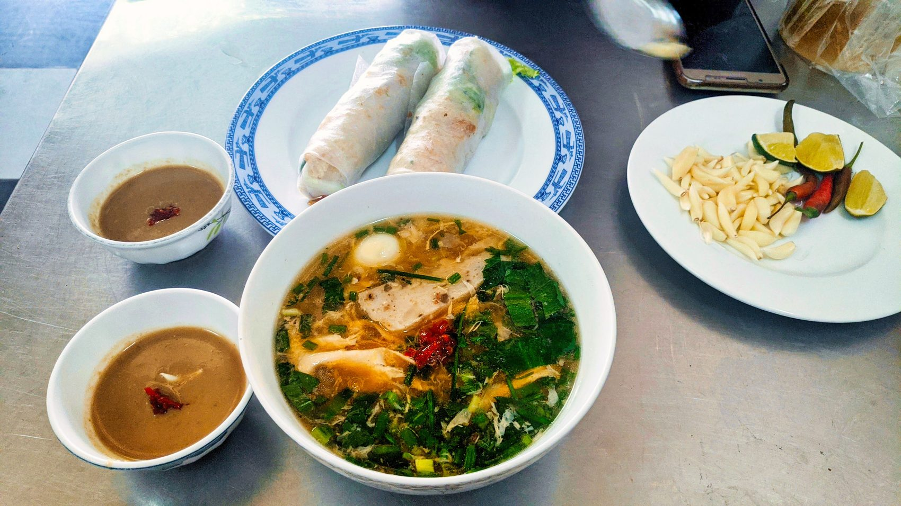
  <em>Bánh canh Bà O - bánh canh and gỏi cuốn</em>
</figure>

<figure>
  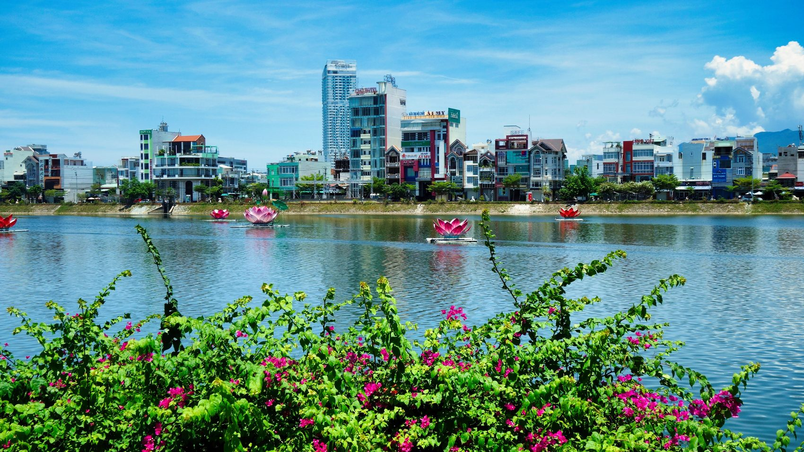
  <em>Quy Nhon</em>
</figure>

Lunchtime drinks at the [Quy Nhon Country Club](https://andrestgt.github.io/food/vietnam/binh-dinh/quy-nhon/bars-pubs/quy-nhon-country-club/). To call this place quirky would be an understatement. It operates on several levels of a hill above town with superb views, and decor ranges from old tandem bicycles to boarded-up bathtubs used as tables. For reasons unknown, most of the beer selection comes from little-known breweries in Southern Germany, most of them sadly out of stock, but we managed a Schwabenbräu Hefeweizen for 100k. Tiger is 30k. No food, which is a pity; the location would be fantastic for a restaurant.

  <figure>
    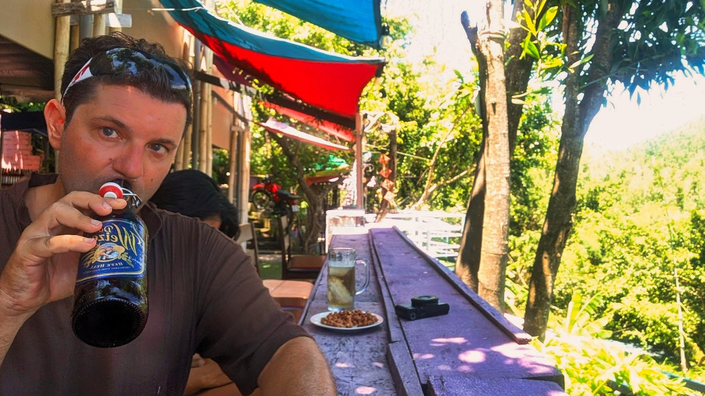
    <em>Quy Nhon Country Club</em>
  </figure>

  <figure>
    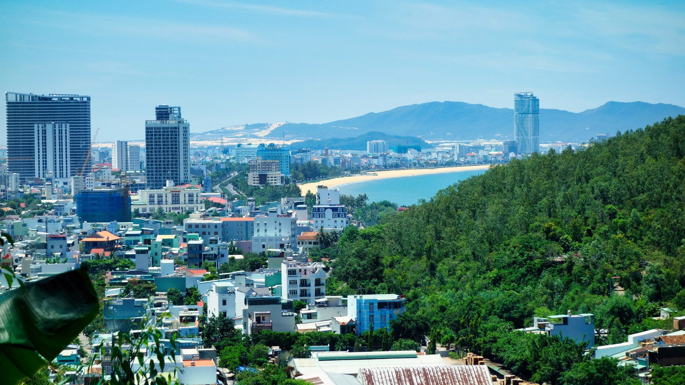
    <em>Quy Nhon Country Club</em>
  </figure>

Afternoon coffee at [Marina Royale](https://andrestgt.github.io/food/vietnam/binh-dinh/quy-nhon/cafes/marina-royale/), possibly the prettiest coffee shop in town, with AC and garden seating, much less expensive than it looks. A Vietnamese coffee is 18k.

<figure>
  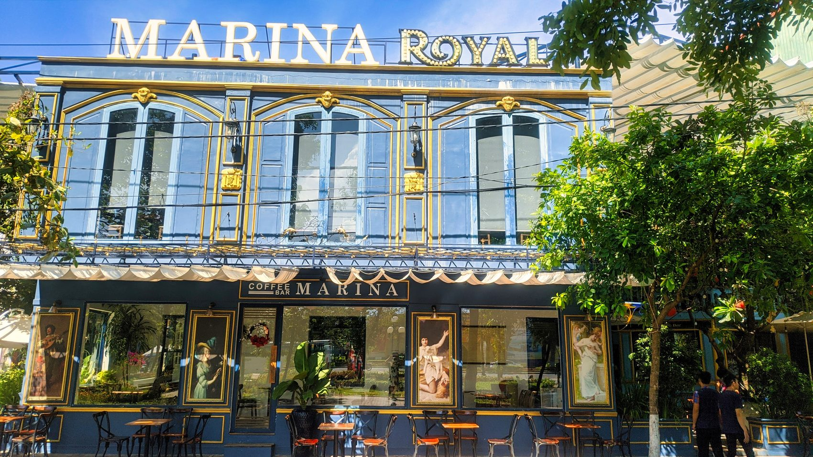
  <em>Quy Nhon - Marina Royale</em>
</figure>

Afternoon drinks back at the Surf Bar, followed by a snack at [Quán Ốc Hảo](https://andrestgt.github.io/food/vietnam/binh-dinh/quy-nhon/street-food/oc-hao-hao-duong-ngoc-han-cong-chua/), which offers a great variety of shells and mussels at 25k a dish. It is difficult to choose the right ones if you are not an expert; some are delicious, others rather bland, but at that price you can't really go wrong.

  <figure>
    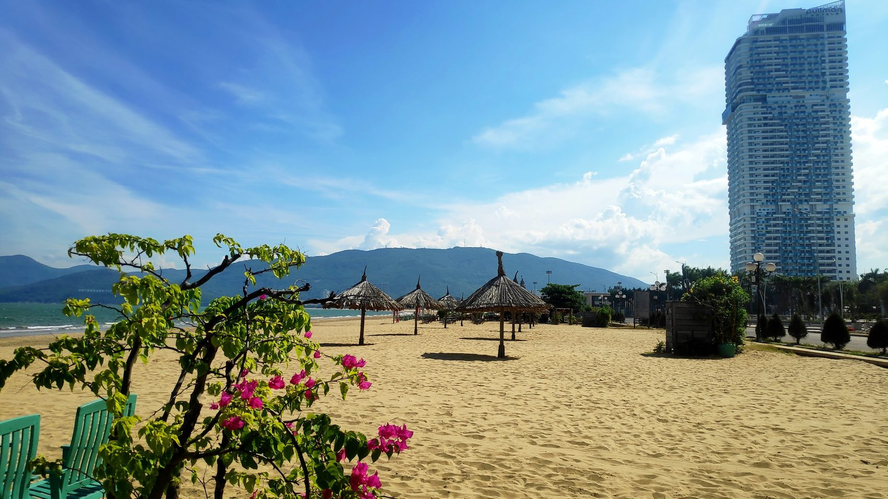
    <em>Quy Nhon - Surf Bar</em>
  </figure>

  <figure>
    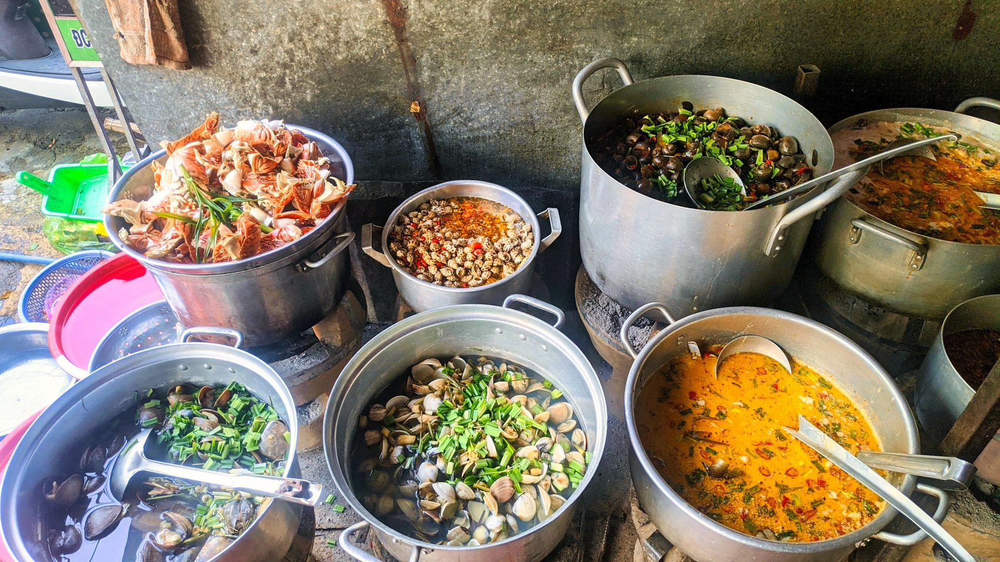
    <em>Quy Nhon - Quán Ốc Hảo</em>
  </figure>

Dinner at [Quán Bánh Xèo Tôm Nhảy Rau Mầm](https://andrestgt.github.io/food/vietnam/binh-dinh/quy-nhon/street-food/quan-banh-xeo-tom-nhay-rau-mam/), a most unremarkable eatery on one of Quy Nhon's least pleasant roads, but their three types of bánh xèo (all they serve here) are nothing short of spectacular. I have eaten bánh xèo all over the country and nothing comes close to this perfectly crispy pancake with prawns, squid or marinated beef, wrapped in rice paper with salad and leaves and dipped into peanut and fish-chilli sauce.

<figure>
  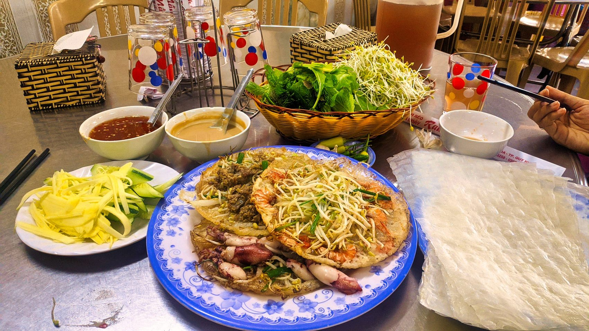
  <em>Quán Bánh Xèo Tôm Nhảy Rau Mầm - bánh xèo</em>
</figure>

Late-night snack back at Quán Nhậu 97, this time with the octopus done to smoky, tender perfection.

<figure>
  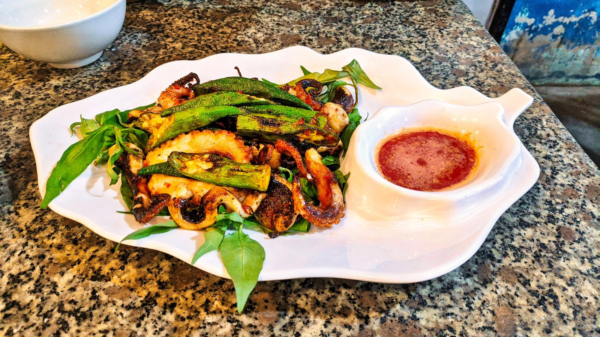
  <em>Quán Nhậu 97 - bạch tuộc nướng</em>
</figure>

## 4 June 2020

Early start north. [Vinh Hoi](https://www.google.com/maps/search/?api=1&query=B%C3%A3i+bi%E1%BB%83n+V%C4%A9nh+H%E1%BB%99i%2C+B%C3%ACnh+%C4%90%E1%BB%8Bnh) is one of the nicest beaches in the entire area. When I first visited five years ago, this part of the coast was still very remote, with only small roads and no development. A lot has changed since. Big resorts have been built on some nearby beaches and road extensions have turned large parts of it into construction areas. Vinh Hoi itself is still lovely and has been spared rampant development so far, but it is just a matter of time.

  <figure>
    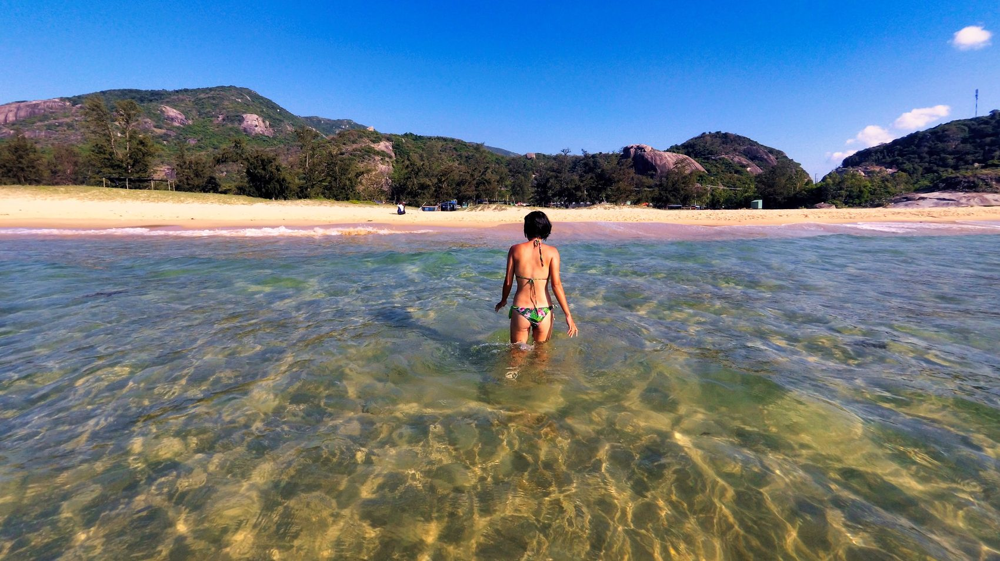
    <em>Binh Dinh - Vinh Hoi</em>
  </figure>

  <figure>
    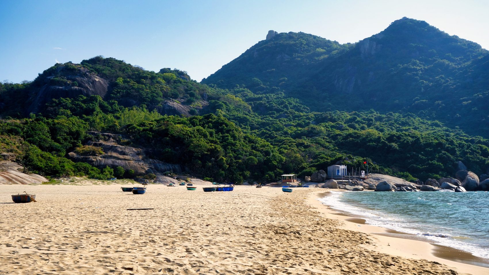
    <em>Binh Dinh - Vinh Hoi</em>
  </figure>

<figure>
  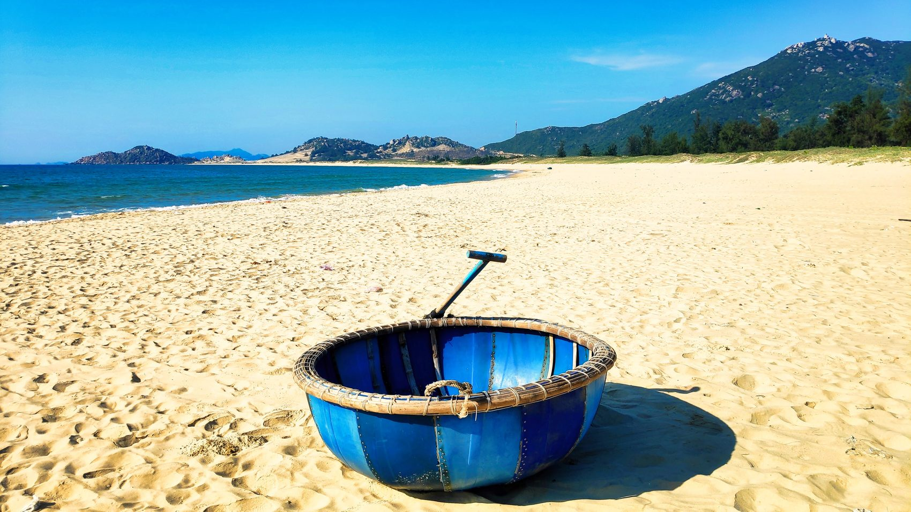
  <em>Binh Dinh - Vinh Hoi</em>
</figure>

[Lo Dieu](https://www.google.com/maps/search/?api=1&query=B%C3%A3i+bi%E1%BB%83n+L%E1%BB%99+Di%C3%AAu%2C+B%C3%ACnh+%C4%90%E1%BB%8Bnh) is only reachable by crossing serpentine passes on both sides of the valley. Remoteness and scenery are the main attractions. There is hardly any traffic and no coastal development yet. The beach is long and wild.

  <figure>
    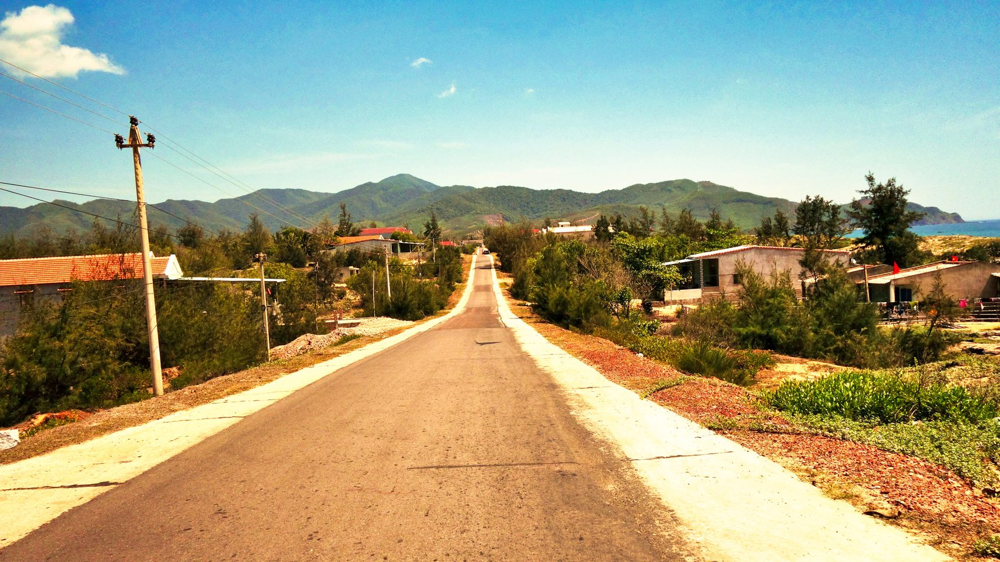
    <em>Binh Dinh - Lo Dieu</em>
  </figure>

  <figure>
    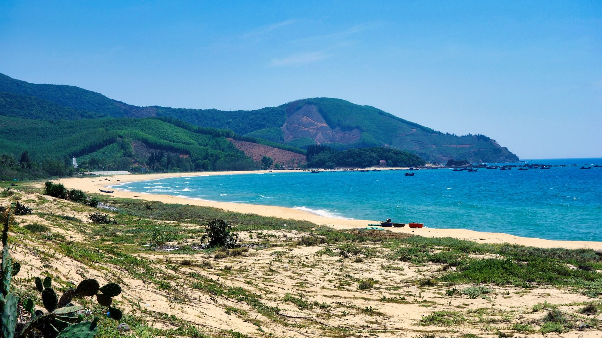
    <em>Binh Dinh - Lo Dieu</em>
  </figure>

Further north in Quang Ngai Province, [Bai Tam Chau Me 2](https://www.google.com/maps/search/?api=1&query=B%C3%A3i+T%E1%BA%AFm+Ch%C3%A2u+Me%2C+%C4%90%E1%BB%A9c+Ph%E1%BB%95%2C+Qu%E1%BA%A3ng+Ng%C3%A3i) is a nice and quiet beach with easy access but not much development yet. It is pretty rather than spectacular, but a good spot for an undisturbed dip in the sea.

<figure>
  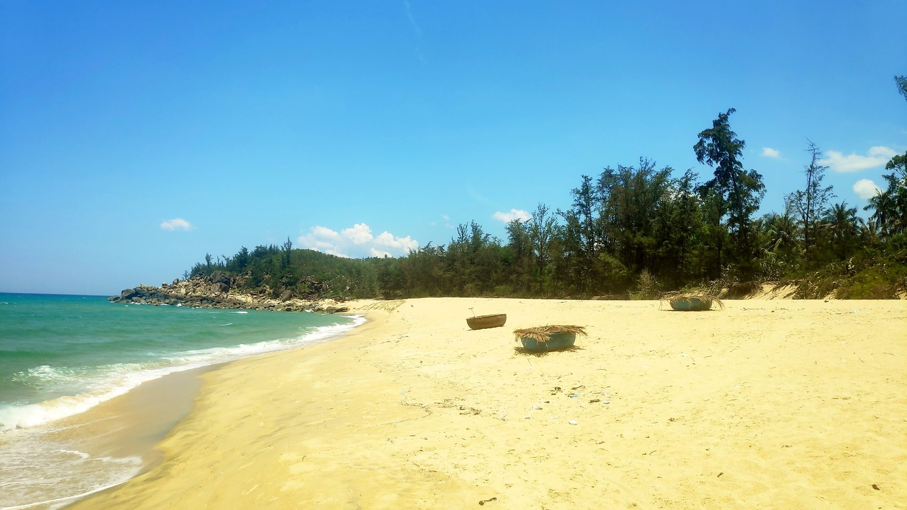
  <em>Bai Tam Chau Me 2</em>
</figure>

<figure>
  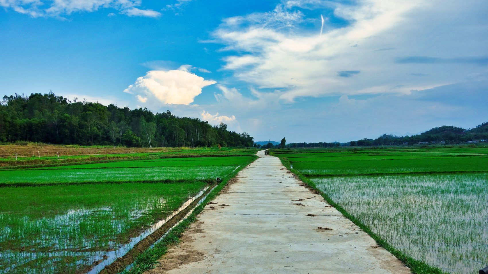
  <em>Quang Ngai Province</em>
</figure>

Lunch in Quang Ngai town at [Ram Thịt Nướng Loan](https://andrestgt.github.io/food/vietnam/quang-ngai/quang-ngai/street-food/ram-thit-nuong-loan/). Ram thịt nướng is a local specialty of several grilled meats including bò lá lốt and nem nướng, wrapped and rolled in rice paper with salad and herbs. 70k might seem steep for a basic eatery, but we got a lot of meat including deliciously marinated beef, and it was worth every đồng.

<figure>
  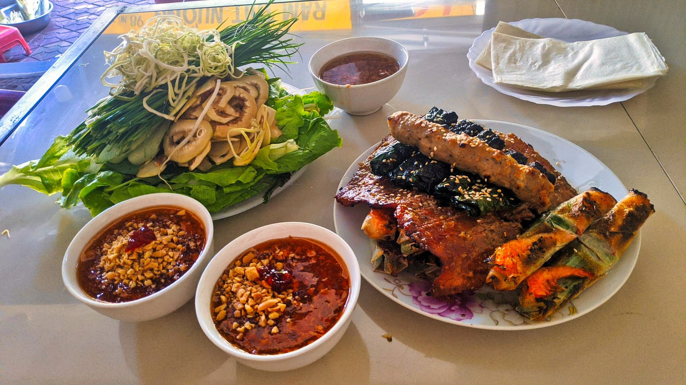
  <em>Ram Thịt Nướng Loan - ram thịt nướng</em>
</figure>

In the late afternoon we crossed by ferry onto [Tam Hai](https://www.google.com/maps/search/?api=1&query=Tam+H%E1%BA%A3i%2C+N%C3%BAi+Th%C3%A0nh%2C+Qu%E1%BA%A3ng+Nam) island and continued to [Tam Thanh](https://www.google.com/maps/search/?api=1&query=L%C3%A0ng+b%C3%ADch+h%E1%BB%8Da+Tam+Thanh%2C+Tam+K%E1%BB%B3), an attractive little seaside village with a picturesque beach and gorgeous sunsets. We stayed at [Homestay Ngọc Lan](https://www.google.com/maps/search/?api=1&query=Homestay+Ngoc+Lan+Tam+Thanh) for 250k, with its simple but modern and spotlessly clean rooms, a good choice in a village of few options.

<figure>
  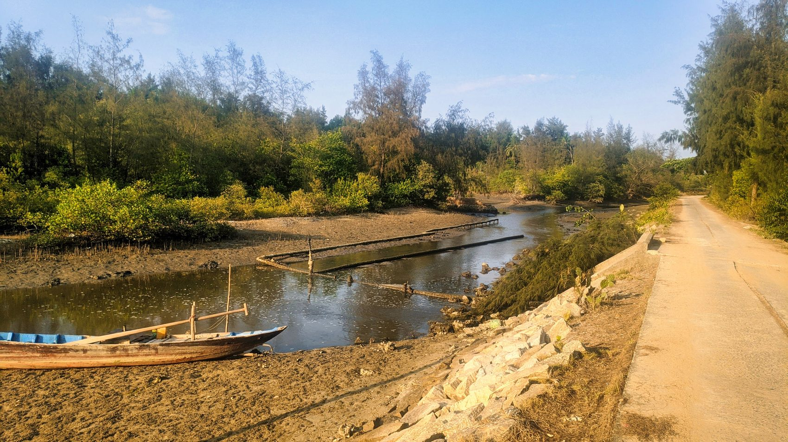
  <em>Tam Hai</em>
</figure>

  <figure>
    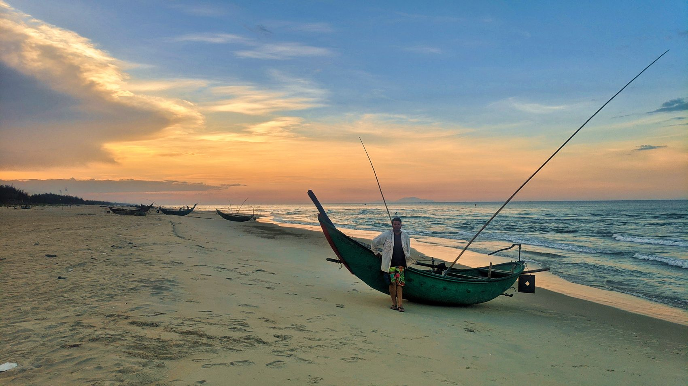
    <em>Tam Thanh</em>
  </figure>

  <figure>
    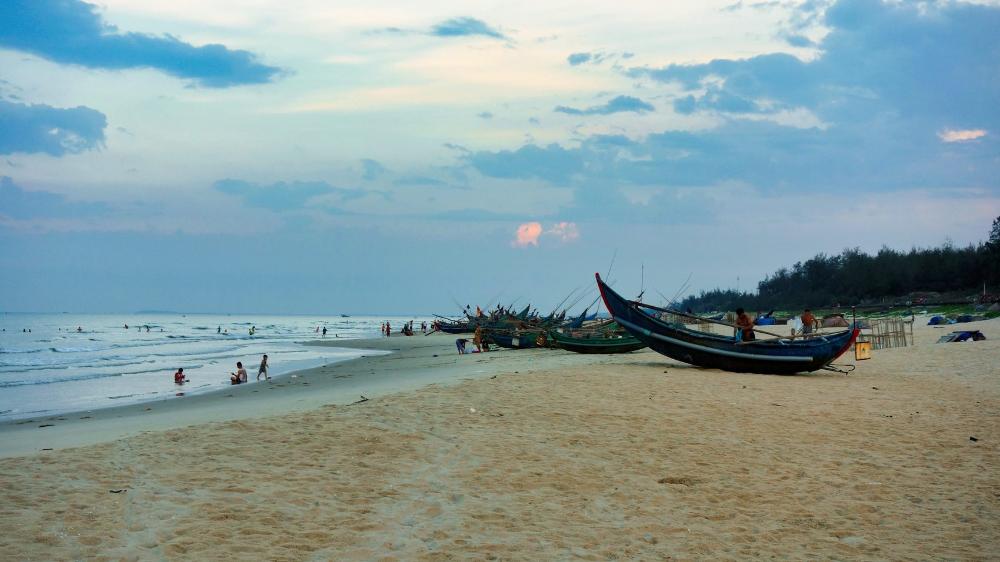
    <em>Tam Thanh</em>
  </figure>

Dinner of selected grilled meats at basic [Quán 78](https://www.google.com/maps/search/?api=1&query=Quan+78+Tam+Thanh), one of only a handful of eateries in town.

<figure>
  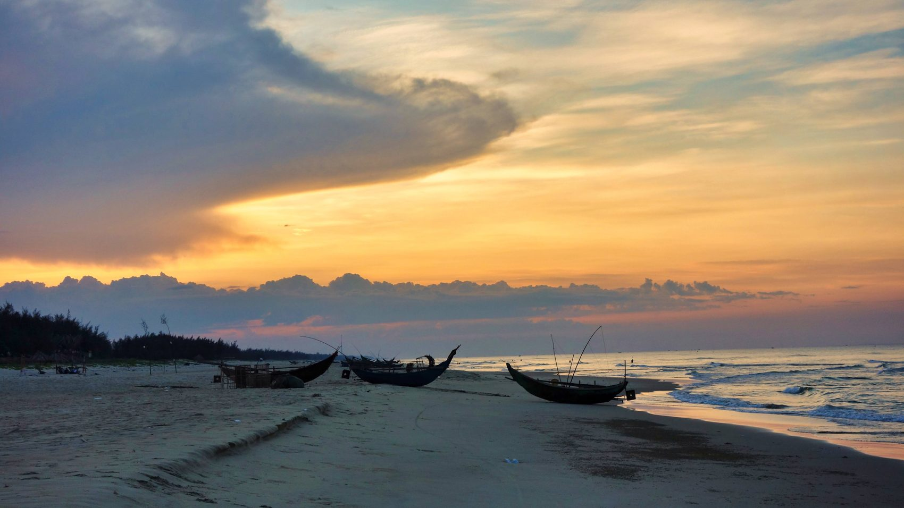
  <em>Tam Thanh</em>
</figure>

<figure>
  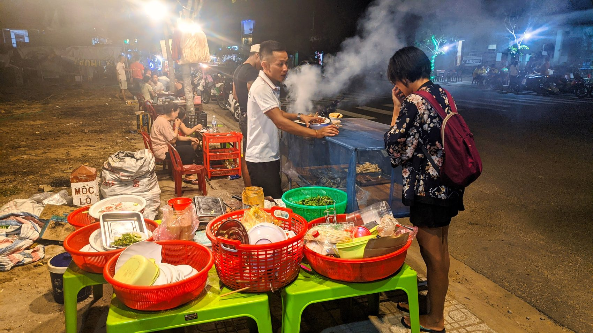
  <em>Tam Thanh - Quán 78</em>
</figure>

## 5 June 2020

An early walk along Tam Thanh beach at first light, then back on the road towards Hoi An, sticking exclusively to the most idyllic backroads.

  <figure>
    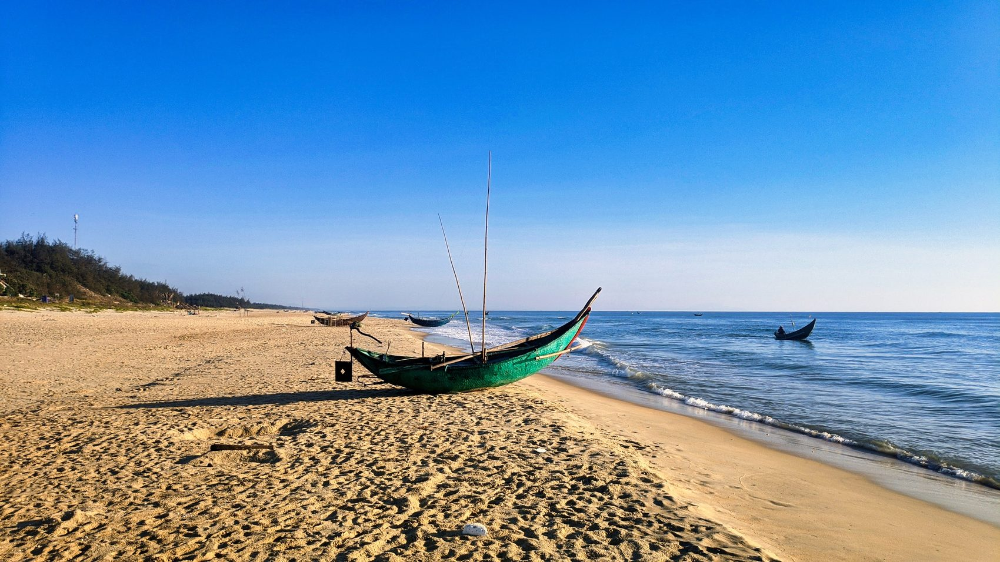
    <em>Tam Thanh</em>
  </figure>

  <figure>
    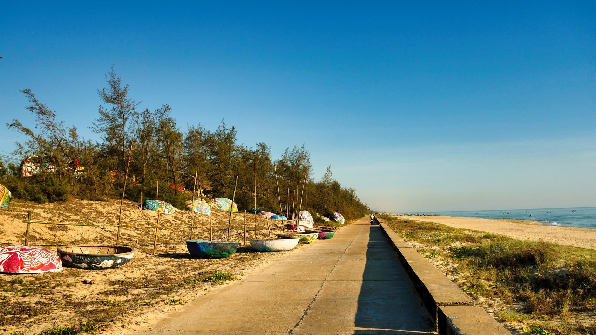
    <em>Tam Thanh</em>
  </figure>

<figure>
  
  <em>Around Hoi An</em>
</figure>

Breakfast in Hoi An at [Bánh Mì Phượng](https://andrestgt.github.io/food/vietnam/hoi-an/street-food/banh-mi-phuong/). They have reshuffled the menu, and the sandwich to order is now #3 thập cẩm with a little bit of everything, 30k, and a lot of filling for your dough. The queue here used to be ridiculous, but these days it is not a problem; the entire historic centre was even sleepier than on my first visit 20 years earlier.

<figure>
  
  <em>Bánh Mì Phượng - bánh mì thập cẩm</em>
</figure>

Morning coffee at [Nhã Na Coffee](https://andrestgt.github.io/food/vietnam/hoi-an/cafes/nha-na-coffee/). The location on Cua Dai road is not exactly inspiring by Hoi An standards, but the 40k flat white was really good, with friendly service and prices more reasonable than in the Old Town.

<figure>
  
  <em>Nhã Na Coffee - flat white</em>
</figure>

Onwards to Da Nang, where we checked in at the [Pacific Hotel](https://www.google.com/maps/search/?api=1&query=Pacific+Hotel+Phan+Chau+Trinh+Da+Nang). It has seen better days but for the prices they are charging now, the old-fashioned rooms (200k) are a steal considering the downtown location. Everything old but in working order and clean.

<figure>
  
  <em>Da Nang - Pacific Hotel</em>
</figure>

Lunch at [Mì Quảng 1A](https://andrestgt.github.io/food/vietnam/da-nang/street-food/mi-quang-1a/), a popular hole in the wall offering one dish only, the Quang Nam specialty mì Quảng. Very tasty but as unremarkable as the surroundings. 45k for a đặc biệt bowl is a good price.

<figure>
  
  <em>Mì Quảng 1A - mì quảng gà</em>
</figure>

Afternoon drinks at [7 Bridges Taproom](https://andrestgt.github.io/food/vietnam/da-nang/bars-pubs/7-bridges/), the local craft-beer microbrewery. Seven Bridges sells all over the country but they are native to Da Nang and offer a wide range of styles, with the My Khe Coconut being my favourite. It is not exactly cheap but they have daily specials and happy hour from 4 to 7 p.m., and the terrace views upstairs are fantastic.

  <figure>
    
    <em>Da Nang</em>
  </figure>

  <figure>
    
    <em>Da Nang</em>
  </figure>

<figure>
  
  <em>7 Bridges Taproom - beer sampler</em>
</figure>

<figure>
  
  <em>Da Nang</em>
</figure>

A snack at [Ốc Hút 277](https://andrestgt.github.io/food/vietnam/da-nang/street-food/oc-hut-277/), a friendly hole in the wall specialising in ốc hút, the most popular mussel dish in Da Nang. Accompanied by mít trộn (jackfruit salad), it is a great pre-dinner snack.

<figure>
  
  <em>Da Nang - Ốc Hạnh</em>
</figure>

Dinner at [Hops & Crust](https://andrestgt.github.io/food/vietnam/da-nang/bars-pubs/hops-crust-craft-beer-and-pizza/), expat central and a fun place to be. There was live music, a great selection of craft beers on tap, and especially the Belgos were very reasonably priced.

<figure>
  
  <em>Da Nang - Hops & Crust</em>
</figure>

## 6 June 2020

A day in Da Nang. Breakfast at [Mỳ Quảng Bà Mua](https://andrestgt.github.io/food/vietnam/da-nang/street-food/my-quang-ba-mua/), a neat mì quảng eatery with several branches around the city and a tasty frog version of the dish. Morning coffee at [La Bella Bistro](https://andrestgt.github.io/food/vietnam/da-nang/cafes/la-bella-bistro-da-nang/), a lovely shady place around a koi pond with excellent coffees, both espresso and Vietnamese style. Perfect for a coffee break even on a hot summer day without AC.

<figure>
  
  <em>Mỳ Quảng Bà Mua - mì quảng ếch</em>
</figure>

<figure>
  
  <em>Da Nang - La Bella Bistro</em>
</figure>

For the second night we switched hotels and moved out to the beach side of town, to the [Happy Sky Hotel](https://www.google.com/maps/search/?api=1&query=Happy+Sky+Hotel+Da+Nang), offering spotless 3-star quality rooms and even a small shady pool in a good location for both the beach and downtown.

<figure>
  
  <em>Da Nang - Happy Sky Hotel</em>
</figure>

In the afternoon we took the scenic coastal road along the south side of the Da Nang peninsula all the way to where the road ends, and on the way back we went for a swim at [Bãi Nam](https://www.google.com/maps/search/?api=1&query=B%C3%A3i+Nam%2C+S%C6%A1n+Tr%C3%A0%2C+%C4%90%C3%A0+N%E1%BA%B5ng), a pretty cove with white sand, photogenic round boats and fantastic views over Da Nang's skyline.

  <figure>
    
    <em>Da Nang</em>
  </figure>

  <figure>
    
    <em>Da Nang</em>
  </figure>

<figure>
  
  <em>Da Nang</em>
</figure>

<figure>
  
  <em>Da Nang</em>
</figure>

Pre-dinner drinks at [Section 30](https://andrestgt.github.io/food/vietnam/da-nang/bars-pubs/section-30-craft-beer-cocktail-pub/), an attractive expat hangout but I was not entirely convinced. The happy hour only covered a limited selection of rather uninteresting beers, and the trio of dips (80k) was a bit bland.

<figure>
  
  <em>Section 30 - trio of dips</em>
</figure>

Sundowners back at 7 Bridges Taproom.

<figure>
  
  <em>Da Nang - 7 Bridges Taproom</em>
</figure>

Dinner at [Quán Kén](https://andrestgt.github.io/food/vietnam/da-nang/street-food/quan-ken/), a temporary pop-up that specialises in gỏi cá, fish salads. Their gỏi cá trích (not on the main menu but on the side board) was ridiculously good, as good as any in Vietnam. The portions were big and meant for sharing, well worth 100k for the amount of fish, and the beer was cheap as chips at 12k for a Larue.

<figure>
  
  <em>Quán Kén - gỏi cá trích</em>
</figure>

## 7 June 2020

Da Nang to Hue via the [Hai Van Pass](https://www.google.com/maps/search/?api=1&query=%C4%90%C3%A8o+H%E1%BA%A3i+V%C3%A2n), one of the great rides in Vietnam.

  <figure>
    
    <em>Hai Van Pass</em>
  </figure>

  <figure>
    
    <em>Hai Van Pass</em>
  </figure>

<figure>
  
  <em>Hai Van Pass</em>
</figure>

Down the other side to the beautiful [Lăng Cô](https://www.google.com/maps/search/?api=1&query=L%C4%83ng+C%C3%B4%2C+Th%E1%BB%ABa+Thi%C3%AAn+Hu%E1%BA%BF) peninsula, and then along the coast on small country roads through the villages north of Chan May rather than sticking with the highway. [Bai Bien Chan May](https://www.google.com/maps/search/?api=1&query=B%C3%A3i+bi%E1%BB%83n+Ch%C3%A2n+M%C3%A2y%2C+L%E1%BB%99c+V%C4%A9nh) itself is a village beach, not exactly pristine but still very picturesque and good for a swim.

  <figure>
    
    <em>Lăng Cô</em>
  </figure>

  <figure>
    
    <em>Lăng Cô</em>
  </figure>

<figure>
  
  <em>Lăng Cô</em>
</figure>

<figure>
  
  <em>Bai Bien Chan May</em>
</figure>

Further on, past Tan Canh Duong and Thon Phu An, a coffee break at [Sumo Café](https://www.google.com/maps/search/?api=1&query=Sumo+Cafe+Hien+Van+Hue) in Hien Van, then on through Mai Vinh to Hue.

<figure>
  
  <em>Tan Canh Duong</em>
</figure>

<figure>
  
  <em>Thon Phu An</em>
</figure>

<figure>
  
  <em>Hien Van - Sumo Cafe</em>
</figure>

<figure>
  
  <em>Mai Vinh</em>
</figure>

Brunch stop at [Bai Bien Thuan An](https://www.google.com/maps/search/?api=1&query=B%C3%A3i+bi%E1%BB%83n+Thu%E1%BA%ADn+An%2C+Hu%E1%BA%BF), Hue's city beach. It is long and golden and wild. With the wooden fishing boats and seafood shacks it is incredibly photogenic, but there is not much privacy for relaxed swimming or sunbathing and the water is rarely crystal clear. It is a great place for a seafood lunch and a few cold Hudas though.

  <figure>
    
    <em>Hue - Bai Bien Thuan An</em>
  </figure>

  <figure>
    
    <em>Hue - Bai Bien Thuan An</em>
  </figure>

<figure>
  
  <em>Bai Bien Thuan An - nghêu hấp</em>
</figure>

In Hue we checked in at [Villa Hue](https://www.google.com/maps/search/?api=1&query=Villa+Hue+Hotel), and for the price (400k) the rooms were fantastic value. Spacious, clean, and if they had not turned off the mini bar I would have said minimum 4-star standard. The negative was the level of cleanliness in public areas such as the pool and rest rooms, almost shocking with overflowing ashtrays and loo roll lying around in the hallways. The room itself was absolutely spotless and reception staff were friendly and professional.

  <figure>
    
    <em>Hue - Villa Hue</em>
  </figure>

  <figure>
    
    <em>Hue - Villa Hue</em>
  </figure>

Late lunch at [Hot Tuna](https://andrestgt.github.io/food/vietnam/hue/restaurants/hottuna-restaurant-nha-hang-hottuna/), a tourist restaurant in a prime backpacker-central location. We were attracted by their German-style bia hơi, but the cask was off. Instead they offered Huda on tap for 18k. The food is clearly for tourists only: the bánh khoái (59k) was acceptable but unremarkable, without a whole lot of herbs and leaves, without bánh tráng to roll and a rather tame peanut sauce lacking a punch of mắm tôm and chilli.

<figure>
  
  <em>Hot Tuna - bánh khoái</em>
</figure>

Afternoon snack at [Cơm hến Hoà Đồng](https://andrestgt.github.io/food/vietnam/hue/street-food/com-hen-hoa-dong-2/) (as we found out later, not to be confused with its quasi namesake further down the alley). Not a copycat or a rip-off, and you get perfectly decent mussel rice and Hue cakes here for very little money. The problem is that there is no real reason to eat here when just 50 metres down the road you get an excellent version of the same dishes for the same price.

<figure>
  
  <em>Cơm hến Hoà Đồng - mì hến</em>
</figure>

<figure>
  
  <em>Hue</em>
</figure>

Dinner at [Bún Bò O Ty](https://andrestgt.github.io/food/vietnam/hue/street-food/bun-bo-o-ty/). There are lots of overpriced tourist bún bò joints in Hue; this is definitely not one of them. A friendly local neighbourhood place with excellent bowls for a mere 25k. The broth is smooth and balanced and the quality of the meat and meat balls is outstanding for such a cheap bowl.

<figure>
  
  <em>Bún Bò O Ty - bún bò Hue</em>
</figure>

Evening drinks at [DMZ Bar](https://andrestgt.github.io/food/vietnam/hue/bars-pubs/dmz-bar-restaurant/). This long-established backpacker bar is trying to reinvent itself now that there are no more backpackers in the country. Catering to the taste of the local youth means the music is horrible and deafening, but the place was almost empty on a Sunday night even with the walking street. A sad sight.

  <figure>
    
    <em>Hue</em>
  </figure>

  <figure>
    
    <em>Hue</em>
  </figure>

## 8 June 2020

A day in Hue. Breakfast at the original [Cơm Hến Hoa Đông](https://andrestgt.github.io/food/vietnam/hue/street-food/com-hen-hoa-dong/), for good reason considered the best cơm hến (baby mussels rice) place on Hen Island, and the most popular too. A regular bowl is 10k and a bigger bowl with the lot goes for 15k. Their bánh bèo platter (20k) puts some of the fancier Hue cake restaurants in town to shame.

<figure>
  
  <em>Cơm Hến Hoa Đông - bánh bèo</em>
</figure>

Morning coffee at [Hue Roastery](https://andrestgt.github.io/food/vietnam/hue/cafes/hue-roastery/), a nicely decorated air-conditioned space with decent espresso drinks, a cappuccino for 28k and a Vietnamese coffee for 12k. Comfy seating is limited but the small wooden chairs had a view over the canal.

<figure>
  
  <em>Hue - Hue Roastery</em>
</figure>

After coffee we went for a walk through Hue's atmospheric old town alleys and huge market, followed by a pleasant ride through the surrounding countryside of Hue, past old villages, tombs and rice paddies.

  <figure>
    
    <em>Hue</em>
  </figure>

  <figure>
    
    <em>Hue</em>
  </figure>

  <figure>
    
    <em>Hue</em>
  </figure>

  <figure>
    
    <em>Hue</em>
  </figure>

  <figure>
    
    <em>Hue</em>
  </figure>

  <figure>
    
    <em>Hue</em>
  </figure>

  <figure>
    
    <em>Hue</em>
  </figure>

  <figure>
    
    <em>Hue</em>
  </figure>

Back in town, we had drinks and nibbles at [Gecko](https://andrestgt.github.io/food/vietnam/hue/restaurants/gecko/), a friendly traveller café still open even in these Covid times, with tasty Huda draft beer for 9k a glass, ice cold and fresh, not flat and metallic.

<figure>
  
  <em>Gecko - gỏi cuốn</em>
</figure>

Afternoon snack at [Bún Giấm Nuốc](https://andrestgt.github.io/food/vietnam/hue/street-food/bun-giam-nuoc/), a rarely found bowl of noodles with jellyfish and prawn crackers, apparently only available in summer and in just a handful of places in Hue. Tasty and cheap.

<figure>
  
  <em>Bún Giấm Nuốc - bún giấm nuốc</em>
</figure>

A second snack at [Bánh Ép Ngon Rẻ](https://andrestgt.github.io/food/vietnam/hue/street-food/banh-ep-ngon-re/), a local specialty street food that looks and tastes a little like Vietnam's answer to a burrito, a pressed pancake wrap with various fillings, undeniably tasty and dirt cheap.

<figure>
  
  <em>Bánh Ép Ngon Rẻ - bánh ép</em>
</figure>

Dinner back at Gecko. The Hue cakes are perfectly adequate and good value, but the bún bò Hue has little to do with the real thing.

  <figure>
    
    <em>Hue</em>
  </figure>

  <figure>
    
    <em>Hue</em>
  </figure>

<figure>
  
  <em>Gecko - chả giò tôm</em>
</figure>

## 9 June 2020

North from Hue into Quang Tri Province through incredibly idyllic scenery, with a stop at little-visited Quang Tri's picturesque citadel.

  <figure>
    
    <em>Around Hue</em>
  </figure>

  <figure>
    
    <em>Around Hue</em>
  </figure>

<figure>
  
  <em>Quang Tri</em>
</figure>

Breakfast in Dong Ha at [Phở Hằng](https://andrestgt.github.io/food/vietnam/quang-tri/dong-ha/street-food/pho-hang/), a neat modern eatery serving very good bowls of Northern-style phở at moderate prices, a large đặc biệt with a generous amount of delicious soft beef tendons for 35k.

<figure>
  
  <em>Dong Ha - Phở Hằng</em>
</figure>

<figure>
  
  <em>Along Hwy 15</em>
</figure>

We took Highway 15 rather than Highway 1, which is the much more pleasant route north, though still not exactly scenic.

A short stop at [Hai Ninh Beach](https://www.google.com/maps/search/?api=1&query=B%C3%A3i+bi%E1%BB%83n+H%E1%BA%A3i+Ninh%2C+Qu%E1%BA%A3ng+B%C3%ACnh) south of Dong Hoi, a very nice beach with lots of photogenic fishing boats, not great for swimming though.

  <figure>
    
    <em>Dong Hoi - Hai Ninh Beach</em>
  </figure>

  <figure>
    
    <em>Dong Hoi - Hai Ninh Beach</em>
  </figure>

In Dong Hoi we checked in at [ADP Homestay](https://www.google.com/maps/search/?api=1&query=ADP+Homestay+Dong+Hoi), a nicely decorated café downstairs and simple but decent rooms upstairs in a perfect location.

<figure>
  
  <em>Dong Hoi - ADP Homestay</em>
</figure>

Sundowners at [Buffalo Beach Bar](https://andrestgt.github.io/food/vietnam/quang-binh/dong-hoi/bars-pubs/buffalo-beach-bar/) which has a superb beachfront location. It is a very likeable bar with friendly service, cold beers from 20k and even Beer Lao at a fair 30k. With its small food menu, it worked well for sunset drinks by the sea.

<figure>
  
  <em>Dong Hoi</em>
</figure>

<figure>
  
  <em>Dong Hoi - Buffalo Beach Bar</em>
</figure>

Dinner at [Quán Nước Mắm Cá Đen](https://andrestgt.github.io/food/vietnam/quang-binh/dong-hoi/street-food/quan-nuoc-mam-ca-den/). We had originally planned to go to the more modern-looking B52 next door, but B52 was empty whereas this place was full of locals. It turned out to be an absolute winner, not only for the kegs of cheap bia hơi (50k for 2 litres) but for the adventurous food: river snails in bamboo (ốc nhồi ống nứa, 120k), or stir-fried venison (nai xào, 130k) which was served on a bed of fried rice crust, an absolute killer dish.

<figure>
  
  <em>Quán Nước Mắm Cá Đen - ốc nhồi ống nứa</em>
</figure>

<figure>
  
  <em>Dong Hoi</em>
</figure>

## 10 June 2020

On to Phong Nha. We checked in at [Hugo Homestay](https://www.google.com/maps/search/?api=1&query=Hugo+Homestay+Phong+Nha). The rooms are fantastic, very spacious with powerful air conditioning, and the pool is very nice too. But for peace and quiet, a different place would have been better. It is a homestay, not a guesthouse, and they treat it as their home, with noisy kids playing and friends of the family drinking. Excellent value for the room, but they charge a lot for basic services like laundry.

<figure>
  
  <em>Phong Nha - Hugo Homestay</em>
</figure>

Lunch at [You and Me Restaurant](https://andrestgt.github.io/food/vietnam/quang-binh/phong-nha/street-food/youandme-restaurant/). I generally don't dislike little traveller restaurants with their watered-down versions of local specialties, but we expected a bit more than what we got. The bún chả Hanoi (30k, supposedly their specialty) had an off-balance sauce with too much acidity and most likely artificial fish sauce, plus the meat was fried not grilled and tasted just very porky. Really awful. The fried spring rolls (50k) were fine but came with bottled chilli sauce as the only dip, without salad, leaves or herbs for wrapping. At least it was cheap.

<figure>
  
  <em>You and Me Restaurant - bún chả, nem rán, and spring rolls</em>
</figure>

In the afternoon we paid a visit to [Phong Nha Cave](https://www.google.com/maps/search/?api=1&query=%C4%90%E1%BB%99ng+Phong+Nha). A beautiful boat trip combined with a cave with an underground river, what's not to like? I am sure this place is a complete circus during the tourist season, looking at the dozens of boats parked idly along the river shore, but with the country essentially closed to foreign tourists it was quite wonderful. We had the whole place to ourselves, the only drawback being the outrageous price for renting a boat to get to the cave: 550k for an hour or so is daylight robbery.

<figure>
  
  <em>Phong Nha</em>
</figure>

<figure>
  
  <em>Phong Nha Cave</em>
</figure>

  <figure>
    
    <em>Phong Nha Cave</em>
  </figure>

  <figure>
    
    <em>Phong Nha Cave</em>
  </figure>

  <figure>
    
    <em>Phong Nha Cave</em>
  </figure>

  <figure>
    
    <em>Phong Nha Cave</em>
  </figure>

  <figure>
    
    <em>Phong Nha</em>
  </figure>

  <figure>
    
    <em>Phong Nha</em>
  </figure>

Sundowner drinks at [Momma D](https://andrestgt.github.io/food/vietnam/quang-binh/phong-nha/bars-pubs/momma-d/), a fantastic rooftop bar with stunning views and great drink specials such as quality G&T for 40k. They offer a small selection of pub grub from their own kitchen, and you can order more substantial meals from a couple of other restaurants in town, including Indian from Omar's. This is an absolute must in Phong Nha.

<figure>
  
  <em>Phong Nha</em>
</figure>

<figure>
  
  <em>Bella Café - gỏi xoài tôm thịt</em>
</figure>

  <figure>
    
    <em>Phong Nha - Momma D</em>
  </figure>

  <figure>
    
    <em>Phong Nha - Momma D</em>
  </figure>

## 11 June 2020

A full day riding around [Phong Nha Ke Bang National Park](https://www.google.com/maps/search/?api=1&query=V%C6%B0%E1%BB%9Dn+qu%E1%BB%91c+gia+Phong+Nha+K%E1%BA%BB+B%C3%A0ng). Morning at [Paradise Cave](https://www.google.com/maps/search/?api=1&query=%C4%90%E1%BB%99ng+Thi%C3%AAn+%C4%90%C6%B0%E1%BB%9Dng%2C+Qu%E1%BA%A3ng+B%C3%ACnh). Yes, this cave is a spectacular sight but we were super lucky to have visited during Covid times early on a weekday. We had the cave all to ourselves until some small groups arrived on the way back, and even those few people were so noisy that I can't imagine what it must be like on a busy day.

<figure>
  
  <em>Phong Nha Ke Bang</em>
</figure>

  <figure>
    
    <em>Phong Nha Ke Bang - Paradise Cave</em>
  </figure>

  <figure>
    
    <em>Phong Nha Ke Bang - Paradise Cave</em>
  </figure>

<figure>
  
  <em>Phong Nha Ke Bang</em>
</figure>

Late morning at [Phong Nha Botanic Garden](https://www.google.com/maps/search/?api=1&query=Phong+Nha+Botanic+Garden). A bit of a misnomer, this place is more of a jungle trekking place than a garden. The trek to a swimming hole and the waterfall with a sweaty detour up to the viewpoint took us around 90 minutes including swimming. This was a proper trek in parts, not a walk in the park, but it was very rewarding, the waterfall is absolutely beautiful.

  <figure>
    
    <em>Phong Nha Ke Bang - Botanic Garden</em>
  </figure>

  <figure>
    
    <em>Phong Nha Ke Bang - Botanic Garden</em>
  </figure>

Lunch at [River Son Quán](https://andrestgt.github.io/food/vietnam/quang-binh/phong-nha/street-food/river-son-quan/), the only place open for lunch in this part of town, and even here most of the menu was not available. The fried rice and the fried river fish were tasty enough, so it was a decent option for a simple and cheap family meal.

<figure>
  
  <em>River Son Quán - fried rice with river fish</em>
</figure>

Dinner back at Hugo Homestay. Rather boring and definitely not worth 100k, but at the time, options in town were quite limited.

<figure>
  
  <em>Hugo Homestay - dinner buffet</em>
</figure>

## 12 June 2020

The Tu Lan one-day tour with [Oxalis](https://www.google.com/maps/search/?api=1&query=Oxalis+Adventure+Phong+Nha) was one of the best day trips I've ever done. The itinerary included spectacular caves, swimming inside underground rivers, climbing long ladders in complete darkness, jungle trekking, and an unforgettable lunch buffet served in a shallow creek surrounded by stunning jungle scenery.

  <figure>
    
    <em>Tu Lan</em>
  </figure>

  <figure>
    
    <em>Tu Lan</em>
  </figure>

<figure>
  
  <em>Tu Lan</em>
</figure>

<figure>
  
  <em>Phong Nha</em>
</figure>

  <figure>
    
    <em>Tu Lan</em>
  </figure>

  <figure>
    
    <em>Tu Lan</em>
  </figure>

  <figure>
    
    <em>Tu Lan</em>
  </figure>

  <figure>
    
    <em>Tu Lan</em>
  </figure>

  <figure>
    
    <em>Tu Lan</em>
  </figure>

  <figure>
    
    <em>Tu Lan</em>
  </figure>

The entire [Tu Lan](https://www.google.com/maps/search/?api=1&query=T%C3%BA+L%C3%A0n%2C+T%C3%A2n+H%C3%B3a%2C+Qu%E1%BA%A3ng+B%C3%ACnh) area is breathtaking, and the tour was run professionally from start to finish. At 1.4 million đồng, it wasn't cheap by Vietnamese standards, but it was worth every single đồng.

Dinner at [Thang Nhung Heo Quay](https://andrestgt.github.io/food/vietnam/quang-binh/phong-nha/street-food/thang-nhung-spit-roast-pork-noodle-shop/), one of the best bánh mì heo quay anywhere in Vietnam. It is not cheap, but the bread is simply packed with delicious, crispy grilled pork belly and nothing else.

<figure>
  
  <em>Phong Nha - Thang Nhung Heo Quay</em>
</figure>

## 13 June 2020

A little trip down to Dong Hoi to meet some friends.

<figure>
  
  <em>Phong Nha</em>
</figure>

<figure>
  
  <em>Dong Hoi</em>
</figure>

Lunch in Dong Hoi at [Hoàng Linh Sushi](https://andrestgt.github.io/food/vietnam/quang-binh/dong-hoi/restaurants/hoang-linh-sushi-nha-hang-nhat-ban/), the only sushi place in town and perfectly adequate. If we lived in Dong Hoi we would probably eat here once in a while, but for casual visitors there is more interesting food to try in the city.

<figure>
  
  <em>Hoàng Linh Sushi - sashimi platter</em>
</figure>

Back to Phong Nha in the late afternoon.

  <figure>
    
    <em>Phong Nha</em>
  </figure>

  <figure>
    
    <em>Phong Nha</em>
  </figure>

Dinner at [Quán Phở Bắc](https://andrestgt.github.io/food/vietnam/quang-binh/phong-nha/street-food/quan-pho-bac/). Considering the name simply means Northern-style beef noodle soup eatery, we never expected to have one of our most memorable meals in Vietnam here. The views over the river are stunning, but at heart this is a simple phở joint in the morning and a bia hơi place at night. What makes it special is their smoked roasted duck, the best we have had in Vietnam: crisp skin, juicy meat, delicious. They only do a few ducks every day, fortunately our friends told us to reserve in advance; it would have been a pity to miss out on this.

<figure>
  
  <em>Quán Phở Bắc - vịt quay</em>
</figure>

## 14 June 2020

A long, uneventful ride north on the Ho Chi Minh Trail. Beef fried rice at some nameless roadside eatery in Than An, near the tea plantations. A coffee break at [Chill](https://www.google.com/maps/search/?api=1&query=Chill+Coffee+Nghia+Phuc) in Nghia Phuc, a surprisingly stylish little café in the middle of nowhere, and a quick visit to [Thac Bon](https://www.google.com/maps/search/?api=1&query=Th%C3%A1c+B%E1%BB%93n+Giai+Xu%C3%A2n+Ngh%E1%BB%87+An) waterfall on the way into Nghe An Province.

<figure>
  
  <em>Than An</em>
</figure>

<figure>
  
  <em>Than An - beef fried rice</em>
</figure>

<figure>
  
  <em>Nghia Phuc - Chill</em>
</figure>

<figure>
  
  <em>Thác Bồn</em>
</figure>

<figure>
  
  <em>Nghe An</em>
</figure>

For the night we stopped in Yen Le at [Nhà Nghỉ Thu Hoa](https://www.google.com/maps/search/?api=1&query=Nha+Nghi+Thu+Hoa+Yen+Le+Nhu+Xuan). They are certainly more used to guests who pay by the hour, but it is actually a good place to spend the night while biking the Ho Chi Minh Trail. Rooms are clean and almost fancy for a mere 150k.

## 15 June 2020

Another half day's ride took us north towards Hanoi, with only a few short stops along the way, including breakfast at [Quán Bánh Cuốn Nam Mai](https://www.google.com/maps/search/?api=1&query=Quan+banh+cuon+Nam+Mai+Ngoc+Phung) for some excellent bánh cuốn and bún chả.

<figure>
  
  <em>Quán Bánh Cuốn Nam Mai - bánh cuốn and bún chả</em>
</figure>

The countryside along the way was beautiful, and the area just south of Hanoi was particularly scenic, with picturesque old villages, verdant limestone karsts and lotus ponds.

  <figure>
    
    <em>Thanh Hoa Province</em>
  </figure>

  <figure>
    
    <em>Thanh Hoa Province</em>
  </figure>

<figure>
  
  <em>Thanh Hoa Province</em>
</figure>

<figure>
  
  <em>Around Hanoi</em>
</figure>

  <figure>
    
    <em>Around Hanoi</em>
  </figure>

  <figure>
    
    <em>Around Hanoi</em>
  </figure>

In Hanoi we checked in at the [Avatar Hotel](https://www.google.com/maps/search/?api=1&query=Avatar+Hotel+Hanoi), a nice little place in a very good Old Quarter location, but it seemed we were the only guests at this spotless, modern and good-value hotel.

<figure>
  
  <em>Hanoi - Avatar Hotel</em>
</figure>

Late lunch at [Vietstreet @ Vincom](https://andrestgt.github.io/food/vietnam/hanoi/restaurants/vietstreet/), which served decent, nice-looking Vietnamese standards in an air-conditioned neat environment with most dishes around 60 to 80k.

<figure>
  
  <em>Hanoi - Vietstreet</em>
</figure>

Evening drinks at [Pateta](https://andrestgt.github.io/food/vietnam/hanoi/restaurants/pateta/), a friendly place with a big balcony overlooking an old town street, serving cheap Larue draft (18k, even cheaper during happy hour) and tasty baguettes.

<figure>
  
  <em>Hanoi</em>
</figure>

<figure>
  
  <em>Hanoi - Pateta</em>
</figure>

Dinner at [Bún Cá Sâm Cây Si](https://andrestgt.github.io/food/vietnam/hanoi/street-food/bun-ca-sam-cay-si/), one of the best bowls of soup we found in Hanoi, deeply satisfying, generously portioned and excellent value at 40k.

<figure>
  
  <em>Bún Cá Sâm Cây Si - bún cá</em>
</figure>

Late-night drinks at [Lúa Craft Beer](https://andrestgt.github.io/food/vietnam/hanoi/bars-pubs/lua-craft-beer/), a fantastic craft-beer place with balcony seating overlooking the night market. Prices are really good for Old Town Hanoi, with beers around 40k and a nice platter of smoked duck breast.
<figure>
  
  <em>Lúa Craft Beer - smoked duck</em>
</figure>

<figure>
  
  <em>Hanoi</em>
</figure>

## 16 June 2020

A full day in Hanoi.

Breakfast at [Bánh Mì 25](https://andrestgt.github.io/food/vietnam/hanoi/street-food/banh-mi-25/), arguably the most famous bánh mì in Hanoi, but I don't get the hype. It is a perfectly nice baguette sandwich but there is nothing very special about it.

<figure>
  
  <em>Bánh Mì 25 - bánh mì thập cẩm</em>
</figure>

Morning coffee at [Tranquil Artisan Coffee](https://andrestgt.github.io/food/vietnam/hanoi/cafes/tranquil-artisan-coffee-08-nguyen-quang-bich/), a tiny but cute coffee shop with excellent flat whites for 50k.

<figure>
  
  <em>Hanoi - Little Tranquil Coffee</em>
</figure>

<figure>
  
  <em>Hanoi</em>
</figure>

Second breakfast at [Bún Bò Nam Bộ Bách Phương](https://andrestgt.github.io/food/vietnam/hanoi/street-food/bun-bo-nam-bo-bach-phuong/). Bún bò nam bộ is one of these Vietnamese dishes that is particularly suited to Western sensibilities without needing to be altered or toned down. This place does a very good job with a generous amount of marinated meat and a nicely balanced sauce. 65k for a big bowl. Packed every day even in Corona times.

<figure>
  
  <em>Hanoi - Bún Bò Nam Bộ Bách Phương</em>
</figure>

<figure>
  
  <em>Hanoi</em>
</figure>

  <figure>
    
    <em>Hanoi</em>
  </figure>

  <figure>
    
    <em>Hanoi</em>
  </figure>

  <figure>
    
    <em>Hanoi</em>
  </figure>

  <figure>
    
    <em>Hanoi</em>
  </figure>

<figure>
  
  <em>Hanoi</em>
</figure>

Lunch at [Bia Hơi Thu Hằng](https://andrestgt.github.io/food/vietnam/hanoi/bars-pubs/bia-hoi-thu-hang/). Visiting this huge beer garden is a more quintessential Hanoi experience than the [Bia Hơi Junction](https://www.google.com/maps/search/?api=1&query=Bia%20Hoi%20Junction%20Ta%20Hien%20Hanoi). Ice-cold refreshing bia hơi at 13k a mug, and they won't stop serving them until you tell them to. Food comes in huge portions meant for sharing.

<figure>
  
  <em>Bia Hơi Thu Hằng - nem chua</em>
</figure>

Afternoon drinks at [The 100 Garden](https://andrestgt.github.io/food/vietnam/hanoi/bars-pubs/the-100-garden/). Hands down the best beer garden in Hanoi. The location is a bit inconvenient but well worth seeking out. During happy hour from 4 to 6 p.m. we got three glasses of any Furbrew craft beer for a mere 100k. What makes it really special is the food, which is also excellent value. There is a choice of Central European food prepared by a German chef and Mediterranean food prepared by a Spanish chef. Ironically we paid less for this kind of food here than for local food at some Hanoi bia hơi joints.

<figure>
  
  <em>Hanoi - The 100 Garden</em>
</figure>

<figure>
  
  <em>Hanoi</em>
</figure>

## 17 June 2020

North out of Hanoi, heading up towards Thai Nguyen, with a stop for delicious buffalo phở on Highway 3 near the airport.

<figure>
  
  <em>Phu Lo - phở thịt trâu</em>
</figure>

Past Thai Nguyen we followed beautiful little country roads through wild, remote mountain scenery towards Ba Be, our planned destination for the day, with a short stop at the [Thac Mua Roi](https://www.google.com/maps/search/?api=1&query=Th%C3%A1c+M%C6%B0a+R%C6%A1i%2C+Th%C3%A1i+Nguy%C3%AAn) waterfall along the way.

<figure>
  
  <em>Thac Mua Roi</em>
</figure>

  <figure>
    
    <em>Thai Nguyen Province</em>
  </figure>

  <figure>
    
    <em>Thai Nguyen Province</em>
  </figure>

  <figure>
    
    <em>Thai Nguyen Province</em>
  </figure>

  <figure>
    
    <em>Thai Nguyen Province</em>
  </figure>

<figure>
  
  <em>Thai Nguyen Province</em>
</figure>

By the time we reached the market in Cho Chu for lunch it had started to rain, so we changed plans and turned back southwards towards Ha Long, where the weather forecast promised sunshine. Late lunch of fried fish and cold bia hơi at [Bia Hơi Nhở Kiên](https://www.google.com/maps/search/?api=1&query=Bia+Hoi+Nho+Kien+Trai+Cau) in Trai Cau, and then on country roads into the coal-mining area of Southern Bac Ninh, an unreal place that looks like something out of a different age, where men with blackened faces go about their business and everything is covered in soot.

<figure>
  
  <em>Cho Chu - nem chua</em>
</figure>

<figure>
  
  <em>Bia Hơi Nhở Kiên - fried fish</em>
</figure>

<figure>
  
  <em>Bac Giang Province</em>
</figure>

For the night we stopped in Thanh Son at [Nhà Nghỉ Đương Soài](https://www.google.com/maps/search/?api=1&query=Nha+Nghi+Duong+Soai+Thanh+Son+Bac+Giang). The girl running this place is very nice and speaks good English, but it is a run-down, eerie place in a remote industrial wasteland where you would only want to spend the night if you have absolutely no other option. 200k for a room that hasn't been refurbished since around 1998.

<figure>
  
  <em>Thanh Son - Nhà Nghỉ Đương Soài</em>
</figure>

## 18 June 2020

Down to Tuan Chau for the Cat Ba ferry, with a bowl of bún riêu at the marina to kill some time before boarding.

<figure>
  
  <em>Tuan Chau Marina - bún riêu</em>
</figure>

The ferry ride itself is an inexpensive but gorgeous way to reach the island, a trip through the beautiful karst formations of Ha Long Bay. It dropped us at the northern end of Cat Ba, a magnificent twenty-kilometre ride away from town, with a quick rest stop at [Catba Green](https://www.google.com/maps/search/?api=1&query=Catba+Green+Cat+Ba) on the way into town, but the 50k they wanted to charge us for a 1-litre bottle of bia hơi was way too expensive for a rural village eatery, so we did not order any food.

  <figure>
    
    <em>Cat Ba Ferry</em>
  </figure>

  <figure>
    
    <em>Cat Ba Ferry</em>
  </figure>

<figure>
  
  <em>Cat Ba</em>
</figure>

  <figure>
    
    <em>Cat Ba</em>
  </figure>

  <figure>
    
    <em>Cat Ba</em>
  </figure>

In Cat Ba town we checked in at [Cat Ba Dream Hotel](https://www.google.com/maps/search/?api=1&query=Cat+Ba+Dream+Hotel). Our room had a million-dollar view and the location is as central as it gets. Rooms are a bit tired but great value during the week. Prices double or triple on weekends, but only masochists would stay in Cat Ba on Saturdays or Sundays anyway.

<figure>
  
  <em>Cat Ba Dream Hotel</em>
</figure>

<figure>
  
  <em>Cat Ba</em>
</figure>

After a long beautiful walk around the headland with its beautiful coves and a refreshing dip at the deserted Cat Co 3 Beach, we had lunch at [Yummy 2](https://andrestgt.github.io/food/vietnam/hai-phong/cat-ba/restaurants/yummy-2-restaurant/). There is a good reason why Yummy is the most popular traveller café in Cat Ba. Friendly, inexpensive, and the food is better value than many places that cater to local tourists. Mostly Vietnamese with a few Thai and Western dishes thrown in. Even most seafood dishes cost less than 100k, a bottle of Haiphong Bia is 15k, and there is good bia hơi for 9k a mug.

  <figure>
    
    <em>Cat Ba</em>
  </figure>

  <figure>
    
    <em>Cat Ba</em>
  </figure>

  <figure>
    
    <em>Cat Ba</em>
  </figure>

  <figure>
    
    <em>Cat Ba</em>
  </figure>

<figure>
  
  <em>Yummy 2 - grilled squid</em>
</figure>

Dinner at [Điểu Tô Quán](https://andrestgt.github.io/food/vietnam/hai-phong/cat-ba/street-food/dieu-to-quan/), one of several basic harbour-view sidewalk bia hơi joints in this area, with cool mugs of good bia hơi for 8k and fresh, succulent oysters for 10k a piece. Service was very slow, but the place was nice for a sundowner.

<figure>
  
  <em>Cat Ba - Điểu Tô Quán</em>
</figure>

## 19 June 2020

Full-day boat tour of Ha Long Bay with [Cat Ba Panorama Travel](https://www.google.com/maps/search/?api=1&query=Cat+Ba+Panorama+Travel). It is baffling to see all the positive reviews of this operation. We took the $35 "luxury" cruise on D'Charme and it was quite simply disastrous. If it wasn't for the guides, who were friendly and tried their best, I would have been really angry. The boat was packed, they had people sitting on spare plastic chairs for lunch, and it was not even the weekend. The boat was in deplorable condition, the toilets could not be locked and the upper deck had zero shade because the canopy was broken. That actually turned out to be a saving grace since none of the other guests wanted to sit there, so we got some privacy. The romantic sunset with complimentary wine started at 2:30 p.m. and consisted of a small glass of watermelon juice which may or may not have contained a little rice wine. The beach where we stopped for swimming and corals had no corals and it was dirty. At least lunch was alright (seafood, but the cheap variety) and the guides were nice and professional.

  <figure>
    
    <em>Ha Long Bay</em>
  </figure>

  <figure>
    
    <em>Ha Long Bay</em>
  </figure>

  <figure>
    
    <em>Ha Long Bay</em>
  </figure>

  <figure>
    
    <em>Ha Long Bay</em>
  </figure>

  <figure>
    
    <em>Ha Long Bay</em>
  </figure>

  <figure>
    
    <em>Ha Long Bay</em>
  </figure>

  <figure>
    
    <em>Ha Long Bay</em>
  </figure>

  <figure>
    
    <em>Ha Long Bay</em>
  </figure>

<figure>
  
  <em>Ha Long Bay</em>
</figure>

Back in Cat Ba, dinner at Yummy 2 again, this time we had gỏi mực (squid salad) and spring rolls.

<figure>
  
  <em>Yummy 2 - gỏi mực</em>
</figure>

## 20 June 2020

We rode back to the mainland and stopped in Hai Phong for breakfast. First coffee at [Luka's Café](https://andrestgt.github.io/food/vietnam/hai-phong/cafes/lukas-cafe/), a very nice little place in the Old Town. It seemed brand new and was less busy than the other ones in the area, perfect for a Hai Phong coffee break. Great espresso drinks at low prices: a cappuccino is 35k.

<figure>
  
  <em>Hai Phong - Luka's Café</em>
</figure>

Then breakfast proper at [Bánh Đa Da Liễu](https://andrestgt.github.io/food/vietnam/hai-phong/street-food/banh-da-da-lieu/). The bánh đa cua here is good without being particularly memorable, but the central location made it a convenient stop while exploring Hai Phong. 30k a bowl, perfectly fair.

<figure>
  
  <em>Bánh Đa Da Liễu - bánh đa cua</em>
</figure>

Back to Hanoi in the afternoon, this time to [Hestia Legend Hotel](https://www.google.com/maps/search/?api=1&query=Hestia+Legend+Hotel+Hanoi). Sadly this place didn't deliver what it promised. On the positive side, the price (170k) and the location with motorbike parking in front. But the rooms are quite worn, there was no hot water, the AC was weak and the fridge only works when the room key card is plugged in, which means you can't cool your drinks or food while you are out for the day. Wi-Fi was a disaster; when it worked at all, it had the pace of a snail. Initially they didn't want to give us a room despite our confirmed Agoda booking. Most likely they prefer to rent out their rooms by the hour, which is more profitable. When we refused to cancel or go anywhere they suddenly found us a vacant room. Not professional.

Afternoon drinks at [Turtle Lake Brewing Company](https://andrestgt.github.io/food/vietnam/hanoi/bars-pubs/turtle-lake-brewing-company/), one of the lesser-known craft-beer breweries in Vietnam but with an impressive tap room and beer garden in an exclusive West Lake location. Some of the best craft beers in the country including my personal favourite, a Mango Smoothie IPA. It was worth getting a flight of four (180k) to try them all. The guy who runs the place happened to be behind the bar, so we got generous extra samplers on top.

<figure>
  
  <em>Hanoi - Turtle Lake Brewing Company</em>
</figure>

## 21 June 2020

Second attempt to leave the lowlands. West out of Hanoi, heading up towards the northern mountains.

<figure>
  
  <em>Hanoi - bánh cuốn</em>
</figure>

<figure>
  
  <em>Around Hanoi</em>
</figure>

<figure>
  
  <em>Yen Bai Province</em>
</figure>

Lunch in Nghia Lo at [Phở Lý Quốc Sư](https://andrestgt.github.io/food/vietnam/yen-bai/nghia-lo/street-food/pho-ly-quoc-su/), which serves pretty good phở bò for only 25k, and was the only place in town serving it at lunchtime. It was a good stop on the way into the mountains.

<figure>
  
  <em>Phở Lý Quốc Sư - phở bò</em>
</figure>

In the afternoon we reached [Điểm Bay Dù Lượn Khau Phạ](https://www.google.com/maps/search/?api=1&query=%C4%90i%E1%BB%83m+Bay+D%C3%B9+L%C6%B0%E1%BB%A3n+Khau+Ph%E1%BA%A1), one of the viewpoints along Highway 32. Some entrepreneurial locals have built viewing platforms on the side of the road and charge a small fee to enjoy spectacular valley views. This is the starting point for some of the most jaw-droppingly gorgeous mountain scenery in Vietnam.

  <figure>
    
    <em>Yen Bai Province</em>
  </figure>

  <figure>
    
    <em>Yen Bai Province</em>
  </figure>

  <figure>
    
    <em>Yen Bai Province</em>
  </figure>

  <figure>
    
    <em>Yen Bai Province</em>
  </figure>

<figure>
  
  <em>Yen Bai Province</em>
</figure>

Highway 32 through Mu Cang Chai is possibly the most scenic drive in Vietnam. Even better was getting off the highway and taking the small trails, some paved, some not, for closer views of the rice fields and the age-old, colourful, friendly hilltribe villages.

  <figure>
    
    <em>Mu Cang Chai</em>
  </figure>

  <figure>
    
    <em>Mu Cang Chai</em>
  </figure>

<figure>
  
  <em>Mu Cang Chai</em>
</figure>

<figure>
  
  <em>Mu Cang Chai</em>
</figure>

For the night we stayed at [Nhà Nghỉ Gà Tre](https://www.google.com/maps/search/?api=1&query=Nha+Nghi+Ga+Tre+Mu+Cang+Chai) in a simple but clean ensuite room for 200k. A good choice in this area of gorgeous rice terraces.

Dinner at [Trạm Pa Pinh Top](https://www.google.com/maps/search/?api=1&query=Tr%E1%BA%A1m%20Pa%20Pinh%20Top%20Mu%20Cang%20Chai), an attractive homestay and eatery in a village of few choices. They don't have many dishes, but it's a friendly place and we got a nice big plate of grilled river fish, enough for two to share.

  <figure>
    
    <em>Trạm Pa Pinh Top - grilled fish</em>
  </figure>

  <figure>
    
    <em>Trạm Pa Pinh Top - grilled fish</em>
  </figure>

## 22 June 2020

We spent the morning touring the [Mu Cang Chai rice terraces](https://www.google.com/maps/search/?api=1&query=Ru%E1%BB%99ng+b%E1%BA%ADc+thang+M%C3%B9+Cang+Ch%E1%BA%A3i) before riding on towards Sa Pa. Hair-raising narrow roads led through hill tribe villages to several stunning vistas of magnificent rice terraces.

  <figure>
    
    <em>Mu Cang Chai</em>
  </figure>

  <figure>
    
    <em>Mu Cang Chai</em>
  </figure>

  <figure>
    
    <em>Mu Cang Chai</em>
  </figure>

  <figure>
    
    <em>Mu Cang Chai</em>
  </figure>

<figure>
  
  <em>Mu Cang Chai</em>
</figure>

From there we crossed north into Lai Chau Province, the spectacular road climbing over [O Quy Ho Pass](https://www.google.com/maps/search/?api=1&query=%C4%90%C3%A8o+%C3%94+Quy+H%E1%BB%93) at an elevation of over 2,000 metres.

  <figure>
    
    <em>Lai Chau Province</em>
  </figure>

  <figure>
    
    <em>Lai Chau Province</em>
  </figure>

  <figure>
    
    <em>Lai Chau Province</em>
  </figure>

  <figure>
    
    <em>Lai Chau Province</em>
  </figure>

<figure>
  
  <em>Sa Pa</em>
</figure>

In Sa Pa we checked in at [Oyo Mangcay House](https://www.google.com/maps/search/?api=1&query=Mangcay+House+Sapa). We paid just 150k for a very nice and spacious room, so while I understand some of the modest reviews, here there is not much to complain about. The location is very noisy because of all the construction going on in Sa Pa, but it is right in the centre, walking distance from everywhere. Staff don't speak English and are not exactly helpful, but the room itself was lovely, spotless and spacious, with everything in working order.

<figure>
  
  <em>Sa Pa - Oyo Mangcay House</em>
</figure>

<figure>
  
  <em>Sa Pa</em>
</figure>

  <figure>
    
    <em>Sa Pa</em>
  </figure>

  <figure>
    
    <em>Sa Pa</em>
  </figure>

Lunch at [Paradise Restaurant](https://andrestgt.github.io/food/vietnam/lao-cai/sa-pa/restaurants/paradise-restaurant/), one of the few old traveller cafés still standing after Covid. Spectacular views of Fansipan and the rice terraces, and the food is very good tourist fare at acceptable prices, with excellent pork spring rolls for 60k and Lào Cai Beer at 20k.

<figure>
  
  <em>Sa Pa</em>
</figure>

<figure>
  
  <em>Paradise Restaurant - fried noodles with pork and spring rolls</em>
</figure>

  <figure>
    
    <em>Sa Pa</em>
  </figure>

  <figure>
    
    <em>Sa Pa</em>
  </figure>

Dining out in Sa Pa used to be incredibly cheap but those days are long gone; it is now one of the most expensive places for food in Vietnam.

Dinner at [Little Vietnam](https://andrestgt.github.io/food/vietnam/lao-cai/sa-pa/restaurants/little-vietnam-restaurant/). It is usually a good sign if a restaurant is just as popular with domestic tourists as it is with overseas visitors. Little Vietnam seemed busy every night even now. The black pig meat on a sizzling platter with purple sticky rice in bamboo was excellent, if not exactly a big portion for 200k. The stir-fried mushrooms were a bit of a disappointment: being in Sa Pa, which is famous for its delicious forest mushrooms, we certainly didn't expect a plate of cabbage, carrots, morning glory and a few tiny enoki mushrooms when ordering a 60k mushroom dish, even if it was tasty.

<figure>
  
  <em>Little Vietnam - black pig on a sizzling platter</em>
</figure>

## 23 June 2020

Day trip up to Muong Hum and Y Ty, towards the Chinese border at the far northwestern edge of the country.

Breakfast first at [Cốn Sủi Ông Há](https://andrestgt.github.io/food/vietnam/lao-cai/sa-pa/street-food/con-sui-ong-ha/). Nothing better for breakfast on a cool Sa Pa morning than a hot bowl of noodle soup. They serve three different kinds of soups: the phở cón sủi has broad white noodles in a reddish, slightly thicker broth with shredded pork, and there is a cabbage and pork wonton dumpling soup in a clean broth. Clearly Chinese influenced but with fresh mint for a typical Vietnamese twist.

<figure>
  
  <em>Cốn Sủi Ông Há - phở cón sủi and wonton soup</em>
</figure>

Morning coffee at [Le Gecko Café](https://andrestgt.github.io/food/vietnam/lao-cai/sa-pa/cafes/le-gecko-cafe/), a beautiful little café with a few sofas and pavement seating. Prices are rather high but that is not unusual in expensive Sa Pa. A Lavazza cappuccino costs 60k and was merely good, not great, and I detected just a hint of cinnamon where there shouldn't be any.

<figure>
  
  <em>Sa Pa - Le Gecko Café</em>
</figure>

Up towards Muong Hum, with beautiful views over verdant rice fields going down all the way to the river. Halfway between Muong Hum and Y Ty, the [Den Sang viewpoint](https://www.google.com/maps/search/?api=1&query=Viewpoint+D%E1%BB%81n+S%C3%A1ng%2C+B%C3%A1t+X%C3%A1t) offered another spectacular vista, and it was here that the road really started to get bumpy.

  <figure>
    
    <em>Around Sa Pa</em>
  </figure>

  <figure>
    
    <em>Around Sa Pa</em>
  </figure>

  <figure>
    
    <em>Muong Hum</em>
  </figure>

  <figure>
    
    <em>Muong Hum</em>
  </figure>

  <figure>
    
    <em>Muong Hum</em>
  </figure>

  <figure>
    
    <em>Muong Hum</em>
  </figure>

<figure>
  
  <em>Muong Hum</em>
</figure>

Our final destination was the rice terraces of [Ruong Bac Thang Ngai Thau](https://www.google.com/maps/search/?api=1&query=Ru%E1%BB%99ng+B%E1%BA%ADc+Thang+Ng%E1%BA%A3i+Th%E1%BA%A7u%2C+B%C3%A1t+X%C3%A1t) near Y Ty. It is a long, arduous ride from Sa Pa up here, with the last 15 to 20 kilometres on a rough, bumpy road. But the scenery along the way is wonderful and the amphitheatre of rice terraces was well worth the effort.

  <figure>
    
    <em>Y Ty</em>
  </figure>

  <figure>
    
    <em>Y Ty</em>
  </figure>

Late lunch back down in Muong Hum at [Quán Giang Nguyên](https://andrestgt.github.io/food/vietnam/lao-cai/muong-hum/street-food/quan-giang-nguyen/). The small town of Muong Hum is surrounded by gorgeous scenery but there are not a whole lot of food options. This is the only place we saw that resembles a sit-down restaurant. Very decent phở gà for 30k a big bowl.

<figure>
  
  <em>Muong Hum</em>
</figure>

<figure>
  
  <em>Quán Giang Nguyên - phở gà</em>
</figure>

<figure>
  
  <em>Sa Pa</em>
</figure>

Back to Sa Pa for dinner at [A Phủ](https://andrestgt.github.io/food/vietnam/lao-cai/sa-pa/restaurants/a-phu-restaurant/), an attractive restaurant with a hill tribe theme that caters to tourists and locals with a menu of all the usual Sa Pa standards at Sa Pa prices. The grilled horse for 180k came with a nice dipping sauce and the fries and mushroom soup were both tasty, if the mushroom selection was a bit disappointing for a place in Sa Pa (50k a bowl). The salmon was slightly disappointing: fresh but with bones in a sashimi cut, a definite no-no, and the flavour of the farmed salmon in this region is a little lacking, at 250k for a rather small portion. Still one of the better places to eat in Sa Pa where good value is hard to find.

<figure>
  
  <em>A Phủ - grilled horse and mushroom soup</em>
</figure>

<figure>
  
  <em>Sa Pa</em>
</figure>

## 24 June 2020

After a tasty breakfast of bánh cuốn, we started riding east from Sa Pa towards Bắc Hà, taking the scenic back road rather than the highway, a magnificent ride all the way.

<figure>
  
  <em>Sa Pa - bánh cuốn</em>
</figure>

Morning coffee break at [Xa Lao Chai](https://www.google.com/maps/search/?api=1&query=Xa+Lao+Chai+Sapa) in the beautiful village of the same name.

<figure>
  
  <em>Around Sa Pa</em>
</figure>

<figure>
  
  <em>Xa Lao Chai</em>
</figure>

  <figure>
    
    <em>Around Sa Pa</em>
  </figure>

  <figure>
    
    <em>Around Sa Pa</em>
  </figure>

<figure>
  
  <em>Around Sa Pa</em>
</figure>

Ideal pit stop almost exactly halfway between Sa Pa and Bắc Hà at [Quán Cường Tích](https://andrestgt.github.io/food/vietnam/lao-cai/bao-thang/street-food/quan-cuong-tich/) in Xuan Giao. They serve mugs of cold bia hơi and nice food with homemade condiments such as pickled bamboo and chilli sauce. A huge portion of beef fried rice and three beers was 65k, a real relief after the Sa Pa prices.

  <figure>
    
    <em>Around Sa Pa</em>
  </figure>

  <figure>
    
    <em>Around Sa Pa</em>
  </figure>

<figure>
  
  <em>Quán Cường Tích - beef fried rice</em>
</figure>

In Bắc Hà we stayed at [Pac Kha Guesthouse](https://www.google.com/maps/search/?api=1&query=Pac+Kha+Guesthouse+Bac+Ha), perfectly adequate for one night. Rooms are basic but spotless, there is Wi-Fi and hot water plus a warm blanket, all for 200k a room, and they have a cheap bia hơi place out front.

  <figure>
    
    <em>Bắc Hà</em>
  </figure>

  <figure>
    
    <em>Bắc Hà</em>
  </figure>

  <figure>
    
    <em>Bắc Hà</em>
  </figure>

  <figure>
    
    <em>Bắc Hà</em>
  </figure>

  <figure>
    
    <em>Bắc Hà</em>
  </figure>

  <figure>
    
    <em>Bắc Hà</em>
  </figure>

<figure>
  
  <em>Bắc Hà</em>
</figure>

In Bắc Hà's traditional market we bought a snack of delicious khâu nhục, a local braised pork belly specialty.

<figure>
  
  <em>Bắc Hà - khâu nhục</em>
</figure>

Dinner at [Quán Bia Quý Diễn](https://andrestgt.github.io/food/vietnam/lao-cai/bac-ha/street-food/quan-bia-quy-dien/), an old-school, noisy bia hơi joint near the market. The beer is good, 25k a jug (1.5 litres), and the spicy fried tofu here is the best I have ever had, crispy outside, super soft inside, absolutely delicious for 30k. They do a nice leaf omelette too (30k), though sadly most meat dishes are only available in large portions for groups.

<figure>
  
  <em>Quán Bia Quý Diễn - blood sausage</em>
</figure>

## 25 June 2020

East from Bắc Hà towards Vinh Quang, along the back road 197, which turned out to be yet another of the great scenic drives of the North.

Morning coffee at [Phúc Bản Mề](https://andrestgt.github.io/food/vietnam/lao-cai/bac-ha/cafes/phuc-ban-me/) in Bắc Hà.

<figure>
  
  <em>Bắc Hà - Phúc Bản Mề</em>
</figure>

Breakfast at [Phở Lý Thi](https://andrestgt.github.io/food/vietnam/lao-cai/bac-ha/street-food/pho-bac-ha-ly-thi/), a very special place. With many spots in Bắc Hà catering mostly to weekend tourists, this old-school eatery with its communal wooden tables and shelves stacked with home-made rice wine is a very local experience, packed for breakfast even on a regular weekday, with highlanders of various tribes speaking a wild mix of languages. They serve two kinds of phở, using home-made purplish noodles from red rice. The phở chua (sour phở) is a very unusual noodle soup served cold, a strange choice for a cold place like Bắc Hà, and while not at all unpleasant I wasn't entirely taken with its acquired taste. More to my liking was the phở trộn, a dry noodle dish which comes with hot broth on the side and a choice of pork or chicken, which I found very tasty. 20 to 30k a bowl, depending on the meat.

  <figure>
    
    <em>Bắc Hà - Phở Lý Thi</em>
  </figure>

  <figure>
    
    <em>Bắc Hà - Phở Lý Thi</em>
  </figure>

The [Ruộng Bậc Thang Hoàng Su Phì](https://www.google.com/maps/search/?api=1&query=Ru%E1%BB%99ng+B%E1%BA%ADc+Thang+Ho%C3%A0ng+Su+Ph%C3%AC) are off-the-beaten-track rice terraces that are among the most spectacular in the country. It was not just this spot, though; there are plenty of amazing terrace vistas along the alternative back roads 194C and 197B between Bắc Hà and Hoàng Su Phì.

  <figure>
    
    <em>Around Vinh Quang</em>
  </figure>

  <figure>
    
    <em>Around Vinh Quang</em>
  </figure>

  <figure>
    
    <em>Around Vinh Quang</em>
  </figure>

  <figure>
    
    <em>Around Vinh Quang</em>
  </figure>

  <figure>
    
    <em>Around Vinh Quang</em>
  </figure>

  <figure>
    
    <em>Around Vinh Quang</em>
  </figure>

  <figure>
    
    <em>Around Vinh Quang</em>
  </figure>

  <figure>
    
    <em>Around Vinh Quang</em>
  </figure>

  <figure>
    
    <em>Around Vinh Quang</em>
  </figure>

  <figure>
    
    <em>Around Vinh Quang</em>
  </figure>

<figure>
  
  <em>Around Vinh Quang</em>
</figure>

In Vinh Quang we stayed at [Hotel Tây Côn Lĩnh](https://www.google.com/maps/search/?api=1&query=Hotel+Tay+Con+Linh+Vinh+Quang), which had spacious, bright rooms with AC and hot water for 200k. Can't argue with that.

Dinner at [Bia Hơi Sinh Hiền](https://andrestgt.github.io/food/vietnam/ha-giang/hoang-su-phi/street-food/quan-bia-sinh-hien/), a good place to eat and drink, with a pretty fancy Korean-style table BBQ system which sadly only operates in winter. The bia hơi is good and cheap (25k a jug) and the fried rice with beef and egg is great value at 40k. More exotic dishes we tried included dried buffalo meat (100k) and deep-fried black pig trotters.

<figure>
  
  <em>Bia Hơi Sinh Hiền - deep-fried black pig trotters, dried buffalo, and fried rice with beef and egg</em>
</figure>

## 26 June 2020

From Vinh Quang into Hà Giang Province, then up onto the karst plateau.

Breakfast at [Bánh Cuốn Thanh Tân](https://andrestgt.github.io/food/vietnam/ha-giang/hoang-su-phi/street-food/banh-cuon-thanh-tan/) in Vinh Quang. This basic hole in the wall serves nothing but Northern-style bánh cuốn, which are quite different from the standard version. Instead of a cool fish sauce dip with pickles and meat, we got a hot meat broth with sausage, ideal for cold winter mornings. There is also an option for egg-filled bánh cuốn.

<figure>
  
  <em>Bánh Cuốn Thanh Tân - bánh cuốn trứng</em>
</figure>

En route to Hà Giang, along another spectacular stretch of mountain road, we came across some of the most picturesque rice terraces in Vietnam around [Nam Ty](https://www.google.com/maps/search/?api=1&query=N%E1%BA%ADm+T%E1%BB%B5%2C+Ho%C3%A0ng+Su+Ph%C3%AC).

<figure>
  
  <em>Hà Giang Province</em>
</figure>

  <figure>
    
    <em>Hà Giang Province - Nam Ty</em>
  </figure>

  <figure>
    
    <em>Hà Giang Province - Nam Ty</em>
  </figure>

Mid-morning coffee at [Khánh Chi](https://www.google.com/maps/search/?api=1&query=Khanh+Chi+cafe+Ha+Giang) in Hà Giang town.

<figure>
  
  <em>Khánh Chi - cà phê đen đá</em>
</figure>

Lunch at [Quán Ngọc Anh](https://andrestgt.github.io/food/vietnam/ha-giang/ha-giang/street-food/quan-ngoc-anh/) was a large bowl of tasty sốt vang (beef noodle stew) for 35k, with tender beef and a mountain of noodles. Good value.

<figure>
  
  <em>Quán Ngọc Anh - sốt vang</em>
</figure>

Up onto the Dong Van karst plateau. [Quan Ba Heaven Gate](https://andrestgt.github.io/food/vietnam/ha-giang/quan-ba/cafes/quan-ba-heaven-gate/) offers beautiful views over the twin hills below, and you can have a coffee here too, though it can get busy.

<figure>
  
  <em>Hà Giang Province - Quan Ba Heaven Gate</em>
</figure>

For the night we stayed in Tam Son at [Khách sạn Kim Sơn](https://www.google.com/maps/search/?api=1&query=Khach+san+Kim+Son+Tam+Son+Quan+Ba). Nothing to complain about. A friendly place, slightly old-fashioned rooms, but everything was clean and in working order. 200k, a fair price.

We spent the afternoon exploring the surroundings of Quan Ba, an area of exceptional beauty, picturesque villages and plenty of homestays.

  <figure>
    
    <em>Hà Giang Province - Quan Ba</em>
  </figure>

  <figure>
    
    <em>Hà Giang Province - Quan Ba</em>
  </figure>

  <figure>
    
    <em>Hà Giang Province - Quan Ba</em>
  </figure>

  <figure>
    
    <em>Hà Giang Province - Quan Ba</em>
  </figure>

Dinner at [Tú Trang Bia](https://andrestgt.github.io/food/vietnam/ha-giang/quan-ba/street-food/tu-trang-bia/), the only bia hơi joint we saw in the centre of Tam Son. A friendly, neat family place with cheap jugs of beer and a rather limited menu of basic grub. The fried noodles and fried tofu did the job of soaking up the beer, but it is not really a place for a proper dinner.

<figure>
  
  <em>Tú Trang Bia - fried noodles</em>
</figure>

## 27 June 2020

Further north across the plateau, through Yen Minh and Pho Bang and on to Dong Van.

  <figure>
    
    <em>Around Yen Minh</em>
  </figure>

  <figure>
    
    <em>Around Yen Minh</em>
  </figure>

  <figure>
    
    <em>Around Yen Minh</em>
  </figure>

  <figure>
    
    <em>Around Yen Minh</em>
  </figure>

Coffee stop at [August Café](https://andrestgt.github.io/food/vietnam/ha-giang/yen-minh/cafes/august-coffee-restaurant/) in Yen Minh. This nice little place was a good pit stop on the Hà Giang loop. Sinfully delicious egg coffee for 45k and some simple dishes, mostly breakfast items involving eggs.

<figure>
  
  <em>August Café - sausage omelette</em>
</figure>

The village of [Pho Bang](https://www.google.com/maps/search/?api=1&query=Ph%C3%B3+B%E1%BA%A3ng%2C+%C4%90%E1%BB%93ng+V%C4%83n%2C+H%C3%A0+Giang) was a worthwhile little detour from the loop; there is not a whole lot to do there, no nice cafés or particular sights, but it is easy to see why this village of ancient mud and clay buildings has been used as a movie set for period dramas.

  <figure>
    
    <em>Pho Bang</em>
  </figure>

  <figure>
    
    <em>Pho Bang</em>
  </figure>

  <figure>
    
    <em>Dong Van Karst Plateau</em>
  </figure>

  <figure>
    
    <em>Dong Van Karst Plateau</em>
  </figure>

  <figure>
    
    <em>Dong Van Karst Plateau</em>
  </figure>

  <figure>
    
    <em>Dong Van Karst Plateau</em>
  </figure>

In Dong Van we checked in at [Lâm Tùng Hotel](https://www.google.com/maps/search/?api=1&query=Lam+Tung+Hotel+Dong+Van). I am not sure I am happy that there is a seven-floor hotel right next to the traditional hilltribe market, but to be fair the location is absolutely perfect and the rooms are good too. 270k on the weekend for a spacious room with a view, friendly management.

<figure>
  
  <em>Dong Van</em>
</figure>

<figure>
  
  <em>Dong Van - Lâm Tùng Hotel</em>
</figure>

Then we rode out to the [Ma Pi Leng Pass](https://www.google.com/maps/search/?api=1&query=%C4%90%C3%A8o+M%C3%A3+P%C3%AD+L%C3%A8ng), a spectacular mountain pass and one of the best and most breathtaking motorcycle rides you could possibly wish for.

  <figure>
    
    <em>Ma Pi Leng Pass</em>
  </figure>

  <figure>
    
    <em>Ma Pi Leng Pass</em>
  </figure>

  <figure>
    
    <em>Ma Pi Leng Pass</em>
  </figure>

  <figure>
    
    <em>Ma Pi Leng Pass</em>
  </figure>

<figure>
  
  <em>Ma Pi Leng Pass</em>
</figure>

Back in town we took a short hike up to the [Dong Van Viewpoint](https://www.google.com/maps/search/?api=1&query=Dong+Van+Viewpoint+French+Fort) at the old French Fort. The ruins themselves are nothing special but the views are superb.

  <figure>
    
    <em>Dong Van</em>
  </figure>

  <figure>
    
    <em>Dong Van</em>
  </figure>

  <figure>
    
    <em>Dong Van</em>
  </figure>

  <figure>
    
    <em>Dong Van</em>
  </figure>

Dinner at [Phố Cổ](https://andrestgt.github.io/food/vietnam/ha-giang/dong-van/street-food/pho-co/). There are several sidewalk BBQ joints on this street but Phố Cổ is by far the most popular. Friendly and great quality. They serve a really nice buckwheat craft beer (50k) instead of just the usual cheap lagers, and the dip that comes with the grilled meat dishes is delicious, a chilli sauce with ginger and lime leaf, all homemade. No industrial meat here either: it is all farmer's meat and hand-made sausages, and they are damn tasty, the Hmong sausages (10k a piece) and the charcoal-smoked buffalo sausages (50k a piece). They also serve the local specialty cháo ấu tẩu (35k), a chicken porridge with a special root that is potentially toxic if the cook doesn't know how to prepare it, but apparently very healthy when done properly. For 300k including drinks we had a veritable feast here.

<figure>
  
  <em>Phố Cổ - Hmong sausage</em>
</figure>

## 28 June 2020

Early morning at the [Dong Van Market](https://www.google.com/maps/search/?api=1&query=Ch%E1%BB%A3+%C4%90%E1%BB%93ng+V%C4%83n%2C+H%C3%A0+Giang), one of the great hilltribe markets of the North, less famous and thankfully less touristy and more remote than the one in Bắc Hà. Only held on Saturdays, it is an endlessly fascinating place and an opportunity to try the famous thắng cố, an offal soup traditionally prepared with horse meat, and not something I would order again.

  <figure>
    
    <em>Dong Van Market</em>
  </figure>

  <figure>
    
    <em>Dong Van Market</em>
  </figure>

  <figure>
    
    <em>Dong Van Market - thắng cố</em>
  </figure>

  <figure>
    
    <em>Dong Van Market - thắng cố</em>
  </figure>

  <figure>
    
    <em>Dong Van Market</em>
  </figure>

  <figure>
    
    <em>Dong Van Market</em>
  </figure>

Then we continued the loop, back over the Ma Pi Leng Pass, this time towards Mèo Vạc, and on through Du Già towards Bac Me. It was a good choice to ride this pass twice for different views and different light.

  <figure>
    
    <em>Ma Pi Leng Pass</em>
  </figure>

  <figure>
    
    <em>Ma Pi Leng Pass</em>
  </figure>

<figure>
  
  <em>Ma Pi Leng Pass</em>
</figure>

<figure>
  
  <em>Mèo Vạc</em>
</figure>

From Mèo Vạc the road towards Du Già gets really bad and takes you through gorgeous scenery to the village of [Du Già](https://www.google.com/maps/search/?api=1&query=Du+Gi%C3%A0%2C+H%C3%A0+Giang) and on towards Highway 34. Du Già is the most attractive and remote main stop on the Hà Giang loop. It is the kind of place where you could probably spend weeks just ambling through the fields, enjoying the vistas and the mountain air. Looking back, I regret not spending more time in this area.

  <figure>
    
    <em>Mèo Vạc to Du Già</em>
  </figure>

  <figure>
    
    <em>Mèo Vạc to Du Già</em>
  </figure>

  <figure>
    
    <em>Mèo Vạc to Du Già</em>
  </figure>

  <figure>
    
    <em>Mèo Vạc to Du Già</em>
  </figure>

<figure>
  
  <em>Mèo Vạc to Du Già</em>
</figure>

  <figure>
    
    <em>Du Già</em>
  </figure>

  <figure>
    
    <em>Du Già</em>
  </figure>

  <figure>
    
    <em>Hwy 176</em>
  </figure>

  <figure>
    
    <em>Hwy 176</em>
  </figure>

For the night we stopped in Bac Me at the basic but adequate [Nhà Nghỉ Hương Lan](https://www.google.com/maps/search/?api=1&query=Nha+Nghi+Huong+Lan+Bac+Me). Takeaway dinner of vịt quay back in our room.

<figure>
  
  <em>Bia Hơi Đặng Lệ - đậu hũ chiên</em>
</figure>

## 29 June 2020

Instead of looping back into Hà Giang, we took Highway 176, another remote and spectacular mountain road, into Bac Kan Province, heading for Ba Be.

<figure>
  
  <em>Bac Me - bánh cuốn</em>
</figure>

<figure>
  
  <em>Hwy 176</em>
</figure>

  <figure>
    
    <em>Hwy 176</em>
  </figure>

  <figure>
    
    <em>Hwy 176</em>
  </figure>

<figure>
  
  <em>Bac Kan Province</em>
</figure>

Mid-morning coffee at [Café Sân Vườn 279](https://andrestgt.github.io/food/vietnam/bac-kan/ba-be/cafes/cafe-san-vuon-279/). If we were anywhere south of the northern mountain area, I wouldn't even mention this place. It is pretty much your standard Vietnamese garden café, of which there are usually dozens in most towns further south. Up here, however, this place was an oasis in the desert. Not only are there hardly any cafés at all within 50 kilometres, this one even serves real, good-quality Dak Lak coffee by filter at a low price (20k with or without milk and ice). Plus, it is friendly, with plugs, sofas and Wi-Fi.

[Ba Be National Park](https://www.google.com/maps/search/?api=1&query=V%C6%B0%E1%BB%9Dn+qu%E1%BB%91c+gia+Ba+B%E1%BB%83) is a surprisingly low-key tourist destination, a picture-perfect mountain lake surrounded by gorgeous scenery. The main accommodation options are simple homestays in a small hilltribe village. It is a lovely place, but sadly, while the lake is nice to look at, there is not much to actually do. Boat trips are more geared towards domestic tour groups and quite pricey, and we didn't find any suitable place for a nice swim anywhere around.

  <figure>
    
    <em>Ba Be</em>
  </figure>

  <figure>
    
    <em>Ba Be</em>
  </figure>

  <figure>
    
    <em>Ba Be</em>
  </figure>

  <figure>
    
    <em>Ba Be</em>
  </figure>

  <figure>
    
    <em>Ba Be</em>
  </figure>

  <figure>
    
    <em>Ba Be</em>
  </figure>

Lunch at [Nhà Hàng Văn Khoa 2](https://andrestgt.github.io/food/vietnam/bac-kan/ba-be/restaurants/nha-hang-van-khoa-2/), the only place open on a Monday during Covid. It is a large restaurant that seems to cater mostly to bigger groups, but we were the only guests. No menu was available, but they cooked us some fried rice, fries and the local lạp xưởng sausage. The food was alright but nothing special and rather pricey: 180k for the three dishes and two beers. Nice views, though.

<figure>
  
  <em>Nhà Hàng Văn Khoa 2 - fried rice and lạp xưởng</em>
</figure>

We spent the night at [Ba Be Lake View Homestay](https://www.google.com/maps/search/?api=1&query=Ba+Be+Lake+View+Homestay). The small rooms (180k) were quite basic as expected of a homestay, but there was AC and hot water. The views from the upstairs terrace are quite wonderful, and their home-cooked food (around 100k per person) was generous and plentiful, if a bit on the safe side and bland.

  <figure>
    
    <em>Ba Be - Ba Be Lake View Homestay</em>
  </figure>

  <figure>
    
    <em>Ba Be - Ba Be Lake View Homestay</em>
  </figure>

<figure>
  
  <em>Ba Be - Ba Be Lake View Homestay</em>
</figure>

## 30 June 2020

Back to Hanoi. A long but uneventful ride through Thai Nguyen province.

<figure>
  
  <em>Bac Kan Province</em>
</figure>

<figure>
  
  <em>Thai Nguyen Province</em>
</figure>

In Hanoi we checked in at [Hanoi Prime Center Hotel](https://www.google.com/maps/search/?api=1&query=Hanoi+Prime+Center+Hotel). Despite the great location, free bike parking and spotless, good-value rooms I would not recommend this place. A disastrous Wi-Fi connection is a definite deal breaker in a big-city hotel in 2020, but even worse is dishonest service. They wrote that coffee, tea and Alaska water (350 ml bottles) were free of charge. However, there was no coffee, tea or 350 ml Alaska water in the room. There was, however, 450 ml Alaska, for which we got charged at the end of our stay. Upon our questioning this rather deceptive move, the receptionist was disarmingly honest about it, saying that because the rooms are so cheap, they do it this way.

<figure>
  
  <em>Hanoi</em>
</figure>

Late lunch at [Bia Hơi Ngọc Linh](https://andrestgt.github.io/food/vietnam/hanoi/bars-pubs/bia-hoi-ngoc-linh/), an old-school Old Quarter bia hơi joint that's busy with locals all day long. The beer is not super cheap (12k a glass) but it is better quality than at the [Bia Hơi Junction](https://www.google.com/maps/search/?api=1&query=Bia%20Hoi%20Junction%20Ta%20Hien%20Hanoi) and the glasses are bigger. There is food too, but it is more of an afterthought and quite pricey. It is the beer and the atmosphere that make this place.

<figure>
  
  <em>Bia Hơi Ngọc Linh - súp cua</em>
</figure>

Afternoon drinks at [Vườn Bia M5](https://andrestgt.github.io/food/vietnam/hanoi/bars-pubs/m5/). Their motto is drink Western beer, eat Vietnamese food, pay Vietnamese prices. Vietnamese prices are not exactly what they used to be and Western beer tends to be expensive anyway, but by Hanoi beer garden standards the prices here are moderate, with local beers under 30k and a very tasty Dinkelacker Hopfenwunder going for 70k. Service was very attentive.

<figure>
  
  <em>Hanoi - Vườn Bia M5</em>
</figure>

Street snack at [Dồi Sụn Nướng Hà Nguyệt](https://andrestgt.github.io/food/vietnam/hanoi/street-food/thit-xien-doi-sun-nuong-ha-nguyet/). Tasty homemade cartilage sausage, grilled over charcoal and served on a stick, exactly the sort of straightforward street food that makes Vietnam such a great foodie destination. Seating on the usual tiny plastic stools, prices are low, and it is a very worthwhile stop for a quick local snack.

<figure>
  
  <em>Dồi Sụn Nướng Hà Nguyệt - dồi sụn</em>
</figure>

Late dinner of vịt quay.

<figure>
  
  <em>Hanoi - vịt quay</em>
</figure>

## 1 July 2020

Last full day in Hanoi before going back south. We spent most of the day in the Old Quarter.

Coffee first at [Little Tranquil](https://andrestgt.github.io/food/vietnam/hanoi/cafes/little-tranquil-coffee-3-hang-manh/), followed by breakfast phở at [Phở Gia Truyền](https://andrestgt.github.io/food/vietnam/hanoi/street-food/pho-gia-truyen-bat-dan/), the most famous phở place in the Old Town, packed with locals at any time of day. It generally doesn't take too long to get a table though, and service is helpful. The phở is Northern style with coriander and a very clear broth. I personally prefer my broth a little more pungent, Southern style, but there is no denying that this is a very fine bowl of phở, and coriander always makes me happy. 60k, a reasonable price for this quality.

<figure>
  
  <em>Hanoi - Little Tranquil Coffee</em>
</figure>

<figure>
  
  <em>Phở Gia Truyền - phở bò</em>
</figure>

Lunch snack at [Nhà Hàng Bia Sửu](https://andrestgt.github.io/food/vietnam/hanoi/street-food/nha-hang-bia-suu/), a classic Hanoi street drinking joint with good bia hơi at 12k a glass and very tasty grilled pork belly to accompany it. Service could be better though; in a bia hơi place, you should never have to wait long to get your glass refilled.

<figure>
  
  <em>Nhà Hàng Bia Sửu - ba chỉ nướng</em>
</figure>

A second lunch at [Bún Cá Chấm An Viên](https://andrestgt.github.io/food/vietnam/hanoi/street-food/bun-ca-cham-an-vien/), a small Old Town eatery specialising in bún cá chấm, fish noodle soup, with deep-fried fish served on the side. With dill and pineapple, they serve a really good version here for 50k.

<figure>
  
  <em>Bún Cá Chấm An Viên - bún cá</em>
</figure>

Back to The 100 for one last afternoon of currywurst and pork schnitzel.

<figure>
  
  <em>The 100 - currywurst and pork schnitzel</em>
</figure>

## 2 July 2020

South out of Hanoi, the long way back home starting properly now. We took only backroads, partly through industrial wasteland around Tan Thanh which left us covered in grey cement dust, partly through wonderful landscapes around the limestone hills of [Trang An](https://www.google.com/maps/search/?api=1&query=Tr%C3%A0ng+An%2C+Ninh+B%C3%ACnh).

<figure>
  
  <em>Around Ninh Binh</em>
</figure>

<figure>
  
  <em>Trang An</em>
</figure>

For the night we stopped in Thanh Hoa at the [Camellia Hotel](https://www.google.com/maps/search/?api=1&query=Camellia+Hotel+Thanh+Hoa). This is how all budget provincial town hotels should be. Welcoming, with spotlessly clean simple rooms with hot water shower, cool AC and functioning Wi-Fi. 220k for a double with balcony.

<figure>
  
  <em>Thanh Hoa - Camellia Hotel</em>
</figure>

Dinner at [Quán Lượng Vần](https://andrestgt.github.io/food/vietnam/thanh-hoa/thanh-hoa/restaurants/quan-luong-van/), Thanh Hoá's most popular bia hơi joint, worth a visit for the local specialty nem nướng, grilled fermented pork, and very fresh beer from the tap. They also do a surprisingly tasty warm beef tripe and starfruit salad. It is not as cheap as it looks though. Most dishes are 80--100k.

<figure>
  
  <em>Quán Lượng Vần - tripe and starfruit salad</em>
</figure>

## 3 July 2020

South through Nghe An Province taking remote coastal roads, often unpaved red dirt for miles, through villages that rarely see tourists, let alone foreigners. There is nothing spectacular about this part of the coast, although Vinh's city beach [Cua Lo](https://www.google.com/maps/search/?api=1&query=B%C3%A3i+bi%E1%BB%83n+C%E1%BB%ADa+L%C3%B2%2C+Ngh%E1%BB%87+An) is quite attractive.

  <figure>
    
    <em>Nghe An Province</em>
  </figure>

  <figure>
    
    <em>Nghe An Province</em>
  </figure>

<figure>
  
  <em>Cua Lo</em>
</figure>

Lunch in Vinh at [Hồng Sơn](https://andrestgt.github.io/food/vietnam/nghe-an/vinh/street-food/hong-son-dac-san-luon-xu-nghe/). Nghe An is famous for its eel dishes and this clean, well-run restaurant is one of the most popular places to try súp lươn, eel soup. 55k a bowl but we got a very generous amount of eel for it. Excellent quality: eel can be problematic taste-wise, but here it tasted absolutely fresh and clean. The broth could have done with a bit more flavour, but that is a matter of taste. They also serve more flavourful bowls of sốt vang with generous beef for 40k.

<figure>
  
  <em>Hồng Sơn - miến lươn and sốt vang</em>
</figure>

Afternoon coffee at [Nocenco](https://andrestgt.github.io/food/vietnam/nghe-an/vinh/cafes/nocenco-coffee/), a unique café with a stunningly designed interior and views over the city. Prices are not much higher than elsewhere. A definite must-do in Vinh.

<figure>
  
  <em>Vinh - Nocenco</em>
</figure>

  <figure>
    
    <em>Vinh</em>
  </figure>

  <figure>
    
    <em>Vinh</em>
  </figure>

For the night we stopped in Ha Tinh at [Thanh Bình Hotel](https://www.google.com/maps/search/?api=1&query=Thanh+Binh+Hotel+Ha+Tinh), which looked a little run down from outside but the rooms were newly renovated, neat and bright. A good deal for 200k, especially considering that accommodation options in Ha Tinh aren't exactly plentiful or good value in general.

<figure>
  
  <em>Around Ha Tinh</em>
</figure>

Dinner at [Bia Hơi Quảng Dũng](https://andrestgt.github.io/food/vietnam/ha-tinh/ha-tinh/street-food/quan-bia-hoi/). This is everything a bia hơi joint should be: cheap, cheerful, friendly and delicious. A glass of refreshing and really fresh beer is a mere 6k, and their crispy fried pig cheeks were absolutely porkalicious.

  <figure>
    
    <em>Bia Hơi Quảng Dũng - crispy fried pig cheeks</em>
  </figure>

  <figure>
    
    <em>Bia Hơi Quảng Dũng - trứng vịt lộn</em>
  </figure>

## 4 July 2020

Back into Quang Binh Province and up to Phong Nha for a second visit to join the Ho Chi Minh Trail.

  <figure>
    
    <em>Quang Binh Province</em>
  </figure>

  <figure>
    
    <em>Quang Binh Province</em>
  </figure>

This time we stayed at the [Song Toan Hotel](https://www.google.com/maps/search/?api=1&query=Song+Toan+Hotel+Phong+Nha), a simple hotel on the main road but the rooms are quite a bit nicer than you would expect, absolutely spotless with AC and a very spacious bathroom. No fridge, but for less than 180k we let that pass.

<figure>
  
  <em>Phong Nha - Song Toan Hotel</em>
</figure>

Lunch at [Phong Nha Underground](https://andrestgt.github.io/food/vietnam/quang-binh/phong-nha/restaurants/phong-nha-underground-restaurant/), a very nice, welcoming, air-conditioned restaurant with good international food and very refreshing homemade ginger beer. Upmarket by Phong Nha standards but prices are reasonable, with most dishes under 100k. The quality of the food is fine, although the generous tamarind chicken was a little dry. The falafel sandwich was very tasty though.

<figure>
  
  <em>Phong Nha Underground - falafel sandwich</em>
</figure>

Dinner at [Chào Vietnam](https://www.google.com/maps/search/?api=1&query=Chao+Vietnam+Phong+Nha), a French-run restaurant that had been the fanciest option in town before Covid and had just reopened a few days earlier with a condensed menu of mostly Vietnamese dishes. I found the food a little bland, but it was a very nice place to eat.

<figure>
  
  <em>Chào Vietnam - aubergines and mushroom stir-fry</em>
</figure>

## 5 July 2020

Morning coffee at Chào Vietnam with a hearty bowl of bún bò Hue.

  <figure>
    
    <em>Phong Nha - Chào Vietnam</em>
  </figure>

  <figure>
    
    <em>Phong Nha - Chào Vietnam</em>
  </figure>

Then riding the Ho Chi Minh Trail West, one of the great motorcycle routes in the country. Empty road, mountains on both sides, great scenery all day, but very few places to stop and rest.

  <figure>
    
    <em>Ho Chi Minh Trail West</em>
  </figure>

  <figure>
    
    <em>Ho Chi Minh Trail West</em>
  </figure>

  <figure>
    
    <em>Ho Chi Minh Trail West</em>
  </figure>

  <figure>
    
    <em>Ho Chi Minh Trail West</em>
  </figure>

<figure>
  
  <em>Ho Chi Minh Trail West</em>
</figure>

We spent the night in A Luoi at [Thanh Quang](https://www.google.com/maps/search/?api=1&query=Thanh+Quang+Guesthouse+A+Luoi), the most popular guest house in town. A sprawling place with many different kinds of rooms, but we really liked the cheapest, rustic rooms in the old wooden building. Only 150k, clean and neat. AC was not necessary, nights here get cold even in summer.

Sundowners at [Venus Beer Garden](https://andrestgt.github.io/food/vietnam/hue/street-food/venus-beer-garden/), a bit more upmarket than A Luoi's other eateries. It still sells Huda for 10k a bottle and has a good, varied menu of drinking food, including items that are quite rare, like raw beef salad or fish spring rolls (90k each). The food was good rather than great, but the location was very convenient, just next door to our guesthouse.

<figure>
  
  <em>Venus Beer Garden - raw beef salad</em>
</figure>

Dinner at [Quán Nướng Cay 202](https://andrestgt.github.io/food/vietnam/hue/street-food/quan-nuong-cay-202/), cheap as chips and really good food. A bottle of Huda is 9k and they do some seriously nice grilled marinated meat dishes at rock-bottom prices without compromising on quality. A plate of grilled pork belly was 50k and came with mustard leaves. Service was friendly and the place deservedly popular.

<figure>
  
  <em>Quán Nướng Cay 202 - ba chỉ nướng</em>
</figure>

## 6 July 2020

More of the Ho Chi Minh Trail West, down to Prao, then east back towards the coast to Da Nang.

  <figure>
    
    <em>Ho Chi Minh Trail West</em>
  </figure>

  <figure>
    
    <em>Ho Chi Minh Trail West</em>
  </figure>

  <figure>
    
    <em>Ho Chi Minh Trail West</em>
  </figure>

  <figure>
    
    <em>Ho Chi Minh Trail West</em>
  </figure>

Coffee stop in Prao at [Café Minh Thắng](https://andrestgt.github.io/food/vietnam/quang-nam/dong-giang/cafes/cafe-minh-thang/). A basic café that was worth a stop for its attached bakery where they bake baguettes in an old-school wood-fired oven, so we got nice bánh mì sandwiches with our coffee for a mere 10k each.

<figure>
  
  <em>Prao - Café Minh Thắng</em>
</figure>

<figure>
  
  <em>Quang Nam Province</em>
</figure>

Back in Da Nang, this time we stayed at [Nemo](https://www.google.com/maps/search/?api=1&query=Nemo+Hotel+Da+Nang), a friendly family-run mini hotel ideally located halfway between the beach and downtown, in an area full of good local and tourist cafés and eateries. The rooms were smallish but well designed and had everything you need: cool AC, an extra fan, stable Wi-Fi, hot water shower and a fridge that keeps running even when you are not in the room (this is strangely not a given in Vietnam). Under 200k, a right bargain.

Coffee at [Why Coffee Roastery](https://andrestgt.github.io/food/vietnam/da-nang/cafes/why-coffee-roastery/), a very good-looking hipster-style café with very good coffees at reasonable prices. A well-prepared flat white is 49k. The only negative was the uncomfortable seating, no cushion in sight, but that is probably part of the concept.

<figure>
  
  <em>Da Nang - Why Coffee Roastery</em>
</figure>

Dinner at 7 Bridges, this time to try the phở pizza.

<figure>
  
  <em>Da Nang</em>
</figure>

<figure>
  
  <em>7 Bridges - phở pizza</em>
</figure>

## 7 July 2020

Morning coffee at [Mưa Coffee](https://andrestgt.github.io/food/vietnam/da-nang/cafes/mua-coffee/), an attractive café on several floors with prices that are very moderate for such a nice place. Quality drinks such as cà phê sữa Sài Gòn (25k), which comes with a coffee ice cube and pleasant, not sickly-sweet, sweetness. Espresso drinks are under 40k. Then on down to Hoi An for a couple of days.

<figure>
  
  <em>Da Nang - Mưa Coffee</em>
</figure>

In Hoi An we checked in at [Cococha](https://www.google.com/maps/search/?api=1&query=Cococha+Hoi+An). I doubt I would stay here in normal times, this place having a reputation as a wild party hostel, but during Corona it was perfect. Quiet, clean, with excellent friendly service and a pool which was mostly empty of guests. The private rooms are bright, spacious and 3-star comfortable. A real bargain for under 300k.

<figure>
  
  <em>Hoi An - Cococha</em>
</figure>

Lunch at [Chips&Fish](https://andrestgt.github.io/food/vietnam/hoi-an/restaurants/chips-n-fish-n-stuff/). This used to be my favourite place in town, but after a three-year hiatus of dining here, I am not convinced anymore. Prices have become disproportionately inflated, double to triple of what they used to be. 69k for a few small white rose dumplings? The food is still good, but there is better value to be had elsewhere these days.

<figure>
  
  <em>Hoi An - Chips&Fish</em>
</figure>

<figure>
  
  <em>Chips&Fish - white rose</em>
</figure>

Second lunch at [Cao Lầu Không Gian Xanh](https://andrestgt.github.io/food/vietnam/hoi-an/street-food/cao-lau-khong-gian-xanh/), a basic, authentic place for delicious hến trộn (35k) with bánh tráng, essentially tiny mussels with rice bread, and yes, it's much better than it sounds. They also do what I consider the best cao lầu in town, an almost dry version with delicious saté and crunchy chicharon (40k). The strategic location essentially at the entrance of the best part of the Old Town makes it look like a tourist trap, but it's definitely not. The few dishes they serve are great and prices are very moderate by 2020 Hoi An standards.

  <figure>
    
    <em>Hoi An</em>
  </figure>

  <figure>
    
    <em>Hoi An</em>
  </figure>

<figure>
  
  <em>Cao Lầu Không Gian Xanh - cao lầu</em>
</figure>

<figure>
  
  <em>Hoi An</em>
</figure>

  <figure>
    
    <em>Hoi An</em>
  </figure>

  <figure>
    
    <em>Hoi An</em>
  </figure>

<figure>
  
  <em>Hoi An</em>
</figure>

Sundowners at [Bungalow Beach Bar](https://andrestgt.github.io/food/vietnam/hoi-an/bars-pubs/bungalow-beach-bar/). Not strictly a beach bar as it is not right on the beach, but it does have the vibes of one, and there is a nice little swimming pool that is free to use for guests. Good variety of craft beers on tap (it is a self-declared Tiger-free zone) and a nice happy hour between 5 and 7 p.m. Some international pub grub with an emphasis on Tex-Mex, and they make some really good tacos (only 25k on Tuesdays). It is a very friendly place, and no surprise it is popular with the local expats.

<figure>
  
  <em>Bungalow Beach Bar - tacos</em>
</figure>

<figure>
  
  <em>Hoi An</em>
</figure>

Dinner at [Baby Mustard](https://andrestgt.github.io/food/vietnam/hoi-an/restaurants/baby-mustard/), one of the loveliest restaurants in the Hoi An area. A simple bamboo house with huge vegetable gardens in the back where they source most ingredients from. Everything is freshly prepared, so this was not a quick meal. Nice fried spring rolls and the steamed vegetables for their rau kho quẹt were super fresh and crunchy. The grilled lemongrass chicken was possibly a little too adapted to Western palates but rather delicious nonetheless. Prices are reasonable for a tourist-oriented place in such nice surroundings, with most dishes under 100k.

<figure>
  
  <em>Hoi An</em>
</figure>

<figure>
  
  <em>Baby Mustard - fish grilled in banana leaf and kho quẹt</em>
</figure>

## 8 July 2020

A day in Hoi An.

Morning coffee at [Roving Chillhouse](https://andrestgt.github.io/food/vietnam/hoi-an/cafes/roving-chill-house/), the most exciting newcomer to Hoi An's already impressive café scene. They have clearly created something beautiful here in the middle of the rice fields. The coffees are good too, and moderately priced considering the location. A cappuccino is 50k.

<figure>
  
  <em>Roving Chillhouse - cappuccino</em>
</figure>

<figure>
  
  <em>Hoi An - Roving Chillhouse</em>
</figure>

Breakfast at [Madame Khánh](https://andrestgt.github.io/food/vietnam/hoi-an/street-food/madam-khanh-the-banh-mi-queen/), where the 30k bánh mì is one of the best in the country. I am particularly fond of their chilli jam, which gives it a distinctive edge. Usually less crowded than Phượng but every bit as good.

<figure>
  
  <em>Hoi An - mì quảng</em>
</figure>

<figure>
  
  <em>Madame Khánh - bánh mì</em>
</figure>

Lunch of chicken curry at [Madam Kiều](https://www.google.com/maps/search/?api=1&query=Madam+Kieu+Hoi+An), a nicely decorated, rather pricey restaurant in a prime location opposite the Old Town.

<figure>
  
  <em>Madam Kiều - chicken curry</em>
</figure>

<figure>
  
  <em>Hoi An</em>
</figure>

<figure>
  
  <em>Hoi An - Mot</em>
</figure>

<figure>
  
  <em>Hoi An</em>
</figure>

Snack at [Madamquan](https://andrestgt.github.io/food/vietnam/hoi-an/restaurants/madamquan/), which is located right next to Cococha, but it is an authentic local quán nhậu drinking place with an extensive menu of mouth-watering dishes. They have two menus, the aforementioned in Vietnamese only and a shorter English one. We went for the former, not to miss out on their best dishes such as gỏi cá trích, a fish salad (55k), and ốc hương (59k), fragrant shells in spicy sauce. Prices are very good for Hoi An and beer is cheap too.

<figure>
  
  <em>Madamquan - ốc hương</em>
</figure>

Dinner at [Hoi An Brewing Company](https://andrestgt.github.io/food/vietnam/hoi-an/bars-pubs/hoi-an-brewing-company/). A microbrewery that actually manages to brew some seriously good craft beers of similar quality to the big dogs. As an added bonus, they played great rock tunes from the past, and if that wasn't enough yet, the lady of the house cooked up some very tasty Thai food with a daily changing menu of home-cooked meals. We were lucky enough to come on khao soi day during happy hour from 4 to 6 p.m., but beer prices are reasonable anyway.

<figure>
  
  <em>Hoi An Brewing Company - khao soi</em>
</figure>

## 9 July 2020

Southwest into the highlands, up towards Kon Tum. Long day on the road.

  <figure>
    
    <em>Quang Nam Province</em>
  </figure>

  <figure>
    
    <em>Quang Nam Province</em>
  </figure>

  <figure>
    
    <em>Quang Nam Province</em>
  </figure>

  <figure>
    
    <em>Quang Nam Province</em>
  </figure>

<figure>
  
  <em>Kon Tum Province</em>
</figure>

Pit stop at [Quán Cây Sung](https://andrestgt.github.io/food/vietnam/kon-tum/kon-tum/street-food/quan-cay-sung/) in Dak To. Large simple beer garden and eatery with nice river views, one of the very few places in the area that serves fresh beer, plus a few simple dishes. This was an excellent stop in a very undeveloped region.

<figure>
  
  <em>Dak To - Quán Cây Sung</em>
</figure>

In Kon Tum we checked into [Window 2](https://www.google.com/maps/search/?api=1&query=Hotel+Window+2+Kon+Tum), a rather fancy place for a provincial budget hotel where rooms go for as little as 160k. Big comfy bed, fridge, cool AC. Extremely good value.

<figure>
  
  <em>Kon Tum - Hotel Window 2</em>
</figure>

<figure>
  
  <em>Gỏi Lá Út Cưng - gỏi lá</em>
</figure>

Dinner at [Gỏi Lá Út Cưng](https://andrestgt.github.io/food/vietnam/kon-tum/kon-tum/restaurants/goi-la-ut-cung/), possibly Kon Tum's most famous restaurant. This large open-air place has a very popular version of gỏi lá, literally leaf salad, which is a specialty in this area. This dish consists of a massive plate of different edible leaves, plus some fillings to wrap around: some lard, some prawns, some pork skin, peanuts, and a lovely dipping sauce. Not all the leaves are very tasty, but some have surprisingly distinct and interesting flavours. The whole dish cost less than 100k for two. For carbs, we made the mistake of ordering fries and they come with sugar instead of salt here.

## 10 July 2020

Morning coffee at the quirky [Eva Café](https://www.google.com/maps/search/?api=1&query=Eva+Cafe+Kon+Tum) in Kon Tum, then a short visit to [Kon K'Tu](https://www.google.com/maps/search/?api=1&query=Kon+K%C6%A1+Tu%2C+Kon+Tum), a very traditional and picturesque hilltribe village a nice short ride out of town.

<figure>
  
  <em>Kon Tum</em>
</figure>

<figure>
  
  <em>Kon Tum - Eva Café</em>
</figure>

  <figure>
    
    <em>Kon K'Tu</em>
  </figure>

  <figure>
    
    <em>Kon K'Tu</em>
  </figure>

Further south into the highlands, through Pleiku to Buon Ma Thuot, past largely deforested, unremarkable scenery.

  <figure>
    
    <em>Gia Lai Province</em>
  </figure>

  <figure>
    
    <em>Gia Lai Province</em>
  </figure>

<figure>
  
  <em>Dak Lak Province</em>
</figure>

Late breakfast in Pleiku at [Phở Khô Hồng](https://andrestgt.github.io/food/vietnam/gia-lai/pleiku/street-food/pho-kho-hong/). The phở here is special because it comes in separate bowls with dry noodles in one and broth in the other. Plenty of herbs and condiments and a generous portion of meat too. Very popular and worth a visit. 50k and big enough for sharing.

<figure>
  
  <em>Phở Khô Hồng - phở bò and phở trộn</em>
</figure>

Coffee at [L'Amant](https://andrestgt.github.io/food/vietnam/gia-lai/pleiku/cafes/lamant-cafe-gia-lai/), possibly the fanciest café I have ever been to. The decor and service are straight out of some grand colonial five-star hotel. Luckily, the prices are barely higher than in most standard coffee shops and the quality of the coffees is as good as you would expect in a renowned coffee-growing region. A perfect cappuccino was 40k.

<figure>
  
  <em>L'Amant - cappuccino</em>
</figure>

In Buon Ma Thuot we stayed at [Ngọc Mai](https://www.google.com/maps/search/?api=1&query=Ngoc+Mai+guesthouse+Buon+Ma+Thuot), an old school guesthouse that would have been perfectly acceptable ten, fifteen years ago when small dark rooms up a long flight of stairs were the norm in cheap traveller joints in Vietnam. However, with the proliferation of modern, comfortable budget hotels all over the country which often offer mid-range quality rooms at the same rock-bottom prices (the cheapest walk-in rate here is 190k), places like this need to either up their game or slash their prices.

Coffee on [Duong Sach Ca Phe](https://www.google.com/maps/search/?api=1&query=%C4%90%C6%B0%E1%BB%9Dng+s%C3%A1ch+C%C3%A0+ph%C3%AA+Bu%C3%B4n+Ma+Thu%E1%BB%99t), the pedestrianised coffee book street in the heart of town and probably the main attraction here.

<figure>
  
  <em>Buon Ma Thuot</em>
</figure>

<figure>
  
  <em>Buon Ma Thuot - Duong Sach Ca Phe</em>
</figure>

Dinner at [Beer Zone](https://andrestgt.github.io/food/vietnam/dak-lak/buon-ma-thuot/restaurants/beer-zone-the-gioi-nhau/), a huge beer garden with dishes from all over Vietnam. The food was good, the staff almost too attentive, and prices were reasonable.

<figure>
  
  <em>Beer Zone - gà quay</em>
</figure>

## 11 July 2020

Last day of the trip, down from the highlands to Nha Trang.

It shouldn't come as a surprise that it is easy to get great coffee in Vietnam's coffee capital, where it seems almost every other house is a coffee shop. The coffee in Buon Ma Thuot is inexpensive and of great quality pretty much wherever you choose to go.

Morning coffee at [Daklac Coffee](https://andrestgt.github.io/food/vietnam/dak-lak/buon-ma-thuot/cafes/daklac-coffee/), a fancy café with cushioned seats and local art on the walls, where we got a beautiful cappuccino for just 30k and a Vietnamese filter coffee for half.

<figure>
  
  <em>Daklac Coffee - cappuccino</em>
</figure>

<figure>
  
  <em>Dak Lak Province - bún bò Hue and bún riêu</em>
</figure>

We chose once again to take the road less travelled, country road 692 instead of Highway 26, a rather adventurous rugged road, often unpaved and badly potholed through some of the most destitute hilltribe villages we have encountered on this trip. Hard to believe that this impoverished area is only a couple of hours away from the skyscrapers and 21st century lifestyle of Nha Trang.

  <figure>
    
    <em>Dak Lak Province</em>
  </figure>

  <figure>
    
    <em>Dak Lak Province</em>
  </figure>

  <figure>
    
    <em>Dak Lak Province</em>
  </figure>

  <figure>
    
    <em>Dak Lak Province</em>
  </figure>

A late-afternoon stop at [Bia Đen Đức 2](https://www.google.com/maps/search/?api=1&query=Bia+Den+Duc+2+Dien+Khanh) in Dien Khanh, 10 kilometres outside Nha Trang. This simple beer garden offered two things that are sorely missing from drinking places downtown: good bia hơi and good value food. Proper fresh Bia Hơi Saigon at 15k per litre, almost impossible to find in Nha Trang where bia hơi usually tastes flat and metallic. Big portions of tasty meat dishes at extremely moderate prices, and we wondered whether they had just forgotten to change the menu since about 2012. A large plate of stir-fried venison with lemongrass went for 80k.

<figure>
  
  <em>Bia Đen Đức 2 - nai xào</em>
</figure>

And back to Nha Trang. Six weeks, 6,600 kilometres, and a Vietnam we will probably never see again quite like this. 
